## Why this matters

Your capstone works. It retrieves, reasons, calls tools and returns something correct. Week 51 proved that end to end.

Now someone else uses it, and discovers that correct is not the same as usable.

They type a question and stare at an unchanged screen for eleven seconds, wondering whether the button registered. They watch an answer begin to form, realise within two words that it has misread them, and find there is no way to stop it — so they wait for four hundred more tokens they do not want. The connection drops at ninety percent and the interface replaces everything they had been reading with a red box.

None of those is a model problem. Every one of them is a **state machine** problem, and every one of them is fixable today, at no cost to accuracy.

This is the difference between a demo and something people use. And it matters more for AI interfaces than for ordinary ones, because AI responses are slow, partial, interruptible and sometimes wrong — four properties that conventional request-response UI patterns handle badly.


## The idea in plain language

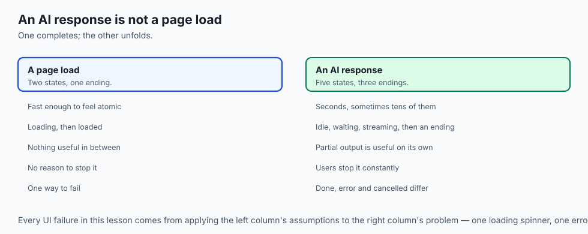

An AI response is not a page load. It is a long-running operation with five observable states, and the interface is the thing that renders each one honestly.

**Idle.** Nothing has been asked.

**Waiting.** The request is out and nothing has come back. The user has no evidence anything happened, so this is where interfaces feel broken. It needs a visible signal.

**Streaming.** Text is arriving. Every token should be visible as it lands — the whole point of streaming is that the user reads while the model writes.

**Done, Error, Cancelled.** Three different endings that are commonly collapsed into two, or one.

The design work is in the transitions and in what survives them. Three questions decide the quality of the result:

- How long is *waiting*, and what does it look like?
- When a stream breaks mid-answer, does the user keep what they had read?
- Can they stop it?

## Historical background

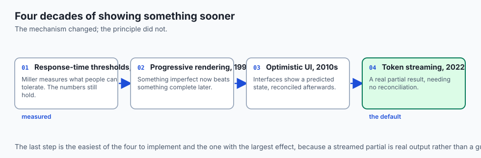

### Perceived versus actual performance, 1968 onward

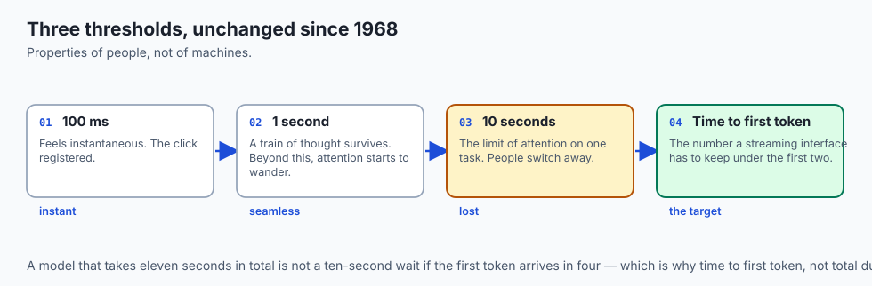

Robert Miller's 1968 work on response-time thresholds established the numbers still used today: roughly 100 ms feels instantaneous, one second keeps a train of thought, and ten seconds is the limit of attention. Nielsen restated them for the web in 1993. They have not changed, because they are properties of people rather than of machines.

### Progressive rendering, 1990s

Interlaced images and incremental HTML rendering established a principle the web has relied on ever since: **showing something imperfect immediately beats showing something complete later.** Streaming text is the same idea.

### Optimistic UI, 2010s

Client applications began rendering the expected result before the server confirmed it, reconciling afterwards. This normalised the idea that an interface shows a *predicted* state, not only a confirmed one — which is what a partially-streamed answer is.

### Streaming as the default for AI, 2022 onward

ChatGPT made token-by-token rendering the expected shape of an AI interface almost overnight. The underlying mechanism — server-sent events over a long-lived connection — was decades old; what was new was the expectation. An AI product that returns its answer in one block now reads as broken even when it is faster in total.

## What it is — and what it is not

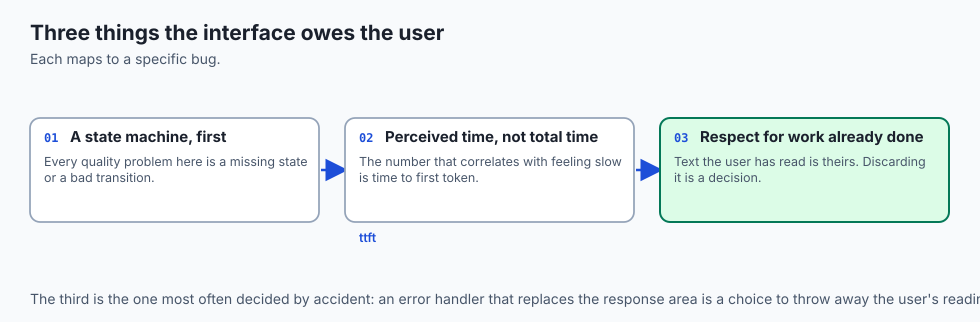

Frontend work for an AI system is designing and implementing the observable states of a slow, partial, interruptible operation.

### What it is

It is **a state machine** first and a stylesheet second. Every quality problem in this lesson is a missing state or a bad transition.

It is **about perceived time**. The number that correlates with feeling slow is time to first token, not total duration.

It is **about respecting work already done**. Text a user has read is theirs; discarding it because a later part failed is a design decision, and usually a poor one.

### What it is not

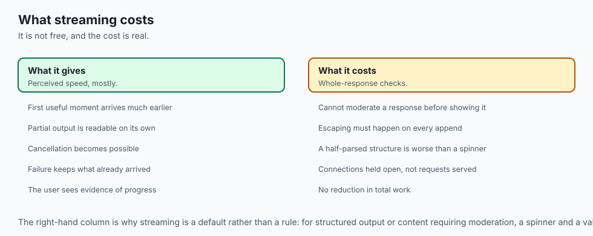

It is not a substitute for correctness. A beautifully streamed wrong answer is a wrong answer.

It is not only visual. Cancellation, partial retention and error semantics are behavioural, and they matter more than any amount of styling.

It is not free of accuracy consequences. Streaming makes it harder to validate a whole response before showing it, which is a real trade-off when output must be checked — one worth making deliberately rather than by default.

## Why it was created and what problems it solves

**The dead wait.** Nothing visible between request and response, so the user assumes failure and clicks again. *Solution: an explicit waiting state with a visible signal, and a measured time to first token.*

**The uninterruptible answer.** The user knows within two words that the answer is wrong and must wait for all of it. *Solution: cancellation as a first-class terminal state.*

**The discarded partial.** A stream fails at ninety percent and the interface replaces everything with an error. *Solution: keep what arrived and mark the answer incomplete.*

**Cancellation reported as failure.** The user stops the answer and the interface shows an error, implying something broke. *Solution: three distinct terminal states, not two.*

**Frames after the end.** A late token arrives after cancellation and text appears in a stopped response. *Solution: terminal states are terminal, enforced rather than assumed.*

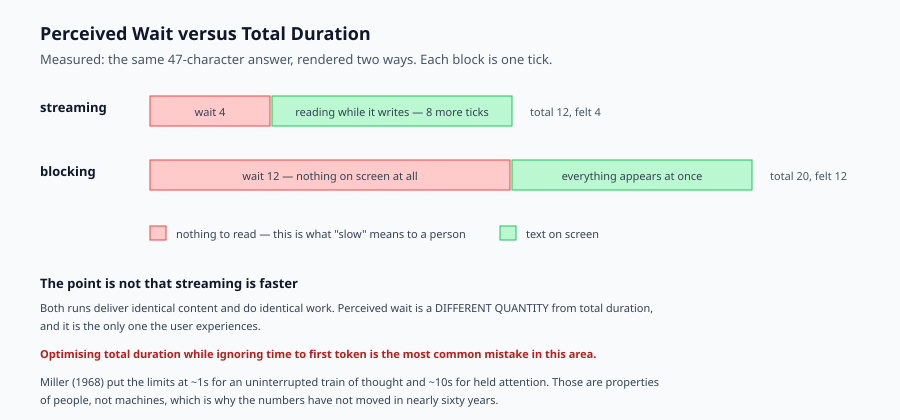

## How it works

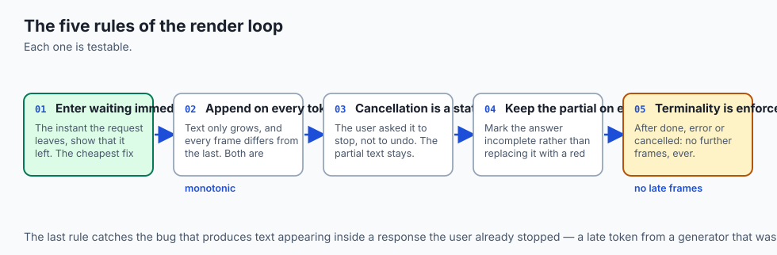

The interface drives a state machine and renders every frame it produces.

**Enter waiting immediately.** The instant the request leaves, show that it left. An unchanged screen is indistinguishable from a broken one, and this is the cheapest fix in the entire lesson.

**Append on every token.** Each arriving token extends the visible text. Two properties follow: the text only ever grows during streaming, and every frame differs from the last. Both are testable, and both are violated by the common bug of re-rendering from a buffer that has not been flushed.

**Make cancellation a state, not an exception.** The user asked it to stop, not to undo. The partial text stays, and the ending is `cancelled` rather than `error`.

**Keep the partial on error.** When the stream breaks, keep what arrived and say the answer is incomplete. The alternative discards reading the user has already done, in exchange for tidiness.

**Enforce terminality.** Once `done`, `error` or `cancelled` is reached, no further frames. This is the bug that produces text appearing in a response the user already stopped.

Measure two things. **Time to first token** is what the user experiences as speed. **Perceived wait** is the time spent with nothing to read — which equals time to first token when there is one, and the whole run when there is not.

## An everyday analogy

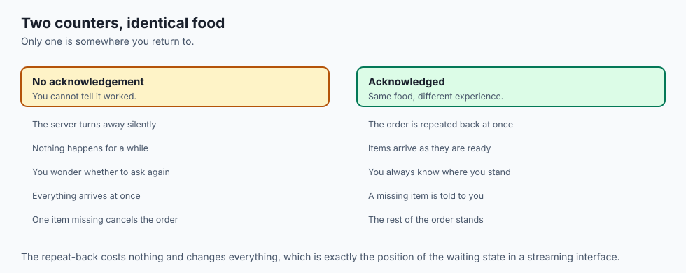

Think of ordering at a busy counter.

The bad version: you order, and the server turns away without acknowledgement. Nothing happens for a while. You cannot tell whether they heard you, whether the order is being made, or whether you should ask again. Eventually everything appears at once. Total time might be fine; the experience was not.

The good version: the server repeats your order back immediately — that is the waiting state, and it costs nothing. Items arrive as they are ready rather than all together. If something is unavailable they tell you *while keeping the rest of the order*, rather than cancelling everything. And if you change your mind, you can stop the remainder without abandoning what has already arrived.

The food is identical in both. Only one of them is somewhere you would go back to.

## Examples in practice

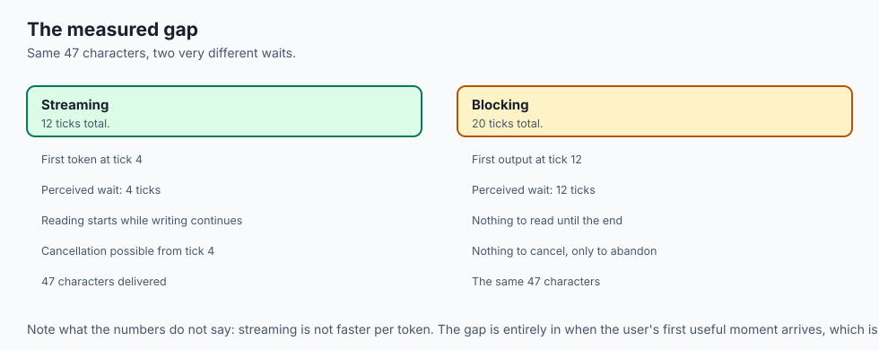

Here is the measured output from today's lab. The same eight-token answer, rendered five ways:

```text
--- streaming, healthy ---
t=0   idle      ''
t=1   waiting   ''  awaiting first token
t=3   waiting   ''  awaiting first token
t=4   streaming 'The '
t=5   streaming 'The refund '
...
t=12  done      'The refund window is thirty day...'
done after 12 ticks, ttft=4, 47 chars  perceived_wait=4

--- blocking (no partial output) ---
done after 20 ticks, ttft=12, 47 chars  perceived_wait=12
```

Same 47 characters. The streaming run takes 12 ticks in total and the user waits **4**. The blocking run takes 20 and the user waits **12** — three times longer with nothing to read.

That gap is the entire argument for streaming, and note what it is not: it is not that streaming is faster. It is that *perceived wait is a different quantity from total duration*, and only one of them is what people experience.

The failure cases are more interesting still:

```text
--- stream fails midway, partial kept ---
error after 8 ticks, ttft=4, 21 chars  perceived_wait=4

--- stream fails midway, partial discarded ---
error after 8 ticks, ttft=4, 0 chars   perceived_wait=4
```

Identical failures at an identical moment. One leaves the user with 21 characters they had already read; the other leaves them with nothing. The second is not more correct — it is the same failure, plus a decision to throw away the user's reading.

```text
--- cancelled by user ---
cancelled after 7 ticks, ttft=4, 18 chars  perceived_wait=4
```

And cancellation ends in its own state, keeping the partial text. An interface that reports this as an error is telling the user something broke when they were the one who stopped it.

## Implications: security, privacy, performance, scalability, and cost

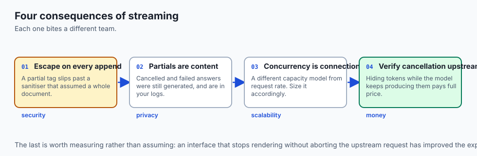

**Security.** Streamed content is rendered incrementally, which makes output escaping easy to get wrong — a partially-received tag can slip past a naive sanitiser that assumed a complete document. Escape on every append, never once at the end. Streaming also makes it harder to run a safety check over a whole response before showing any of it, which is a genuine trade-off for content that must be moderated.

**Privacy.** A partial answer left on screen after an error is still content: it belongs in whatever retention and logging rules cover complete answers. Cancelled responses too — the user stopped reading, but the tokens were generated and may be in your logs.

**Performance.** Streaming does not reduce total work. It moves the user's first useful moment much earlier, and that is the only performance number they experience.

**Scalability.** Streaming holds a connection open per active request, so concurrency is bounded by connections rather than by request rate. That is a different capacity model from ordinary request-response and needs sizing accordingly.

**Cost.** Cancellation saves real money if it actually stops generation upstream. An interface that hides the remaining tokens while the model keeps producing them has improved the experience and paid full price — worth verifying rather than assuming.

## Alternatives: free, open source, and commercial

**Server-sent events** — a web standard, no dependency, unidirectional, reconnects automatically. The default for token streaming and almost always sufficient.

**WebSockets** — bidirectional, which matters if the client sends during generation. More to operate; choose when you need the return path.

**HTMX** — BSD-licensed, supports SSE with almost no JavaScript. A good fit when the rest of the application is server-rendered.

**Vercel AI SDK** — Apache-2.0, handles streaming, cancellation and partial state for React and similar frameworks. Considerable work saved, and worth reading to see which of today's states it actually models.

**Streamlit** and **Gradio** — Apache-2.0, excellent for demos and internal tools. Both support streaming; both give you less control over the exact states, which is fine until it is not.

The honest default: server-sent events plus an explicit state machine you own. The states in this lesson are the ones you will need regardless of framework.

## Comparison with related concepts

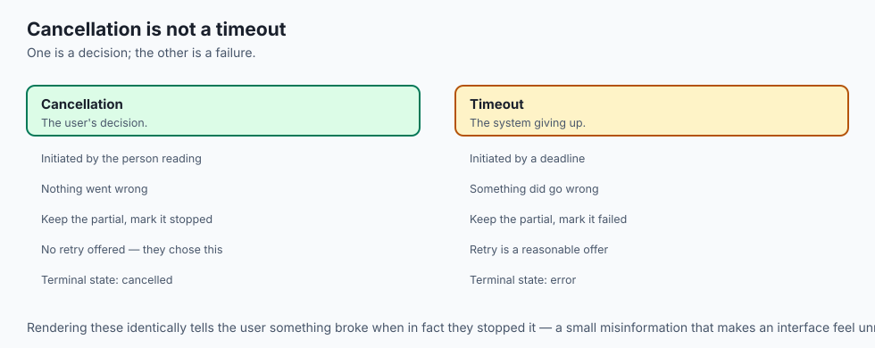

**Streaming versus polling.** Polling asks repeatedly; streaming keeps a connection and pushes. For token-by-token output, polling adds latency at every interval and wastes requests.

**Perceived versus actual latency.** Actual is what a stopwatch measures. Perceived is time spent with nothing to read. Optimising the first while ignoring the second is the most common mistake in this area.

**Cancellation versus timeout.** Cancellation is the user's decision, and is not a failure. A timeout is the system giving up, and is. Rendering them identically misinforms the user about what happened.

**Optimistic UI versus streaming.** Optimistic UI shows a *predicted* result before confirmation. Streaming shows a *real* partial result. Streaming needs no reconciliation, because nothing shown was ever a guess.

## When to use it — and when not to

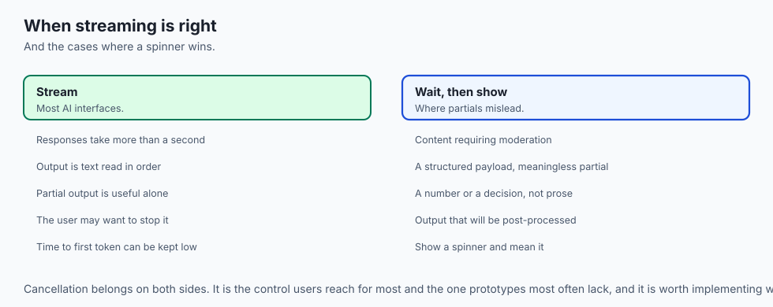

**Stream when** responses take more than about a second, when the output is text a person reads in order, or when partial output is useful on its own — which covers most AI interfaces.

**Do not stream when** the response must be validated as a whole before display, such as content requiring moderation or a structured payload that is meaningless until complete. A half-parsed JSON object shown to a user is worse than a spinner.

**Always implement cancellation**, whether or not you stream. It is the control users reach for most and the one prototypes most often lack.

## The AI connection

- **AI interfaces are where perceived latency became a design discipline.** A
  model that takes eleven seconds is not slow if the first token lands in four.

- **Streaming is the mechanism; the state machine is the design.** Day 340's
  server-sent events carry the tokens, but the five states decide the experience.

- **Cancellation is the control users reach for first**, and prototypes ship
  without it more often than with it.

- **Partial output is a genuinely new UI primitive.** Conventional request-response
  interfaces never had to decide what to keep when half an answer arrived.

- **Time to first token is now a product metric**, tracked alongside accuracy —
  and it is the one users actually feel.

## Knowledge check

1. A streaming run and a blocking run deliver identical text. Why does the streaming one feel faster?
2. Why should a failed stream keep the text that already arrived?
3. Why must cancellation be a distinct terminal state rather than an error?
4. What bug does enforcing terminality prevent?
5. Why does streaming make output escaping harder to get right?

## Hands-on exercise

You will implement the state machine behind a streaming interface, then measure what each decision costs the user. It runs offline with a logical clock, so the numbers are exact.

Open `starter/stream_ux.py` in the lab directory and implement the stubbed functions, then run the tests.

### Expected output

Running `python3 examples/stream_ux_demo.py` renders the same answer five ways. Abridged:

```text
--- streaming, healthy ---
t=0   idle      ''
t=1   waiting   ''  awaiting first token
t=4   streaming 'The '
t=12  done      'The refund window is thirty day...'
done after 12 ticks, ttft=4, 47 chars  perceived_wait=4
--- blocking (no partial output) ---
done after 20 ticks, ttft=12, 47 chars  perceived_wait=12
--- stream fails midway, partial kept ---
error after 8 ticks, ttft=4, 21 chars  perceived_wait=4
--- stream fails midway, partial discarded ---
error after 8 ticks, ttft=4, 0 chars  perceived_wait=4
--- cancelled by user ---
cancelled after 7 ticks, ttft=4, 18 chars  perceived_wait=4
```

Compare the first two lines of summary. Identical content, and a perceived wait of 4 against 12.

### Validate your work

Run `bash tests/run_tests.sh`. All sixteen tests must pass, grouped by property so a failure names what the user would feel.

Then check two things by inspection. During streaming, the text must only ever grow and every frame must differ from the last — a frame that repeats means you are re-rendering rather than appending. And no frame may follow a terminal state; if one does, a cancelled response can still gain text.

### Troubleshooting

**`perceived_wait` equals the total duration.** You are returning the final tick unconditionally. It should be the time to first token whenever there is one.

**The blocking run does not look worse.** You are measuring total duration rather than time to first token. They are different quantities, and only one is felt.

**A frame appears after `cancelled`.** Your loop continues after appending the terminal frame. Return immediately.

**The error case loses text that should be kept.** You are resetting the accumulated text on failure. Keep it unless `keep_partial_on_error` is false.

### Common mistakes

Treating cancellation as an error. The user stopped it; nothing broke.

Rendering nothing during waiting. An unchanged screen is indistinguishable from a broken one.

Measuring total duration and calling it latency.

Letting a late token append to a finished response.

## Practice assignment

Add a **reconnection** state. When a stream fails, attempt to resume once — keeping the text already received — and record the attempt in the transcript.

Then write two tests: one proving a successful resume produces a `done` ending with the complete text, and one proving a failed resume ends in `error` while still keeping everything received across *both* attempts. The second is the interesting case, because it is where partial text is easiest to lose.

## Extension challenge

Add **structured streaming**: the model emits JSON rather than prose, and the interface must decide what to show while the object is incomplete.

Implement a parser that renders only complete top-level fields, holding back anything partial, and measure how much later the first useful render happens compared with prose streaming.

Then answer the question the measurement raises: given that delay, is streaming structured output worth it for your capstone, or should it block until complete? Report your reasoning with the numbers. Either answer can be right; asserting one without measuring is what this challenge exists to prevent.
