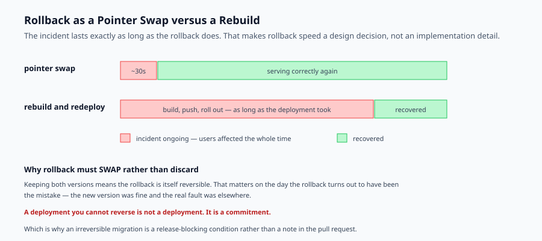

## Why this matters

There is a particular feeling that comes with a first deployment: the thing you built is now somewhere other than your laptop, and other people can reach it. It is genuinely satisfying, and it is also the moment the questions change.

They stop being "does it work?" and become "what happens when it does not?"

Because it will not, eventually. A dependency will be unreachable. A configuration value will be missing in the environment you did not test. A model provider will return errors for eleven minutes. A change that was fine locally will be wrong against real data. None of that is a failure of care — it is the normal condition of running software.

What separates a system you can operate from one that operates you is not the absence of failure. It is whether you can **see** it, **stop** it, and **reverse** it.

That is what today builds: gates that refuse a bad build before it ships, health checks that tell the truth about whether the thing actually works, a canary that risks a fraction of traffic rather than all of it, and a rollback that is a data operation rather than a rebuild.

None of it is exotic. All of it is the difference between a bad ten minutes and a bad afternoon.



## The idea in plain language

A deployment is a sequence of gates, each of which can say no. The design principle is that **a failure should be caught by the earliest gate that could possibly catch it**, because cost rises sharply at every step.

**Preflight** runs before anything ships. Did tests pass, is the migration reversible, are the secrets present, is the image pinned. Failing here costs nothing.

**Health** runs after the new version starts. It answers a question people routinely get wrong: not "is the process running?" but "can it actually serve?" Failing here costs a rollback and no user impact.

**Canary** sends a small fraction of real traffic to the new version and watches. Failing here costs a rollback and a small amount of user impact.

**Promotion** moves everything across. Failing after here costs a real incident — which is why the earlier gates exist.

And underneath all of them: **rollback must be a data operation.** Swapping which artefact is live takes seconds. Rebuilding takes as long as the deployment did, and the incident continues throughout.

## Historical background

### Deployment as an event, 1990s

Releases were quarterly, manual, and performed at night by someone with a runbook. The rarity was self-reinforcing: because deploying was risky, you did it seldom; because you did it seldom, each one carried more change and was riskier still.

### Continuous delivery, 2010

Humble and Farley's *Continuous Delivery* argued the opposite: deploy small changes often, and make the pipeline itself the thing you trust. The insight that matters here is that **small deployments are safer**, because the diff you are bisecting when something breaks is small.

### Blue-green and canary releases, 2010s

Two environments, one live; switch traffic to release, switch back to roll back. Canary refined it by shifting a fraction first. Both reframed rollback from "restore from backup" to "change a pointer" — which is the reframing this lesson turns on.

### Progressive delivery and error budgets, 2016 onward

Google's SRE practice supplied the vocabulary for deciding automatically: an error budget makes "is this release healthy?" a measurable question with a stated threshold rather than a judgement call made under pressure at 2 a.m.

### AI systems in production, 2023 onward

AI deployments added properties conventional web services do not have. Startup is slow because models load. Failures are often partial and probabilistic rather than binary. Cost is per request, so a bad release can be expensive as well as broken. And model providers are a dependency you do not control, which makes readiness checks more important rather than less.

## What it is — and what it is not

Deployment is the controlled process of replacing a running version with a new one, with the ability to stop and reverse at every stage.

### What it is

It is **a sequence of decisions**, each made on stated evidence rather than on judgement under pressure.

It is **reversible by construction**. Every gate assumes rollback is available, which is why an irreversible migration blocks the whole path.

It is **routine**. A deployment that is an event is a deployment that happens rarely, carries more change, and is riskier.

### What it is not

It is not the same as release. Deploying puts code in production; releasing exposes it to users. Feature flags separate them, and that separation is what lets you deploy on a Friday.

It is not solved by a platform. Kubernetes, Fly.io and Cloud Run all deploy things. None of them decides what "healthy" means for your system — that is yours.

It is not finished at promotion. Monitoring is tomorrow, and the two are halves of the same job.

## Why it was created and what problems it solves

**Bad builds reach production.** *Solution: preflight gates that are cheap now and expensive later — tests, reversible migrations, present secrets, a pinned image digest.*

**"It's running" mistaken for "it works."** A container starts, the orchestrator reports green, and every request fails because the model never loaded or a dependency is unreachable. *Solution: separate liveness from readiness, and check dependencies.*

**All traffic at once.** A release with a subtle problem affects everyone before anyone notices. *Solution: a canary at a small percentage with a decision rule.*

**Rollback that is a rebuild.** The incident lasts as long as a full deployment. *Solution: keep the previous artefact live-able and swap a pointer.*

**Deciding under pressure.** Nobody makes good judgements at 2 a.m. *Solution: an error budget, agreed in advance, so the decision is arithmetic.*



## How it works

**Preflight.** Collect every reason not to deploy, and report all of them rather than stopping at the first — a build with three problems should tell you three things, not send you round the loop three times.

The condition that deserves special attention is **reversibility of migrations**. Every other gate assumes rollback is possible. A migration that drops a column removes that assumption, and with it the safety of every subsequent step. If you take one habit from today, it is to treat "can this be undone?" as a release-blocking question.

**Deploy and check health.** Start the new version and ask two different questions. *Liveness*: is the process alive? *Readiness*: can it serve — model loaded, index warm, dependencies reachable? A system that is live but not ready is the most common way a deployment goes green while being completely broken.

**Canary.** Route a small percentage of real traffic and measure. Decide on **evidence, not elapsed time**: "it has been up ten minutes" is a different claim from "its error rate is within budget", and only the second is about correctness.

**Promote or roll back.** Within budget, move to 100 percent and record the previous version. Over budget, return traffic to the old version immediately.

**Rollback.** Swap which version is live. Keep the old one — a rollback that discards it cannot itself be undone, which matters when the rollback was the mistake.

## An everyday analogy

Think of a restaurant changing its menu.

The reckless version: print the new menus, replace every old one, and find out during service that the new supplier cannot deliver. Now nothing can be served, and the old menus are in the recycling.

The professional version has gates. Before printing, check the suppliers exist and the kitchen can make the dishes — that is preflight, and it costs a phone call. Then cook one of each new dish for staff before anyone orders — that is a readiness check, and it answers "can we actually make this?" rather than "is the kitchen open?" Then offer the new menu on a few tables and watch what comes back — the canary. Only then replace every menu.

And keep the old menus. Not in the recycling. Somewhere you can reach in thirty seconds, because the difference between a bad night and a ruined one is entirely whether you can go back.

## Examples in practice

Here is the measured output from today's lab — five deployments, each stopping at a different gate:

```text
--- clean release ---
  deploying    rolling out v1.1.0
  canary       10% of traffic
  promoted     v1.1.0 at 100%
  => promoted live=v1.1.0 traffic_to_new=100%

--- irreversible migration ---
  blocked      migration is not reversible
  => blocked live=v1.0.0 traffic_to_new=0%

--- starts but cannot serve ---
  deploying    rolling out v1.1.0
  rolled_back  health check failed: readiness
  => rolled_back live=v1.0.0 traffic_to_new=0%

--- canary exceeds error budget ---
  deploying    rolling out v1.1.0
  canary       10% of traffic
  rolled_back  error rate 9.0% exceeds budget 2.0%
  => rolled_back live=v1.0.0 traffic_to_new=0%
```

Read the cost gradient down that list. The irreversible migration was caught before anything shipped — nothing deployed, no user saw anything. The readiness failure cost a rollout and a rollback, still with no user impact. The canary failure reached 10 percent of real traffic before being caught, so some users saw errors.

The same defect caught at each of those points costs a different amount, and that is the entire argument for having several gates rather than one good one.

Note also what the third case demonstrates. The process **started successfully** — liveness was fine. Readiness was not, so it could not serve. A deployment system that only checks liveness reports that release as healthy and leaves it serving errors to everyone.

And the rollback:

```text
  promoted: promoted live=v1.1.0 traffic_to_new=100%
  rolled_back  back to v1.0.0
  => rolled_back live=v1.0.0 traffic_to_new=0%
```

One operation, no rebuild. And because it swaps rather than discards, rolling back again returns to `v1.1.0` — which matters on the day the rollback turns out to have been the mistake.

## Implications: security, privacy, performance, scalability, and cost

**Security.** Pinning the image to a digest rather than a tag is a supply-chain control: `latest` is mutable and can point at something you did not build. Secrets belong in the environment, never in the image — an image is a distributable artefact and anything inside it travels with it.

**Privacy.** A new version may log differently. A deployment is the moment new fields start being captured, so it is the right time to check what the logs will now contain.

**Performance.** AI services start slowly because models load. Readiness must account for that or the orchestrator will kill a container that was simply still warming up, producing a restart loop that looks like a crash.

**Scalability.** A canary needs enough traffic for its error rate to mean anything. At low volume, ten percent of traffic may be three requests, and three requests cannot distinguish a two percent error rate from a nine percent one. Below a certain scale, canary is theatre and a fast rollback is the real control.

**Cost.** Running two versions during a canary costs roughly double for the overlap. A bad AI release can also be expensive rather than merely broken — a change that doubles context length doubles the bill, silently, and a cost check belongs in preflight alongside the tests.

## Alternatives: free, open source, and commercial

**Docker Compose on a single host** — free, no orchestrator, and entirely adequate for a capstone. Rollback is `docker compose up` with the previous image tag.

**Kubernetes** — Apache-2.0, with rolling updates, readiness probes and `kubectl rollout undo` built in. Powerful, and a substantial operational commitment for one service.

**Nomad** — MPL-2.0, considerably simpler than Kubernetes for a small number of services.

**Fly.io, Railway, Render** — managed platforms with generous free tiers, health checks and one-command rollback. For a capstone these are usually the right answer: they remove the parts that are not what you are learning.

**Cloud Run** and equivalents — scale to zero, so an idle capstone costs nothing, with traffic splitting for canaries built in.

**Argo Rollouts** and **Flagger** — Apache-2.0, progressive delivery for Kubernetes with automated analysis and rollback. The right tool once you have the scale to need it.

The honest default for a capstone: a managed platform with health checks and one-command rollback. The gates in this lesson are yours regardless of what runs them.

## Comparison with related concepts

**Deployment versus release.** Deploying puts code in production; releasing exposes it. Feature flags separate them, which is what makes deploying frequently safe.

**Blue-green versus canary.** Blue-green switches all traffic at once between two complete environments — simple, and no partial exposure. Canary shifts gradually, catching problems with less blast radius at the cost of running two versions and needing enough traffic to measure.

**Liveness versus readiness.** Liveness answers "should this be restarted?" Readiness answers "should this receive traffic?" Using one probe for both is why systems get restarted while merely warming up, and why broken systems keep receiving requests.

**Rollback versus roll-forward.** Rollback returns to the last known-good state. Roll-forward fixes and deploys again. Rollback is almost always right during an incident: it is faster, and it is the option you already know works.

## When to use it — and when not to

**Build the full path when** the system has users who will notice, when a failure costs something, or when more than one person can deploy — in which case the gates are also how they agree on what "ready" means.

**Simplify when** the capstone is a demonstration with no live users. Preflight and rollback are still worth having, because they are cheap. A canary over three requests is not measuring anything.

**Never skip rollback.** It is the cheapest of all these controls and the one that determines how bad a bad day gets. A deployment you cannot reverse is not a deployment — it is a commitment.

## Knowledge check

1. Why does an irreversible migration block the entire release path rather than just its own step?
2. A container starts and the orchestrator reports it healthy, but every request fails. Which check was missing?
3. Why should a canary decide on error rate rather than on elapsed time?
4. Why must rollback swap versions rather than discard the one being replaced?
5. Why is a canary close to meaningless on a low-traffic service, and what should you rely on instead?

## Hands-on exercise

You will implement the release path — preflight, health, canary, promotion and rollback — and watch the same defect cost different amounts depending on which gate catches it.

Open `starter/release.py` in the lab directory and implement the stubbed functions, then run the tests.

### Expected output

Running `python3 examples/release_demo.py` runs five deployments and one rollback. Abridged:

```text
--- clean release ---
  deploying    rolling out v1.1.0
  canary       10% of traffic
  promoted     v1.1.0 at 100%
--- irreversible migration ---
  blocked      migration is not reversible
--- starts but cannot serve ---
  rolled_back  health check failed: readiness
--- canary exceeds error budget ---
  rolled_back  error rate 9.0% exceeds budget 2.0%
--- rollback after a bad promotion ---
  rolled_back  back to v1.0.0
```

Notice how far each failure travelled before being caught. The migration never deployed. The readiness failure deployed but served nobody. The canary failure reached ten percent of real traffic.

### Validate your work

Run `bash tests/run_tests.sh`. All seventeen tests must pass, grouped by gate so a failure names which one let a bad build through.

Then check two things by inspection. A blocked build must leave `live_version` unchanged and `traffic_to_new` at zero — a preflight failure deploys nothing at all. And rolling back twice must return to the newer version, because rollback swaps rather than discards.

### Troubleshooting

**A blocked build still changes the live version.** You are raising after mutating. Collect the blockers and return before touching any state.

**Preflight reports only one problem.** You are returning at the first failure. Accumulate them all; three problems should mean one trip round the loop, not three.

**A failed health check still reaches canary.** You are checking health after routing traffic. Check before.

**Rolling back twice does nothing the second time.** You are setting `previous_version` to `None` instead of swapping. Swap both, so the operation is itself reversible.

### Common mistakes

Treating liveness and readiness as the same check. They answer different questions and have different consequences.

Deciding on elapsed time. "It's been up ten minutes" says nothing about correctness.

Discarding the old version at promotion, which makes rollback impossible exactly when it is needed.

Letting an unpinned image tag through preflight. `latest` is mutable, and mutable means someone else can change what you deploy.

## Practice assignment

Add a **cost gate** to preflight. Give each build an estimated cost per thousand requests, and block a release whose cost has risen by more than a stated percentage against the currently live version.

Then write two tests: one proving a large cost increase blocks the release, and one proving a small increase does not. This matters because an AI release can be perfectly correct and still be a problem — a change that doubles context length breaks nothing and doubles the bill, and no functional test will notice.

## Extension challenge

Implement **automatic canary analysis over a traffic window**. Rather than a single error rate, feed the canary a sequence of per-minute samples, and decide using both a threshold and a minimum sample count.

Then find and report the point at which the analysis becomes untrustworthy: at what request volume can it no longer distinguish a two percent error rate from a nine percent one with any confidence?

Report the real number for your parameters. It will be larger than you expect, and it is the honest answer to why canaries are ineffective on low-traffic services — the sample simply is not there, no matter how carefully the threshold is chosen.
