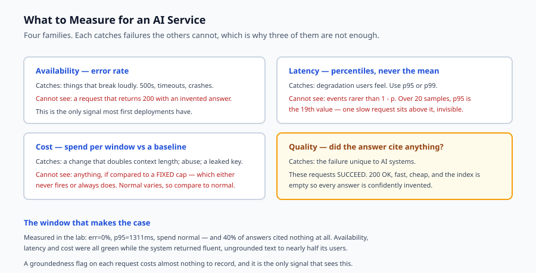

## Why this matters

Yesterday you deployed. The gates held, the canary passed, traffic moved across. The system is live.

Now consider the question that decides whether it stays that way: **how will you find out when something is wrong?**

The honest answer for most first deployments is "a user will tell me". That works while there is one user who is also the author. It stops working immediately afterwards, and it fails in a particular way for AI systems, because the most damaging failures do not look like failures.

A conventional service tells you it is broken. It returns 500s, connections time out, the error rate climbs, and any dashboard shows it. An AI service can return 200 for every request, with a p50 of 400 ms, and be completely broken — because the retrieval index is empty and every answer is confidently invented. Availability is perfect. Latency is excellent. The product does not work.

That is the gap this lesson is about. You need availability monitoring, and it is not sufficient, and knowing what to add is most of the skill.



## The idea in plain language

Monitoring an AI system means watching four families of signal, and each catches failures the others cannot.

**Availability.** Error rate. Catches things that break loudly.

**Latency.** Percentiles, never the mean. A long-tailed distribution has an unremarkable average and a terrible p95, and users experience the tail.

**Cost.** Spend per window, compared against what normal looked like. Unique to metered systems, and the one most often discovered monthly rather than immediately.

**Quality.** Did the answer cite anything? Was it grounded in retrieved context? These requests **succeed**, so nothing else notices them.

Two principles govern how you use them.

**Alert on symptoms, not causes.** "p95 latency exceeds four seconds" is something a user feels. "Cache hit rate dropped" may be entirely fine — and an alert that fires when nothing is wrong is worse than no alert, because it teaches people to ignore the channel.

**Compare against a baseline where normal varies.** A fixed spend cap is either always breached or never useful. What you want to know is that this window is many times the recent norm.

## Historical background

### From checks to time series, 1990s–2000s

Nagios-style monitoring asked binary questions on a schedule: is the port open, is the disk full. It caught outages and could not describe degradation. Graphite and later Prometheus reframed monitoring around time series, which made it possible to ask how something was *trending* rather than only whether it was up.

### The four golden signals, 2016

Google's SRE book named latency, traffic, errors and saturation as the signals worth watching for a user-facing service. The framing that mattered most was **symptom-based alerting**: page on what users experience, not on internal causes, because causes are numerous and mostly harmless.

### Error budgets and SLOs

The same tradition supplied the mechanism for deciding without argument. A service level objective plus an error budget turns "is this bad enough to act on?" into arithmetic agreed in advance rather than a judgement made at 3 a.m. by whoever is awake.

### LLM observability, 2023 onward

Tools such as Langfuse, Phoenix and LangSmith added what the golden signals do not cover: token counts, cost per trace, retrieval hit rates and groundedness scores. The recognition driving all of them is that for an AI system, **a successful request can still be a failure**, and no amount of availability monitoring will say so.

## What it is — and what it is not

Monitoring is the practice of measuring a running system so that problems are noticed by you rather than reported by users.

### What it is

It is **four signal families**, because no one of them sees everything.

It is **symptom-oriented**. Alerts describe what a user would notice; dashboards hold the causes you consult afterwards.

It is **statistical**. Percentiles, baselines and sample sizes, because single observations mean nothing and averages mislead.

### What it is not

It is not logging. Logs are for investigating a known problem. Metrics are for noticing an unknown one. Both are needed, for different jobs.

It is not a dashboard. A dashboard nobody is looking at detects nothing. The alert is the detection; the dashboard is where you go once it fires.

It is not free of judgement. Every threshold encodes a decision about what is acceptable, and pretending otherwise leads to thresholds nobody can defend.

## Why it was created and what problems it solves

**Users are the monitoring.** *Solution: symptom alerts on signals a user would feel.*

**The mean hides the tail.** Nineteen fast requests and one nine-second one has a fine average. *Solution: percentiles.*

**Successful requests that are useless.** Every response is a 200 and every answer is ungrounded. *Solution: a quality signal measured alongside availability.*

**Spend discovered monthly.** A change doubles context length and nothing notices until the invoice. *Solution: spend per window against a rolling baseline.*

**Alert fatigue.** One failure in three requests is a 33 percent error rate, and paging on it teaches people to ignore pages. *Solution: a minimum sample size before a window is judged at all.*



## How it works

**Bucket requests into windows.** Fixed slices of time, each with its own metrics. A window is the unit of judgement.

**Compute percentiles with nearest rank.** Use `ceil(p/100 × n)`, not `round` — Python rounds halves to even, which quietly picks the wrong observation.

There is a property of percentiles worth knowing before an incident rather than during one: **a percentile can only see events more frequent than 1 − p.** Over twenty samples, p95 is the nineteenth value, so a single slow request sits above the percentile entirely and is invisible to it. p99 over the same twenty would see it. Choose the percentile to match what you need to catch, and make sure the window is large enough to contain enough of those events to register.

**Refuse to judge small windows.** Below a minimum sample count, report insufficient data rather than an alert. This is the single most effective anti-fatigue measure available.

**Evaluate rules against budgets.** Latency against an SLO, errors against a budget, groundedness against a quality budget, spend against a rolling baseline.

**Use a median for the baseline, not a mean.** One anomalous window should not raise the baseline enough to hide the next one — which is exactly how a spend alert stops firing after the first incident, at the point it is needed most.

## An everyday analogy

Think of the instruments in a car.

The speedometer is availability: it tells you the obvious thing, immediately.

The temperature gauge is latency percentiles. Average temperature over the journey is useless; what matters is whether it spiked, because a brief spike is what damages the engine.

The fuel gauge is cost. It is not enough to know the tank was full when you left; you need to know the rate you are consuming, because a leak looks fine until it does not.

And the missing instrument is quality. Nothing on the dashboard tells you that you are driving efficiently, comfortably, or *to the right destination*. Every gauge can read perfectly while you drive confidently in the wrong direction.

That last one is the AI-specific failure. Availability green, latency green, cost green, and every answer invented.

## Examples in practice

Here is the measured output from today's lab — twenty-five minutes of traffic with three problems buried in it:

```text
[  0-5  ) n=20  p50=678   p95=1253   err=0% ungrounded=0% spend=$0.0300
  OK    healthy: all signals within budget
[  5-10 ) n=20  p50=906   p95=1434   err=0% ungrounded=0% spend=$0.0300
  OK    healthy: all signals within budget
[ 10-15 ) n=20  p50=5470  p95=8573   err=0% ungrounded=0% spend=$0.0300
  PAGE  latency_slo: p95 8573ms exceeds 4000ms
[ 15-20 ) n=20  p50=738   p95=1311   err=0% ungrounded=40% spend=$0.0300
  WARN  ungrounded_answers: 40% of answers cited nothing
[ 20-25 ) n=20  p50=968   p95=1365   err=0% ungrounded=0% spend=$0.4000
  PAGE  cost_anomaly: spend $0.4000 is 13.3x the $0.0300 baseline
```

Three different problems, each caught by a different signal, and **the error rate is zero in every window**. Not one of these would have been noticed by availability monitoring.

The fourth window is the one worth sitting with. Latency is fine. Errors are zero. Spend is normal. Forty percent of answers cited nothing at all — the system was returning fluent, confident, ungrounded text to nearly half its users, and every conventional dashboard showed green.

The fifth shows why baselines matter. Spend of $0.40 in a window is not obviously wrong in isolation; it is obviously wrong at 13.3× the recent norm. A fixed threshold would have to be set so high it never fires, or so low it always does.

## Implications: security, privacy, performance, scalability, and cost

**Security.** A cost anomaly is often the first sign of abuse — a scripted client, a prompt injection inducing recursive tool calls, a leaked key. Spend monitoring is a detection control, not only a budgeting one.

**Privacy.** Traces are the highest-risk store in most AI systems: they capture full prompts and completions, they are retained longest, and they are examined least. Metrics are aggregates and are usually safe; traces are personal data and need the retention and deletion path from Day 328.

**Performance.** Metrics collection must be cheap and off the request path. Aggregating percentiles per window rather than storing every observation keeps memory bounded, which matters more than it sounds at volume.

**Scalability.** Cardinality is the thing that kills metrics systems. A label per user or per document identifier produces millions of series and an unusable, expensive backend. Keep labels to a small bounded set.

**Cost.** Monitoring costs money — ingestion, storage, retention. It is nearly always worth it, and it is worth choosing the retention period deliberately rather than accepting a default that stores full traces for a year.

## Alternatives: free, open source, and commercial

**Prometheus** with **Grafana** — Apache-2.0 and AGPL respectively. The standard open-source pairing for metrics and dashboards. No AI-specific concepts; you define them.

**OpenTelemetry** — Apache-2.0, a vendor-neutral standard for traces and metrics with a growing set of generative-AI conventions. Instrumenting to it avoids committing to a backend.

**Langfuse** — MIT, self-hostable, purpose-built for LLM applications: traces, token counts, cost per trace and evaluation scores.

**Arize Phoenix** — Elastic-licensed, strong on retrieval evaluation and drift, and runs locally.

**Grafana Cloud, Datadog, Honeycomb** — managed, with free tiers that are adequate for a capstone. Datadog and Honeycomb have LLM-specific views.

The honest default for a capstone: log structured request records yourself, aggregate them exactly as this lab does, and add Langfuse or OpenTelemetry when the volume justifies a backend. The signals matter more than the tool, and you can compute all four with a dictionary and a sort.

## Comparison with related concepts

**Monitoring versus observability.** Monitoring watches signals you decided to watch. Observability is the ability to ask questions you did not anticipate. Metrics give the first; traces give the second.

**Metrics versus logs versus traces.** Metrics are cheap aggregates for noticing. Logs are records for investigating. Traces follow one request through every stage, and are how you find where the four seconds went.

**SLO versus SLA.** An objective is an internal target you use to decide. An agreement is a contract with consequences. The objective should be stricter, so you notice before anyone can claim against you.

**Alerting versus dashboards.** Alerts detect; dashboards diagnose. A dashboard nobody is watching detects nothing, and an alert nobody trusts is worse than none.

## When to use it — and when not to

**Instrument all four signals when** the system has users other than you, when spend is externally triggered, or when a silent quality failure would matter — which is essentially every AI system with real users.

**Start smaller when** the capstone is a demonstration. Even then, log structured records from day one: you cannot analyse traffic you did not capture, and adding the field later does not backfill it.

**Always measure quality.** It is the signal conventional monitoring does not have, it is the one that catches the failure mode unique to these systems, and a groundedness flag on each request costs almost nothing to record.

## Knowledge check

1. A window shows zero errors, good latency and normal spend, and the system is broken. What signal is missing, and what does it catch?
2. Why does a percentile over twenty samples fail to see a single slow request, and what follows for choosing one?
3. Why should a spend baseline be a median of recent windows rather than a mean?
4. Why refuse to evaluate alerts on a window with very few requests?
5. Why is alerting on cache hit rate usually a mistake?

## Hands-on exercise

You will build windowed metrics, alert rules and cost anomaly detection, then run them over traffic with three problems hidden in it.

Open `starter/monitoring.py` in the lab directory and implement the stubbed functions, then run the tests.

### Expected output

Running `python3 examples/monitoring_demo.py` evaluates five windows:

```text
[  0-5  ) n=20  p50=678   p95=1253   err=0% ungrounded=0% spend=$0.0300
  OK    healthy: all signals within budget
[ 10-15 ) n=20  p50=5470  p95=8573   err=0% ungrounded=0% spend=$0.0300
  PAGE  latency_slo: p95 8573ms exceeds 4000ms
[ 15-20 ) n=20  p50=738   p95=1311   err=0% ungrounded=40% spend=$0.0300
  WARN  ungrounded_answers: 40% of answers cited nothing
[ 20-25 ) n=20  p50=968   p95=1365   err=0% ungrounded=0% spend=$0.4000
  PAGE  cost_anomaly: spend $0.4000 is 13.3x the $0.0300 baseline
```

The error rate is zero in every window. Three real problems, none of them visible to availability monitoring.

### Validate your work

Run `bash tests/run_tests.sh`. All twenty-two tests must pass, grouped by signal so a failure names which alert stopped working.

Then check two behaviours by inspection. A window of two failed requests must report `insufficient_sample` rather than paging — a 100 percent error rate over two requests is not evidence. And a window with a spend spike must produce no cost alert when there is no baseline, because a first window has nothing to compare against.

### Troubleshooting

**Every small window pages.** You are evaluating rules before checking the sample size. Return the insufficient-sample result first.

**The p50 of `[1,2,3,4,100]` is 2.** You used `round`. Nearest rank needs `ceil`.

**The cost alert stops firing after the first spike.** Your baseline is a mean, so the spike raised it. Use a median.

**A window with no requests raises.** Empty is a normal state, especially at the edges of a traffic period. Guard every denominator.

### Common mistakes

Reporting means instead of percentiles, which makes a long tail invisible.

Alerting on causes — cache hit rate, retrieval latency — that may be entirely fine on their own.

Using a fixed spend threshold where normal varies, so it either never fires or always does.

Not recording a quality signal at all, which leaves the one AI-specific failure mode unmonitored.

## Practice assignment

Add **burn-rate alerting** on the error budget. Rather than alerting whenever the budget is exceeded in one window, alert when the *rate of consumption* implies the monthly budget will be exhausted early — a fast burn over a short window pages, a slow burn over a long one warns.

Then write two tests: one where a brief severe spike pages, and one where a mild elevation sustained for many windows warns without paging. The second is the case single-window alerting misses entirely, and it is how slow degradation goes unnoticed for weeks.

## Extension challenge

Add **cardinality protection** to the metrics. Allow labels on requests — model, endpoint, tenant — but enforce a maximum number of distinct label combinations, collapsing anything beyond it into an `other` bucket.

Then demonstrate the failure you are preventing: generate traffic with a label per user, show how many series that produces, and show your protection holding the count bounded.

Report the real numbers. Unbounded cardinality is the most common way a metrics system becomes unusable and expensive, and it is invisible until the bill or the query timeouts arrive.
