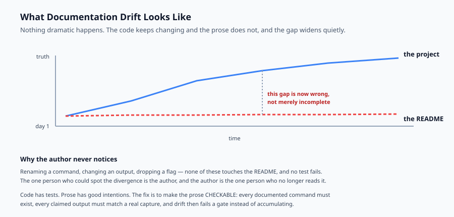
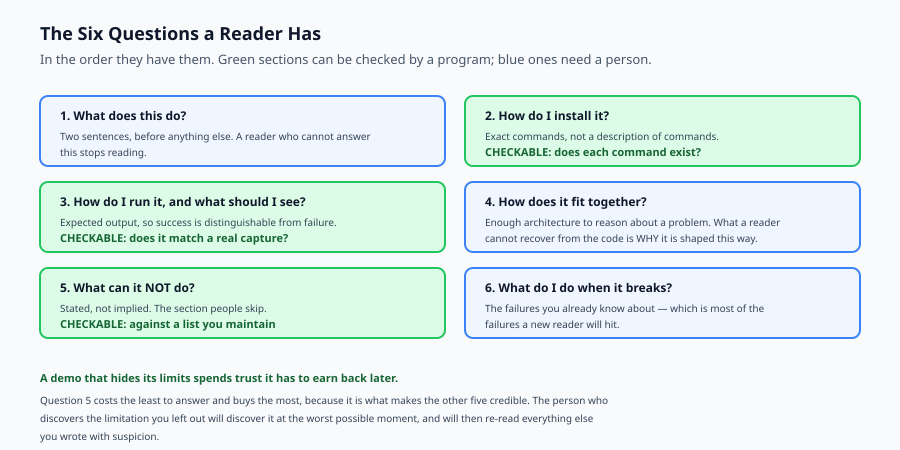

## Why this matters

Your capstone is deployed, monitored and reviewed. It works, and you know it works, because you built it.

Nobody else knows that.

The distance between "this works" and "someone else can tell it works" is documentation and a demo, and both are usually done last, quickly, by the person least able to see what is missing. You cannot un-know how your own system fits together. Every assumption you no longer notice is a gap a reader will fall into, and the reader has no way to distinguish a gap from a mistake.

Then there is the failure that is worse than a gap: documentation that is confidently wrong. A README describing a command that was renamed six months ago is not merely unhelpful — it actively wastes the reader's time and teaches them not to trust the rest of the document.

That failure has a specific cause. Documentation drifts because **nothing checks it**. Code has tests; prose has good intentions. The person who would notice the drift is the one person who no longer reads the README.

Today you make documentation checkable, so the drift fails a gate rather than accumulating.



## The idea in plain language

A README answers six questions a new reader has, in the order they have them:

**What does this do?** In two sentences, before anything else.

**How do I install it?** Exact commands, not a description of commands.

**How do I run it, and what should I see?** The expected output, so they can tell success from failure.

**How does it fit together?** Enough architecture to reason about a problem.

**What can it not do?** Stated, not implied.

**What do I do when it breaks?** The failures you already know about.

Four of those can be checked mechanically. Every documented command should exist in the project. Every claimed output should match what was actually captured. Required sections should be present. There should be no placeholder text.

The fifth — limitations — can be checked against a list you maintain. And that is the one people skip, because a demo feels stronger without it. It is not: **a demo that hides its limits spends trust it has to earn back later**, and the person who discovers the limit will discover it at the worst possible moment.

## Historical background

### Literate programming, 1984

Knuth proposed writing programs as documents with code embedded, on the principle that the explanation and the implementation should not be separate artefacts that can disagree. The idea did not take over, and its central observation — that separation permits divergence — is exactly the problem this lesson addresses.

### Docs as code, 2010s

Documentation moved into the repository, reviewed in pull requests and built by the same pipeline. This made documentation *reviewable*, which is a large improvement, and it did not make it *verifiable*: a reviewer can tell whether prose is clear, not whether it is still true.

### Doctests and executable documentation

Python's `doctest`, Rust's documentation tests and similar tools closed part of the gap by running the examples in the docs. Where they apply they are excellent, because a wrong example fails a build. Their limit is that they cover code examples rather than commands, architecture or claims about behaviour.

### README conventions

The community converged on a familiar shape — badges, install, usage, contributing — and on standards such as Keep a Changelog. Convention helps readers know where to look. It does nothing about accuracy.

## What it is — and what it is not

Documentation for a capstone is the artefact that lets another person install, run, understand, and know the boundaries of what you built.

### What it is

It is **for a specific reader**: someone competent who has never seen this project. Not you, and not an expert in the domain.

It is **verifiable in part**. Commands, outputs, sections and placeholders can be checked by a program.

It is **an honest account**, including what does not work.

### What it is not

It is not a description of the code. A reader can read the code. What they cannot recover from the code is *why* it is shaped this way and what you already know is wrong with it.

It is not exhaustive. A complete document nobody reads is worth less than a short one they do.

It is not a marketing page. A demo that oversells is a demo that gets found out, usually in front of the people it was meant to impress.

## Why it was created and what problems it solves

**Commands drift.** A command is renamed and the README keeps the old name. *Solution: check every documented command exists in the project.*

**Outputs drift.** The output changes and the README shows what it used to print, so a reader cannot tell success from failure. *Solution: check claimed output against captured output.*

**Sections are missing.** No architecture section, so the first real question has no answer. *Solution: a required-section list.*

**Placeholders ship.** Unfinished writing reaches a reader, who now knows the document was abandoned partway. *Solution: fail on a list of placeholder markers.*

**Limitations stay in the author's head.** *Solution: keep a list of known limitations, and check each one is stated.*



## How it works

Treat the project as a small set of facts: the commands it provides, the outputs actually captured from running them, and the limitations you know about. Then check the README against those facts.

**Extract commands from fenced blocks.** Only blocks tagged as a shell language are instructions; an untagged block is output. That distinction matters more than it sounds — without it, a checker reads captured output back as commands and reports the document's own examples as unknown. This lab had exactly that bug before the tests caught it.

**Match claimed outputs to commands.** Adopt a small convention: a line ending in `->` names the command, and the block after it is what that command printed. A convention that makes a claim machine-checkable is worth adopting even if it looks slightly odd.

**Check the section list, the commands, the outputs, the placeholders and the limitations.** Fail on anything that makes the document wrong; warn on anything that makes it incomplete.

The warn-versus-fail distinction matters. An undocumented command is a gap — worth knowing, not worth blocking on. A *wrongly* documented command is a defect, because it will actively mislead.

## An everyday analogy

Think of a recipe you are giving to a friend.

The bad version assumes what you know. "Cook until done." Done how? It lists an ingredient you always have and they will not. It does not mention that the timing assumes a fan oven. They follow it exactly and get something wrong, and cannot tell whether they made a mistake or the recipe did.

The worse version is the recipe you wrote two years ago and have since changed without updating. It says 180°C because that is what you used to do. You now use 200°C and would never notice, because you no longer read the card.

The good version states what it makes, lists exact quantities, gives a temperature and a time, and says what it should look like when it is right — so they can tell success from failure without you.

And it says the thing people leave out: *this does not work with the low-fat version, I have tried.* That is the limitations section, and it is the part that makes the rest trustworthy.

## Examples in practice

Here is the measured output from today's lab. The same project, checked against a current README and one that has drifted:

```text
--- current README ---
  OK    sections: all required sections present
  OK    commands: 3 documented command(s) all exist
  OK    undocumented_commands: every provided command is documented
  OK    outputs: claimed outputs match captured output
  OK    placeholders: no placeholder text
  OK    limitations: every known limitation is stated
  => PASS fail=0 warn=0

--- README after six months of drift ---
  FAIL  sections: missing: Limitations
  FAIL  commands: documented but not provided: make setup, make serve
  WARN  undocumented_commands: provided but undocumented: make install, make run, make test
  FAIL  outputs: make run (differs from captured)
  FAIL  placeholders: unfinished text: to be written, under construction
  FAIL  limitations: known but unstated: English only, no multi-tenant isolation
  => FAIL fail=5 warn=1
```

The drifted README is worth reading closely, because none of its problems is dramatic and all of them are ordinary.

`make setup` and `make serve` were the names once. Someone renamed them and the README was not part of that change — so a reader pastes a command that does not exist, and their first interaction with the project is a failure they cannot diagnose.

The claimed output says `0.0.0.0:9000`; the service actually prints `127.0.0.1:8080`. A reader who sees the real output now wonders whether something is wrong.

The architecture section says only that it is to be written, and troubleshooting says the same. Both are honest in a sense, and both tell the reader the document was abandoned.

And the limitations section is simply gone. The project still only handles English and still has no tenant isolation. Nobody removed those constraints — only the sentence describing them.

Note the single `WARN`: three provided commands are undocumented. That is a gap rather than a defect, so it does not fail the review. The distinction is deliberate. Blocking on incompleteness makes the gate annoying, and an annoying gate gets disabled.

## Implications: security, privacy, performance, scalability, and cost

**Security.** Documentation is a disclosure surface. Example configurations that contain real hostnames, an architecture diagram naming internal services, a troubleshooting section quoting a real error with a real token — all are common and all are avoidable. Use placeholder values that are obviously placeholders.

**Privacy.** A demo recorded against real data publishes that data. Use a fixture corpus you own, and check the recording for anything that arrived from somewhere else.

**Performance.** Any performance claim needs the machine and the conditions attached. "Answers in under a second" is not a claim, it is an impression. "p95 of 840 ms over 200 requests on a 2023 laptop, corpus of 5,000 documents" is one.

**Scalability.** Say what you tested. A capstone tested against five thousand documents should say five thousand, not "scales well" — which invites a reader to assume a number you never measured.

**Cost.** If the system calls a paid API, the documentation should say what running it costs. A reader who deploys your project and receives an unexpected bill will not be pleased, and the number is one you already computed on Day 327.

## Alternatives: free, open source, and commercial

**Plain Markdown in the repository** — free, versioned with the code, and what most capstones should use. Nothing to operate.

**MkDocs** with Material — BSD and MIT, builds a searchable site from Markdown. The right step up when the docs outgrow one file.

**Sphinx** — BSD, the Python standard, strong at API documentation generated from docstrings.

**Docusaurus** — MIT, good when documentation sits alongside a marketing site.

**Vale** — MIT, a prose linter enforcing style and terminology. Complementary to today's checks: it enforces how you write, this enforces whether it is true.

**asciinema** — GPL, records a terminal session as text rather than video. Small, copy-pasteable, and diffable — usually better than a screen recording for a command-line demo.

The honest default for a capstone: one README, a checker like today's in the test suite, and an asciinema recording if there is something to show.

## Comparison with related concepts

**Documentation versus comments.** Comments explain a decision to someone reading that code. Documentation explains the system to someone who has not read any of it. Neither substitutes.

**README versus architecture document.** A README gets someone running. An architecture document explains why the structure is what it is. A capstone can hold both in one file; the sections are still distinct.

**Demo versus test.** A test proves a property to a machine. A demo shows capability to a person. A demo that has never been rehearsed end to end is a test that has never been run.

**Checkable versus complete.** These checks catch documentation that is *wrong*. They cannot tell you it is *good* — clarity, ordering and judgement about what to include remain human work.

## When to use it — and when not to

**Write documentation before you think you need it.** The best moment is while the decisions are fresh, and the worst is after you have forgotten which parts are surprising.

**Add the checks when others will read it.** A project only you use can survive a stale README. As soon as someone else depends on it, drift becomes their problem rather than yours.

**Keep it proportionate.** A capstone needs one good README, not a documentation site. A complete document nobody reads is worth less than a short one they do.

**Always state the limitations.** It is the section that costs the least and buys the most, because it is the one that makes the rest of the document credible.

## Knowledge check

1. Why does documentation drift, and why does the author rarely notice?
2. Why must an untagged fenced block be treated as output rather than as a command?
3. Why is an undocumented command a warning while a wrongly documented one is a failure?
4. Why does a demo that hides its limitations end up costing more trust than it gains?
5. What makes "answers in under a second" a weaker claim than a p95 figure?

## Hands-on exercise

You will build a documentation checker — sections, commands, outputs, placeholders and limitations — and run it against a current README and one that has drifted.

Open `starter/doccheck.py` in the lab directory and implement the stubbed functions, then run the tests.

### Expected output

Running `python3 examples/doccheck_demo.py` checks both READMEs against the same project:

```text
--- current README ---
  OK    sections: all required sections present
  OK    commands: 3 documented command(s) all exist
  OK    outputs: claimed outputs match captured output
  OK    limitations: every known limitation is stated
  => PASS fail=0 warn=0
--- README after six months of drift ---
  FAIL  commands: documented but not provided: make setup, make serve
  WARN  undocumented_commands: provided but undocumented: make install, make run, make test
  FAIL  outputs: make run (differs from captured)
  FAIL  placeholders: unfinished text: to be written, under construction
  FAIL  limitations: known but unstated: English only, no multi-tenant isolation
  => FAIL fail=5 warn=1
```

Note that the drifted README has one `WARN` and it does not fail the review. Incompleteness is worth knowing; wrongness is worth blocking.

### Validate your work

Run `bash tests/run_tests.sh`. All sixteen tests must pass, grouped by check plus a group for the two extraction functions.

Then check two things by inspection. The current README must produce zero findings — if it reports its own examples as unknown commands, your extractor is reading output blocks as instructions. And a project with one extra undocumented command must still pass, because a warning alone does not fail.

### Troubleshooting

**The good README reports its own outputs as unknown commands.** Your extractor accepts untagged blocks. Only ```` ```bash ````, ```` ```sh ```` and ```` ```console ```` are instructions; a bare ```` ``` ```` block is output.

**Every claimed output reports "no captured output".** Your output pattern uses `re.S` for the command group, so the dot matches newlines and the group swallows the whole document. Restrict it to a single line.

**Prompts and comments appear as commands.** Strip a leading `$` and skip lines beginning with `#`.

**An undocumented command fails the review.** It should warn. Only `FAIL` findings make `ok` false.

### Common mistakes

Checking that documentation exists rather than that it is true. A README with every required section can still describe a program that no longer exists.

Blocking on incompleteness, which makes the gate annoying enough to be disabled.

Leaving limitations out because the demo looks stronger without them.

Claiming performance without stating the machine and the conditions.

## Practice assignment

Add a **link check**: extract Markdown links from the README and verify that every relative link points at a path the project actually contains.

Then write two tests, one for a broken relative link and one proving external `http` links are skipped rather than reported. The second matters because a checker that tries to resolve external links needs the network, and a documentation gate that fails when the network is down will be disabled within a week.

## Extension challenge

Make the checker **executable**: rather than comparing claimed output against a stored capture, actually run each documented command in a sandbox and compare against what it prints now.

Then confront the trade-off honestly. Executable checks cannot drift, and they are slower, need an environment, and fail for reasons unrelated to documentation — a missing dependency, a busy machine, a port already in use.

Measure both on your own capstone: how long each takes, and how many false failures the executable version produces over ten runs. Then decide which belongs in your pipeline and say why. A gate that fails for reasons the author cannot fix is a gate that gets removed, and knowing that number before you commit to the approach is the point of the exercise.
