## Why this matters

You have built something. Over the last year you have also built the ability to build things, which is the more valuable of the two and the harder one to show.

Both are now invisible to everyone except you.

A portfolio is how that changes, and most portfolios fail in the same way: they are a list of adjectives. "Built a state-of-the-art RAG system with blazing performance." The person reading it has read forty of those this week, cannot distinguish yours from any other, and has no way to check any of it.

The alternative is not modesty. It is **specificity**, and specificity is a stronger claim rather than a weaker one. "I cut p95 answer latency from 4.2 seconds to 840 milliseconds by adding an IVF index" says more, and it says it in a form the reader can assess without knowing you.

There is a second failure that matters more than it might seem. Attribution. Writing "I" over work that was shared is dishonest, and writing "we" over work that was yours undersells it. Both are extremely common, and both are fixed the same way: say who did what, precisely.

Today you build a checker for the claims in your own portfolio. It does not judge whether a claim is true. It judges whether it is **checkable**, which is the property a reader can actually evaluate.

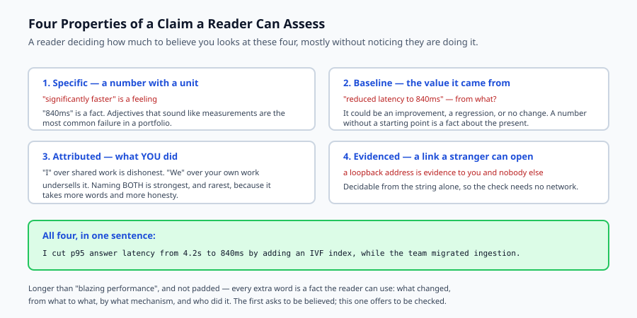

## The idea in plain language

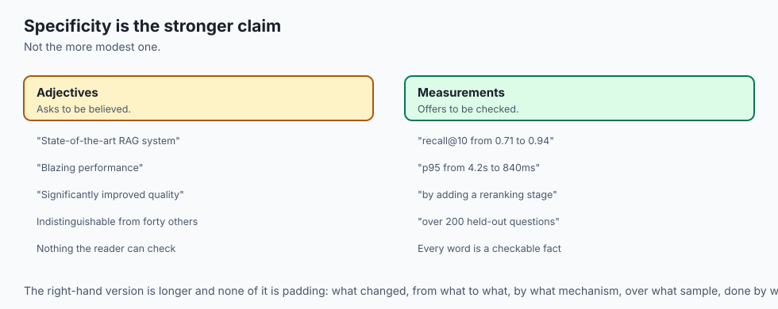

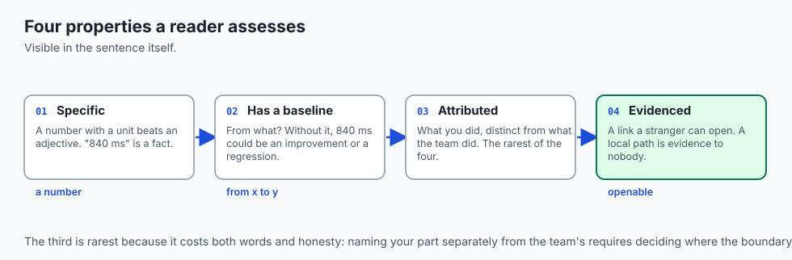

A reader deciding how much to believe you is looking, mostly unconsciously, at four properties visible in the sentence itself.

**Specific.** A number with a unit beats an adjective. "Significantly faster" is a feeling; "840 ms" is a fact.

**Has a baseline.** "Reduced latency to 840 ms" is not a result. It could be an improvement, a regression, or no change at all. The starting value is what makes it a measurement.

**Attributed.** What did *you* do, as distinct from what the team did? The strongest form names both — and it is the rarest, because it takes more words and more honesty.

**Evidenced.** A link a stranger can open. A local path or an internal host is evidence to you and to nobody else.

A claim with all four is strong. A claim missing some is weak and fixable. A claim with an adjective and no measurement at all is the weakest kind: it *sounds* like a result and contains none.

## Historical background

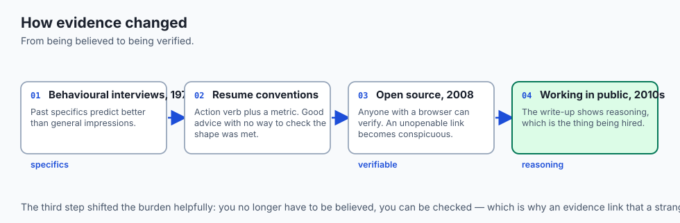

### The behavioural interview, 1970s onward

Structured interviewing established that past specifics predict future performance better than general impressions. Formats such as Situation-Task-Action-Result emerged for exactly the reason this lesson exists: they force the specifics out of a story. The **Action** and **Result** steps are attribution and measurement wearing different names.

### Résumé conventions and their limits

Bullet points beginning with an action verb and containing a metric became standard advice, and the advice is good. What it does not supply is a way to *check* that a bullet has the properties it is supposed to have — which is why so many résumés follow the shape and none of the substance.

### Open source as portfolio, 2008 onward

Public repositories changed what evidence means. A claim can now be checked by anyone with a browser, which shifts the burden helpfully: you no longer have to be believed, you can be verified. It also makes an unopenable link considerably more conspicuous.

### Working in public, 2010s onward

Writing up what you built — the decisions, the failures, the measurements — became a recognised way to demonstrate capability. The important shift for this lesson is that the write-up is often stronger evidence than the artefact, because it shows the reasoning, which is the thing being hired.

## What it is — and what it is not

A portfolio is a set of claims about what you did, presented so a reader can assess them.

### What it is

It is **for a specific reader** who does not know you, has limited time, and is comparing you against others.

It is **checkable**. Every claim should point at something the reader can open.

It is **honest about scope**, including what the team did and what you did.

### What it is not

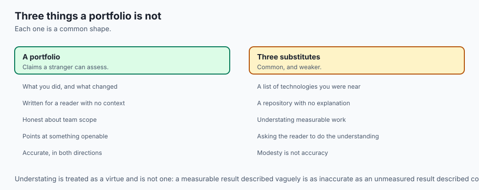

It is not a list of technologies. A list of tools says what you were near, not what you did with them.

It is not modest. Understating measurable work is as inaccurate as overstating it, and it is not a virtue.

It is not the code alone. A repository with no explanation asks the reader to do the work of understanding, and most will not.

## Why it was created and what problems it solves

**Adjectives replace measurements.** "Significantly improved" cannot be assessed by anyone. *Solution: require a number with a unit.*

**Results without baselines.** "Reduced to 840 ms" is unassessable without the starting point. *Solution: require the value it came from.*

**Attribution is ambiguous.** A reader cannot tell what you did. *Solution: name your contribution separately from the team's.*

**Evidence nobody can open.** A local URL, a private repository, a dead link. *Solution: check the link is openable by a stranger.*

**Technology lists instead of outcomes.** *Solution: state what changed and by how much, with the tool as a detail rather than the claim.*


## How it works

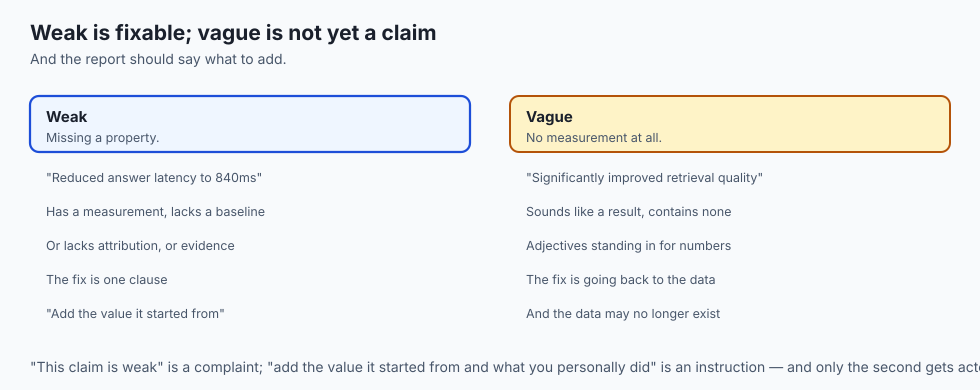

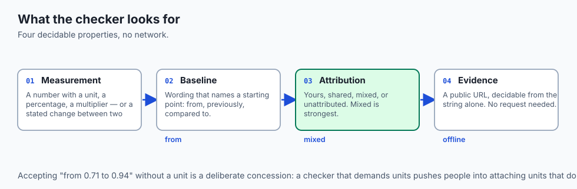

Take each claim as a sentence plus an optional evidence link, and check four things.

**Measurement.** Look for a number with a unit, a percentage, a multiplier, or a currency amount. Also accept a **stated change between two figures** — "from 0.71 to 0.94" is a measurement even though a ratio has no unit. That last case matters: a checker that demands a unit pushes people into padding sentences with units that do not belong.

**Baseline.** Look for wording that names a starting point — "from", "previously", "compared to".

**Attribution.** Classify as yours, shared, mixed, or unattributed. *Mixed* is the strongest, because it separates your work from the group's.

**Evidence.** Check the link is openable by a stranger — a public URL, not a local path or a private host. This is decidable from the string without any network access, which keeps the check fast and offline.

Then grade. All four present is **strong**. Vague wording with no measurement at all is **vague** — the weakest kind. Anything else is **weak**, which means fixable, and the report should say precisely what to add.

That last part is the useful bit. "This claim is weak" is a complaint; "add the value it started from and what you personally did" is an instruction.

## An everyday analogy

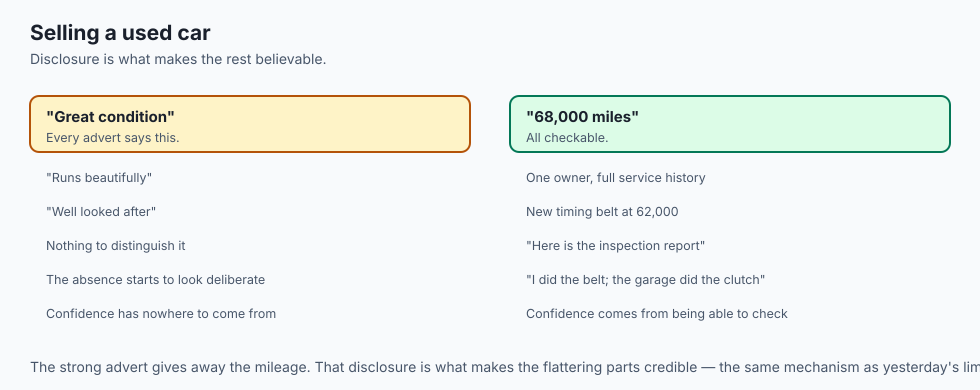

Think of selling a used car.

The weak advertisement says "great condition, runs beautifully, well looked after". Every advertisement says that. A buyer has no way to distinguish yours, and the absence of specifics starts to look deliberate.

The strong one says "68,000 miles, one owner, full service history, new timing belt at 62,000, here is the inspection report". Every one of those is checkable, and the buyer's confidence comes from the fact that they *could* check rather than from the claims being flattering.

Notice what the strong version does not do: it does not exaggerate. It gives away that the car has 68,000 miles. That disclosure is what makes the rest believable — the same reason yesterday's lesson insisted on stating limitations.

And the attribution equivalent: "I replaced the timing belt myself; the garage did the clutch." A buyer trusts that more than either claim alone.

## Examples in practice

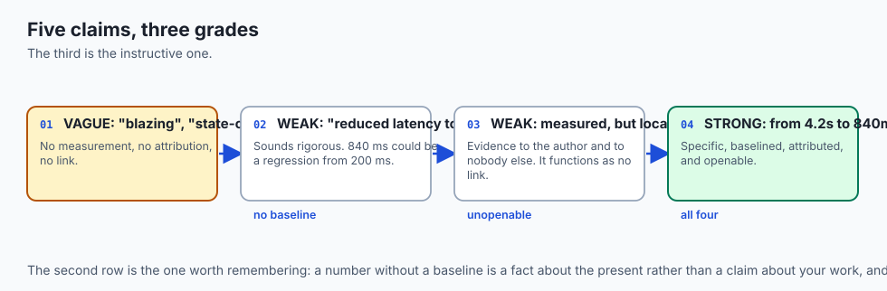

Here is the measured output from today's lab, over a set of claims:

```text
  VAGUE   Built a state-of-the-art RAG system with blazing perform
          vague wording: blazing, state-of-the-art; no measurement; does not
          say who did it; no evidence link
  VAGUE   Significantly improved retrieval quality.
          vague wording: significantly; no measurement; does not say who did
          it; no evidence link
  WEAK    Reduced answer latency to 840ms.
          measurement without a baseline; does not say who did it
  STRONG  I cut p95 answer latency from 4.2s to 840ms by adding an
  WEAK    We shipped a support assistant used by 200 people.
          measurement without a baseline; evidence link is not openable
  => strong=1 weak=2 vague=2
```

The third claim is the instructive one. "Reduced answer latency to 840 ms" *sounds* rigorous — there is a number, and a unit. It is still unassessable, because 840 ms might be an improvement from 4.2 seconds or a regression from 200 ms. A number without a baseline is a fact about the present, not a claim about your work.

The fifth shows the evidence check earning its place. The claim is measured and attributed, and its evidence link points at a local development address — evidence to the author and to nobody else. The reader cannot open it, so it functions as no link at all.

And the rewrite, the same claim before and after:

```text
  VAGUE   Significantly improved retrieval quality.
  STRONG  I raised recall@10 from 0.71 to 0.94 by adding a reranking stage,
          measured over 200 held-out questions.
```

The second is longer, and it is not padded. Every additional word is a fact a reader can use: what changed, from what to what, by what mechanism, over what sample, done by whom. The first sentence asks to be believed; the second offers to be checked.

## Implications: security, privacy, performance, scalability, and cost

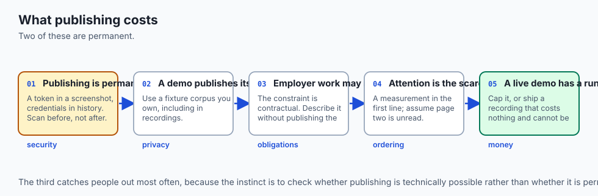

**Security.** A portfolio is a public disclosure. A screenshot with a real token, an architecture diagram naming internal hosts, a repository with credentials in its history — all are common, and all are permanent once published. Run the secret scan over your history before making a repository public, not after.

**Privacy.** If your project used real data, do not publish it or screenshots of it. Use a fixture corpus you own. This applies to demo recordings, which capture whatever was on screen.

**Employer obligations.** Work done for an employer often is not yours to publish, and the constraint is usually contractual rather than technical. Describe what you did without publishing the artefact, or build a comparable thing on your own time.

**Scalability of attention.** A reader spends less time than you expect. Order claims by what is strongest, put a measurement in the first line, and assume the second page is not read.

**Cost.** Hosting a demo has a running cost, and an unbounded one if it calls a paid API. Either put a hard cap on it — Day 327's exercise — or ship a recorded demo, which costs nothing and cannot be abused.

## Alternatives: free, open source, and commercial

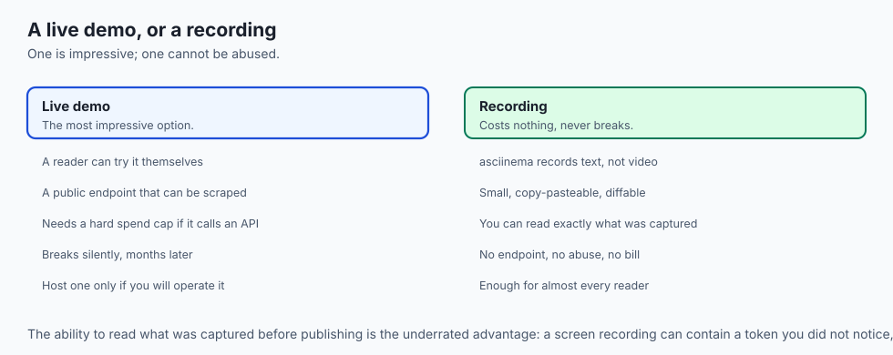

**A repository README** — free, and the single highest-value artefact. It is where a reader lands from any link, and Day 362's checks apply to it directly.

**GitHub Pages** — free static hosting from a repository, no account beyond the one you have. Enough for a portfolio site, a write-up, or a recorded demo.

**A written post** — on your own domain or any publishing platform. Frequently stronger evidence than the code, because it shows the reasoning: what you chose, what you rejected, what went wrong. The reasoning is the thing being assessed.

**asciinema** — GPL, records a terminal session as text. Small, copy-pasteable, and it lets you read exactly what was captured before publishing, which a video does not.

**A hosted live demo** — the most impressive and the most expensive. It is a public endpoint that can be scraped and abused, and if it calls a paid API it needs the spend cap from Day 327. A recording costs nothing and cannot be abused.

**Commercial portfolio platforms** exist and are rarely worth it for engineering work. A reader trusts a repository they can read over a profile page they cannot verify.

The honest default: a strong README, one written post explaining the decisions, and a recorded demo. Host a live demo only if you are willing to operate it.

## Comparison with related concepts

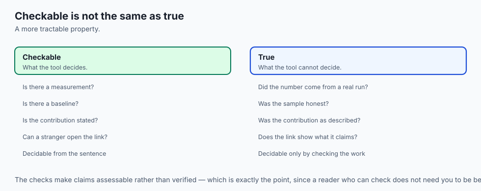

**Portfolio versus résumé.** A résumé is a compressed claim list; a portfolio is the evidence behind it. The claims should agree, and the portfolio is where the detail lives.

**Metrics versus narrative.** A metric establishes what happened. A narrative explains why you chose that approach and what you would do differently. Strong evidence of capability usually needs both — the number shows the outcome, the reasoning shows it was not luck.

**Contribution versus commit history.** A commit graph shows activity, not judgement. The decisions that mattered — what you chose *not* to build, what you removed — are usually invisible in it.

**Checkable versus true.** These checks cannot tell you a claim is true. They tell you it is in a form a reader can assess, which is a different and more tractable property.

## When to use it — and when not to

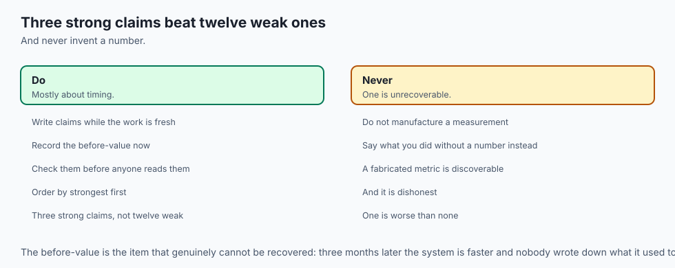

**Write the claims while the work is fresh.** The measurements are available now and will not be in three months. If you did not record a before-value, you cannot reconstruct it later.

**Check the claims before publishing.** Vague wording is much easier to fix before someone has read it.

**Keep it proportionate.** Three strong claims beat twelve weak ones. A reader's attention is the scarce resource, and padding spends it.

**Do not manufacture measurements.** If you did not measure it, say what you did without a number rather than inventing one. A fabricated metric is the one failure here that cannot be recovered from, because it is discoverable and it is dishonest.

## The AI connection

- **AI work is unusually easy to describe vaguely**, because the vocabulary sounds
  impressive on its own: "RAG pipeline", "agentic", "fine-tuned", "state of the art".

- **The measurements exist and are rarely used.** recall@10, groundedness, p95, cost
  per request — every one of them is a number your own labs already produced.

- **Reasoning is the evidence being assessed.** Anyone can wire an API call; what
  distinguishes the work is what you rejected and why, which only a write-up shows.

- **A hosted AI demo is a metered public endpoint.** It can be scraped and abused,
  so it needs Day 327's spend cap — or a recording, which costs nothing.

- **Fabricating a metric is discoverable here.** These systems are reproducible, and
  a claimed recall figure that nobody can reproduce is worse than no figure at all.

## Knowledge check

1. Why is "reduced answer latency to 840 ms" not yet a measurement?
2. Why does the checker accept "from 0.71 to 0.94" as a measurement despite there being no unit?
3. Why is *mixed* attribution — naming both your work and the team's — treated as the strongest form?
4. Why is a link to `localhost` treated as no evidence at all?
5. Why is a claim with vague wording and no measurement graded worse than one that is merely missing a baseline?

## Hands-on exercise

You will build a checker for portfolio claims — specificity, baseline, attribution and evidence — and run it over a set of claims including one rewritten from weak to strong.

Open `starter/claims.py` in the lab directory and implement the stubbed functions, then run the tests.

### Expected output

Running `python3 examples/claims_demo.py` assesses five claims, says what each weak one needs, and shows one rewritten:

```text
  VAGUE   Significantly improved retrieval quality.
          vague wording: significantly; no measurement; does not say who did
          it; no evidence link
  WEAK    Reduced answer latency to 840ms.
          measurement without a baseline; does not say who did it
  STRONG  I cut p95 answer latency from 4.2s to 840ms by adding an
  => strong=1 weak=2 vague=2
--- the same claim, before and after ---
  VAGUE   Significantly improved retrieval quality.
  STRONG  I raised recall@10 from 0.71 to 0.94 by adding a reranking stage,
          measured over 200 held-out questions.
```

### Validate your work

Run `bash tests/run_tests.sh`. All nineteen tests must pass, grouped by property.

Then check two behaviours by inspection. "Reduced latency to 840ms" must be `WEAK` rather than `STRONG` — the number alone is not enough. And a claim with an adjective *and* a measurement must be `WEAK` rather than `VAGUE`, because vague is reserved for claims with nothing measured to fall back on.

### Troubleshooting

**"from 0.71 to 0.94" is not detected as a measurement.** Your pattern requires a unit. Add a case for a stated change between two figures — a ratio is a legitimate measurement.

**"state-of-the-art" is not caught.** Your vague-word list has the spaced form only. Both spellings are common.

**Every claim is graded vague.** You are marking vague whenever a vague word appears. Vague requires an adjective **and** no measurement; with a measurement present the claim is weak.

**A local path passes the evidence check.** Test the prefix explicitly — `localhost`, `file://` and a leading `/` are all unopenable by a reader.

### Common mistakes

Treating any number as a measurement. A version number and a date are numbers and are not results.

Grading on tone rather than content. A confident sentence with no figures is still vague.

Requiring a unit, which pushes writers into padding sentences with units that do not fit the quantity.

Reporting a grade without saying what to add. "Weak" is a complaint; "add the value it started from" is an instruction.

## Practice assignment

Add a **verb check**. Claims should begin with a concrete action — built, measured, reduced, migrated — rather than a passive or a state verb such as "was responsible for" or "worked on".

Then write two tests: one proving "Was responsible for the retrieval layer" is flagged, and one proving "Rebuilt the retrieval layer, cutting p95 from 2.1s to 600ms" is not. The distinction is between describing a position and describing an action, and it is the difference most résumé advice is actually pointing at.

## Extension challenge

Run the checker over **your own portfolio or résumé**, honestly, and record the grade distribution before and after rewriting.

Then do the harder half. For every claim you cannot make strong, work out *why*: is it missing a measurement you never took, evidence you cannot publish because an employer owns it, or attribution you are reluctant to make precise because the contribution was smaller than the sentence implies?

Report those counts. The third category is the one worth sitting with. A claim you cannot attribute precisely is usually a claim that should be smaller, and shrinking it costs less than being asked about it in an interview.
