## Why this matters

Your capstone is built, deployed, monitored, reviewed, documented and described. There is one thing left to extract from it, and it is the part most likely to be skipped: what you now know that you did not know before.

The usual retrospective produces sentences like "the agent work took longer than expected" and "we should have tested more". Both are true. Neither transfers. Next project you will estimate the same way and be surprised in the same direction, because a feeling about the past does not change a decision in the future.

What transfers is a **number**. Three of them are computable from records you already have:

**How wrong were your estimates, and in which direction?** If your work consistently runs twice as long as you predicted, that is a multiplier you can apply immediately.

**Is the error uniform, or concentrated?** This is the question that changes the answer. A project that ran 1.2× over at the median sounds well-estimated — and if the familiar work ran 1.15× and the unfamiliar work ran 3.3×, then applying 1.2× to your next unfamiliar task will be badly wrong. The median hid both numbers.

**Which problems reached a user?** Every incident was caught somewhere. The ones caught by review or tests cost almost nothing. The ones a person found in production are where the next project's effort belongs.

Today you compute all three, honestly, from your own project.

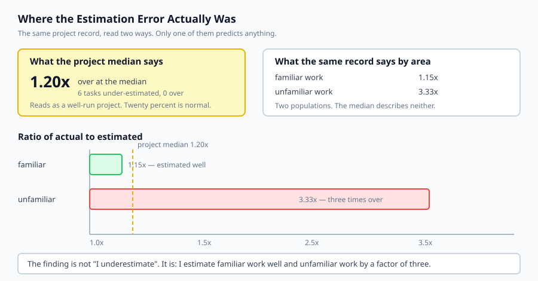

## The idea in plain language

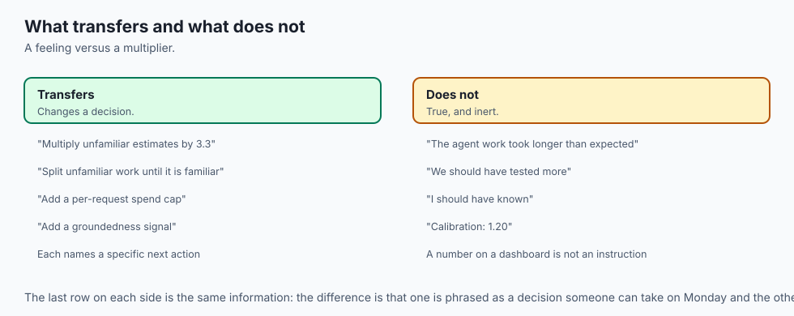

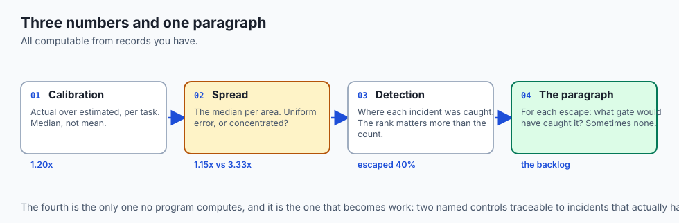

A retrospective that changes behaviour needs three measurements and one honest paragraph.

**Calibration.** For each task, actual divided by estimated. Take the median rather than the mean, because one task that ran eight times over would dominate an average and make everything else look worse than it was.

**Spread.** Compute the median per *area* of work — familiar against unfamiliar, backend against frontend, whatever divides your project. If the areas are close, you have a uniform error and a multiplier fixes it. If they are far apart, you estimate one kind of work well and another badly, and a single multiplier will not help.

**Detection.** Sort incidents by where they were caught: review, tests, staging, monitoring, a user. The rank matters more than the count, because each stage is more expensive than the last.

Then the paragraph, which is the part no program computes: for each incident that reached production, what gate would have caught it? Some have an answer, and that answer is next project's work. Some do not, and saying so is more useful than inventing one.

## Historical background

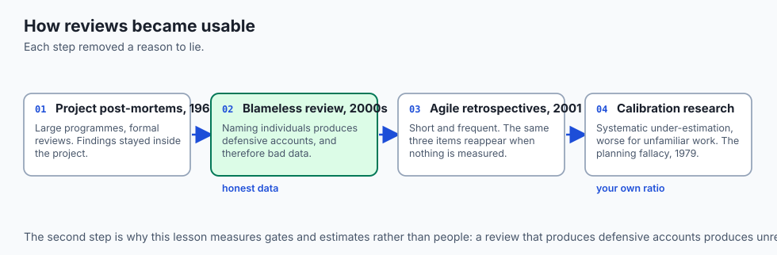

### Project post-mortems, 1960s onward

Formal post-project review came from large engineering and defence programmes, where the cost of repeating a mistake justified the meeting. The recurring failure was that findings stayed inside the project that produced them.

### Blameless post-mortems, 2000s

Etsy and Google established that a review naming individuals produces defensive accounts and therefore bad data. The reframing — ask what made the mistake *possible* rather than who made it — is what makes an honest retrospective achievable at all. It is also why this lesson measures gates and estimates rather than people.

### Agile retrospectives, 2001 onward

Regular short reviews replaced the single end-of-project meeting, on the sound principle that feedback is more useful when it is close to the work. The common failure mode is well known: the same three items reappear every fortnight because nothing measurable was ever attached to them.

### Estimation research

Study after study finds systematic *under*-estimation, and finds that it is worse for unfamiliar work — an instance of the planning fallacy identified by Kahneman and Tversky in 1979. The useful consequence is that your own historical ratio is a better predictor than your next intuition, and it is a number you already have.

## What it is — and what it is not

A retrospective is the extraction of transferable findings from a completed project.

### What it is

It is **quantitative where it can be**. Estimates and incidents are recorded facts, and facts survive the retelling.

It is **about systems rather than people**. The question is what made the outcome possible.

It is **forward-looking**. A finding you cannot apply to the next project is an observation, not a finding.

### What it is not

It is not a status report. Nobody needs a summary of what happened; they need what it implies.

It is not blame, and not self-blame either. "I should have known" is not a finding, because it does not suggest a different action.

It is not only about failures. A task estimated accurately, and a gate that caught something early, are both worth recording — they tell you what to keep.

## Why it was created and what problems it solves

**Findings that do not transfer.** "It took longer than expected" changes nothing. *Solution: a ratio you can multiply the next estimate by.*

**Averages that hide the shape.** A single overall number conceals whether the error is uniform or concentrated. *Solution: a median per area, and a check on the spread.*

**One task distorting everything.** *Solution: a median rather than a mean.*

**Incidents treated as equally bad.** A bug caught in review and one found by a user are the same bug and very different outcomes. *Solution: rank by where it was caught.*

**Vague improvement plans.** "Test more" is not actionable. *Solution: for each escaped incident, name the specific gate that would have caught it.*


## How it works

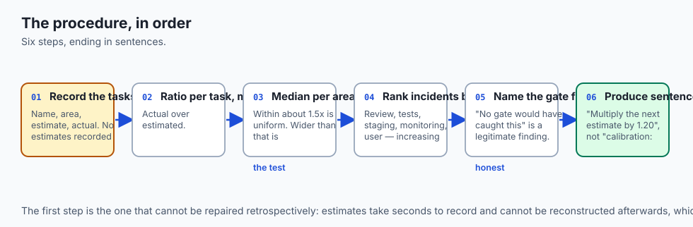

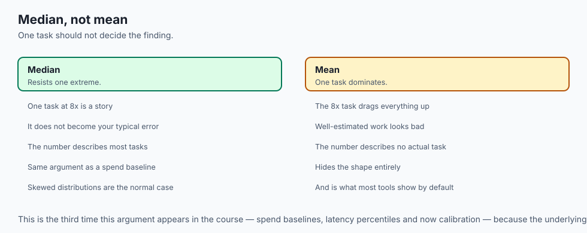

**Record the tasks.** Name, area, estimate, actual. If you did not record estimates, this is the finding: you cannot calibrate without them, and that is worth fixing before the next project rather than after.

**Compute the ratio per task and the median overall.** The median is deliberate. One task running eight times over is a story; it is not your typical error.

**Compute the median per area, and compare.** If the highest area is within about 1.5× of the lowest, the error is uniform. Otherwise it is concentrated, and the overall median is misleading in a specific and important way.

**Rank the incidents by detection stage.** Review, tests, staging, monitoring, user — in increasing order of cost. Everything from monitoring onwards is an **escape**: it reached production.

**For each escape, name the gate.** Some escapes have a clear answer — a spend cap, a groundedness signal, a readiness probe. Those are concrete work items. Some do not, and recording "no gate would have caught this" is a legitimate and useful finding.

**Produce sentences, not scores.** "Multiply the next estimate by 1.20" is actionable. "Calibration: 1.20" is a number on a dashboard.

## An everyday analogy

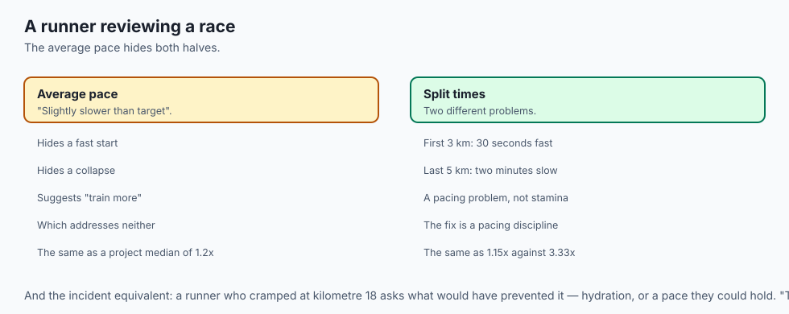

Think of a runner reviewing a race.

The useless review is "it was harder than I expected, I should train more". True, and it changes nothing, because it does not say which part was hard or what training would address it.

The useful one uses the split times. The first three kilometres were 30 seconds faster than planned; the last five were two minutes slower. That is not a stamina problem, it is a pacing problem, and the fix is a pacing discipline rather than more mileage.

**The average pace would have shown neither.** It would have said "slightly slower than target" and hidden a fast start and a collapse — the same way a project median of 1.2× hides familiar work at 1.15× and unfamiliar work at 3.3×.

And the incident equivalent: a runner who cramped at kilometre 18 asks what would have prevented it — hydration, or a pace they could hold. "Try harder" is not on that list.

## Examples in practice

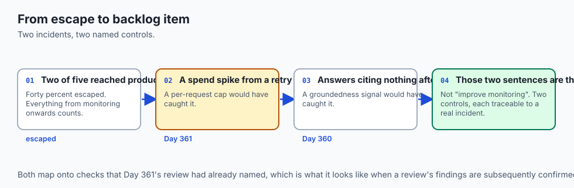

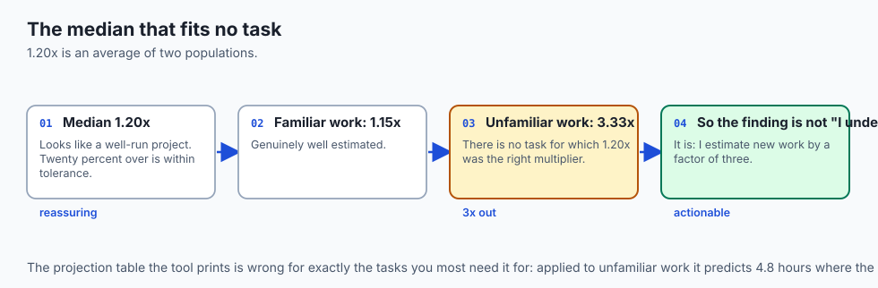

Here is the measured output from today's lab, over a capstone's record:

```text
--- calibration ---
  median ratio 1.20x  under 6 / over 0  worst unfamiliar 3.33x  best familiar 1.15x
  uniform across areas: False
  median ratio by area:
    familiar     1.15x
    unfamiliar   3.33x
```

Read the first number and then the last two. A median of **1.20×** looks like a well-run project — twenty percent over is within anyone's tolerance.

It is also almost useless as a prediction. The familiar work ran 1.15× and the unfamiliar work ran **3.33×**. There is no task in this project for which 1.20× was the right multiplier; it is an average of two populations that behave completely differently.

This is the finding worth carrying, and it is not "I underestimate". It is: *I estimate work I have done before quite well, and work I have not done before by a factor of three.* That suggests a specific practice — estimate unfamiliar work by a different method, or split it until the pieces are familiar — which "I underestimate" does not.

```text
--- what a future estimate becomes ---
      4h estimated  ->    4.8h expected
     10h estimated  ->   12.0h expected
     40h estimated  ->   48.0h expected
```

And note that this table, computed from the overall median, is *wrong for exactly the tasks you most need it for*. Applying it to unfamiliar work would predict 4.8 hours where the record says 13. The tool computes it; the lesson is knowing when not to use it.

```text
--- detection ---
  review=1 tests=1 staging=1 monitoring=1 user=1  escaped=2 (40%)

--- findings ---
  - 'spend spike from a retry loop' reached production and a per-request cap
    would have caught it.
  - 'answers citing nothing after an index rebuild' reached production and a
    groundedness signal would have caught it.
```

Two of five incidents reached production, and both have a named gate. Those two sentences are the next project's backlog — not "improve monitoring", but two specific controls, each traceable to an incident that actually happened.

## Implications: security, privacy, performance, scalability, and cost

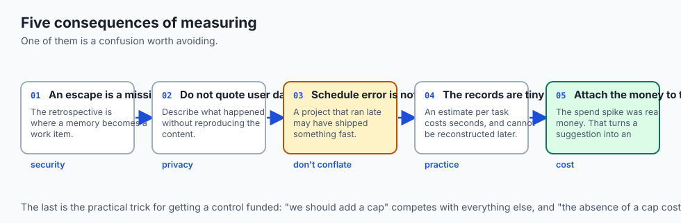

**Security.** An escaped incident is a control that was missing, and the retrospective is where that becomes a work item rather than a memory. Both escapes here map onto Day 361's checks — a spend cap and a quality signal — which is what it looks like when a review's findings are confirmed by events.

**Privacy.** A retrospective that quotes incidents may quote user data. Describe what happened without reproducing the content, particularly if the write-up will be published.

**Performance.** Calibration explains schedule error rather than system performance. Do not conflate them: a project that ran late may have shipped something fast.

**Scalability of the practice.** This works because the records are small. Recording an estimate per task costs seconds and is the only input that cannot be reconstructed afterwards.

**Cost.** The escaped incidents usually have a direct cost attached — the spend spike here is money that was actually spent. Attaching that figure to the finding is what turns "we should add a cap" into a decision someone will approve.

## Alternatives: free, open source, and commercial

**A written document in the repository** — free, versioned beside the code, and readable by whoever picks the project up. For a capstone this is the right answer.

**Issue trackers** — GitHub Issues and equivalents let each finding become a task with an owner. The advantage over a document is that a finding which is not acted on stays visible.

**Incident management tools** — Jeli, incident.io and similar are built around structured post-incident review with timeline reconstruction. Aimed at teams with ongoing incident volume.

**Estimation tracking** — most project tools record estimate against actual, which is the input to calibration. If yours does, the number is already available and nobody has looked at it.

**Structured formats** — a template with prompts (what was expected, what happened, what would have caught it) is a cheap and effective intervention, because the prompts do the remembering.

The honest default for a capstone: a written retrospective in the repository, with the three numbers computed and every escaped incident named alongside the gate that would have caught it.

## Comparison with related concepts

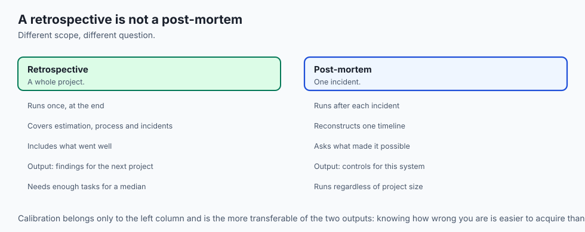

**Retrospective versus post-mortem.** A post-mortem examines one incident. A retrospective examines a whole project, including what went well.

**Calibration versus estimation skill.** Calibration is knowing how wrong you are. It is more useful and much easier to acquire than being right, and it does not require you to become a better estimator at all.

**Median versus mean.** For ratios and durations, the median resists a single extreme value. This is the same argument as Day 360's spend baseline, and it recurs because skewed distributions are the normal case.

**Escaped versus caught.** Every incident was caught somewhere. What matters is how far right it got, because the cost rises at every stage.

## When to use it — and when not to

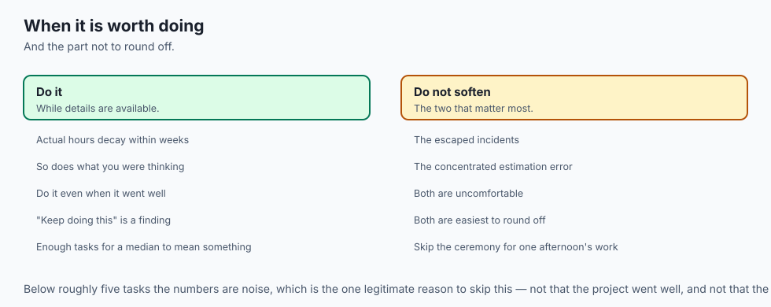

**Do it while the details are available.** Actual hours, and what you were thinking when you estimated, decay within weeks.

**Do it even when the project went well.** A project with accurate estimates and no escapes tells you what to keep, and "keep doing this" is a finding.

**Skip the ceremony if the project was one afternoon.** The value comes from having enough tasks for a median to mean something. Below roughly five, the numbers are noise.

**Do not skip the uncomfortable part.** The escaped incidents and the concentrated error are the two findings most worth having, and both are the ones easiest to round off into something more flattering.

## The AI connection

- **AI projects estimate badly in a specific, predictable place.** The model call is
  quick; the evaluation, the retrieval tuning and the failure handling are not.

- **The unfamiliar-work multiplier is the finding that transfers.** Almost every
  part of an AI system is unfamiliar the first time, which is where 3.3x comes from.

- **Escaped incidents in AI systems are usually silent ones** — a spend spike or
  ungrounded answers, neither of which raises an error rate.

- **Both escapes here map onto Day 361's checks**, which is what it looks like when
  a security review's findings are later confirmed by events.

- **Calibration beats estimation skill.** Knowing you run 3.3x over on new work is
  more useful, and far easier to acquire, than learning to predict it correctly.

## Knowledge check

1. A project's median estimation ratio is 1.20×. Why might that number be useless as a prediction?
2. Why does calibration use a median rather than a mean?
3. Why rank incidents by where they were caught rather than counting them?
4. Why is "no gate would have caught this" a legitimate finding rather than a failure to analyse?
5. Why is knowing how wrong your estimates are more useful than becoming a better estimator?

## Hands-on exercise

You will compute calibration, spread and detection from a project record, and turn them into sentences that transfer.

Open `starter/retro.py` in the lab directory and implement the stubbed functions, then run the tests.

### Expected output

Running `python3 examples/retro_demo.py` analyses a capstone's record:

```text
--- calibration ---
  median ratio 1.20x  under 6 / over 0  worst unfamiliar 3.33x  best familiar 1.15x
  uniform across areas: False
  median ratio by area:
    familiar     1.15x
    unfamiliar   3.33x
--- detection ---
  review=1 tests=1 staging=1 monitoring=1 user=1  escaped=2 (40%)
--- findings ---
  - Estimates ran 1.20x long at the median. Multiply the next one by 1.20 before
    committing to it.
  - The error is concentrated, not uniform: unfamiliar ran 3.33x while familiar
    ran 1.15x. A single multiplier will not fix this.
  - 2 of 5 incidents reached production (40%).
  - 'spend spike from a retry loop' reached production and a per-request cap
    would have caught it.
```

The second finding contradicts the first, deliberately. Both are true, and the second is the one that changes what you do.

### Validate your work

Run `bash tests/run_tests.sh`. All twenty-two tests must pass, grouped by what the retrospective computes.

Then check two behaviours by inspection. A record where every task ran exactly twice as long must report a median of exactly 2.00 and `uniform: True`. And a clean record — accurate estimates, no escapes — must say so rather than manufacturing a finding.

### Troubleshooting

**One task dominates the calibration.** You are using a mean. Use the median.

**`is_uniform` returns True for the concentrated fixture.** Your comparison is against the overall median rather than between the highest and lowest areas. Compare the areas to each other.

**Every incident counts as escaped.** Only monitoring and user detections are escapes — staging is deployed but reached nobody.

**A zero estimate crashes the ratio.** A task with no estimate is a real case. Return 0.0 rather than dividing.

### Common mistakes

Producing scores rather than sentences. A number on a dashboard is not a finding.

Averaging away the shape, which loses the single most useful thing in the record.

Treating all incidents as equal when the cost rises sharply at every stage.

Writing findings about people. "I should have been more careful" suggests no different action next time.

## Practice assignment

Add **estimate-size analysis**: group tasks by the size of the original estimate — under two hours, two to eight, over eight — and compute a median ratio for each.

Then write a test proving the checker can distinguish a project where large estimates are worse from one where small ones are. This matters because the two have opposite fixes: if large estimates are worse, break work down further; if small ones are worse, you are underestimating fixed overheads that do not scale down.

## Extension challenge

Run this over **your own capstone**, with the real numbers.

Then do the part that is not mechanical: for every incident that reached production, decide honestly whether a gate would have caught it — and resist inventing one. "No gate would have caught this; it was a genuine unknown" is a legitimate and valuable finding, and manufacturing a plausible-sounding control to avoid writing it produces a backlog item that fixes nothing.

Report the split: how many escapes were preventable, and how many were not. If everything looks preventable in hindsight, you are almost certainly hindsight-biasing, and the useful question is what you would have needed to know **at the time** to justify building that gate before the incident rather than after.
