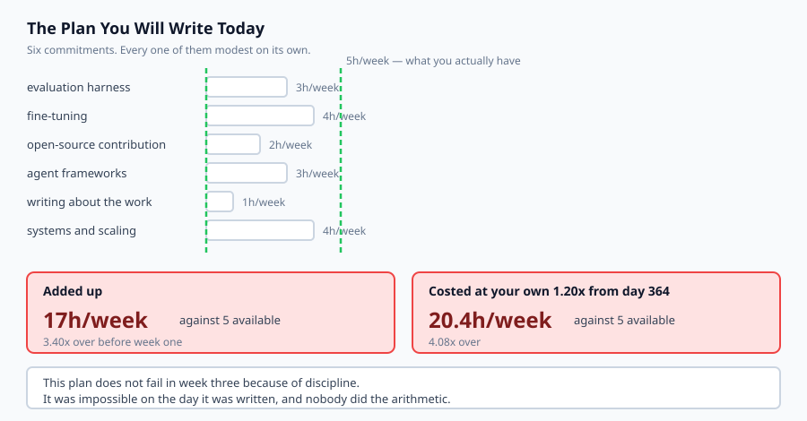

## Why this matters

You have finished. The capstone is built, deployed, monitored, reviewed, documented, described and measured. Day 364 turned it into numbers that transfer. This is the last day, and the honest question is what happens over the next three months, because that is where the value of the past year is either kept or quietly lost.

Almost everyone in your position writes a plan today. Almost every one of those plans dies in about week three, and it is worth being precise about why, because the usual explanation is wrong.

It is not discipline. The plan you write today will list six or seven things, each of which sounds modest — three hours a week on evals, two on an open-source contribution, one on writing. Added up they will need somewhere between fifteen and twenty hours a week, and you will have four or five. **The plan was arithmetically impossible on the day it was written, and nobody did the arithmetic.**

What happens next is not a decision. It is attrition: you fall behind on everything simultaneously, feel vaguely bad about it, and stop. The commitments that die are not the least important ones — they are whichever ones were scheduled for the week you got busy.

So today you do the arithmetic before week one, using the calibration you measured yesterday. The output is uncomfortable and it is supposed to be: a plan that keeps two things is worth more than a plan that lists six and delivers none.



## The idea in plain language

A learning plan is a set of commitments, and a commitment has three properties a plan does not automatically give it.

**A next action.** Something you could start within the hour. "Get better at distributed systems" is a state you would like to be in; "port the retrieval service to two replicas and measure the tail latency" is something you could open a terminal and begin. The first is a topic. The second is a commitment.

**An artifact.** Something that will exist afterwards and does not exist now — a repository, a merged pull request, a published post, a benchmark. This is what makes progress checkable by anyone, including you in three months, who will otherwise have only a feeling about whether the time was well spent.

**A cost in hours you actually have.** Not hours you would have in a good week. The measured number, and then multiplied by your own calibration from Day 364, because a plan costed in optimistic hours is not costed at all.

Then the arithmetic: total the weekly hours, compare against what you have, and if it does not fit, **cut whole commitments rather than shaving all of them**. Halving the hours on six commitments gives you six things done badly. Keeping two gives you two things done.

The cut is the part people avoid, and avoiding it does not prevent the cut. It only means the cut happens later, by accident, and chooses badly.

## Historical background

### Goal-setting research, 1968 onward

Locke and Latham's work established what is now unremarkable: specific, difficult goals produce better performance than "do your best". The finding that matters here is the *specific* half. A vague goal does not fail because it is easy; it fails because there is no state of the world that counts as having done it, so there is never a moment of completion and never a signal to stop or continue.

### Implementation intentions, 1990s

Gollwitzer's research found that goals expressed as "when situation X arises, I will do Y" are acted on substantially more often than the same goals expressed as intentions. The mechanism is unglamorous — it removes a decision at the moment of action. This is why a next action outperforms a topic, and it is the entire basis of the actionability check in today's lab.

### The planning fallacy, 1979

Kahneman and Tversky again, and the reason Day 364 comes before Day 365 rather than after. The tendency to underestimate is systematic, worse for unfamiliar work, and not corrected by knowing about it. It *is* corrected, partially, by applying your own measured ratio — which is why the plan check takes a calibration argument.

### Work-in-progress limits

Kanban's central constraint — cap the number of things in progress — arrives at the same conclusion from manufacturing rather than psychology. Throughput falls as work-in-progress rises, because switching has a cost and unfinished work has none of the value of finished work. A learning plan with six simultaneous commitments is a work-in-progress limit of six, set by nobody.

## What it is — and what it is not

A forward plan is a small set of commitments you could actually execute, costed in hours you actually have.

### What it is

It is **short**. Two or three commitments is a normal outcome for four or five hours a week, and it is not a failure.

It is **costed honestly**, at your measured calibration rather than at your intentions.

It is **artifact-producing**. Each commitment leaves something behind, which is what lets you tell progress from activity.

### What it is not

It is not a list of interests. Interests are free and unlimited; commitments cost hours and are strictly limited.

It is not a curriculum. You have just finished one. What follows is chosen by you and constrained by your actual life, which no curriculum knows about.

It is not permanent. Re-run it every quarter with your updated calibration. A plan that fitted in January may not fit in April, and finding that out in April is the point.

## Why it was created and what problems it solves

**Plans that were impossible on day one.** The most common failure and the least diagnosed, because it presents as a motivation problem. *Solution: sum the weekly hours and compare against a measured budget before starting.*

**Topics masquerading as commitments.** "Learn about agents" cannot be started, finished, or checked. *Solution: require a next action you could begin within the hour.*

**Progress you cannot verify.** Time spent is not progress. *Solution: require an artifact that will exist afterwards.*

**Optimistic costing.** *Solution: apply your own calibration from the retrospective, so the plan is priced in your hours.*

**Cuts made by attrition.** When a plan is over budget and nothing is cut deliberately, the commitments that die are whichever ones fell in a busy week. *Solution: cut explicitly, highest priority first, and name what was dropped.*



## How it works

**Write the commitments.** For each: the topic, the next action, the artifact, the hours per week, the number of weeks, and a priority.

**Check each next action.** Reject topic verbs — learn, study, explore, understand, get better at. Reject them even when an action verb is also present, because "build up my understanding of evals" starts with "build" and commits to nothing. That phrasing is the most common way a topic gets dressed as an action, and a check that only looks at the first word waves it straight through.

**Check each artifact.** If nothing will exist afterwards, the commitment is unfalsifiable. A commitment phrased as a topic almost never has one — the two failures travel together, because a topic does not produce an artifact.

**Measure your available hours.** Measure, do not estimate. Look at what last month actually contained.

**Re-cost at your calibration.** Multiply every commitment's hours by the ratio you measured yesterday.

**Total, and compare.** If the plan fits, stop — and resist filling the gap, because the gap is what absorbs a bad week.

**If it does not fit, trim.** Highest priority first, keeping each commitment that still fits within what remains. Skip past one that is too expensive and carry on, because stopping would waste the remaining hours. Then read what was cut and decide whether the tool's substitution was the right one — often the better answer is to split the expensive commitment rather than accept a cheaper replacement, and no tool can make that call.

## An everyday analogy

Think of packing a bag with a weight limit.

The way it goes wrong is familiar. You lay out everything you want to bring, each item obviously reasonable, and only at the airport does anyone weigh it. Then the cut happens under time pressure, at a desk, badly — you remove whatever is on top rather than whatever matters least.

Weighing it at home is not a different amount of stuff. It is the same cut, made calmly, with the whole bag visible.

And note the part that maps most closely: nobody packs a bag by putting in two-thirds of every item. You cannot bring two-thirds of a laptop charger. You bring some things and not others, which is exactly why the plan check drops whole commitments rather than shaving hours off all of them.

The scale is the unwelcome part of the process and the only part that makes it work.

## Examples in practice

Here is the measured output from today's lab, over a plan that looks entirely sensible:

```text
--- as written ---
  needs 17.0h/week  have 5.0h/week  3.40x  OVER
  2 kept / 4 cut  not-actionable=3 no-artifact=3
--- in my own hours ---
  needs 20.4h/week  have 5.0h/week  4.08x  OVER
  2 kept / 4 cut  not-actionable=3 no-artifact=3
```

Six commitments. Three hours a week on an eval harness, four on fine-tuning, two on an open-source contribution, three on agent frameworks, one on writing, four on distributed systems. Read individually, every one of them is the kind of thing a reasonable person agrees to on a Sunday evening.

Together they need **seventeen hours a week against five**, and once costed at the 1.20x calibration from Day 364, **twenty and a half**. Four times over, before week one.

```text
--- what survives ---
  keep  p1   3.6h/wk  evaluation harness for my capstone
  keep  p2   1.2h/wk  writing about the work
  cut   p3   4.8h/wk  fine-tuning
  cut   p2   2.4h/wk  open-source contribution
  cut   p4   3.6h/wk  agent frameworks
  cut   p5   4.8h/wk  systems and scaling
```

Two of six. That is the real capacity, and seeing it in week zero is worth considerably more than discovering it in week three.

Two details in that output repay attention. The open-source contribution is **priority 2, the same as the writing that survived**, and it was cut because 3.6 plus 2.4 exceeds five while 3.6 plus 1.2 does not. The trim skips what does not fit and carries on, so a cheaper commitment can outlive a dearer one of equal priority. That is a real property rather than a bug — stopping would waste the remaining hours entirely — but the right response is usually to split the expensive commitment rather than accept the substitution.

And the three commitments that fail the wording check are exactly the three with no artifact:

```text
  fine-tuning          "learn how LoRA works"
  agent frameworks     "explore the main agent frameworks"
  systems and scaling  "get better at distributed systems"
```

Not a coincidence. A commitment phrased as a topic has no artifact because a topic does not produce one. The two checks catch the same failure from opposite directions, which is how a plan can look full and contain very little.

## Implications: security, privacy, performance, scalability, and cost

**Security.** The habits from this year survive only if they are cheap enough to keep without a course enforcing them. Secret scanning over repository *history* before anything goes public is the highest-value one, because its failures are permanent — making a repository public exposes every commit, not just the current tree. A spend cap on anything calling a paid API is second, and untrusted input staying untrusted is third.

**Privacy.** A published plan states your available hours, your weak areas and what you are working on. Usually unremarkable; worth a read-through if it names an employer's systems or an unfixed weakness in something you run.

**Performance and cost of the practice itself.** The check takes minutes and runs offline. If a planning process costs more than the smallest commitment in the plan, it will be the first thing dropped.

**Scalability.** The same arithmetic works for a team, with one addition: available hours must be measured per person, and a commitment that depends on someone else's is not independent. Summing a team's nominal hours and dividing by headcount reliably produces a plan nobody can execute.

## Alternatives: free, open source, and commercial

**A written plan in a repository** — free, versioned, and diffable against next quarter's. For an individual this is the right answer, and the check in today's lab runs against it directly.

**Issue trackers** — GitHub Projects, Linear and similar make a commitment visible and unfinished work impossible to forget. Most support a work-in-progress limit, which is the constraint that matters most here.

**Spaced-repetition tools** — Anki and its relatives, for retaining facts rather than building things. Complementary rather than alternative: they address a different failure.

**Structured curricula** — fast.ai, Full Stack Deep Learning, university courses. Worth it when the constraint is not knowing what to learn next. After 365 days that is rarely the constraint; the constraint is hours.

**Commercial coaching and cohort programmes** — they buy accountability and a deadline, which is a real thing to buy. Expensive, and the same effect is available free from a study group that meets.

The honest default: a plan in a text file, three commitments at most, re-checked every quarter with your updated calibration.

## Comparison with related concepts

**A plan versus a backlog.** A backlog is everything you might do and can be arbitrarily long. A plan is what you have committed the hours to and is short by construction. Keeping both, clearly separated, is what stops the backlog quietly becoming the plan.

**A next action versus a goal.** The goal is where you want to be; the next action is what you do on Monday. Plans containing only goals produce no Mondays.

**Cutting versus shaving.** Shaving keeps every commitment and finishes none. Cutting keeps fewer and finishes them. This is the same argument as a work-in-progress limit.

**Calibration versus ambition.** Calibration is about costing accurately. It says nothing about whether the goals are ambitious, and applying it does not make you less ambitious — it makes your ambition executable.

## When to use it — and when not to

**Use it before starting anything**, when the hours are still uncommitted and cutting is free.

**Re-run it every quarter**, with the calibration ratio updated from whatever you actually did. Your ratio for unfamiliar work should improve as more of the work becomes familiar, and watching that number move is itself informative.

**Use it when the plan feels fine.** A plan that feels fine and is three times over budget feels exactly like a plan that fits. The feeling is not the check.

**Do not use it for a single commitment.** One thing at four hours a week needs no tool.

**Do not tune the numbers until the plan passes.** Adjusting your available hours upward to fit the plan you wanted is the one way to make this process worse than not doing it — it converts an honest constraint into a false reassurance you will act on.

## Knowledge check

1. Why does a post-course plan usually fail in week three, and why is "discipline" the wrong diagnosis?
2. Why must "build up my understanding of evals" fail an actionability check despite starting with an action verb?
3. Why does the trim drop whole commitments rather than reducing every commitment's hours proportionally?
4. Why must a calibration ratio be applied before the load is measured rather than after?
5. Why is it a real finding, rather than a bug, that a cheaper low-priority commitment can survive while a dearer high-priority one is cut?

## Hands-on exercise

You will check a plan for actionability, artifacts and affordability, re-cost it at your own calibration, and produce the cut list.

Open `starter/plan.py` in the lab directory and implement the stubbed functions, then run the tests.

### Expected output

Running `python3 examples/plan_demo.py` checks six commitments against five hours a week:

```text
--- as written ---
  needs 17.0h/week  have 5.0h/week  3.40x  OVER
  2 kept / 4 cut  not-actionable=3 no-artifact=3
--- in my own hours ---
  needs 20.4h/week  have 5.0h/week  4.08x  OVER
--- what survives ---
  keep  p1   3.6h/wk  evaluation harness for my capstone
  keep  p2   1.2h/wk  writing about the work
--- findings ---
  - Costed at your measured 1.20x rather than in optimistic hours.
  - The plan needs 20.4h/week and you have 5.0h — it is 4.08x over before it
    starts.
  - 2 of 6 commitments fit. Cut the rest now, deliberately, rather than in week
    three by attrition.
```

Not one of the six commitments is unreasonable alone. That is the point of the fixture.

### Validate your work

Run `bash tests/run_tests.sh`. All twenty-seven tests must pass.

Then check three behaviours by inspection. The two load figures must differ — `3.40x` as written and `4.08x` calibrated — because a calibration applied after the load is measured changes nothing. Two identical commitments must yield one kept and one cut rather than zero kept, since `Commitment` is a frozen dataclass and compares by value. And a calibration of `0.0` must leave the plan alone rather than zeroing every commitment and cheerfully reporting that it fits.

### Troubleshooting

**"build up my understanding of evals" passes.** You are checking only the first word. A topic verb anywhere disqualifies the sentence.

**Multi-word topic verbs never match.** "Get better at" and "read about" need a substring test, not a word-by-word one.

**Both duplicates get dropped.** Frozen dataclasses compare equal. Compare by `id()` or by index.

**The trim shaves instead of dropping.** Deliberately not what it does — six commitments at half hours is six things done badly.

### Common mistakes

Measuring the load before applying the calibration, which reports a reassuring number computed from the wrong plan.

Zeroing the hours on a nonsensical calibration, so an impossible plan reports that it fits.

Estimating available hours instead of measuring them, which reintroduces the exact error the calibration was meant to correct.

Treating a dispiriting result as a reason to distrust the tool rather than the plan.

## Practice assignment

Add **dependencies** between commitments — an open-source contribution that requires the eval harness first, say — and refuse a plan whose dependencies cannot be satisfied in order.

Detect cycles rather than looping forever, and write a test proving it. Then make the trim dependency-aware: cutting a commitment that something else depends on must cut the dependent too, and the finding should say so. A plan that keeps the dependent and cuts its prerequisite is worse than one that keeps neither, because it will fail in week two having spent the hours.

## Extension challenge

Run this on **your own plan**, with your own numbers, and take the two uncomfortable steps.

First, **measure your available hours rather than estimating them**. Look at what the past month actually contained, on the weeks that were not exceptional. Almost everyone's honest figure is lower than their assumed one, and using the assumed figure reintroduces the precise error Day 364 taught you to correct.

Second, **accept the cut list**. If the tool keeps two of your seven commitments, the finding is not that the tool is pessimistic — it is that you have hours for two. Cutting five things you genuinely want to do is a real loss and worth feeling as one. It is still better than the alternative on offer, which is not seven things but zero, arrived at slowly.

Then put the plan somewhere you will see it, set a reminder for three months, and re-run it with whatever your calibration turns out to be by then.

That is the last instruction in this course. You have built the thing, deployed it, secured it, measured it and described it; you now know how wrong your estimates are and how much time you actually have. What you do with the next quarter is genuinely yours to choose — the only advice worth adding is to choose it deliberately, in advance, and in writing.
