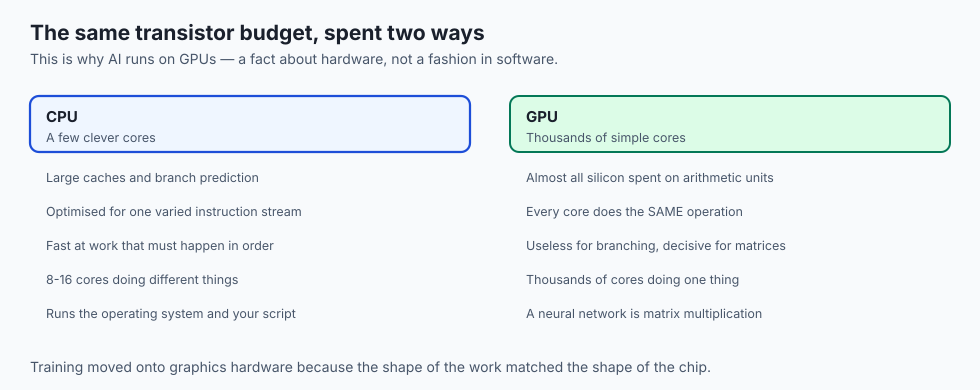
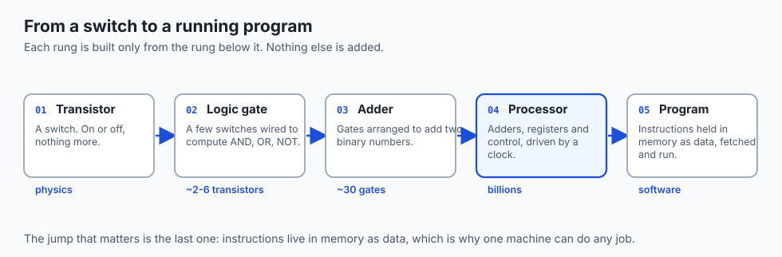
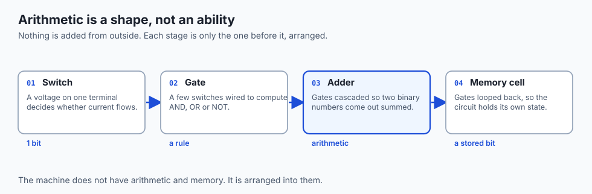
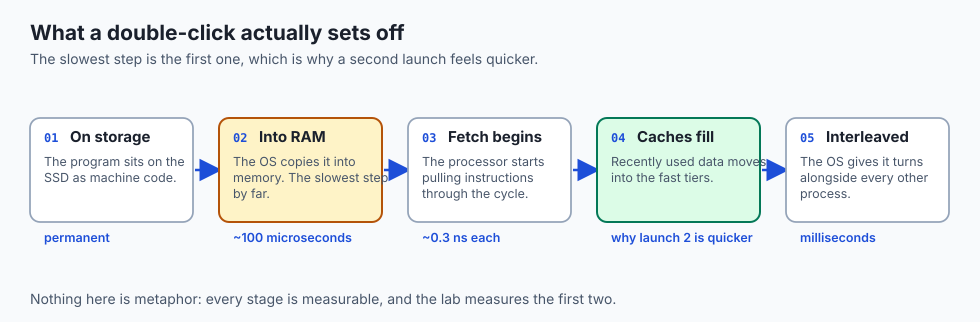
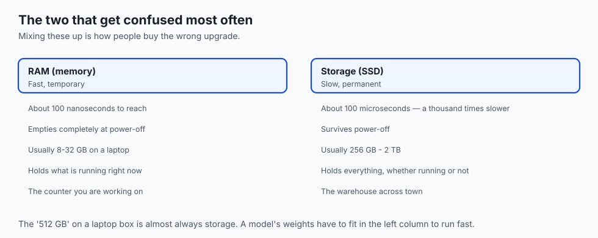
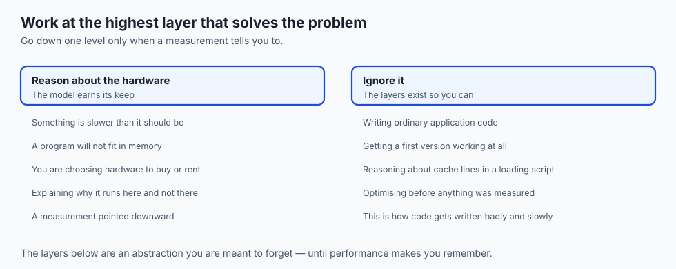

## Why this matters



Everything you build in this course runs on the machine described here, and the
parts you meet today decide what is possible later.

- **A model is arithmetic on numbers held in memory.** Nothing more exotic.
- **When training is slow, the cause is the processor, the memory, or the
  storage.** Knowing which is the difference between a fix and a guess.
- **Nothing here is metaphor.** Every claim in this lesson is something you can
  measure on your own machine, and the lab does.

The lesson has one destination: understanding *why* AI runs on GPUs, and why that
is a fact about hardware rather than a fashion in software.

---

## The idea in plain language

A computer is a machine that does one tiny thing, extremely fast, and is built in
layers so that tiny thing adds up to everything else.



- **The tiny thing is a switch.** On or off. One bit.
- **Each rung is built only from the rung below it.** Nothing is added from
  outside — gates are switches, adders are gates, a processor is adders and
  registers with a clock.
- **The jump that matters is the last one.** Instructions live in memory *as
  data*, so loading different instructions changes what the machine does. That is
  why one machine can do any job.

---

## Historical background

The ideas arrived long before the hardware could carry them.

| When | What changed | Why it mattered |
| --- | --- | --- |
| 1936 | Turing's universal machine | One machine, reprogrammed, computes anything computable |
| 1945 | Von Neumann's stored-program design | Instructions live in the same memory as data |
| Dec 1947 | The transistor | The switch becomes small, cheap and reliable |
| 1958 | The integrated circuit | Many switches on one piece of silicon |
| 1965 | Moore's observation | Transistor counts double roughly every two years |
| 2007– | GPUs turned to general computing | Thousands of simple cores — the shape of a network |

- **The 1945 design is the one in front of you**, shrunk and repeated.
- **Moore's law was an observation, and it has slowed** — which is exactly why
  parallel hardware became the way forward.

---

## What it is — and what it is not


**It is** a stack of layers, each built only from the one below.

- Transistors form logic gates.
- Gates form the processor and memory.
- The processor executes machine code — raw binary instructions.
- The operating system is *itself* machine code, sharing the hardware out.
- Applications, including the models you will train, sit at the top.

**It is not** magic at any layer, and three misconceptions are worth naming:

- **A computer does not "understand" anything.** It moves and combines bits.
- **Memory is not storage.** RAM empties at power-off; the disk does not.
- **The processor does not do many things at once.** It takes very fast turns,
  which Day 7 measures.

---

## Why it was created and what problems it solves



Every layer exists because the one below it was too hard to use directly.

- **Rewiring was the original problem.** Early machines were reconfigured
  physically for each job; the stored-program design replaced hours of cabling
  with loading a different file.
- **Vacuum tubes were unreliable and enormous.** The transistor made switches
  small, cool and durable enough to use by the billion.
- **Machine code is unusable at scale.** Languages, and then operating systems,
  exist so a person can express intent without naming registers.

The pattern repeats all the way up: each layer hides the one beneath it well
enough that you can forget it — until performance makes you remember.

---

## How it works

### From switch to arithmetic


**Arithmetic and memory are not abilities the machine has. They are shapes that
gates are arranged into.**

### The parts, and what each is for

| Component | What it does | Everyday analogue |
| --- | --- | --- |
| CPU | Executes instructions one after another, very fast | The chef cooking |
| RAM | Fast temporary workspace; empties at power-off | The counter and pantry |
| Storage | Slow but permanent home for files and the OS | The warehouse across town |
| GPU | Thousands of simple cores doing the same arithmetic at once | A hall of cooks chopping |
| Bus | The wiring connecting them | The corridors |

### One instruction, four stages


Registers R1 and R2 hold 5 and 3. The instruction is `ADD R1, R2 -> R3`.

- **Fetch** — the program counter names an address; memory returns the bits.
- **Decode** — the control unit routes R1 and R2 into the ALU.
- **Execute** — binary 0101 and 0011 go in, 1000 comes out. Pure physics.
- **Write back** — the result lands in R3; status flags update.

About three billion times a second. **That is all a CPU ever does.**

Because the program counter is just a register, an instruction can change it.
Jumping backward is a loop; jumping conditionally is a decision. **Loops plus
decisions plus arithmetic is everything software is made of.**

### Why memory is a pyramid


Fast memory needs more transistors per bit and must sit close to the ALU, so
machines layer a little of it over larger, slower, cheaper tiers.

- **Registers** — about one cycle, a fraction of a nanosecond
- **Cache** — one to a few tens of nanoseconds
- **RAM** — about 100 nanoseconds
- **SSD** — about 100 microseconds, a thousand times slower than RAM
- **Register to SSD is roughly a factor of a million.** At one second per
  register access, the SSD trip takes about a week.

It works because programs reuse recent data and march through it in order —
*locality* — so hardware keeps hot data in the fast tiers by itself.

---

## An everyday analogy

A restaurant kitchen, where every part maps onto something real.

| Kitchen | Machine |
| --- | --- |
| The chef's hands | The ALU — where work actually happens |
| The cutting board | Registers — a few items, instantly reachable |
| The counter and pantry | RAM — today's ingredients |
| The warehouse across town | Storage — everything, but a trip away |
| The recipe card | The program, held in memory as data |
| A hall of prep cooks | The GPU — many hands, one repeated task |

- **The chef is fast; the trip to the warehouse is not.** That single asymmetry is
  the memory hierarchy.
- **Swap the recipe card and the kitchen makes something else.** That is the
  stored-program idea.

---

## Examples in practice



**Where this becomes AI:**

- A 7-billion-parameter model at 16 bits is about **14 GB of weights**.
- Each token read costs **one full pass over all of them**.
- So a 400 GB/s bus caps output near **30 tokens per second**, however fast the
  arithmetic units are.
- At 4 bits instead of 16 the model is **3.5 GB** and the ceiling roughly
  **quadruples**.

Day 3 measures this properly. Today it is enough to see that it is the pyramid.

---

## Implications: security, privacy, performance, scalability, and cost

- **Performance.** Most slow programs are waiting for data, not computing. Look
  at the hierarchy before optimising arithmetic.
- **Scalability.** More cores help only work that can be split.
- **Cost.** Each step down the pyramid is roughly an order of magnitude cheaper
  per byte — which is why the pyramid exists.
- **Security.** Isolation is enforced by hardware, not good manners.
- **Privacy.** Deleting a file usually removes the pointer, not the bytes.
- **Energy.** Moving data costs far more than computing on it.

---

## Alternatives: free, open source, and commercial

| Resource | Type | What it gives you |
| --- | --- | --- |
| The Day 1 lab | Free | Your own machine's real numbers |
| Crash Course Computer Science | Free video series | Short visual episodes from transistors upward |
| Nand2Tetris | Free course | Build a working computer from NAND gates |
| Ben Eater's breadboard CPU | Free video series | A processor built by hand, one wire at a time |
| Petzold, *Code* | Book | The clearest prose account of the whole ladder |
| Patterson & Hennessy | Textbook | The standard university treatment |

- **Nand2Tetris is the one to do** if today's abstraction ladder felt like a claim
  rather than a fact — you build every rung yourself.
- **Everything above is free except the books**, and the free options are not the
  lesser ones.

---

## Comparison with related concepts



| Often confused | The actual difference |
| --- | --- |
| CPU vs GPU | Few clever cores vs thousands of simple ones doing the same thing |
| Core vs thread | A physical unit vs a stream of instructions it can interleave |
| Memory vs storage | Volatile and fast vs permanent and slow |
| Machine code vs source | What the CPU executes vs what a person writes |

---

## When to use it — and when not to



**Reach for this model when** something is slower than it should be, a program
will not fit in memory, you are choosing hardware, or you need to explain why a
model runs on one machine and not another.

**Do not reach for it when** you are writing ordinary application code. The
layers exist so you can ignore them, and reasoning about cache lines while
writing a data-loading script is a way to write it badly and slowly.

**The rule:** work at the highest layer that solves your problem, and go down one
level only when a measurement tells you to.

---

## The AI connection


- **A model is arithmetic on numbers held in memory**, executed by a processor,
  loaded from storage. When a training run is slow, it is one of those three.
- **A neural network is almost entirely matrix multiplication** — the same
  multiply-accumulate repeated across millions of values.
- **That is exactly the shape a GPU was built for**, which is why the field moved
  onto graphics hardware. A hardware fact, not a software preference.
- **Everything later is downstream of this.** Batch sizes, memory limits and
  inference cost all trace back to the switching elements you met today.

---

## Knowledge check

Try these from memory before looking back:

1. Name the layers of the computing stack in order from physics to applications, with one sentence on what each provides to the layer above.
2. A friend says their computer "understands" them because it autocorrects typos. Explain what is really happening and why "understanding" is the wrong word for the hardware.
3. Without looking at the diagram, describe the four steps of executing `ADD R1, R2 -> R3`, including the program counter's role.
4. Your laptop crawls whenever you open a very large dataset, yet the CPU meter shows low usage. Using the memory hierarchy, give the most likely explanation.
5. In three sentences or fewer, explain to a non-technical person why AI companies buy GPUs instead of simply faster CPUs.

## Hands-on exercise

Ask your own machine what hardware it has, then place each answer in the layers
diagram. Full instructions are in the Day 1 lab directory.

| What you want | macOS | Linux |
| --- | --- | --- |
| CPU model | `sysctl -n machdep.cpu.brand_string` | `lscpu` |
| RAM in bytes | `sysctl hw.memsize` | `free -h` |
| Logical cores | `sysctl -n hw.ncpu` | `nproc` |
| Disk size and free | `df -h /` | `df -h /` |
| OS version | `sw_vers` | `cat /etc/os-release` |

On Windows, use `Get-ComputerInfo` in PowerShell — or install WSL, since later
lessons assume a Unix-style terminal.

### Expected output

```text
$ sysctl -n machdep.cpu.brand_string
Apple M2
$ sysctl hw.memsize
hw.memsize: 17179869184
$ sysctl -n hw.ncpu
8
$ df -h /
/dev/disk3s1s1  460Gi  9.8Gi  180Gi  6%  /
```

- **17179869184 bytes ÷ 1073741824 = 16 GiB** of RAM.
- **8 logical cores** — streams that can run at once, not necessarily 8 chips.
- **460 GiB disk** — the figures need not sum, because macOS splits the disk
  across system volumes.

### Validate your work

You are done when you can state, from your own machine:

- [ ] The CPU model and its logical core count
- [ ] RAM in GB, converted from bytes
- [ ] Roughly how much free disk space you have
- [ ] The OS name and version
- [ ] Where each of those sits in the layers diagram

### Troubleshooting

- **`command not found`** — you used the other operating system's command.
  `sysctl` is macOS; `lscpu`, `free` and `nproc` are Linux.
- **Permission errors** — none of these need `sudo`. The cause is almost always a
  typo; retype exactly, including spaces.
- **A giant number instead of gigabytes** — `hw.memsize` reports bytes. Divide by
  1073741824.
- **`df` shows several rows** — read the one mounted on `/`.

### Common mistakes

- **Confusing RAM with disk.** "512 GB" on a laptop box is storage. RAM is
  usually 8–32 GB. Mixing them up means buying the wrong upgrade.
- **Confusing cores with threads.** Many CPUs run two streams per physical core,
  so "8 CPUs" may be a 4-core chip.
- **Reading "memory used" as "memory needed."** The OS keeps RAM full on purpose,
  using the spare as disk cache. Pressure shows up as swap, not as "used".

---

## Practice assignment

Find the real numbers for the machine in front of you.

1. **Record the specification.** Processor model, core count, RAM, storage type
   and size, and whether there is a discrete GPU.
2. **Place them on the pyramid.** Attach an approximate latency to each tier from
   the lesson, and note which ones your machine actually has.
3. **Answer one question in two sentences.** What is the largest model, at 2 bytes
   per weight, that could theoretically sit in your RAM — and what would you
   expect to happen if you tried to run one twice that size?

---

## Extension challenge

Go one level deeper into the hierarchy you have just placed your machine on.

1. **Find your cache sizes.** `sysctl -a | grep cachesize` on macOS, `lscpu` on
   Linux. Record L1, L2 and L3.
2. **Compare the tiers.** Write the ratio of L1 to L3, and of L3 to your RAM.
3. **Predict, then check.** Which is the bigger jump in *size*, and which in
   *latency*? They are not the same tier, and the reason is the whole point of
   the pyramid.

---

