## Why this matters

Every AI system you will ever train, fine-tune, deploy, or debug — from a spam filter to a frontier language model — is, in the end, a very long sequence of simple arithmetic operations running on physical hardware. There is no layer where "intelligence" floats free of the machine, and that fact explains a great deal of what lies ahead.

Why do companies spend fortunes on GPUs? Because AI workloads are mostly multiplication and addition in massive parallel batches, and GPUs are built for exactly that. Why can't you run the largest models on your laptop? Because a model's parameters must physically sit in fast memory while it runs, and your laptop has only so much. Why "quantize" models, storing each number with fewer bits? Because fewer bits mean less memory and less data movement — and data movement, not arithmetic, is often the real bottleneck. Why does training burn so much electricity? Because flipping billions of transistors billions of times per second dissipates real heat.

When something later goes wrong — a model out of memory, code mysteriously slow, a cloud bill triple what you expected — the engineers who fix it fastest have a mental model of the machine underneath. Today you build the first version of that model: not hardware engineering, just a clear picture of the layered stack that turns physics into programs, so nothing above it ever feels like magic again.

## The idea in plain language

A computer is a machine built from billions of microscopic electrical switches called transistors. Each switch is either on or off — that is all it can do. But switches can be wired into small circuits called logic gates that make simple decisions, such as "output on only if both inputs are on." Gates combine into bigger circuits that add numbers, compare them, and store them. Stack enough of these together in a careful design and you get a processor: a machine that reads an instruction, carries it out, and moves to the next, billions of times per second.

Everything the computer works with — numbers, text, images, sound, the weights of a neural network — is represented as patterns of ons and offs, written as 1s and 0s and called binary. A program is nothing more than a long list of binary instructions stored in memory. The processor fetches each instruction, decodes what it means, executes it, and repeats. This loop, the fetch-decode-execute cycle, is the heartbeat of every computer ever built.

The genius of computing is layering. Physics gives us transistors; transistors give us gates; gates give us processors and memory; processors run machine code, generated from human-friendly programming languages; the operating system coordinates everything; and applications — including AI — sit on top. Each layer hides the complexity of the one below, which is why you can write software without thinking about electrons. Today we walk the whole stack once.

## Historical background

Machines that calculate by themselves are surprisingly recent. In the 1600s, Blaise Pascal and Gottfried Leibniz built mechanical calculators from gears and wheels, but each did one kind of arithmetic and nothing else. The conceptual leap came in the 1830s, when Charles Babbage designed the Analytical Engine — a mechanical, general-purpose computer with a "mill" (processor), a "store" (memory), and programs on punched cards. Never completed in his lifetime, it contained the modern architecture a century early. Ada Lovelace, writing extensive notes on it in 1843, described how it could be programmed and saw that such a machine might manipulate symbols of any kind, not just numbers — she is often celebrated as the first programmer.

In 1936, Alan Turing supplied the theory: his paper on computable numbers described an abstract machine reading and writing symbols on a tape by simple rules, and showed that one universal machine could simulate any other, given the right instructions — the mathematical foundation for a single computer that runs any program.

War accelerated the engineering. Codebreaking at Bletchley Park produced early electronic computing machinery, and ENIAC — completed in 1945 at the University of Pennsylvania to compute artillery firing tables — became the first general-purpose electronic digital computer, programmed by physically rewiring it, which could take days. That same year John von Neumann circulated the "First Draft of a Report on the EDVAC," describing a machine whose program is stored in the same memory as its data. This stored-program design — the von Neumann architecture — meant a computer could switch tasks just by loading different instructions, and it remains the blueprint today.

Then the hardware shrank. In December 1947, John Bardeen, Walter Brattain, and William Shockley at Bell Labs demonstrated the transistor: a solid-state switch with no fragile vacuum tube, tiny and frugal with power. In the late 1950s, Jack Kilby and Robert Noyce independently developed the integrated circuit, putting many transistors on one chip. In 1965, Gordon Moore observed that the number of components that could economically fit on a chip was doubling roughly every year (later revised to about every two) — Moore's law, an industry roadmap for decades. In 1971 Intel shipped the 4004, the first commercial single-chip microprocessor, with about 2,300 transistors. Today a chip holds tens of billions, and GPUs — thousands of small cores doing arithmetic in parallel, originally for graphics — have become the workhorses of AI. From Babbage's brass gears to a GPU cluster, the layered idea is unbroken; only the switches got smaller and faster.

## What it is — and what it is not

A computer is a machine that mechanically executes stored instructions over binary data. Every word matters. *Mechanically*: it follows rules with no judgment or intent. *Stored instructions*: the program lives in memory as data, which makes the machine general-purpose. *Binary data*: everything it touches is bit patterns, whose meaning exists in conventions humans impose, not in the machine.

Equally important is what a computer is not. It is not intelligent and does not understand anything. When it "adds," charge flows through an adder circuit whose wiring happens to implement binary arithmetic. Even running a language model that produces fluent text, the hardware does exactly what it does for a spreadsheet: fetch, decode, execute. Whatever "understanding" turns out to mean for AI systems, it is a property of software organization and training — never of silicon waking up. Keeping this straight will make you a clearer thinker about AI than most headlines.

| Common misconception | The reality |
| --- | --- |
| "The computer knows what I mean." | It executes literal instructions; intent is handled (or not) by software, never the machine. |
| "Computers are good at math, so they're smart." | An adder circuit computes by physical arrangement, the way a vending machine vends — no insight involved. |
| "More gigahertz always means faster." | Clock speed is one factor; cores, memory speed, and software design often matter more. |
| "Memory (RAM) and storage (disk) are the same." | RAM is fast temporary workspace that empties at power-off; storage is slower and permanent. |
| "AI runs on special hardware logic." | AI runs on the same transistors and instructions as everything else — mostly bulk multiplication and addition. |

## Why it was created and what problems it solves

Computers were created to automate calculation that humans found slow, costly, and error-prone. Before the machines, "computer" was a job title: rooms of people calculating by hand. The driving problems were concrete. Artillery firing tables needed thousands of trajectory calculations per gun, each taking a skilled human many hours — ENIAC was funded precisely to produce them. The 1880 US census took years to tabulate by hand, prompting Herman Hollerith's punched-card tabulating machines for 1890 (his company eventually became part of IBM). Wartime codebreaking demanded searching astronomical numbers of key combinations, far beyond any human team's speed.

Those early machines, though, were largely one machine, one job. The deep problem the modern computer solves is generality: the stored-program insight — program as data, held in the same memory the machine reads — means one device can become a typewriter, calculator, jukebox, or neural network simply by loading different instructions. That is why computing ate the world, and why your path into AI runs through programming rather than soldering: the machine is settled; the instructions are where the leverage is.

## How it works

Let's walk the stack from the bottom up, then watch the processor in action.

### Internal architecture

Start with the transistor: a microscopic switch with three terminals, where a voltage on one controls whether current flows between the other two. On or off — one bit of possibility. Wire a few together and you get a logic gate, a circuit computing a simple rule: AND outputs 1 only if both inputs are 1; OR outputs 1 if at least one is; NOT flips its input. From these parts engineers compose real machinery: chains of gates that add binary numbers (adders), compare them, and — when gates are looped back so a circuit holds its own state — remember bits (memory cells). This is the crucial mental jump of the lesson: arithmetic and memory are not abilities the computer "has"; they are shapes that gates are arranged into.

Above the gates sits the von Neumann architecture, the organization of essentially every general-purpose computer. The central processing unit (CPU) contains an arithmetic logic unit (ALU) that calculates, a control unit that orchestrates each step, and a small set of registers — ultra-fast slots holding the values in use right now. Memory (RAM) holds both instructions and data, each byte at a numbered address. Input/output (I/O) devices connect the machine to the world, and buses are the shared wiring among them all.



Read the diagram from the bottom: transistors form logic gates; gates form the CPU and memory; the CPU executes machine code — raw binary instructions; the operating system is itself a machine-code program that manages the hardware and shares it among other programs; and applications, including the AI models you will train, live at the top. Every action at the top eventually becomes switching activity at the bottom.

### Important components

| Component | What it does | Everyday analogue |
| --- | --- | --- |
| CPU (processor) | Executes instructions one after another, very fast | The chef actively cooking |
| RAM (memory) | Fast temporary workspace for running programs; empties at power-off | The kitchen counter and pantry |
| Storage (SSD/disk) | Slow but permanent home for files, apps, and the OS | The warehouse across town |
| GPU | Thousands of simple cores doing arithmetic in parallel; ideal for AI | A hall of line cooks all chopping at once |
| Motherboard & bus | The board and wiring connecting everything | The kitchen's layout and corridors |
| Power supply | Converts wall power to the steady low voltages chips need | The gas and electricity feeding the kitchen |

### Step by step: executing one instruction

Suppose registers R1 and R2 hold 5 and 3, and the next instruction is, in human-readable form, `ADD R1, R2 -> R3` — in memory just a bit pattern like `0001 0001 0010 0011`, where in our toy encoding the first field means "add" and the rest name registers.

1. **Fetch.** The program counter — a special register — holds the address of the next instruction. The control unit puts that address on the bus, memory returns the instruction's bits, and the program counter advances.
2. **Decode.** The control unit reads the pattern: opcode `0001` activates the addition circuitry; the operand fields route R1 and R2 into the ALU and aim the output at R3.
3. **Execute.** The ALU's adder — that cascade of gates — combines the inputs: binary 0101 (5) and 0011 (3) flow in; 1000 (8) flows out. Pure physics.
4. **Write back.** The result lands in R3, and status flags — single bits noting facts like "result was zero" — are updated for later instructions to consult.

Then the cycle repeats. That is all a CPU ever does.



A 3 GHz CPU completes roughly three billion cycles per second, and real chips overlap many instructions at once, but the logical story stays this loop. One more idea hides in step 1: because the program counter is just a register, an instruction can change it — jumping backward creates loops, and jumping conditionally (on those flags) creates decisions. Loops plus decisions plus arithmetic over stored data is everything software is made of.

### The memory hierarchy

If registers are so fast, why not build all memory that way? Cost and physics: fast memory needs more transistors per bit, more chip area, more power, and must sit close to the ALU. So computers layer a tiny amount of fast memory over progressively larger, slower, cheaper tiers.

Hold onto orders of magnitude, not exact figures. Registers respond within about one CPU cycle — a fraction of a nanosecond. Cache (small fast memory on the CPU chip, in levels L1–L3) takes roughly one to a few tens of nanoseconds. RAM takes on the order of 100 nanoseconds. An SSD takes on the order of 100 microseconds — about a thousand times slower than RAM — and spinning disks and networks take milliseconds or more. Register to SSD is very roughly a factor of a million: if a register access were one second, the SSD trip would take on the order of a week. The hierarchy works because programs reuse recently touched data and march through data in order — locality — letting hardware keep hot data in the fast tiers automatically.



Here is the payoff for your AI career. A neural network's weights are numbers in memory, and essentially every weight must be read for every token generated. If a model does not fit in a GPU's fast on-board memory, weights must stream in from slower tiers and performance collapses — hence "does it fit in GPU memory?" is the first question practitioners ask of any model. Even when it fits, each token means moving billions of numbers into compute units, so inference speed is often bounded by memory bandwidth — bytes per second delivered — rather than arithmetic. That is why quantization exists: storing each weight in 8 or 4 bits instead of 32 shrinks the footprint and slashes the bytes moved per token. When you meet these topics later, they will be the memory hierarchy wearing an AI costume.

## An everyday analogy

Picture a restaurant kitchen. The chef is the CPU: the only one who transforms ingredients, one step of one recipe at a time, blindingly fast. The recipe is the program — precise instructions followed literally, a finger on the current line the way the program counter tracks the current instruction.

The counter under the chef's hands holds the two or three ingredients in use this second — the registers: instantly reachable, room for almost nothing. A few steps away is the pantry — the RAM — holding everything needed for tonight's service: slower to reach, vastly bigger. Across town sits the warehouse — the disk — with everything the restaurant owns; a warehouse run takes so long that a good kitchen hauls tonight's ingredients into the pantry before service begins. That is exactly what "loading a program" means: copying it from disk into RAM so the chef never waits on the warehouse mid-dish. A clever kitchen also keeps a small tray beside the chef with the ingredients used again and again — the cache.

Presiding over it all is the kitchen manager: the operating system. The manager decides which dishes (programs) get the chef's attention, switching rapidly between orders so every table feels continuously served; assigns pantry shelves so dishes never collide; and alone deals with deliveries and waiters (I/O). When the pantry overflows and ingredients shuttle to and from the warehouse mid-service, the whole kitchen grinds. Keep this kitchen in mind and most performance mysteries become intuitive.

## Examples in practice

First, a technical example — let's do what the ALU does. Binary uses two digits, with place values that are powers of 2 (1, 2, 4, 8, ...): `0101` is 4 + 1 = 5 and `0011` is 2 + 1 = 3. Add column by column from the right, carrying as in decimal:

```text
  carries:   1 1
             0 1 0 1   (5)
           + 0 0 1 1   (3)
           ---------
             1 0 0 0   (8)

right column: 1 + 1 = 10 in binary -> write 0, carry 1
next column:  0 + 1 + carry 1     -> write 0, carry 1
next column:  1 + 0 + carry 1     -> write 0, carry 1
left column:  0 + 0 + carry 1     -> write 1
```

A hardware adder is a chain of gate circuits, one per column, each taking two bits plus a carry and producing a sum bit plus a carry — the arithmetic above, frozen into wiring. Text works by convention: ASCII assigns the number 65 to capital A, so wherever your machine stores an 'A', it physically stores:

```text
'A'  =  65 (decimal)  =  01000001 (binary)
        one byte: 0·128 + 1·64 + 0·32 + 0·16 + 0·8 + 0·4 + 0·2 + 1·1 = 65
```

Numbers, text, pixels, audio, model weights — all agreed-upon interpretations of bit patterns.

Now the real world. When you double-click an app, the OS reads its machine code from the SSD (the warehouse run), copies it into RAM (the pantry), points the program counter at the first instruction, and the loop begins — the launch pause is mostly storage latency, not "thinking." When your laptop gets hot, you are feeling physics: billions of transistors switching billions of times per second each leak a whisker of energy as heat — hence datacenter cooling bills, and laptops throttling when they cannot shed it. When adding RAM revives an old machine, the system had been swapping working data to disk at that thousand-fold latency penalty. And GPUs power AI because a CPU has a few powerful cores for doing *different* complicated things in sequence, while a GPU has thousands of simple cores doing the *same* arithmetic on different data simultaneously — and neural networks are almost entirely huge uniform grids of multiplications and additions, exactly the work a GPU devours.

## Implications: security, privacy, performance, scalability, and cost

### Security

Because a computer executes whatever instructions it is given, security is ultimately about controlling which instructions run. Malware is ordinary machine code an attacker persuaded the machine to fetch and execute — the hardware doing what it always does. That is why physical access is treated as game over: whoever controls the hardware controls what executes. More subtly, computation's physical nature leaks information — timing, cache behavior, and power draw can reveal the secrets being processed. Such side-channel attacks show that security problems reach all the way down the stack.

### Privacy

Data lives in physical states with different protections. Data at rest sits on storage, persists after power-off, and can be encrypted so a stolen drive reads as noise. Data in memory is generally there in usable, unencrypted form, because the CPU must compute on it. And "deleting" a file typically just marks its blocks reusable — the bits often linger until overwritten, so secure erasure is a deliberate act. For AI work this is concrete: training data, prompts, and model outputs all pass through memory, disks, and networks, and everywhere those bits travel or rest, privacy must be engineered, not assumed.

### Performance

Two levers move performance: doing each step faster, and doing more steps at once. For decades shrinking transistors delivered rising clock speeds almost for free; in the mid-2000s that stopped scaling gracefully — chiefly heat — and the industry pivoted to more cores rather than faster ones. Serial software stopped speeding up automatically; the big wins now go to work that splits across many cores, and AI's rise is entangled with this shift because neural networks are almost perfectly parallelizable. The other great truth is the memory hierarchy: much slow software is not compute-bound but waiting on memory or disk. "Where is the time actually going?" — measured, not guessed — is the first question of performance work.

### Scalability

When one machine is not enough, there are two directions to grow. Vertical scaling means a bigger machine — more cores, RAM, GPUs in one box — simple, but with hard physical and economic ceilings. Horizontal scaling means more machines cooperating over a network — nearly unlimited, but taxed by slow networks (the bottom of the memory hierarchy), independent failures, and software redesign. Modern AI does both: servers stuffed with GPUs, networked by the thousand into clusters, with much of the engineering devoted to keeping expensive processors fed with data across a hierarchy that slows at every hop outward.

### Cost

Hardware costs trace directly to the physics in this lesson. Faster memory costs more per byte than slower memory — that gradient is why the hierarchy exists at all. Datacenter-grade hardware (GPUs with large high-bandwidth memory, error-correcting RAM, redundant power) commands far higher prices than consumer gear because it is built for sustained, reliable, parallel throughput. Beyond purchase price sits energy: busy chips consume significant electricity and then require more for cooling — a continuous operating cost and real environmental consideration at datacenter scale. Weighing a local model against rented cloud GPUs against a paid API is reasoning about exactly these trade-offs.

## Alternatives: free, open source, and commercial

For a concepts lesson, "alternatives" means other excellent ways to learn this material — differing in depth, format, and cost.

| Resource | Type | What it offers | Cost |
| --- | --- | --- | --- |
| The Day 1 lab in this course | Free | Hands-on inspection of your own machine, tied to this lesson | Free |
| Crash Course Computer Science (PBS Digital Studios) | Free video series | 40 short, visual episodes from transistors through operating systems | Free |
| Wikipedia's article on the von Neumann architecture | Free reference | Well-cited overview of the stored-program design and its history | Free |
| From Nand to Tetris (Schocken & Nisan) | Open course materials | You build a working computer yourself, starting from NAND gates | Free materials; optional companion book purchase |
| Logisim Evolution | Open source software | Visual circuit simulator: wire up gates, build an adder, watch signals flow | Free |
| "Code" by Charles Petzold (2nd ed.) | Book (commercial) | The classic book-length telling of this exact story | Book purchase |
| CS50: Introduction to Computer Science (Harvard) | University course | Broad, rigorous introduction to computer science | Free to audit; certificate cost varies |

Read one thing beyond this course? Petzold's *Code*. Want to build your understanding with your hands? Nand to Tetris, after this section.

## Comparison with related concepts

| Concept A | Concept B | Key difference |
| --- | --- | --- |
| Computer | Calculator | A calculator runs fixed operations; a computer executes stored programs, so one machine can do unlimited jobs |
| Hardware | Software | Hardware is the physical machine; software is the changeable instructions the hardware executes |
| CPU | GPU | A CPU has a few powerful cores for fast sequential, varied work; a GPU has thousands of simple cores applying the same operation across masses of data |
| Memory (RAM) | Storage (SSD/disk) | RAM is fast, temporary, wiped at power-off; storage is slower and survives shutdown |
| Compiler | Interpreter | A compiler translates a whole program to machine code before it runs; an interpreter translates and executes piece by piece while it runs |

## When to use it — and when not to

Reach for today's mental model when performance surprises you — slow code, exhausted memory, and stalled training jobs almost always trace to the layers below your code (cache misses, swapping, memory bandwidth, too little parallelism). Reach for it when choosing hardware for AI: how much GPU memory, how fast, how many cores are memory-hierarchy and parallelism questions. Reach for it when you meet quantization, mixed precision, batch sizes, and out-of-memory errors later in this course; each is this lesson in disguise. And reach for it when evaluating claims about AI, because knowing everything reduces to arithmetic over bits inoculates against both hype and panic.

Know equally when to leave it in the toolbox. Day-to-day, high-level code should be written for clarity and correctness first — the abstraction layers exist so you need not think about registers, and modern compilers optimize better than most hand-tuning by instinct. Premature optimization — contorting code for imagined hardware gains before measuring where time goes — is a classic mistake: write clearly, measure honestly, then descend the stack only where the measurement points. The professional habit is layered thinking: work at the highest layer that solves your problem, and descend deliberately when the problem demands it.

## Knowledge check

Try these from memory before looking back:

1. Name the layers of the computing stack in order from physics to applications, with one sentence on what each provides to the layer above.
2. A friend says their computer "understands" them because it autocorrects typos. Explain what is really happening and why "understanding" is the wrong word for the hardware.
3. Without looking at the diagram, describe the four steps of executing `ADD R1, R2 -> R3`, including the program counter's role.
4. Your laptop crawls whenever you open a very large dataset, yet the CPU meter shows low usage. Using the memory hierarchy, give the most likely explanation.
5. In three sentences or fewer, explain to a non-technical person why AI companies buy GPUs instead of simply faster CPUs.

## Hands-on exercise

Time to touch the real machine. In this exercise — worked through in full in the Day 1 lab directory — you will use the terminal to ask your computer what hardware it has, then place each answer in the layers diagram. The terminal is a program that runs typed commands; you will live in it throughout this course.

On macOS, open Terminal (Cmd+Space, type "Terminal", press Return) and run each command by typing it and pressing Return:

```bash
sysctl -n machdep.cpu.brand_string
```

Prints your CPU's model name — the identity of your machine's "chef." (On Apple Silicon it prints the chip name, such as an M-series chip.)

```bash
sysctl hw.memsize
```

Prints total RAM in bytes — the size of your pantry. You will convert to gigabytes shortly.

```bash
sysctl -n hw.ncpu
```

Prints the number of logical CPU cores — how many streams of instructions can run at once.

```bash
df -h /
```

Shows the size and free space of your main disk (`/` is the filesystem root; `-h` means human-readable units) — the warehouse inventory.

```bash
sw_vers
```

Prints your operating system's name and version — the identity of your kitchen manager.

On Linux, the equivalents are:

```bash
lscpu
```

Detailed CPU information: model name, core count, and (useful for the extension challenge) cache sizes.

```bash
free -h
```

Total and available RAM in human-readable units.

```bash
nproc
```

The number of processing units available.

```bash
df -h /
```

Size and free space of the root filesystem, as on macOS.

```bash
cat /etc/os-release
```

Your distribution's name and version.

On Windows, open PowerShell and run `Get-ComputerInfo`, which reports processor, total physical memory, and OS version in one long listing — or, better, install WSL (Windows Subsystem for Linux) and use the Linux commands, since later lessons assume a Unix-style terminal.

### Expected output

A typical run on an Apple Silicon Mac (your values will differ — that is the point):

```text
$ sysctl -n machdep.cpu.brand_string
Apple M2

$ sysctl hw.memsize
hw.memsize: 17179869184

$ sysctl -n hw.ncpu
8

$ df -h /
Filesystem      Size    Used   Avail Capacity  Mounted on
/dev/disk3s1s1  460Gi   9.8Gi  180Gi     6%    /

$ sw_vers
ProductName:        macOS
ProductVersion:     14.5
BuildVersion:       23F79
```

Line by line: the CPU is an Apple M2 — the chip doing every fetch-decode-execute cycle. `hw.memsize` reports 17179869184 bytes; divide by 1073741824 (bytes per GiB) to get 16 GiB of RAM. `hw.ncpu` reports 8 logical cores. The `df` row says the main disk holds 460 GiB with 180 GiB available (the figures need not sum, because macOS splits the disk across system volumes). And `sw_vers` identifies the OS build — the layer that managed every command you just ran.

### Validate your work

You are done when you can check every box:

- [ ] You can state your CPU's model name.
- [ ] You can state how many logical cores it has.
- [ ] You can state your RAM in GB (converted from bytes if necessary).
- [ ] You can state roughly how much free disk space you have.
- [ ] You can state your OS name and version.
- [ ] You can place each fact in the layers diagram (CPU and RAM in "CPU & memory"; the disk as storage feeding that layer; the OS in "Operating system").

### Troubleshooting

- **"command not found."** You are running a command from the wrong OS section — `sysctl machdep.cpu.brand_string` is macOS-specific; `lscpu`, `free`, and `nproc` are Linux-specific.
- **Permission or "Operation not permitted" errors.** None of these commands need administrator rights, so do not reach for `sudo`; the usual fix is a typo — retype exactly, including spaces.
- **A giant number where you expected gigabytes.** `sysctl hw.memsize` reports bytes; divide by 1073741824 for GiB: 17179869184 ÷ 1073741824 = 16. (Marketing "GB" uses powers of ten, so the sticker may differ slightly.)
- **`df` shows several rows or odd volume names.** On macOS the filesystem is split across system volumes; read the row mounted on `/` and ignore the rest for now.

### Common mistakes

- **Confusing RAM with disk.** "512 GB" on a laptop box is almost always storage, not memory. RAM (often 8–32 GB) is the fast workspace; storage (256 GB–2 TB) is the permanent warehouse. Mixing them up means buying the wrong upgrade.
- **Confusing cores with threads.** Many CPUs run two instruction streams per physical core, so tools may report "8 CPUs" on a 4-core chip. Read the number as "streams that can run at once," not "how many chefs."
- **Reading "memory used" as "memory needed."** Operating systems deliberately keep RAM full, using spare capacity as disk cache — full memory is the OS doing its job. Real pressure shows up as swap usage or a memory-pressure indicator, not "used."

## Practice assignment

Open the machine-profile worksheet in the starter directory of the Day 1 lab and fill it in completely for your machine — CPU model, logical core count, total RAM, total and free disk space, OS name and version — using the commands above. Then write one paragraph (5–8 sentences) telling the story of *your* machine's memory hierarchy with its real numbers, from registers through cache and your actual gigabytes of RAM to your actual disk, and explain which layer would become the bottleneck on a dataset larger than your RAM. Keep the worksheet; a later lesson extends it.

## Extension challenge

Go one layer deeper and find your machine's cache sizes — the tier we could not see with the basic commands. On macOS:

```bash
sysctl hw.l1dcachesize hw.l2cachesize
```

On Linux:

```bash
lscpu | grep -i cache
```

Add the numbers to your worksheet (macOS reports bytes — convert as needed) and note how they slot between registers and RAM. Then do a calculation working AI engineers do constantly: a float32 number occupies 4 bytes, so divide your RAM in bytes by 4 to estimate how many float32 parameters could theoretically fit in memory. For 16 GiB that is about 4 billion parameters — before subtracting what the OS, other programs, and the computation itself need. Write two or three sentences on which sizes of AI model your machine could plausibly hold, and why practitioners shrink each parameter to 1 or 2 bytes (quantization) to fit bigger models into the same hardware. You have just reasoned about AI deployment from first principles — on Day 1.
