## Why this matters

Every calculation your machine has ever performed passed through one small loop,
repeated billions of times a second.

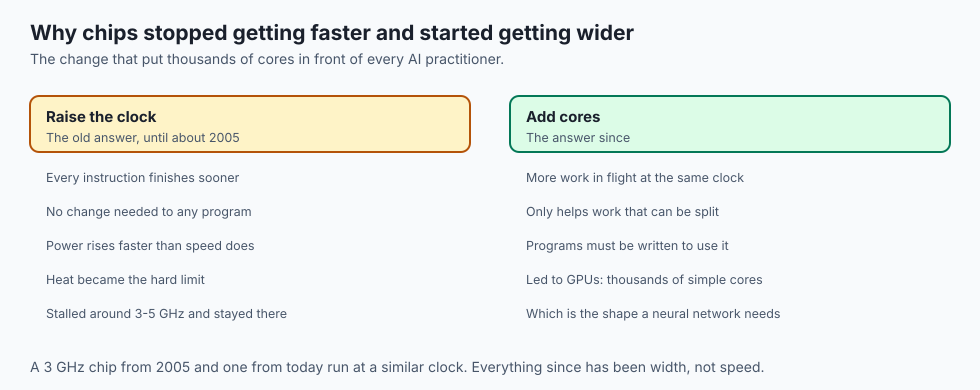

- **Fetch, decode, execute, write back.** That is the whole repertoire.
- **Clock speed stopped rising around 2005**, so chips got wider instead of
  faster — which is the reason GPUs exist in the form they do.

- **When your GPU sits at 40% utilisation**, this lesson tells you why: something
  sequential could not feed it fast enough.

---

## The idea in plain language

A processor is a machine that reads one instruction, does it, and moves on —
faster than you can imagine, and with no idea what any of it means.

- **It has no plan.** There is no strategy, no lookahead in the human sense. Just
  the next address, over and over.

- **The clock is a drumbeat.** A shared signal that says "now" a few billion times
  a second. Nothing happens between beats.

- **The instruction is bits.** `ADD R1, R2 -> R3` is a pattern like
  `0001 0001 0010 0011`; the human-readable form is for you, not for the chip.

---

## Historical background

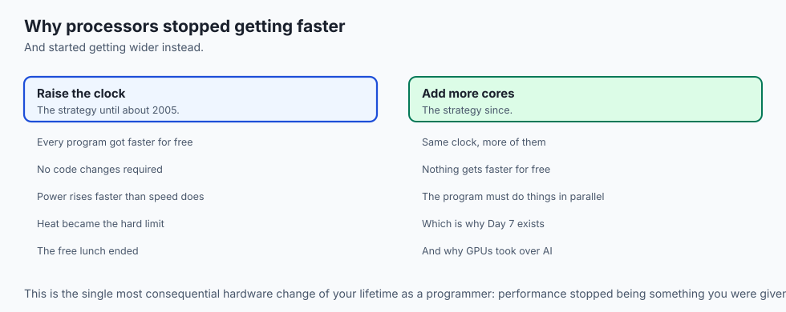

| When | What arrived | Why it mattered |
| --- | --- | --- |
| 1945 | Von Neumann's stored-program design | The cycle as we still run it |
| 1971 | Intel 4004, the first commercial microprocessor | A whole CPU on one chip |
| 1978 | Intel 8086 | The ancestor of every x86 chip in use |
| Early 1980s | The RISC argument | Fewer, simpler instructions, decoded cheaply |
| 1985 | ARM's first design | The philosophy that now runs every phone |
| ~2005 | Clock speeds stall | Power and heat end the megahertz race |
| 2020 | Apple M1 | A RISC laptop chip outperforming high-end x86 |

- **The 1945 loop has not changed.** Everything since is about doing more of it at
  once, not doing it differently.

- **The RISC-CISC argument was settled by physics**, not by taste: simpler
  decoding costs less power, and power became the binding constraint.

---

## What it is — and what it is not

**It is** a loop with four stages, driven by a clock, over instructions held in
memory as data.

**It is not** any of these, and each misconception costs you later:

- **Not thinking.** No stage involves understanding. Decode means routing bits to
  circuitry, nothing more.

- **Not one instruction at a time, really.** Modern chips overlap several and may
  finish them out of order — but the logical story stays this loop.

- **Not the same as a core count.** "8 CPUs" often means 4 physical cores running
  two instruction streams each.

- **Not where your program is slow.** Almost always it is waiting for memory,
  which is Day 3.

---

## Why it was created and what problems it solves

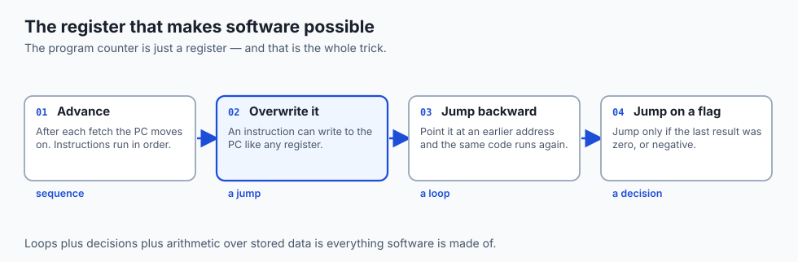

The cycle exists to solve one problem: **making a machine general.**

- **Before it, machines were rewired for each job.** Changing the task meant
  changing the cabling, over hours or days.

- **The stored-program idea put instructions in memory**, so changing the task
  means loading a different file.

- **That only works if something reads them in order**, decides what each means,
  and moves on. That something is this cycle.

---

## How it works

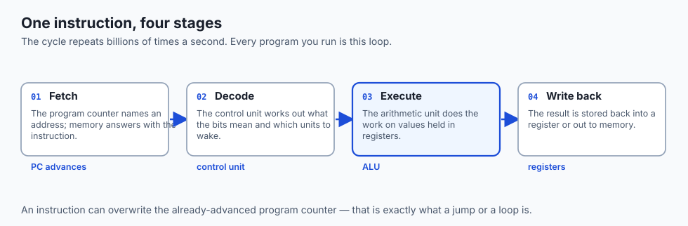

### The parts inside a core


| Part | Role in the cycle |
| --- | --- |
| **Program counter** | Holds the address of the next instruction, then advances |
| **Instruction register** | Holds the instruction while it is decoded |
| **Control unit** | Reads the pattern and steers every other part |
| **Registers** | The fastest storage; hold the values in play right now |
| **ALU** | Does the arithmetic, and sets flags about the result |
| **Flags** | Single bits recording facts like "the result was zero" |
| **Bus** | The wiring to memory — far slower to answer than a register |

### The cycle, in slow motion

A toy CPU with four registers and four instructions — `LOAD`, `ADD`, `PRINT`,
`HALT` — makes each phase visible. Real simulator output, adding 5 and 3:

```text
PC=0  FETCH    LOAD R1,5
      DECODE   opcode=LOAD  dest=R1  value=5
      EXECUTE  R1 <- 5
      REGS     R1=5 R2=0 R3=0 R4=0

PC=2  FETCH    ADD R1,R2->R3
      DECODE   opcode=ADD  src1=R1  src2=R2  dest=R3
      EXECUTE  R3 <- 5 + 3 = 8
```

- **Fetch** — the PC names an address; memory answers with the instruction.
- **Decode** — the opcode selects circuitry; the operand fields route registers.
- **Execute** — the ALU combines the values and sets flags.
- **Write back** — the result lands in a register or goes out to memory.

### Overlapping the stages

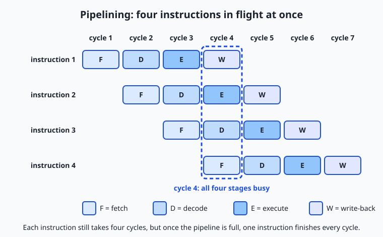

- **The stages use different circuitry**, so they need not sit idle waiting.
- **While one instruction executes, the next can decode and a third can fetch.**
- **A result is finished every cycle**, even though each instruction still takes
  four cycles end to end.

- **A jump breaks it.** The chip guessed which way the branch would go and, when
  wrong, throws away the partly-done work.

---

## An everyday analogy

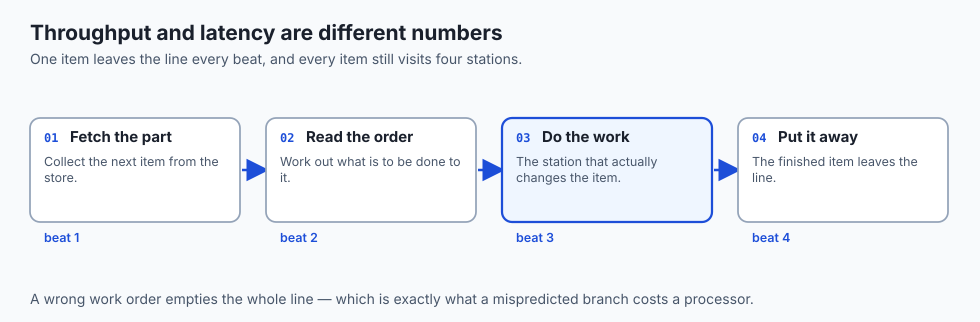

An assembly line, and the reason it is not a single craftsman.

| The line | The processor |
| --- | --- |
| A station that fetches the next part | Fetch |
| A station that reads the work order | Decode |
| A station that does the work | Execute |
| A station that puts the finished item away | Write back |
| One item leaving the line per beat | One instruction completing per cycle |
| Each item still visiting four stations | Four cycles of latency per instruction |

- **Throughput and latency are different things.** The line finishes one item per
  beat while every item still takes four beats to traverse.

- **A wrong work order empties the line.** That is a mispredicted branch.

---

## Examples in practice

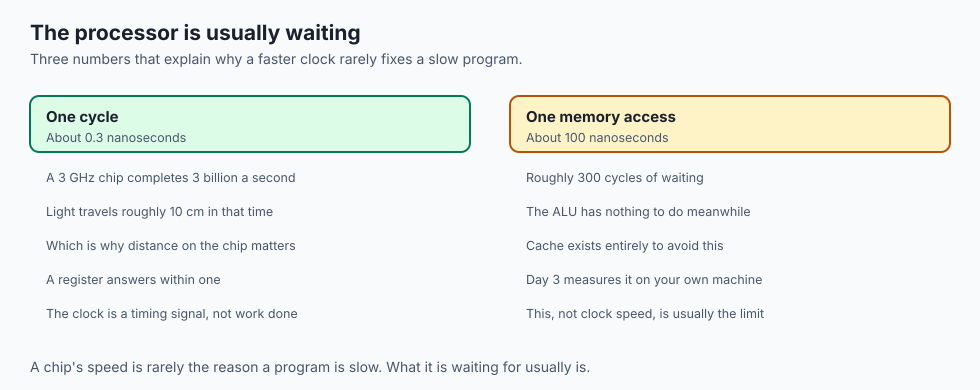

Three numbers worth carrying out of this lesson:

- **A 3 GHz chip completes about three billion cycles a second.** The clock is a
  timing signal, not a count of work done.

- **A cycle is about 0.3 nanoseconds.** Light travels roughly 10 cm in that time,
  which is why physical distance on the chip matters.

- **A memory access costs about 100 nanoseconds** — some 300 cycles. The
  processor is often waiting, not computing.

That last line is the bridge to tomorrow: a chip's speed is rarely the reason a
program is slow.

---

## Implications: security, privacy, performance, scalability, and cost

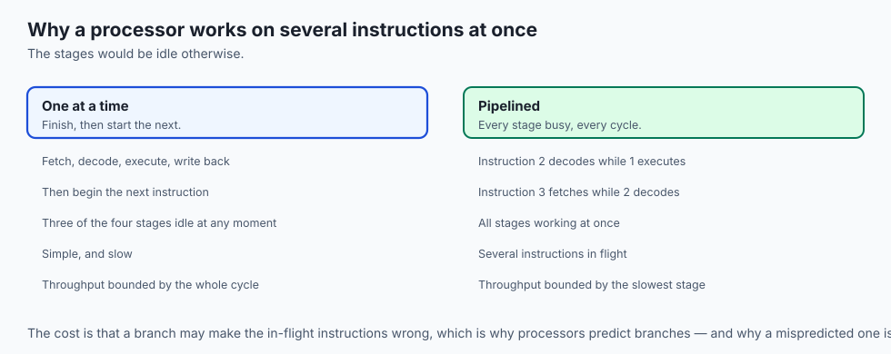

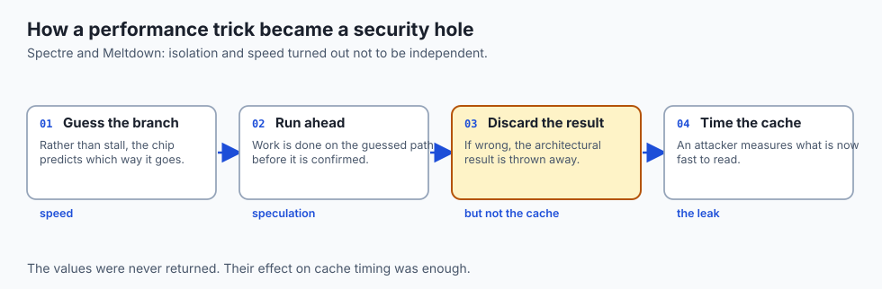

- **Performance.** Clock speed alone tells you almost nothing. Instructions per
  cycle, cache behaviour and memory latency matter more.

- **Scalability.** Sequential work does not get faster with more cores. Only work
  that can be split does.

- **Security.** Speculative execution — guessing past a branch — leaked data
  across boundaries in Spectre and Meltdown. Performance and isolation are not
  independent.

- **Cost.** Cloud pricing is per core-hour, so a job that cannot use its cores is
  paying for idle silicon.

- **Energy.** Simpler instructions cost less power to decode, which is why phones
  went RISC first and laptops followed.

---

## Alternatives: free, open source, and commercial

As with Day 1, "alternatives" here means other excellent ways to learn and explore this material.

| Resource | Type | What it offers | Cost |
| --- | --- | --- | --- |
| The Day 2 lab in this course | Free | A toy CPU you run, trace by hand, and program yourself | Free |
| Crash Course Computer Science (PBS Digital Studios) | Free video series | Short visual episodes on the ALU, registers, the instruction cycle, and clock speed | Free |
| Wikipedia: "Instruction cycle" and "Central processing unit" | Free reference | Well-cited walkthroughs of the cycle and of CPU organization, with history | Free |
| From Nand to Tetris (Schocken & Nisan) | Open course materials | You *build* a working CPU from gates, then write programs for it | Free materials; optional companion book |
| "Code" by Charles Petzold (2nd ed.) | Book (commercial) | Chapters that assemble a CPU conceptually, wire by wire, at beginner pace | Book purchase |
| A CPU visualizer or simulator app of your choice | Free/open source tools | Many educational simulators animate registers and the cycle graphically | Typically free |

If today's lesson left you wanting to see the machinery drawn and animated, the Crash Course episodes on the CPU are the gentlest next step; if it left you wanting to build the machinery, Nand to Tetris is the definitive project and pairs perfectly with this section of the course.

## Comparison with related concepts

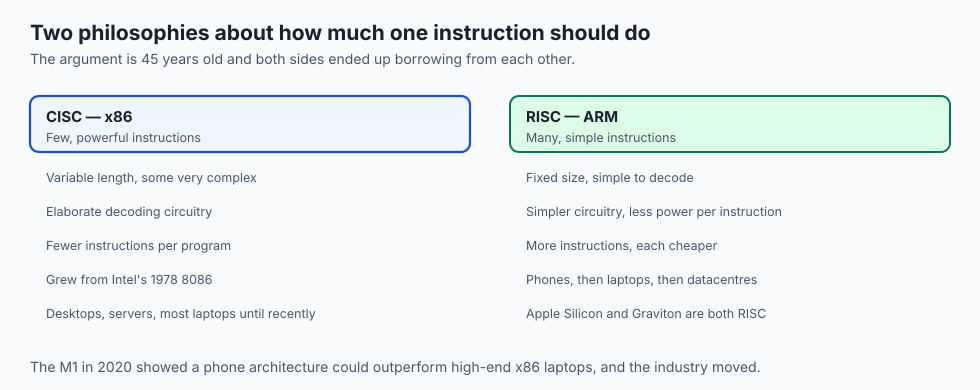

| Concept A | Concept B | Key difference |
| --- | --- | --- |
| Control unit | ALU | The control unit decides and steers each step; the ALU performs the arithmetic and logic the step requires |
| Program counter | Instruction register | The PC holds the *address* of the next instruction; the IR holds the *instruction itself* while it is decoded |
| Clock speed (GHz) | IPC | Cycles per second versus instructions completed per cycle — performance is roughly their product |
| Machine code | Assembly language | Machine code is the raw bit patterns; assembly is a human-readable notation for the same instructions (our `ADD R1,R2->R3` is assembly-style) |
| x86 | ARM | Two incompatible instruction-set contracts: complex variable-length instructions versus simple fixed-size ones, with different power and licensing histories |
| Pipelining | Multicore | Pipelining overlaps stages of *one* instruction stream; multicore runs *separate* streams on duplicated hardware |
| CPU core | GPU | A core maximizes speed on a single sequential stream; a GPU maximizes throughput on thousands of identical parallel operations |

## When to use it — and when not to

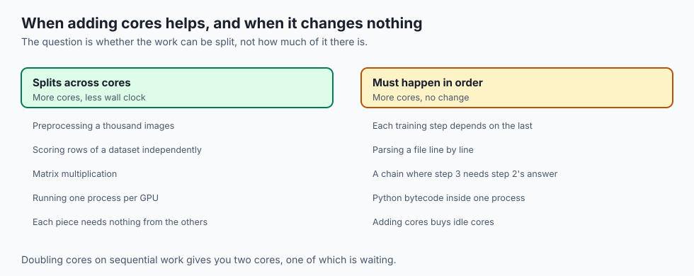

**Reason at this level when** a job is CPU-bound and you need to know why, you
are choosing between architectures, or you are explaining why more cores did not
help.

**Ignore it when** writing ordinary code. The abstraction is sound, and thinking
about pipeline stalls while writing a data loader is how you write it slowly and
badly.

**The tell that you need it:** a measurement that says the processor is busy but
the work is not progressing — or that it is idle while the job is still slow.

---

## The AI connection

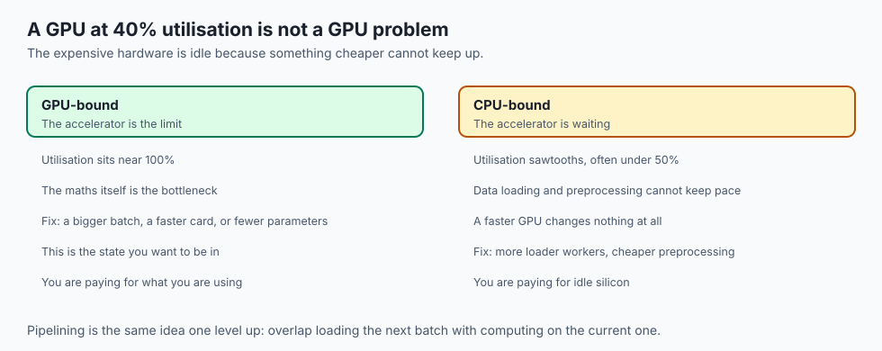

- **The GIL makes data loaders spawn processes, not threads.** Only one thread
  executes Python at a time, so parallel preprocessing needs separate processes.

- **A sawtooth utilisation graph is the signature of a starved accelerator.**
- **Pipelining is the fix, one level up:** overlap loading the next batch with
  computing on the current one, and the waiting disappears.

---

## Knowledge check

Try these from memory before looking back:

1. Name the five main parts inside a CPU core covered today and give each one's one-sentence job description.
2. The program counter advances immediately after fetch, before execution. Explain why that ordering is what makes jumps and loops possible.
3. A 4.0 GHz processor benchmarks slower than a 3.2 GHz processor on the same task. Give two distinct explanations using today's vocabulary.
4. In the four-stage pipeline diagram, why does the machine complete one instruction per cycle from cycle 4 onward, even though every instruction takes four cycles? What everyday system works the same way?
5. Your training job shows 25% GPU utilization and one CPU core pinned at 100%. Diagnose the situation in two sentences, using the term CPU-bound correctly.

## Hands-on exercise

Today you run a CPU you can see inside. The Day 2 lab directory contains `toy_cpu.sh`, a simulator for a four-instruction machine — `LOAD Rn,value`, `ADD Ra,Rb->Rc`, `PRINT Rn`, `HALT`, over registers R1–R4 — that prints every fetch, decode, and execute step, plus the register file after each instruction. From the lab directory, run the demonstration program:

```bash
bash examples/toy_cpu.sh examples/programs/add-two-numbers.txt
```

Read the trace against the lesson: find the PC advancing, find the decode line naming opcode and operands, find the write-back landing in R3. Then open `starter/trace-worksheet.md` and — before running anything else — hand-trace the three worksheet programs, predicting every register value, every `OUTPUT:` line, and the final instruction count. Only then check yourself:

```bash
bash examples/toy_cpu.sh examples/programs/trace-01.txt
bash examples/toy_cpu.sh examples/programs/trace-02.txt
bash examples/toy_cpu.sh examples/programs/trace-03.txt
```

Finally, run and then extend your own program:

```bash
bash examples/toy_cpu.sh starter/my_program.txt
bash tests/run_tests.sh
```

### Expected output

The demonstration program produces exactly this (a real captured run):

```text
=== Toy CPU ===
Program: examples/programs/add-two-numbers.txt (5 instructions in memory)
Registers start at: R1=0 R2=0 R3=0 R4=0

PC=0  FETCH    LOAD R1,5
      DECODE   opcode=LOAD  dest=R1  value=5
      EXECUTE  R1 <- 5
      REGS     R1=5 R2=0 R3=0 R4=0

PC=1  FETCH    LOAD R2,3
      DECODE   opcode=LOAD  dest=R2  value=3
      EXECUTE  R2 <- 3
      REGS     R1=5 R2=3 R3=0 R4=0

PC=2  FETCH    ADD R1,R2->R3
      DECODE   opcode=ADD  src1=R1  src2=R2  dest=R3
      EXECUTE  R3 <- R1 + R2 = 5 + 3 = 8
      REGS     R1=5 R2=3 R3=8 R4=0

PC=3  FETCH    PRINT R3
      DECODE   opcode=PRINT  reg=R3
      EXECUTE  send R3 to the output
OUTPUT: 8
      REGS     R1=5 R2=3 R3=8 R4=0

PC=4  FETCH    HALT
      DECODE   opcode=HALT
      EXECUTE  stop the clock

HALT reached after 5 instructions.
Final registers: R1=5 R2=3 R3=8 R4=0
```

Line by line: each `PC=` line is a fetch, and the PC values count 0 through 4 in order because nothing ever overwrites the counter; each `DECODE` line shows the control unit's reading of the instruction; each `EXECUTE` line is the ALU or data movement doing the work; `OUTPUT: 8` is the one visible result; and the final line is the register file at halt.

### Validate your work

You are done when you can check every box:

- [ ] You ran the demonstration program and can point at one fetch, one decode, one execute, and one write-back in its output.
- [ ] You completed all three worksheet traces on paper before running the programs.
- [ ] Your predicted `OUTPUT:` lines, final registers, and instruction counts matched the simulator for all three programs — or you wrote a one-sentence "why" for each miss.
- [ ] Your extended `starter/my_program.txt` uses at least one `ADD`, prints at least two values, and ends at `HALT reached after N instructions.` with no errors.
- [ ] `bash tests/run_tests.sh` reports `27 checks, 0 failure(s).`

### Troubleshooting

- **`unknown opcode 'load'`** — opcodes are uppercase: `LOAD`, `ADD`, `PRINT`, `HALT`. The machine is strict because real decoders are stricter: one wrong bit is a different instruction.
- **`unknown register 'R5'` or `'R0'`** — the machine has exactly R1 through R4, a fixed register set baked into its design, just like real silicon.
- **`ADD needs the form: ADD Ra,Rb->Rc`** — check for the comma between sources and the two-character arrow `->` before the destination; an arrow pasted from a word processor (`→`) will not decode.
- **`the program ended without HALT`** — every program must end with `HALT`; a real CPU never decides it is finished, it just keeps fetching whatever bits come next. Add the instruction and rerun.
- **`program file not found`** — run commands from the lab directory so relative paths like `examples/programs/trace-01.txt` resolve.

### Common mistakes

- **Using a register's new value one instruction too early.** In `ADD R2,R2->R2`, the ALU reads the *old* R2 twice, adds, and only then writes back. Worksheet program 2 exists to catch exactly this.
- **Treating `PRINT` as showing the final value.** `PRINT` emits the register's value at that instant; program 3 prints the same register twice and gets two different numbers. The trace is a timeline, not a summary.
- **Forgetting that the PC has already advanced.** After fetching the instruction at address 2, the PC reads 3 during that instruction's execution. It feels like a bookkeeping triviality; it is actually the mechanism that will make jumps, loops, and every control structure possible.
- **Reading the trace without predicting first.** Watching output confirms nothing about your mental model — predictions do. The worksheet's order (predict, then run) is the whole exercise.

## Practice assignment

1. **Run the toy CPU on a program you write.** Use only `LOAD`, `ADD`, `PRINT`
   and `HALT`, and make it produce a number you predicted in advance.

2. **Count the cycles.** For a five-instruction program, how many cycles without
   pipelining, and how many with?

3. **Break it deliberately.** Remove `HALT` and record exactly what the simulator
   says. Explain the message in terms of the program counter.

---

## Extension challenge

The toy machine has no multiply instruction. Build multiplication out of what it
has.

1. **Write it.** Multiply two small numbers using only `LOAD`, `ADD`, `PRINT` and
   `HALT`, plus repetition you unroll by hand.

2. **Count the cost.** How many instructions for 5 x 3? For 5 x 30?
3. **Draw the conclusion.** Write two sentences on why real CPUs have a multiply
   instruction in hardware, in terms of the cycle count you just measured.

---

