## Why this matters

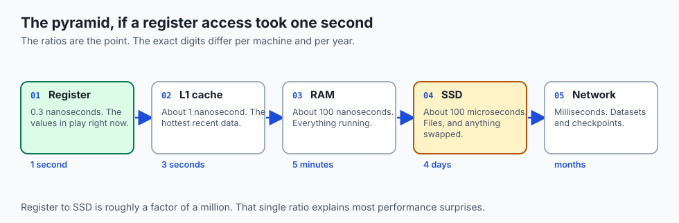

Every number a model touches lives somewhere, and where it lives decides how fast
it can be reached.

- **The gap between the fastest and slowest tier is about a million to one.**
- **Almost every slow program is waiting for data**, not computing on it.
- **"Does it fit in GPU memory?"** is the first question practitioners ask of any
  model, and this lesson is why.

---

## The idea in plain language

No memory technology is fast, large and cheap at the same time, so machines layer
several of them.


- **Up the pyramid:** faster, smaller, more expensive per byte.
- **Down the pyramid:** larger, slower, cheaper.
- **It works because of locality.** Programs reuse what they just touched and
  march through data in order, so hardware keeps hot data near the top by itself.

---

## Historical background

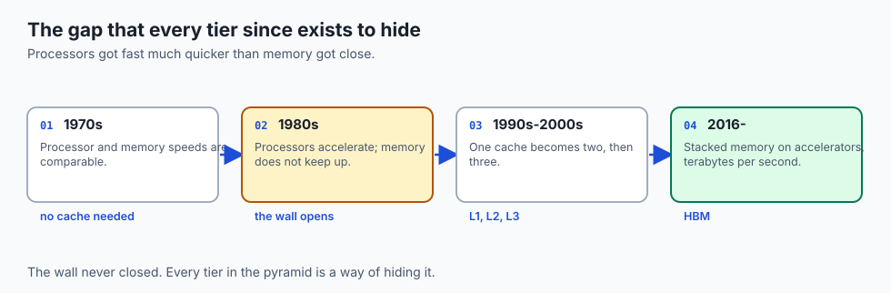

| When | What changed | Why it mattered |
| --- | --- | --- |
| 1946 | Burks, Goldstine and von Neumann propose a hierarchy | The idea predates the hardware by decades |
| 1965 | Wilkes describes the cache | A small fast memory that fills itself |
| 1970s | DRAM becomes the standard for main memory | Cheap capacity, at a latency cost |
| 1980s | Processors outpace memory | The "memory wall" opens and never closes |
| 2000s | Multi-level caches, L1 to L3 | One tier was no longer enough |
| 2010s | SSDs replace spinning disks | A thousandfold latency improvement, one tier down |
| 2016– | High-bandwidth memory on accelerators | Stacked memory, terabytes per second |

- **The memory wall is the whole story.** Processors got fast much quicker than
  memory got close, and every tier since exists to hide that gap.

---

## What it is — and what it is not

**It is** a set of tiers, each roughly an order of magnitude slower, larger and
cheaper per byte than the one above.

**It is not:**

- **Not something you configure.** Hardware moves data between tiers
  automatically, using locality. You influence it by how you access data.

- **Not the same as memory versus storage.** That is one boundary in the pyramid,
  not the whole of it.

- **Not a set of exact numbers.** Carry the orders of magnitude, not the digits —
  they differ per machine and per year.

---

## Why it was created and what problems it solves

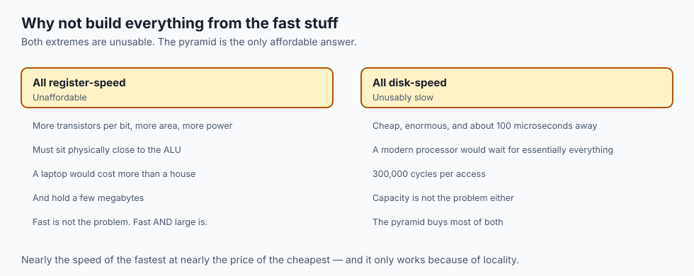

Fast memory needs more transistors per bit, more area, more power, and must sit
physically close to the processor. All four are expensive.

- **If all memory were register-speed**, a laptop would cost more than a house and
  hold a few megabytes.

- **If all memory were disk-speed**, a modern processor would spend essentially
  all its time waiting.

- **The pyramid buys nearly the speed of the fastest at nearly the price of the
  cheapest** — and it only works because of locality.

---

## How it works

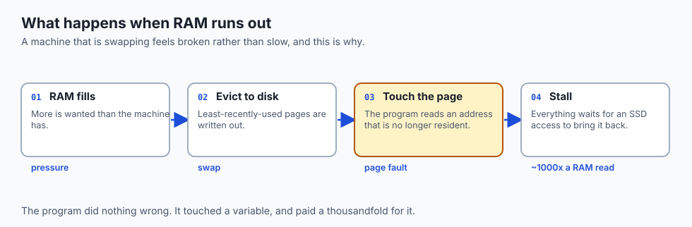

### The levels, one by one

| Level | Typical latency | Typical size | What it holds |
| --- | --- | --- | --- |
| Registers | ~0.3 ns (1 cycle) | ~1 KB | The values in play right now |
| L1 cache | ~1 ns | 32–128 KB | The hottest recent data |
| L2 cache | ~4 ns | 0.5–2 MB | Slightly cooler data |
| L3 cache | ~10–40 ns | 8–64 MB | Shared across cores |
| RAM | ~100 ns | 8–128 GB | Everything currently running |
| SSD | ~100 µs | 256 GB–4 TB | Files, and anything swapped out |
| Network storage | ~1–100 ms | Effectively unlimited | Datasets, checkpoints, archives |

**At human scale**, if a register access took one second: L1 is about three
seconds, RAM is about five minutes, an SSD is about four days, and network
storage is somewhere between a month and years.

### Locality, and why loops are fast


- **A miss loads a whole 64-byte cache line**, not one value.
- **So the neighbouring elements arrive free**, and the next seven reads are hits.
- **The prefetcher notices the pattern** and fetches upcoming lines early.
- **That is why sequential access runs at nearly cache speed** even over data far
  larger than the cache.

Access the same array in random order and every read is a miss. Same data, same
loop, an order of magnitude slower.

### Virtual memory and swapping

- **Each process sees its own private address space**, mapped to real memory by
  the hardware.

- **When RAM fills, the OS moves least-recently-used pages to disk.**
- **Touching a swapped-out page causes a page fault**, and the program stalls for
  an SSD access — roughly a thousand times a RAM access.

- **A machine that is swapping heavily feels broken** rather than slow, and this
  is why.

---

## An everyday analogy

A chef, a counter, a pantry and a warehouse across town.

| The kitchen | The machine | The cost of a trip |
| --- | --- | --- |
| In your hands | Registers | Instant |
| The cutting board | L1 cache | A turn of the head |
| The counter | L2 and L3 | A step |
| The pantry | RAM | A walk to the next room |
| The warehouse across town | SSD | A drive |
| A supplier in another city | Network storage | A delivery, tomorrow |

- **Good cooks stage ingredients before starting.** That is locality.
- **A recipe that sends you to the warehouse for each ingredient** is a program
  with poor access patterns, and no amount of knife skill saves it.

---

## Examples in practice

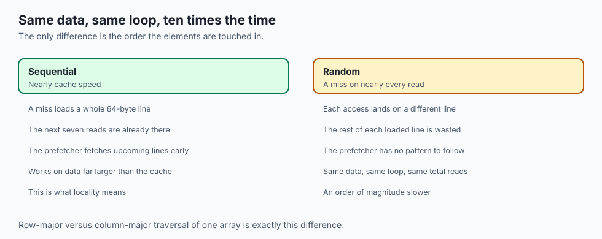

Two measurements you will make in today's lab:

- **A warm read** — the file is already in the page cache, so the number you get
  is RAM speed, not disk speed.

- **A cold read** — the file is larger than RAM, so the cache cannot hold it and
  you see the SSD.

The gap between them is the pyramid, measured on your own machine.

**Where the money goes:** per byte, each step down is roughly an order of
magnitude cheaper. Registers are the most expensive memory ever built and there
are about a kilobyte of them. Network storage is nearly free and is a thousand
times further away than RAM.

---

## Implications: security, privacy, performance, scalability, and cost

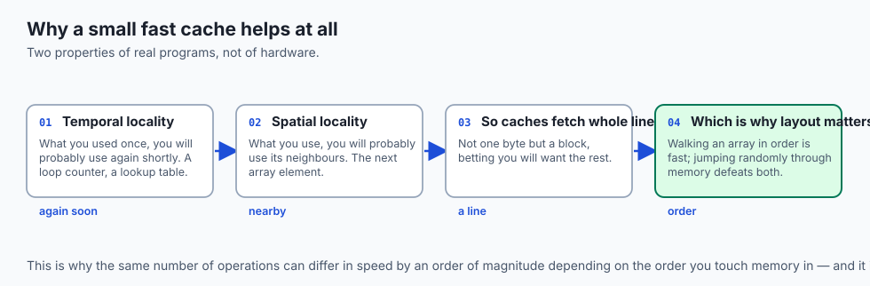

- **Performance.** Look at the hierarchy before optimising arithmetic. A cache
  miss costs more than hundreds of instructions.

- **Access order is a design decision.** Row-major versus column-major traversal
  of the same array can differ by an order of magnitude.

- **Security.** Cache timing leaks information across boundaries — Spectre and
  Meltdown both used it. Shared hardware means a shared cache.

- **Privacy.** Data swapped to disk outlives the process, and is not erased when
  the program exits.

- **Cost.** Renting a machine with more RAM is often cheaper than the engineering
  time spent making a job fit in less.

---

## Alternatives: free, open source, and commercial

| Resource | Type | What it gives you |
| --- | --- | --- |
| The Day 3 lab | Free | Your own cache sizes and read timings |
| Colin Scott's latency page | Free tool | "Latency numbers every programmer should know", animated by year |
| Crash Course Computer Science | Free video series | Short visual episodes on memory and storage |
| Drepper, *What Every Programmer Should Know About Memory* | Free paper | The deep treatment, still the reference |
| `perf` / Instruments | Free tools | Measure real cache misses on real programs |
| Hennessy & Patterson | Textbook | The standard academic account |

- **Colin Scott's page is the one to bookmark.** Watching the numbers move by
  year makes the memory wall visible in a way prose does not.

---

## Comparison with related concepts

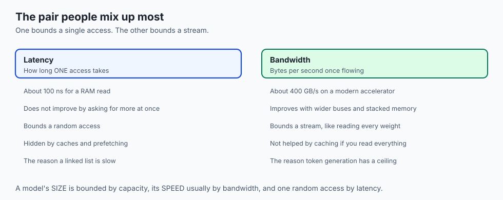

| Often confused | The actual difference |
| --- | --- |
| Memory vs storage | Volatile and ~100 ns vs permanent and ~100 µs |
| Cache vs RAM | Automatic, small, on-chip vs addressed, large, off-chip |
| Latency vs bandwidth | How long one access takes vs bytes per second once flowing |
| Page cache vs cache | An OS use of spare RAM vs hardware between CPU and RAM |
| Swap vs storage | Storage borrowed to stand in for RAM vs storage used as itself |

**Latency and bandwidth are the pair to keep straight.** A model's *size* is
bounded by capacity; its *speed* is usually bounded by bandwidth; and a single
random access is bounded by latency.

---

## When to use it — and when not to

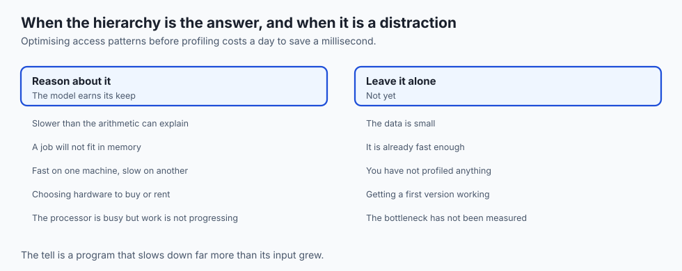

**Reason at this level when** something is slower than its arithmetic can explain,
a job will not fit in memory, you are choosing hardware, or a program is fast on
one machine and slow on another.

**Ignore it when** the data is small, the job is fast enough, or you have not
measured yet. Optimising access patterns before profiling is how people spend a
day to save a millisecond.

**The tell:** the processor is busy but the work is not progressing — or the same
code is dramatically slower on a larger input than the size increase explains.

---

## The AI connection

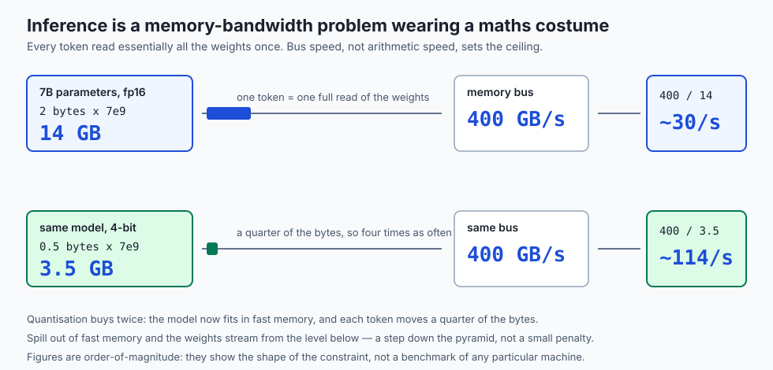

- **Bandwidth divided by model size is the token rate.** That is the whole
  connection, and it is arithmetic rather than intuition.

- **Quantisation moves both terms in your favour** — a smaller model fits where it
  did not, and moves fewer bytes per token.

- **Spilling out of fast memory is not a small penalty.** It is a step down the
  pyramid, and each step is an order of magnitude.

---

## Knowledge check

Try these from memory before looking back:

1. Draw the pyramid from registers to network storage and attach an approximate latency to each level. Which single gap is the largest, and roughly how large is it?
2. Explain temporal and spatial locality with one everyday example each, and state which one cache lines exploit.
3. A program sums a large table row by row in 2 seconds; summing column by column takes 11 seconds. Explain why, using the terms cache line and miss.
4. Your laptop has 16 GB of RAM and becomes almost unusable when you open a 20 GB dataset, though it worked fine at 10 GB. Name the mechanism and describe what is happening at the level of pages.
5. A 7-billion-parameter model is stored at 2 bytes per weight on a machine with roughly 400 GB/s of memory bandwidth. Estimate the ceiling on tokens generated per second, and explain what 4-bit quantization does to both the model's footprint and that ceiling.

## Hands-on exercise

Measure your own pyramid. Worked through fully in the Day 3 lab directory.

| What you want | macOS | Linux |
| --- | --- | --- |
| L1 and L2 sizes | `sysctl hw.l1dcachesize hw.l2cachesize` | `lscpu \| grep -i cache` |
| Performance-core caches | `sysctl hw.perflevel0.l1dcachesize` | — |
| Timed cold and warm reads | `bash examples/measure_read_speed.sh` | same |

On Apple Silicon the plain names usually report the *efficiency* cores;
`perflevel0` is the performance cluster and is typically twice as large.

### Expected output

```text
=== Memory Hierarchy Measurements ===
L1 data cache: 131072 bytes (128 KiB)
L2 cache: 16777216 bytes (16 MiB)
RAM: 38654705664 bytes (36 GiB)
Cold read (first pass):  0.023 s (8695 MB/s)
Warm read (second pass): 0.022 s (9090 MB/s)
Warm read speed-up over cold: 1.0x
```

- **Read the shape, not the digits.** L1 in hundreds of KiB, L2 in MiB, RAM in
  GiB — three jumps of roughly a hundredfold.

- **A speed-up near 1.0x is itself evidence of the page cache.** Both reads ran at
  RAM speed because the file was still cached from being written, so the "cold"
  read never touched the SSD.

- **To see a truly cold read**, use a file much larger than RAM. The lab's
  troubleshooting file shows how.

### Validate your work

- [ ] L1 size stated and converted to KiB
- [ ] L2 (and L3, if present) stated and converted to MiB
- [ ] Both placed between registers and RAM, sizes ordered correctly
- [ ] Both a cold and a warm read time recorded
- [ ] You can say in one sentence *which* level served the warm read
- [ ] `bash tests/run_tests.sh` reports 0 failures

### Troubleshooting

- **`unknown oid 'hw.perflevel0...'`** — you are on an Intel Mac or older macOS.
  Use the plain `hw.l1dcachesize` names.

- **`lscpu` shows totals, not per-core sizes.** Some versions sum across cores
  ("L1d: 512 KiB (8 instances)"); divide by the instance count.

- **Cold and warm reads take the same time.** The file was still in the page
  cache. That is the page cache working, not the lab failing.

- **`dd: operation not permitted`** — run from inside the lab directory, which the
  script requires precisely so it only ever writes there.

### Common mistakes

- **Comparing your L1 to a friend's L3.** Levels compare like for like, and
  vendors split and label them differently.

- **Reporting the efficiency cores' L1 as "the" L1.** State which cores you
  measured.

- **Treating the measured MB/s as a property of the SSD.** The cold read mixes
  SSD speed, page-cache effects and filesystem behaviour. It demonstrates the
  hierarchy; it is not a disk benchmark.

- **Forgetting the units.** 131072 bytes is 128 KiB. Mixing KiB with KB muddles
  every comparison.

---

## Practice assignment

1. **Measure both reads.** Time a warm read and a cold read of the same file on
   your machine, and record both numbers.

2. **Explain the gap** in one sentence, using only the words cache, page cache and
   latency.

3. **Predict, then check.** Before running it, write down what you expect a second
   cold read to cost, and why. Then run it.

---

## Extension challenge

Make the cold read honestly cold, then reason about what you measured.

1. **Grow the file past RAM.** Several times your memory, so the page cache
   cannot hold it. Mind free disk space, and delete it afterwards.

2. **Re-measure.** Record the new cold and warm times and the ratio between them.
3. **Explain the difference** from your first run, using only cache, page cache,
   locality, latency and bandwidth.

4. **Predict one more.** What would a third read cost, and why? Write it down
   before running it.

---

