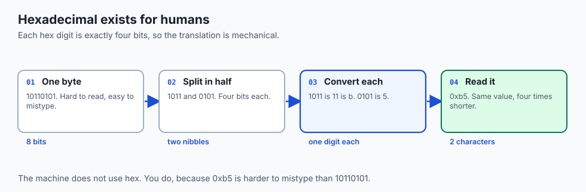
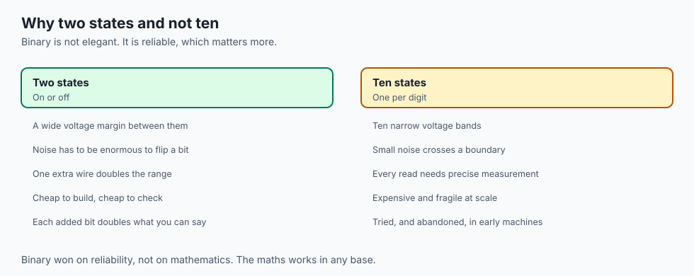
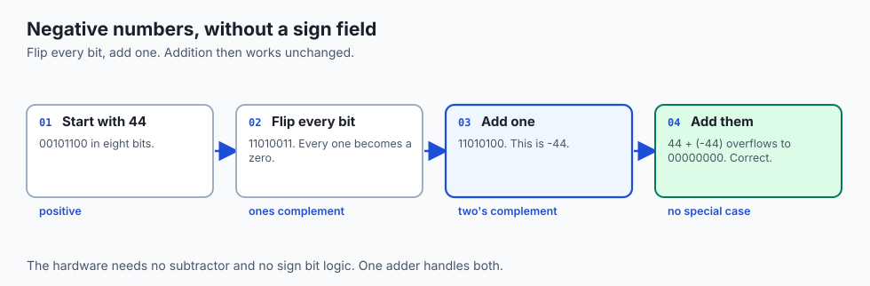
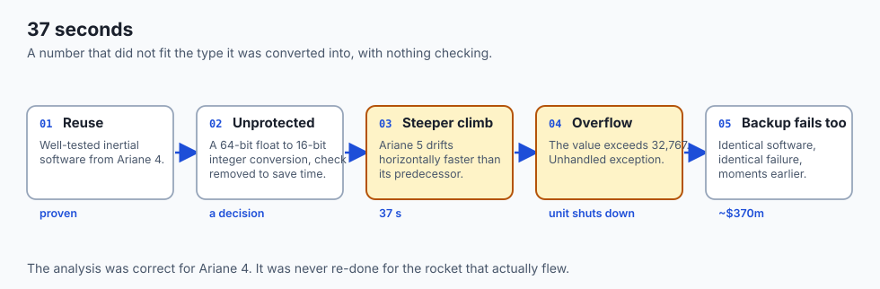
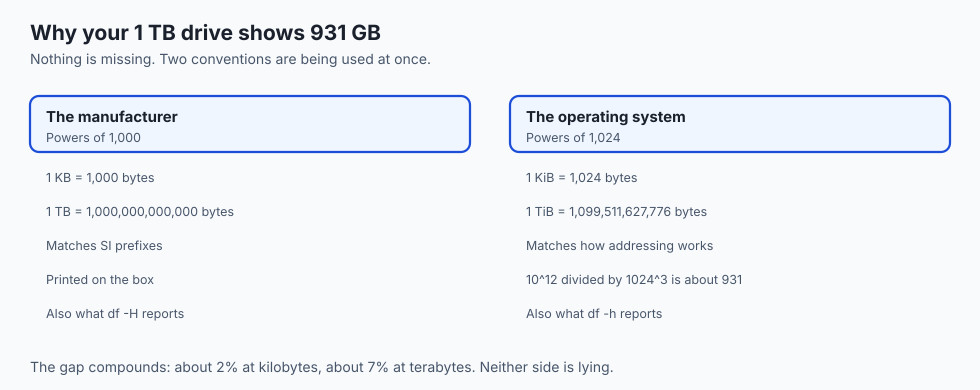
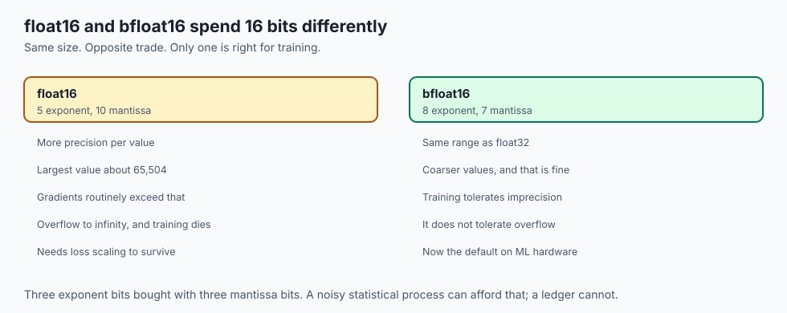
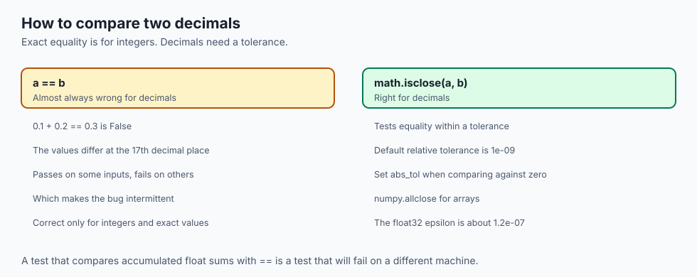
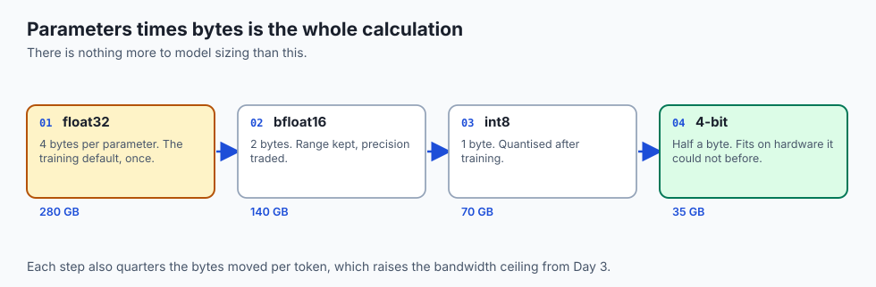

## Why this matters

Everything in a computer is a number, and every number is a choice about how many
bits to spend.

- **That choice is a lever with a price.** Model size is parameters times bytes
  per parameter — nothing more complicated.

- **Get it wrong and nothing raises.** A dtype mismatch produces different
  numbers, not an error.

- **The Ariane 5 rocket was destroyed by this**, 37 seconds after ignition.

---

## The idea in plain language



Bits carry no meaning. The *type* decides what they say.


- **The same 32 bits** are an integer, a decimal, or four letters, depending only
  on how you agree to read them.

- **Nothing in the bits records which.** That agreement lives in your program, a
  file header, or a column type.

- **Break the agreement and you get a different answer**, silently.

---

## Historical background

| When | What arrived | Why it mattered |
| --- | --- | --- |
| 1703 | Leibniz publishes binary arithmetic | Two symbols suffice for any number |
| 1937 | Shannon links Boolean algebra to circuits | Binary becomes buildable |
| 1956 | Buchholz coins "byte" | A named unit for a group of bits |
| 1963 | ASCII standardised | 7 bits, 128 characters, English only |
| 1985 | IEEE 754 | One floating-point standard everyone follows |
| 1991 | Unicode 1.0 | One code point per character, for every script |
| 2018– | bfloat16 spreads through ML hardware | Range kept, precision traded, on purpose |

- **IEEE 754 is why `0.1 + 0.2 != 0.3` on every machine you will ever use** — it
  is the standard behaving correctly, not a bug.

- **bfloat16 is the newest entry and the most instructive**: a format invented
  because training tolerates coarse values far better than overflow.

---

## What it is — and what it is not

**It is** a set of agreements about what patterns of bits mean.

**It is not:**

- **Not a property of the hardware.** The same memory holds an integer today and a
  float tomorrow.

- **Not lossless for decimals.** One tenth has no finite binary expansion, exactly
  as one third has none in decimal.

- **Not about size alone.** Range and precision are separate axes, and formats
  trade them against each other deliberately.

---

## Why it was created and what problems it solves



- **Two states are easy to build reliably.** A switch is on or off, with a wide
  margin between them — ten voltage levels would be far more fragile.

- **Place value scales.** Eight bits give 256 values, sixteen give 65,536.
  Each added bit doubles the range at a cost of one wire.

- **Hexadecimal exists for humans**, not machines. Each hex digit maps to exactly
  four bits, so long binary strings become short and mechanically translatable.

---

## How it works



### Place values


- **Each position is worth twice the one to its right**: 128, 64, 32, 16, 8, 4,
  2, 1.

- **`10110101` is 128 + 32 + 16 + 4 + 1 = 181.**
- **Eight bits hold 0–255**; sixteen hold 0–65,535.

### Negative numbers: two's complement

- **Flip every bit and add one.** That is the whole rule.
- **The top bit becomes a sign** without needing a separate sign field.
- **Addition works unchanged** on negatives, which is why hardware uses it.

### Decimals: sign, exponent, mantissa


A float splits its bits three ways:

| Part | What it controls | float32 | float16 | bfloat16 |
| --- | --- | ---: | ---: | ---: |
| Sign | Positive or negative | 1 | 1 | 1 |
| **Exponent** | **Range** — how large or small | 8 | 5 | **8** |
| **Mantissa** | **Precision** — significant digits | 23 | 10 | **7** |

- **bfloat16 keeps float32's exponent** and gives up mantissa bits. Same range,
  coarser values.

- **That is exactly the right trade for training**, which tolerates imprecision
  far better than overflow to infinity.

- **float16's 5-bit exponent caps values near 65,504**, which gradients routinely
  exceed — hence loss scaling.

### Why 0.1 + 0.2 is not 0.3

- **One tenth has no finite binary expansion**, just as one third has none in
  decimal.

- **The machine stores the two nearest representable values** and adds them.
- **The rounded sum differs from 0.3 microscopically** — and comparing floats with
  `==` is what turns that into a bug.

---

## An everyday analogy

A number written on a card, with no note saying what kind of number it is.

| The card says | It could mean |
| --- | --- |
| `030405` | The 3rd of April 2005 |
| `030405` | Three pounds four and fivepence |
| `030405` | A phone extension |
| `030405` | A product code |

- **The digits are identical in every case.** The convention decides.
- **Two people using different conventions on the same card** get different
  answers and neither notices.

- **That is a dtype mismatch**, and it is why training and serving must agree.

---

## Examples in practice



**The Ariane 5, flight 501, 4 June 1996.**

- A 64-bit float was converted to a **16-bit signed integer**, which holds at most
  32,767.

- On Ariane 4's gentler trajectory the value never got that large, so the check
  had been **deliberately removed** to save processor time.

- Ariane 5 climbed faster. At **37 seconds**, the value exceeded 16 bits, the
  conversion raised an unhandled exception, and the unit shut down.

- The backup, running identical software, had failed the same way moments before.
- The rocket destroyed itself. Several hundred million dollars, because a number
  did not fit the type it was converted into.

**Why your 1 TB drive shows 931 GB.** The maker counts in powers of 1,000; the OS
counts in powers of 1,024. 10^12 ÷ 1024^3 ≈ 931. Nothing is missing.

---

## Implications: security, privacy, performance, scalability, and cost



- **Cost.** Model size is parameters times bytes per parameter. A 70B model is
  280 GB at float32, 140 GB at bfloat16, 35 GB at 4 bits.

- **Performance.** Fewer bytes per weight means fewer bytes moved per token, which
  raises the bandwidth ceiling from Day 3.

- **Correctness.** Integer overflow wraps silently in many languages; Python's
  integers do not, which is a genuine safety property.

- **Security.** Overflow and truncation are a classic exploit class — a length
  field that wraps becomes a buffer that is too small.

- **Precision.** Accumulating millions of float additions drifts. Summation order
  changes the answer, which is why reproducibility needs fixed ordering.

---

## Alternatives: free, open source, and commercial

As with Day 1, "alternatives" here means other excellent routes into the same material, at different depths and formats.

| Resource | Type | What it offers | Cost |
| --- | --- | --- | --- |
| The Day 4 lab in this course | Free | Conversion drills by hand plus a shell toolkit you complete yourself | Free |
| Crash Course Computer Science, episodes 4 and 5 (PBS Digital Studios) | Free video | Binary, hexadecimal, and how the ALU adds — visual and fast | Free |
| Wikipedia: "Binary number", "Two's complement", "IEEE 754" | Free reference | Rigorous, well-cited treatments of exactly today's three pillars | Free |
| "Code" by Charles Petzold (2nd ed.), middle chapters | Book (commercial) | The gentlest deep telling of binary, bytes, and codes in print | Book purchase |
| From Nand to Tetris (Schocken & Nisan) | Open course | Build the adder and ALU that execute this lesson's arithmetic | Free materials |
| A programmer's calculator (macOS Calculator's Programmer view, or `bc`) | Built-in software | Instant dec/hex/bin conversion for checking your hand work | Free |

If you read only one thing beyond this lesson, make it Petzold's chapters on binary codes — and check every hand conversion you ever do against a programmer's calculator until the two of you always agree.

## Comparison with related concepts



| Often confused | The actual difference |
| --- | --- |
| Bit vs byte | One binary digit vs a group of eight |
| KB vs KiB | 1,000 bytes vs 1,024 — the source of the "missing" disk space |
| Integer vs float | Exact within a range vs approximate across a huge range |
| float16 vs bfloat16 | More precision, less range vs the reverse |
| Encoding vs encryption | Making data readable by machines vs unreadable by people |

**That last row matters.** Base64 is an encoding, not a security measure: it is
reversible by anyone, with no key.

---

## When to use it — and when not to



**Think about representation when** choosing a dtype, a model will not fit, values
look subtly wrong, or you are comparing decimals.

**Ignore it when** writing ordinary logic. Languages provide sensible defaults,
and hand-choosing an integer width in a data-cleaning script is a way to
introduce a bug rather than avoid one.

**The tell:** a number that is close but not equal, a value that wrapped to
negative, or a file that is exactly twice or half the size you expected.

---

## The AI connection



- **Precision is a memory lever with a measurable price.** Same model, quarter the
  bytes, four times the bandwidth headroom.

- **bfloat16 exists because training tolerates coarse values far better than
  overflow** — the exponent bits matter more than the mantissa bits.

- **A dtype mismatch between training and serving degrades a model quietly.** It
  does not raise, it just answers slightly differently.

- **The Ariane 5 failure is the same bug class** at a different scale: a value
  that did not fit the type it was converted into, with nothing checking.

---

## Knowledge check

Try these from memory before looking back:

1. Convert 77 to binary using either the subtraction or division method, showing each step, then convert your answer to hexadecimal by grouping bits.
2. Add the bytes `00110101` and `01001011` by hand, tracking every carry, and check your work in decimal.
3. The byte `11101100` is a two's-complement signed integer. What decimal number is it? Explain the role the leftmost bit played in your answer.
4. In one paragraph, retell the Ariane 5 failure: what representation was converted to what, why the value went out of range on Ariane 5 but never on Ariane 4, and why the backup computer did not save the flight.
5. A colleague stores prices as floats and cannot reproduce a customer's total. Explain, using 0.1's binary expansion, what is happening and what representation to use instead.
6. A "2 TB" external drive shows up as roughly 1.8 TiB. Show the arithmetic proving the drive is not defective.

## Hands-on exercise

Convert numbers by hand, then watch the machine disagree with you about decimals.
Worked through fully in the Day 4 lab directory.

| What you are checking | Command |
| --- | --- |
| Binary of a number | `python3 -c 'print(bin(181))'` |
| Hex of a number | `python3 -c 'print(hex(181))'` |
| What 0.1 really is | `printf '%.20f\n' 0.1` |
| Whether the sum matches | `python3 -c 'print(0.1 + 0.2 == 0.3)'` |
| Disk size, both conventions | `df -h /` and `df -H /` |

### Expected output

```text
0b10110101
0xb5
0.10000000000000000555
False
```

- **`0b10110101` is 181** — 128 + 32 + 16 + 4 + 1.
- **`0xb5` is the same value** in hex: b is 11, so 11x16 + 5 = 181.
- **0.1 is stored as 0.10000000000000000555.** The error appears at the 17th
  decimal place, and accumulates.

- **`False` is correct behaviour**, not a bug. It is IEEE 754 working.

### Validate your work

- [ ] You converted 77 to binary by hand and the machine agrees
- [ ] You can state which decimal digit of 0.1 first goes wrong
- [ ] You can explain why `0.1 + 0.2 == 0.3` is False in one sentence
- [ ] You computed a 70B model's footprint at four precisions
- [ ] `bash tests/run_tests.sh` reports 0 failures

### Troubleshooting

- **`printf` shows only six decimals.** Use `%.20f`, not `%f` — the default
  precision hides exactly the digits you are looking for.

- **`bin()` output starts with `0b`.** That prefix is Python telling you the base;
  it is not part of the number.

- **`df -h` and `df -H` disagree.** They should: `-h` uses 1,024 and `-H` uses
  1,000. That difference is the whole "missing disk space" question.

- **Your two's complement result looks too large.** Check you are working in a
  fixed width. Eight bits wrap at 256.

### Common mistakes

- **Comparing floats with `==`.** Use a tolerance — `math.isclose` — and reserve
  exact equality for integers.

- **Confusing KB with KiB.** 1,000 against 1,024. The gap compounds: at terabyte
  scale it is about 7%.

- **Assuming int8 quantisation loses 4x the accuracy.** It loses precision, not
  proportional accuracy, and the effect is task-dependent.

- **Reading a dtype mismatch as a crash.** It is not. It silently returns
  different numbers, which is worse.

---

## Practice assignment

1. **Convert by hand.** Turn 77 into binary using either subtraction or repeated
   division, showing each step, then check with `python3 -c 'print(bin(77))'`.

2. **Find the drift.** Run `printf '%.20f\n' 0.1` and the same for 0.2 and 0.3.
   Identify the first decimal digit that goes wrong.

3. **Do the size arithmetic.** For a 70-billion-parameter model, compute the
   footprint in GiB at float32, bfloat16, int8 and 4 bits. Which fit in the RAM
   you measured on Day 1?

---

## Extension challenge

Explain the bfloat16 trade in terms of place value alone.

1. **Compute the ranges.** A 5-bit exponent versus an 8-bit exponent — what is the
   largest representable value in each?

2. **Compute the cost.** Three exponent bits were bought with three mantissa bits.
   How many significant decimal digits does that lose?

3. **Write the argument.** Two paragraphs on why a noisy statistical process can
   afford that trade, and why a bank's ledger cannot.

---

