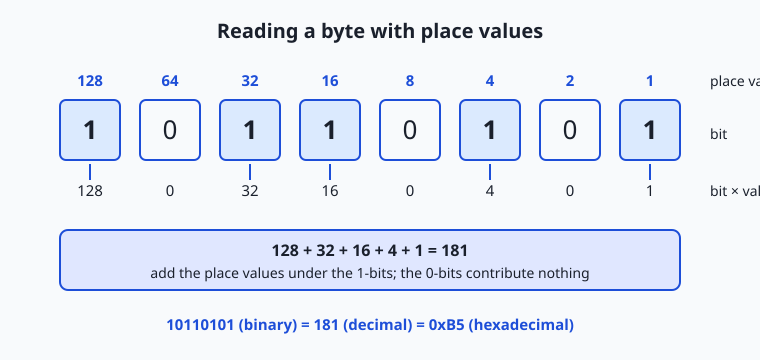
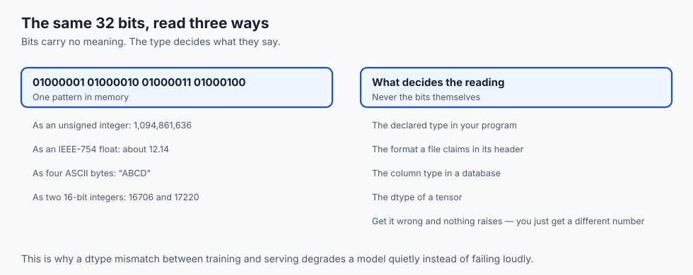

## Why this matters

On Day 1 you learned that a computer is billions of on/off switches, and that everything it touches — numbers, text, model weights — is patterns of 1s and 0s. Today we stop waving at those patterns and learn to read them. This is not trivia. The single most practical skill in all of low-level computing is the ability to look at a number and know how it lives in memory: how many bits it occupies, what its largest value is, what happens one step past that value, and how much precision it carries.

Every one of those questions shows up, constantly, in an AI career. When practitioners say a 7-billion-parameter model "needs 28 GB in float32 but only 7 GB in int8," they are doing byte arithmetic you will be able to do by the end of this lesson. When a training run produces `NaN` losses, someone is about to reason about floating-point exponents. When a file is "1 TB" on the box but your operating system reports 931 GiB, nothing is broken — two different meanings of the same prefix are colliding, and you will know exactly why. And when software fails catastrophically because a number silently wrapped around — as it did aboard the Ariane 5 rocket in 1996, destroying about 370 million dollars of hardware in forty seconds — the root cause is the material of today's lesson.

There is also a quieter payoff. Hexadecimal numbers — `0x7ffee4c0`, `#1d4ed8`, a 64-character hash — decorate error messages, stack traces, color pickers, and security tools everywhere. After today they stop being noise and become the compact, readable notation for raw bits that engineers designed them to be. You will never again skim past a hex number as if it were static.

## The idea in plain language

You already know how to read the number 3,507. Without thinking, you decompose it: 3 thousands, 5 hundreds, 0 tens, 7 ones. Each position is worth ten times the position to its right, because our everyday system is base 10 — almost certainly an accident of having ten fingers. The digits only mean something *because of where they sit*. That idea is called place value, and it is the whole secret of today.

Binary is the same game with two digits instead of ten. Each position is worth *two* times the position to its right, so the place values run 1, 2, 4, 8, 16, 32, 64, 128 instead of 1, 10, 100, 1000. The binary number `101010` means one 32, no 16, one 8, no 4, one 2, no 1 — which adds to 42. Nothing else changes: the counting rules, the addition rules, even the "carry the one" you learned in primary school all work identically. Binary is not a different kind of mathematics; it is ordinary arithmetic written in the only alphabet a two-state switch can store.

One binary digit is a bit. Eight bits make a byte, which can hold 256 different patterns — enough for one character of English text, one color channel of a pixel, or one small number. Groups of bytes make the "words" a processor handles at once — 32 or 64 bits on modern machines. And because long strings of bits are miserable for humans to read, engineers write them in base 16, hexadecimal, where each single digit stands for exactly four bits. Everything else in this lesson — negative numbers, fractions, overflow, the sizes of AI models — is built from these few moves.

## Historical background

Binary numbers are far older than computers. Gottfried Leibniz — the same Leibniz who built a mechanical calculator, met on Day 1 — published a paper in 1703, the *Explication de l'Arithmétique Binaire*, laying out arithmetic with 0 and 1 and marveling that all numbers could be built from nothing and one. He connected it to the broken and unbroken lines of the ancient Chinese *I Ching* hexagrams, which encode 64 symbols in what is recognizably a six-bit pattern. For two centuries binary remained a curiosity.

The next thread came from logic. In 1854, George Boole published *The Laws of Thought*, showing that logical reasoning — AND, OR, NOT — could be carried out as algebra over two values, true and false. Boole was doing philosophy; he never saw a machine run his algebra. The threads fused in 1937, when a 21-year-old MIT graduate student named Claude Shannon wrote what is often called the most influential master's thesis ever: he showed that electrical relay circuits could implement Boolean algebra, and therefore that circuits could calculate. Two-valued logic, two-valued arithmetic, two-state switches — suddenly they were the same subject.

Builders followed quickly. Konrad Zuse's Z3, completed in Berlin in 1941, was a working programmable calculator that used binary throughout, including a form of binary floating point — a design choice years ahead of its time. American wartime machines like ENIAC initially computed in decimal, but John von Neumann's 1945 EDVAC report argued firmly for binary, and the stored-program machines that followed settled the question. Hardware for two states is smaller, cheaper, and far more reliable than hardware for ten.

The vocabulary came later. The word *byte* was coined by Werner Buchholz in 1956 during the design of IBM's Stretch computer (spelled with a *y* so it would not be misread as *bit*), and IBM's System/360 family, announced in 1964, standardized the byte at eight bits — before that, machines used six-, seven-, and nine-bit chunks. Fractions took longest to tame: through the 1970s every manufacturer's floating point behaved differently, and the same program could give different answers on different machines. The IEEE 754 standard of 1985, driven substantially by Berkeley's William Kahan (who received the Turing Award for it), defined the binary formats essentially every processor uses today — including the float32 that stores neural network weights. One loose end lingered into the internet era: does "kilobyte" mean 1,000 or 1,024 bytes? In 1998 the International Electrotechnical Commission gave the powers of two their own names — kibibyte, mebibyte, gibibyte — a fix the world has adopted only partially, which is why your disk still seems to shrink between the store and your screen.

## What it is — and what it is not

Binary is a positional numeral system with base 2: a way of *writing* numbers, exactly as decimal and Roman numerals are ways of writing numbers. The quantity forty-two is the same quantity whether written `42`, `101010`, `0x2A`, or `XLII`. What makes binary special is not mathematical — it is physical. A transistor is either conducting or not, a capacitor charged or not, a magnetic domain oriented one way or the other. Two-symbol notation is the only notation such devices can hold natively, and it tolerates noise superbly: a voltage that sags from 1.0 to 0.7 still reads unambiguously as "on," whereas a ten-level scheme would have long since misread it.

Equally important is what binary is not. It is not "the computer's language" in the sense of something the machine understands — Day 1's lesson stands: the machine understands nothing. It is also not inherently about numbers. A byte like `01000001` has no built-in meaning at all; it is the letter A if the software treats it as ASCII text, the number 65 if treated as an integer, a brightness level if it sits in an image, part of an instruction if the program counter points at it. Meaning lives entirely in conventions — the *encodings* — that people agreed on. Data representation is the study of those agreements.

| Common misconception | The reality |
| --- | --- |
| "Binary numbers are a different kind of math." | Same arithmetic, different notation; carries and place value work exactly as in decimal. |
| "A byte inherently stores a number." | A byte is just 8 bits; number, letter, pixel, or instruction is decided by the encoding the software applies. |
| "Programmers read long binary strings fluently." | Nobody does; that is precisely why hexadecimal exists — one hex digit per four bits. |
| "Computers store decimals like 0.1 exactly." | 0.1 is infinitely repeating in binary, so floats store a close approximation — the source of 0.1 + 0.2 ≠ 0.3. |
| "A kilobyte is definitely 1,024 bytes." | Storage marketing uses 1,000 (kB); operating systems often use 1,024 (KiB); the mismatch is the 'missing' disk space. |

## Why it was created and what problems it solves

Each layer of today's material exists because it solved a concrete engineering problem.

*Binary itself* solves reliability. Early designers knew decimal electronics were possible — ENIAC ran decimal — but distinguishing ten voltage levels in the presence of heat, noise, and aging components is fragile, while distinguishing two is robust. Fewer distinctions per component also means simpler circuits: the entire multiplication table of binary is 0×0=0, 0×1=0, 1×0=0, 1×1=1.

*Two's complement* solves negative numbers. Circuits have no minus sign, and the obvious fix — reserve one bit to mean "negative" — creates ugly problems: two different zeros (+0 and −0) and an adder that must special-case subtraction. Two's complement, standard in essentially every processor since the 1960s, represents −n as the bit pattern of 2ᵏ − n. The payoff is enormous: one adder circuit handles positive and negative numbers identically, with no special cases, and zero is unique. The cost is a strange-looking asymmetric range (−128 to +127 for a byte) and wrap-around behavior you must understand — we will work it by hand below.

*Hexadecimal* solves human readability. A 32-bit address written in binary is 32 characters of visual porridge; in hex it is 8 characters, and because 16 = 2⁴, the translation is a mechanical digit-by-digit substitution with no arithmetic at all. Hex is not a computer feature — processors never see it — it is an ergonomic notation for people who must read raw bits.

*Floating point* solves range. Science and engineering need 0.000000000067 and 602,000,000,000,000,000,000,000 in the same program, and no fixed-position scheme can hold both. Floating point stores numbers the way scientific notation does — a sign, some significant digits, and an exponent that slides the point — trading exactness for astonishing range. IEEE 754 then solved the *portability* of that trade, so every machine rounds the same way.

## How it works

Roll up your sleeves — this is a pencil-and-paper section, and the lab drills everything you see here.

### Place value in three bases

Decimal digit positions are worth powers of 10; binary positions, powers of 2; hexadecimal positions, powers of 16. Reading any of them is the same act: multiply each digit by its place value and add.

| Position (from right) | 3 | 2 | 1 | 0 |
| --- | --- | --- | --- | --- |
| Base 10 place value | 1000 | 100 | 10 | 1 |
| Base 2 place value | 8 | 4 | 2 | 1 |
| Base 16 place value | 4096 | 256 | 16 | 1 |

Hexadecimal needs sixteen digit symbols, so after 9 it borrows letters: A=10, B=11, C=12, D=13, E=14, F=15. The hex number `2A` is 2×16 + 10×1 = 42. By convention, hex is written with the prefix `0x` (so `0x2A`) so nobody mistakes it for decimal.

Here is a full byte decoded. Memorize the eight place values — 128, 64, 32, 16, 8, 4, 2, 1 — the way you know your times tables; they are the working vocabulary of this whole field.



### Converting between bases, by hand

**Binary to decimal** is the diagram above: add the place values under the 1s. `10110101` = 128 + 32 + 16 + 4 + 1 = 181.

**Decimal to binary** has two equally good methods. The *subtraction method*: repeatedly subtract the largest power of 2 that fits. The *division method*: divide by 2 repeatedly and read the remainders bottom-to-top. Both, worked for 42:

```text
Subtraction method for 42:            Division method for 42:
  42 - 32 = 10   -> bit 32 is 1         42 / 2 = 21  remainder 0
  10 - 16?  no   -> bit 16 is 0         21 / 2 = 10  remainder 1
  10 -  8 =  2   -> bit  8 is 1         10 / 2 =  5  remainder 0
   2 -  4?  no   -> bit  4 is 0          5 / 2 =  2  remainder 1
   2 -  2 =  0   -> bit  2 is 1          2 / 2 =  1  remainder 0
   0 -  1?  no   -> bit  1 is 0          1 / 2 =  0  remainder 1
  read the bits: 101010                 read remainders upward: 101010
```

**Hex to binary and back** is the easiest conversion in computing: each hex digit *is* four bits, independently of its neighbors. `0x2F` → `2` is `0010`, `F` is `1111` → `00101111`. In reverse, group bits in fours from the right: `10110100` → `1011` `0100` → `0xB4`. No arithmetic, just table lookup — which is exactly why programmers write bits in hex.

### Binary addition, with carries

Add column by column from the right, exactly as in decimal, except the columns overflow at two instead of ten: 1 + 1 = 10 in binary, so you write 0 and carry 1. Here is 93 + 38, which produces a satisfying chain of carries:

```text
  carries:  1 1 1 1 1
             0 1 0 1 1 1 0 1   (93)
           + 0 0 1 0 0 1 1 0   (38)
           -----------------
             1 0 0 0 0 0 1 1   (131)

column 1:  1 + 0         = 1
column 2:  0 + 1         = 1
column 3:  1 + 1         = 10  -> write 0, carry 1
column 4:  1 + 0 + carry = 10  -> write 0, carry 1
column 5:  1 + 0 + carry = 10  -> write 0, carry 1
column 6:  0 + 1 + carry = 10  -> write 0, carry 1
column 7:  1 + 0 + carry = 10  -> write 0, carry 1
column 8:  0 + 0 + carry = 1
Check: 128 + 2 + 1 = 131 ✓
```

This is precisely what the adder circuit from Day 1 does — one gate cluster per column, each passing its carry to the next.

### Negative numbers: two's complement

To negate a number in two's complement, flip every bit, then add 1. Worked for −44 in 8 bits:

```text
  44        = 0 0 1 0 1 1 0 0
  flip bits = 1 1 0 1 0 0 1 1
  add 1     = 1 1 0 1 0 1 0 0   <- this pattern means -44

Proof it works: add 44 and -44 and you must get zero.
     0 0 1 0 1 1 0 0   (+44)
   + 1 1 0 1 0 1 0 0   (-44)
   -----------------
   1 0 0 0 0 0 0 0 0
   ^ the ninth bit does not exist in an 8-bit register — it falls off,
     leaving 0 0 0 0 0 0 0 0 = 0 ✓
```

That "falling off the end" is the elegance of the scheme: ordinary addition automatically does subtraction. Reading a two's-complement byte is simple once you know the trick: the leftmost bit's place value is *negative* 128 instead of +128. So `11010100` = −128 + 64 + 16 + 4 = −44, and `11111111` = −128 + 64 + 32 + 16 + 8 + 4 + 2 + 1 = −1. An 8-bit signed byte therefore runs from −128 (`10000000`) to +127 (`01111111`) — asymmetric, because zero occupies one of the 256 patterns on the positive side. The leftmost bit is called the sign bit: 0 means the number is non-negative, 1 means negative.

### Overflow: when the register runs out

Every register has a fixed width, and arithmetic that exceeds it *wraps around* silently. Unsigned 8-bit: 255 + 1 = 0. Signed 8-bit: 127 + 1 = −128 — the pattern `01111111` plus one becomes `10000000`, and the sign bit flips. The hardware raises a status flag, but unless software checks it, the wrong number simply flows onward.

The canonical cautionary tale is Ariane 5, flight 501, launched on 4 June 1996 —
the maiden flight of the European Space Agency's new heavy rocket. Its inertial
reference system reused well-tested software from the smaller Ariane 4. Inside
that software, an alignment routine converted a 64-bit floating-point value into a
16-bit signed integer, which can hold at most 32,767.

On Ariane 4's gentler trajectory the value could never get that large, and the
designers had, after analysis, deliberately left that conversion unprotected to
save processor time. Ariane 5 climbed faster and drifted horizontally more
quickly. About 37 seconds after ignition the value exceeded what 16 bits could
hold, the conversion raised an operand-error exception, and the error handling
shut the unit down. The backup unit, running identical software, had failed the
same way moments earlier.

The rocket destroyed itself. The cost is usually put at several hundred million
dollars, and the cause was a number that did not fit the type it was being
converted into, with nothing checking.

### Fractions: floating point in plain language

How do you store 3.14159 in bits? The scheme every modern machine uses is binary scientific notation. A float32 splits its 32 bits into three fields: 1 sign bit, 8 exponent bits, and 23 fraction bits (the fraction is traditionally called the mantissa or significand). The value is roughly *sign × 1.mantissa × 2^(exponent − 127)* — some significant digits, and an exponent saying where the binary point sits. The same 32 bits mean wildly different things depending on which convention you apply:



That bit pattern — `0x40490FDB` — is the number 1,078,530,011 if read as an int32, and π (well, 3.1415927, the closest float32 to π) if read under IEEE 754. Same bits; meaning by agreement. This is the deepest sentence in today's lesson, so it bears repeating: *bits have no intrinsic meaning; representation is a contract.*

Floating point's trade is exactness for range. A float32 spans magnitudes from about 10⁻³⁸ to 10³⁸ but carries only about 7 decimal digits of precision, and — crucially — it can only represent numbers whose fractional part is a sum of *halves, quarters, eighths…* Just as 1/3 has no finite decimal expansion, 1/10 has no finite binary expansion:

```text
0.1 in binary = 0.000110011001100110011...  (0011 repeats forever)

so the machine stores the nearest representable value:
  0.1  is stored as  0.10000000000000000555...
  0.2  is stored as  0.20000000000000001110...
  add them and round:  0.30000000000000004441...
which is why, in nearly every language:  0.1 + 0.2  ->  0.30000000000000004
```

Nothing is broken. The machine adds its two approximations flawlessly; the surprise exists only because we asked it a decimal question in a binary world. The practical rules follow directly: never compare floats with exact equality (test "closer than some tolerance" instead), and never use binary floats for money (use integer cents, or decimal types built for the purpose).

### Bits and model weights: what precision means in practice

Now connect this to the machine-learning world you are heading toward. A neural network is, at rest, a gigantic array of numbers, and *someone must choose their representation*. The industry's standard choices:

| Format | Bits | Layout (sign/exponent/fraction) | Bytes per number | Character |
| --- | --- | --- | --- | --- |
| float32 | 32 | 1 / 8 / 23 | 4 | Full precision; training default for years |
| float16 | 16 | 1 / 5 / 10 | 2 | Half the memory; small exponent overflows easily |
| bfloat16 | 16 | 1 / 8 / 7 | 2 | Keeps float32's range, drops precision; built for machine learning |
| int8 | 8 | two's complement integer | 1 | Weights mapped onto 256 levels via a scale factor |

Read the bfloat16 row through today's lens and it explains itself: bfloat16 keeps float32's *eight exponent bits* — the field that controls range, whose exhaustion causes overflow — and sacrifices mantissa bits, the ones that control fine precision. Neural networks, it turns out, tolerate coarse values far better than they tolerate overflow. Quantization to int8 goes further: it maps each weight onto one of 256 integer levels (a two's-complement byte, plus a stored scale factor for converting back), literally throwing away all but one byte per number. The arithmetic is the same byte arithmetic you can now do: 7 billion parameters × 4 bytes = 28 GB in float32; × 2 bytes = 14 GB in half precision; × 1 byte = 7 GB in int8. Whether a model fits on your hardware is a multiplication problem, and you now own every term in it.

One last unit trap. Prefixes like kilo/mega/giga officially mean powers of 1,000, and drive manufacturers use them that way: a "1 TB" disk holds 10¹² bytes. Memory and many operating systems count in powers of 1,024: 1 KiB = 1,024 bytes, 1 MiB = 1,024², 1 GiB = 1,024³. Since 10¹² ÷ 1,024³ ≈ 931, your "1 TB" drive honestly reports about 931 GiB — a 7% gap at the tera scale that is pure units, not missing hardware. When precision matters, write KiB/MiB/GiB for the binary units and let kB/MB/GB mean powers of ten.

## An everyday analogy

Picture a car's mechanical odometer with just three decimal digits — it can show 000 through 999. That little window is a 3-digit register, and it teaches every hard idea of this lesson.

Drive one mile past 999 and the odometer reads 000. Nothing warned you; the machinery happily rolled over. That is overflow — Ariane 5's 16-bit window was showing its version of 999 while the rocket's real "mileage" kept climbing.

Now the stranger trick. Suppose the odometer reads 000 and you could roll it *backward* one mile: it would show 999. So within this three-digit world, 999 behaves exactly like −1: add it to anything and you get one less (007 + 999 rolls around to 006). Likewise 998 acts like −2, and 997 like −3. Congratulations — you have discovered two's complement, in base 10. Computers do precisely this in base 2: they nominate the top half of the patterns to stand for negatives, and then a single "roll forward" mechanism does both addition and subtraction. There is no minus sign inside the register, just as there is none inside the odometer — only the *convention* that 999 shall mean −1.

The analogy even covers hexadecimal. An odometer that showed miles in groups — one dial for thousands, one for the rest — would be easier to read at a glance than six spinning digits. Hex is that grouping for bits: four binary dials condensed into one sixteen-position dial, purely for the human at the dashboard.

## Examples in practice



Start with worked micro-examples you can verify by hand. The ASCII agreement assigns capital A the number 65 = `01000001` = `0x41`; lowercase a is 97 = `0x61` — exactly one bit different (the 32 bit), which is why case conversion is blindingly fast. The web color `#1d4ed8` — this course's accent blue — is three bytes: red `0x1d` = 29, green `0x4e` = 78, blue `0xd8` = 216, each channel one byte from 0 to 255. A SHA-256 hash prints as 64 hex characters because 64 × 4 bits = 256 bits. A memory address like `0x7ffee4c0` in a crash log is just a byte number written compactly — you can now read all of these cold.

Overflow stories are everywhere once you know to look. In December 2014, the view counter on the music video "Gangnam Style" approached 2,147,483,647 views — the largest 32-bit signed integer, `01111111 11111111 11111111 11111111` — and YouTube publicly noted it had moved the counter to 64 bits. The venerable game Pac-Man breaks on level 256 because the level number lives in one byte: an internal calculation overflows and garbles half the screen. The Year 2038 problem sits in the same family, and so did the Ariane disaster. Floating point supplies its own genre: type `0.1 + 0.2` into the console of nearly any language and read the trailing 4; financial systems dodge the entire issue by counting integer cents.

And the representation-is-a-contract principle runs the modern AI economy. Model files you will download later in this course are described as "fp16 weights" or "8-bit quantized" — phrases that fix the bytes-per-parameter and thus whether the file fits your GPU. One more contract hides below even these: when a multi-byte number is stored, machines must agree which byte comes first in memory — least-significant-byte first ("little-endian," used by x86 and most ARM systems) or most-significant first ("big-endian," traditional in network protocols). Endianness bugs appear exactly when data crosses between systems that assumed different orders — one more reminder that in computing, meaning never lives in the bits alone.

## Implications: security, privacy, performance, scalability, and cost

### Security

Integer overflow is not just a reliability bug; it is one of the classic gateways to exploitation. A program that computes `length + header_size` for a memory allocation can be fed a length so large the sum wraps around to a tiny number — the program allocates a small buffer, then writes the attacker's enormous payload into it, overrunning memory. Overflow-driven buffer bugs have ranked for decades among the most dangerous software weaknesses, and languages and compilers now offer checked arithmetic precisely because humans keep forgetting that registers have edges. Hex literacy is a defensive skill, too: security advisories, exploit write-ups, and packet dumps are written in it.

### Privacy

Everything sensitive is bits, and bits are promiscuous: they survive in places their owners forget. The GB/GiB story has a privacy cousin — "deleting" data usually edits the encoding's bookkeeping, not the bits themselves, as Day 1 noted. Representation also *leaks*: file sizes, message lengths, and even the timing of bit patterns can reveal content without decoding it (encrypted traffic analysis works this way). And because text encodings map numbers to characters, subtle representation tricks — look-alike characters with different code numbers — power phishing domains. Understanding that data is numbers under agreements is the first step in reasoning about where those numbers actually go.

### Performance

Fewer bits move faster. Day 1 established that data movement, not arithmetic, bottlenecks modern machines; today gives that teeth. Halving numeric width (float32 → float16/bfloat16) halves the bytes streaming through the memory hierarchy, roughly doubling the useful bandwidth — the entire logic of mixed-precision training and quantized inference. Processors also do binary tricks constantly: shifting bits left by one *is* multiplication by two, and compilers quietly rewrite multiplications by powers of two into shifts. None of this requires you to write bit tricks yourself; it requires you to understand why the people who chose your data types made the choices they did.

### Scalability

Representation limits are scale deadlines. A 32-bit counter feels infinite at a thousand events per day and overflows in weeks at a hundred thousand per second; system designers now reach for 64 bits by default for identifiers, timestamps, and counters (the Gangnam Style fix, applied preemptively). Floating point has a subtler scale trap: adding a tiny number to a huge one can leave the huge one unchanged (the small value falls below the mantissa's resolution), so summing a billion small values naively drifts — numerical software orders and compensates its arithmetic to survive scale. The 2038 deadline shows what postponing a representation decision costs: the fix is conceptually trivial and operationally global.

### Cost

Bytes are billable. Cloud storage, memory, and network transfer are priced per byte, so representation choices are line items: storing a billion timestamps as 8-byte integers versus 30-byte text strings is nearly a 4× storage bill difference for identical information. In AI the effect dominates hardware purchasing — the difference between a model in float32 and int8 is literally a factor of four in memory, which can be the difference between renting a datacenter GPU and running on the laptop you already own. Marketing units matter at invoice time too: a petabyte contract specified in powers of ten delivers about 11% fewer bytes than one specified in powers of two — the same 1,000-vs-1,024 gap, compounded five times. Reading the units is free; not reading them is not.

## Alternatives: free, open source, and commercial

As with Day 1, "alternatives" here means other excellent routes into the same material, at different depths and formats.

| Resource | Type | What it offers | Cost |
| --- | --- | --- | --- |
| The Day 4 lab in this course | Free | Conversion drills by hand plus a shell toolkit you complete yourself | Free |
| Crash Course Computer Science, episodes 4 and 5 (PBS Digital Studios) | Free video | Binary, hexadecimal, and how the ALU adds — visual and fast | Free |
| Wikipedia: "Binary number", "Two's complement", "IEEE 754" | Free reference | Rigorous, well-cited treatments of exactly today's three pillars | Free |
| "Code" by Charles Petzold (2nd ed.), middle chapters | Book (commercial) | The gentlest deep telling of binary, bytes, and codes in print | Book purchase |
| From Nand to Tetris (Schocken & Nisan) | Open course | Build the adder and ALU that execute this lesson's arithmetic | Free materials |
| A programmer's calculator (macOS Calculator's Programmer view, or `bc`) | Built-in software | Instant dec/hex/bin conversion for checking your hand work | Free |

If you read only one thing beyond this lesson, make it Petzold's chapters on binary codes — and check every hand conversion you ever do against a programmer's calculator until the two of you always agree.

## Comparison with related concepts

| Concept A | Concept B | Key difference |
| --- | --- | --- |
| Bit | Byte | A bit is one 0/1; a byte is 8 bits — the smallest unit most machines address in memory |
| Binary | Hexadecimal | Both describe the same bits; hex packs four bits per digit purely for human readability |
| Unsigned integer | Two's complement integer | Same adder circuit; the convention reassigns the top bit's place value to −2ᵏ⁻¹, buying negatives at the cost of half the positive range |
| Integer | Floating point | Integers are exact within their range; floats trade exactness for enormous range via an explicit exponent field |
| float16 | bfloat16 | Both 16 bits; float16 spends them on precision (10-bit fraction), bfloat16 on range (float32's 8-bit exponent) — range wins for machine learning |
| kB / MB / GB | KiB / MiB / GiB | Powers of 1,000 (marketing, disks, networks) versus powers of 1,024 (memory, many OS displays); a 7% gap at tera scale |

## When to use it — and when not to

Reach for today's skills whenever a number crosses a boundary — that is where representation bites. Choosing a column type in a database, parsing a binary file, reading a hex dump or crash address, sizing a model for a GPU, debugging a negative number that should have been huge (a classic two's-complement misread), or auditing arithmetic near a type's maximum: these are hand-conversion and bit-layout moments, and doing a quick `255 + 1 = ?` sanity check in your head is faster than any tool. Reach for it, too, when reading spec sheets and invoices, where the kB/KiB distinction quietly moves real money, and whenever floating-point equality or accumulating error could corrupt results — tests for "close enough," money in integer cents.

Do not, however, become the person who writes cryptic bit tricks in application code. High-level languages, compilers, and libraries handle representation superbly almost all the time, and clarity beats cleverness: `x * 8` says what it means, and the compiler will emit the shift for you. Do not hand-roll decimal-money arithmetic with floats to "keep it simple," and do not reinvent quantization schemes that battle-tested libraries already implement. The professional posture mirrors Day 1's: work at the highest layer that solves the problem, but *read* the layer below fluently — because when a number is wrong at a boundary, the explanation is almost always in the bits, and now the bits are yours to read.

## The AI connection

Number representation is not a detail in machine learning; it is a lever with a
measurable price. A model's size in memory is parameters multiplied by bytes per
parameter, so the choice of format is a direct choice about what fits and how
fast it runs.

The formats you will meet all trade the same two things: range and precision.
float32 gives both and costs 4 bytes. float16 halves the memory and keeps
precision at the cost of range, which is why training in it overflows without
loss scaling. bfloat16 makes the opposite trade — it keeps float32's exponent
range and gives up mantissa bits — and that turns out to be the right choice for
training, because gradients tolerate coarse values far better than they tolerate
overflowing to infinity. Below that, 8-bit and 4-bit quantisation give up
precision deliberately in exchange for fitting a larger model on the same
hardware. The Ariane 5 failure you read about today is the same class of bug at
a different scale: a value that did not fit the type it was converted into, with
nothing checking. Every one of these decisions is the integer-and-float
arithmetic from this lesson, applied where the stakes are a training budget.

---

## Knowledge check

Try these from memory before looking back:

1. Convert 77 to binary using either the subtraction or division method, showing each step, then convert your answer to hexadecimal by grouping bits.
2. Add the bytes `00110101` and `01001011` by hand, tracking every carry, and check your work in decimal.
3. The byte `11101100` is a two's-complement signed integer. What decimal number is it? Explain the role the leftmost bit played in your answer.
4. In one paragraph, retell the Ariane 5 failure: what representation was converted to what, why the value went out of range on Ariane 5 but never on Ariane 4, and why the backup computer did not save the flight.
5. A colleague stores prices as floats and cannot reproduce a customer's total. Explain, using 0.1's binary expansion, what is happening and what representation to use instead.
6. A "2 TB" external drive shows up as roughly 1.8 TiB. Show the arithmetic proving the drive is not defective.

## Hands-on exercise

Time to make the machine confirm your hand work. Your shell already contains two perfectly good base-conversion tools: `printf`, which formats numbers between decimal and hex, and `bc`, an arbitrary-precision calculator that speaks any base from 2 to 16. The Day 4 lab builds a full toolkit from these; here you will run the core moves. Open a terminal (macOS, Linux, or WSL — identical commands) and type each line, pressing Return after each.

Decimal to hexadecimal and back with `printf`:

```bash
printf '%X\n' 42
printf '%d\n' 0xFF
```

The first prints `2A` — the `%X` format says "render this value in hex." The second prints `255`, because `printf` understands `0x`-prefixed hex input, and `%d` says "render in decimal."

Decimal to binary and back with `bc`:

```bash
echo 'obase=2; 42' | bc
echo 'ibase=2; 101010' | bc
```

`obase` sets the output base, `ibase` the input base. The first prints `101010`; the second prints `42`. For hex input to `bc`, set `obase` first and use uppercase digits — `echo 'obase=2; ibase=16; FF' | bc` prints `11111111`.

Finally, inspect a character's byte — the full chain from symbol to bits:

```bash
printf '%d\n' "'A"
echo 'obase=2; 65' | bc
```

The strange-looking `"'A"` is a POSIX printf feature: a leading apostrophe means "give me the character's code number." You get `65`, then `1000001` — pad it to `01000001` and you are looking at the byte your machine stores for the letter A.

### Expected output

A real run, exactly as the terminal shows it:

```text
$ printf '%X\n' 42
2A
$ printf '%d\n' 0xFF
255
$ echo 'obase=2; 42' | bc
101010
$ echo 'ibase=2; 101010' | bc
42
$ printf '%d\n' "'A"
65
$ echo 'obase=2; 65' | bc
1000001
```

Note that `bc` prints `1000001` (7 digits), not `01000001` — like all calculators it drops leading zeros, which carry no numeric value. When you want fixed-width bytes, you pad: the lab's toolkit does this with `printf '%08d'`.

### Validate your work

You are done when you can check every box:

- [ ] `printf '%X\n' 42` printed `2A`, and you can show by hand why 42 = 2×16 + 10.
- [ ] `printf '%d\n' 0xFF` printed `255`, and you can show by hand why `0xFF` = 15×16 + 15.
- [ ] Both `bc` conversions printed `101010` and `42`, matching the worked example in "How it works."
- [ ] The character inspection printed `65`, and you can write A's full byte, `01000001`, from the `bc` output.
- [ ] You converted one number of your own choosing (try your age) to binary by hand and `bc` agreed with you.

### Troubleshooting

- **`bc: command not found`.** `bc` ships with macOS and most Linux distributions, but some minimal server or container images omit it. Install it with your package manager (Debian/Ubuntu: `sudo apt install bc`; Fedora: `sudo dnf install bc`); the lab's requirements file covers this.
- **`bc` prints the wrong number for hex input.** Two classic causes: you set `ibase=16` *before* `obase`, so the `2` of `obase=2` was itself read in the new base — always set `obase` first; or you typed lowercase `ff` — `bc` requires uppercase hex digits.
- **`printf '%d\n' "'A"` prints 0 or an error.** The apostrophe must sit *inside* the quotes, directly before the character: `"'A"`. In PowerShell this feature does not exist — use WSL, or `[byte][char]'A'` as the PowerShell equivalent.
- **Numbers echo back unchanged.** If `echo 'obase=2; 42' | bc` prints `42`, the quotes were probably dropped and the shell mangled the semicolon; keep the whole expression inside single quotes.

### Common mistakes

- **Reading bit strings left-to-right as place value 1, 2, 4, 8…** Place values grow from the *right*, exactly as in decimal (the ones column is rightmost). `1000001` is 65, not 65 backwards; misreading direction is the single most common drill error.
- **Forgetting that `bc` drops leading zeros.** A byte is always 8 bits in this course's drills; re-pad `bc`'s output before comparing with a hand answer.
- **Mixing bases mid-problem.** Writing "42" while thinking "the bit pattern 42" causes silent nonsense; say the base out loud (forty-two decimal; one-zero-one-zero-one-zero binary) until it is habit.
- **Trusting the tool over the hand method too early.** The point of today is that *you* can do the conversion; use `printf` and `bc` to check your work, not to replace it — the drills in the lab are done on paper first.

## Practice assignment

Open `starter/conversion-drills.md` in the Day 4 lab directory. It contains twelve drills: four decimal-to-binary conversions, three binary-to-decimal, two hex-to-binary, two eight-bit additions with carries, and one two's-complement negation — each with working space. Complete all twelve *by hand*, showing your steps, then verify every answer using the `printf`/`bc` commands from the hands-on exercise (the drill sheet tells you which command checks which drill). Finish by completing the four exercises in `starter/binary_toolkit.sh` so that the lab's test suite passes, and keep your drill sheet — Day 5 builds directly on these bytes when we turn them into text, images, and sound.

## Extension challenge

Three probes, in rising order of depth.

1. **Quantisation arithmetic.** Take a model size you have heard of — say 70
   billion parameters — and compute its footprint in GiB at float32, bfloat16,
   int8 and 4 bits, remembering to divide bytes by 1,024³. Which versions fit in
   the RAM you measured on Day 1?
2. **Precision archaeology.** Use `printf '%.20f\n' 0.1` — and the same for 0.2
   and for the sum typed as 0.3 — to print what your machine actually stores.
   Identify the first decimal digit that goes wrong.
3. **The deep one.** float16's 5-bit exponent caps its largest value near 65,504,
   which training routinely exceeds. Explain, purely in terms of exponent bits and
   place value, why three more exponent bits multiply the range so dramatically
   while costing only three bits of mantissa — and why that is exactly the trade a
   noisy statistical process can afford.

You will meet that trade again, with money on the table, the first time you load a
model onto a GPU.