## Why this matters

A model never sees your file. It sees the numbers your preprocessing produced
from it.

- **Text, images and sound all arrive as arrays of numbers.** The encoding step is
  where most data bugs are born.
- **Encoding differences do not raise.** They quietly change what the model is
  being asked.
- **Every dataset you will ever load** passed through the conversions in this
  lesson.

---

## The idea in plain language

Everything is a number, and the only question is what agreement turns the thing
into numbers.

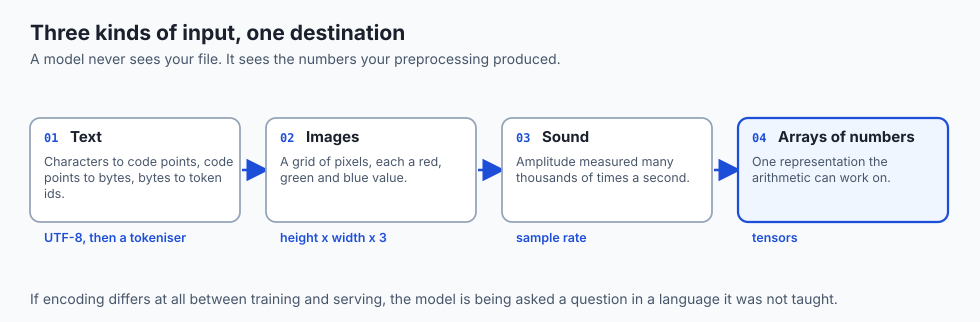

- **A character** becomes a code point, then bytes.
- **A pixel** becomes three values: how much red, green and blue.
- **A sound** becomes a long list of air-pressure measurements.
- **A file format** is just a written-down agreement about which is which.

---

## Historical background

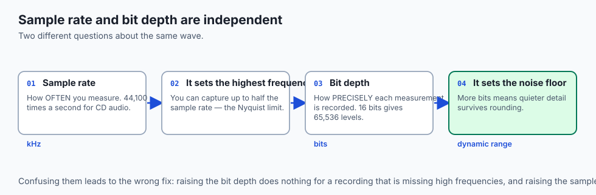

| When | What arrived | Why it mattered |
| --- | --- | --- |
| 1963 | ASCII | 7 bits, 128 characters, English only |
| 1987 | GIF | Lossless images, 256 colours |
| 1991 | Unicode 1.0 | One code point per character, every script |
| 1992 | JPEG | Lossy compression tuned to human vision |
| 1993 | UTF-8 published | ASCII-compatible, variable width, now dominant |
| 1996 | PNG | Lossless, full colour, patent-free |
| 2010 | Unicode adds emoji | Multi-byte sequences reach everyday text |

- **UTF-8 won because it is backward compatible.** Existing ASCII files were
  already valid UTF-8, so adoption cost nothing.

---

## What it is — and what it is not

**It is** a set of agreements for turning real-world things into numbers.

**It is not:**

- **Not lossless by default.** JPEG and MP3 discard detail permanently, and no
  amount of processing recovers it.
- **Not self-describing.** A file's extension is a hint. Its leading bytes are the
  fact.
- **Not one character, one byte.** UTF-8 uses one to four bytes, so string length
  in characters and in bytes are different numbers.

---

## Why it was created and what problems it solves

- **Machines only hold numbers**, so anything a machine handles must be turned
  into numbers first.
- **Different machines needed to agree**, or a file written on one would be
  unreadable on another — which is exactly what happened before standards.
- **Storage and bandwidth were expensive**, so compression formats trade fidelity
  or computation for size.

---

## How it works

### Text: catalogue numbers, then bytes


- **A code point** is a number assigned to a character, independent of storage.
  `A` is U+0041; `é` is U+00E9.
- **An encoding** turns code points into bytes. UTF-8 uses one byte for ASCII and
  up to four for the rest.
- **`é` in UTF-8 is two bytes.** Read those bytes as Latin-1 and you see `é` —
  the classic mojibake.
- **A tokeniser** is a third layer above both, and it is what a model actually
  consumes.

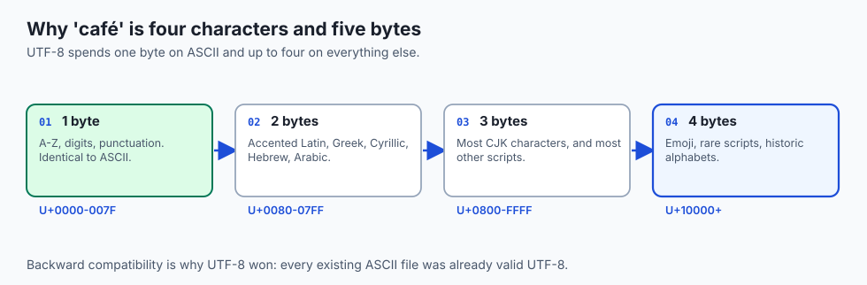

### Images: a grid of measured light

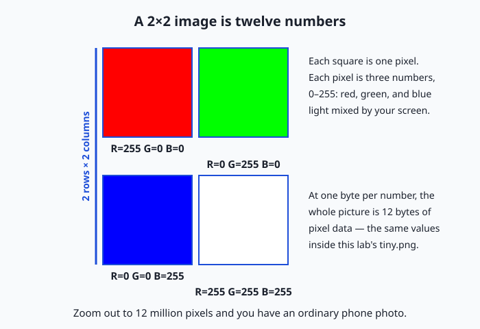

- **Each pixel is three numbers**: red, green, blue, usually 0–255.
- **An image is height x width x 3** values. A 1920x1080 photo is about 6.2
  million numbers, or **6.2 MB uncompressed**.
- **JPEG discards detail** the eye is poor at noticing, often reaching under 1 MB
  for that same photo. PNG keeps everything and lands in between.

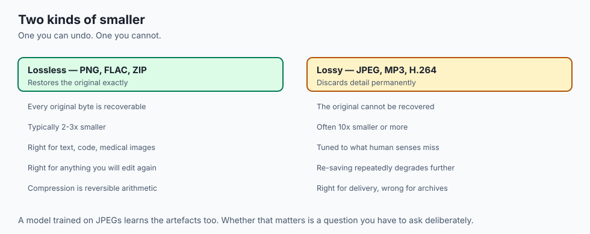

- **Lossless compression is reversible**: PNG, ZIP and FLAC return the original
  bytes exactly, and typically save less.
- **Lossy compression is not**: JPEG, MP3 and most video throw information away
  permanently in exchange for a much smaller file.
- **The choice is about what you will do next.** Archive and edit from a lossless
  master; ship lossy copies. Editing a lossy file and re-saving compounds the
  loss every time, which is why a photo passed through ten exports looks worn.
- **Colour depth matters too.** Eight bits per channel gives 256 levels each and
  about 16.7 million colours; professional workflows use 10 or 16 bits and are
  correspondingly larger.

### Sound: slicing a wave into numbers

- **Sampling** measures air pressure many thousands of times a second. CD audio is
  **44,100 samples per second**.
- **Bit depth** is how precisely each sample is recorded — 16 bits gives 65,536
  levels.
- **One second of CD-quality stereo is 44,100 x 2 channels x 2 bytes**, about
  176 KB. **One minute is about 10.6 MB.**
- **The sample rate must exceed twice the highest frequency** you want to capture
  — the Nyquist limit, and the reason 44,100 was chosen for audible sound topping
  out near 20 kHz.
- **Sample rate is a model hyperparameter**, not a file property. Feed a model
  audio at the wrong rate and it hears a different sound, slowed or sped up.

### Video: images, sound and time

- **Video is a sequence of images plus a synchronised audio track.**
- **Uncompressed 1080p at 30 frames per second is about 187 MB per second** —
  6.2 MB per frame, thirty times over. An hour would be 670 GB.
- **That is why video compression is aggressive.** Codecs store one full frame
  occasionally and, between them, only what *changed*.
- **Which is why a still from a video looks worse than a photograph**: most frames
  were never stored in full.

### File formats: conventions with a signature

- **The first bytes identify the format**: `%PDF-` for PDF, `\x89PNG` for PNG,
  `PK` for anything ZIP-based, `RIFF` for WAV.
- **The extension is a human's claim**; the signature is the file's own answer.
- **Getting this wrong is common** — a `.jpg` that is really a PNG loads fine in a
  viewer and breaks a pipeline that trusted the name.

### What models actually eat

- **Not files.** A model consumes tensors: rectangular arrays of numbers of a
  fixed shape and dtype.
- **Text becomes token identifiers**, then embedding vectors.
- **An image becomes `channels x height x width`**, normalised so values sit in a
  small range around zero.
- **Audio becomes samples, then usually a spectrogram** — a 2D time-frequency
  image, which is why audio models often reuse vision architectures.

---

## An everyday analogy

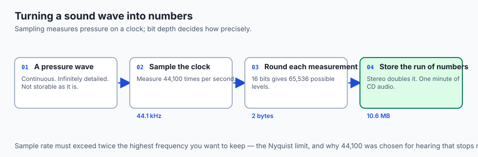

A library catalogue, a photograph and a recording, all reduced to numbers on
index cards.

| The real thing | The agreement | The numbers |
| --- | --- | --- |
| The letter A | Unicode code point | 65 |
| A shade of red | RGB triple | 220, 20, 60 |
| A moment of sound | One sample | -8,412 |
| A file's identity | Magic bytes | 0x89 0x50 0x4E 0x47 |

- **None of the numbers means anything alone.** The agreement is what makes them
  a letter, a colour or a sound.
- **Two people with different agreements** read the same card differently, and
  neither notices.

---

## Examples in practice

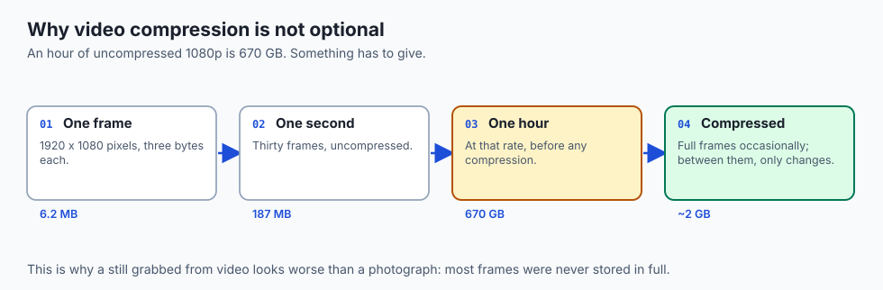

- **A CSV of customer names** loads without error and quietly contains `é`
  wherever someone read UTF-8 as Latin-1.
- **A `.jpg` that is really a PNG** displays correctly in a viewer and crashes a
  pipeline that dispatched on the extension.

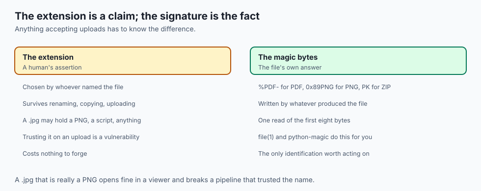
- **A voice model trained at 16 kHz** and served 44.1 kHz audio hears everything
  at roughly a third speed, and its accuracy collapses without a single error.
- **A photo re-exported from a JPEG ten times** visibly degrades, because each
  save discards detail the previous save had already thinned.

---

## Implications: security, privacy, performance, scalability, and cost

- **Security: never trust the extension.** An upload named `photo.jpg` can be
  anything. Check the signature, and check it server-side.
- **Privacy: images carry EXIF.** GPS coordinates, camera serial, timestamp —
  stripped by some pipelines, preserved by others, and rarely noticed either way.
- **Performance: decoding is not free.** Turning a compressed JPEG into a tensor
  costs real CPU, and at scale it becomes the bottleneck rather than the model.

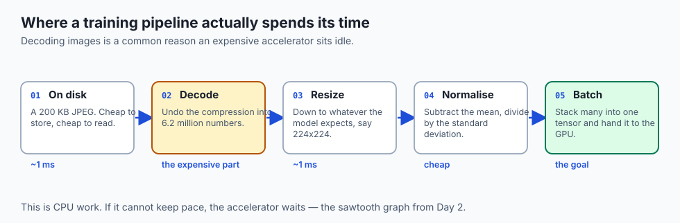
- **Cost: uncompressed is expensive at rest and in transit.** The arithmetic in
  this lesson is what your storage bill is made of.
- **Base64 is not encryption.** It makes bytes safe to put in text, and anyone can
  reverse it. It also inflates size by about a third.

---

## Alternatives: free, open source, and commercial

| Resource | Type | What it gives you |
| --- | --- | --- |
| The Day 5 lab | Free | Bytes, code points and signatures on your own files |
| Joel Spolsky, *The Absolute Minimum About Unicode* | Free essay | The clearest short explanation there is |
| unicode.org charts | Free reference | Every code point, authoritative |
| `xxd`, `file`, `iconv` | Free tools | Already installed; answer most questions |
| Pillow / libvips | Free libraries | Image decoding, with libvips far faster at scale |
| ffmpeg | Free tool | Audio and video conversion, and inspection |

- **Read Spolsky's essay once.** It takes twenty minutes and prevents a decade of
  encoding confusion.

---

## Comparison with related concepts

| Concept | What it does | What it is not |
| --- | --- | --- |
| **Encoding** | Maps characters to bytes | Not encryption; no secret, no key |
| **Compression** | Makes the same data smaller | Not encoding; the meaning is unchanged |
| **Encryption** | Makes data unreadable without a key | Not compression; size roughly holds |
| **Hashing** | Fixes a fingerprint of the data | Not reversible; you cannot get the file back |
| **Serialisation** | Turns a structure into bytes | Not about characters; about shape |

- **These are constantly confused**, and the confusion is expensive: calling
  Base64 "encrypted" has caused real breaches.

---

## When to use it — and when not to

**Think about representation when** text renders as `é`, a model performs worse
in production than in training, a pipeline is slower than the maths explains, or
you are accepting files from users.

**Ignore it when** the library handles it and the results look right. Modern
tooling gets this correct by default.

**The tell:** output that is subtly wrong rather than absent — wrong accents,
wrong colours, audio at the wrong pitch, a model that was fine yesterday.

---

## The AI connection

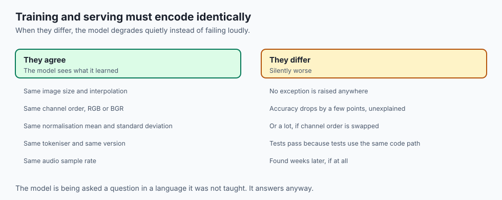

- **Text becomes token identifiers**, which is why two visually identical strings
  with different code points tokenise and embed differently.
- **Images become tensors**, so size, channel order and normalisation must match
  between training and serving or the model degrades quietly.
- **Audio becomes samples**, which makes sample rate a model hyperparameter rather
  than a file property.
- **A model never sees your file.** It sees the numbers your preprocessing
  produced, and any difference there is a different question.

---

## Knowledge check

```yaml
quiz:
  question: "A dataset of names loads without error, but a model trained on it performs worse than expected on European customers. What is the most likely cause?"
  options:
    - "The file was read with the wrong encoding, so accented names became mojibake"
    - "The model architecture is too small for the number of names"
    - "The names were stored in a column that was too narrow"
    - "European names are inherently harder to learn"
  answer_index: 0
  explanation: "Reading UTF-8 as Latin-1 turns é into é silently. Nothing raises, the rows all load, and the model learns from corrupted tokens for exactly the subset of the data that had accents."
```

---

## Hands-on exercise

Look at the bytes behind text, an image and a file's identity. Worked through
fully in the Day 5 lab directory.

| What you are checking | Command |
| --- | --- |
| Characters vs bytes | `python3 -c "s='café'; print(len(s), len(s.encode()))"` |
| A character's code point | `python3 -c "print(hex(ord('é')))"` |
| A file's real format | `xxd yourfile \| head -1` |
| Image dimensions and size | `file image.png` |
| Break an encoding on purpose | `iconv -f latin1 -t utf8 file.txt` |

### Expected output

```text
4 5
0xe9
00000000: 8950 4e47 0d0a 1a0a  .PNG....
```

- **4 characters, 5 bytes** — `é` takes two in UTF-8.
- **U+00E9** is the code point for `é`, independent of how it is stored.
- **`8950 4e47`** is the PNG signature, whatever the file is called.

### Validate your work

- [ ] You can state a string's length in characters and in bytes, and why they
      differ
- [ ] You identified a file by its signature rather than its extension
- [ ] You produced mojibake deliberately and can explain which layer broke
- [ ] You can state the uncompressed size of a 1920x1080 image from first
      principles
- [ ] `bash tests/run_tests.sh` reports 0 failures

### Troubleshooting

- **`ord()` complains about length.** It takes one character. An emoji may be
  several code points, which is the point of the extension challenge.
- **`xxd` not found.** Use `hexdump -C` instead; the first line is what matters.
- **Your terminal shows boxes instead of characters.** That is a font problem, not
  an encoding problem. The bytes are fine.
- **`iconv` reports an illegal sequence.** The input was not actually Latin-1.
  Add `-c` to drop invalid characters, and note what you lost.

### Common mistakes

- **Assuming one character is one byte.** True only for ASCII, and the assumption
  breaks on the first accented name in a dataset.
- **Trusting the extension.** Check the signature for anything you did not create.
- **Calling Base64 encryption.** It is reversible by anyone, with no key.
- **Re-saving a JPEG repeatedly.** Each save discards more. Keep a lossless
  master and export copies.

---

## Practice assignment

1. **Measure a string.** Take a word with an accent and print both its character
   count and its byte count. Explain the difference.
2. **Identify a file by its bytes.** Use `xxd | head -1` on three files of
   different types and match each signature to its format.
3. **Break an encoding deliberately.** Read a UTF-8 file as Latin-1 and record
   what happens to the accented characters.

---

## Extension challenge

Find an emoji that is several code points joined together — a family, or one with
a skin-tone modifier.

1. **Count three ways:** characters, code points, and UTF-8 bytes.
2. **Slice it in half** in your language of choice and record what you get.
3. **Write the conclusion:** why "string length" is an ambiguous question, and
   which of the three numbers a text box's character limit should use.

---

