## Why this matters

- **Essentially all serious AI work runs on Linux** — the cloud machines you rent,
  the GPU clusters that train large models, the servers behind every model API.

- **GPU drivers are kernel components.** Installing them is an OS operation.
- **Containers are operating-system isolation features**, not a separate technology.
- **"Works on my machine" is an OS-environment problem**, almost every time.
- **Today is the map**; tomorrow's processes-and-threads lesson and all of Week 2
  walk the territory.

---

## The idea in plain language

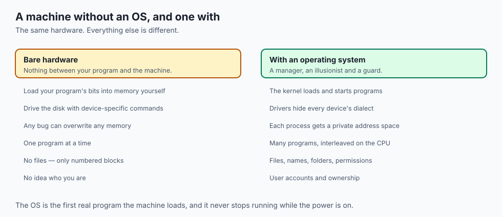

Bare hardware is nearly unusable. The CPU from Day 2 will fetch, decode and
execute forever, but it has no idea what a file is and no opinion about who owns
the bytes it just wrote.

The operating system plays three roles at once:

- **A manager** — decides which programs run, when, and with how much memory.
- **An illusionist** — gives every program a private CPU, private memory and tidy
  named files, when the truth is one shared machine and raw disk blocks.

- **A guard** — stops programs reading each other's data or wrecking the hardware.

To do that safely it splits the machine in two:

- **The kernel** runs privileged. It can touch any memory and any device.
- **User space** runs unprivileged — your browser, your Python scripts, even the
  desktop. A program there can only compute on its own memory.

- **A system call is the only doorway** between them. That boundary is the deepest
  idea in today's lesson.

---

## Historical background


- **The 1950s problem was economic.** Machines cost millions and sat idle between
  jobs while humans shuffled punch cards. The first "monitors" ran jobs back to back.

- **The 1960s brought time-sharing** — many users at terminals, the machine
  switching so fast each felt alone.

- **Multics** (MIT, General Electric and Bell Labs) pioneered the ideas and grew
  heavy and late.

- **Unix, 1969**, was the reaction: Ken Thompson and Dennis Ritchie built something
  small at Bell Labs, then rewrote it in C — which made it portable, and portable
  was the thing nobody else had.

- **Everything descends from that split.** BSD and System V from Unix; Linux
  written fresh by Linus Torvalds in 1991 to the same interface; macOS from BSD
  via NeXT; Windows down its own line from DOS through NT.

---

## What it is — and what it is not

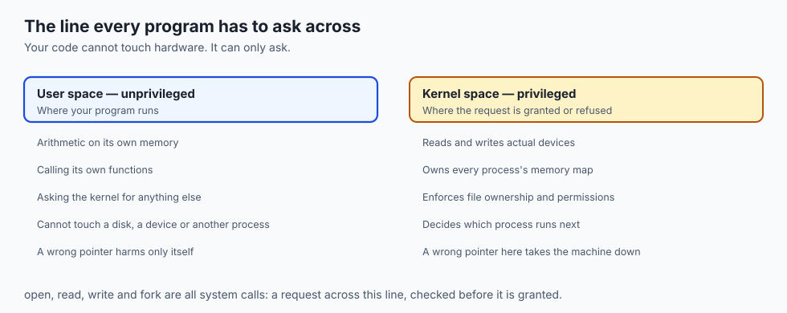

**It is:**

- The first real program the machine loads, and the last one still running.
- The permanent intermediary between hardware and every other program.
- A scheduler, a memory manager, a filesystem, a pile of drivers, and a permission
  system.

**It is not:**

- **Not the desktop.** The windows, the dock and the file browser are ordinary
  user-space programs. You can run Linux with none of them.

- **Not the applications.** A distribution ships thousands; none of them are the OS.
- **Not one thing.** "The OS" is a kernel plus a large amount of user-space
  software that people bundle under the same name.

---

## Why it was created and what problems it solves

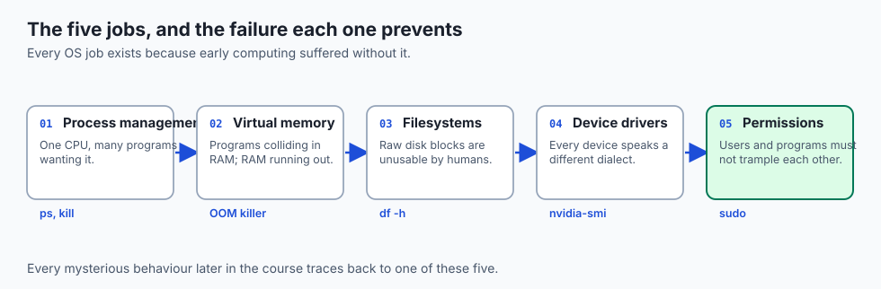

- **Sharing the machine.** A CPU spends most of its life waiting on memory, disk or
  network. Without an OS, one program monopolises it while it waits.

- **Protecting programs from each other.** On early systems any program could
  overwrite any memory, and one bug crashed everything.

- **Taming the hardware zoo.** Drivers translate each device's electrical dialect
  into one standard interface.

- **Making storage human.** Files, names, folders and timestamps are an
  organisational fiction over billions of numbered blocks — so useful we forget it
  is one.

- **Enforcing ownership.** Every login, every "Permission denied", every `sudo`
  traces to multi-user machines needing a concept of *who*.

---

## How it works

### Kernel space and user space


- **The CPU enforces the split**, not politeness. Modern processors run in at least
  two hardware modes.

- **In kernel mode** all instructions and all memory are available.
- **In user mode** instructions that touch hardware or remap memory are forbidden —
  executing one traps straight into the kernel.

- **This is transistor-level enforcement**, the same logic you met on Day 1. A
  user-space program cannot touch the disk any more than a hotel guest can rewire
  the elevator.

### System calls: the only door

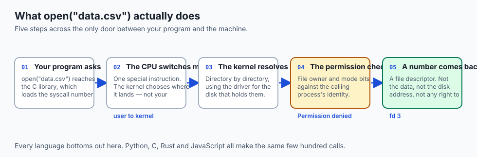

- **A few hundred exist on Linux** — `open`, `read`, `write`, `close` for files;
  `fork` and `exec` to create and run programs; `mmap` for memory; `socket` for
  networking.

- **Every language bottoms out here.** Python's `open()` is a wrapper that
  eventually executes the syscall instruction.

- **Notice what your program never receives**: the disk location of the data, the
  right to touch the disk, or access to the kernel's bookkeeping. It gets a number.

- **Every later read hands that number back** across the boundary and receives bytes
  copied into its own memory. The kernel stays in control at every step.

### Virtual memory, revisited

- **Day 3 showed the hardware side**; this is the OS side. The memory manager gives
  every process a huge, private, contiguous address space.

- **Per-process page tables** map those virtual addresses onto whatever physical
  pages are free, with the CPU translating on every access.

- **Two processes can both believe they own address 4096** without conflict.
- **Touching memory outside your map** ends the process — the segmentation fault.
- **When RAM runs short the OS evicts pages to disk.** The machine does not stop; it
  slows to disk latency, exactly as the Day 3 numbers predict.

- **When a training job dies with an out-of-memory error**, that is Linux's OOM
  killer choosing a process to sacrifice.

---

## An everyday analogy

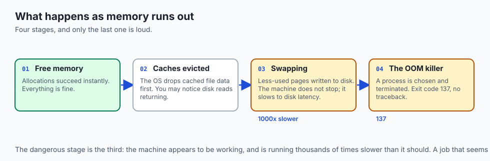

Think of a hotel.

| The hotel | The operating system |
| --- | --- |
| Guests | Programs |
| Rooms | Private address spaces |
| The front desk | The system-call interface |
| Staff-only doors | Kernel mode |
| Room keys | Permissions |
| Housekeeping rota | The scheduler |

- **You never fetch your own towels from the store cupboard.** You ask at the desk,
  and staff who are allowed in there fetch them.

- **The point is not politeness.** The staff door is locked. A guest with the best
  intentions still cannot open it.

---

## Examples in practice

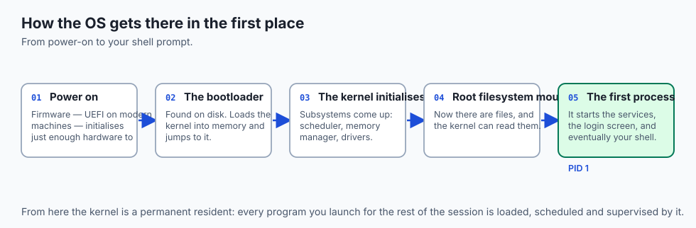

- **`Permission denied`** is step four of the syscall walk returning an error.
- **A segmentation fault** is the memory manager catching an address outside your
  map.

- **A machine that has "run out of memory" and gone slow** is swapping — running at
  disk latency rather than RAM latency.

- **Two programs cannot bind the same port** because the kernel owns the port
  namespace and hands each one out once.

- **`nvidia-smi` failing after a kernel update** is a driver built against the old
  kernel, because drivers are kernel components.

---

## Implications: security, privacy, performance, scalability, and cost

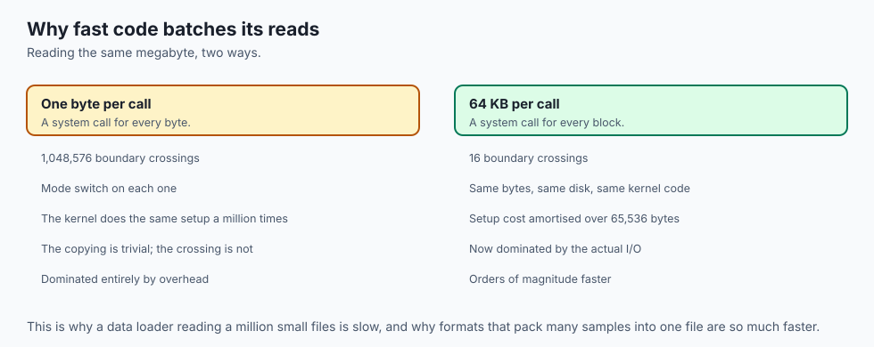

- **Security: the boundary is the security model.** Almost every serious local
  exploit is a way to get code running on the wrong side of it. Kernel bugs are
  severe precisely because there is nothing above the kernel to contain them.

- **`sudo` is not a formality.** It runs a program with the identity that the
  permission check cannot refuse.

- **Performance: crossing the boundary costs.** A system call is far more expensive
  than a function call, which is why high-throughput code batches its reads and
  writes rather than making one call per item.

- **Scalability: containers share the host kernel**, which is why thousands fit on a
  machine that would run a handful of virtual machines.

- **Cost: swapping is the expensive failure.** A job that fits in RAM and a job that
  misses by a little differ in wall-clock time by orders of magnitude, and you pay
  for wall-clock time.

---

## Alternatives: free, open source, and commercial

| Option | Type | Where you meet it |
| --- | --- | --- |
| Linux (Ubuntu, Debian) | Free, open source | Essentially every cloud and GPU machine |
| macOS | Commercial, BSD-derived | Your laptop; a good Unix development environment |
| Windows + WSL2 | Commercial + free | Windows machines running a real Linux kernel in a VM |
| FreeBSD | Free, open source | Network appliances, storage systems |
| Container runtimes | Free, open source | Sharing one kernel among many isolated workloads |

- **Learn Linux.** macOS is close enough to be comfortable and different enough to
  surprise you; the servers you deploy to will be Linux.

- **WSL2 is a real kernel in a lightweight VM**, not an emulation layer, which is
  why it behaves like Linux where earlier attempts did not.

---

## Comparison with related concepts

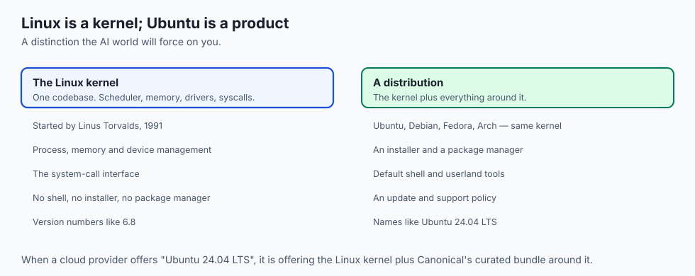

| Term | What it actually is |
| --- | --- |
| **Kernel** | The privileged core: scheduler, memory, drivers, syscalls |
| **Operating system** | The kernel plus the userland people bundle with it |
| **Distribution** | An OS packaged with an installer and update policy |
| **Shell** | An ordinary user-space program that runs other programs |
| **Firmware** | Code on the hardware itself, running before any OS exists |

---

## When to use it — and when not to

- **You do not choose whether to use an operating system.** You choose which one,
  and how much of it you are willing to understand.

- **Use Linux for anything you will deploy**, because that is what you will deploy
  onto and the differences bite at the worst moment.

- **Use containers when you need the environment reproduced**, not merely isolated.
- **Use a virtual machine when you need a different kernel** — a different OS
  family, or kernel-level isolation between untrusted tenants.

- **Embedded and real-time work is the exception.** A microcontroller may run no OS
  at all, and a hard-real-time system may use one that guarantees timing where a
  general-purpose scheduler cannot.

---

## The AI connection

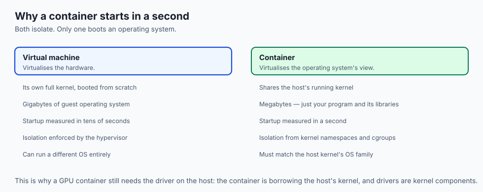

- **The OOM killer will end your training run** long before your code raises an
  error, and it leaves almost no explanation behind.

- **GPU drivers live in the kernel**, so a container needs the driver on the host
  and a matching runtime inside.

- **Data loaders are syscall-bound.** Reading a million small files is a million
  boundary crossings, which is why formats that pack many samples into one file are
  so much faster.

- **Your model's memory question is the OS's memory question.** "Does it fit" means
  "does it fit in physical RAM or VRAM before the OS starts evicting pages".

---

## Knowledge check

```yaml
quiz:
  question: "A container running a GPU workload starts fine but reports no devices, while the same image works on another host. What is the most likely explanation?"
  options:
    - "The host is missing the GPU kernel driver, which the container shares rather than supplies"
    - "The container image was built for the wrong CPU architecture"
    - "The container was given too little memory to initialise the GPU"
    - "Containers cannot access GPUs and a virtual machine is required"
  answer_index: 0
  explanation: "A container shares the host's running kernel. Drivers are kernel components, so the driver must be present on the host; the image supplies only the user-space runtime that talks to it."
```

---

## Hands-on exercise

Observe the boundary rather than read about it. Worked through fully in the Day 6
lab directory.

| What you are looking at | Command |
| --- | --- |
| Which kernel is running | `uname -a` |
| The distribution around it | `cat /etc/os-release` (Linux) or `sw_vers` (macOS) |
| Every system call a program makes | `strace ls` (Linux) or `sudo dtruss ls` (macOS) |
| Memory pressure and swapping | `vmstat 1 5` or `vm_stat` |
| A permission check failing | `touch /etc/nope` |

### Expected output

```text
Linux hostname 6.8.0-40-generic x86_64 GNU/Linux
openat(AT_FDCWD, "data.csv", O_RDONLY) = 3
touch: cannot touch '/etc/nope': Permission denied
```

- **`= 3`** is the file descriptor — the number from step five of the walk.
- **`Permission denied`** is step four returning an error.

### Validate your work

- [ ] You can name the running kernel version and the distribution separately
- [ ] You traced a simple command and found its `openat` calls
- [ ] You can point at a file descriptor in the trace output
- [ ] You triggered a permission failure deliberately and can explain which step
      produced it

- [ ] `bash tests/run_tests.sh` reports 0 failures

### Troubleshooting

- **`strace` not found.** Install it, or use `dtruss` on macOS — which needs `sudo`
  and may need System Integrity Protection considered.

- **The trace scrolls past.** Pipe it: `strace ls 2>&1 | head -40`.
- **`dtruss` prints nothing.** macOS restricts tracing system binaries. Trace a
  program you built instead.

### Common mistakes

- **Confusing the kernel version with the distribution version.** Ubuntu 24.04 and
  kernel 6.8 are different numbers about different things.

- **Assuming the desktop is the OS.** Stop the desktop and the machine keeps running.
- **Reading `sudo` as "ignore the rules".** It is an identity the rules permit.

---

## Practice assignment

- **Trace two programs** and compare their system calls: something tiny like `echo`
  against something that touches the network like `curl`.

- **Count the calls** with `strace -c` and note which dominate.
- **Write three sentences** explaining why the network program makes so many more,
  in terms of the boundary rather than in terms of "it does more".

- **Deliberately exhaust memory** in a throwaway VM or container with a small limit,
  and record what the OS does about it.

---

## Extension challenge

- **Find the syscall in the source.** Pick `read` and locate its entry point in the
  Linux kernel tree on GitHub. You are not expected to understand it; you are
  expected to see that it is ordinary code.

- **Measure the cost of crossing.** Write two loops that each read a megabyte: one
  byte at a time, and one in 64 KB blocks. Time both. The ratio is the price of the
  boundary, and it is larger than most people guess.

- **Compare startup.** Time `docker run --rm alpine true` against booting a VM with
  the same job. Explain the difference using the diagram in this lesson.

---

