## Why this matters

- **Every AI job you run is a process**, and every one that dies badly dies in a way
  this lesson explains.

- **Exit code 137 means the kernel killed it** for exceeding a memory limit. You
  will see this number in container logs more than any other.

- **Data loaders are processes, not threads**, for a reason you will understand by
  the end of today.

- **Closing a terminal kills your background jobs** unless you know why, and what to
  do about it.

- **Yesterday gave you the map.** Today walks the busiest part of it.

---

## The idea in plain language

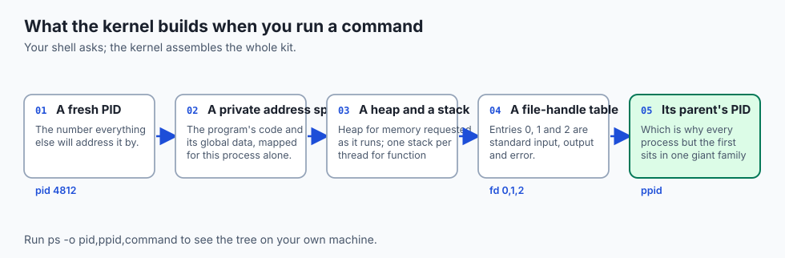

- **A program is a file. A process is that file running** — with memory, state and
  an identity.

- **Your shell is itself a process.** When you run a command, it asks the kernel to
  create a child.

- **A thread is an instruction stream inside a process**, sharing its memory with
  every other thread there.

- **The scheduler decides who runs.** Your machine has hundreds of processes and a
  handful of cores, and the gap between those numbers is today's subject.

- **Most processes are asleep.** That is the whole trick.

---

## Historical background

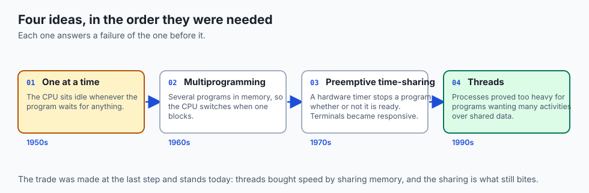

- **Early machines ran one program at a time**, from loading to completion, with the
  CPU idle whenever the program waited for anything.

- **Multiprogramming** kept several programs in memory at once so the CPU could
  switch to another whenever one blocked.

- **Time-sharing added preemption**: a hardware timer stops a program whether or not
  it is ready to stop. This is what made interactive terminals feel responsive.

- **Threads arrived later**, in the 1990s, as processes proved too heavy for
  programs that wanted many concurrent activities sharing data.

- **The trade was made then and stands now**: threads bought speed by sharing
  memory, and the sharing is what still bites.

---

## What it is — and what it is not

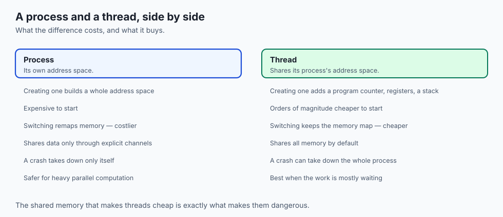

**A process is:**

- A running instance of a program, with a PID, its own address space, and a parent.
- The unit the kernel isolates, schedules and accounts for.

**A process is not:**

- **Not a program.** One program can be running as fifty processes.
- **Not an application.** A browser is many processes; that is deliberate, so one
  tab crashing does not take the rest.

- **Not always consuming CPU.** Most are in *waiting*, and waiting is free.

---

## Why it was created and what problems it solves

- **Utilisation.** A CPU spends most of its life waiting on memory, disk or network.
  Processes let another program use those gaps.

- **Isolation.** Separate address spaces mean one program's bug cannot corrupt
  another's data.

- **Responsiveness.** Preemption means a runaway loop cannot lock you out of the
  machine; the timer will stop it regardless.

- **Accounting.** The kernel knows what each process used, which is how limits,
  quotas and billing exist at all.

- **Control.** A process has a name, a number and a parent, which is what makes it
  something you can inspect, signal and stop.

---

## How it works

### The anatomy and lifecycle of a process

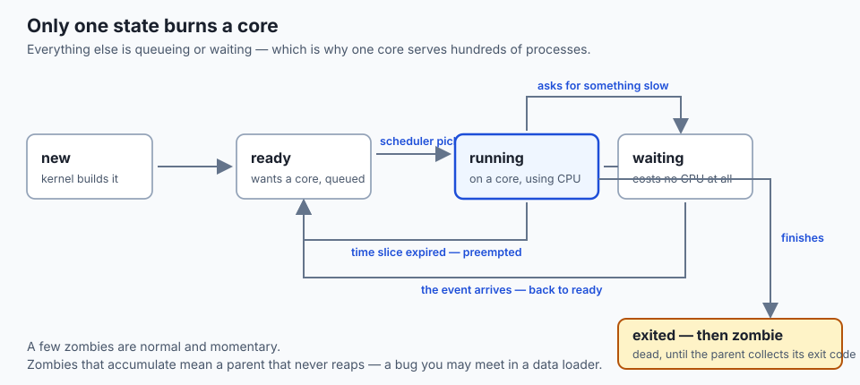

- **Only *running* consumes a core.** That is the state that costs.
- **A process in *ready*** wants a core and is queued behind others.
- **A process in *waiting*** asked for something slow — a disk read, a packet, a
  timer — and is charged nothing until the event arrives.

- **That is how one core serves hundreds of processes**: most of them are asleep.


- **The ready-running loop** in the middle is the scheduler's territory: dispatch
  and preempt, over and over.

- **The excursion to waiting** is where processes spend most of their lives on an
  interactive machine.

- **The exit records a code** — the single number by which scripts and pipelines
  judge success. `echo $?` shows the last one.

- **A zombie has exited but not been collected.** Its parent has not read its exit
  code, so it lingers as a dead entry in the process table. A few are normal;
  accumulating zombies mean a parent that never reaps.

### Threads: cheap and dangerous

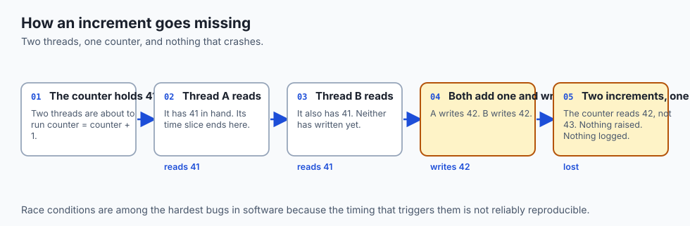

- **Locks are the cure**, letting one thread into a critical section at a time.
- **Locks bring their own disease**: deadlock, where two threads each hold the lock
  the other needs, forever.

- **The practical rule**: threads shine when work is mostly *waiting*; for heavy
  computation in parallel, separate processes are safer — and in Python,
  historically the only effective choice.

### The scheduler: time slices, context switches, preemption


- **Your machine has perhaps 500 processes and a couple of thousand threads**, of
  which almost all are waiting. The scheduler only cares about the ready ones.

- **Each running thread gets a time slice** on the order of milliseconds.
- **When it expires, a hardware timer interrupts the core.** The thread is not
  asked. It is stopped.

- **The diagram shows one core and three processes**: A runs and is preempted, B
  runs and blocks early on a disk read, C runs. The thin dark slivers between
  slices are the context switches.

- **Blocking is free.** A thread waiting on disk or network is charged nothing.
- **So how do 100 programs run on 14 cores?** They do not. They take very fast
  turns, and most of them are asleep.

### Jobs and signals: taking the controls

- **End a command with `&`** and the shell starts it as a background job. You get
  your prompt back; `$!` holds the new child's PID.

- **`jobs`** lists your shell's background children; **`ps`** shows processes
  system-wide; **`wait`** pauses until a child finishes and hands you its code.

- **You do not converse with a process. You signal it** — a tiny numbered
  notification delivered by the kernel.

| Signal | No. | Sent by | Meaning | Refusable? |
| --- | --- | --- | --- | --- |
| SIGTERM | 15 | `kill PID` | "Please shut down." | Yes |
| SIGINT | 2 | Ctrl+C | "Stop what you're doing." | Yes |
| SIGKILL | 9 | `kill -9 PID` | "Cease to exist, now." | No |
| SIGSTOP | — | `kill -STOP` | "Freeze, resumably." | No |
| SIGCONT | — | `bg`, `fg` | "Resume." | — |
| SIGHUP | 1 | Terminal closes | "Your terminal went away." | Yes |

- **A signal death reports 128 plus the signal number.** SIGTERM gives 143; SIGKILL
  gives 137.

- **SIGHUP explains the remote-job problem**: close the terminal and your background
  children are told their terminal died, which by default ends them. Hence `nohup`,
  and the terminal multiplexers later in this course.

### Concurrency versus parallelism, precisely

- **Concurrency is *dealing with* many tasks** in overlapping time periods. It is
  structure, not simultaneity.

- **Parallelism is *executing* more than one task** at the same physical instant,
  which requires more than one execution unit.

- **One core running three processes in slices is concurrent**, never parallel.
- **Python threads under the GIL give concurrency, not parallelism** of Python
  computation — which is why frameworks reach for processes when they need real
  simultaneous work.

---

## An everyday analogy

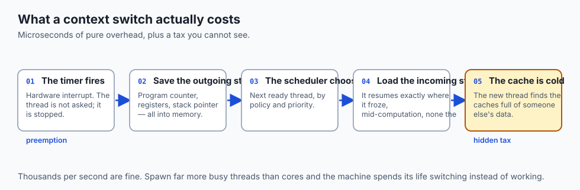

A single barista with four half-made drinks:

- **Starts a drink, hits a step that waits** — milk steaming — and moves to the next.
- **That is concurrency.** Four drinks in progress, one pair of hands.
- **Each switch costs something**: remembering where the last drink was, finding the
  right cup, reaching for different tools.

- **Four baristas at four machines is parallelism**, and needs four of everything.
- **A barista who switched drinks every three seconds** would finish nothing. That
  is thrashing.

---

## Examples in practice

- **`Killed` with exit code 137** in a container log: the kernel sent SIGKILL,
  almost always for exceeding a memory limit.

- **A training job that vanishes when you close your laptop**: SIGHUP, delivered to
  everything attached to that terminal.

- **A data loader that gets slower as you add workers**: more busy processes than
  cores, so the machine spends its time context switching.

- **A counter that is occasionally wrong and never reproducibly so**: a race, and no
  amount of re-running will reliably show it.

- **Accumulating zombie processes**: a parent that spawns children and never reaps
  their exit codes.

---

## Implications: security, privacy, performance, scalability, and cost

- **Security: the process is the isolation unit.** Separate address spaces are why a
  compromised process is not automatically a compromised machine, and why browsers
  put each tab in its own.

- **Privacy: `ps` is world-readable by default.** Anything you pass as a
  command-line argument — an API key, a password — is visible to every user on the
  machine. Use environment variables or files instead.

- **Performance: more threads than cores makes things slower**, not faster, once the
  work is genuinely CPU-bound.

- **Scalability: blocking is free, so waiting workloads scale far beyond core
  count.** Computing workloads do not.

- **Cost: SIGKILL loses work.** A job killed without cleanup discards whatever was
  not yet flushed, and you pay again for the hours it takes to redo.

---

## Alternatives: free, open source, and commercial

| Tool | Type | What it gives you |
| --- | --- | --- |
| `ps`, `top`, `kill` | Free, built in | Everything in this lesson, on any Unix |
| `htop` | Free, open source | The same, readable, with a tree view |
| `nohup`, `setsid` | Free, built in | Detach a job so SIGHUP cannot reach it |
| `tmux`, `screen` | Free, open source | A terminal that survives disconnection |
| `systemd` | Free, open source | Supervising long-running services properly |
| Activity Monitor / Task Manager | Bundled | The same data, with a mouse |

- **Learn `htop` early.** It shows the tree, the per-core load and the state column,
  and it makes this lesson visible in one screen.

---

## Comparison with related concepts

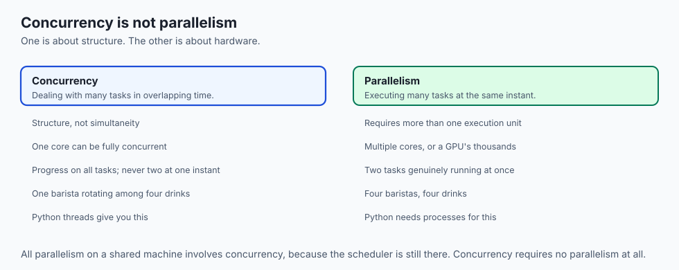

| Term | What it actually means |
| --- | --- |
| **Process** | A running program with its own address space |
| **Thread** | An instruction stream sharing a process's memory |
| **Job** | A shell's name for a process it started |
| **Daemon** | A process deliberately detached from any terminal |
| **Coroutine** | Concurrency scheduled by your program, not the kernel |

---

## When to use it — and when not to

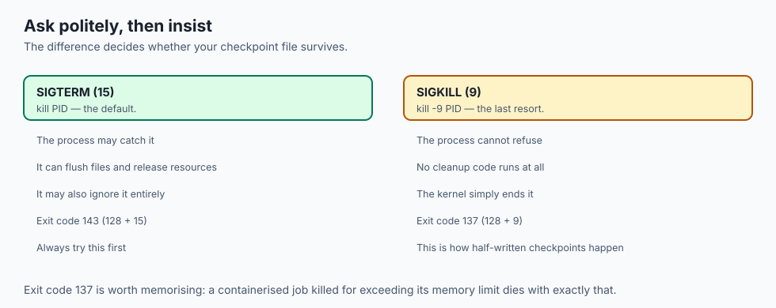

- **Always try SIGTERM first.** It gives the process a chance to flush files and
  release resources.

- **Reach for SIGKILL only when a process ignores polite requests**, and accept that
  nothing will be cleaned up.

- **Use background jobs for anything longer than your patience**, and `nohup` or a
  multiplexer for anything longer than your session.

- **Do not reach for threads to make computation faster** in Python. Reach for
  processes.

- **Do not tune worker counts by guessing.** Measure — the right number is usually
  near the core count, not far above it.

---

## The AI connection

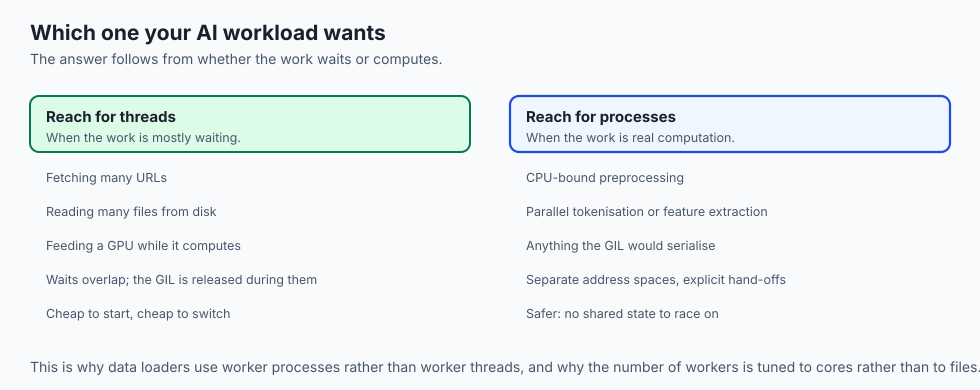

- **Exit code 137 is the single most common AI-infrastructure error message**, and
  it means the kernel killed your job for memory.

- **Data loader workers are processes**, which is why they cost memory each and why
  more is not always better.

- **A GPU sits idle while its feeder waits on disk.** That waiting is exactly what
  threads overlap well.

- **Distributed training is many processes** coordinating explicitly, on one machine
  or many — the same model, scaled up.

---

## Knowledge check

```yaml
quiz:
  question: "A containerised training job disappears from the logs with exit code 137 and no traceback. What happened?"
  options:
    - "The kernel sent SIGKILL, most likely because the job exceeded its memory limit"
    - "The Python process raised an unhandled exception that was not logged"
    - "The container image was corrupted and the process never fully started"
    - "The job completed successfully but the logging buffer was not flushed"
  answer_index: 0
  explanation: "128 + 9 = 137, and signal 9 is SIGKILL, which a process cannot catch. No cleanup runs and no traceback is written, which is exactly why the log ends without explanation."
```

---

## Hands-on exercise

Watch processes being born, scheduled, signalled and reaped. Worked through fully
in the Day 7 lab directory.

| What you are observing | Command |
| --- | --- |
| The family tree | `ps -o pid,ppid,stat,command` |
| Live state and per-core load | `htop` (or `top`) |
| Start a background job | `sleep 300 & echo $!` |
| List your shell's children | `jobs` |
| Ask politely, then insist | `kill $!` then `kill -9 $!` |
| Read the exit code | `echo $?` |

### Expected output

```text
  PID  PPID STAT COMMAND
 4812  4801 S    sleep 300
[1]+  Terminated              sleep 300
143
```

- **`STAT S`** is sleeping — waiting, and costing nothing.
- **`143`** is 128 + 15: it ended on SIGTERM.
- **Repeat with `kill -9`** and the code becomes 137.

### Validate your work

- [ ] You can read a PID and its parent PID and explain the relationship
- [ ] You started a background job and retrieved its PID from `$!`
- [ ] You produced exit code 143 and exit code 137 deliberately
- [ ] You found a process in the waiting state and can say what it waits for
- [ ] `bash tests/run_tests.sh` reports 0 failures

### Troubleshooting

- **`htop` not installed.** Use `top`; the columns are less friendly but the same
  data is there.

- **`$!` is empty.** It holds the most recent background PID only. Capture it
  immediately after the `&`.

- **`kill` says no such process.** It already exited. Use a longer `sleep`.
- **Exit code is 0 when you expected 143.** You read `$?` after another command
  overwrote it. It reflects only the last thing that ran.

### Common mistakes

- **Reaching for `kill -9` first.** It skips cleanup, and cleanup is often the part
  that saves your work.

- **Assuming a sleeping process is a problem.** Sleeping is what healthy processes
  mostly do.

- **Passing secrets as command-line arguments**, where `ps` shows them to everyone.
- **Spawning more busy workers than cores** and expecting a speedup.

---

## Practice assignment

- **Start three background jobs** of different durations and use `wait` to collect
  each exit code in turn.

- **Kill one with SIGTERM and one with SIGKILL** and record both codes.
- **Write a script that traps SIGTERM**, prints a cleanup message, and exits — then
  prove that SIGKILL never prints it.

- **Run `htop` while starting a CPU-heavy loop** and watch a single core saturate.
- **Explain in three sentences** why the load stayed at one core.

---

## Extension challenge

- **Build a race condition on purpose.** Two threads, one shared counter, a million
  increments each. Run it ten times and record how often the total is wrong.

- **Then fix it with a lock** and measure what the lock costs in time.
- **Find the crossover.** Write the same CPU-bound work using threads and using
  processes, and find the worker count where processes overtake threads. Explain the
  number you found using the GIL.

- **Create a zombie deliberately**: fork a child, let it exit, and have the parent
  sleep without reaping. Find it in `ps` with state `Z`.

---

