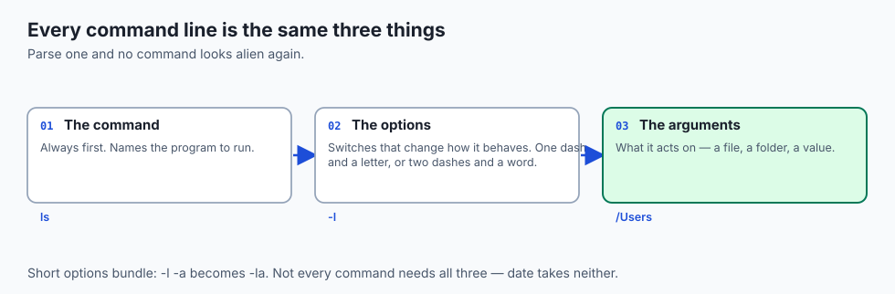
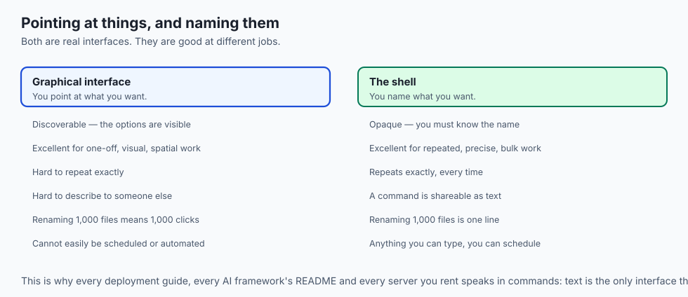
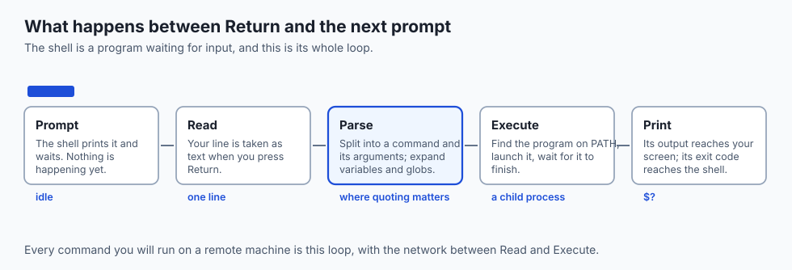
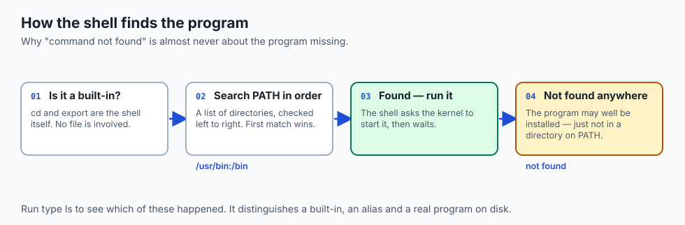
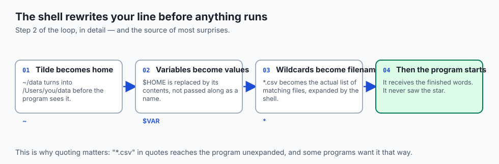
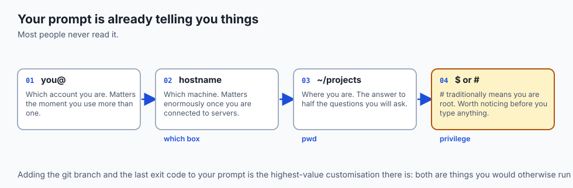
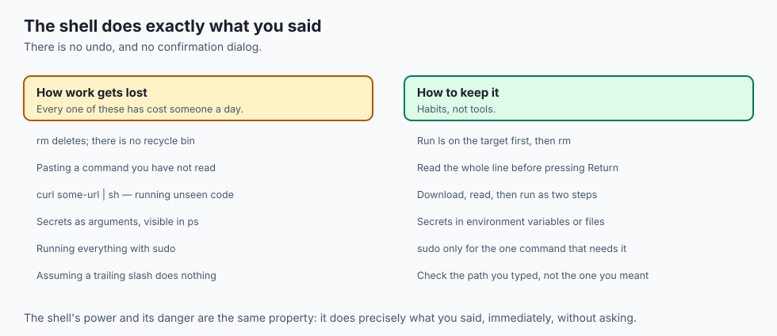
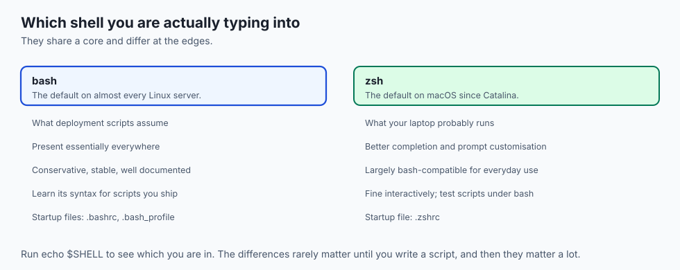
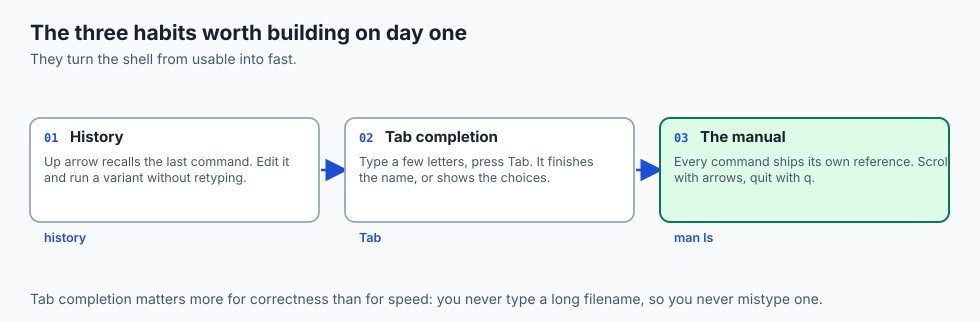

## Why this matters

- **Every AI tool you will use is installed and run from a terminal.** Frameworks,
  model servers, GPU diagnostics, deployment — all of it.
- **Every server you rent has no screen.** The terminal is not a preference there;
  it is the only interface.
- **A command is shareable as text.** That is why every README, every tutorial and
  every error report you will ever read speaks in commands.
- **This is Week 2, and it is the week that changes how you work.** Last week
  explained the machine; this week you start driving it.

---

## The idea in plain language



- **A terminal is a window that shows text and takes typing.** That is all it is.
- **A shell is the program running inside it** that reads what you type and does
  something about it.
- **You name what you want** instead of pointing at it.
- **Everything you type is one of three things**: a command, an option that changes
  how it behaves, or an argument naming what it acts on.
- **Learn to read that structure** and no command ever looks alien again.

---

## Historical background

- **Before screens there were teletypes** — printing terminals that typed the
  computer's replies onto paper, one line at a time.
- **The line-at-a-time interface survived the paper.** When screens arrived they
  emulated the teletype, which is why the program is still called a terminal
  *emulator* today.
- **The shell was deliberately separated from the kernel** in early Unix, so it
  could be replaced. It is an ordinary program with no special privileges.
- **That decision is why shells compete.** The Bourne shell, then bash in 1989,
  then zsh — each replaceable because none of them is part of the system.
- **The prompt, the pipe and the redirect all date from the 1970s**, and you will
  type them unchanged this week.
- **The name is literal.** It is the shell *around* the kernel — the outer layer
  users touch, wrapping the core they must not. Whoever coined it was describing an
  architecture, not choosing a metaphor.

---

## What it is — and what it is not


- **The outer frame is the terminal emulator** — the window you see, click and
  resize.
- **Inside it runs the shell**, the program reading your lines.
- **Beneath the shell sits the operating system**, which actually starts programs
  and opens files — everything from last week.

**It is not:**

- **Not magical or privileged.** The shell is one more user-space program, notable
  only for its job of launching others.
- **Not the same as the terminal.** You can run a different shell in the same
  window, or the same shell over a network connection with no window at all.
- **Not a programming language you must learn first.** It is a way to run programs;
  the language part comes later this week.

---

## Why it was created and what problems it solves



- **Repetition.** A graphical action happens once. A command can run a thousand
  times, tonight, without you.
- **Precision.** "The third file from the top" is ambiguous. A path is not.
- **Composition.** Small programs that each do one thing can be chained; windows
  cannot be chained.
- **Remoteness.** Text travels down a slow connection. A desktop does not.
- **Reproducibility.** You can paste a command into a bug report, a script or a
  Dockerfile. You cannot paste a sequence of clicks.

---

## How it works

### The read-eval-print loop



Typing `ls -l /Users` and pressing Return does exactly five things:

1. **Prompt and read.** The shell prints its prompt and waits. You type; the
   emulator shows the characters; nothing has run yet. Return hands over the line.
2. **Parse and expand.** The shell splits the line at spaces into `ls`, `-l` and
   `/Users`, and performs any expansions — turning a `*` into matching filenames,
   for instance.
3. **Locate and launch.** It searches PATH for a program named `ls`, asks the kernel
   to start it with those arguments, and waits.
4. **Print.** The program writes its listing, which flows back through the shell to
   the emulator.
5. **Loop.** The program exits and a fresh prompt appears.


- **This loop is the shell's heartbeat**, exactly as fetch-decode-execute was the
  processor's.
- **Everything else you will learn** — pipes, variables, scripts — is a richer thing
  to do inside step 2. The loop never changes.

### Finding the program



- **`command not found` usually means "not on PATH"**, not "not installed". This is
  the single most common beginner confusion, and it has an easy check.
- **`type ls`** tells you what a name actually is: a built-in, an alias, or a real
  program, and where it lives.
- **`echo $PATH`** shows the search list, colon-separated, in the order it is
  searched.

---

### Expansion: what happens before the program runs



- **The program never sees what you typed.** It sees what the shell made of it.
- **`ls *.csv` does not pass a star to `ls`.** The shell replaces the star with the
  matching filenames first, and `ls` receives a list.
- **If nothing matches, the star is passed through literally**, which produces the
  confusing "no such file or directory: *.csv".
- **Quoting switches expansion off.** `"*.csv"` reaches the program intact, which
  some programs — `find`, `rsync` — actually want.
- **Learn this once and a whole class of mystery disappears**: why a command behaves
  differently in a different directory, and why quoting a path with spaces is not
  optional.

## An everyday analogy



A shop with a counter and a clerk.

| The shop | The terminal |
| --- | --- |
| The counter and window | The terminal emulator |
| The clerk | The shell |
| The stockroom and staff | The operating system |
| A written slip | A command line |
| "Ready" on the sign | The prompt |
| The logbook of slips | Command history |
| Reference binders | `man` pages |

- **You hand over a slip; the clerk fetches.** You do not go into the stockroom
  yourself — you are not allowed, and you do not need to be.
- **The clerk finishes your sentence** when you start writing a long product name.
  That is tab completion.
- **The clerk does exactly what the slip says.** Including, if that is what you
  wrote, throwing away the stock.

---

## Examples in practice

- **`ls -la ~/Downloads`** — one command, one flag bundle, one argument. You can now
  read every part of it.
- **`python3 train.py --epochs 10`** — identical structure. The program happens to
  be yours.
- **`command not found: pyton`** — a typo, caught by the PATH search. Tab completion
  would have prevented it.
- **`Permission denied`** — the kernel's check from Day 6, surfacing at your prompt.
- **`man curl` followed by `/timeout`** — searching a manual page rather than
  searching the web.

---

## Implications: security, privacy, performance, scalability, and cost



- **Security: `rm` has no recycle bin.** The file is gone, immediately, with no
  confirmation. Run `ls` on the target first — a habit that costs a second and has
  saved careers.
- **Never pipe a download straight into a shell.** `curl some-url | sh` runs code
  you have not read, with your privileges. Download, read, then run.
- **Privacy: `ps` shows command-line arguments to every user.** A key passed as an
  argument is not a secret.
- **Performance: the shell itself is never your bottleneck.** It launches programs;
  the programs do the work.
- **Cost: the terminal is how you avoid paying twice.** A command that is written
  down runs identically next month, at 3am, without you awake to supervise it.

---

## Alternatives: free, open source, and commercial

| Tool | Type | Why you might use it |
| --- | --- | --- |
| Terminal.app / GNOME Terminal | Bundled, free | Already installed; entirely sufficient |
| iTerm2 (macOS) | Free | Split panes, better search, session history |
| Windows Terminal | Free | The good Windows option; use it with WSL2 |
| Warp, Ghostty | Free | Modern rendering, block-based output |
| VS Code integrated terminal | Free | The terminal beside your editor |
| tmux | Free, open source | Sessions that survive disconnection |

- **Do not shop for a terminal yet.** The bundled one teaches you everything this
  week covers. Change it when you know what annoys you.

---

## Comparison with related concepts



| Term | What it actually is |
| --- | --- |
| **Terminal** | The window: draws text, accepts keystrokes |
| **Terminal emulator** | The same thing, named for the teletype it imitates |
| **Shell** | The program inside that interprets your lines |
| **Console** | Historically the machine's own attached screen |
| **Command line** | The single line of text you typed |
| **CLI** | Any program driven by typed arguments, not just the shell |

---

## When to use it — and when not to



- **Use the shell when the work repeats**, when it must be exact, or when it happens
  on a machine with no screen.
- **Use it when you need to describe what you did** to a colleague, a script or a
  bug report.
- **Use the graphical tool for genuinely visual work.** Comparing images, arranging
  a layout, reading a long document — a window is better and nobody gains points for
  suffering.
- **Do not memorise commands.** Learn to read them, and look up the rest. `man` and
  `--help` are the skill; recall is not.

---

## The AI connection

- **Every framework installs from a command.** `pip install torch` is your first,
  and there will be thousands more.
- **`nvidia-smi` is a terminal program**, and it is how you find out whether your
  GPU is visible, busy, or too hot.
- **Training runs are launched, monitored and killed from a shell** — with the
  background jobs and signals you met yesterday.
- **Remote GPU machines have no desktop at all.** You will connect over SSH into
  exactly this prompt.
- **Model configuration is command-line arguments.** The structure you learned today
  is the structure of every experiment you will ever run.

---

## Knowledge check

```yaml
quiz:
  question: "You install a tool, and running its name gives \"command not found\" — yet the file clearly exists on disk. What is the most likely explanation?"
  options:
    - "The directory containing it is not listed in PATH, so the shell never searches there"
    - "The tool was installed for a different user account"
    - "The shell needs to be restarted before any new program can be run"
    - "The file was installed without read permission for your user"
  answer_index: 0
  explanation: "The shell searches only the directories named in PATH, in order. A program outside all of them is invisible to a bare name, though it will run perfectly if you give its full path."
```

---

## Hands-on exercise

Read the loop, then use it. Worked through fully in the Day 8 lab directory.

| What you are doing | Command |
| --- | --- |
| See which shell you are in | `echo $SHELL` |
| See where it searches | `echo $PATH` |
| Ask what a name really is | `type ls` and `type cd` |
| Read a manual page | `man ls` (press `q` to quit) |
| Recall and edit a command | Up arrow, then Return |
| Complete a long name | Type a few letters, press Tab |

### Expected output

```text
/bin/zsh
/usr/local/bin:/usr/bin:/bin:/usr/sbin:/sbin
ls is /bin/ls
cd is a shell builtin
```

- **`ls` is a file on disk**, found by searching PATH.
- **`cd` is a built-in** — no file exists, because changing directory must happen
  inside the shell itself.

### Validate your work

- [ ] You can name your shell and list the directories it searches
- [ ] You used `type` to distinguish a built-in from a program on disk
- [ ] You opened a manual page and left it without closing the terminal
- [ ] You recalled a previous command and ran an edited version of it
- [ ] You completed a filename with Tab rather than typing it
- [ ] `bash tests/run_tests.sh` reports 0 failures

### Troubleshooting

- **`man` opens and you are stuck.** Press `q`. Arrow keys scroll; `/word` searches.
- **Tab does nothing.** There is nothing unambiguous to complete. Press it twice to
  see the candidates.
- **`$SHELL` disagrees with what you are using.** `$SHELL` is your *login* shell; you
  may have started another one inside it.
- **A command works for a colleague and not for you.** Compare `echo $PATH` before
  assuming anything is broken.

### Common mistakes

- **Typing long paths by hand.** Tab exists specifically to stop you.
- **Pasting commands without reading them**, especially from a web page.
- **Reaching for `sudo` when something fails.** Find out why first; the answer is
  usually PATH or a typo, and `sudo` fixes neither.
- **Treating "command not found" as "not installed".**

---

## Practice assignment

- **Run ten commands** you have never run before, taken from `man` pages you open
  yourself. Record what each one does in your own words.
- **Find three built-ins and three programs** using `type`, and explain why each one
  has to be what it is.
- **Break PATH deliberately** in a throwaway shell (`PATH=/bin`), observe what stops
  working, then close the window to restore it.
- **Reconstruct a command from history** rather than retyping it, five times in a
  row, until the Up arrow is a reflex.

---

## Extension challenge

- **Read your shell's startup file** (`~/.zshrc` or `~/.bashrc`). You are not
  expected to understand every line; find the ones that set PATH.
- **Write your own prompt.** Change `PS1` (bash) or `PROMPT` (zsh) to include the
  current directory and the last exit code. Getting the exit code into the prompt
  teaches you more than any tutorial.
- **Time the difference.** Rename fifty files by hand in a file browser, then do the
  same fifty with one command. Record both durations. That ratio is why this week
  exists.

---

