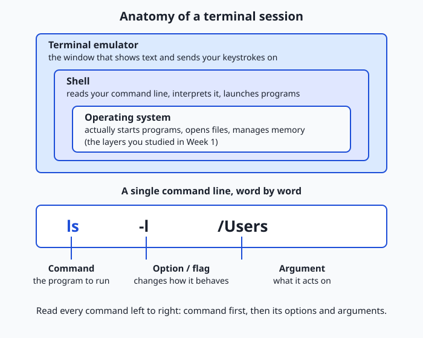

## Why this matters

For the last week you have been reading about the machine. Today you start *driving* it, and you do it the way every serious practitioner does: by typing instructions into a terminal. Every model you will ever train, every server you will ever deploy a model onto, every data-processing job that turns a folder of raw files into a clean training set — all of it is launched, monitored, and debugged from a plain text prompt. The friendly buttons of a graphical app are a thin convenience layer; the real controls are down here, and they are words.

This matters for concrete reasons you will feel in your wallet and your calendar. Rented cloud machines — the ones with the fast processors that heavy computation needs — usually give you nothing but a terminal: no desktop, no mouse, just a blinking cursor over a network connection. When a long-running job fails at 2 a.m. and you are paying by the minute for the machine it was running on, the difference between fixing it in five minutes and losing the night is whether you are fluent here. The terminal is also where reproducibility lives: a command you type is a fact you can write down, paste into a document, and re-run tomorrow and get the same result — which a sequence of mouse clicks can never be.

So today is a threshold. By the end you will know what a terminal actually is (it is not what most people think), how the program behind it — the shell — reads and runs your commands, how to read any command's anatomy, and how three small features (history, tab completion, and the manual) turn typing from a chore into a fast conversation. You will live in this environment for the rest of the course. Let's make it home.

## The idea in plain language

Picture a service desk with a clerk behind it. You write a short request on a slip of paper, slide it across the counter, and the clerk reads it, does exactly what it says, hands back the result, and then looks up and waits for your next slip. That back-and-forth — you write, the clerk acts, the clerk reports, the clerk waits — is the whole of working in a terminal.

Three different things are in play at that desk, and beginners blur them together. The **terminal** (more precisely, the terminal emulator) is the window and counter itself: the physical-feeling surface where text you type appears and text the computer prints comes back. The **shell** is the clerk: a program that reads what you typed, works out what you meant, runs the right tool to do it, and shows you the result. A **command** is the request slip: one line of text naming a job and any details it needs.

The clerk is fast, tireless, and utterly literal. It does not guess, forgive typos, or infer what you "obviously" wanted. Type the name of a tool that does not exist and it simply says it cannot find it. Ask it to delete something and it deletes it, no second-guessing. That literalness feels harsh at first and becomes a superpower: because the clerk does exactly what the slip says and nothing more, the same slip always produces the same result. Learn to write good slips and you can automate anything.

## Historical background

The terminal is old, and its name is a fossil. In the 1960s and 1970s, a computer was a room-sized machine that many people shared. You did not sit at the computer; you sat at a **terminal** — a separate device at the *end* of a wire (hence "terminal"), with a keyboard for sending characters and, at first, a roll of paper for receiving them. These early terminals were electromechanical teletypewriters, and their legacy survives in the abbreviation **tty**, still used today for a terminal device, which stands for teletypewriter.

Paper gave way to screens. Digital Equipment Corporation's VT100, introduced in 1978, became so common a video terminal that its way of interpreting text and control codes turned into a de facto standard; software still claims to be "VT100 compatible" decades later. When personal computers put the whole machine on your desk, the separate terminal device disappeared — but the software that talked to programs the terminal way was too useful to lose. So it was preserved as a program: a **terminal emulator**, a window that behaves like one of those old screens. Every "Terminal" or "console" app you open today is an emulator faithfully pretending to be a 1978 piece of hardware.

The clerk behind the counter has its own lineage. On early Unix, the program that read your commands was called the **shell** because it wrapped around the operating system's core like a shell around a nut. Stephen Bourne wrote an influential one, the Bourne shell (`sh`), released with Version 7 Unix in 1979; its name and its `$` prompt are still everywhere. In 1989, Brian Fox, working for the Free Software Foundation, wrote a free replacement and gave it a pun for a name — the Bourne Again Shell, or **bash**. A year later, in 1990, a Princeton student named Paul Falstad released **zsh**, packing in conveniences like smarter completion and correction. Much later, in 2005, the **fish** shell (friendly interactive shell) took a different tack, aiming to be pleasant out of the box with no configuration. Different clerks, same counter — and today you can choose which one staffs your desk.

## What it is — and what it is not

A terminal session is three cooperating layers, and naming them precisely prevents a great deal of confusion. The **terminal emulator** is an application that draws a grid of text characters, sends your keystrokes onward, and displays the characters it receives back. The **shell** is a separate program running *inside* that window whose entire job is to read command lines, interpret them, run the corresponding programs, and print their output. A **command** is a single instruction you give the shell.

Here is what each is *not*. The terminal emulator is not the shell: the same emulator window can run bash now and zsh a minute later, the way one desk can be staffed by different clerks. The shell is not the operating system: it is an ordinary program that *asks* the operating system to do things, no more privileged in principle than a text editor. And a command is usually not built into the shell at all — most commands are the names of separate small programs stored on disk, which the shell finds and launches on your behalf. When you type `ls`, the shell does not itself know how to list files; it locates a program called `ls`, runs it, and relays what it prints.

| People often say | What is actually true |
| --- | --- |
| "The terminal runs my commands." | The terminal only shows text; the *shell* running inside it interprets and runs commands. |
| "The terminal and the shell are the same thing." | They are separate programs — one emulator can host different shells at different times. |
| "Commands are features of the shell." | Most commands are independent programs on disk; the shell just finds and launches them. |
| "The command line is a relic for experts." | It is the primary interface for servers, automation, and reproducible work — used daily by professionals. |
| "One typo could break my computer." | Ordinary commands run as your normal user and touch only what you have permission to touch. |

## Why it was created and what problems it solves

The command line was not designed to be intimidating; it was designed to be *composable*, and that word explains why it has outlived every fashion in computing. The problem the early Unix designers faced was this: a computer can do thousands of small jobs — list files, search text, sort lines, count words — and users need to combine those jobs in endless unforeseen ways. Building one giant program with a button for every combination is impossible. So they inverted the idea: make each small job its own tiny program, and give the user a language for stringing them together. That language is the shell.

This buys three things a graphical interface struggles to offer. First, **automation**: because a command is just text, a sequence of commands can be saved in a file and re-run forever, turning a fiddly manual chore into a one-word job. Second, **reproducibility**: a written command is an exact, shareable record of what was done, so a colleague — or you, six months later — can reproduce a result precisely. Third, **reach**: text travels down a thin wire effortlessly, so you can drive a machine on the other side of the planet through the same prompt you use locally. These are the exact properties heavy computational work demands, which is why the field never left the terminal even as everything else grew windows and touchscreens.

## How it works

Let's open the desk and look behind the counter, first at how the pieces are arranged, then at the exact loop the clerk repeats for every slip you hand over.

### Internal architecture

When you launch a terminal emulator, it opens a window and starts one shell program inside it, then connects the two through a special channel the operating system provides for exactly this purpose. From then on, three parties pass text in a chain. Your keystrokes flow from the emulator to the shell. The shell interprets each completed line and asks the operating system to run programs, which produce output. That output flows back through the shell to the emulator, which draws it on screen.



The diagram shows the arrangement. The outer frame is the **terminal emulator** — the window you see and click on. Inside it runs the **shell**, the program reading your lines. Beneath the shell sits the **operating system**, which actually starts programs, opens files, and manages memory (everything you studied last week). Notice that the shell is not special or magical; it is one more program sitting on the operating system, distinguished only by its job of launching other programs on your command. The lower half of the diagram dissects a single command line into its parts, which we will read next.

### Important components

Every command line, no matter how elaborate, is built from the same three kinds of word. Reading them correctly is the single most useful skill of the day, because once you can parse any command, no command looks alien.

| Part | What it is | In `ls -l /Users` |
| --- | --- | --- |
| Command | The name of the program to run — always first | `ls` (list directory contents) |
| Option / flag | A switch that changes *how* the command behaves; usually starts with `-` or `--` | `-l` (use the long, detailed listing) |
| Argument | The thing the command acts *on* — a file, folder, or value | `/Users` (the directory to list) |

The command comes first and names the tool. **Options** (also called **flags**) come next and adjust the tool's behaviour: short options are a single dash and one letter, like `-l`, and can often be bundled, so `-l -a` becomes `-la`; long options are two dashes and a word, like `--all`, which are slower to type but easier to read. **Arguments** are the targets the command operates on. Not every command needs all three — `date` takes neither options nor arguments and just prints the time — but every command *starts* with a command word, and everything after it is either an option changing the behaviour or an argument naming a target.

### Step by step: the read-eval-print loop

The clerk's behaviour is a precise, repeating loop that computer scientists call a **read-eval-print loop**, or **REPL**: it reads a line, evaluates it, prints a result, and loops back to wait for more. Here is exactly what happens when you type `ls -l /Users` and press Return.

1. **Prompt and read.** The shell prints its **prompt** — a short piece of text like `you@laptop ~ %` that means "I am ready; type here" — and waits. You type characters; the emulator shows them; nothing runs yet. Pressing Return hands the finished line to the shell.
2. **Evaluate: parse and expand.** The shell splits the line into words at the spaces, giving `ls`, `-l`, and `/Users`. It performs any expansions (for example, turning a `*` into a list of matching filenames — more on that in later lessons). It treats the first word, `ls`, as the program to run and the rest as its options and arguments.
3. **Evaluate: locate and launch.** The shell searches a list of directories, called the **PATH**, for a program named `ls`. Finding it, it asks the operating system to start that program, passing along `-l` and `/Users`, and then waits for it to finish.
4. **Print.** The `ls` program does its work and writes its listing; that text flows back through the shell to the emulator, which displays it.
5. **Loop.** The program exits, and the shell prints a fresh prompt — "ready for the next slip" — and the cycle begins again.



That loop is the heartbeat of the shell exactly as fetch-decode-execute was the heartbeat of the processor. Almost everything else you will learn — pipes, variables, scripts — is a richer thing to do inside step 2, but the loop itself never changes.

### Three features that make it fast

A shell would be usable with only the loop above, but three features turn it from usable into fast, and you should build them into your fingers from day one.

**Command history.** The shell remembers the commands you have run. Press the **Up arrow** to recall the previous command, and again to go further back; edit it and press Return to run a variant without retyping. The `history` command prints the numbered log of recent commands, so `history | tail` shows the last handful. This is the clerk keeping a logbook of every slip, so you can say "do that last one again."

**Tab completion.** Type the first few letters of a command or a filename and press the **Tab** key; the shell completes it for you, or, if several things match, shows the choices. This is the clerk finishing your sentence — it saves keystrokes and, more importantly, prevents typos in long names, because you never type the whole thing.

**The manual.** Almost every command ships with its own reference page, and the `man` command displays it: `man ls` opens the manual for `ls`. You scroll with the arrow keys and press `q` to quit. Many commands also accept `--help` for a shorter summary (`ls --help`), and the `type` command tells you what a name actually is (`type ls` reveals whether it is a program, a shortcut, or a shell built-in). These are the reference binders behind the desk: you never have to memorise every option when you can look it up in seconds.

## An everyday analogy

Hold the service desk in mind, because every piece of today's lesson maps onto it cleanly. The **terminal emulator** is the physical desk and its window — the surface where slips are exchanged. The **shell** is the clerk staffing that desk: patient, literal, and quick. A **command** is a request slip you write and slide across. The **prompt** is the clerk looking up and saying "next, please" — the signal that they are free and waiting for your slip.

The clerk's routine is the read-eval-print loop: read the slip, work out what it asks, fetch the right specialist to do it, hand back what the specialist produced, then look up and wait again. Crucially, the clerk rarely does the work personally — for most requests they walk to a back room, fetch a **specialist** (the actual program, like `ls` or `date`), let the specialist do the job, and relay the result. That is why "most commands are separate programs" is not a technicality but the heart of the design: the clerk's genius is knowing *which* specialist to fetch and how to pass along your instructions.

The three speed features slot in too. **History** is the clerk's logbook of every slip handed over, so "repeat my last request" needs no rewriting. **Tab completion** is the clerk who, seeing you start to write a long specialist's name, finishes it for you correctly. And the **manual** is the shelf of reference binders behind the desk, one per specialist, that you can consult whenever you forget exactly how to phrase a request. Keep this desk in your head and nothing about the terminal will feel like magic.

## Examples in practice

Let's read three real command lines by their anatomy, then meet the three shells you are most likely to encounter.

Start with a bare command: `pwd`. One word, no options, no arguments — it prints the *working directory*, the folder the shell is currently "standing in." Next, a command with an argument: `echo hello`. The command is `echo` (a tool that prints back whatever you give it) and `hello` is its argument; it prints `hello`. Now one with all three parts: `ls -l /Users`. Command `ls`, option `-l` (long, detailed format), argument `/Users` (the folder to list). Read any command this way — command first, then options and arguments — and you can decode lines you have never seen.

Now the shells themselves. Choosing one is genuinely low-stakes for a beginner: they share the same command anatomy and the same loop, and differ mainly in convenience features and configuration. All three below are free and open source.

**bash** — the default assumption. Choose it when you want the most widely documented shell on earth: nearly every tutorial, script, and server assumes bash, and most Linux distributions still make it the default login shell. To see it in action, run `bash` to start it, then a command:

```text
$ bash
$ echo "running in bash"
running in bash
```

The `$` prompt is bash's traditional signal that it is ready for your input.

**zsh** — the friendly default on macOS. Choose it for sharper tab completion and easier customization while staying broadly bash-compatible. Since macOS Catalina (version 10.15, released in 2019), zsh has been the default shell on macOS — largely because Apple wanted a modern, freely licensed shell and had kept its bundled bash frozen at an old version for licensing reasons. To try it:

```text
% zsh
% echo "running in zsh"
running in zsh
```

The `%` prompt is zsh's traditional ready signal, which is why macOS terminals greet you with `%` rather than `$`.

**fish** — the beginner-friendly alternative. Choose it when you value comfort over compatibility: fish offers syntax highlighting and history-based suggestions with zero configuration, at the cost of not being fully bash-compatible, so some copied-from-the-internet scripts will not run in it unchanged. If it is installed:

```text
$ fish
$ echo "running in fish"
running in fish
```

For this course, whichever shell your system gives you by default is the right choice: the commands you will learn work in all three.

## Implications: security, privacy, performance, scalability, and cost

### Security

The terminal's power is also its risk: the shell runs whatever you type with your full user privileges, and it does so without asking "are you sure?" This is why the oldest rule of the command line is *never run a command you do not understand*, and never paste a command from an untrusted web page without reading it first — a single line can delete files or download and run hostile code. Commands prefixed with `sudo` are especially serious, because `sudo` runs the rest of the line with administrator power, able to touch the whole system; treat every `sudo` line as a decision, not a reflex. Reading a command by its anatomy — which program, which options, which targets — is your first line of defence.

### Privacy

Your shell keeps a history file on disk recording the commands you have run, which is a convenience and a leak in equal measure: anything you typed on the command line, including a password or secret key accidentally passed as an argument, may be sitting in plain text in that history. Being aware that history is persisted — not just remembered for this session — is enough to change a bad habit into a safe one: keep secrets out of command lines and in files or environment variables designed to hold them, a discipline that matters intensely once you are handling access keys for cloud machines and data.

### Performance

For interactive use the shell's own overhead is invisible; the read-eval-print loop is trivial work for a modern processor, and any delay you feel is the *program* the shell launched doing its job, not the shell reading your line. Where the terminal delivers a real performance advantage is in throughput of *your* time: history and tab completion cut the seconds and errors out of every command, and a saved sequence of commands runs a hundred-step chore faster and more reliably than any human clicking through windows.

### Scalability

Text is the most scalable interface there is. A graphical program controls one machine that a person is looking at; a shell command can be sent, unchanged, to one machine or to ten thousand at once, and its text output can be collected, searched, and summarised automatically. This is precisely why large computational systems are operated from the command line: the same skills that drive your laptop scale, without modification, to a fleet of rented servers.

### Cost

The command line is free — the shell and its commands ship with every Unix-like operating system at no charge — but its real economic weight shows up on rented machines. Cloud servers bill by the minute or hour, and they typically offer no interface but a terminal, so command-line fluency translates directly into money: setting a job up correctly the first time, spotting a failure quickly, and shutting an expensive machine down the moment it is idle are all terminal skills, and each one is the difference between a small bill and a shocking one.

## Alternatives: free, open source, and commercial

For a foundational skill like this, "alternatives" means both other shells and other ways to learn the terminal well.

| Resource | Type | What it offers | Cost |
| --- | --- | --- | --- |
| The Day 8 lab in this course | Free | A guided first shell session on your own machine, tied to this lesson | Free |
| bash | Free, open source | The most widely documented shell; the safe default for scripts and servers | Free |
| zsh | Free, open source | The macOS default; richer completion and customization, broadly bash-compatible | Free |
| fish | Free, open source | Beginner-friendly shell with highlighting and suggestions out of the box | Free |
| The Missing Semester of Your CS Education | Free lectures | MIT's practical course; its shell lecture is the ideal companion to this lesson | Free |
| The Linux Command Line (William Shotts) | Book, free to read online | A thorough, gentle book that takes you from first commands to scripting | Free online; print purchase optional |

There is no meaningful "commercial" tier here: the command line is one of computing's great free goods. Paid terminal *emulators* with extra visual features exist, but the shell itself and every command you will learn cost nothing, on every platform.

## Comparison with related concepts

| Concept A | Concept B | Key difference |
| --- | --- | --- |
| Terminal emulator | Shell | The emulator is the window that shows text; the shell is the program inside it that interprets commands |
| Shell | Operating system | The shell is an ordinary program that *asks* the OS to run other programs; the OS is what actually runs them |
| Command-line interface (CLI) | Graphical user interface (GUI) | A CLI is driven by typed text commands; a GUI is driven by pointing and clicking on visual controls |
| Option (flag) | Argument | An option changes *how* a command behaves; an argument is *what* it acts on |
| Shell built-in | External command | A built-in (like `cd`) is part of the shell itself; an external command (like `ls`) is a separate program the shell locates and launches |
| Interactive shell | Shell script | An interactive shell runs commands you type one at a time; a script is a saved file of commands the shell runs unattended |

## When to use it — and when not to

Reach for the terminal whenever a task must be automated, reproduced, or done at a distance. If you will do something more than a few times, a saved command sequence beats repeated clicking. If you must record exactly what you did — for a colleague, for a report, for your future self — a written command is a perfect record where a screen recording of mouse movements is not. And if the machine has no screen of its own, as rented servers usually do not, the terminal is not a preference but the only door in. These three situations — automation, reproducibility, and remote control — are the daily reality of serious computational work, which is why the rest of this course leans on the terminal so heavily.

Know equally when the graphical interface wins. Genuinely visual tasks — judging an image, arranging a layout, reading a chart, dragging one thing onto another — are what pointing and clicking were made for, and forcing them through text is stubbornness, not skill. Exploratory, one-off actions you will never repeat are often faster with a mouse. And for a nervous newcomer, doing a dangerous operation like deleting many files through a graphical tool that shows a preview and offers an undo can be safer than a terminal command that acts instantly and permanently. The professional habit is fluency in both, and the judgement to pick the right one: text when the job must scale, repeat, or travel; clicks when it is visual, singular, and local.

Almost everything about building and running intelligent systems happens at the prompt you are learning today. When practitioners prepare a dataset, they clean and reshape it with command-line tools; when they train a model, they launch the run with a command and watch its progress scroll past in the terminal; when they deploy a finished model, they do it by typing commands on a rented server that has no other interface. The powerful machines this work requires live in data centres you will never physically see, and you reach every one of them through exactly the read-eval-print loop you met today — you type a command, a shell on the far side reads it, runs it, and prints the result back to your screen across the network. The terminal is not a preliminary you get past on the way to the interesting work; it *is* the workshop where the interesting work is done. Every remaining day of this course assumes you are becoming comfortable here, so treat today's small session as the first hour of a skill you will use every single day from now on.

## Knowledge check

Try these from memory before looking back:

1. In your own words, distinguish the terminal emulator, the shell, and a command, and say which one actually runs your instructions.
2. Break the command `ls -a /tmp` into its three kinds of word, labelling each.
3. Describe the five steps of the read-eval-print loop for a command you type, including what the prompt signals.
4. Name the three convenience features covered today and say, for each, one keystroke or command that triggers it.
5. Explain why macOS shows a `%` prompt by default while many Linux systems show `$`, referring to the shells involved.

## Hands-on exercise

Time to open the desk for real. In this exercise — worked through in full in the Day 8 lab directory — you will run a short tour of your own shell, discovering which shell you are running, what your prompt is, and what a handful of everyday commands do.

Open your terminal (on macOS: press Cmd+Space, type "Terminal", press Return) and run each command by typing it and pressing Return:

```bash
echo $0
```

Prints the name of the shell you are currently running — often `-zsh` or `bash`. This is the clerk introducing themselves.

```bash
echo $SHELL
```

Prints the path to your default login shell, such as `/bin/zsh` or `/bin/bash` — which clerk staffs your desk when you first sit down.

```bash
ps -p $$
```

Shows the process for the current shell (`$$` is the shell's own process number), confirming which shell program is actually running right now.

```bash
echo "$PS1"
```

Prints the *prompt string* — the template your shell uses to draw the "ready" prompt. It may look cryptic; that is the recipe behind the `%` or `$` you see.

```bash
pwd
```

Prints the working directory — the folder your shell is currently standing in.

```bash
date
```

Prints the current date and time — a command that takes no options and no arguments.

```bash
whoami
```

Prints your username — the identity every command you run acts as.

```bash
history | tail
```

Prints the last several commands from your history logbook, proving the shell has been recording.

```bash
type echo
```

Tells you what `echo` actually is — a shell built-in, a program on disk, or an alias.

### Expected output

A typical run in zsh on macOS (your values will differ — that is the point):

```text
$ echo $0
-zsh

$ echo $SHELL
/bin/zsh

$ ps -p $$
  PID TTY           TIME CMD
 1234 ttys000    0:00.05 -zsh

$ echo "$PS1"
%n@%m %1~ %#

$ pwd
/Users/you

$ date
Sun Jul 12 10:30:00 IST 2026

$ whoami
you

$ history | tail
  495  cd projects
  496  ls -l
  497  echo $0
  ...

$ type echo
echo is a shell builtin
```

Line by line: `echo $0` and `echo $SHELL` agree that this is zsh — the clerk on duty. `ps -p $$` confirms it by showing the running shell process. `$PS1` reveals the prompt template (`%n` is your username, `%m` the machine, `%1~` the current folder, `%#` the `%`-or-`#` symbol). `pwd` shows where you are standing; `date` and `whoami` are simple no-argument commands; `history | tail` proves your commands are being logged; and `type echo` reveals that `echo` here is built into the shell rather than a separate program.

### Validate your work

You are done when you can check every box:

- [ ] You can name the shell you are running (from `echo $0` or `ps -p $$`).
- [ ] You can state the path of your default shell (from `echo $SHELL`).
- [ ] You have seen your raw prompt string (from `echo "$PS1"`).
- [ ] You ran `pwd`, `date`, and `whoami` and can say what each printed.
- [ ] You confirmed your history is being recorded (from `history | tail`).
- [ ] You can point at one command line and label its command, options, and arguments.

### Troubleshooting

- **`echo $0` prints something surprising like `-zsh` with a leading dash.** The leading `-` marks a *login* shell; the shell name is still `zsh`. This is normal, not an error.
- **`echo $PS1` prints an empty line.** Some shells store the prompt elsewhere or your quoting stripped it; try `echo "$PS1"` with the quotes, and if still empty, your shell simply uses a default prompt.
- **`history` prints nothing or "command not found".** In a brand-new shell there may be no history yet — run a few commands first. If you started a non-interactive sub-shell, exit back to your normal terminal and retry.
- **`ps -p $$` shows a different shell than `echo $SHELL`.** That is expected if you started another shell by hand: `$SHELL` is your *default* shell, while `ps -p $$` shows the one *running right now*.

### Common mistakes

- **Confusing the terminal with the shell.** The window is the emulator; the thing reading your commands is the shell. Changing your terminal app does not change your shell, and vice versa.
- **Assuming every command needs options and arguments.** Many do not: `pwd`, `date`, and `whoami` take none. The only always-present part of a command line is the command word itself.
- **Reading `$SHELL` as "the shell I'm in now."** It is your *default* shell; if you typed `bash` to start another shell, `$SHELL` still names the default while you are actually in bash. Use `echo $0` or `ps -p $$` for the one running now.

## Practice assignment

Open the shell-session worksheet in the starter directory of the Day 8 lab and fill it in completely for your own machine: record which shell you are running (with the command you used to find out), your raw prompt string, and then run any three commands of your choice and write, for each, the exact command, what it printed, and a one-sentence explanation of what it did and which parts were the command, options, and arguments. Then write two or three sentences naming your shell and explaining, in your own words, how a command you typed travelled through the read-eval-print loop from your keystrokes to its output. Keep the worksheet; later lessons build on this shell fluency.

## Extension challenge

Go one step deeper into the manual and the anatomy of commands. First, open the manual for a command you used today and read its options section:

```bash
man ls
```

Scroll with the arrow keys, find the description of the `-l` and `-a` options, then press `q` to quit. Next, run a command that uses all three anatomy parts and predict its output before you press Return:

```bash
ls -la /
```

Command `ls`, bundled options `-l` and `-a` (long format, including hidden entries), argument `/` (the root of the filesystem). Confirm your prediction against what prints. Finally, compare two ways of asking the same question — `type cd` and `type ls` — and explain in a sentence why one reports a shell built-in and the other a program on disk. You have now read a manual, decoded a full command, and seen the built-in-versus-program distinction with your own eyes — the exact skills that make every future command legible.
