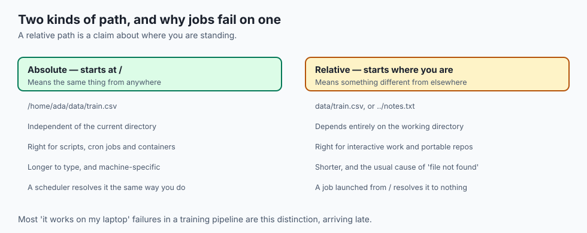
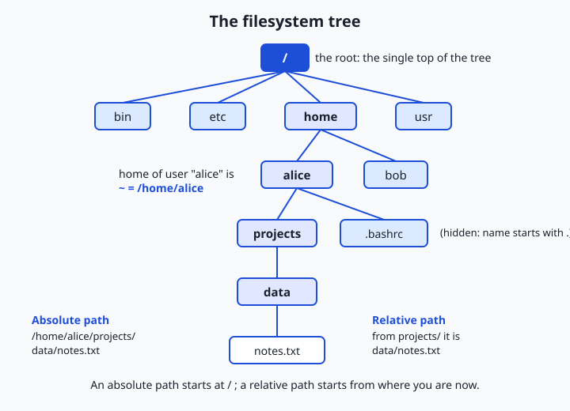
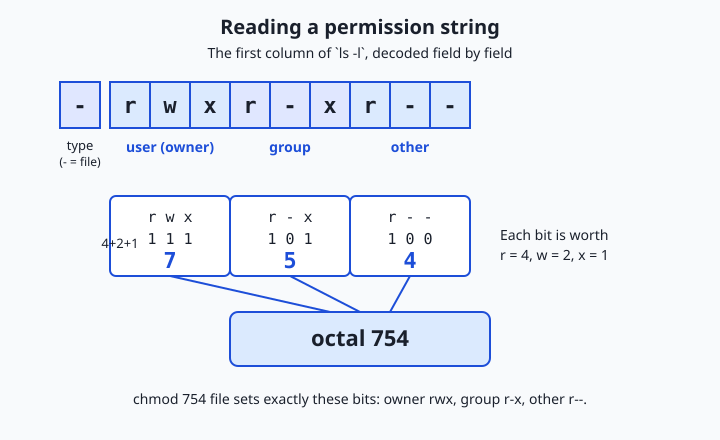

## Why this matters

Almost everything you will do on the path to a career in AI passes through the filesystem. A dataset is a folder of files. A trained model is a file — sometimes one enormous file, sometimes a directory of them. Your code, your notebooks, your configuration, your logs, the virtual environment that pins your library versions: all files, arranged in a tree of directories. The command line you met in the last lessons is powerful precisely because it lets you move through that tree and act on it with a few keystrokes. If you cannot navigate the filesystem fluently, every other skill in this course runs uphill.

The consequences of not knowing this are concrete and daily. A script fails with `No such file or directory` because you ran it from the wrong place and its relative path pointed at nothing. A download lands in a folder you cannot find, so you re-download it three times and fill your disk. A tutorial says "run `chmod +x train.sh`" and, without today's lesson, that instruction is a magic spell rather than a precise change you understand. Worst of all, someone in a hurry pastes a `rm -rf` command they did not read and erases hours of work with no undo. Permission errors, in particular, are not an occasional nuisance — they are a part of daily practice, and the practitioners who resolve them in seconds rather than hours are simply the ones who know what the permission bits mean.

Today you build that fluency. You will learn how the filesystem is shaped, how to describe any location two different ways, how to move around and reshape the tree from the keyboard, and how the small grid of read/write/execute permissions decides who may do what. By the end, `/`, `~`, `..`, and a string like `-rwxr-xr--` will read as plainly as street signs.

## The idea in plain language

A filesystem is how a computer organizes files so that both you and the operating system can find them again. Rather than dumping every file into one giant pile, the system arranges them into a tree of **directories** (the same thing Windows and graphical tools call "folders"). A directory can hold files and can hold other directories, which hold more files and directories, and so on — a branching structure with no fixed depth.

Every tree needs a starting point, and on macOS and Linux there is exactly one: the **root directory**, written as a single forward slash, `/`. Everything on the machine lives somewhere underneath `/`. To point at any specific file, you write a **path** — a sequence of directory names separated by slashes that spells out the route from some starting point down to the file, like `/home/alice/projects/data/notes.txt`.

There are two ways to write that route. An **absolute path** always starts at the root `/` and gives the full route from the top, so it means the same thing no matter where you are standing. A **relative path** starts from wherever you currently are — your **working directory** — and gives directions from there. Both can name the same file; they are two ways of describing one location, exactly as "1600 Pennsylvania Avenue" and "three doors down on the left" can point at the same house.

Finally, files and directories carry **permissions**: a small set of rules recording who is allowed to read them, change them, or run them. Those rules are why you can share a computer safely, why some files run as programs and others do not, and why so many first-day errors say `Permission denied`. Paths tell you *where* something is; permissions tell you *what you are allowed to do* with it. Master both and the filesystem stops being a place you get lost in.

## Historical background

The tree-of-directories idea feels obvious now, but it had to be invented. Early computers stored files in flat lists or rigid, shallow schemes with no real nesting. The breakthrough came with **Unix**, developed at Bell Labs starting in 1969 by Ken Thompson, Dennis Ritchie, and colleagues. Unix introduced a **hierarchical filesystem**: a single tree, one root, directories that could nest arbitrarily, and — crucially — the principle that *everything is a file*. Not just documents, but devices, and even directories themselves, were things you could name with a path and operate on with the same handful of commands. That uniformity is why the tools you learn today are so few and so general.

Unix also brought the multi-user permission model you will meet later in this lesson. Because a single Unix machine was shared by many people at once, the system needed to keep one user from reading or clobbering another's files. The answer — an owner, a group, and three permissions (read, write, execute) for each — was in place by the 1970s and has survived, almost unchanged, into every Mac and Linux server running today. When you type `chmod`, you are using a command whose name and behavior are roughly fifty years old.

As Unix spread and fragmented into many variants, the details of *which* directories should exist and what belongs in them began to drift. To bring order, the Linux community published the **Filesystem Hierarchy Standard** (first released in 1994, evolving since), which specifies the conventional meaning of top-level directories: `/bin` for essential programs, `/etc` for configuration, `/home` for users' personal directories, `/usr` for most installed software, and so on. This is why a Linux server you have never touched still feels familiar — the map is standardized. macOS, built on a Unix foundation (via BSD and the Mach kernel), follows the same core model with its own conventions layered on top, such as `/Users` in place of `/home`. The commands and concepts in this lesson work on both.

## What it is — and what it is not

A filesystem is the operating system's scheme for **naming, organizing, and controlling access to** stored data. Three verbs, three things to keep straight. *Naming*: every file and directory has a name, and a path is a chain of those names. *Organizing*: the names are arranged in a single tree so that any item has exactly one place and one route to it from the root. *Controlling access*: each item records who owns it and who may do what, so the same tree can be shared safely by many users and programs.

It helps to be equally clear about what the filesystem is *not*. It is not the physical disk. The disk stores raw blocks of bytes; the filesystem is the organizing layer the operating system lays *over* those blocks so that "the file at `/home/alice/notes.txt`" means something. It is not the same as memory — files live in storage and survive a reboot, which is exactly why you save your work to a file rather than trusting it to RAM. A directory is not a container that physically holds its files the way a box holds objects; it is really a list that maps names to the files' actual locations, which is why moving a file can be near-instant even when the file is huge. And a path is not the file — it is a *name for* the file. Two different paths can even point at the very same underlying file, an idea we return to when we meet symbolic links.

| Common misconception | The reality |
| --- | --- |
| "Folders physically contain their files." | A directory is a list mapping names to file locations; the file's data lives elsewhere on the disk. |
| "The path is the file." | A path is a name for a file; the same file can have more than one path (see symbolic links). |
| "Uppercase and lowercase names are the same." | On Linux, `Data` and `data` are different files; macOS is usually case-insensitive but case-preserving — assume case matters. |
| "Deleting a file at the command line sends it to the Trash." | `rm` unlinks the file immediately with no Trash and no undo — this is why it must be used carefully. |
| "I need to be an administrator to change my own files." | Your own files are yours; `sudo` is for system-wide changes, not for editing files you already own. |

## Why it was created and what problems it solves

The hierarchical filesystem solves a scaling problem. A computer with ten files could keep them in a single flat list; a computer with ten million cannot. Nesting turns an unmanageable pile into a searchable structure: related files sit together in a directory, directories group into larger themes, and any item is reachable by a short, human-readable route. The same structure that lets *you* find a file lets *programs* find each other's data reliably, which is what makes a large software system possible at all.

The permission model solves a different problem: **sharing without chaos**. The moment more than one person — or more than one program — uses a machine, you need a way to say "this file is mine to change; you may only look," or "this configuration is off-limits to ordinary users." Permissions encode exactly that, at the level of every individual file and directory. They are the reason a stray program running as you cannot quietly rewrite the operating system, and the reason a shared server can host many users' projects side by side. They also solve a smaller but constant problem: distinguishing a plain data file from a file that is meant to be *run* as a program. That distinction is the **execute** permission, and it is why making a script runnable is a permission change rather than a rename.

Put together, paths and permissions answer the two questions the operating system asks about every access, thousands of times a second: *where is this thing*, and *is this user allowed to do this to it*. Everything in the rest of this lesson is a tool for answering those two questions deliberately instead of by trial and error.

## How it works



Let's walk the tree from the root down, then learn the commands that move through it, reshape it, and set its permissions.

### The shape of the tree

At the very top sits the root, `/`. Directly under it are the conventional top-level directories described in the history section — `/bin`, `/etc`, `/home` (or `/Users` on macOS), `/usr`, and a handful of others. Under `/home` sits one directory per user; yours is your **home directory**, the place you start when you open a terminal and the place all your personal work lives. Because typing `/home/alice` (or `/Users/alice`) constantly would be tedious, the shell gives it a shorthand: the tilde, `~`, always means "my home directory." So `~/projects/data` and `/home/alice/projects/data` are the same place for user alice.



Read the diagram from the top. The single root `/` branches into `bin`, `etc`, `home`, and `usr`. Inside `home` are the users `alice` and `bob`; alice's directory is what `~` expands to. Descending through `projects` and `data` reaches the file `notes.txt`. Notice the two routes drawn to that one file: the **absolute path** `/home/alice/projects/data/notes.txt`, which starts at the root and is valid from anywhere, and the **relative path** `data/notes.txt`, which is only meaningful when your working directory is `projects`. Same file, two names.

Four special path symbols do most of the navigational work, and they are worth memorizing:

| Symbol | Meaning |
| --- | --- |
| `/` | The root directory (at the start of a path) or the separator between names (in the middle) |
| `.` | "Here" — the current working directory |
| `..` | "One level up" — the parent of the current directory |
| `~` | Your home directory |

So from inside `projects`, the path `..` means `alice`, `../..` means `home`, and `./data` means the same as `data` — the leading `./` just says "starting from here," which becomes important when you run a script by name.

### Finding out where you are, and moving around

Three commands cover all ordinary navigation. **`pwd`** ("print working directory") answers "where am I right now?" by printing the absolute path of your current location — your anchor whenever you feel lost. **`cd`** ("change directory") moves you: `cd projects` steps down into a subdirectory, `cd ..` steps up to the parent, `cd ~` (or plain `cd`) jumps home, `cd /` goes to the root, and `cd -` returns to the previous directory you were in. **`ls`** ("list") shows what a directory contains.

`ls` earns its keep through its flags — the single-letter options that change what it shows. Bare `ls` prints names in columns. Add flags to see more:

| Command | What it does |
| --- | --- |
| `pwd` | Print the absolute path of the current working directory |
| `cd DIR` | Change the working directory to `DIR` (absolute or relative path) |
| `cd ..` | Move up to the parent directory |
| `cd ~` or `cd` | Return to your home directory |
| `ls` | List the names in the current directory |
| `ls -l` | Long listing: permissions, owner, size, and modification date for each item |
| `ls -a` | Show all entries, **including hidden ones** whose names start with a dot |
| `ls -la` | Combine both: a long listing that includes hidden files |
| `ls -lh` | Long listing with human-readable sizes (`4.0K`, `2.3M`) instead of raw bytes |

Flags combine, so `ls -la` is `ls -l -a` merged. You will type `ls -la` more than almost any other command in this course; make it a reflex.

### Creating, copying, moving, and removing

Navigating is only half the job; you also reshape the tree. **`mkdir`** ("make directory") creates a new directory: `mkdir data` makes one here, and `mkdir -p a/b/c` creates a whole chain of nested directories in one step (the `-p` means "make parents as needed and do not complain if they already exist"). **`touch`** creates an empty file if it does not exist, and updates a file's timestamp if it does — a quick way to make a placeholder. **`cp`** ("copy") duplicates a file: `cp notes.txt backup.txt` leaves both; copying a whole directory needs `cp -r` (the `-r` means "recursive," reaching into subdirectories). **`mv`** ("move") relocates or renames: `mv notes.txt data/` moves the file into `data`, while `mv old.txt new.txt` renames it — moving and renaming are the same operation to the filesystem, because both just change the name-to-location entry.

Then there is **`rm`** ("remove"), which deletes. `rm notes.txt` unlinks a file
immediately: no Trash, no confirmation, no undo. Deleting a directory and its
contents uses `rm -r`, and you will often see `rm -rf`, where `-f` suppresses the
prompts that would otherwise ask you to confirm.

**That combination is the single most dangerous command a beginner runs.** It
walks a tree deleting everything without pause, and if you point it at the wrong
place — a stray space, a mistyped variable, a path beginning with `/` — it erases
far more than you meant, permanently.

The professional habits are simple and worth adopting today:

- Read any `rm -rf` command fully before pressing Return.
- Prefer moving into a temporary trash directory where you can.
- Never run it with a path you have not double-checked.
- Be especially wary in scripts, where the path comes from a variable.

Respect for `rm` is not timidity. It is the mark of someone who has, or has
watched someone, lose real work.

### Hidden files

Any file or directory whose name begins with a dot — like `.bashrc` or `.git` — is **hidden**: ordinary `ls` does not show it, and neither do most graphical file browsers by default. This is a convention, not a security feature; `ls -a` reveals everything. Hidden files exist to keep configuration out of the way. Your shell's settings, a project's `.gitignore`, a tool's cache directory — all are dotfiles so that a normal listing of your home directory shows *your* work rather than a clutter of machinery. When a tutorial tells you to edit a config file you cannot see, `ls -a` is almost always the reason it was hidden.

### Permissions: who may do what

Every file and directory records three things about access: an **owner** (a single user), a **group** (a named set of users), and, for each of those plus "everyone else," which of three actions is allowed. The three actions are **read** (`r`), **write** (`w`), and **execute** (`x`). For a file, read means you may view its contents, write means you may change or delete its contents, and execute means you may run it as a program. For a directory the meanings shift slightly: read lets you list the names inside, write lets you add or remove entries, and execute lets you *enter* the directory and reach items through it.

The three actions are recorded for three classes of people — the **user** (owner), the **group**, and **other** (everyone else) — giving nine bits in all. The first column of `ls -l` displays them as a ten-character string: one character for the type (`-` for a file, `d` for a directory) followed by three groups of `rwx`.



Read the string in the diagram, `-rwxr-xr--`, left to right. The leading `-` says it is an ordinary file. The next three characters, `rwx`, are the **user** (owner): full read, write, and execute. The next three, `r-x`, are the **group**: read and execute, but not write (a dash means the permission is absent). The last three, `r--`, are **other**: read only. So the owner can do anything, group members can read and run but not change it, and everyone else can only read it.

The same nine bits have a compact numeric spelling, **octal notation**, which you will see constantly. Within each group of three, read is worth 4, write is worth 2, and execute is worth 1; you add up the ones that are present. So `rwx` = 4 + 2 + 1 = 7, `r-x` = 4 + 0 + 1 = 5, and `r--` = 4 + 0 + 0 = 4. Written together, `-rwxr-xr--` is **754**. Three digits, one per class, each the sum of its permissions.

Two commands change these settings. **`chmod`** ("change mode") sets permissions. You can use octal — `chmod 754 script.sh` sets exactly the bits above — or symbolic form — `chmod +x script.sh` adds execute for everyone, `chmod u+w notes.txt` adds write for the user, `chmod go-r secret.txt` removes read for group and other. **`chown`** ("change owner") reassigns a file's owner or group, as in `chown alice notes.txt`; because handing your file to another user is a system-level act, `chown` usually requires administrator rights (`sudo`), whereas changing the permissions on files you already own does not. This is the mechanism behind "make the script executable": a freshly written `train.sh` is just data until `chmod +x train.sh` turns on its execute bit, after which `./train.sh` runs it.

## An everyday analogy

Think of the filesystem as a vast office building, and you will rarely be confused again.

The building has exactly one main entrance at street level — that is the root, `/`. From the lobby, hallways lead to wings, wings to floors, floors to rooms, rooms to filing cabinets, cabinets to drawers, and drawers to individual folders and documents. Each **directory** is one of these nested spaces; each **file** is a document inside one. There is always a route from the front door to any document, and writing that route out — lobby, third floor, east wing, room 312, cabinet B, the blue folder — is an **absolute path**: it works no matter where in the building you happen to be standing.

But you are rarely standing at the front door. You are in some room, and from there you would give directions relative to *here*: "the next drawer down" or "back out to the hallway and two doors left." That is a **relative path**, and it depends entirely on your current room — your **working directory**. When you feel disoriented, you check the number on the door you are standing in front of; that is `pwd`. Walking to another room is `cd`; stepping back into the hallway you came from is `cd ..`; and looking around the room to see what is in it is `ls`.

Your **home directory** is your own office — the room that is yours, where your things live, and the place the building's shorthand `~` always points. And **permissions** are the locks and access badges. Your office door recognizes your badge (you are the owner: read, write, execute). Colleagues on your team have badges that let them into the shared reading rooms but not to alter the master files (the group: read and execute, not write). Visitors can sit in the public lobby but open nothing private (other: read only). `chmod` is the facilities office reprogramming which badges open which doors; `chown` is reassigning whose office a room is — a bigger decision that needs building management's sign-off. And `rm -rf` on the wrong path is the demolition crew who were handed the wrong room number: fast, thorough, and impossible to take back. Hold the building in your mind and paths, homes, and permissions all fall into place.

## Examples in practice

Here is a short session that exercises the whole lesson. Read it as a story; you will run the real thing in the lab.

```text
$ pwd
/home/alice
$ mkdir -p project/data
$ cd project
$ pwd
/home/alice/project
$ touch data/notes.txt report.md
$ ls
data  report.md
$ ls -la
total 8
drwxr-xr-x  4 alice alice 4096 Jul 12 09:00 .
drwxr-xr-x 12 alice alice 4096 Jul 12 09:00 ..
drwxr-xr-x  2 alice alice 4096 Jul 12 09:00 data
-rw-r--r--  1 alice alice    0 Jul 12 09:00 report.md
```

Every part of that `ls -la` output is now readable. The `.` and `..` entries are "here" and "the parent." The `d` at the start of the `data` line marks it a directory; the `-` on `report.md` marks it a plain file. The string `-rw-r--r--` says the owner may read and write, and group and other may only read — octal **644**, the ordinary default for a new file. Notice the file has no `x` anywhere: it is data, not a program.

Now let us turn a file into a runnable script and watch the permission change, which is the heart of the lab:

```text
$ touch hello.sh
$ ls -l hello.sh
-rw-r--r-- 1 alice alice 0 Jul 12 09:01 hello.sh
$ chmod 754 hello.sh
$ ls -l hello.sh
-rwxr-xr-- 1 alice alice 0 Jul 12 09:01 hello.sh
```

The single `chmod 754` flipped the permission string from `-rw-r--r--` (644) to `-rwxr-xr--` (754), because `chmod 754` sets owner `rwx` = 7, group `r-x` = 5, and other `r--` = 4. Change the octal digits and the string follows exactly: `chmod 755` would give `-rwxr-xr-x`, `chmod 700` would give `-rwx------`. Getting this octal-to-string translation right, in your head, on a file you made, is the concrete skill this lesson exists to give you.

Finally, moving and copying reshape the tree without changing any file's contents:

```text
$ cp report.md report-backup.md
$ mv report.md data/
$ ls
data  hello.sh  report-backup.md
$ ls data
notes.txt  report.md
```

`cp` left two copies; `mv` relocated the original into `data`, changing only the name-to-location entry, not the bytes. From here, `cd data` and `pwd` would print `/home/alice/project/data`, and `../report-backup.md` would be the relative path back up to the backup — the whole vocabulary of the lesson, working together.

## Implications: security, privacy, performance, scalability, and cost

### Security

Permissions are a first line of defense, not a decoration. The reason a random program running under your account cannot rewrite the operating system is that the system's files are owned by an administrative account and marked unwritable by ordinary users. The habit that follows is least privilege: give a file the *fewest* permissions that let it do its job. A private key or credentials file should be `600` (owner read/write, nobody else anything); a shared script might be `755`; almost nothing should be `777` (everyone can do everything), which is a common, dangerous shortcut that effectively removes protection. And because execute is what turns data into a running program, be deliberate about which files you make executable and where they came from — running an unread, freshly-`chmod +x`'d script from the internet is a classic way to get compromised.

### Privacy

The filesystem is where sensitive data rests, so it is where privacy is won or lost. On a shared machine or server, another user with the right group membership — or an overly generous "other" bit — can read files you assumed were private. Deleting is subtler than it looks: `rm` removes the name-to-location entry, but the underlying bytes often linger on the disk until overwritten, which is why truly erasing sensitive data is a deliberate act, not a casual `rm`. When your project holds personal data, the permission bits on those files are a privacy control you are actively setting, whether you think about them or not.

### Performance

The tree's shape has performance consequences. Directories with tens of thousands of files in a single level are slow to list and slow to search, because the directory is one long list the system must scan; grouping files into subdirectories keeps each listing small and fast. Operations that only touch the name-to-location entries — `mv` within the same disk, or renaming — are near-instant regardless of file size, because no bytes move. Copying, by contrast, actually reads and writes every byte, so `cp` of a large directory is as slow as the data is big. Knowing which operations move bytes and which only move names lets you predict what will be fast.

### Scalability

The same hierarchy that organizes ten files organizes ten million, which is exactly why it underpins large data work. A serious dataset is not one file but a deliberate directory layout — splits, shards, and metadata arranged so that both humans and programs can find any piece by path. A reproducible project keeps code, data, configuration, and outputs in separate, predictable directories so it can grow without turning into a swamp. The conventions you are learning today are the ones that let a project scale from a laptop experiment to a directory tree spanning many machines.

### Cost

Storage and the movement of data cost real money, and the filesystem is where those costs are counted. Duplicated files — the copies you made "just in case" and forgot — quietly consume paid disk. Cloud storage bills by the byte stored and often by the byte transferred, so an unthinking recursive copy of a large tree can be a line item. The discipline of a clean directory layout, deleting what you no longer need (carefully), and knowing when an operation duplicates data versus merely relinks it, is the same discipline that keeps a storage bill from surprising you.

## Alternatives: free, open source, and commercial

"Alternatives" here means other ways to work with, and other ways to learn, the filesystem — differing in interface, depth, and cost.

| Resource | Type | What it offers | Cost |
| --- | --- | --- | --- |
| The command-line tools in this lesson (`cd`, `ls`, `chmod`, …) | Free, preinstalled | The universal, scriptable interface every server and lab in this course assumes | Free |
| Your OS graphical file manager (Finder, GNOME Files) | Free, preinstalled | Point-and-click navigation and drag-to-move; friendly, but not scriptable and it hides permissions | Free |
| `The Linux Command Line` (William Shotts) | Free online book | A thorough, beginner-friendly walk through the shell and filesystem | Free to read online |
| The Missing Semester of Your CS Education — The Shell (MIT) | Free course materials | Short, practical lectures and exercises on the shell and files | Free |
| GNU Coreutils manual | Free reference | The authoritative description of `ls`, `cp`, `mv`, `chmod`, and the rest | Free |
| Cross-platform file managers (for example, midnight-commander-style tools) | Open source | A two-pane keyboard-driven middle ground between the raw shell and a GUI | Free |
| Cloud storage clients and object-store browsers | Commercial (often free tier) | Graphical browsing of remote storage that mirrors the same tree-and-permissions ideas | Free tier to paid |

For this course, the command line is the one to master; the graphical tools are fine for casual browsing, but everything you automate later assumes the commands. Read one thing beyond this lesson? The relevant chapters of *The Linux Command Line*.

## Comparison with related concepts

| Concept A | Concept B | Key difference |
| --- | --- | --- |
| Absolute path | Relative path | An absolute path starts at `/` and is valid from anywhere; a relative path starts from your current directory and depends on it |
| Directory | File | A directory is a list mapping names to items; a file holds actual data |
| `mv` (move/rename) | `cp` (copy) | `mv` changes only the name-to-location entry and moves no bytes; `cp` duplicates the data |
| Symbolic link | Copy | A symbolic link is a small pointer to another path — one file, two names; a copy is independent data |
| Permission (`chmod`) | Ownership (`chown`) | `chmod` sets which actions are allowed; `chown` sets *who* the owner and group are |
| Hidden file (dotfile) | Ordinary file | A hidden file's name begins with a dot so `ls` skips it by default; it is otherwise a normal file |

A word on the **symbolic link** (or "symlink"), which the table introduces: it is a special file that simply points at another path, so following it lands you at the target. Symlinks let one file appear in several places, or give a stable short name to something whose real location may change — for instance, pointing `current` at whichever versioned directory is active. They are the clearest proof that a path is a *name for* a file rather than the file itself.

## When to use it — and when not to

Reach for the command line whenever you need to be **precise, repeatable, or fast** with files: setting up a project's directory structure, moving or renaming many files at once, fixing a `Permission denied` error, making a script executable, or doing anything you will later want to automate in a script. Any time you find yourself clicking through a graphical file browser doing the same action over and over, that is the signal to drop to the shell, where the same work is one command. And absolutely reach for these skills the moment a tool reports it cannot find a file or cannot access it — nine times out of ten the fix is a path you can now read or a permission bit you can now set.

Know equally when the graphical file manager is the better tool. For casual, one-off browsing — glancing at photos, dragging a single download into a folder, previewing a document — clicking is perfectly reasonable and often faster than typing. When you are unsure what you are about to delete, the graphical Trash, which is reversible, is safer than `rm`, which is not. And there is one command to treat with permanent caution regardless of convenience: never reach for `rm -rf` as a routine cleanup habit. Use it rarely, read it fully, and check the path twice, because the whole point of the command is that it does not stop to ask. The professional posture is to live in the shell for anything precise or repeatable, keep a graphical option for casual browsing, and hold a healthy, specific respect for the few commands that cannot be undone.

## The AI connection

Machine-learning projects fail on paths more often than on mathematics. A
training script that cannot find its dataset, a checkpoint written somewhere
nobody looks, a config file loaded relative to the wrong working directory — each
is a filesystem problem wearing a machine-learning costume.

The permission half matters just as much, and it appears the moment work leaves
your laptop. A container runs as a specific user, and a volume mounted from the
host carries the host's ownership; a training job that writes checkpoints as root
inside a container produces files nobody outside can delete. Shared GPU machines
enforce the same bits you met today across many users, and "permission denied" on
a dataset directory is the single most common first-day error on a cluster.
Absolute and relative paths carry the same lesson: a relative path is a claim
about where you are standing, and a scheduler that launches your job from a
different directory will resolve it differently. Write paths that do not depend
on where the program happened to start, and a whole category of irreproducible
failure disappears.

---

## Knowledge check

Try these from memory before looking back:

1. Explain the difference between an absolute path and a relative path, and give an example of each pointing at the same file.
2. What do `.`, `..`, `~`, and `/` each mean in a path? For a file, what do the three permission letters `r`, `w`, and `x` allow?
3. Translate the permission string `-rwxr-xr--` into its octal number, showing the arithmetic for each of the three groups.
4. A tutorial says to run `chmod +x deploy.sh`, then `./deploy.sh`. Explain what the first command changes and why the second one would fail without it.
5. Why is `rm -rf` considered dangerous, and name two habits that reduce the risk of using it.

## Hands-on exercise

Time to work the real filesystem. In this exercise — completed in full in the Day 9 lab directory — you will build a small directory tree inside a temporary workspace, navigate it, create and move files, and make a file executable while watching its permission string change. Everything happens inside a folder the lab creates and later deletes, so you cannot harm anything else on your machine.

Open your terminal and run each command, reading its output before moving on:

```bash
pwd
```

Prints where you are now — your anchor. Then create and enter a scratch tree:

```bash
mkdir -p demo/data
cd demo
```

`mkdir -p` makes `demo` and `demo/data` in one step; `cd` moves you into `demo`. Now create two files and list everything, including the details:

```bash
touch data/notes.txt report.md
ls -la
```

`touch` makes two empty files; `ls -la` shows a long listing with hidden entries, so you can see `.`, `..`, the `data` directory (marked `d`), and `report.md` (marked `-`). Read the permission string on `report.md`. Now make a script and change its permissions:

```bash
touch run.sh
ls -l run.sh
chmod 754 run.sh
ls -l run.sh
```

Compare the two `ls -l run.sh` lines: the string changes from `-rw-r--r--` to `-rwxr-xr--` as the execute and other bits are set to match octal 754. Finally, practice moving:

```bash
mv report.md data/
ls
ls data
```

`mv` relocates `report.md` into `data`; the two `ls` commands confirm it left the current directory and arrived in `data`.

### Expected output

A representative run (dates and the owner name will differ on your machine):

```text
$ pwd
/home/alice
$ mkdir -p demo/data
$ cd demo
$ touch data/notes.txt report.md
$ ls -la
total 8
drwxr-xr-x  4 alice alice 4096 Jul 12 09:10 .
drwxr-xr-x 20 alice alice 4096 Jul 12 09:10 ..
drwxr-xr-x  2 alice alice 4096 Jul 12 09:10 data
-rw-r--r--  1 alice alice    0 Jul 12 09:10 report.md
$ touch run.sh
$ ls -l run.sh
-rw-r--r-- 1 alice alice 0 Jul 12 09:10 run.sh
$ chmod 754 run.sh
$ ls -l run.sh
-rwxr-xr-- 1 alice alice 0 Jul 12 09:10 run.sh
$ mv report.md data/
$ ls
data  run.sh
```

Line by line: `pwd` confirms the starting point; `ls -la` shows the new tree with `data` as a directory and `report.md` as a `644` file; the two `run.sh` listings bracket the `chmod`, showing `-rw-r--r--` become `-rwxr-xr--` (octal 754); and the final `ls` proves `report.md` has moved out of the current directory into `data`.

### Validate your work

You are done when you can check every box:

- [ ] You can print your current location with `pwd` and explain what the path means.
- [ ] You created a nested directory with a single `mkdir -p` command.
- [ ] You listed a directory with `ls -la` and can name what `d`, `-`, `.`, and `..` mean in the output.
- [ ] You changed a file's permissions with `chmod 754` and can read the before/after permission strings.
- [ ] You can state the octal number for a permission string and the string for an octal number.
- [ ] You moved a file with `mv` and confirmed its new location with `ls`.

### Troubleshooting

- **`No such file or directory`.** You are running a relative path from the wrong place. Run `pwd` to see where you are, then adjust — either `cd` to the right directory or use an absolute path.
- **`Permission denied` when running `./run.sh`.** The execute bit is not set. Run `chmod +x run.sh` (or `chmod 754 run.sh`) and check with `ls -l` that an `x` now appears.
- **`ls` does not show your dotfile.** Hidden files whose names start with a dot are skipped by plain `ls`; use `ls -a` or `ls -la` to reveal them.
- **`mkdir: cannot create directory … File exists`.** The directory already exists; add `-p`, which makes parents as needed and does not complain if the target is already there.
- **`cd: not a directory`.** You tried to `cd` into a file. `ls -l` shows a `d` in the first column for directories and a `-` for files; you can only enter the ones marked `d`.

### Common mistakes

- **Confusing absolute and relative paths.** A path starting with `/` is absolute and ignores where you are; a path without a leading `/` is relative to your current directory. When a script "cannot find" a file that is clearly there, this is usually why — check `pwd`.
- **Misreading octal.** Each digit is a *sum* within one group of three: read 4, write 2, execute 1. `7` is `rwx`, `5` is `r-x`, `4` is `r--`. `755` is not "seven hundred fifty-five" but three independent groups. Practice translating both directions until it is automatic.
- **Running `rm` or `rm -rf` without reading it.** Deletion at the command line is immediate and permanent. Read the whole command, confirm the path with `pwd` or `ls` first, and never run a recursive delete on a path you have not verified.

## Practice assignment

Open the worksheet in the starter directory of the Day 9 lab (`filesystem-worksheet.md`) and complete it for your own machine. Using the commands from this lesson, record: (1) your home directory's absolute path (from `pwd` after `cd ~`); (2) one file you create, written both as an absolute path and as a relative path from a directory one level above it, confirming both point at the same file; and (3) the full permission string of a file you make executable with `chmod`, together with its octal number, showing the arithmetic for each of the three groups. Then write two or three sentences explaining, in your own words, why the execute bit is what separates a data file from a runnable script. Keep the worksheet; later lessons on shell scripting build directly on these skills.

## Extension challenge

Go one step deeper into permissions and links. First, create a file and give it three different permission settings in turn — `chmod 644`, `chmod 600`, and `chmod 755` — running `ls -l` after each and writing down how the permission string changes and who can now do what. Predict each string *before* you run `ls -l`, then check yourself; you are training the octal-to-string translation until it is instant. Second, explore the symbolic link: run `ln -s data/notes.txt shortcut.txt` to create a link, then `ls -l shortcut.txt` and notice the `l` at the start of the line and the `-> data/notes.txt` arrow showing where it points. Confirm that reading `shortcut.txt` reaches the same file as `data/notes.txt`, then delete the link with `rm shortcut.txt` and verify the original file is untouched. Write two or three sentences on the difference between a symbolic link and a copy, and why a link is proof that a path is a *name for* a file rather than the file itself. You have now touched every idea in the lesson with your own hands.
