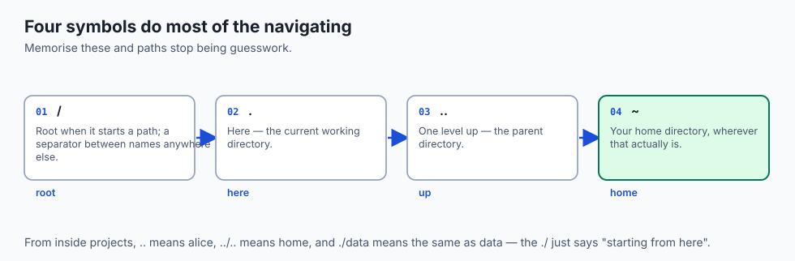
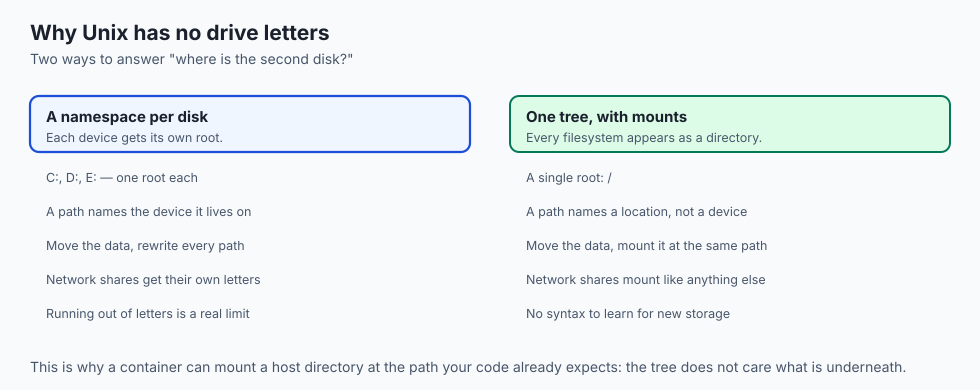
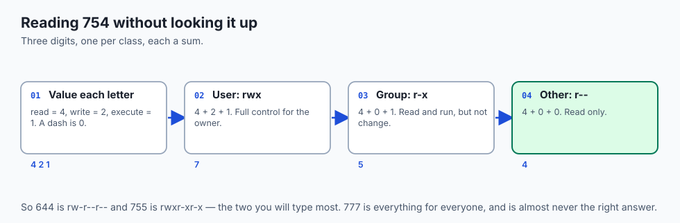
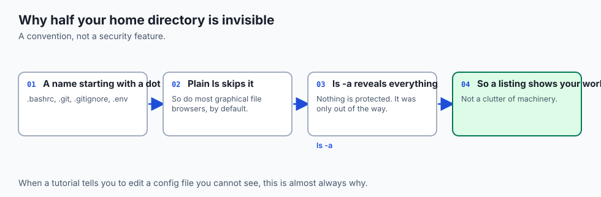
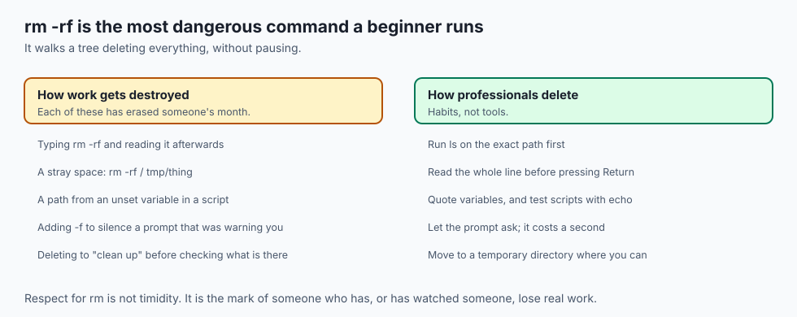
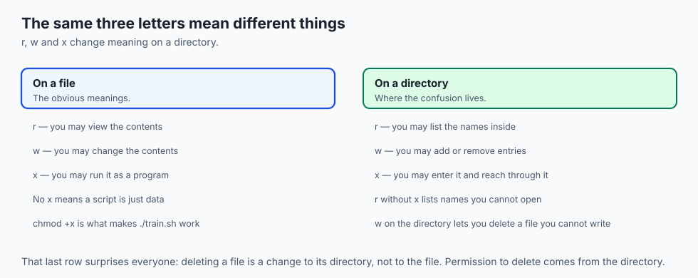
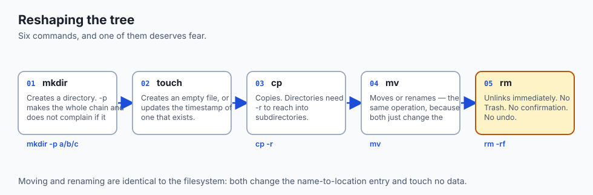

## Why this matters

- **Every dataset, model checkpoint and config file you touch lives at a path**, and
  wrong paths are the most common cause of a failed run.
- **`Permission denied` is a permissions problem**, and today you learn to read and
  fix it rather than reaching blindly for `sudo`.
- **`chmod +x` is why your script runs.** Without it, a perfectly good script is
  inert data.
- **Remote machines have nothing but paths.** No file browser, no dragging, no
  double-clicking.
- **`rm -rf` will be the most dangerous thing you type this week.** Today you learn
  why, before you learn it the other way.

---

## The idea in plain language



- **The filesystem is one tree**, with a single root written `/`. Everything hangs
  beneath it, including other disks.
- **A path is a route through that tree**, and every file has exactly one place in it.
- **An absolute path starts at the root** and works from anywhere.
- **A relative path starts where you are standing**, which is why "it worked on my
  machine" so often means "I ran it from a different directory".
- **Permissions decide who may read, change and run each thing.** They are three
  letters, repeated three times, and they explain almost every access error you will
  meet.

---

## Historical background



- **Unix chose one tree, deliberately.** Other systems of the era gave each disk its
  own separate namespace; Unix mounted everything into a single hierarchy.
- **That is why Unix has no drive letters.** A second disk appears as a directory
  somewhere in the tree, not as `D:`.
- **The top-level layout is a convention with a standard.** `/bin` for programs,
  `/etc` for configuration, `/home` for users, `/usr` for the bulk of the system —
  codified as the Filesystem Hierarchy Standard.
- **macOS keeps the same shape with different names**, notably `/Users` rather than
  `/home`, because it descends from BSD by way of NeXT.
- **Permissions arrived with multi-user machines** in the 1970s, and the nine bits
  you will read today have not changed since.

---

## What it is — and what it is not


- **Read from the top.** The root branches into `bin`, `etc`, `home` and `usr`.
  Inside `home` are the users; alice's directory is what `~` expands to.
- **Two routes reach one file.** `/home/alice/projects/data/notes.txt` is absolute
  and valid from anywhere. `data/notes.txt` is relative and only means something when
  you are standing in `projects`.
- **Same file, two names.** That is the entire distinction.

**It is not:**

- **Not a metaphor for the disk.** The tree is an invention; the disk is numbered
  blocks, as Day 5 showed.
- **Not a security boundary by itself.** Hidden files are hidden by convention;
  permissions are the actual mechanism.
- **Not the same as the graphical file browser.** The browser hides things, renames
  things and invents folders that do not exist on disk.

---

## Why it was created and what problems it solves

- **Naming.** Billions of numbered blocks are unusable. Names, nested, are how
  humans find anything.
- **One namespace.** Every file has one path, so a path can be written down, shared,
  scripted and depended on.
- **Ownership.** Multi-user machines needed to know whose file this is, which is
  what the owner field records.
- **Access control.** Not everyone should read the payroll, and not everyone should
  edit the system configuration.
- **Extensibility.** Mounting lets a new disk, a network share or a virtual
  filesystem appear as a directory, with no new syntax to learn.

---

## How it works

### Absolute and relative


- **An absolute path begins with `/`.** It is unambiguous from any working directory.
- **A relative path does not.** It is interpreted from wherever you currently are.
- **Use absolute paths in scripts and configuration**, where you cannot know the
  working directory.
- **Use relative paths interactively**, where you can see where you are standing.
- **`~` expands to your home directory** before the program runs — the shell does it,
  not the program.

### Where you are, and moving

| Command | What it does |
| --- | --- |
| `pwd` | Print the absolute path of where you are |
| `cd DIR` | Move to `DIR`, absolute or relative |
| `cd ..` | Move up to the parent |
| `cd ~` or `cd` | Return home |
| `cd -` | Return to the previous directory |
| `ls` | List names |
| `ls -l` | Long listing: permissions, owner, size, date |
| `ls -a` | Include hidden entries |
| `ls -lh` | Long listing with readable sizes (`4.0K`, `2.3M`) |

- **Flags combine.** `ls -la` is `ls -l -a` merged.
- **`ls -la` will be your most-typed command this course.** Make it a reflex.
- **`pwd` is your anchor** whenever you feel lost, and you will.

### Permissions: who may do what




- **Every file records an owner, a group, and nine permission bits.**
- **Read the string left to right.** In `-rwxr-xr--`, the leading `-` says ordinary
  file (`d` would say directory).
- **`rwx`** — the user (owner): read, write, execute.
- **`r-x`** — the group: read and execute, not write. A dash means absent.
- **`r--`** — other: read only.

The same bits have a numeric spelling you will see constantly:

- **Within each group of three**, read is 4, write is 2, execute is 1. Add up what
  is present.
- **`rwx` = 7, `r-x` = 5, `r--` = 4**, so `-rwxr-xr--` is **754**.
- **`chmod 754 script.sh`** sets exactly those bits.
- **`chmod +x script.sh`** adds execute for everyone; `chmod u+w notes.txt` adds
  write for the owner; `chmod go-r secret.txt` removes read for group and other.
- **`chown alice notes.txt`** reassigns the owner, and usually needs `sudo` —
  handing your file to another user is a system-level act, while changing
  permissions on files you already own is not.
- **This is what "make the script executable" means.** A freshly written `train.sh`
  is data until `chmod +x` turns on the execute bit.

---

## An everyday analogy

An office building.

| The building | The filesystem |
| --- | --- |
| The street address | An absolute path |
| "Two doors down" | A relative path |
| The lobby | `/` |
| Your desk | Your home directory |
| Whose desk it is | The owner |
| Your department | The group |
| The door lock | The permission bits |
| The service corridor | Hidden dotfiles |

- **An absolute address works from anywhere in the city.** "Two doors down" only
  works if someone knows where you are standing.
- **You may be allowed into a room but not to move its furniture.** That is read
  without write.
- **You may be allowed to walk through a corridor without reading the door signs.**
  That is execute without read on a directory.

---

## Examples in practice



- **`No such file or directory`** on a path that plainly exists: you are in a
  different working directory than you assumed. Run `pwd`.
- **`Permission denied` running a script you just wrote**: the execute bit is off.
  `chmod +x` it.
- **A `.env` file a tutorial says to edit and you cannot see**: `ls -a`.
- **`cp` on a directory failing**: it needs `-r`.
- **A path with a space breaking a command**: quote it, or the shell splits it into
  two arguments.

---

## Implications: security, privacy, performance, scalability, and cost



- **Security: permissions are the real mechanism, hidden files are not.** A dot
  prefix protects nothing from anyone who types `ls -a`.
- **`chmod 777` is not a fix.** It is world-writable, and it is how a shared machine
  becomes someone else's. If a permission problem needs 777, the problem is
  ownership, not permissions.
- **Privacy: `~/.ssh` and `~/.aws` hold credentials**, and their permissions matter
  enough that SSH refuses to work if they are too open.
- **Performance: deep trees of tiny files are slow**, because each one costs a
  syscall — the Day 6 boundary again.
- **Cost: the expensive mistake is deletion, not storage.** Storage is cheap;
  regenerating a dataset is not.

---

## Alternatives: free, open source, and commercial

| Tool | Type | What it adds |
| --- | --- | --- |
| `ls`, `cd`, `pwd` | Free, built in | Everything in this lesson |
| `tree` | Free, open source | The hierarchy drawn as a tree |
| `eza` / `exa` | Free, open source | `ls` with colour, icons and git status |
| `fd` | Free, open source | A friendlier, faster `find` |
| `ranger`, `nnn` | Free, open source | A file browser inside the terminal |
| Finder / Explorer | Bundled | Genuinely better for visual browsing |

- **Learn the built-ins first.** They exist on every server you will ever connect
  to; the nicer tools do not.

---

## Comparison with related concepts



| Term | What it actually is |
| --- | --- |
| **Path** | A route through the tree to one file |
| **Directory** | A file whose contents are a list of names and locations |
| **Folder** | The graphical interface's word for a directory |
| **Mount point** | A directory where another filesystem is attached |
| **Symlink** | A file whose contents are another path |
| **Inode** | The record holding a file's metadata and block locations |

---

## When to use it — and when not to



- **Use absolute paths anywhere the working directory is not guaranteed** — scripts,
  cron jobs, configuration files, container definitions.
- **Use relative paths inside a project**, so the project can be moved or cloned
  anywhere and still work.
- **Use `chmod` to grant the least that works**, not the most that is convenient.
- **Do not use the filesystem as a database.** A directory with a million files is a
  performance problem and a backup problem.
- **Do not fix permission errors with `sudo` reflexively.** Read the error, check
  ownership, and understand why before escalating.

---

## The AI connection

- **Dataset paths in a config file are absolute for a reason**: the training job may
  start from a working directory nobody predicted.
- **Checkpoint directories need write permission**, and a run that trains for six
  hours and then cannot save is a specific kind of painful.
- **Containers mount host directories**, and a permission mismatch between the user
  inside and the user outside is one of the most common container failures.
- **`~/.cache/huggingface` is a dotfile directory** that will quietly grow to tens of
  gigabytes. Knowing `ls -a` and `du -sh` is how you find it.
- **A million small training files is a filesystem problem** before it is a model
  problem.

---

## Knowledge check

```yaml
quiz:
  question: "You can list the names inside a directory but every attempt to open a file in it fails, even files you own. Which permission is missing?"
  options:
    - "Execute on the directory, which is what grants the right to reach through it"
    - "Read on the directory, which is what grants the right to see inside it"
    - "Write on the files, which is what grants the right to open them"
    - "Execute on the files, which is what grants the right to read them"
  answer_index: 0
  explanation: "On a directory, read lets you list the names and execute lets you traverse into it. Read without execute is exactly the state where you can see what is there and reach none of it."
```

---

## Hands-on exercise

Build a small tree, walk it both ways, and set its permissions. Worked through
fully in the Day 9 lab directory.

| What you are doing | Command |
| --- | --- |
| Find out where you are | `pwd` |
| Build a nested tree in one step | `mkdir -p lab/data/raw` |
| Create a file | `touch lab/data/raw/notes.txt` |
| Reach it two ways | `ls /full/path/...` then `cd lab/data` and `ls raw` |
| See the permission bits | `ls -l lab/data/raw/notes.txt` |
| Make a script runnable | `chmod +x run.sh` then `./run.sh` |
| Reveal what was hidden | `ls -a ~` |

### Expected output

```text
/Users/you/lab/data
-rw-r--r--  1 you  staff  0 Aug 30 10:14 notes.txt
-rwxr-xr-x  1 you  staff  31 Aug 30 10:15 run.sh
```

- **`-rw-r--r--` is 644** — owner reads and writes, everyone else reads.
- **`-rwxr-xr-x` is 755**, and the `x` is what `./run.sh` needed.

### Validate your work

- [ ] You reached the same file by an absolute and a relative path
- [ ] You can state your current directory without guessing
- [ ] You read a permission string and converted it to octal by hand
- [ ] You made a script executable and ran it with `./`
- [ ] You found at least three dotfiles in your home directory
- [ ] `bash tests/run_tests.sh` reports 0 failures

### Troubleshooting

- **`./run.sh: Permission denied`.** The execute bit is off. `chmod +x run.sh`.
- **`run.sh: command not found` when the file is right there.** The current
  directory is not on PATH, by design. Use `./run.sh`.
- **`mkdir: File exists`.** Use `-p`, which succeeds quietly when the directory is
  already there.
- **A path with spaces splits into two arguments.** Quote it: `"My Folder/file.txt"`.

### Common mistakes

- **Assuming the working directory.** Run `pwd` before blaming the path.
- **Reaching for `chmod 777`.** It is almost never the right answer and always a
  security hole.
- **Using `rm -rf` before `ls`.** Look at what you are about to destroy.
- **Forgetting `-r` on `cp`** and wondering why the directory did not copy.

---

## Practice assignment

- **Build a five-level nested tree** with one command, then navigate to the bottom
  using only relative paths, and back to the top using only `..`.
- **Set four different permission combinations** on four files, predict each octal
  value before running `ls -l`, and check yourself.
- **Find every dotfile in your home directory** and identify what created three of
  them.
- **Create a directory you can list but not enter**, then explain the error you get.
- **Measure a directory's size** with `du -sh` and find the largest thing in it.

---

## Extension challenge

- **Find your ten largest files** with `du` and `sort`, and reclaim some space
  deliberately rather than by guessing.
- **Break a symlink on purpose.** Create one, delete its target, and observe what
  `ls -l` reports. Explain why the link survives its target.
- **Reproduce the container permission problem.** Create a file as one user, then
  try to modify it with a different user id — this is exactly the mismatch that
  breaks mounted volumes.
- **Read `man chmod` on the sticky bit**, then explain why `/tmp` is world-writable
  and still safe.

---

