## Why this matters

- **Training logs are text**, and finding the one line that explains a failed run is
  a `grep` away.

- **Datasets arrive as CSV and JSONL**, and you will inspect them before you load
  them, every time.

- **A pipeline answers questions faster than writing a script**, and often faster
  than opening the file.

- **These tools handle files larger than your RAM**, because they stream rather than
  load.

- **Eight commands, combined, replace most of what you would otherwise write code
  for.** Today is the highest ratio of leverage to effort in the whole week.

---

## The idea in plain language

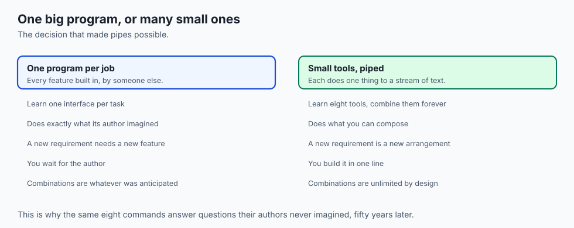

- **Text is the universal interface.** Every tool reads it and writes it, so every
  tool connects to every other.

- **Each tool does one thing.** `grep` selects lines. `sort` orders them. `wc`
  counts them. None of them tries to do the others' jobs.

- **A pipe joins them.** The `|` sends one program's output straight into the next
  program's input.

- **You compose the answer** rather than looking for a program that already has it.
- **That is the whole idea**, and it has outlasted every graphical tool built since.

---

## Historical background

- **Pipes arrived in Unix in 1973**, proposed by Doug McIlroy and implemented by Ken
  Thompson in a single evening.

- **They changed how the tools were written.** Before pipes, programs wrote to files;
  after, they wrote to a stream someone else might be reading.

- **McIlroy's summary became the Unix philosophy**: write programs that do one thing
  well, and write them to work together, because text streams are a universal
  interface.

- **`grep` is named after an editor command**, `g/re/p` — globally search a regular
  expression and print.

- **`sed` and `awk` followed**, and `awk`'s authors' initials gave it its name.
- **None of this has changed.** The commands you type today would run unmodified on
  a machine from 1980.

---

## What it is — and what it is not


- **Every program gets three channels** when it starts: standard input (fd 0),
  standard output (fd 1), and standard error (fd 2).

- **By default input is your keyboard** and both outputs are your screen, which is
  why everything appears mixed together.

- **The shell can rewire these before the program starts.** That is the whole trick,
  and the program never knows.

**It is not:**

- **Not a programming language.** There are no variables here yet; that is Day 12.
- **Not limited to small files.** A pipeline streams, so it can process more data
  than you have memory or disk for.

- **Not a replacement for pandas or a database.** It is what you use before you
  decide you need one.

---

## Why it was created and what problems it solves

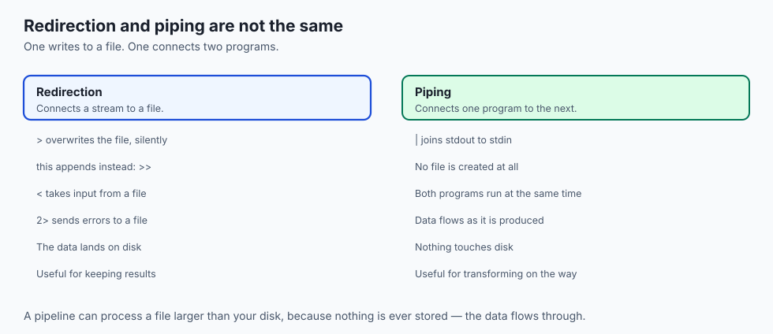

| Operator | What it does | Example |
| --- | --- | --- |
| `\|` | stdout of the left into stdin of the right | `cat log \| grep 404` |
| `>` | Redirect stdout to a file, overwriting | `grep 404 log > errors.txt` |
| `>>` | Redirect stdout to a file, appending | `grep 500 log >> errors.txt` |
| `<` | Take stdin from a file | `wc -l < log` |
| `2>` | Redirect stderr to a file | `sort huge 2> problems.txt` |
| `2>&1` | Send stderr wherever stdout is going | `./run 2>&1 \| less` |

- **`>` overwrites without asking.** `>>` is the one that appends, and confusing them
  destroys files.

- **Both programs in a pipe run simultaneously**, which is why `tail -f | grep` shows
  matches as they arrive.

---

## How it works

### Viewing text

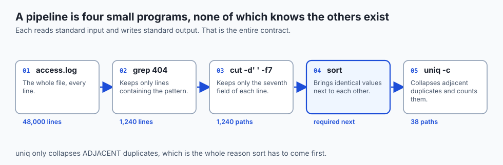

- **`cat`** dumps a file to standard output — good for short files and for feeding a
  pipe.

- **`head`** prints the first lines (10 by default; `head -n 3` for three).
- **`tail`** prints the last lines, and **`tail -f`** follows a growing file live —
  invaluable for watching a training log.

- **`less`** opens a scrollable pager: search with `/`, quit with `q`.
- **The rule of thumb**: `cat` to dump or pipe, `head`/`tail` to peek at the ends,
  `less` to actually read.

### Searching with `grep`

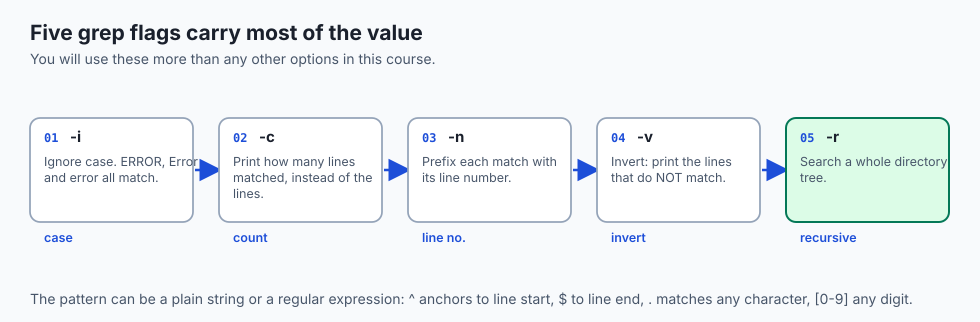

- **`grep PATTERN file`** prints every line containing the pattern.
- **`grep '^Error' log`** finds lines that *begin* with Error.
- **`grep -c '404' access.log`** counts how many lines mention 404.
- **Regular expressions are a deep topic** — Day 38 covers them properly. Today you
  need only the anchors and the character classes.

### Transforming

- **`sed 's/old/new/'`** replaces the first occurrence per line; the trailing `g` in
  `s/old/new/g` replaces every occurrence.

- **`sed` prints a transformed stream** and leaves your file untouched.
- **`cut -d',' -f1`** takes the first comma-separated field — made for CSV.
- **`sort`** orders lines; `-n` sorts numerically, `-r` reverses, `-u` removes
  duplicates in one step.

- **`uniq`** collapses *adjacent* identical lines; `uniq -c` prefixes each with a
  count.

- **`wc -l`** counts lines, `-w` words, `-c` bytes.

### Building a pipeline

The question: *which client addresses hit our server most often?*

```text
cat access.log
cat access.log | cut -d' ' -f1
cat access.log | cut -d' ' -f1 | sort
cat access.log | cut -d' ' -f1 | sort | uniq -c
cat access.log | cut -d' ' -f1 | sort | uniq -c | sort -rn | head -n 5
```


- **Each stage does exactly one job.**
- **You can inspect the stream after any stage** by not typing the rest of the line.
- **That habit is how professionals write these correctly the first time.**

---

## An everyday analogy

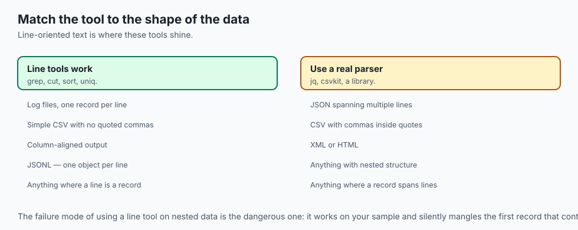

A factory conveyor belt.

| The factory | The pipeline |
| --- | --- |
| Raw material at one end | The input file |
| A station that sorts | `grep` |
| A station that trims | `cut` |
| A station that groups | `sort` |
| A station that tallies | `uniq -c` |
| The finished product | Your answer |
| The reject chute | stderr |

- **No station knows what the others do.** Each takes what arrives, does its one job,
  and passes it on.

- **Adding a step means adding a station**, not rebuilding the factory.
- **The reject chute is separate from the belt** — which is exactly why error
  messages do not end up in your results.

---

## Examples in practice

- **`grep -c ERROR train.log`** — how many failures, in one second, on a file too big
  to open.

- **`tail -f train.log | grep loss`** — watch only the loss lines as training runs.
- **`cut -d',' -f3 data.csv | sort -u | wc -l`** — how many distinct values does
  column three have?

- **`grep -v '^#' config.yml`** — the config without its comments.
- **`wc -l *.jsonl`** — how many examples in each dataset file, and a total.

---

## Implications: security, privacy, performance, scalability, and cost

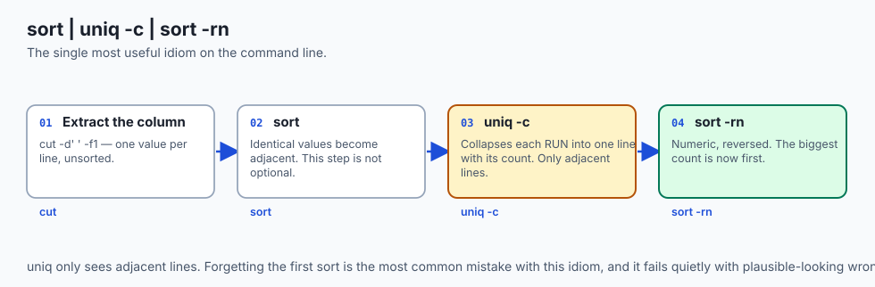

- **Security: `>` destroys silently.** There is no prompt and no undo. `>>` appends;
  learn the difference before you need it.

- **Privacy: grepping a log for a token puts the token in your shell history.** So
  does a password on a command line.

- **Performance: pipelines stream**, so memory use stays flat regardless of file
  size. A 200 GB log processes fine on a laptop.

- **`sort` is the exception** — it must hold data to order it, and will spill to disk
  on large inputs.

- **Cost: this is the cheapest analysis you will ever run.** No cluster, no notebook,
  no data loaded twice.

---

## Alternatives: free, open source, and commercial

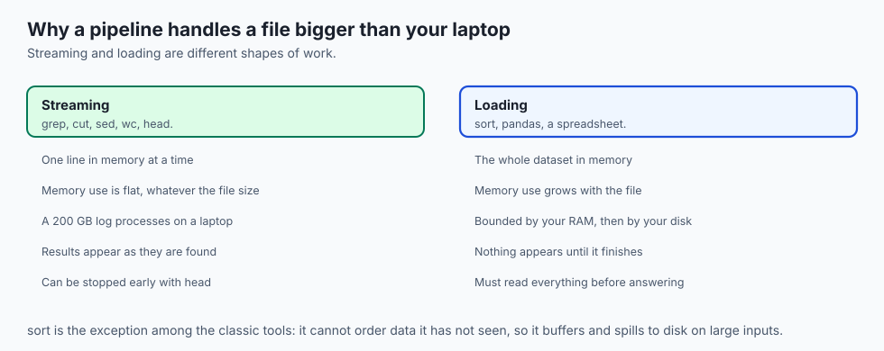

| Tool | Type | When to reach for it |
| --- | --- | --- |
| `grep`, `sed`, `awk` | Free, built in | Everywhere. Always available. |
| `ripgrep` (`rg`) | Free, open source | Much faster recursive search; respects `.gitignore` |
| `jq` | Free, open source | JSON, where line-based tools break down |
| `csvkit`, `miller` | Free, open source | CSV with quoting and headers done properly |
| `awk` | Free, built in | When a pipeline needs arithmetic or per-line state |
| pandas | Free, open source | When the question needs joins, or you need the result in Python |

- **Reach for `jq` the moment your data is JSON.** `grep` on JSON works until a field
  contains a newline, and then it silently does not.

- **Reach for pandas when you need the answer inside a program**, not on a screen.

---

## Comparison with related concepts

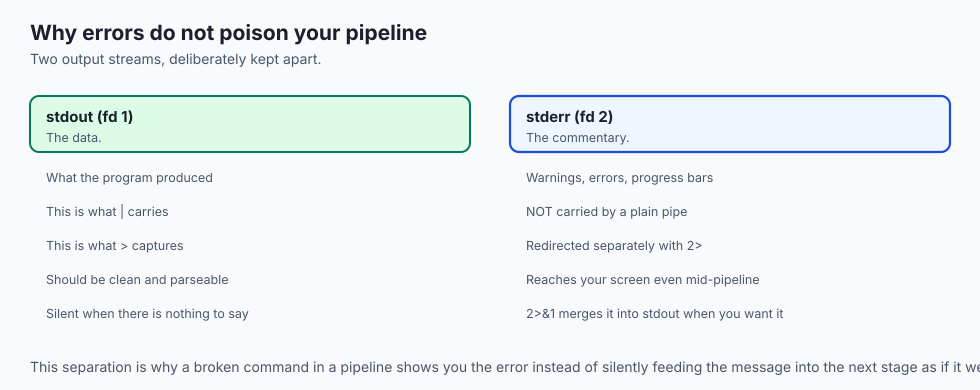

| Term | What it actually is |
| --- | --- |
| **Pipe** | An in-memory channel joining two running programs |
| **Redirect** | A connection between a stream and a file |
| **Filter** | A program that reads stdin and writes stdout |
| **Stream** | Data that flows, rather than data that is loaded |
| **Regular expression** | A pattern language for describing text |

---

## When to use it — and when not to

- **Use a pipeline when the question is about lines**: how many, which ones, what is
  most common.

- **Use it when the file is too big to open**, or when you are on a server with
  nothing else installed.

- **Use it to explore before committing to code.** Five minutes of pipelines often
  removes the need for the script entirely.

- **Do not use `grep` on JSON or XML.** Structure that spans lines defeats
  line-based tools; use `jq` instead.

- **Do not build a twelve-stage pipeline you cannot read.** At that point it is a
  script, and it should live in a file with a name.

- **Do not parse CSV with `cut` if the fields are quoted.** A comma inside quotes
  will break it, quietly.

---

## The AI connection

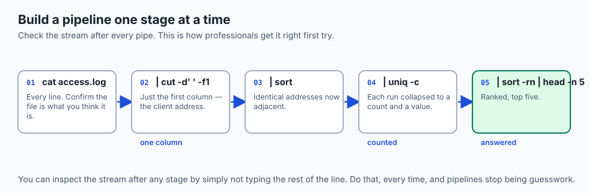

- **Dataset inspection starts here.** How many lines, how many distinct labels, are
  there duplicates — all answered before you write any Python.

- **Class imbalance is a one-liner**: `cut -f2 labels.tsv | sort | uniq -c | sort -rn`.
- **Training logs are grepped, not read.** Nobody scrolls 400,000 lines looking for
  the epoch where loss diverged.

- **Deduplicating training data** is `sort -u`, and it matters more than most people
  expect — duplicates inflate your metrics.

- **Every remote GPU box has these tools** and possibly nothing else. This is the
  toolkit that is always there.

---

## Knowledge check

```yaml
quiz:
  question: "A pipeline counting distinct values reports far more entries than expected, each with a count of 1. What was most likely omitted?"
  options:
    - "The sort before uniq, since uniq only collapses lines that are already adjacent"
    - "The -c flag on uniq, which is what produces the counts"
    - "The -n flag on sort, which is needed for numeric ordering"
    - "The cut stage, so whole lines are being compared rather than one field"
  answer_index: 0
  explanation: "uniq compares only neighbouring lines. Without sorting first, identical values scattered through the file never meet, so each is reported separately with a count of one — a wrong answer that looks entirely plausible."
```

---

## Hands-on exercise

Answer a real question by growing a pipeline. Worked through fully in the Day 10
lab directory.

| What you are doing | Command |
| --- | --- |
| Look at the shape of the data | `head -n 3 access.log` |
| Count the lines | `wc -l access.log` |
| Find the failures | `grep -c ' 404 ' access.log` |
| Extract one column | `cut -d' ' -f1 access.log \| head` |
| Tally and rank | `cut -d' ' -f1 access.log \| sort \| uniq -c \| sort -rn \| head -n 5` |
| Keep the result | `... > top-clients.txt` |

### Expected output

```text
    2000 access.log
     143
     412 10.0.0.14
     198 10.0.0.7
      95 192.168.1.10
```

- **143 lines mention 404**, from 2,000 total.
- **10.0.0.14 made 412 requests**, more than twice the runner-up.

### Validate your work

- [ ] You built the pipeline one stage at a time, checking output at each `|`
- [ ] You can explain why `sort` must come before `uniq`
- [ ] You used `-v` to find the lines that did *not* match
- [ ] You redirected a result to a file and confirmed it with `wc -l`
- [ ] You caused an error mid-pipeline and saw it appear on screen rather than in
      the data

- [ ] `bash tests/run_tests.sh` reports 0 failures

### Troubleshooting

- **`uniq` reports everything once.** You forgot to `sort` first.
- **`cut` returns the whole line.** The delimiter is wrong. `-d' '` for spaces,
  `-d','` for commas, and tab needs `$'\t'`.

- **`grep` finds nothing you can see.** Case. Add `-i`.
- **Your file is empty after redirecting.** You used `>` where you meant `>>`, or
  redirected into the same file you were reading.

### Common mistakes

- **`cat file | grep x`** where `grep x file` would do. Harmless, but the pipe is
  doing nothing.

- **Reading `>` as "append".** It overwrites.
- **Parsing quoted CSV with `cut`.** It splits on every comma, including the ones
  inside quotes.

- **Building the whole pipeline before testing any of it.**

---

## Practice assignment

- **Take any log file on your machine** and answer three questions about it using
  only pipelines: how many lines, which value is most common, and how many are
  distinct.

- **Rewrite one pipeline three ways** and time each with `time`. Note which stage
  dominates.

- **Deliberately omit the `sort`** before `uniq -c` and record how wrong the answer
  is. This is the mistake worth making once, on purpose.

- **Separate the streams**: run a command that produces both output and errors, and
  send each to a different file.

---

## Extension challenge

- **Process a file larger than your RAM.** Generate one with `seq`, then answer a
  question about it with a pipeline. Watch memory use stay flat.

- **Find where `sort` stops streaming.** Increase the input size until `sort` spills
  to disk, and explain why it must, when `grep` never does.

- **Rewrite one pipeline in `awk`**, as a single program, and decide which version
  you would rather read in six months.

- **Compare `grep -r` with `rg`** on a large repository. The ratio is worth knowing
  before you next search a codebase.

---

