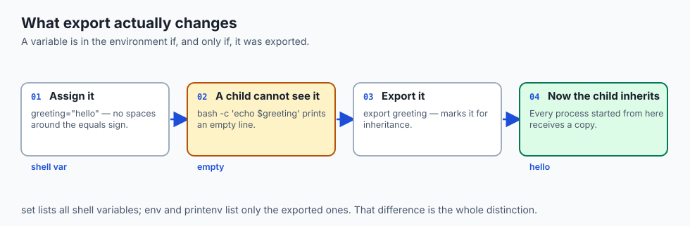
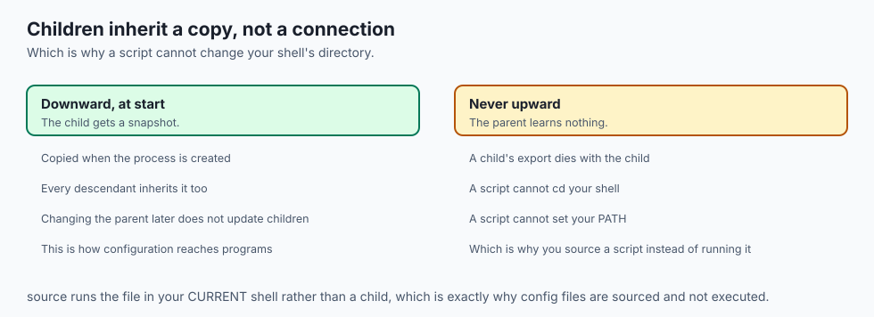
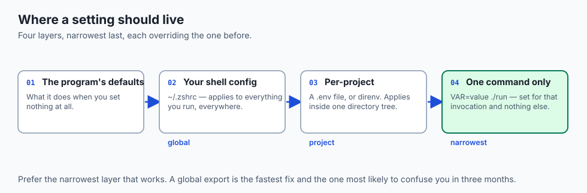
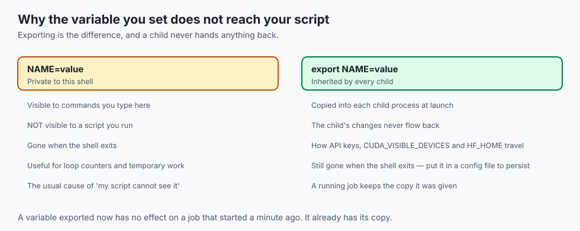
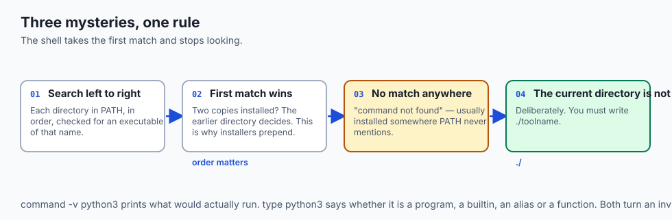
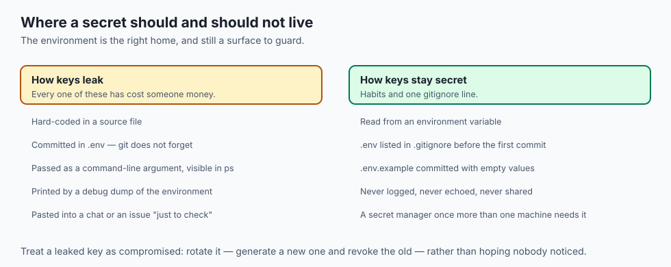
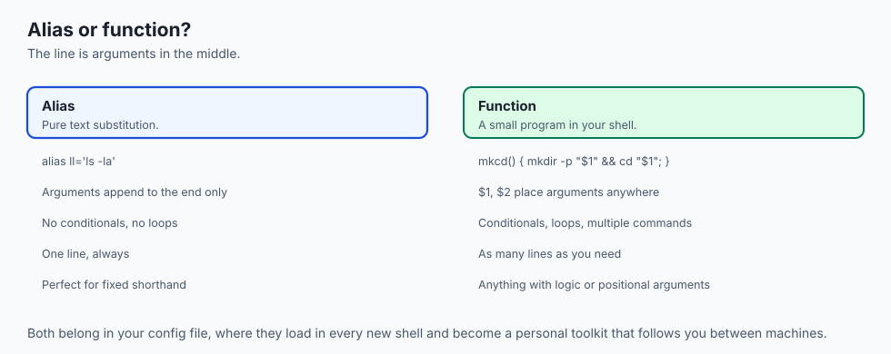
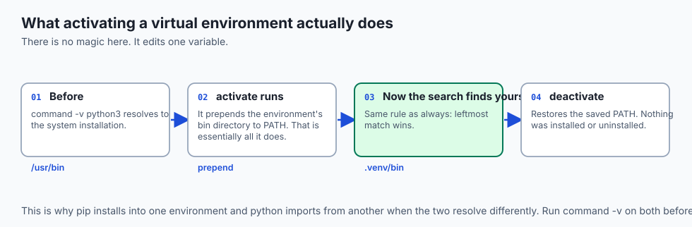
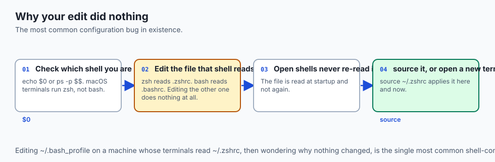

## Why this matters

- **Every API key you will ever use lives in an environment variable.** That is the
  standard, and today is where you learn why.
- **`PATH` decides which Python runs**, and running the wrong one is the single most
  common cause of "the library is installed but the import fails".
- **Configuration-as-environment is how the same code runs** on your laptop, in CI
  and in production without changing a line.
- **Your shell config is where your speed comes from.** Aliases and functions you
  write once follow you to every machine.
- **The most common shell bug in existence** is editing the file your shell does not
  read. You will meet it today, deliberately.

---

## The idea in plain language



- **The environment is a set of name-value pairs** every process receives when it
  starts.
- **A shell variable is private to your shell.** Programs it launches cannot see it.
- **An exported variable is in the environment**, and every child process inherits a
  copy.
- **`export` is the whole difference.** `set` lists all shell variables; `env` lists
  only the exported ones.
- **Assignment takes no spaces**: `greeting="hello"`, never `greeting = "hello"`.

---

## Historical background

- **The environment arrived with Unix in the 1970s**, as a way to pass settings to a
  program without inventing a command-line flag for each one.
- **The design decision that stuck**: pass a *copy* at process creation, so a program
  can never reach back and alter its parent.
- **`PATH` solved a specific problem** — letting users type `ls` rather than
  `/bin/ls`, while still letting a site put its own tools first.
- **Startup files followed**, so a user's settings survived logging out.
- **The convention became universal.** Twelve-factor app methodology, Docker,
  Kubernetes and every CI system configure through the environment, for the reason
  the original designers chose it: it is the one interface every program already
  understands.

---

## What it is — and what it is not



**It is:**

- A list of strings handed to each process at creation.
- The standard place for configuration that varies by machine.
- Inherited downward, once, as a copy.

**It is not:**

- **Not shared memory.** Changing a variable after a child starts does not reach it.
- **Not a way for a script to change your shell.** A script runs in a child, and
  children cannot alter their parent — which is why config files are *sourced*, not
  executed.
- **Not encrypted.** An environment variable is plain text to anything that can read
  the process.
- **Not a database.** It is small, flat, and read once.

---

## Why it was created and what problems it solves



- **Configuration without recompiling.** The same binary behaves differently by
  environment alone.
- **Machine-specific paths.** Your home directory is not mine, and no program should
  need to know either.
- **Secrets outside source code.** A key in the environment is a key that is not in
  your repository.
- **Consistency across environments.** Development, staging and production run the
  same code with different variables.
- **A universal interface.** Every language can read the environment, so it is the
  one configuration channel that needs no library.

---

## How it works

### PATH and how a command is found


- **`PATH` is one string of directories separated by colons**, like
  `/usr/local/bin:/usr/bin:/bin`.
- **A command with no slash triggers the search.** The shell walks the list left to
  right and runs the **first** executable of that name it finds.
- **It never looks anywhere else**, and it stops at the first match.
- **`command -v python3`** prints the full path it would actually run.
- **`type python3`** says whether the name is a program, a builtin, an alias or a
  function — and where it resolves.

### The variables you will meet everywhere



| Variable | What it holds | Why it matters |
| --- | --- | --- |
| `PATH` | Directories searched for commands | Decides which program, and which version, runs |
| `HOME` | Your home directory | `~` expands to it; tools store settings under it |
| `USER` | Your login name | Scripts and prompts use it |
| `SHELL` | Your *login* shell | Not necessarily the shell running right now |
| `LANG` | Language and encoding | Governs messages, sorting, and byte decoding |
| `EDITOR` | Which editor tools should open | Git launches it for commit messages |
| `PWD` | Current working directory | Updated as you `cd` |

- **`SHELL` names your configured login shell**, not the process reading your
  keystrokes. Type `bash` inside zsh and `SHELL` may still say `/bin/zsh`.
- **`LANG` is not cosmetic.** It governs how bytes become characters — Day 5's
  encoding ideas, surfacing as one variable.

### Configuration files: login versus interactive


- **A shell is a *login* shell** if it is the first of a session — what SSH drops you
  into, or a new macOS Terminal tab.
- **A shell is *interactive*** if it is reading commands you type rather than running
  a script.
- **A shell can be both, one, or neither**, and each combination reads different
  files.

| Shell | Login shell reads | Interactive shell reads |
| --- | --- | --- |
| bash | `/etc/profile`, then the first of `~/.bash_profile`, `~/.bash_login`, `~/.profile` | `~/.bashrc` |
| zsh | `~/.zshenv`, then `~/.zprofile`, then `~/.zshrc` | `~/.zshenv`, then `~/.zshrc` |

- **The bash convention exists because those paths diverge**: put your real settings
  in `~/.bashrc` and add `source ~/.bashrc` to `~/.bash_profile`, so both kinds of
  shell end up identical.
- **On macOS, edit `~/.zshrc`.** A new Terminal tab is an interactive login shell
  running zsh.
- **Put a setting in the file the shell actually reads, or it silently does nothing.**

### Aliases and functions

```bash
alias ll='ls -la'
alias gs='git status'

mkcd() {
  mkdir -p "$1" && cd "$1"
}
```

- **An alias is text substitution.** Typing `ll` runs `ls -la`.
- **A function takes positional arguments.** `mkcd project` makes the directory and
  moves into it, using `$1`.
- **Both belong in your config file**, where they load in every new shell.

---

## An everyday analogy

A new employee's welcome pack.

| The workplace | The environment |
| --- | --- |
| The pack handed over on day one | The environment at process start |
| Your desk location | `HOME` |
| Your name badge | `USER` |
| The list of floors you may search | `PATH` |
| The language the handbook is in | `LANG` |
| A photocopy, not the original | Inheritance by copy |

- **Everyone gets a copy**, so scribbling on yours changes nothing for anyone else.
- **New hires get whatever the pack said on their first day**, not what it says now.
- **You cannot edit your manager's copy** by editing your own — which is exactly why
  a script cannot change your shell.

---

## Examples in practice



- **`pip install` succeeds and `import` fails**: `pip` and `python3` resolve to
  different installations. `command -v` both, and compare.
- **A tool works in one terminal and not another**: one is a login shell, the other
  is not, and only one read the file you edited.
- **`OPENAI_API_KEY` in `.env`, loaded at start**: the standard pattern, and safe
  only if `.env` is in `.gitignore`.
- **A cron job that cannot find a command**: cron runs with a minimal environment and
  a short `PATH`. Use absolute paths there.
- **A container that behaves differently from your laptop**: usually one variable,
  usually `PATH` or `LANG`.

---

## Implications: security, privacy, performance, scalability, and cost

- **Security: the environment is the right home for secrets, and still a surface.**
  A key there is not in your code — but it is readable by the process and every
  child, and captured by anything that logs the environment for debugging.
- **Prefer the environment to the command line.** Arguments are visible in `ps` to
  every user on the machine.
- **Privacy: `printenv` reveals your username, home path, locale and toolchain.**
  Redact before pasting it into a bug report.
- **Performance: a long `PATH` slows every lookup**, and a network-mounted directory
  on `PATH` slows it badly. Shells cache resolved locations, which is why a
  freshly installed tool sometimes needs `hash -r` or a new shell.
- **Scalability: this is why deployment platforms configure through variables.** It
  reaches from one laptop to thousands of servers without touching code.
- **Cost: a committed key can become a stolen key and a real bill.** The few minutes
  spent here pay for themselves the first time.

---

## Alternatives: free, open source, and commercial



| Approach | Type | When it fits |
| --- | --- | --- |
| Plain `export` in your config | Free, built in | Personal settings on your own machine |
| `.env` plus `direnv` | Free, open source | Per-project variables, loaded on `cd` |
| `python-dotenv` | Free, open source | Loading `.env` from inside a Python program |
| `pass`, `gopass` | Free, open source | Personal secrets, encrypted at rest |
| 1Password / Vault / cloud secret managers | Commercial or free tier | Teams, rotation, audit trails |
| Platform environment settings | Included | Production, where the platform injects them |

- **`direnv` is the biggest single upgrade here.** It loads and unloads variables as
  you enter and leave a directory, which stops per-project settings leaking into
  every other project.

---

## Comparison with related concepts

| Term | What it actually is |
| --- | --- |
| **Shell variable** | Private to the current shell |
| **Environment variable** | Exported, and inherited by children |
| **Alias** | A name that expands to text before execution |
| **Function** | A small program defined inside the shell |
| **Builtin** | A command the shell implements itself, with no file |
| **Config file** | A script the shell runs at startup |

---

## When to use it — and when not to



- **Use environment variables for anything that differs between machines** — paths,
  hostnames, credentials, feature switches.
- **Use them for every secret.** Never in source, never in a committed file.
- **Use a function rather than an alias** the moment you need an argument anywhere
  but the end.
- **Do not use the environment for structured data.** It holds flat strings; JSON in
  a variable is a sign you need a config file.
- **Do not use it for anything large.** The environment is copied into every child
  process, and there are size limits.
- **Do not scatter exports across five files.** One place, sourced, or you will spend
  an afternoon finding which one wins.

---

## The AI connection





- **Every model provider reads a key from the environment.** `OPENAI_API_KEY`,
  `ANTHROPIC_API_KEY`, `HF_TOKEN` — the same pattern each time.
- **`CUDA_VISIBLE_DEVICES` decides which GPUs your job can see**, and is how you
  share a multi-GPU machine without arguing.
- **`HF_HOME` and `TRANSFORMERS_CACHE`** decide where tens of gigabytes of downloaded
  weights land. Set them before you fill your home partition, not after.
- **Virtual environments work by editing `PATH`.** Activating one prepends its `bin`
  directory, so its `python` wins the search. That is the entire mechanism.
- **Reproducibility is an environment problem** far more often than a code problem.

---

## Knowledge check

```yaml
quiz:
  question: "A script ends with a line that changes directory and exports a variable, but after running it your shell is unchanged in both respects. Why?"
  options:
    - "The script ran in a child process, and a child cannot alter its parent's state"
    - "The script lacked execute permission, so its final lines never ran"
    - "Exported variables require a new login session before they take effect"
    - "The script's changes were applied but the shell caches the old values"
  answer_index: 0
  explanation: "Running a script creates a child process that inherits a copy of the environment. Nothing it does travels back up. Sourcing the file instead runs it in the current shell, which is why config files are sourced."
```

---

## Hands-on exercise

Prove inheritance, then fix a `PATH` problem you created. Worked through fully in
the Day 11 lab directory.

| What you are doing | Command |
| --- | --- |
| Set a shell variable | `greeting="hello"` |
| Show a child cannot see it | `bash -c 'echo "$greeting"'` |
| Export it and retry | `export greeting` then repeat |
| See only exported ones | `printenv \| head` |
| Find what actually runs | `command -v python3` and `type python3` |
| Add a directory to PATH | `export PATH="$HOME/bin:$PATH"` |
| Make it permanent | Add that line to `~/.zshrc`, then `source ~/.zshrc` |

### Expected output

```text

hello
/usr/bin/python3
python3 is /usr/bin/python3
```

- **The first line is empty** — the child never received the unexported variable.
- **The second prints `hello`** after `export`.
- **Prepending to `PATH`** puts your directory first, so your version wins.

### Validate your work

- [ ] You demonstrated the difference between a shell and an environment variable
- [ ] You can state which config file your shell reads, and why
- [ ] You added a directory to `PATH` and ran a command from it by bare name
- [ ] You wrote one alias and one function, and both survive a new terminal
- [ ] You sourced a config file rather than opening a new window
- [ ] `bash tests/run_tests.sh` reports 0 failures

### Troubleshooting

- **Your edit did nothing.** Wrong file, or an open shell that has not re-read it.
  Check `echo $0`, then `source` the right file.
- **`greeting = "hello"` fails.** No spaces around the equals sign; the shell reads
  it as a command named `greeting`.
- **`PATH` broken and most commands gone.** Open a new terminal. The damage was only
  in that shell.
- **A newly installed command is not found.** `hash -r`, or open a new shell.

### Common mistakes

- **Appending to `PATH` when you meant to prepend**, so the old version keeps
  winning.
- **Committing `.env`.** Add it to `.gitignore` before the first commit, not after —
  git does not forget.
- **Overwriting `PATH` instead of extending it.** Always include `$PATH` in the new
  value.
- **Editing `~/.bash_profile` on a zsh machine.**

---

## Practice assignment

- **Write five aliases and two functions** you would genuinely use, and put them in
  your config file. Live with them for a day and delete the ones you did not touch.
- **Break `PATH` deliberately** in a throwaway shell and recover without closing the
  window.
- **Create a `.env` and a `.env.example`**, add the first to `.gitignore`, and
  confirm with `git status` that only the example is tracked.
- **Find which config files your shell reads** by adding an `echo` to each and
  opening a new terminal.

---

## Extension challenge

- **Install `direnv`** and set up a project directory whose variables load on entry
  and unload on exit. Explain why this is safer than global exports.
- **Trace a virtual environment's mechanism.** Print `PATH` before and after
  activating one, and identify exactly what changed.
- **Write a function that switches between two API keys** and prints which is active,
  without ever printing the key itself.
- **Find the environment size limit** on your system and explain why a very large
  variable can make a program fail to start at all.

---

