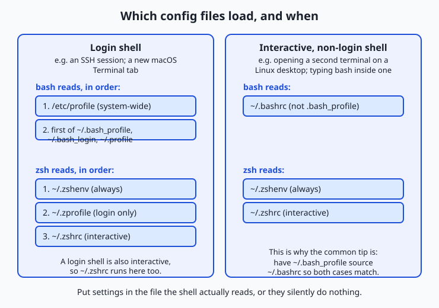

## Why this matters

Sooner or later your work will depend on a value that lives nowhere in your code. You will run a program that talks to a paid service and needs a secret key to prove who you are. You will type `python` and get a version you did not expect, or type a tool's name and be told it does not exist even though you just installed it. You will hand a working project to a colleague and watch it fail on their machine for reasons neither of you can see. Every one of these is a story about the *environment* — the invisible set of named values your shell hands to every program it starts.

Environment variables are how you tell a program something without editing the program: where to find things, who you are, what language to speak in, and — critically — secrets it must never have hard-coded. When you later connect to a service that charges per request, the accepted, safe way to give your code its key is an environment variable such as `ANTHROPIC_API_KEY`, never a line pasted into a file you might share. When you run a project and get "command not found" or the wrong interpreter, the `PATH` variable is deciding which program runs. And when a script works for you but not for a teammate, the difference is almost always something in one person's environment that the other lacks. Reproducibility — the property that the same commands produce the same result on another machine — is, in practice, mostly about controlling the environment.

Today you learn to see this invisible layer clearly: what environment variables are, how the shell uses `PATH` to find commands, which configuration files set all of this up when a terminal opens, and how to keep secrets out of the places they must never go. Master it now and a whole category of baffling failures becomes readable.

## The idea in plain language

A shell — the program that reads the commands you type — keeps a set of named values called **variables**. Each is just a name paired with a piece of text: `HOME` might be `/Users/mira`, `EDITOR` might be `nano`. Some of these values stay private to the shell itself. Others are marked to be *inherited* by every program the shell launches. That marked-for-inheritance set is the **environment**, and its members are **environment variables**.

The distinction is the whole game. When you set a plain **shell variable**, only the current shell can see it; the programs it starts know nothing about it. When you **export** a variable, you promise the shell to copy it into the environment of every command it runs from then on. A program you launch receives a fresh copy of that environment and reads from it whatever it was told to look for. This is how a value set once in your terminal reaches a Python script, a database tool, or a compiler without any of them sharing memory.

One environment variable deserves top billing: **`PATH`**. When you type a bare command name like `git`, the shell does not search your whole disk for it. It looks only in the specific directories listed in `PATH`, in order, and runs the first match. That single rule explains "command not found" (the program is not in any listed directory), why the *wrong* version can run (an earlier directory holds a different copy), and why installing a tool sometimes requires "adding it to your PATH." Finally, because typing the same export commands into every new terminal would be tedious, the shell reads **configuration files** — `.bashrc`, `.zshrc`, and their relatives — automatically when it starts, so your settings are there every time.

## Historical background

The idea of a per-process set of inherited string values is old and remarkably stable. It arrived with the Unix operating system at Bell Labs in the 1970s. The Seventh Edition of Unix, released in 1979, introduced the environment as we still use it, along with the Bourne shell (`sh`), written by Stephen Bourne, whose syntax for setting and exporting variables is the ancestor of what you type today. Before that, programs received only command-line arguments; the environment added a second, quieter channel for passing configuration that every child process would inherit automatically.

The mechanism sits at the boundary between the shell and the operating system. When any Unix program starts another, it does so through a family of system calls in the `exec` family, and those calls accept an array of `NAME=value` strings — the new program's environment. The shell is simply the most visible user of this facility: it maintains your variables and, on each command, hands the exported ones to the operating system to pass along. That design has outlived nearly everything around it.

Shells multiplied over the decades. The Bourne shell was joined by the C shell (`csh`) in the late 1970s, and then by the Bourne-Again Shell — **bash** — written by Brian Fox for the GNU Project, first released in 1989, which became the default interactive shell on most Linux distributions and, for many years, on macOS. The **Z shell** (`zsh`), created by Paul Falstad in 1990, added conveniences and became the default shell on macOS starting with the Catalina release in 2019. The shells differ in features and in which configuration files they read, but the environment itself — names mapped to strings, inherited by children — has not changed in over forty years. Learn it once and it stays learned.

## What it is — and what it is not

An environment variable is a named string, held by a running process, that the operating system copies to any child process that process starts. Every word is load-bearing. *Named string*: the value is always text — the number `8` in an environment variable is the two-character string `"8"`, not an integer; a program must interpret it. *Held by a running process*: the environment belongs to a specific process while it runs, not to the disk and not to your account permanently. *Copied to children*: a child gets its own copy, so changes it makes do not flow back to the parent.

That last point is the source of the most common confusion, so name it plainly. A program can **never** change its parent's environment. When a script sets a variable and exits, your terminal's environment is exactly as it was before. When you edit a configuration file, already-open terminals do not update until you reload the file or open a new one. The environment flows strictly downward, parent to child, and never back up.

| Common misconception | The reality |
| --- | --- |
| "Setting a variable in a script changes my terminal too." | A child process gets a *copy*; its changes vanish when it exits. Nothing flows back to the parent. |
| "`export` creates the variable." | The variable may already exist; `export` only marks it to be *inherited* by future child processes. |
| "Environment variables are stored on disk." | They live in a running process's memory. Files like `.zshrc` merely *re-create* them each time a shell starts. |
| "Editing `.zshrc` updates my open terminals." | Config files are read only when a shell starts. Open shells keep their old environment until reloaded. |
| "`PATH` searches everywhere for a command." | It searches only the listed directories, in order, and runs the first match — nothing else. |

## Why it was created and what problems it solves

The environment solves a specific problem: how does a program learn its context without being rewritten for every machine? Hard-coding answers into the program is brittle — a tool that assumes your username, your home directory, or your preferred editor would need editing for every user. Command-line arguments can carry such details, but they must be passed explicitly on every invocation and threaded by hand through every layer of a program that starts other programs. The environment offers a third way: set a value once, and it is quietly available to the program and to everything it launches, however deep.

This is why the environment holds exactly the kind of information that is *the same across many commands but differs across machines or users*: where your home directory is (`HOME`), who you are (`USER`), which language and formatting to use (`LANG`), which text editor to open when a tool needs one (`EDITOR`), and where to find executable programs (`PATH`). It is also why it became the standard channel for **secrets**. A credential must reach your program but must not live in your source code, where it would be copied, shared, and version-controlled by accident. Placing it in an environment variable keeps it in memory at run time and out of the files you commit — provided you follow the discipline this lesson teaches. The environment, in short, is the machine's answer to "configuration that travels with the process, not the code."

## How it works

Let us build the picture from the shell outward, then watch `PATH` resolve a command.

### Shell variables versus environment variables

Open a shell and assign a variable. In bash and zsh the syntax is a name, an equals sign, and a value, with **no spaces around the equals sign**:

```bash
greeting="hello"
```

Right now `greeting` is a *shell variable*: the current shell can read it as `$greeting`, but it is not in the environment, so programs the shell starts cannot see it. Prove it by starting a child shell — a fresh `bash` process — and asking for the value:

```bash
echo "$greeting"        # prints: hello
bash -c 'echo "$greeting"'   # prints an empty line — the child never received it
```

Now **export** it, which marks it for inheritance, and repeat:

```bash
export greeting
bash -c 'echo "$greeting"'   # prints: hello — the child inherited it
```

You can set and export in one step with `export greeting="hello"`. To see the difference in bulk, `set` (in bash) lists all shell variables, while `env` or `printenv` lists only the exported ones — the actual environment. A variable is in the environment if, and only if, it has been exported.

### PATH and how a command is found

`PATH` is a single string holding a list of directories separated by colons, for example `/usr/local/bin:/usr/bin:/bin`. When you type a command that contains no slash, the shell walks this list left to right, checking each directory for an executable file of that name, and runs the **first** one it finds. It never looks in directories that are not listed, and it stops at the first match.



Three everyday mysteries fall out of this one rule. "Command not found" means no directory in `PATH` contained an executable of that name — often because a tool installed into a directory that was never added to `PATH`. Running the *wrong* version happens when two directories both contain the command and the earlier one wins; this is why `PATH` order matters and why installers often prepend their directory rather than append it. And a command that lives in your current folder but is not on `PATH` will not run as a bare name — you must write `./toolname`, with an explicit path, precisely because the shell does not treat the current directory as part of `PATH`.

You can ask the shell to show its work. `command -v python3` prints the full path it *would* run, or nothing if the command is not found. `type python3` says whether the name is a program on `PATH`, a shell builtin, an alias, or a function, and where it resolves. `which python3` similarly reports the resolved path. These three are your first tools whenever a command misbehaves: they turn an invisible decision into a visible one.

### The important variables

A handful of environment variables appear on nearly every system. Knowing them turns cryptic behavior into obvious behavior.

| Variable | What it holds | Example value | Why it matters |
| --- | --- | --- | --- |
| `PATH` | Colon-separated list of directories searched for commands | `/usr/local/bin:/usr/bin:/bin` | Decides which program (or which version) a bare command name runs |
| `HOME` | The absolute path to your home directory | `/Users/mira` | `~` expands to it; many tools store settings under it |
| `USER` | Your login name | `mira` | Scripts and prompts use it to know who is running |
| `SHELL` | The path to your *login* shell program | `/bin/zsh` | Tells tools which shell you prefer; note it is not always the shell running right now |
| `LANG` | Language and character-encoding preference | `en_US.UTF-8` | Controls message language, sorting, and how text bytes are decoded |
| `EDITOR` | The command to open when a tool needs you to edit text | `nano` | Git and other tools launch it for commit messages and the like |
| `PWD` | Your current working directory | `/Users/mira/projects` | The shell updates it as you `cd`; programs read it to resolve relative paths |

Two subtleties reward attention. `SHELL` names your configured login shell, not necessarily the process reading your keystrokes this second — if you type `bash` inside zsh, `SHELL` may still say `/bin/zsh`. And `LANG` is more than cosmetic: set it to a value the system does not have and some programs emit warnings or sort text unexpectedly, because it governs how bytes are interpreted as characters — the encoding ideas from earlier this week, surfacing as a single variable.

### Configuration files: login versus interactive shells

Typing your exports into every new terminal would be unbearable, so shells read startup files automatically. *Which* files they read depends on two properties of the shell session. A shell is a **login shell** if it is the first shell of a session — the one an SSH connection drops you into, or the one a new macOS Terminal tab starts. A shell is **interactive** if it is reading commands you type, as opposed to running a script non-interactively. A single shell can be both, one, or neither, and each combination reads a different set of files.



For **bash**: a login shell reads the system-wide `/etc/profile`, then the first it finds of `~/.bash_profile`, `~/.bash_login`, or `~/.profile`. A non-login interactive shell — such as a second terminal opened on a Linux desktop — reads `~/.bashrc` instead. Because these two paths diverge, the widespread convention is to put your real settings in `~/.bashrc` and add a line to `~/.bash_profile` that *sources* it (`source ~/.bashrc`), so both kinds of shell end up identical. For **zsh**: `~/.zshenv` is read on every invocation, `~/.zprofile` only for login shells, and `~/.zshrc` for interactive shells. On macOS, where a new Terminal tab is an interactive login shell running zsh, the file you almost always want to edit is `~/.zshrc`.

The practical rule is simple and saves hours: **put a setting in the file the shell actually reads, or it silently does nothing.** The most common configuration bug in existence is editing `~/.bash_profile` on a machine whose terminals read `~/.zshrc`, then wondering why nothing changed. After editing a config file, either open a new terminal or reload it in place with `source ~/.zshrc` (substitute your file), because — as established — open shells do not re-read these files on their own.

### Aliases and functions

Two features let you extend the shell with your own commands, and both belong in your config file so they persist. An **alias** is a short name that expands to a longer command. Defined with `alias name='command'`, it is pure text substitution:

```bash
alias ll='ls -la'
alias gs='git status'
```

After this, typing `ll` runs `ls -la`. Aliases are perfect for fixed shorthand but cannot easily take arguments in the middle of the command. For anything with logic or positional arguments, use a **shell function**:

```bash
mkcd() {
  mkdir -p "$1" && cd "$1"
}
```

Now `mkcd project` makes the directory `project` and moves into it, using `$1` for the first argument. Functions can hold multiple lines, conditionals, and loops (the subject of tomorrow's lesson). Placed in `~/.zshrc` or `~/.bashrc`, aliases and functions load automatically in every new shell, becoming a personal toolkit that follows you.

## An everyday analogy

Picture the shell as a workshop assistant you brief at the start of a shift. In front of the assistant is a private desk covered in sticky notes — the **shell variables**. The assistant can read them freely, but they are personal: no one else in the workshop sees them. Along one wall hangs a shared corkboard, and any note pinned there is photocopied and handed to every helper the assistant hires for a task. Pinning a note to that corkboard is **exporting** a variable; the corkboard is the **environment**. A helper who is handed the photocopies can read every pinned note but knows nothing of the sticky notes left on the desk.

Two facts about the workshop map exactly onto how environments behave. First, each helper gets a *photocopy*, not the original. A helper who scribbles on their copy changes nothing on the corkboard, and when the helper goes home the scribbles are gone — which is why a script can never alter your terminal's environment. Second, the corkboard is set up fresh each shift by an **opening checklist** the assistant follows on arriving: this is the configuration file, `~/.zshrc` or `~/.bashrc`, re-pinning the same standing notes every morning so the board looks the same each day. Edit the checklist and today's already-pinned board does not change; the edit takes effect at the next shift, or when the assistant re-runs the checklist on the spot.

`PATH` is the assistant's ordered list of toolbox drawers. Told to fetch the "wrench," the assistant does not ransack the whole workshop; it opens the listed drawers in order and grabs the first wrench found. Two drawers each holding a wrench? The earlier drawer wins — the reason command order and version surprises happen. A wrench sitting on the bench but in no listed drawer will not be found by name; you must point at it directly (`./wrench`). And the safe-combination note — a **secret** — is pinned to the shared corkboard so the assistant's helpers can open the safe, but it is *never* photocopied into the workshop's public logbook that gets carried out the door. That logbook is your version control, and the discipline of keeping the combination off it is the habit the next section makes non-negotiable.

## Examples in practice

Start with inspection. To read one variable, echo it with a `$` in front of the name; to list the whole environment, use `printenv`:

```bash
echo "$HOME"        # /Users/mira
echo "$PATH"        # /usr/local/bin:/usr/bin:/bin
printenv | sort | head   # the exported environment, alphabetized
```

`PATH` is easier to read one directory per line. Replace each colon with a newline using `tr`:

```bash
echo "$PATH" | tr ':' '\n'
```

Now set, export, and confirm inheritance, all without disturbing your real setup by doing it inside a subshell — a throwaway child shell created with parentheses:

```bash
(
  project_env="staging"          # a shell variable, private to this subshell
  export project_env             # now exported into this subshell's environment
  bash -c 'echo "child sees: $project_env"'   # child sees: staging
)
echo "after subshell: $project_env"   # after subshell: (empty) — nothing leaked out
```

The final line prints nothing because everything inside the parentheses happened in a child that has now exited — a clean demonstration that environments flow downward only. To prepend a directory to `PATH` for the current shell (the standard way to make a newly installed tool findable), put it first so it is searched first, keeping the old value on the end:

```bash
export PATH="$HOME/bin:$PATH"
```

Read that carefully: it sets `PATH` to your personal `bin` directory, a colon, and then whatever `PATH` was before. To make this permanent you would place the same line in `~/.zshrc` or `~/.bashrc`. Finally, resolve a command explicitly to see which file would run and what kind of thing the name is:

```bash
command -v git      # /usr/bin/git   (the file PATH would run)
type ll             # ll is an alias for ls -la   (if you defined it above)
```

### Secrets, dotenv, and direnv

A secret is a value that grants access and must stay private: an API key, a database password, a token. The rule is absolute: **secrets go in environment variables, never in committed code.** For a single session you can export one directly, using an obviously fake placeholder while learning:

```bash
export ANTHROPIC_API_KEY="sk-example-not-a-real-key"
```

Managing many such values by hand is error-prone, so two widely used tools formalize the practice. The **dotenv** pattern keeps them in a file conventionally named `.env`, one `NAME=value` per line, that you load when needed and — this is the essential half — add to `.gitignore` so it is never committed:

```bash
# .env  (this file must be listed in .gitignore)
ANTHROPIC_API_KEY=sk-example-not-a-real-key
DATABASE_URL=postgres://localhost/myapp
```

Many programming libraries can read a `.env` file directly at startup. From the shell you can load one into your current environment with a single line, exporting every entry:

```bash
set -a; source .env; set +a
```

Here `set -a` tells the shell to auto-export every variable it assigns, `source` runs the file's assignments in the current shell, and `set +a` turns the behavior back off. The second tool, **direnv**, goes further: it reads a per-directory `.envrc` file and loads those variables automatically whenever you `cd` into the project, then unloads them when you leave — so each project carries its own environment with no manual sourcing. Both tools exist to make the same safe habit effortless: real secrets present in the environment at run time, absent from every file you commit.

## Implications: security, privacy, performance, scalability, and cost

**Security.** The environment is the correct home for secrets *and* a surface you must guard. A key in an environment variable is not in your code, which is the point — but it is readable by the process and its children, can appear in a process listing on some systems if passed as an argument (which is why the environment, not the command line, is preferred), and will be captured by anything that logs the full environment for debugging. Never print your environment into a log you will share, never paste real `.env` contents into a chat or an issue, and treat a leaked key as compromised — rotate it, meaning generate a new one and revoke the old, rather than hoping no one noticed.

**Privacy.** Your environment quietly reveals your username, home directory path, locale, and often the tools you use. A machine profile or bug report that dumps `printenv` can expose more about you than intended. Share deliberately, redacting anything that names your accounts or reveals a secret.

**Performance.** The environment is small and read at process start, so it has no meaningful runtime cost — but `PATH` does have a subtle one. A very long `PATH`, or one containing slow network-mounted directories, means the shell checks more places before finding each command; keeping `PATH` short and local keeps command lookup instant. Shells also cache the locations of found commands, which is why a freshly installed tool sometimes is not found until you open a new shell or run `hash -r` to clear that cache.

**Scalability.** As projects and machines multiply, environment discipline is what keeps them consistent. Configuration-as-environment lets the identical code run in development, testing, and production by changing only the variables, and lets a team standardize on one set of names. This is why deployment platforms and container systems make "set these environment variables" the primary configuration mechanism: it scales from one laptop to thousands of servers without touching the code.

**Cost.** The direct cost is nil, but the indirect cost of *getting it wrong* is real. A committed secret can lead to a stolen key and a surprise bill from whatever paid service it unlocked; a misconfigured `PATH` that runs the wrong interpreter can waste an afternoon; a non-reproducible environment can make a bug impossible to diagnose. The few minutes spent understanding this layer pay for themselves the first time they save you from any of these.

## Alternatives: free, open source, and commercial

The environment is a built-in mechanism, not a product, so "alternatives" means both the tools that manage it and the other ways to pass configuration into a program.

| Approach or tool | Type | What it offers | Cost |
| --- | --- | --- | --- |
| Plain `export` in a config file | Built in | Zero dependencies; the baseline everyone has | Free |
| dotenv (`.env`) files | Open convention/libraries | Per-project variables in one gitignored file, loadable by shell or libraries | Free |
| direnv | Open source tool | Automatic per-directory loading and unloading of environment on `cd` | Free |
| Command-line arguments / flags | Built in | Explicit per-run configuration, visible in the command itself | Free |
| Config files (JSON, YAML, TOML) | Built in / libraries | Structured, nested settings that outgrow flat strings — but must not hold secrets in a repo | Free |
| Secret managers (e.g. cloud vault services) | Commercial/managed | Central storage, access control, rotation, and auditing for secrets at scale | Free tiers vary; paid at scale |

Choosing among them is a matter of scope. Use a config file for a value you set once and rarely change on a machine. Use a command-line flag for something that differs on every run. Use a `.env` file with direnv for a project's secrets and settings during development. Reach for a managed secret manager when a team or a production system needs central control, rotation, and an audit trail. For a beginner, `export` in `~/.zshrc` for durable personal settings and a gitignored `.env` for project secrets covers almost everything you will meet for a long time.

## Comparison with related concepts

| Concept A | Concept B | Key difference |
| --- | --- | --- |
| Shell variable | Environment variable | A shell variable is private to the current shell; an environment variable has been exported and is inherited by child processes |
| `export VAR` | `VAR=value` | Assignment sets or changes the value; `export` marks the name for inheritance — they are independent steps you can do together or apart |
| `.bashrc` | `.bash_profile` | `.bashrc` loads for interactive non-login shells; `.bash_profile` for login shells — the reason a setting can appear in one situation but not another |
| `PATH` entry | An absolute command path | A `PATH` entry lets you run a command by bare name; an absolute path like `/usr/bin/git` runs a specific file regardless of `PATH` |
| Environment variable | Command-line argument | Both pass values to a program; the environment is inherited automatically by all children, while an argument is given explicitly on one invocation |
| `.env` file (gitignored) | A config file in the repo | Both hold settings; the `.env` is for secrets and machine-specific values kept out of version control, the committed config for shareable, non-secret defaults |

## When to use it — and when not to

Reach for an environment variable when a value must reach a program but should not be baked into its code: secrets above all, and machine- or user-specific settings such as paths, locales, and tool choices. Reach for `PATH` knowledge the moment a command is "not found" or the wrong version runs — inspecting `PATH` and using `command -v` will solve the mystery faster than any guess. Reach for your config file when a setting should persist across every new terminal, and for aliases and functions when you find yourself typing the same long command repeatedly. And reach for the environment whenever you want the same code to run unchanged across your laptop, a teammate's machine, and a server, varying only by configuration.

Know equally when not to lean on it. The environment is a flat set of plain strings, so it is a poor home for structured, nested, or large configuration — use a proper config file for that. It is global to a process and its children, which makes it easy to create hidden, surprising action-at-a-distance; a value passed as an explicit argument is often clearer for something that changes every run. And an environment variable is *not* a safe place to record a secret if you then print, log, or commit it — the safety comes entirely from the discipline of keeping it out of shared files. Set variables deliberately, keep secrets in gitignored files, and prefer explicitness when a reader of your command would otherwise have to guess where a value came from.

## The AI connection

Environment variables are how every machine-learning tool you will use is
configured, and more importantly, they are how secrets stay out of source code.
An API key belongs in the environment, read at run time; the moment it is written
into a script it is in the repository's history, and Day 30 will show you that
deleting the file does not remove it.

The configuration half is just as pervasive. `CUDA_VISIBLE_DEVICES` decides which
GPUs a process can see, which is how several jobs share a machine without
colliding. `HF_HOME` and `TRANSFORMERS_CACHE` decide where multi-gigabyte model
weights are downloaded, which matters enormously when the default is a home
directory with a small quota. `PYTHONPATH` decides which copy of your code is
imported, which is the usual explanation for "it works in my terminal and not in
the scheduler". The precedence rules you learned today — that a child process
inherits a copy, and that changes inside it never flow back — are exactly why a
variable exported in one shell has no effect on a job already running in another.

---

## Knowledge check

Try these from memory before looking back:

1. In one or two sentences, explain the difference between a shell variable and an environment variable, and what `export` does to bridge them.
2. Your `PATH` is `/usr/local/bin:/usr/bin:/bin`, and an executable named `format` exists in both `/usr/bin` and `/bin`. Which one runs when you type `format`, and why?
3. You add `export EDITOR=nano` to `~/.bash_profile`, but on your macOS machine the setting never takes effect in new Terminal tabs. Give the most likely reason and the fix.
4. A classmate sets a variable in a shell script, runs the script, and is surprised the variable is gone in their terminal afterward. Explain why, using the parent/child idea.
5. Describe two concrete things you must do to keep an API key both usable by your program and out of version control.

## Hands-on exercise

Time to make the invisible layer visible — safely. In this exercise, worked through in full in the Day 11 lab directory, you will inspect your own environment, then set and export a variable *inside a subshell* so your real environment is never touched. A subshell is a child shell created by wrapping commands in parentheses; when it exits, everything it changed disappears.

Open your terminal and run each command, reading the output before moving on.

```bash
echo "$HOME"
```

Prints your home directory — the value of `HOME`, the same path `~` expands to.

```bash
echo "$PATH" | tr ':' '\n'
```

Prints your `PATH` one directory per line, so you can count how many places the shell searches for a command.

```bash
printenv SHELL LANG USER
```

Prints three environment variables at once: your login shell, your locale, and your username.

```bash
( export DEMO_VAR="hello from subshell"; bash -c 'echo child sees: $DEMO_VAR' )
```

Sets and exports `DEMO_VAR` inside a subshell, then starts a child that inherits it — proving export makes a value flow downward.

```bash
echo "after: $DEMO_VAR"
```

Prints `after:` with nothing after it, because `DEMO_VAR` lived only in the subshell that has now exited — nothing leaked into your real environment.

```bash
command -v ls
type cd
```

`command -v ls` prints the path `PATH` resolves for `ls`; `type cd` reveals that `cd` is a shell builtin, not a program on disk — a useful reminder that not every command is a file.

### Expected output

A representative run (your paths and locale will differ — that is the point):

```text
$ echo "$HOME"
/Users/mira

$ echo "$PATH" | tr ':' '\n'
/usr/local/bin
/usr/bin
/bin
/usr/sbin
/sbin

$ printenv SHELL LANG USER
/bin/zsh
en_US.UTF-8
mira

$ ( export DEMO_VAR="hello from subshell"; bash -c 'echo child sees: $DEMO_VAR' )
child sees: hello from subshell

$ echo "after: $DEMO_VAR"
after:

$ command -v ls
/bin/ls

$ type cd
cd is a shell builtin
```

Line by line: `HOME` is your home path; `PATH` here lists five directories the shell searches in order; the three environment variables report a zsh login shell, a UTF-8 US-English locale, and the username `mira`; the subshell's child inherits `DEMO_VAR` and prints it; the line after the subshell is empty because the variable never escaped the child; `ls` resolves to `/bin/ls`; and `cd` is revealed as a builtin rather than a file, which is why it can change *your* shell's directory when a separate program never could.

### Validate your work

You are done when you can check every box:

- [ ] You can state your `HOME` directory and your `USER` name from memory.
- [ ] You can say how many directories are in your `PATH`.
- [ ] You saw the subshell's child print the exported value.
- [ ] You confirmed the variable was empty *after* the subshell exited.
- [ ] You can name the full path `command -v ls` resolved to on your machine.
- [ ] You can explain why `type cd` reports a builtin rather than a file path.

### Troubleshooting

- **`echo $PATH` prints a literal `$PATH`.** You are in a shell or quoting context that does not expand variables; use double quotes, `echo "$PATH"`, in bash or zsh.
- **`DEMO_VAR` is still set after the subshell.** You ran the `export` outside the parentheses. Re-run the exact line with the surrounding `( … )`, which is what confines it to a child shell.
- **`command -v` prints nothing.** That command genuinely is not on your `PATH`; try a command you know exists, like `ls`, to confirm the tool works before concluding anything is broken.
- **`bash -c` prints an empty value inside the subshell.** You set the variable but did not `export` it, so the child did not inherit it — add the `export`.

### Common mistakes

- **Spaces around the equals sign.** `NAME = value` is not an assignment; the shell reads it as running the command `NAME` with arguments `=` and `value`. Write `NAME=value` with no spaces.
- **Forgetting to export.** A plain assignment stays private to the current shell; child programs — including scripts and language runtimes — see nothing until you `export`.
- **Editing the wrong config file.** Putting settings in `~/.bash_profile` on a zsh machine (or vice versa) means they never load. Confirm your shell with `echo "$0"` or `printenv SHELL` and edit the matching file.

## Practice assignment

Open the environment worksheet in the starter directory of the Day 11 lab and complete it for your own machine using the commands from this lesson: record how many directories are in your `PATH`, the value of your `SHELL`, and your `LANG`. Then design one alias you would genuinely use — a shorthand for a command you type often — write both the alias definition and one or two sentences explaining what it saves you, and note which configuration file (`~/.zshrc`, `~/.bashrc`, or another) you would add it to and why that is the correct file for your shell. Do not edit your real config file for this assignment; just identify it correctly. Keep the worksheet — a later lesson on shell scripting builds on it.

## Extension challenge

Go one step deeper into how `PATH` shapes which program runs. First, create a personal `bin` directory and a tiny script that shadows a common command name, then watch `PATH` order decide the winner — all inside a subshell so nothing persists:

```bash
(
  mkdir -p "$HOME/demo-bin"
  printf '#!/usr/bin/env bash\necho "this is my custom echo"\n' > "$HOME/demo-bin/echo"
  chmod +x "$HOME/demo-bin/echo"
  export PATH="$HOME/demo-bin:$PATH"
  command -v echo         # note where echo now resolves
)
rm -rf "$HOME/demo-bin"   # clean up the demo directory
```

Observe that after prepending your directory, `command -v echo` may resolve to your custom file rather than the system one, because your directory is searched first — the clearest possible demonstration of why `PATH` order matters (and, incidentally, one way problems and even attacks happen when an untrusted directory sits early in `PATH`). Write three or four sentences explaining, in your own words, what changed and why, and why you would *not* want an unfamiliar directory near the front of your real `PATH`. Then connect it forward: when a project later insists on a specific Python interpreter, it is manipulating exactly this ordering so that the right one is found first — the same mechanism, in service of reproducibility.
