## Why this matters

- **Every AI project accumulates scripts** — fetch the data, preprocess it, launch
  the run, collect the results — and they are almost always shell scripts.

- **A script is a decision written down.** It runs the same way tomorrow, on a
  server, without you awake.

- **Everything you learned this week becomes reusable today.** Pipelines, paths,
  variables and permissions all combine here.

- **Strict mode is the difference between a failed run that tells you** and one that
  quietly produces a corrupt dataset.

- **You will read far more shell than you write.** Every Dockerfile, CI config and
  install guide is made of it.

---

## The idea in plain language

- **Anything you can type, you can save.** A script is a file of commands, run top
  to bottom.

- **Variables hold values**, and `$name` reads them back.
- **Conditionals branch on whether a command succeeded**, not on a boolean value.
- **Loops repeat a block** — once per item, or until something stops being true.
- **Functions name a useful sequence** so you write it once and call it anywhere.
- **The shell is a real programming language**, with one unusual property: every
  statement can be a program.

---

## Historical background

- **The Thompson shell of 1971 could not script.** It ran commands and little else.
- **The Bourne shell, 1979, added the language** — variables, conditionals, loops,
  functions — and its syntax is what you will type today.

- **`bash` arrived in 1989** as the GNU project's free replacement, mostly compatible
  and considerably more capable. The name is a joke: Bourne-again shell.

- **POSIX standardised the core in 1992**, which is why a careful script runs
  unchanged on machines decades and vendors apart.

- **macOS moved its default shell to zsh in 2019** for licensing reasons, which is
  why your laptop and your servers may disagree — and why the shebang matters.

---

## What it is — and what it is not

**It is:**

- A file of commands with a shebang line naming its interpreter.
- A real language: variables, branches, loops, functions, arguments, return codes.
- The glue layer that starts and connects other programs.

**It is not:**

- **Not a general-purpose programming language.** It has no real data structures, its
  arithmetic is awkward, and its error handling is primitive.

- **Not fast at computation.** Every loop iteration may launch a process.
- **Not safe by default.** Unquoted variables and ignored failures are the defaults,
  which is why strict mode exists.

- **Not the right tool past a hundred lines or so.** At that point, reach for Python.

---

## Why it was created and what problems it solves

- **Repetition.** A sequence you typed twice should be a file you run.
- **Reliability.** Typing seven commands in order, correctly, at 2am, is not a plan.
- **Documentation.** A script is an executable description of how something is done.
- **Composition.** It is the layer that wires together programs written in every
  other language.

- **Automation.** Anything in a script can be scheduled, triggered by a hook, or run
  in a container — the subject of Day 14.

---

## How it works

### From a command to a script

```bash
#!/usr/bin/env bash
set -euo pipefail

echo "Starting up"
echo "Today is $(date '+%Y-%m-%d')"
```

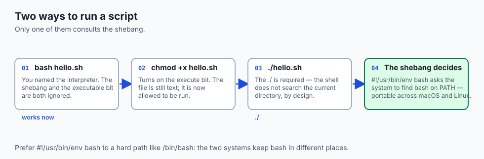

- **The shebang is `#!` plus the interpreter path**, and only matters when the file
  is run as a program.

- **`#!/usr/bin/env bash` finds bash on `PATH`**, which is portable; `/bin/bash` is
  not, across macOS and Linux.

### Variables and quoting

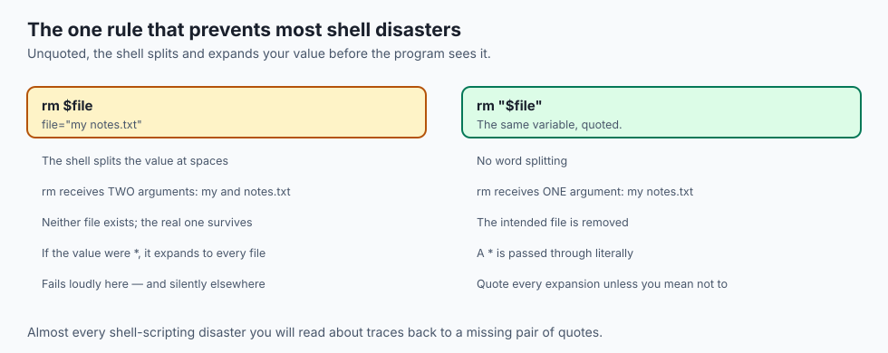

```bash
name="Ada"
greeting="Hello, ${name}"
echo "${greeting}"
```

- **No spaces around the `=`.** With spaces, the shell reads a command name.
- **Braces mark where the name ends**, so `${name}_backup` is unambiguous.
- **Unquoted expansion does two things you rarely want**: word splitting at spaces,
  and globbing of `*` and `?`.

### Command substitution

```bash
today="$(date '+%Y-%m-%d')"
count="$(ls -1 | wc -l)"
```

- **`$(...)` runs the command and substitutes what it printed**, trailing newline
  trimmed.

- **This is how a script reacts to reality** rather than hard-coding an answer.
- **Prefer `$(...)` to backticks.** It nests cleanly and reads better.

### Reading arguments

```bash
target="${1:-.}"
echo "Working on: ${target}, with $# argument(s)"
```

- **`$1`, `$2`** are the positional parameters; **`$#`** is how many there were.
- **`"$@"`** is all of them, each kept intact — quote it, always.
- **`${1:-default}`** supplies a fallback, which makes a script both flexible and
  forgiving.

### Conditionals

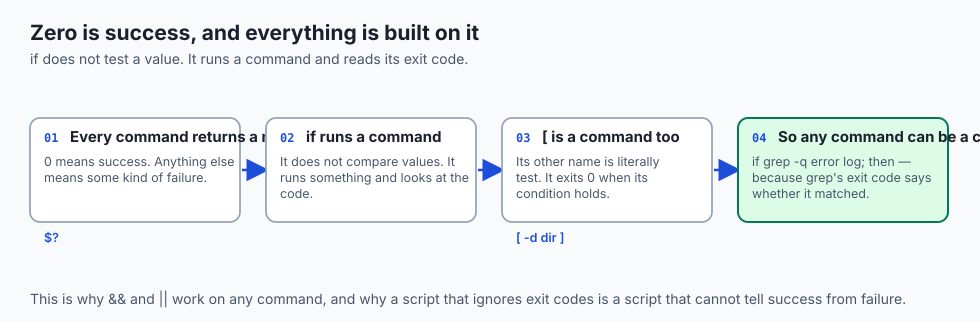

```bash
if [[ -d "${target}" ]]; then
  echo "It is a directory"
else
  echo "No such directory: ${target}"
fi
```

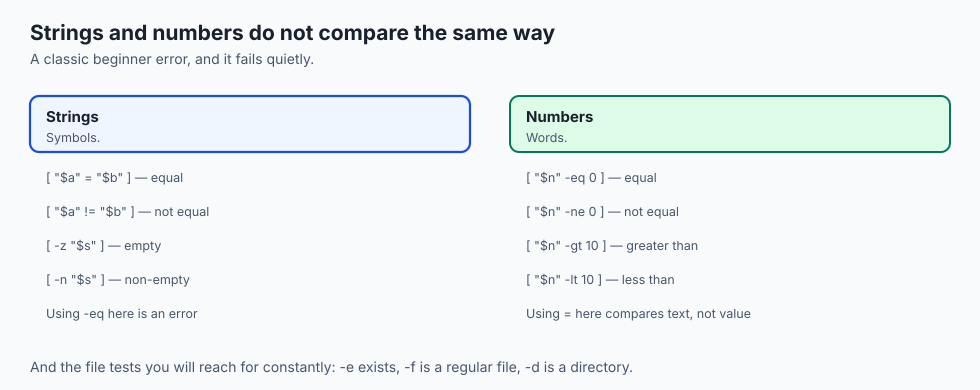

- **Prefer `[[ ... ]]` in bash.** It does not word-split its operands and supports
  pattern matching.

- **Use `[ ... ]` when the script must run under plain POSIX `sh`.**

### Loops and functions

```bash
for f in *.txt; do
  echo "Found: ${f}"
done

while read -r line; do
  echo "Line: ${line}"
done < notes.txt

log() {
  local msg="$*"
  echo "[$(date '+%H:%M:%S')] ${msg}"
}
```

- **`read -r`** stops it mangling backslashes.
- **Inside a function, `$1` is the function's argument**, not the script's.
- **Declare working variables `local`** so they do not leak into the rest of the
  script.

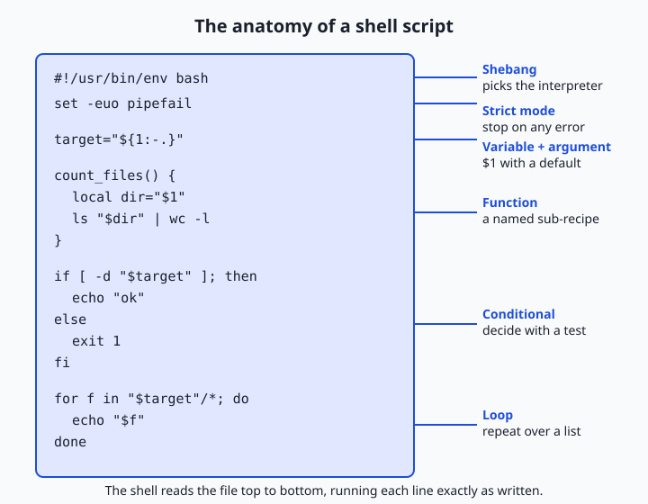

### Strict mode: set -euo pipefail

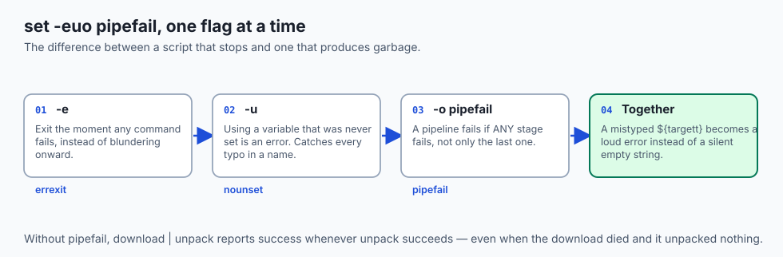

- **A default shell is too forgiving to trust.** One line near the top of every
  serious script fixes that, and it belongs there before anything else.

- **`-e` stops at the first failing command**, instead of blundering onward through
  steps whose inputs never arrived.

- **`-u` turns a mistyped `${targett}`** from a silent empty string into an immediate,
  loud error — which is the single most valuable of the three.

- **`-o pipefail` reports a pipeline as failed** when any stage failed, not only the
  last one.

- **Adopt the line as a reflex.** Typing it should cost you no thought at all.

### Asking a question

```bash
read -r -p "Delete these files? [y/N] " answer
[[ "${answer}" == "y" ]] && echo "Deleting..." || echo "Cancelled"
```

- **`-p` prints a prompt.** This is how interactive scripts confirm dangerous actions.
- **Automated pipelines pass arguments instead**, so the script can run unattended.


---

## An everyday analogy

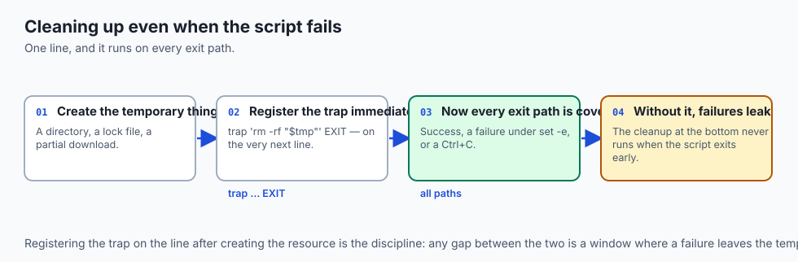

A recipe card.

| The kitchen | The script |
| --- | --- |
| The recipe card | The script file |
| "Serves 4" at the top | The shebang and strict mode |
| Ingredients list | Variables |
| "If the sauce is thin, simmer" | A conditional |
| "Repeat for each portion" | A loop |
| "Make the roux (see page 12)" | A function |
| Taste before serving | Checking exit codes |

- **A recipe you follow twice should be written down**, or you will get it slightly
  different each time.

- **A good recipe says what to do when something goes wrong.** A script without
  strict mode is a recipe that ignores a burnt pan and carries on.

---

## Examples in practice

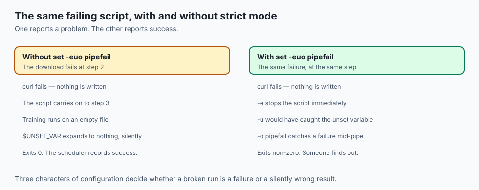

- **A backup script** that names its output with `$(date)` so runs never overwrite
  each other.

- **A preprocessing loop** over every file in a directory, skipping ones already
  done.

- **A launcher** that reads `$1` as the config file and defaults to `config.yml`.
- **A retry loop** that waits until a service answers before starting the real work.
- **A cleanup function** that runs on exit via `trap`, so temporary files go away
  even when the script fails.

---

## Implications: security, privacy, performance, scalability, and cost

- **Security: unquoted variables are an injection vector.** A filename containing a
  space or a semicolon can change what your script does.

- **Never build a command by string concatenation** from untrusted input. The shell
  will happily execute what you accidentally assembled.

- **Secrets belong in the environment**, not in the script and not in its arguments —
  `ps` shows arguments to everyone.

- **Performance: a loop that launches a process per item is slow.** Ten thousand
  iterations means ten thousand process creations. Prefer one pipeline over a loop
  where you can.

- **Scalability: shell scales badly past a few hundred lines.** No types, no modules,
  no test framework worth the name.

- **Cost: a script without `set -e` can burn hours of compute** producing output from
  a step that already failed.

---

## Alternatives: free, open source, and commercial

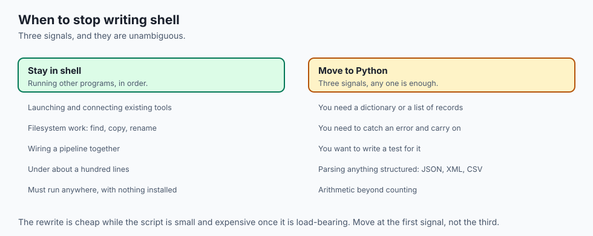

| Tool | Type | When to use it instead |
| --- | --- | --- |
| bash | Free, built in | Glue, automation, anything under ~100 lines |
| POSIX `sh` | Free, built in | Maximum portability, minimum features |
| Python | Free, open source | Data structures, real error handling, tests |
| `make` | Free, built in | Dependency graphs — rebuild only what changed |
| `just` | Free, open source | A friendlier task runner, without make's traps |
| `shellcheck` | Free, open source | Not an alternative — a linter you should always run |

- **`shellcheck` is not optional.** It catches unquoted variables, useless `cat`,
  and a dozen subtle traps, and it takes a second.

- **The switch to Python** comes when you need a dictionary, a real test, or an
  exception. Those three are the signal.

---

## Comparison with related concepts

| Term | What it actually is |
| --- | --- |
| **Script** | A file of commands for an interpreter |
| **Shebang** | The first line naming that interpreter |
| **Exit code** | The integer a command returns; 0 is success |
| **Positional parameter** | `$1`, `$2` — an argument by position |
| **Command substitution** | `$(...)` — a command's output used as a value |
| **Strict mode** | `set -euo pipefail`, the safety line |

---

## When to use it — and when not to

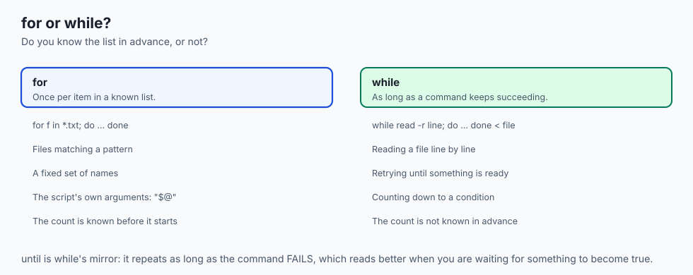

- **Use shell when the job is running other programs** in order, with a little logic
  between them.

- **Use it when the script must run anywhere** with nothing installed.
- **Use it for anything you have typed twice.**
- **Switch to Python when you need a data structure**, real error handling, or tests.
- **Switch when the script passes a hundred lines**, or when you find yourself
  parsing anything structured.

- **Do not write shell that generates shell.** That is the point where the next
  person cannot debug it, and the next person is you.

---

## The AI connection

- **Every training run starts from a script**: set the environment, check the data
  exists, launch, capture the log.

- **Dataset preparation is loops and pipelines** long before it is Python.
- **Container entrypoints are shell scripts**, and a missing `set -e` there means a
  container that reports success while doing nothing.

- **Sweep launchers are `for` loops** over hyperparameter values, which is the
  simplest experiment framework there is and often enough.

- **Reproducibility means the commands are written down.** A script is the cheapest
  form of that promise.

---

## Knowledge check

```yaml
quiz:
  question: "A script runs `download_data | unpack` and reports success, but the output directory is empty. Which strict-mode option would have caught this?"
  options:
    - "-o pipefail, because a pipeline's exit code otherwise comes only from its last command"
    - "-e, because the script would have exited at the first failing command"
    - "-u, because the output path variable was never set"
    - "-x, because tracing would have shown which command failed"
  answer_index: 0
  explanation: "Without pipefail, a pipeline reports whatever its final command returned. unpack succeeded at unpacking nothing, so the pipeline looked fine even though the download had already failed."
```

---

## Hands-on exercise

Write a script that takes an argument, loops over files, and fails loudly. Worked
through fully in the Day 12 lab directory.

| What you are doing | Command or line |
| --- | --- |
| Start the file properly | `#!/usr/bin/env bash` then `set -euo pipefail` |
| Take an argument with a default | `target="${1:-.}"` |
| Guard against a bad input | `[[ -d "$target" ]] \|\| { echo "no such dir" >&2; exit 1; }` |
| Loop over matching files | `for f in "$target"/*.txt; do ... done` |
| Capture a value | `count="$(ls -1 "$target" \| wc -l)"` |
| Run it | `chmod +x tool.sh` then `./tool.sh reports` |
| Lint it | `shellcheck tool.sh` |

### Expected output

```text
[14:02:11] Working on: reports
[14:02:11] Found: reports/summary.txt
[14:02:11] 3 entries
./tool.sh: line 9: nosuchcmd: command not found
```

- **The script stops at the failing line** rather than continuing — that is `-e`.
- **The error went to stderr**, so it stays out of any pipeline reading the output.

### Validate your work

- [ ] Your script has a shebang and a strict-mode line
- [ ] It accepts an argument and defaults sensibly when given none
- [ ] It exits non-zero with a message on stderr for a bad input
- [ ] Every variable expansion is quoted
- [ ] `shellcheck` reports no warnings
- [ ] `bash tests/run_tests.sh` reports 0 failures

### Troubleshooting

- **`command not found` on your own script.** Use `./tool.sh`; the current directory
  is not on `PATH`.

- **`Permission denied`.** `chmod +x`, or run it as `bash tool.sh`.
- **`unbound variable` after adding `set -u`.** That is the flag working. Find the
  typo it caught.

- **A loop over `*.txt` runs once with a literal `*.txt`.** Nothing matched, and the
  pattern was passed through unchanged. Guard with a test.

- **`[: too many arguments`.** An unquoted variable split into several words.

### Common mistakes

- **Spaces around `=` in an assignment.**
- **Comparing numbers with `=`** or strings with `-eq`.
- **Forgetting quotes**, which works until the first filename with a space.
- **Omitting `set -euo pipefail`** and then trusting the output.
- **Writing errors to stdout**, where they contaminate whatever reads the script.

---

## Practice assignment

- **Convert three commands you typed this week** into a script with an argument and a
  default.

- **Add a `trap` that cleans up a temporary directory** on exit, and prove it runs
  even when the script fails halfway.

- **Break your script deliberately** in three ways — a typo'd variable, a failing
  command mid-pipeline, an unquoted filename with a space — and confirm strict mode
  catches each.

- **Run `shellcheck` on every script you have ever written** and fix what it finds.

---

## Extension challenge

- **Write a script that retries with backoff** until a URL responds, giving up after
  five attempts, and returns a meaningful exit code either way.

- **Measure the cost of process creation.** Loop ten thousand times calling an
  external command, then do the same work with one pipeline. The ratio is why the
  "prefer a pipeline" advice exists.

- **Add argument parsing** that supports both `-v` and `--verbose`, and a `--help`
  that exits 0.

- **Make one of your scripts pass `shellcheck` at its strictest setting**, and note
  which warnings you had to think hardest about.

---

