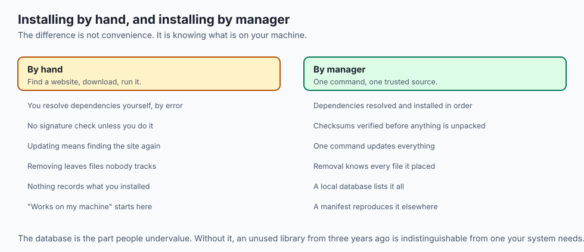
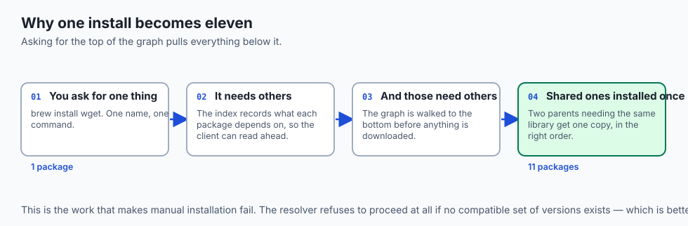
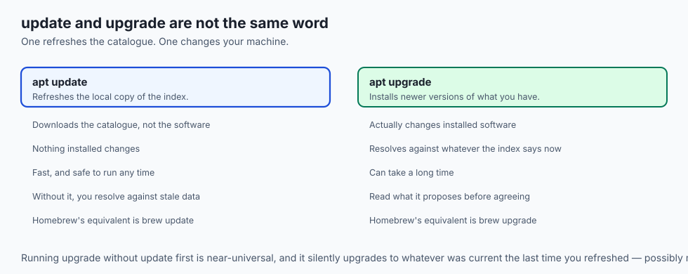
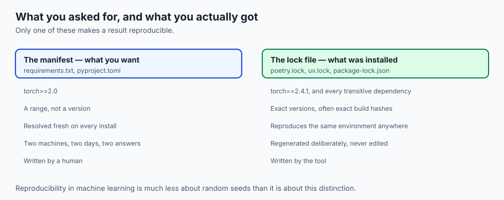
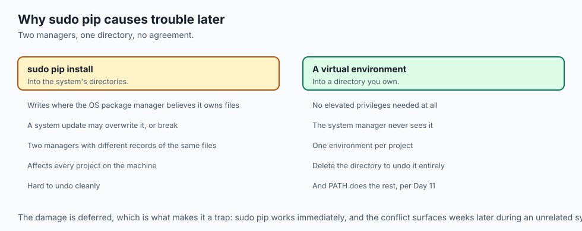
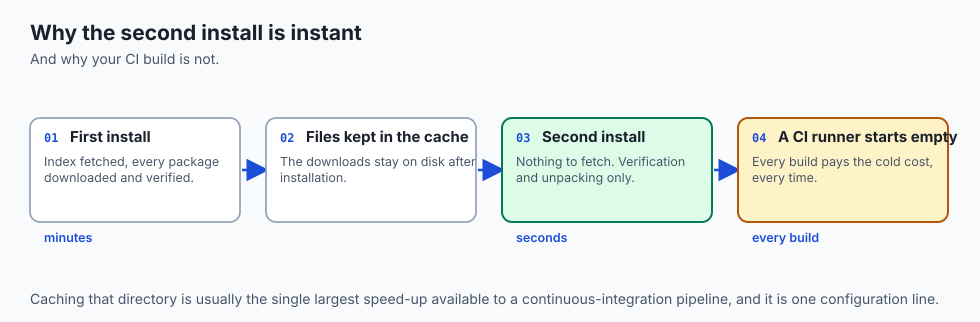
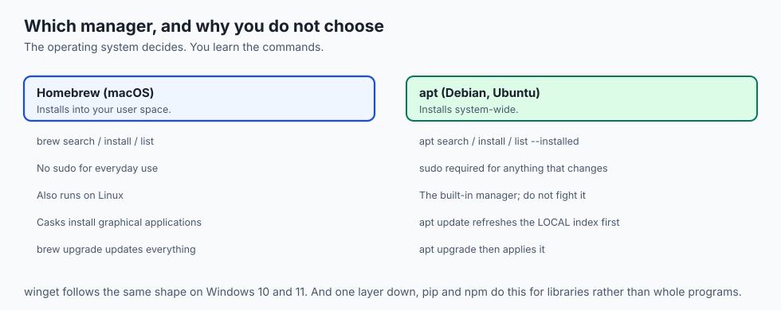
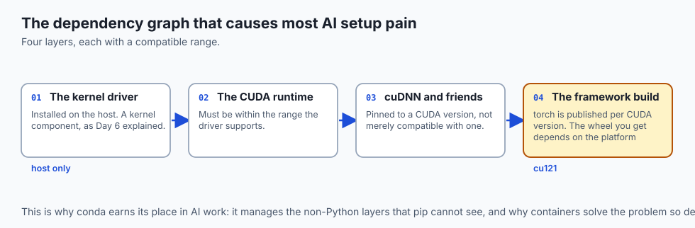
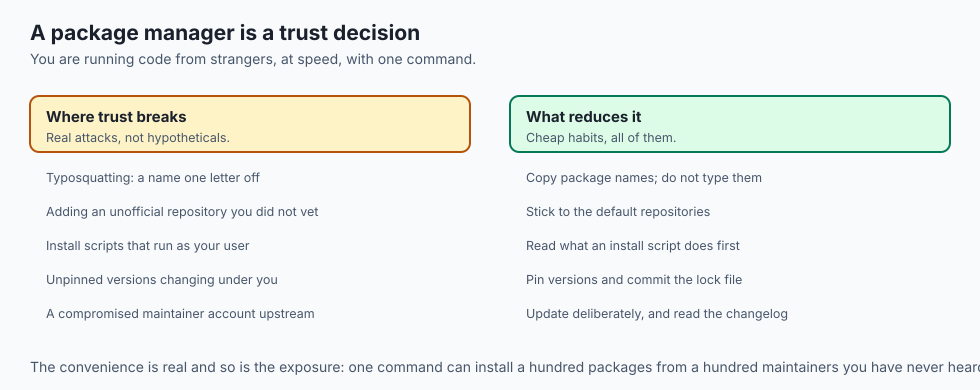

## Why this matters

- **Every AI tool arrives through a package manager.** PyTorch, CUDA libraries,
  `ffmpeg`, `git` — one command each, or an afternoon each.

- **Dependency conflicts are the most common setup failure in machine learning**, and
  today explains why they happen at all.

- **A lock file is what makes a result reproducible.** Without one, "it worked last
  month" is not a claim you can check.

- **A supply-chain attack reaches you through this door**, which is why the trust
  model is part of the lesson and not a footnote.

- **Everything here repeats one layer down** with `pip` and `npm`, which you will use
  daily.

---

## The idea in plain language



- **A package manager installs software and everything that software needs**, from a
  curated source, in one command.

- **It keeps a database of what it installed**, so it can update or remove things
  precisely.

- **It verifies what it downloads** against a published checksum before unpacking
  anything.

- **A manifest is your shopping list.** A lock file is the receipt showing exactly
  what you got.

- **The alternative is a folder of downloaded installers** and no record of what is
  on your machine.

---

## Historical background

- **Early Unix software arrived as source code** you compiled yourself, resolving
  dependencies by reading error messages.

- **Debian's `dpkg` and the RPM format, both 1994-95**, introduced the package as a
  unit with metadata — name, version, dependencies.

- **`apt` arrived in 1998** and added the part that mattered: automatic dependency
  resolution against a remote index.

- **Homebrew, 2009**, brought the model to macOS in a form that did not require
  administrator rights for everyday use.

- **`winget` shipped in 2020**, making Windows the last major platform to get a
  first-party command-line manager.

- **The idea then went down a layer**, to language libraries: CPAN, then `pip`,
  `npm`, `cargo` and the rest.

---

## What it is — and what it is not


Four parts do the work:

- **The client** — the command you run: `brew`, `apt`, `winget`.
- **The repository** — the remote collection, plus an **index** listing every
  package, its versions and its dependencies.

- **The local database** — the private record of what is installed on *your* machine
  and which files belong to what.

- **The cache** — local copies of downloads and the index, so repeated work is fast.

**It is not:**

- **Not an app store.** There is no payment, no review process in most cases, and
  frequently no company behind a package.

- **Not a sandbox.** Installed software runs with your privileges.
- **Not a guarantee of quality.** It guarantees the bytes are what the publisher
  published — nothing about whether they should be trusted.

---

## Why it was created and what problems it solves



- **Dependency hell.** Program A needs library X version 2; program B needs version
  1. A resolver finds a set that works, or tells you none exists.
- **Untracked installations.** Without a database, nobody knows what is on the
  machine or what may safely be deleted.

- **Integrity.** A checksum catches a corrupted download and a tampered mirror alike.
- **Updates.** One command updates everything, rather than visiting forty websites.
- **Reproducibility.** A manifest and a lock file rebuild the same environment on
  another machine, which is the whole basis of "it works everywhere".

---

## How it works



### Manifests and lock files



- **A manifest is written by you.** It lists what the project needs, loosely: "a
  spreadsheet library".

- **A lock file is written by the manager.** It records exactly what was installed —
  that library *and* the eleven things underneath it, at precise versions.

- **Human intent in one, resolved reality in the other.** That is the distinction.
- **Commit both.** The manifest explains the intent; the lock file makes the install
  repeatable.

- **This is what version pinning is built on**, and why a project without a lock file
  cannot promise reproducibility.

### The commands, per manager

```bash
# macOS — Homebrew
brew search wget && brew install wget
brew list && brew upgrade && brew uninstall wget

# Debian, Ubuntu — apt
sudo apt update              # refresh the LOCAL copy of the index first
apt search wget && sudo apt install wget
apt list --installed && sudo apt upgrade && sudo apt remove wget
```

```powershell
# Windows — winget
winget search wget
winget install wget
winget list; winget upgrade --all; winget uninstall wget
```

- **`apt update` refreshes the index, not the software.** `apt upgrade` is the one
  that changes what is installed. Confusing them is near-universal.

- **apt installs system-wide** and so needs `sudo` for anything that changes.
  Homebrew installs into your user space and does not.

### One layer down: pip and npm

- **`pip` installs Python libraries; `npm` installs JavaScript ones.** Same model,
  smaller units.

- **They lean harder on pinning**, because a project's behaviour can hinge on one
  library's exact version.

- **You will use these daily.** The desktop managers you learn today are the same
  concept, scaled up to whole programs.

---

## An everyday analogy



A well-run library.

| The library | The package manager |
| --- | --- |
| The catalogue | The repository index |
| The shelves | The repository |
| Your borrowing record | The local database |
| "This book cites three others" | Dependencies |
| A reading list you wrote | The manifest |
| The stamped record of what you took | The lock file |
| The returns desk | Clean uninstallation |

- **You ask for one title and the librarian brings the three it depends on**, in an
  order that makes sense.

- **The record is the point.** Without it, nobody knows what is out on loan, and
  nothing can be returned properly.

---

## Examples in practice


- **`brew install ffmpeg`** — one command, roughly forty dependencies, all verified.
- **`pip install torch` picking the wrong build** — a CPU-only wheel on a GPU
  machine, because the index resolved against the platform it detected.

- **`apt install` failing with held packages** — the resolver found no compatible
  set, and stopped rather than half-installing.

- **A `requirements.txt` without pinned versions**, which installed fine in March and
  broke in April when a dependency released a major version.

- **A typosquatted package name** one character from the real one, which is why you
  copy names rather than type them.

---

## Implications: security, privacy, performance, scalability, and cost

- **Security: installing a package runs someone else's code with your privileges.**
  Many packages execute install scripts.

- **The default repositories are curated; anything you add is not.** Adding a third-party
  repository is a trust decision, and it applies to everything you install
  afterwards.

- **Privacy: package managers report what you install** to the repository operator,
  by necessity — the index request says what you asked for.

- **Performance: the cache is why the second install is instant**, and why a clean CI
  build is slow. Caching that directory is usually the single biggest CI speed-up
  available.

- **Cost: disk fills quietly.** Old versions, caches and unused dependencies
  accumulate; `brew cleanup` and `apt autoremove` exist for exactly this.

- **Cost: an unpinned dependency is a future outage** you have already scheduled and
  not yet noticed.

---

## Alternatives: free, open source, and commercial



| Tool | Type | Where it fits |
| --- | --- | --- |
| Homebrew / apt / winget | Free | Whole programs, per operating system |
| pip, npm, cargo | Free | Language libraries, per ecosystem |
| conda / mamba | Free | Scientific stacks, including non-Python dependencies |
| uv, poetry | Free, open source | Faster, stricter Python dependency resolution |
| Docker | Free, open source | When the environment itself must travel |
| Nix | Free, open source | Fully reproducible builds, at a real learning cost |

- **`conda` earns its place in AI work** because it manages CUDA libraries and other
  non-Python pieces that `pip` cannot.

- **`uv` is worth knowing.** It resolves and installs Python dependencies fast enough
  to change how you work.

---

## Comparison with related concepts

| Term | What it actually is |
| --- | --- |
| **Package** | A program's files plus metadata about them |
| **Repository** | A curated collection the manager can reach |
| **Index** | The catalogue of packages, versions and dependencies |
| **Dependency** | Something a package needs to run |
| **Manifest** | What you asked for |
| **Lock file** | What you actually got, exactly |
| **Mirror** | A duplicate repository, hosted nearer you |

---

## When to use it — and when not to



- **Use the manager for everything it offers.** The exceptions should be rare and
  deliberate.

- **Use your operating system's default manager**, not a second one alongside it.
  Two managers owning the same file is a genuinely hard problem to unpick.

- **Pin versions in any project someone else will run**, including future you.
- **Do not install from a website** when the package exists in the repository.
- **Do not add third-party repositories casually.** Each one is permanent trust.
- **Do not use `sudo` with `pip`.** It mixes a language manager into system
  directories the system manager believes it owns.

---

## The AI connection





- **The GPU stack is a dependency graph** — driver, CUDA runtime, cuDNN, framework —
  and every layer has a compatible version range. Most setup pain is here.

- **`pip install torch` resolves against your platform**, which is why the same
  command gives a CPU build on one machine and a CUDA build on another.

- **Lock files are how an experiment stays reproducible.** A result you cannot
  rebuild is a result you cannot defend.

- **Container images are package installs frozen in time**, which is why they solve
  this problem so effectively.

- **A model weight download is not a package.** It has no dependency metadata and
  often no checksum you check — verify it yourself.

---

## Knowledge check

```yaml
quiz:
  question: "A project installs cleanly today and fails on a colleague's machine next week, with no code changes in between. Which file, if committed, would most likely have prevented this?"
  options:
    - "The lock file, which records the exact resolved versions of every dependency"
    - "The manifest, which lists the packages the project needs"
    - "The repository index, which catalogues available versions"
    - "The local package database, which records what is installed on the machine"
  answer_index: 0
  explanation: "The manifest was already there — it says what is needed, loosely. Between the two installs a dependency released a new version that still satisfied the manifest, and only the lock file pins the exact versions that were known to work."
```

---

## Hands-on exercise

Install something, inspect what came with it, then remove it cleanly. Worked
through fully in the Day 13 lab directory.

| What you are doing | Command (macOS / Debian) |
| --- | --- |
| Refresh the index | `brew update` / `sudo apt update` |
| Search for a package | `brew search jq` / `apt search jq` |
| See what it will pull in | `brew deps jq` / `apt-cache depends jq` |
| Install it | `brew install jq` / `sudo apt install jq` |
| Find where it landed | `command -v jq` |
| List what is installed | `brew list` / `apt list --installed \| head` |
| Remove it | `brew uninstall jq` / `sudo apt remove jq` |

### Expected output

```text
==> Fetching dependencies for jq: oniguruma
==> Installing jq
/opt/homebrew/bin/jq
jq-1.7.1
```

- **`oniguruma` was never requested.** The resolver found it and installed it first.
- **`command -v` proves the PATH story from Day 11** — the manager put it somewhere
  already on your PATH.

### Validate your work

- [ ] You inspected a package's dependencies *before* installing it
- [ ] You can name one package that was installed without you asking for it
- [ ] You found the installed binary with `command -v`
- [ ] You removed the package and confirmed the command no longer resolves
- [ ] You can explain the difference between `apt update` and `apt upgrade`
- [ ] `bash tests/run_tests.sh` reports 0 failures

### Troubleshooting

- **`Unable to locate package`.** Refresh the index first; apt resolves against its
  local copy.

- **`brew` not found on a new Mac.** Homebrew is not preinstalled, and its installer
  prints a line you must add to `~/.zshrc`.

- **Held back packages on apt.** The resolver found a conflict. Read what it says
  before forcing anything.

- **The command still works after uninstalling.** Your shell cached its location;
  run `hash -r`.

### Common mistakes

- **Running `apt upgrade` without `apt update`**, then wondering why nothing is new.
- **Installing with `sudo pip`**, which puts language packages where the system
  manager thinks it is in charge.

- **Adding a repository from a forum post** without reading what it contains.
- **Treating `install` as free.** Every package is code you now run.

---

## Practice assignment

- **Pick a tool you use daily** and map its full dependency tree with `brew deps
  --tree` or `apt-cache depends --recurse`. Count the packages.

- **Write a manifest** for your machine — a plain list of everything you would
  reinstall — and turn it into a one-line setup command.

- **Find the largest thing your package manager has cached**, and reclaim the space
  deliberately.

- **Compare two versions of the same package**, and read the changelog for the
  difference. This is the habit that makes upgrades safe.

---

## Extension challenge

- **Reproduce a dependency conflict on purpose.** Create a project requiring two
  packages with incompatible version ranges, and read what the resolver says.

- **Verify a download by hand.** Fetch a package file, compute its checksum, and
  compare it with the published value. Do it once and you will never dismiss stage
  three again.

- **Time a cold install against a warm one** and quantify what the cache is worth.
  That number is the argument for caching it in CI.

- **Read your lock file.** Pick any project with one, count the transitive
  dependencies, and count how many you had heard of.

---

