## Why this matters

Sooner or later, your work will depend on software you did not write. A tool to convert images, a database engine, a language runtime, a library that reads spreadsheets — you will need to install dozens of these, and then keep them working together for months. The difference between an afternoon of frustration and a five-second command is almost always one thing: whether you install software with a package manager or by hand.

Here is the concrete stakes. Software rarely stands alone; a single tool may need ten other pieces of software installed first, and each of those needs its own. Install one thing by downloading it from a website and you have signed up to hunt down all of those pieces yourself, in the right versions, and to repeat the hunt every time something updates. Get one version wrong and the tool crashes with a message you have never seen. Move to a new laptop and you must rebuild the whole tangle from memory. This is the notorious "it works on my machine" problem, and it has cost more engineering hours than almost any bug.

A package manager makes that problem mostly disappear. You type one line — `brew install`, `apt install`, or `winget install` — and a program fetches the software, figures out everything it depends on, installs all of it in the correct order from a trusted source, and writes down exactly what it did so the whole set can be updated or removed cleanly later. For anyone building serious projects, this is not a convenience; it is the foundation that makes every project after it reproducible. Today you learn what a package manager actually does, meet the three that run the desktop world, and see why the ability to pin an exact set of versions is the quiet secret behind software that behaves the same on every machine.

## The idea in plain language

A **package** is a bundle of software prepared for installation: the program's files, plus a small description of what it is, what version it is, and what else it needs to run. A **package manager** is a program whose whole job is to install, update, and remove packages for you, correctly and repeatably.

The key word is *correctly*. Almost no useful program is self-contained. A photo tool leans on a library that decodes JPEGs; that library leans on one that handles compression; that one leans on the basic math library everything uses. These "needed-first" pieces are called **dependencies**, and they form a chain — often a whole branching tree. Installing software by hand means walking that tree yourself. A package manager reads each package's description, works out the full tree automatically, and installs every piece in an order where nothing is missing when it is needed. This is called **dependency resolution**, and it is the single hardest thing a package manager does for you.

Where do the packages come from? From a **repository**: a curated online collection of packages that the package manager knows how to reach. When you ask for a package by name, the manager looks it up in the repository's index, downloads the right file, checks that it arrived intact and untampered, unpacks it into the correct place on your system, and records the installation in a local database so it can find and manage that software forever after. One name, one command, and a small trusted machine does all of the tedious, error-prone work that used to be yours.

## Historical background

Early software installation was entirely manual: you received a tape, a floppy, or later a downloaded archive, and you copied files into place and hoped. As programs grew to depend on shared libraries, this broke down badly. The turning point came from the free-software operating systems of the 1990s, where hundreds of independent programs had to coexist on one machine.

Debian, a Linux distribution first released by Ian Murdock in 1993, introduced the `.deb` package format and the tooling to manage it. The lower-level tool `dpkg` installed and removed individual packages; above it, the Advanced Package Tool — **apt**, introduced in the late 1990s — added the crucial layer: it could reach out to online repositories, resolve dependencies across all of them, and download and install everything needed with a single command. Around the same time, Red Hat created the RPM package format and its own managers. For the first time, "install this program and everything it needs" was one instruction.

The Mac world lacked a built-in equivalent for the open-source command-line tools developers wanted. **Homebrew**, created by Max Howell and released in 2009, filled that gap for macOS. It leaned on the fact that macOS is a Unix system underneath and made installing developer tools as easy as `brew install`. Its packages are called "formulae," its collections "taps," and its friendly design won it enormous popularity among programmers.

Windows was the last of the three major desktops to get a first-party command-line package manager. Microsoft announced **winget**, the Windows Package Manager, in 2020 and shipped it as a supported part of Windows thereafter. Before it, Windows users installed software by downloading installers and clicking through wizards, or used community tools. winget brought the one-command model — install, upgrade, list, search — natively to Windows. Meanwhile, programming-language ecosystems built their own managers on the same principles for code libraries rather than whole applications, and those, too, became indispensable. The idea proved so useful that it now exists at every layer of the software world.

## What it is — and what it is not

A package manager is a program that installs, upgrades, and removes software from curated repositories while automatically resolving and managing dependencies, and that keeps a local record of everything it has done. Each part of that sentence carries weight. *From curated repositories*: it pulls from known, maintained sources, not random websites. *Automatically resolving dependencies*: you name one package; it works out the rest. *Keeps a local record*: it always knows what is installed and can undo it cleanly.

It is equally important to be clear about what a package manager is *not*. It is not the software you are installing — it is the delivery and bookkeeping system around it. It is not a guarantee that a program is safe or bug-free; it is a guarantee about *where the program came from and how it was installed*. It is not an app store with payments and ratings, though the two share DNA. And it does not write your project's code or make your project reproducible by itself — reproducibility comes from you *recording* the exact set of packages and versions, which the manager makes possible but does not force.

| Common misconception | The reality |
| --- | --- |
| "A package manager is just a fancy download button." | It resolves a whole dependency tree, verifies integrity, and tracks every file so software can be updated or removed cleanly. |
| "Installing by hand from a website is basically the same." | Manual installs skip dependency resolution and record-keeping, which is exactly where things break later. |
| "The package manager writes the software." | It only packages, delivers, and manages software that other people wrote. |
| "If it installed, it must be safe." | The manager vouches for the source and integrity, not for the program's quality or intentions. |
| "Homebrew, apt, and winget are interchangeable commands." | They follow the same model but differ by operating system, command syntax, and the repositories they draw from. |

## Why it was created and what problems it solves

Package managers exist to solve a cluster of problems that all grow out of one fact: real software is a web of interdependent parts that change over time.

The first problem is **dependency hell**. Install program A that needs library X version 2, then program B that needs library X version 1, and by hand you are stuck: whichever version you put down, one program breaks. Package managers track these relationships explicitly and either find a set of versions that satisfies everyone or tell you plainly that no such set exists — instead of leaving you to discover it through mysterious crashes.

The second is **reproducibility**. A project that works today must still work next month, on a colleague's laptop, and on the server it will run on. If installation is a sequence of manual downloads no one wrote down, it cannot be reliably repeated. Package managers turn "install everything this needs" into a command, and — with a manifest, described below — into an exact, shareable specification.

The third is **updates and removal**. Software has security fixes and improvements; you need to move to new versions without breaking the tree, and to remove software completely when you are done, including files you would never think to hunt down. Because the manager recorded every file it placed, it can upgrade or uninstall precisely. The fourth is **trust and integrity**: fetching software from curated repositories over verified channels, and checking that what arrived is exactly what was published, protects you from tampered or corrupted downloads in a way that clicking a link on an unknown site never can.

## How it works

Let us walk the machinery, from the pieces involved to the exact steps of a single install.

### Internal architecture

A package manager sits between you and a remote repository, with a local database in the middle. Four parts do the work. The **client** is the command you run (`brew`, `apt`, `winget`). The **repository** is the remote collection of packages plus an **index** — a catalog listing every available package, its versions, and, crucially, its dependencies. The **local database** is the manager's private record of what is installed on *your* machine and which files belong to what. And the **cache** is a local copy of downloaded package files and the index, so repeated work is fast and offline-friendly.



Read the diagram left to right. You issue a command to the client. The client consults its copy of the repository index to find the package and, by reading the dependency information there, to compute the full set of packages actually required. It downloads each one from the repository (or reuses the cache), verifies it, installs it into the correct system location, and updates the local database. The dependency graph on the right is the heart of it: asking for one package at the top pulls in everything below it, in the right order, with no piece requested twice even when several parents share it.

### Key concepts

| Concept | What it means | Why it matters |
| --- | --- | --- |
| Package | A bundle of a program's files plus metadata (name, version, dependencies) | The unit the manager installs, updates, and removes |
| Repository | A curated online collection of packages the manager can reach | Where trusted software comes from, instead of random sites |
| Index / metadata | The repository's catalog of packages, versions, and dependencies | Lets the client resolve dependencies without downloading everything |
| Dependency | Other software a package needs in order to run | The reason manual installs fail; resolved automatically here |
| Manifest | A file you write listing the packages a project needs | Turns "install everything" into one shareable, repeatable command |
| Lock file | A file recording the *exact* versions that were installed | Makes an install reproducible down to the version |
| Version pinning | Requesting a specific version rather than "the latest" | Stops silent upgrades from changing your project's behavior |
| Mirror | A duplicate of a repository hosted elsewhere | Faster, more reliable downloads and redundancy |

### Manifests and lock files

Two files turn a package manager from a convenience into a reproducibility engine. A **manifest** is a short file *you* write that lists the packages a project needs — think of it as the project's shopping list. A **lock file** is written by the manager and records the *exact* versions it actually installed, including the versions of every dependency it pulled in. The manifest says "I need a spreadsheet library"; the lock file says "and here are the precise versions of it and the eleven things underneath it that made this project work." Hand both files to another machine and the manager can recreate the identical set of software. This distinction — human intent in the manifest, exact resolved reality in the lock file — is what **version pinning** is built on, and it is why professional projects commit both files alongside their code.

### Step by step: one install

Suppose you run a single install command for a tool called `wget` (a small program that downloads files). The manager moves through five stages.

1. **Resolve.** It looks up `wget` in the repository index, reads its dependencies, and computes the complete set of packages required — `wget` plus anything it needs that is not already present — refusing to proceed if no compatible set exists.
2. **Download.** It fetches each required package file from the repository, skipping any already sitting in the cache.
3. **Verify.** It checks each downloaded file's integrity against a checksum or signature published by the repository, so corrupted or tampered files are rejected before anything is installed.
4. **Install.** It unpacks each package into the correct system locations, in dependency order, so nothing is ever placed before the pieces it relies on.
5. **Record.** It writes the installation into the local database — every file, every version — so the software can be listed, upgraded, or removed precisely later.



Those five stages are the same whether you type `brew install wget`, `sudo apt install wget`, or `winget install wget`. The commands and the repositories differ; the underlying dance does not.

### The leading package managers

Each of the three desktop managers follows the model above; you choose by operating system, not preference.

**Homebrew (macOS, and Linux).** Choose Homebrew when you are on a Mac and want command-line tools and open-source software. It installs into your user space and needs no administrator password for everyday use. How to use it:

```bash
brew search wget       # find a package by name
brew install wget      # install it and its dependencies
brew list              # show everything Homebrew has installed
brew upgrade           # update all installed packages to newer versions
brew uninstall wget    # remove it cleanly
```

A worked example: running `brew install wget` resolves wget's dependencies, downloads the prepared bottles, verifies them, links the files into place, and records the result — after which `wget --version` runs. Homebrew is free and fully open-source.

**apt (Debian, Ubuntu, and relatives).** Choose apt when you are on a Debian-based Linux system; it is the built-in manager and the standard way to install almost anything. It installs system-wide, so its changing commands need administrator rights via `sudo`. How to use it:

```bash
sudo apt update            # refresh the local copy of the repository index
apt search wget            # find a package
sudo apt install wget      # install it and its dependencies
apt list --installed       # show installed packages
sudo apt upgrade           # update installed packages
sudo apt remove wget       # remove it
```

The `apt update` step matters: apt resolves against its *local* copy of the index, so you refresh that copy first to see current versions. apt and everything it installs from the main repositories are free and open-source.

**winget (Windows).** Choose winget on Windows 10 and 11, where it ships as the supported first-party command-line package manager. How to use it, in PowerShell or Command Prompt:

```powershell
winget search wget         # find a package
winget install wget        # install it
winget list                # show installed packages
winget upgrade --all       # update installed packages
winget uninstall wget      # remove it
```

winget itself is free, drawing on a community-curated repository of installers alongside Microsoft's own.

**Language package managers (a preview).** The same idea runs one layer down, for code libraries rather than whole applications. **pip** installs Python libraries (`pip install <name>`); **npm** installs Node.js/JavaScript libraries (`npm install <name>`). These are what you will use most as you build projects, and they lean even harder on manifests and lock files. Because a project's behavior can hinge on the exact version of a library, this world takes version pinning very seriously — a manifest names what you want, a lock file freezes exactly what you got, and both travel with the code so every machine rebuilds the identical stack. You will meet pip and npm in depth later; for now, know that the desktop managers you learn today are the same concept scaled up to whole programs.

## An everyday analogy

Think of a well-run town library and its librarian. The **repository** is the library's collection and its central catalog; a **package** is a book. When you request one book, a good librarian notices that to understand it you also need the three books it constantly references, and those in turn cite two more — so the librarian quietly fetches the whole set and checks them all out under your card at once. That is **dependency resolution**: you asked for one thing and received, in the right order, everything that thing depends on.

The librarian keeps a record of every book on your card — that is the **local database**, the reason the library can later take the whole stack back cleanly or swap in newer editions when they arrive (an **upgrade**). If you write down the reading list you want the library to assemble for a study group, that list is a **manifest**: your stated intent. The stamped checkout slip the librarian prints, naming the exact edition and printing of every book you actually received, is the **lock file**: the precise reality, so another group at another branch can be handed the identical editions. Insisting on a specific edition rather than "whatever is newest" is **version pinning** — sometimes an old edition is the one your notes refer to, and a surprise new edition would renumber every page. And a **mirror** is a nearby branch library holding copies of the same collection, so you need not travel to the central building for every book. Keep this library in mind and the whole machinery of package managers stays intuitive.

## Examples in practice

Consider installing that spreadsheet-reading tool by hand versus with a manager. By hand: you find the project's site, download an archive, discover it needs a compression library, find and install that, discover *it* needs the base math library, install that, get the versions subtly wrong, watch the tool crash, and repeat until it works — with no record of what you did. With a manager: you type one install command and the five stages above run to completion, dependencies and all, with a record kept. The second path is not merely faster; it is *repeatable*, because the manager knows exactly what it placed.

Now watch reproducibility do real work. You build a project on your laptop, listing what it needs in a manifest and letting the manager write a lock file of exact versions. A teammate clones the project onto a fresh machine and runs one install command; the manager reads the lock file and recreates the identical set of packages, down to the version of every buried dependency. The project that ran on your machine now runs on theirs — not by luck, but because the exact stack was written down and reproduced. When it *doesn't* work, the failure is almost always a version that drifted: someone installed "the latest" instead of the pinned version, one dependency moved, and behavior changed. The fix is nearly always to compare the two lock files and reconcile the versions.

Finally, a small concrete session. On a Mac, `brew search image` lists image-related packages; `brew install imagemagick` pulls in ImageMagick and its dependency tree; `brew list` then shows it among your installed software; and `brew upgrade` later moves everything forward together. Each command is the same conceptual operation you would run as `apt search` / `sudo apt install` / `apt list --installed` / `sudo apt upgrade` on Ubuntu, or `winget search` / `winget install` / `winget list` / `winget upgrade` on Windows. Learn the model once and you can drive any of the three.

## Implications: security, privacy, performance, scalability, and cost

### Security

Package managers are a major security *improvement* over manual installation, precisely because they fetch from curated repositories over verified channels and check integrity with checksums or signatures before installing. That closes off a whole class of attacks where a tampered or corrupted download slips onto your machine. But the trust chain is only as strong as its links: adding an untrusted third-party repository, or installing a package whose name is a near-miss of a popular one (a "typosquat"), can invite in malicious code the manager will faithfully install. The discipline is to prefer official repositories, read package names carefully, and treat any instruction to install from an unknown source the way you would treat a stranger's USB stick.

### Privacy

Installing packages contacts the repository's servers, which necessarily learn that some machine requested certain packages at a certain time. For most work this is unremarkable, but the set of software you install is mildly revealing, and organizations with strict requirements sometimes run internal mirrors so that installation traffic never leaves their network. Manifests and lock files, being plain text you may share publicly, also quietly disclose your project's exact dependency stack — usually harmless and often helpful, but worth a moment's thought before publishing.

### Performance

The manager's cache and local index make repeated operations fast, and mirrors put downloads geographically close to you. The slow steps are refreshing a large index and resolving a complicated dependency tree; both are one-time costs amortized over many quick installs. The real performance win, though, is human: minutes of one command replace hours of manual hunting, and that compounds across a career.

### Scalability

This model scales from one laptop to thousands of servers. Because a manifest and lock file capture an entire environment as text, the same specification can provision one machine or an entire fleet identically and automatically. Version pinning is what makes that safe at scale: without it, "install the latest" run across a thousand machines on different days yields a thousand slightly different environments and a debugging nightmare. With it, every machine converges on exactly the recorded stack.

### Cost

Homebrew and apt are free and fully open-source, as are the packages in their main repositories; winget is free and draws on free and open-source software alongside other installers. So the direct cost is essentially zero. The real cost is *hidden* and paid by *not* using them: the engineering hours lost to dependency conflicts, unreproducible setups, and "it works on my machine" investigations. Adopting a package manager and committing your manifest and lock file is one of the cheapest, highest-return habits in all of software.

## Alternatives: free, open source, and commercial

"Alternatives" here means other ways to get software onto a machine, and other managers in the family.

| Approach | Type | What it offers | Cost |
| --- | --- | --- | --- |
| Homebrew (macOS/Linux) | Free, open-source | One-command installs of developer tools and open-source software | Free |
| apt (Debian/Ubuntu) | Free, open-source | Built-in system manager with vast official repositories | Free |
| winget (Windows) | Free, first-party | Native one-command installs on Windows 10 and 11 | Free |
| Manual download and install | Built into every OS | Direct control; sometimes the only option for niche software | Free, but no dependency resolution or record-keeping |
| Language managers (pip, npm, and peers) | Free, open-source | Install code libraries with the same model, for building projects | Free |
| Container images | Free tooling; some hosting paid | Ship an entire pre-built environment, packages and all | Tooling free; registries may charge |

For desktop software on your own machine, the built-in manager for your operating system is almost always the right default: Homebrew on macOS, apt on Debian-based Linux, winget on Windows. Reach past it only for software genuinely not in any repository, and then install manually with care.

## Comparison with related concepts

| Concept A | Concept B | Key difference |
| --- | --- | --- |
| Package manager | App store | Both deliver software, but a package manager is command-driven, dependency-aware, and built for reproducible, scriptable installs rather than browsing and payments |
| Package manager | Installer / setup wizard | An installer places one program with manual clicks; a package manager resolves dependencies, records everything, and manages updates and removal across all your software |
| Manifest | Lock file | A manifest states what you *want* (often loosely); a lock file records the exact versions you *got*, making installs reproducible |
| Repository | Mirror | A repository is the authoritative collection; a mirror is a synchronized copy hosted elsewhere for speed and redundancy |
| System package manager (apt, brew, winget) | Language package manager (pip, npm) | System managers install whole applications for the OS; language managers install code libraries for a specific programming ecosystem |
| Upgrade | Reinstall | An upgrade moves installed software to a newer version while preserving the dependency tree; a reinstall replaces the same version's files |

## When to use it — and when not to

Reach for a package manager as your default whenever you need to install, update, or remove software — which, in a technical career, is constantly. Use it especially when a tool has dependencies (nearly all do), when you will need the same software on more than one machine, and when a project must be reproducible: commit a manifest and lock file and let the manager rebuild the exact stack anywhere. Use it, too, whenever you would otherwise be tempted to download an installer from a search result, because the curated repository and integrity checks are a real security upgrade.

Know the few cases where you step outside it. Some software genuinely is not in any repository — a vendor's proprietary tool, a brand-new project, something you are building yourself — and then a careful manual install is legitimate; do it deliberately, from the official source, and record what you did. Be cautious about mixing managers for the same software (installing one tool through two different managers invites confusion over which copy is in charge). And resist adding unofficial third-party repositories for a single convenient package, since each one you trust widens your exposure. The professional habit is simple: default to your system's package manager, pin and record versions for anything that must be reproducible, and take a manual, official-source install only when no repository offers what you need.

## The AI connection

Dependency management is the quiet cause of most "it worked yesterday" failures
in machine learning, and the reason is that the stack is unusually deep and
unusually version-sensitive. A model checkpoint, a framework version, a CUDA
runtime and a driver all have to agree, and the failure when they do not is
rarely a clear error message.

The manifest-and-lock-file distinction you met today is the whole answer. A
manifest states what you want — `torch>=2.0` — and a lock file records exactly
what was installed, down to the build. Without the lock, two machines resolving
the same manifest on different days get different versions, and a result that
reproduces on one and not the other is indistinguishable from a real finding.
This is why every serious project pins, why environments are rebuilt from a lock
rather than upgraded in place, and why the deployment section will put the entire
resolved environment inside a container image. Reproducibility in machine
learning is not mostly about random seeds. It is mostly about this.

---

## Knowledge check

Try these from memory before looking back:

1. In your own words, define a package, a dependency, and a repository, and explain how the three relate when you install one program.
2. A teammate says "it works on my machine but crashes on mine." Using version pinning, manifests, and lock files, explain the most likely cause and the fix.
3. List the five stages a package manager moves through to install a single package, and say what could go wrong if the "verify" stage were skipped.
4. Name the default package manager for macOS, Debian/Ubuntu, and Windows, and give the install command for a package called `wget` on each.
5. Explain the difference between a manifest and a lock file, and why professional projects commit both.

## Hands-on exercise

Time to look at your own machine. In this exercise — worked through in full in the Day 13 lab directory — you will use the terminal to discover which package managers are already installed, and run a safe, read-only query against each one. You will install nothing: the goal is to *see* what manages software on your system before you ever change it.

Open your terminal and check whether each common manager exists. The `command -v` builtin prints a program's location if it is available and stays silent if it is not:

```bash
command -v brew apt apt-get winget pip pip3 npm
```

Every line it prints is a package manager (or language manager) present on your machine. Now query the ones you have, read-only. If Homebrew is present:

```bash
brew --version
brew list | head
```

`brew --version` prints Homebrew's version; `brew list | head` shows the first several packages Homebrew has installed — a peek at your machine's managed software. On a Debian-based Linux system you would instead run a read-only query like:

```bash
apt-cache policy
```

which reports the configured repositories without changing anything. Notice that you have not installed or removed a single thing — you have only *inspected*, which is exactly how to explore an unfamiliar system safely.

### Expected output

A typical run on a Mac with Homebrew installed (your values will differ — that is the point):

```text
$ command -v brew apt apt-get winget pip pip3 npm
/opt/homebrew/bin/brew
/opt/homebrew/bin/pip3
/opt/homebrew/bin/npm

$ brew --version
Homebrew 6.0.9

$ brew list | head
abseil
ada-url
aom
apr
apr-util
argon2
autoconf
brotli
```

Line by line: `command -v` found `brew`, `pip3`, and `npm` on this machine and printed their locations; `apt`, `apt-get`, and `winget` printed nothing because they are not present on macOS. `brew --version` identifies the Homebrew release. `brew list | head` shows the first several installed packages — many of them dependencies pulled in automatically by other tools, exactly as the lesson describes.

### Validate your work

You are done when you can check every box:

- [ ] You ran `command -v` and can name every package manager it found on your machine.
- [ ] You ran at least one read-only query against a manager you have (for example `brew --version` or `apt-cache policy`).
- [ ] You can state which is your machine's *default* system package manager, given its operating system.
- [ ] You installed and removed nothing during the exercise.
- [ ] You can write down (without running it) the command to install `wget` on your operating system.

### Troubleshooting

- **`command -v` printed nothing at all.** That means none of those managers are on your `PATH`. On macOS, Homebrew may not be installed yet; on minimal Linux, `apt` should exist — try `command -v apt` alone to confirm.
- **`brew: command not found`.** Homebrew is not installed or not on your `PATH`. That is a valid result to record — this exercise never installs anything, so simply note that brew is absent and query whatever manager you do have.
- **`pip` is missing but `pip3` is present.** On many systems the Python manager is named `pip3`; that is why the check lists both. Treat a hit on either as "pip is available."
- **You are on Windows.** Run `winget --version` and `winget list` in PowerShell. If winget is missing, it can be added from the Microsoft Store's "App Installer," but you do not need to install anything for this exercise — recording "winget absent" is a valid outcome.

### Common mistakes

- **Reaching for `sudo`.** None of these inspection commands need administrator rights. If you find yourself typing `sudo`, stop — this lab is strictly read-only, and real installs are a separate, deliberate act.
- **Confusing "not found" with "broken."** A manager printing nothing from `command -v` simply is not installed on this machine; that is information, not an error. macOS has no `apt`; a fresh Linux box has no `brew`.
- **Actually installing something.** The temptation to "just try `brew install`" defeats the purpose. Today you inspect; you write the install command down but do not run it, so you can reason about your system before you alter it.

## Practice assignment

Open the package-manager worksheet in the starter directory of the Day 13 lab and fill it in completely for your machine: which package manager(s) `command -v` found; which one is your operating system's *default* system manager; the exact command you *would* run to install `wget` on your OS (write it — do not run it); and the name of one package you already have installed (from `brew list`, `apt list --installed`, or `winget list`). Then write one short paragraph (4–6 sentences) explaining, in your own words, why installing that one package with a manager was safer and more repeatable than downloading it by hand — naming dependency resolution, integrity verification, and record-keeping explicitly. Keep the worksheet; later lessons on language managers will build on it.

## Extension challenge

Go one layer deeper into the idea of pinning. Pick any one package your machine already has and find out what it *depends on*. On macOS with Homebrew:

```bash
brew deps --tree wget
```

which prints the dependency tree for `wget` — every package it needs, and what those need, exactly the tree the lesson described. On Debian-based Linux the equivalent read-only query is:

```bash
apt-cache depends wget
```

Study the output and count how many packages one small tool actually rests on. Then, in two or three sentences, explain why recording only the *top-level* name (`wget`) in a manifest is not enough for true reproducibility, and how a lock file that pins every version in that tree — not just the one you asked for — is what lets another machine rebuild an identical environment. You have just reasoned about reproducible environments from first principles, which is the same discipline behind every serious project you will build from here on.
