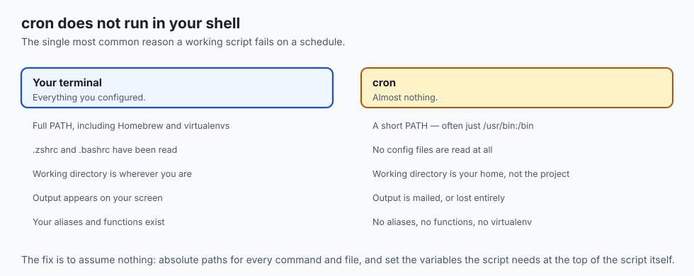
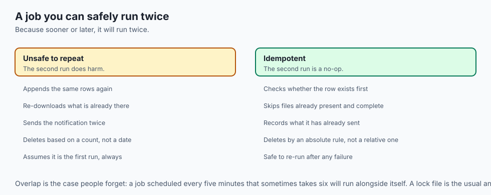
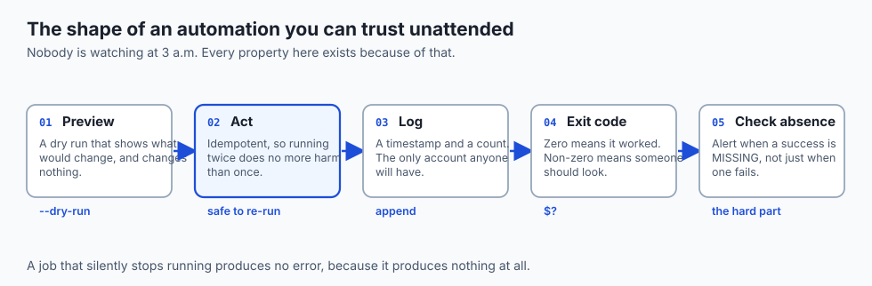
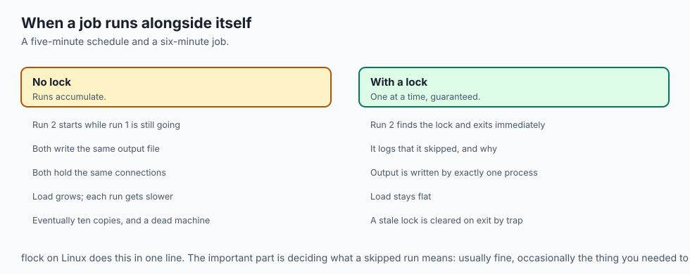
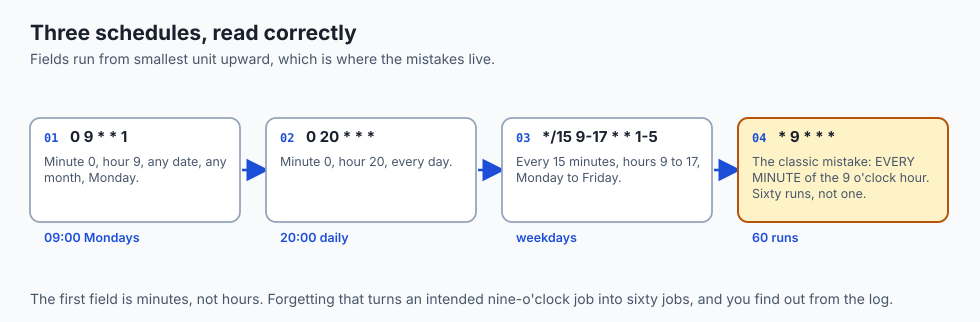
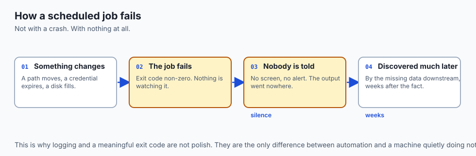
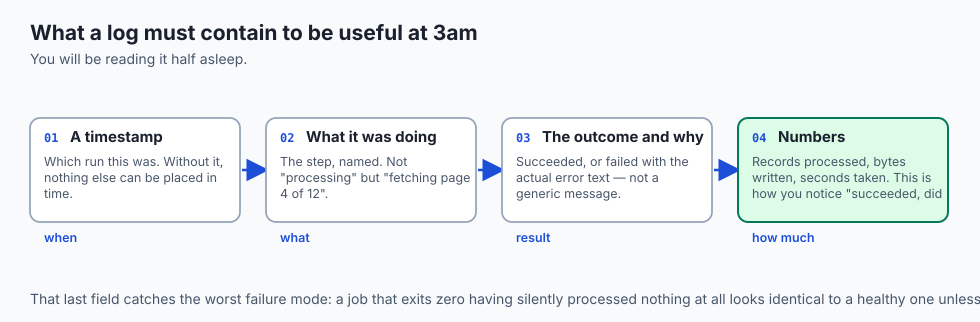
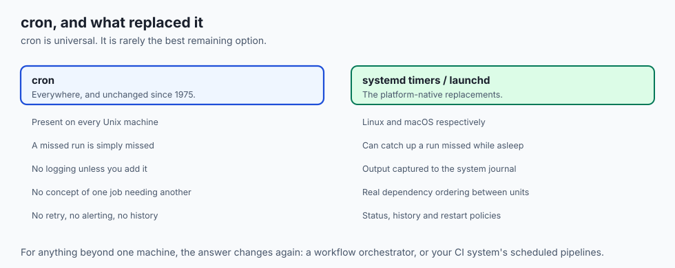
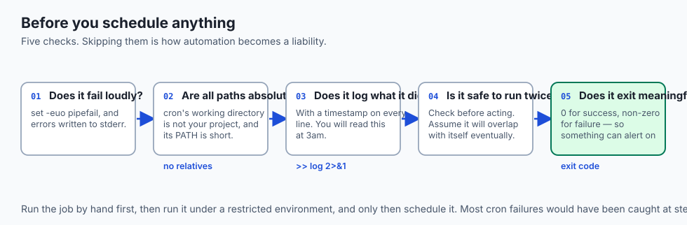

## Why this matters

- **This is where the week pays off.** Everything since Day 8 combines into work that
  happens without you.
- **Data pipelines run on schedules.** Fetch overnight, preprocess at dawn, retrain
  weekly — all of it scheduled.
- **Unattended automation is a different discipline from interactive work.** Nobody
  is watching, so the script must fail loudly and log everything.
- **The most common cron failure has nothing to do with cron.** It is a script that
  assumed your environment and did not get it.
- **Today is also the last day of Week 2**, and the point at which the terminal
  becomes leverage rather than a skill.

---

## The idea in plain language



- **A scheduler is a program that watches the clock** and starts commands when their
  time arrives.
- **cron is the classic one.** Once a minute it compares the time against a list of
  rules and launches whatever matches.
- **It does not wait for your command to finish**, and it does not show you the
  output.
- **Each rule is five time fields and a command**, and the fields run from the
  smallest unit upward.
- **The hard part is not the schedule.** It is writing a script that behaves
  correctly when nobody is watching.

---

## Historical background

- **cron arrived in Version 7 Unix, 1979**, and its syntax has barely changed since.
- **The original woke once a minute and read the whole table.** Vixie cron, 1987,
  made it sleep until the next scheduled event instead, and that is what most Linux
  systems still run.
- **Output was emailed to the job's owner**, which was reasonable on a shared machine
  in 1979 and is why unattended jobs redirect to a log today.
- **macOS replaced cron with `launchd`** in 2005, though cron still works there.
- **systemd timers arrived on Linux in the 2010s**, adding logging, dependencies and
  catch-up for missed runs.
- **The five-field syntax outlived all of it**, and appears now in Kubernetes,
  GitHub Actions and every CI system you will meet.

---

## What it is — and what it is not





**It is:**

- A background program comparing the clock against a list of rules.
- A launcher: it starts your command as a new process and goes back to sleep.
- Indifferent to what happens next — it does not wait, watch, or retry.

**It is not:**

- **Not a workflow engine.** It has no concept of one job depending on another.
- **Not a monitor.** A job that fails every night will fail quietly for a year.
- **Not your shell.** It reads none of your configuration, which is the source of
  most surprises.
- **Not exactly punctual on a laptop.** A machine asleep at 3am simply misses the
  run; classic cron does not catch up.

---

## Why it was created and what problems it solves

- **Work that must happen at a time nobody wants to be awake for.** Backups,
  reports, cleanup.
- **Work that must happen regularly and identically.** A human doing it weekly will
  do it differently each time.
- **Work whose value is in its regularity.** A log rotated on schedule; a dataset
  refreshed before the morning.
- **Freeing attention.** Anything scheduled is something you no longer have to
  remember.
- **Consistency across machines.** The same crontab line on twenty servers does the
  same thing on all twenty.

---

## How it works

### Reading a crontab, field by field


- **`crontab -e`** opens your schedule in an editor; **`crontab -l`** lists it.
- **Each active line is five time fields, then a command.**

| Position | Field | Values | `*` means |
| --- | --- | --- | --- |
| 1 | Minute | 0–59 | every minute |
| 2 | Hour | 0–23 | every hour |
| 3 | Day of month | 1–31 | every day |
| 4 | Month | 1–12 or `jan` | every month |
| 5 | Day of week | 0–7 (0 and 7 = Sunday) | every weekday |

- **A list** — `1,15` — means the 1st and the 15th.
- **A range** — `1-5` — means 1 through 5.
- **A step** — `*/15` — means every fifteenth value.
- **So `*/15 9-17 * * 1-5`** is every 15 minutes, 9am to 5pm, weekdays.

### From a run to a logged, safe job


- **The scheduler fires at the appointed minute** and starts the script.
- **The script writes every meaningful action to a log**, with a timestamp.
- **The exit status branches at the end**: success is recorded and the job waits for
  next time; failure is recorded loudly, and in production would raise an alert.
- **If the work may already be partly done**, the script checks and skips — so a
  second run is harmless.
- **Those two properties — logging and safety on repeat — are what make unattended
  automation trustworthy** rather than alarming.

### Redirecting the output

```bash
0 9 * * 1 /usr/local/bin/weekly-report.sh >> /var/log/weekly.log 2>&1
```

- **`>>` appends**, so history survives.
- **`2>&1` sends errors to the same place**, so the log holds the whole story rather
  than the happy half.
- **Without redirection, output is mailed or lost**, and on a modern machine it is
  almost always lost.

---

## An everyday analogy



An alarm clock, not an assistant.

| The alarm clock | cron |
| --- | --- |
| The time you set | The five fields |
| It rings whether you are there or not | The job starts regardless |
| It does not check you got up | No monitoring of the result |
| It does not ring again if the power was out | A missed run stays missed |
| A note beside the bed | The log file |

- **The clock's job ends the moment it rings.** Everything after that is yours.
- **An alarm you never check is worse than none**, because you believe you are
  covered. That is a scheduled job with no logging.

---

## Examples in practice



- **`0 2 * * * backup.sh`** — nightly at 2am, when nobody is using the machine.
- **`*/5 * * * * healthcheck.sh`** — every five minutes, and the first job you should
  make safe against overlapping with itself.
- **`0 6 * * 1 retrain.sh`** — weekly retraining before Monday morning.
- **A job that worked by hand and fails on schedule** — almost always `PATH`, or a
  relative path, or a virtualenv that was never activated.
- **A log that has silently recorded a failure every night for three months**, which
  is what happens when nothing alerts.

---

## Implications: security, privacy, performance, scalability, and cost



- **Security: a scheduled job runs with your privileges, unattended, forever.** It is
  a standing capability, and it should hold the least it needs.
- **Never put a secret in a crontab line.** The table is readable and the command
  line is visible in `ps`. Read it from a file the script owns.
- **A writable script on a schedule is a persistence mechanism.** If an attacker can
  edit it, they have a job that runs as you, on a timer.
- **Performance: overlapping runs compound.** A five-minute job that takes six
  minutes will eventually have ten copies running.
- **Cost: an unwatched job can be expensive.** A retraining job that fails at step
  one still spins up the machine every week.
- **Cost of getting it wrong is silence.** The failure mode of automation is not a
  crash; it is nothing happening and nobody noticing.

---

## Alternatives: free, open source, and commercial



| Tool | Type | Where it fits |
| --- | --- | --- |
| cron | Free, built in | One machine, simple schedules, universal availability |
| systemd timers | Free, built in | Linux, when you want logging and dependencies |
| launchd | Free, built in | macOS, including jobs that run on events rather than times |
| `at` | Free, built in | A single run, once, at a stated time |
| GitHub Actions schedules | Free tier | Jobs that belong with the repository |
| Airflow, Dagster, Prefect | Free, open source | Real pipelines: dependencies, retries, backfills |

- **Move off cron when you need any of three things**: to know a job ran, to make one
  job wait for another, or to retry a failure.
- **Do not reach for Airflow on day one.** A logged, idempotent cron job solves more
  problems than its reputation suggests.

---

## Comparison with related concepts

| Term | What it actually is |
| --- | --- |
| **cron** | The daemon that launches jobs on a schedule |
| **crontab** | The table of rules, one line per job |
| **Job** | One schedule paired with one command |
| **Idempotent** | Safe to run more than once |
| **Daemon** | A background process with no terminal |
| **Orchestrator** | A scheduler that also understands dependencies |

---

## When to use it — and when not to



- **Use a schedule when the work is genuinely periodic** and does not depend on
  anything else finishing.
- **Use it when the machine is always on.** A laptop that sleeps is a poor host for
  anything that matters.
- **Use `at` for a one-off**, rather than adding and removing a cron line.
- **Do not schedule anything you have not run by hand first**, twice.
- **Do not schedule a job with no log.** You are choosing not to find out.
- **Do not use cron for a pipeline.** Three cron lines timed to run "long enough
  apart" is a race condition with a schedule attached.

---

## The AI connection



- **Data collection runs on a schedule** — scraping, API pulls, exports — long before
  any model exists.
- **Retraining cadence is a scheduling decision**, and it is usually a cron line
  before it is anything more sophisticated.
- **Drift monitoring is a scheduled job** that compares today's inputs against the
  training distribution and complains.
- **The idempotence requirement is sharper with data.** A job that appends the same
  rows twice does not crash; it silently corrupts your training set.
- **GPU jobs are expensive to run twice**, which is why the check-before-acting habit
  matters more here than almost anywhere.

---

## Knowledge check

```yaml
quiz:
  question: "A script runs perfectly when you execute it yourself, but produces nothing when cron runs it at the scheduled time. What is the most likely cause?"
  options:
    - "cron provides a minimal environment, so a command or path the script relied on is not found"
    - "The crontab line has the minute and hour fields in the wrong order"
    - "cron cannot execute shell scripts without the interpreter named explicitly"
    - "The script needs administrator rights that cron does not grant"
  answer_index: 0
  explanation: "cron reads none of your shell configuration. Its PATH is short, its working directory is your home rather than your project, and no virtual environment is active — so a command that resolved fine in your terminal is simply not found."
```

---

## Hands-on exercise

Schedule a job, make it fail, then find out why from its log. Worked through fully
in the Day 14 lab directory.

| What you are doing | Command |
| --- | --- |
| See what cron sees | `env -i /bin/sh -c 'echo $PATH'` |
| Write a logging script | `echo "[$(date)] ran" >> "$HOME/lab.log"` |
| Edit your schedule | `crontab -e` |
| Schedule it every minute | `* * * * * /full/path/job.sh >> /full/path/job.log 2>&1` |
| Watch the log fill | `tail -f ~/job.log` |
| List and then remove it | `crontab -l` then `crontab -e` |

### Expected output

```text
/usr/bin:/bin
[Sun Aug 30 14:03:00 2026] ran
[Sun Aug 30 14:04:00 2026] ran
/bin/sh: brew: command not found
```

- **cron's PATH is two directories**, not the dozen your shell has.
- **The failure is captured** because of `2>&1` — without it you would see an empty
  log and no explanation.

### Validate your work

- [ ] You compared cron's `PATH` with your shell's and can state the difference
- [ ] Your scheduled job appended timestamped lines to a log
- [ ] You caused a failure deliberately and found it in the log rather than by
      guessing
- [ ] Your script uses absolute paths throughout
- [ ] You removed the job when finished
- [ ] `bash tests/run_tests.sh` reports 0 failures

### Troubleshooting

- **Nothing happens at all.** Check `crontab -l`, and check the line ends with a
  newline — some cron implementations ignore a final line without one.
- **`command not found` in the log.** Use the absolute path, or set `PATH` at the top
  of the script.
- **The log is empty even though the job ran.** You redirected stdout but not stderr.
  Add `2>&1`.
- **macOS refuses to let cron read your files.** Grant Full Disk Access to `cron`, or
  use `launchd` instead.
- **Percent signs vanish from your command.** In a crontab, `%` is special. Escape it
  as `\%`.

### Common mistakes

- **Testing only in your own shell**, where everything resolves.
- **Relative paths**, which resolve against your home directory, not your project.
- **No redirection**, so the output goes nowhere and failures are invisible.
- **Forgetting the minute field**, turning one daily run into sixty.
- **Scheduling before the script is safe to run twice.**

---

## Practice assignment

- **Take one script from Day 12** and make it schedulable: absolute paths, strict
  mode, timestamped logging, and a meaningful exit code.
- **Run it under a stripped environment** with `env -i` before scheduling it, and fix
  what breaks.
- **Schedule it every minute** for ten minutes, then read the log and remove the job.
- **Make it idempotent**: run it twice in a row and prove the second run changed
  nothing.
- **Write down what would tell you it had stopped working**, then decide whether that
  is good enough.

---

## Extension challenge

- **Add a lock file** so the job refuses to start if a previous run is still going.
  Prove it by making the job sleep longer than its own interval.
- **Convert one cron job to a systemd timer or a launchd agent**, and compare what
  you get: logging, status, and what happens to a run missed while the machine slept.
- **Add failure alerting.** Make the job send a notification only when it fails, and
  test that path deliberately — an alert you have never seen fire is not an alert.
- **Schedule the same job on two machines** and think through what happens when both
  run it. That question is the beginning of distributed systems.

---

