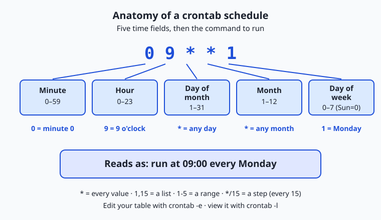

## Why this matters

A machine that never gets bored is one of the great gifts of computing, and today you learn to collect on it. Every task you do by hand — downloading the same dataset each morning, cleaning up a folder that fills with junk, running a report at the end of the day — is a task the computer can do for you, at 3 a.m., without a typo, whether or not you remember. The difference between a practitioner who drowns in busywork and one who ships is very often just this: the second one wrote the busywork down as a script and told the machine when to run it.

This matters directly for the work ahead of you. The pipelines that feed real systems are built from scheduled jobs: pull fresh data on a timer, retrain a model overnight, evaluate it against a held-out set, write a summary, and repeat tomorrow. None of that is exotic — it is the plain shell scripting you met on Day 12 plus one new idea, a scheduler that runs your script on a clock. When a nightly job silently stops producing output, or a "finished in five minutes" task is still running at noon, the person who fixes it fastest is the one who understands what a scheduler is actually doing under the hood.

There are real consequences to getting this wrong. A script that is not safe to run twice can corrupt your data the second time the scheduler fires. A job that writes no log leaves you blind when it fails at midnight — you find out only when the missing report is noticed the next afternoon. A misread schedule field can run an hourly job every minute, hammering a server or a bill. Today you build the mental model and the muscle memory to avoid all three, and you finish Week 2 able to turn any repetitive chore into a dependable, logged, scheduled job.

## The idea in plain language

Automation has two halves. The first half is a script: a saved list of shell commands that does a job when you run it — you already wrote these on Day 12, with variables, loops, and conditionals. The second half is a scheduler: a program, always running quietly in the background, whose only purpose is to launch your script at the times you specify. Put the two together and a chore that needed you at the keyboard becomes a chore the machine does on its own.

The classic scheduler on Unix-like systems is called cron. You give cron a tiny table — one line per job — that says "run this command on this schedule." Each line has five time fields (minute, hour, day-of-month, month, day-of-week) followed by the command. Cron wakes up every minute, checks whether any line matches the current time, and runs the ones that do. That is the entire idea: a clock, a table, and a command runner. Once it is set up, cron needs nothing from you; it will keep running your job next week and next year.

Because your script now runs while nobody is watching, two habits become non-negotiable. The first is logging: an unattended script must write down what it did and whether it worked, because there is no screen for you to read at 3 a.m. The second is idempotency, a slightly fancy word for a simple promise — running the job twice does no more harm than running it once. Scheduled jobs sometimes fire twice, or run on a folder that is already half-organized, so a safe job checks the current state before it acts rather than blindly repeating. Get logging and idempotency right and automation becomes something you can trust; skip them and it becomes something that bites you.

## Historical background

Scheduling jobs by the clock is nearly as old as multi-user Unix itself. The `cron` program was written by Ken Thompson at Bell Labs and shipped with early Version 7 Unix in the late 1970s; the name comes from *chronos*, the Greek word for time. That first version simply woke up once a minute and scanned a single system-wide table of jobs.

The design most systems still use today arrived in 1987, when Paul Vixie wrote a new implementation — widely known as Vixie cron — that gave each user their own crontab, added the readable field syntax with ranges and lists, and became the basis for the cron shipped with Linux distributions and the BSDs for decades. Its companion command `at`, for running a job once at a single future time rather than on a repeating schedule, comes from the same Unix tradition.

As systems grew more demanding, alternatives appeared alongside cron rather than replacing the concept. Apple introduced `launchd` in 2005 with Mac OS X 10.4 "Tiger" to unify service management and scheduling on macOS, where it is now the recommended tool and cron is deprecated though still present. On Linux, the systemd project — which became the default init system across most major distributions through the 2010s — introduced systemd timers, which schedule jobs as first-class managed services. Microsoft Windows has carried a scheduler since the 1990s, evolving into today's Task Scheduler. The tools differ, but every one of them is a descendant of the same 1970s insight: give the computer a clock and a table of jobs, and let it run them for you. That lineage is why the skills you build today transfer to every operating system you will meet.

## What it is — and what it is not

Task automation, in the sense of this lesson, is the pairing of a **script** that performs a job with a **scheduler** that runs that script at chosen times without human involvement. The script is ordinary code — the same commands you would type by hand, saved to a file. The scheduler is a long-running background program that watches the clock and launches the script on cue. Neither part is mysterious: automation is just "the commands you already know" plus "a reliable alarm clock."

It helps to be clear about what automation is *not*. It is not a way to make an unreliable task reliable — a script that fails when you run it by hand will fail exactly the same way at midnight, only now without you there to notice. It is not intelligent: cron does not understand your job, retry it, or reason about failure; it runs the command and moves on. And scheduling is not the same as *writing* the script — the two are separate skills, which is why today you build a solid, safe script first and only then talk about putting it on a timer. Keeping these apart saves confusion later, when a "cron problem" turns out to be a plain scripting bug that has nothing to do with cron at all.

| Common misconception | The reality |
| --- | --- |
| "cron runs my script, so cron is why it failed." | cron only launches the command; a failure is almost always a bug in the script or its environment, reproducible by hand. |
| "If it works when I run it, it will work on a schedule." | Scheduled jobs run with a minimal environment and a different working directory, so paths and variables you rely on may be missing. |
| "Running the job again can't hurt." | A non-idempotent job (blind moves, appends, deletes) can double-apply and corrupt data on a second run. |
| "I'll see the error if something breaks." | Unattended jobs have no screen; without logging, failures are silent until someone notices the missing result. |
| "Automation makes a task safe." | Automation makes a task *repeatable* — if the task is unsafe, automation just makes it unsafe on a schedule. |

## Why it was created and what problems it solves

Cron exists to solve a problem as old as shared computers: important work that must happen on a regular clock, whether or not a human is awake to start it. Early Unix machines needed to rotate their logs at midnight, purge temporary files, mail out reports, and take backups on a fixed rhythm. Doing this by hand was both tedious and unreliable — humans forget, take holidays, and mistype. A small program that reads a table of times and commands and runs them faithfully, forever, removed an entire category of "someone forgot to run it" failures.

The deeper problem it solves is turning human intention into standing infrastructure. Once a job is in the schedule, it is no longer something a person has to remember; it becomes a property of the system. That reliability is exactly why automation underpins so much serious work today. The problems cron addressed in 1975 — do this on a timer, log the result, don't need a person — are the same problems behind every nightly data refresh and scheduled report now. Learning cron is not learning a dusty utility; it is learning the pattern that every modern scheduler still implements, and the reason your future pipelines will keep running long after you have closed your laptop.

## How it works

Let's walk through the machinery: first the shape of a scheduled job, then cron's schedule syntax field by field, then a worked example you can read off by eye.

### The anatomy of a scheduled job

A scheduled job is a background program (the scheduler) that, once a minute, compares the current wall-clock time against a stored list of rules. Each rule pairs a *time specification* with a *command*. When the current time satisfies a rule's specification, the scheduler starts that command as a new process — exactly as if you had typed it — then goes back to sleep until the next minute. It does not wait for the command to finish, and by default it does not show you the output; anything the command prints is captured and, on classic cron, emailed to the job's owner, which is why unattended jobs redirect their output to a log file instead.



### Reading a crontab, field by field

You edit your personal schedule with `crontab -e`, which opens your crontab (cron table) in an editor, and you view it with `crontab -l`. Each active line is one job: five whitespace-separated time fields, then the command to run. The five fields, always in this order, are:

| Position | Field | Allowed values | Meaning of `*` |
| --- | --- | --- | --- |
| 1 | Minute | 0–59 | every minute |
| 2 | Hour | 0–23 (0 = midnight) | every hour |
| 3 | Day of month | 1–31 | every day |
| 4 | Month | 1–12 (or names like `jan`) | every month |
| 5 | Day of week | 0–7 (0 and 7 = Sunday, or names like `mon`) | every weekday |

A field can hold more than a single number. A `*` means "every value." A list like `1,15` means "the 1st and the 15th." A range like `1-5` means "1 through 5." A step like `*/15` in the minute field means "every 15 minutes." So `*/15 9-17 * * 1-5` reads as "every 15 minutes, during the hours 9 through 17, on Monday through Friday" — a weekday business-hours job. The command that follows the five fields is run by the shell, so it can be a script path, a program with arguments, or a small pipeline.

### A worked example, read off by eye

Take the line `0 9 * * 1`. Read it left to right against the table above:

```text
0     9     *     *     1        command
│     │     │     │     └── day of week = 1  → Monday
│     │     │     └──────── month       = *  → every month
│     │     └────────────── day of month= *  → every day of the month
│     └──────────────────── hour        = 9  → the 9 o'clock hour
└────────────────────────── minute      = 0  → at minute 0
```

The first two fields pin the time to minute 0 of hour 9 — nine o'clock exactly. The day-of-month and month fields are `*`, so no calendar-date restriction applies. The day-of-week field is `1`, which is Monday. Putting it together: **run at 09:00 every Monday.** Two more you will use constantly: `0 20 * * *` is minute 0, hour 20, every day of month, every month, every weekday — that is **8 p.m. every day**; and `0 6 * * 1` is minute 0, hour 6, on Mondays — **6 a.m. every Monday**. Notice the trap the fields hide: because the schedule is read *from the smallest unit up*, forgetting that the first field is minutes (not hours) is the single most common cron mistake, turning an intended "9 a.m." into "every minute of the 9 o'clock hour."

### From a run to a logged, safe job

Once cron launches your script, the script itself is responsible for behaving well unattended. A well-formed scheduled job follows a predictable flow: the scheduler triggers it on time, the script runs, it writes what it did to a log file, and it ends in a way that records success or failure. If the job might run when its work is already partly done — a folder already sorted, a file already downloaded — it checks first and skips what is done, so a second run is harmless. This flow is the difference between a job you can walk away from and one you have to babysit.



Read the flow from the left: the scheduler fires at the appointed minute; the script starts and does its work; every meaningful action is appended to a log with a timestamp; and at the end the exit status branches — success is logged and the job simply waits for its next scheduled time, while failure is logged loudly (and, in a production setup, would trigger an alert) so a human learns about it. The two safety features woven through this flow — logging every step and being safe to re-run — are what make unattended automation trustworthy rather than terrifying.

## An everyday analogy

Think of an office with a night cleaning crew and a very literal-minded supervisor. The **script** is the cleaning checklist taped to the wall: wipe the counters, empty the bins, lock the doors — a fixed list of steps that anyone can follow without judgment. The **scheduler** is the supervisor holding a clock and a duty roster. The roster is the crontab: each line says which checklist to run and when, such as "run the closing checklist at 8 p.m. every day" (`0 20 * * *`). The supervisor does not do any cleaning and does not understand what "empty the bins" means; they only watch the clock and, when a roster time arrives, hand the matching checklist to the crew.

The safety habits map neatly too. Because the cleaning happens overnight with nobody from the day shift watching, the crew keeps a **logbook** by the door: "10:02 p.m. — counters wiped, 3 bins emptied, all doors locked." In the morning you read the logbook to know the job was done — that is your script's log file. And a good checklist is written so that doing it twice causes no harm: "empty the bin *if* it has anything in it" rather than "throw out a bag" regardless. That is idempotency — the crew can be sent in twice by mistake and nothing breaks. The supervisor with the roster is cron; the checklist is your script; the logbook is your log; and "safe to do twice" is the promise that lets you go home and trust the building will be fine.

## Examples in practice

Start with the smallest possible automation. Suppose you want a heartbeat line written to a file every day at noon. The script is one command; the schedule is one crontab line:

```bash
# crontab line: at 12:00 every day, append a timestamped line to a log
0 12 * * * date '+%Y-%m-%d %H:%M heartbeat' >> "$HOME/heartbeat.log"
```

Read the five fields: minute 0, hour 12, any day, any month, any weekday — noon daily. The `>>` appends (rather than overwrites), so each day adds a line without destroying yesterday's. This is already a real, useful pattern: a job that leaves a dated trail you can inspect later.

Now a job worth scheduling — organizing a folder that fills up with mixed files, which is exactly the lab you will build today. In plain shell, the core is a loop that looks at each file's extension and moves it into a matching subfolder:

```bash
#!/usr/bin/env bash
set -euo pipefail
target="$1"                                   # the folder to tidy, e.g. ~/Downloads
log="$target/organize.log"

for file in "$target"/*; do
  [ -f "$file" ] || continue                  # skip subdirectories
  ext="${file##*.}"                           # everything after the last dot
  dest="$target/$ext"                         # a subfolder named for the extension
  mkdir -p "$dest"                            # make it if needed — safe to repeat
  if [ "$(dirname "$file")" != "$dest" ]; then
    mv "$file" "$dest/"                        # only move if not already there
    echo "$(date '+%F %T') moved $(basename "$file") -> $ext/" >> "$log"
  fi
done
```

Three details make this safe to schedule. `mkdir -p` creates the destination only if it does not already exist, so it never errors on a second run. The `if` guard moves a file only when it is not already in its destination folder, which is what makes the whole script **idempotent** — run it ten times on the same folder and after the first run there is simply nothing left to move. And every move is appended to a log with a timestamp, so tomorrow morning you can read exactly what happened overnight. To put it on a schedule, one crontab line suffices:

```text
0 20 * * * /usr/bin/env bash /path/to/organize_files.sh "$HOME/Downloads"
```

That is 8 p.m. every day. Before trusting it, though, a careful practitioner runs it once with a **dry-run** switch that prints what *would* move without moving anything — the single most valuable safety feature you can build into a destructive script, and one you will add in the lab. In the real world these small jobs compound: a data folder that stays tidy on its own, a report that regenerates each morning, a backup that just happens. Each is the same shape — a safe, logged script plus one line of schedule.

## Implications: security, privacy, performance, scalability, and cost

### Security

A scheduled job is a standing instruction to run code, unattended, possibly for years — so it is a security surface worth respecting. Run each job as the least-privileged user that can do the work; a folder-tidying script has no business running as an administrator. Never schedule a script you have not read, and never `sudo` a scheduled job without a specific reason, because a scheduled command runs itself faithfully long after you have forgotten it exists. Because cron runs commands through the shell, treat filenames and inputs as untrusted: always quote variables (`"$file"`, not `$file`) so a space or a special character in a filename cannot break the command apart into something you did not intend.

### Privacy

Automation tends to accumulate data quietly. A logging job appends forever unless you rotate or trim it, and those logs may record file names, paths, or timestamps that are mildly revealing about what you work on and when. A scheduled backup copies whatever you point it at, which can include private material you did not mean to duplicate. The privacy-respecting habit is to be deliberate about what a scheduled job records and copies, to keep logs where only you can read them, and to prune them on a schedule of their own rather than letting them grow without bound.

### Performance

Schedulers themselves are almost free — cron sleeps until the top of each minute and costs nothing while idle. The performance question is what your *jobs* do and when they overlap. A job scheduled every minute that sometimes takes longer than a minute can pile up, with copies stacking on top of each other until the machine is swamped; the fix is either to schedule it less often or to have the script refuse to start if a previous run is still going (a "lock"). Heavy jobs — anything that reads a lot of disk or burns a lot of CPU — are usually best scheduled for quiet hours precisely so they do not compete with interactive work, which is the classic reason backups and reindexing run in the middle of the night.

### Scalability

One crontab on one machine is the beginning, not the end. As work grows you schedule jobs across many machines, and the naive approach — the same cron line on every server — means the job runs everywhere at once, which is sometimes wrong (you wanted it to run *once*, not *n* times) and sometimes a thundering herd (every machine hitting the same resource on the same second). This is why larger systems move from per-machine cron to centralized schedulers and workflow tools that run a job once, in the right place, with dependencies between steps. The concept does not change — a clock and a table of jobs — but the coordination does.

### Cost

Scheduling is built into every major operating system at no charge, so the tool itself costs nothing. The cost lives in what the jobs *do*. A poorly timed heavy job can spike a metered resource — bandwidth, compute, an external service you are billed per call for — and a runaway schedule (an hourly job accidentally written to run every minute) can multiply that cost sixtyfold before anyone notices. The discipline of reading the schedule fields carefully, logging what runs, and testing with a dry run is not just about correctness; on any pay-as-you-go system it is directly about the bill.

## Alternatives: free, open source, and commercial

Cron is the classic, but every operating system ships its own scheduler, and it is worth knowing which to reach for. All of the built-in options below are **free** — scheduling is a standard part of the operating system you already paid for (or downloaded free).

| Scheduler | Platform | How you use it | When to choose it |
| --- | --- | --- | --- |
| **cron** | Linux, macOS, BSD, WSL | `crontab -e` to edit, `crontab -l` to list; five time fields per line | Simple recurring jobs on Unix-like systems; the most portable, widely understood choice |
| **launchd** | macOS | Write a `.plist` file describing the job and its `StartCalendarInterval`, load it with `launchctl` | The recommended tool on modern macOS, especially for jobs that must run even if a scheduled time was missed while asleep |
| **systemd timers** | Most Linux distros | Write a `.timer` unit paired with a `.service` unit, enable with `systemctl` | Linux jobs that benefit from logging via `journalctl`, dependencies, and resource limits managed like any other service |
| **Task Scheduler** | Windows | Create a task in the Task Scheduler GUI or with `schtasks`/PowerShell | Native scheduling on Windows without installing anything |
| **`at`** | Linux, macOS | `echo "command" \| at 20:00` to run once at a future time | A single future run rather than a repeating schedule — a one-off reminder or delayed job |

How to read this practically: on Linux servers, cron is still the default reach-for-it tool for simple jobs, and systemd timers when you want the job managed and logged like a service. On macOS, launchd is the modern recommendation — cron still works but is deprecated, and launchd has the real advantage of catching up on jobs missed while the Mac was asleep, which cron never runs. On Windows, Task Scheduler is the native answer, or run cron inside WSL if you want the Unix workflow. And whenever you need "just once, later" rather than "every day," `at` is the small tool built for exactly that. The good news for a beginner: the crontab five-field syntax you learn today is the lingua franca — even the other tools describe the same minute/hour/day/month/weekday idea, so learning cron teaches you all of them.

## Comparison with related concepts

| Concept A | Concept B | Key difference |
| --- | --- | --- |
| Shell script | Scheduled job | A script is the list of commands; a scheduled job is that script plus a scheduler deciding *when* it runs |
| cron | `at` | cron runs a command repeatedly on a recurring schedule; `at` runs a command once at a single future time |
| cron | systemd timer | cron is a compact five-field line; a systemd timer is a managed service with logging, dependencies, and missed-run handling |
| Idempotent job | Non-idempotent job | An idempotent job is safe to run any number of times; a non-idempotent one can double-apply and corrupt data on repeat |
| Dry run | Real run | A dry run prints what *would* happen and changes nothing; a real run performs the actions |
| Foreground command | Background scheduler | A foreground command needs you present to start it; a background scheduler runs standing jobs with no one watching |

## When to use it — and when not to

Reach for scheduled automation when a task is genuinely repetitive, happens on a predictable clock, and is error-prone or tedious by hand — the tidy-the-folder, pull-the-data, run-the-report, take-the-backup family of chores. These are the jobs where a machine that never forgets and never mistypes pays for itself immediately, and where writing the script once saves you the same five minutes every single day. Automate especially the jobs whose *absence* is expensive: the backup you would sorely miss, the cleanup that prevents a disk from filling, the refresh that keeps downstream work from going stale.

Know equally when to leave a task manual. Do not automate something you do not yet fully understand or trust — automate the version you have already run safely by hand many times, never a first draft. Do not schedule a genuinely one-off task; that is what `at` or simply doing it is for. Be cautious automating anything destructive or irreversible without a dry-run mode and solid logging first — a scheduled `rm` you got slightly wrong will delete faithfully, every night, until you catch it. And remember that automation is not free maintenance: a scheduled job is a small piece of standing infrastructure that can break silently when the world around it changes, so every job you add is a job you have quietly promised to keep an eye on. The professional habit is to automate the boring, well-understood, safely-repeatable work — and to keep judgment, novelty, and anything you cannot yet run twice without fear firmly in human hands.

This lesson closes Week 2, your week on the command line. You began at the terminal itself (Day 8), learned to move around the filesystem (Day 9), to slice text with tools like `cat`, `grep`, and `sed` (Day 10), to shape your environment with variables and shell configuration (Day 11), to write real scripts with variables, loops, and conditionals (Day 12), and to install software cleanly with package managers (Day 13). Today ties the thread together: a script (Day 12) that lives in the filesystem (Day 9), reads its environment (Day 11), processes text and files (Day 10), and now runs on a schedule with no one watching. Everything converges in the **Week 2 project, a Personal Automation Script** — a small, genuinely useful tool of your own that organizes, backs up, or reports on something you care about, safely and on a timer. Today's lab is your rehearsal for it.

## Knowledge check

Try these from memory before looking back:

1. Name the five crontab time fields in order, and say what a `*` means in any one of them.
2. Decode the schedule `30 6 * * 1-5` in plain English, hour and days included.
3. Explain, to someone who has never scheduled a job, why an unattended script must write a log file — and what goes wrong without one.
4. What does it mean for a script to be idempotent, and why does a scheduled job especially need to be? Give one concrete way the file-organizing script achieves it.
5. A colleague says "the cron job is broken." What is the very first thing you would check, and why is it usually *not* cron's fault?

## Hands-on exercise

Time to build a real, safe automation. In this exercise — worked through in full in the Day 14 lab directory — you will write a script that organizes a folder by file extension, add a dry-run mode so it can preview its actions without touching anything, make it log every move, and confirm it is safe to run twice. Crucially, you will **not** modify your real crontab or touch any file outside a folder you create for practice; scheduling is something you read about and understand today, and opt into manually only when you are ready.

Create a scratch folder with a few mixed files, then run the completed script in preview mode first:

```bash
mkdir -p ~/organize-demo
cd ~/organize-demo
touch report.pdf notes.txt photo.jpg data.csv archive.zip
```

Now run the lab's finished script with the dry-run flag, which prints what it *would* do and changes nothing:

```bash
bash /path/to/lab/examples/organize_files.sh --dry-run ~/organize-demo
```

Read the output: one "would move" line per file, and — because it is a dry run — the folder is left exactly as it was. When the preview looks right, run it for real:

```bash
bash /path/to/lab/examples/organize_files.sh ~/organize-demo
```

This time the files land in subfolders named `pdf/`, `txt/`, `jpg/`, `csv/`, and `zip/`, and each move is recorded in `~/organize-demo/organize.log`. Run the same command a second time to feel idempotency in action: nothing moves, because everything is already sorted.

### Expected output

A dry run on the demo folder above prints something like this (order may vary by system):

```text
[dry-run] would create directory: /home/you/organize-demo/pdf
[dry-run] would move report.pdf -> pdf/
[dry-run] would move notes.txt -> txt/
[dry-run] would move photo.jpg -> jpg/
[dry-run] would move data.csv -> csv/
[dry-run] would move archive.zip -> zip/
[dry-run] complete: 5 file(s) would be organized, 0 changes made
```

Then the real run reports the same moves as actions taken, and a second real run reports `0 file(s) organized` — the proof that the script is idempotent. The `organize.log` file holds one timestamped line per actual move.

### Validate your work

You are done when you can check every box:

- [ ] A dry run prints "would move" lines and leaves the folder untouched (check with `ls`).
- [ ] A real run moves each file into a subfolder named for its extension.
- [ ] After a real run, `organize.log` contains one timestamped line per moved file.
- [ ] A second real run moves nothing and reports zero files organized.
- [ ] You can write the crontab line for "8 p.m. every day" and explain each field — without adding it to your real crontab.

### Troubleshooting

- **"No such file or directory" for the target folder.** Pass a folder that exists; create the demo folder first with `mkdir -p ~/organize-demo`.
- **Files with no extension or hidden dotfiles behave oddly.** The script skips entries with no clear extension on purpose; that is expected, not a bug — read the completed script's comments to see how it guards these cases.
- **The dry run seems to change files.** It must not. If it does, you are running the real command by accident — check that `--dry-run` comes through as an argument and re-read the script's flag handling.
- **A scheduled version never runs.** That is out of scope for this lab (you do not schedule anything real here), but the usual cause is a relative path: cron runs with a bare environment, so always give scripts and folders absolute paths in a crontab line.

### Common mistakes

- **Skipping the dry run on a destructive script.** Always preview a move-or-delete job before trusting it. Building the dry-run mode first is the habit that saves your data.
- **Writing a non-idempotent move.** A blind `mv` that does not check whether the file is already in place can error or misbehave on a second run; guard every action so re-running is harmless.
- **Forgetting to quote paths.** A filename with a space breaks an unquoted command. Quote every variable (`"$file"`) so spaces and special characters are safe.
- **Misreading the schedule fields.** The first field is minutes, not hours — `0 9 * * 1` is 9 a.m. Monday, while `9 * * * *` is minute 9 of *every* hour. Read the fields smallest-unit-first, every time.

## Practice assignment

Open the automation worksheet in the starter directory of the Day 14 lab and complete it. Write, from the field definitions alone, the crontab line for **"every day at 8 p.m."** and the line for **"every Monday at 6 a.m.,"** and next to each, spell out what every one of the five fields means. Then, using the sample folder listing given in the worksheet, predict the exact dry-run output the organizing script would produce — which subfolders it would create and which files it would move — before you run it. Finally, run the script in dry-run mode against your own real prediction and note any difference. Keep the worksheet; the Week 2 project builds directly on it.

## Extension challenge

Extend the organizing script with one more piece of real-world polish, then reason about scheduling it safely. First, add a small feature: after sorting, have the script append a one-line **summary** to its log — a timestamp and the count of files moved this run — so a week of logs tells the story of the folder at a glance. (Hint: keep a counter in the loop and write it once at the end, the same way the script already writes per-file lines.) Then, on paper only, design the schedule you would give it if this were your real Downloads folder: pick a time, write the full crontab line with an absolute path to the script and the folder, and write two sentences on why that time is a good choice and what log you would check the next morning to confirm it ran. You have now designed a complete, safe, self-documenting automation — a script that previews, acts, logs, and is safe to repeat — which is exactly the shape of the Personal Automation Script you will build for the Week 2 project.
