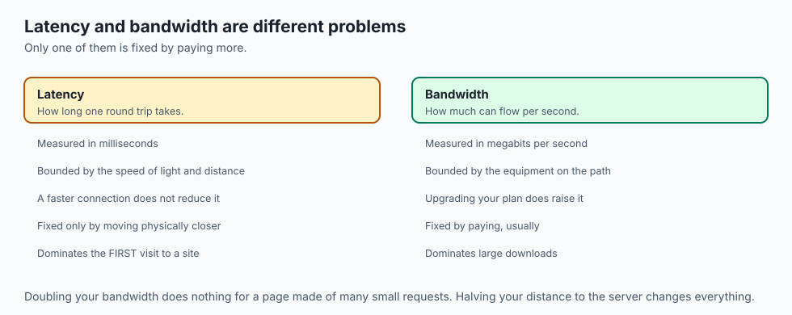
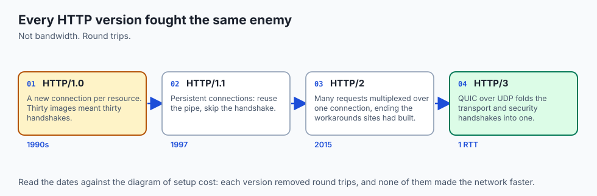
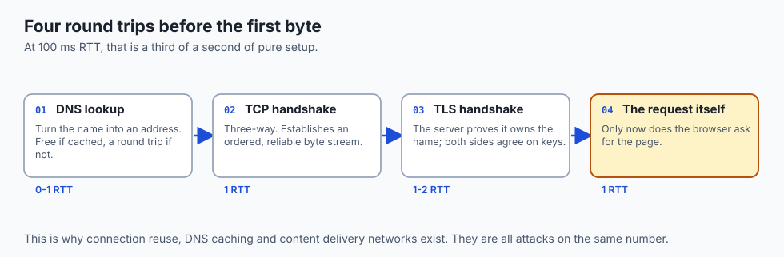
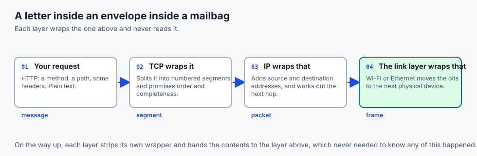
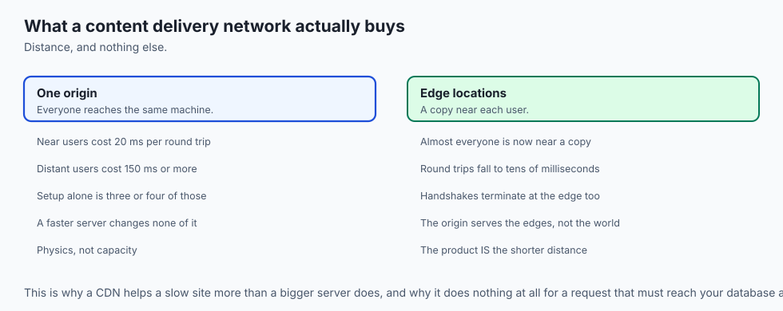
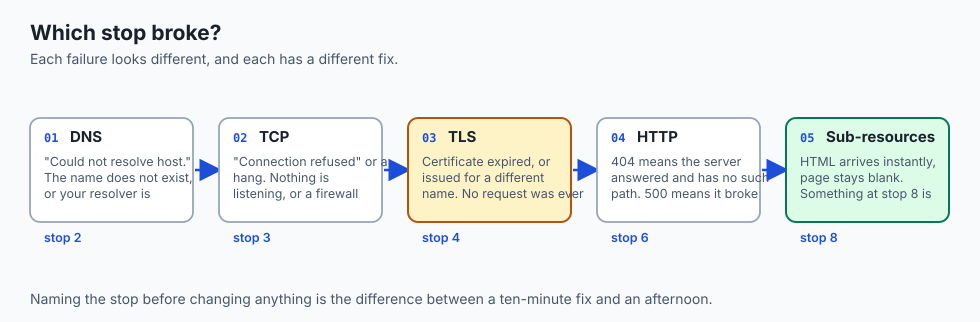
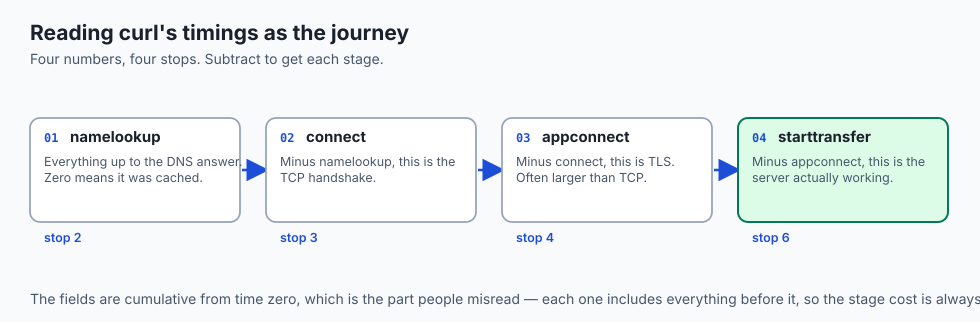
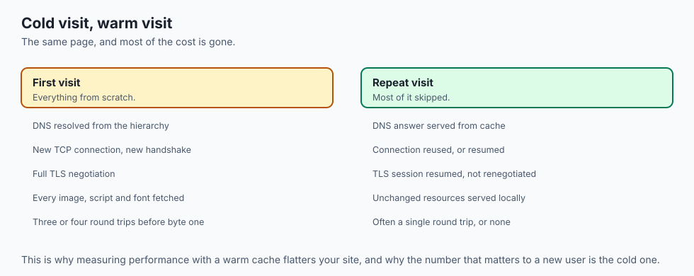

## Why this matters

- **Every model API call is this journey.** DNS, TCP, TLS, request, response — the
  same nine stops, every time.

- **Latency is why streaming responses exist.** Waiting for a whole answer costs a
  round trip plus generation; streaming hides most of it.

- **"The API is slow" is usually four different things**, and today you learn to tell
  them apart.

- **Deployment decisions are latency decisions.** Which region, which edge, how many
  connections — all answered here.

- **This is Week 3**, and it turns the network from weather into machinery.

---

## The idea in plain language



- **Pressing Enter starts a chain of nine steps**, and only one of them is the server
  doing your work.

- **The first four are pure setup**: parse the address, look up the name, open a
  connection, secure it.

- **Each of those costs a round trip** — the time for a signal to reach the server
  and come back.

- **Round trips are bounded by physics.** A faster computer does not shorten them.
- **The whole design of the modern web is an attack on that number**: caching,
  connection reuse, and moving content closer to you.

---

## Historical background



- **The web was one request for one document**, in 1991. No images, no scripts, no
  connection reuse.

- **HTTP/1.0 opened a new connection per resource**, which made a page of thirty
  images cost thirty handshakes.

- **HTTP/1.1, 1997, added persistent connections** — reuse the pipe, skip the
  handshake — and that single change is most of the era's speed-up.

- **HTTP/2, 2015, multiplexed many requests over one connection**, ending the
  workarounds sites had built to dodge the limit.

- **HTTP/3 moved to QUIC over UDP**, folding the transport and security handshakes
  together to save a round trip.

- **Every version has been about the same enemy.** Not bandwidth. Round trips.

---

## What it is — and what it is not

**It is:**

- A chain of independent steps, each of which can fail differently.
- Mostly setup, on a first visit to a distant server.
- A layered system, where each layer treats the one below as a reliable service.

**It is not:**

- **Not one connection to one machine.** A modern page touches a dozen hosts.
- **Not sequential after the first response.** Sub-resources are fetched in parallel.
- **Not a bandwidth problem, usually.** The first visit is slow because of distance,
  not capacity.

- **Not something the browser hides from you.** Every step is visible in developer
  tools, which is Day 21.

---

## Why it was created and what problems it solves



- **Names instead of numbers.** DNS exists so you type `example.com` rather than
  `104.20.23.154`, and so the address can change without the name changing.

- **Reliability over an unreliable network.** TCP turns a medium that loses and
  reorders packets into an ordered, complete byte stream.

- **Privacy and authenticity.** TLS proves the server owns the name and stops anyone
  on the path reading or altering the conversation.

- **A common language.** HTTP is a text protocol simple enough that you can type it
  by hand, which is why everything speaks it.

- **Independence between layers.** Wi-Fi changed completely without HTTP noticing.

---

## How it works

### The journey, stop by stop


| # | Stop | What happens | Cost |
| --: | --- | --- | --- |
| 1 | **URL parsing** | Split into scheme, host and path; `https` defaults to port 443 | free |
| 2 | **DNS lookup** | Turn the name into an address | 0–1 round trips |
| 3 | **TCP connection** | Three-way handshake; guarantees order and completeness | 1 round trip |
| 4 | **TLS handshake** | Server proves it owns the name; keys agreed | 1–2 round trips |
| 5 | **HTTP request** | Method, path and headers — a short block of text | — |
| 6 | **The server** | Reads a file, runs code, queries a database | the variable part |
| 7 | **HTTP response** | Status line, headers, and usually HTML | — |
| 8 | **Parse and fetch more** | The HTML names CSS, scripts, images, fonts | often parallel |
| 9 | **Render** | Build the model, style, script, lay out, paint | — |

- **Stops two through four are pure setup**, and on a distant connection they can
  outweigh the time the server spends doing the actual work.

- **Where each can fail is worth knowing**: name not found at stop 2, connection
  refused at 3, expired certificate at 4, 404 or 500 at 6.

### The layered model underneath




| Layer | Job | Example | Unit |
| --- | --- | --- | --- |
| Application | Agree what is asked and returned | HTTP, DNS, TLS | Message |
| Transport | Deliver bytes reliably to the right program | TCP, UDP | Segment |
| Internet | Address and route across networks | IP | Packet |
| Link | Move bits to the next physical device | Wi-Fi, Ethernet | Frame |

- **Each layer treats the one below as a reliable service** it need not understand.
- **This is Day 1's abstraction stack**, applied to distance instead of silicon.

### Why round trips matter


- **Round-trip time is the single most useful number in networking.**
- **Signals travel near light speed, but the planet is large.** Between continents,
  a round trip is often tens to well over a hundred milliseconds.

- **That floor cannot be optimised away** by a faster computer at either end.
- **A cold HTTPS connection costs three or four round trips** before the first byte
  of the page arrives.

- **At 100 ms RTT that is a third of a second** spent purely on setup.

---

## An everyday analogy



Ordering a book from another country.

| The order | The request |
| --- | --- |
| Looking up the shop's address | DNS |
| Phoning to check they are open | TCP handshake |
| Agreeing you are talking to the real shop | TLS handshake |
| Saying which book you want | The HTTP request |
| Them finding it on a shelf | The server's work |
| The parcel arriving | The response |
| Realising you also need the sequel | Sub-resource requests |

- **Most of the wait is the post, not the shelf.** The shop found your book in
  seconds; the distance took days.

- **Ordering ten books at once** costs one journey, not ten. That is connection
  reuse.

- **A local branch changes everything**, which is what a content delivery network is.

---

## Examples in practice

- **A site that is fast for you and slow overseas**: nothing is wrong with the
  server. The distance is the cost.

- **`curl` reporting most of its time in `namelookup`**: a DNS problem, not a
  server problem.

- **A certificate error**: stop 4 failing, before any request was made.
- **A page whose HTML arrives instantly and then sits blank**: stop 8 — a slow or
  blocking sub-resource.

- **An API call that is fast on the second try**: DNS and connection both cached, so
  three round trips vanished.

---

## Implications: security, privacy, performance, scalability, and cost



- **Security: TLS is what makes the rest safe**, and it authenticates as much as it
  encrypts. Without it you cannot know who answered.

- **Privacy: DNS lookups have historically been plaintext**, so the names you resolve
  were visible even when the pages were not. Encrypted DNS is the response.

- **Performance: the fix is almost never "a faster server".** It is fewer round
  trips, and shorter ones.

- **Scalability: connection setup costs the server too.** TLS handshakes are
  computationally real, which is why reuse helps both ends.

- **Cost: a content delivery network is bought to reduce distance**, not capacity.
  That is the whole product.

- **Cost of failure varies by stop.** A DNS misconfiguration takes a site down
  globally in a way a slow database never does.

---

## Alternatives: free, open source, and commercial



| Tool | Type | What it shows you |
| --- | --- | --- |
| Browser developer tools | Bundled, free | The whole waterfall, per resource |
| `curl -w` | Free, built in | Time spent in each phase, numerically |
| `dig` | Free, built in | Exactly what DNS returned, and from where |
| `ping`, `traceroute` | Free, built in | Round-trip time and the path taken |
| `mtr` | Free, open source | Traceroute and ping combined, continuously |
| WebPageTest | Free tier | The same page loaded from other continents |

- **`curl -w '%{time_namelookup} %{time_connect} %{time_starttransfer}\n'`** turns
  "it feels slow" into four numbers you can act on.

- **Test from another continent before assuming your site is fast.** Yours is the
  least representative measurement available.

---

## Comparison with related concepts

| Term | What it actually is |
| --- | --- |
| **Round-trip time** | Time for a signal to reach the server and return |
| **Latency** | Delay before transfer begins |
| **Bandwidth** | How much data can flow per second |
| **Throughput** | How much actually flowed |
| **Handshake** | The exchange that establishes a connection |
| **CDN** | Copies of content held physically closer to users |

---

## When to use it — and when not to

- **Use this model whenever something is slow**, to find out *which* stop is slow
  before changing anything.

- **Use `curl -w` before optimising.** Guessing which stage costs the time is how
  afternoons disappear.

- **Reuse connections** for anything that makes more than one request. In Python
  that means a session object, not a bare call.

- **Do not optimise bandwidth for a latency problem.** They are different numbers
  with different fixes.

- **Do not measure only from your own machine**, which is usually close to your
  server and always warm.

- **Do not disable TLS to make things faster.** The saving is one round trip; the
  cost is everything.

---

## The AI connection



- **Every model API call pays this cost**, and a loop that opens a new connection
  each time pays it repeatedly for no reason.

- **Streaming responses exist because of latency.** The first token arrives after one
  round trip rather than after the whole generation.

- **Inference region matters as much as inference speed.** A model 200 ms away has a
  floor you cannot optimise past.

- **Batching trades latency for throughput** — the same trade-off in a different
  costume.

- **Downloading a 10 GB model is a bandwidth problem**; calling an API a thousand
  times is a latency problem. They need opposite fixes.

---

## Knowledge check

```yaml
quiz:
  question: "An API responds in 40 ms when called from a server in the same region and 350 ms from a laptop overseas, with identical payloads. Upgrading the laptop's internet plan changes nothing. Why?"
  options:
    - "The extra time is round-trip latency set by distance, which bandwidth does not affect"
    - "The overseas request is being throttled by the API provider's rate limits"
    - "The laptop's connection has insufficient bandwidth for the response size"
    - "TLS negotiation is slower on consumer hardware than on server hardware"
  answer_index: 0
  explanation: "The payload is identical, so capacity is not the constraint. The difference is the time a signal takes to cross the distance and come back, several times over for setup — a floor set by physics that no plan upgrade moves."
```

---

## Hands-on exercise

Time each stage of a real request and find where the time goes. Worked through
fully in the Day 15 lab directory.

| What you are measuring | Command |
| --- | --- |
| Round-trip time to a host | `ping -c 5 example.com` |
| What DNS returns | `dig example.com +short` |
| Time spent in each phase | `curl -w "@curl-format.txt" -o /dev/null -s https://example.com` |
| The path packets take | `traceroute example.com` |
| A cold connection versus a warm one | Run the `curl` twice and compare |
| The same site from far away | A public testing service, or a remote host |

### Expected output

```text
namelookup:  0.024s
connect:     0.061s
appconnect:  0.128s
starttransfer: 0.171s
total:       0.174s
```

- **`namelookup` to `connect` is one round trip** — the TCP handshake.
- **`connect` to `appconnect` is TLS**, and here it cost more than TCP did.
- **`starttransfer` minus `appconnect` is the server's actual work**: 43 ms of a
  174 ms total. Setup was three quarters of it.

### Validate your work

- [ ] You can name the four phases `curl` reports and which stop each corresponds to
- [ ] You measured a cold request and a warm one and can explain the difference
- [ ] You found a host where DNS lookup was the largest component
- [ ] You ran `traceroute` and counted the hops
- [ ] You can state your round-trip time to a server on another continent
- [ ] `bash tests/run_tests.sh` reports 0 failures

### Troubleshooting

- **`ping` gets no reply.** Many hosts drop ICMP deliberately. Use `curl` timing
  instead; it does not prove anything is wrong.

- **`traceroute` shows rows of asterisks.** Routers are not obliged to answer. The
  path still works.

- **`namelookup` is 0.000s.** Already cached. Try a name you have not visited.
- **`appconnect` is 0.** You requested `http`, not `https`, so there was no TLS.

### Common mistakes

- **Measuring once.** The first request and the tenth measure different things.
- **Testing only from your own location**, which is the least representative one.
- **Blaming the server for DNS time.**
- **Confusing bandwidth with latency**, and buying the wrong fix.

---

## Practice assignment

- **Time five sites** on different continents and tabulate the four phases for each.
  Rank them by setup cost rather than total.

- **Find one site where TLS costs more than TCP**, and one where it does not, and
  form a hypothesis about why.

- **Measure the same site cold and warm** ten times each, and report the median
  rather than the best.

- **Draw the nine stops from memory**, then check yourself against the diagram.

---

## Extension challenge

- **Measure the connection-reuse saving.** Make ten requests with a fresh connection
  each, then ten over one reused connection, and report the difference per request.

- **Find your own physical floor.** Compute the theoretical light-speed round trip to
  a server you know the location of, and compare it with your measured `ping`. The
  ratio tells you how much of the delay is distance and how much is equipment.

- **Break a certificate deliberately** using one of the public test sites for expired
  and mismatched certificates, and observe exactly which stage fails.

- **Compare HTTP/1.1 and HTTP/2** on a page with many small resources, using
  `curl --http1.1` and `--http2`, and explain the difference in terms of round trips.

---

