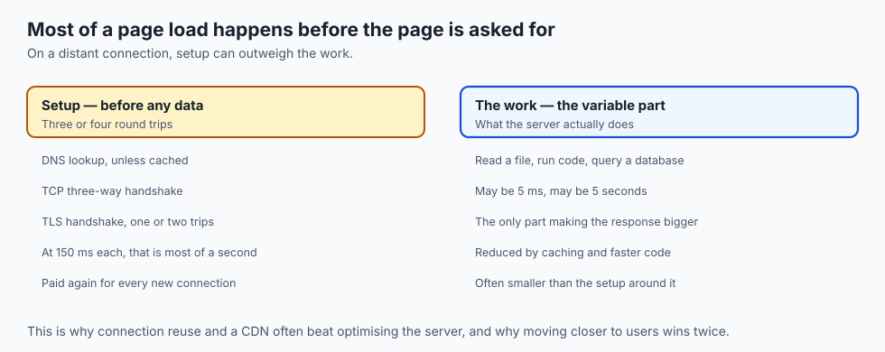

## Why this matters

You will spend a large part of your working life waiting for one computer to answer another. Every time you call a hosted model, download a dataset, pull a package, hit an API, or open a dashboard, your machine sends a request across a network and waits for a reply. When that reply is slow, or never comes, or comes back as a cryptic error, the difference between an engineer who fixes it in minutes and one who flails for an afternoon is a clear mental model of the journey a request actually takes.

That journey is the subject of this lesson, and it is more consequential than it looks. Why does a service feel snappy from one office and sluggish from another? Because part of the delay is the physical distance a signal travels, and every extra back-and-forth trip multiplies it. Why does an application sometimes hang for exactly a few seconds before failing? Because a name lookup or a connection attempt is timing out on a fixed schedule. Why does the first request to a fresh server cost more than the ones after it? Because setting up a secure connection takes several round trips that later requests get to skip. None of this is mysterious once you can name the stops along the way.

Today is the opening map for the whole networking part of this course. We will not go deep on any single stop — later days zoom into names and addresses, into the connection protocol, into encryption, into the request format itself. Today you get the end-to-end picture: you type a web address, press Enter, and a precise sequence of events carries your request out to a server and brings a page back. By the end you will be able to trace that sequence yourself, with real tools, on a real site — and you will understand why the same story explains loading a web page, downloading a model, and calling any service on the internet.

## The idea in plain language

Loading a web page is not one action. It is a short pipeline of smaller actions, each of which must finish before the next can start, and each of which can fail on its own.

When you type an address like `https://example.com` and press Enter, your browser first pulls the address apart to see what you are asking for: which protocol (the rules for talking), which host (the machine's name), and which path (the specific resource). But the host is a name meant for humans, and the network only routes to numbers, so your computer performs a **name lookup** — it asks a directory service to translate `example.com` into a numeric address the network can reach. This translation is called DNS, the Domain Name System.

With a number in hand, your computer opens a **connection** to that machine. On the modern web this connection is then **secured**: the two sides run a short negotiation that agrees on encryption keys, so everything that follows is scrambled to anyone listening in between. Only now does your browser send the actual **request** — a small block of text that says, in effect, "please give me the page at this path." The server receives it, does whatever work it needs to (reads a file, runs some code, queries a database), and sends back a **response**: a status code, some headers, and the page's content.

That first response is usually just an HTML document — a skeleton. As the browser reads it, it discovers references to more resources (stylesheets, scripts, images, fonts) and fires off more requests for each, often reusing the connection it already opened. As those pieces arrive, the browser **renders**: it turns the HTML and CSS into the boxes, text, and pictures you see, and runs any scripts. The whole pipeline, on a warm connection, can complete in well under a second — but every stage is a place where time is spent and where things can go wrong.

## Historical background

The idea of a network that survives the loss of any single link goes back to the 1960s. In 1969 the ARPANET, funded by the United States Department of Defense's Advanced Research Projects Agency, connected its first four university nodes and demonstrated **packet switching** — chopping messages into small packets that find their own way across the network rather than reserving a dedicated line. In 1974 Vint Cerf and Bob Kahn published the design for TCP, the Transmission Control Protocol, which later split into TCP and IP (the Internet Protocol). On 1 January 1983 the ARPANET switched over to TCP/IP, the moment often taken as the birth of the internet as a network of networks speaking a common language.

The Domain Name System arrived in 1983 as well, designed principally by Paul Mockapetris, replacing a single shared `HOSTS.TXT` file that had listed every machine by hand — an approach that clearly could not scale as the network grew. DNS distributed the job of translating names to addresses across a hierarchy of servers.

The web itself is younger. In 1989 Tim Berners-Lee, working at CERN, the European physics laboratory near Geneva, proposed a system of linked documents; by 1991 he had built the first web server and browser and defined three things that still run the web today: URLs to address documents, HTTP (the HyperText Transfer Protocol) to request them, and HTML to write them. Security came later: SSL, the ancestor of today's TLS (Transport Layer Security), was developed at Netscape in the mid-1990s so that commerce could happen safely, and over the following decades the web shifted from mostly unencrypted `http://` to almost entirely encrypted `https://`. Each stop on today's journey, in other words, was invented to solve a specific problem, and they were assembled over half a century into the pipeline you use without thinking.

## What it is — and what it is not

Loading a web page is a **client-initiated, request-response exchange over a layered network**. Every word carries weight. *Client-initiated*: your machine (the client) always speaks first; the server waits and answers. *Request-response*: the unit of work is one request and its matching reply — the server does not push pages at you unbidden in the basic model. *Layered network*: the work is divided into cooperating layers, each handling one concern (naming, connecting, securing, formatting) and hiding the others, exactly like the computing stack you met on Day 1.

It is equally important to see what the journey is not. It is not a single, continuous "pipe" that magically appears between you and a website; it is a sequence of discrete, independently failing steps. It is not instantaneous; information travels at a finite speed and each round trip costs real milliseconds. It is not inherently private unless it is encrypted; on plain `http://`, anyone on the path can read and alter what passes. And the server is not a single mystical machine — behind one name there may be caches, load balancers, and many servers, but from your side the whole thing behaves as one responder. Keeping these distinctions straight will save you from a hundred debugging wrong-turns.

| Common misconception | The reality |
| --- | --- |
| "Typing a URL connects me straight to the website." | Several steps happen first: parsing, a name lookup, a connection, and usually a security handshake — before any page is requested. |
| "The whole page arrives in one response." | The first response is usually just HTML; the browser then makes many more requests for styles, scripts, images, and fonts. |
| "A slow site means a slow server." | Delay can come from name lookup, distance (round trips), connection setup, or the browser's own rendering — not only the server's work. |
| "`https` just means the site is trustworthy." | `https` means the connection is encrypted and the server proved its identity for that name — not that the content or company is safe. |
| "The page failed, so the server is down." | The failure may be name resolution, a blocked port, or a timeout somewhere on the path; the server itself may be perfectly healthy. |

## Why it was created and what problems it solves

The web page load exists to solve a deceptively hard problem: let any computer fetch a document from any other computer, anywhere in the world, without the two having ever met, and without either needing to know the details of the machines and networks in between. Before this, sharing information meant physical media or bespoke, incompatible systems. The breakthrough was to agree on a small stack of shared conventions and let everything else vary.

Each layer of that stack solves one sub-problem so the others do not have to. Addressing (IP) solves "how do I refer to a machine anywhere on the planet." Naming (DNS) solves "how do humans use memorable names instead of numbers that change." Reliable delivery (TCP) solves "how do I get a stream of bytes across an unreliable network without pieces going missing or arriving jumbled." Security (TLS) solves "how do I know I am really talking to that server, and keep eavesdroppers out." Formatting (HTTP) solves "how do the two sides agree on what is being asked for and what is being returned." Because each problem is solved once, in a layer, a new browser or a new server or a new kind of network can be built without reinventing the rest. That separation of concerns is why the web could grow from a handful of physics documents to the backbone of modern software — including, as you will see, the way machine-learning services are delivered.

## How it works

Let us walk the journey from the moment you press Enter to the moment the page appears, then step back and see the layered structure underneath it.

### The journey, stop by stop



The diagram above is the whole journey. Nine stops, and the first four happen
before a single byte of the page is requested.

| # | Stop | What happens | Cost |
| --: | --- | --- | --- |
| 1 | **URL parsing** | Split `https://example.com/page` into scheme, host and path; `https` defaults to port 443 | free |
| 2 | **DNS lookup** | Ask a resolver to turn the name into an address such as `104.20.23.154` | 0–1 round trips, often cached |
| 3 | **TCP connection** | Three-way handshake to port 443; guarantees bytes arrive complete and in order | 1 round trip |
| 4 | **TLS handshake** | The server proves it owns the name; both sides agree on keys | 1–2 round trips |
| 5 | **HTTP request** | Method, path and headers — a short block of text | — |
| 6 | **The server** | Reads a file, runs code, queries a database, consults a cache | the variable part |
| 7 | **HTTP response** | Status line, headers, and usually an HTML body | — |
| 8 | **Parse and fetch more** | The HTML names CSS, scripts, images and fonts; each is another request | often parallel |
| 9 | **Render** | Build the page model, apply styles, run scripts, lay out, paint | — |

Read the cost column and the lesson of the day appears on its own: **stops two
through four are pure setup**, and on a distant connection they can outweigh the
time the server spends actually doing the work. That is why connection reuse and
caching matter so much, and why moving a service closer to its users is often a
larger win than making it faster.

| Stop | What happens | Roughly how long | Where it can fail |
| --- | --- | --- | --- |
| URL parse | Split scheme, host, path | Negligible | Malformed address |
| DNS lookup | Name → IP address | 0 ms cached, tens of ms cold | Name not found; resolver down |
| TCP connect | Three-way handshake to the port | ~1 round trip | Port closed; host unreachable |
| TLS handshake | Agree keys, verify certificate | ~1–2 round trips | Expired or invalid certificate |
| HTTP request/response | Ask for the resource, receive it | 1 round trip + server work | 404 not found; 500 server error |
| Fetch sub-resources | Requests for CSS, JS, images | Overlapping round trips | Missing or slow assets |
| Render | Build, style, script, paint | Milliseconds to seconds | Heavy scripts; large images |

### The layered model underneath

Every step above rides on a stack of layers, each responsible for one concern and each treating the layer below it as a reliable service it need not understand. This is the internet's version of the abstraction stack from Day 1.



Read the stack from the top. Your browser speaks the **application layer** — HTTP, the language of requests and responses (with TLS sitting just beneath it to encrypt that conversation). HTTP hands its data to the **transport layer** — TCP — which splits it into segments, numbers them, and guarantees they arrive in order and intact, retransmitting anything lost. TCP hands its segments to the **internet layer** — IP — which wraps each one with source and destination addresses and figures out the next hop toward the destination, across as many networks as it takes. IP hands its packets to the **link layer** — your Wi-Fi or Ethernet — which actually moves bits over the physical medium to the next device. Each layer adds its own wrapper on the way down and strips it on the way up, a process called encapsulation: your request is a letter inside an envelope inside a mailbag inside a truck.

| Layer | Job | Example | Unit |
| --- | --- | --- | --- |
| Application | Agree what is asked and returned | HTTP, DNS, TLS | Message / request |
| Transport | Deliver a byte stream reliably to the right program | TCP (and UDP) | Segment |
| Internet | Address and route packets across networks | IP | Packet |
| Link | Move bits to the next physical device | Wi-Fi, Ethernet | Frame |

### Why round trips matter

The single most useful number in networking is the **round-trip time** (RTT): how long a signal takes to go to the server and come back. Signals travel near the speed of light, but the planet is large — a round trip between continents is often tens to well over a hundred milliseconds, and that floor cannot be optimized away by a faster computer. Notice how many stages in the journey cost "a round trip": the TCP handshake, the TLS handshake, each DNS query that misses its cache, the request itself. A cold `https` connection can therefore cost three or four round trips *before the first byte of the page arrives*. If your RTT to a server is 100 ms, that is a third of a second spent purely on setup. This is why the web works so hard to avoid round trips — by caching DNS answers, keeping connections open and reusing them, and moving content physically closer to you. Latency, not bandwidth, is what makes the first visit to a distant site feel slow.

## An everyday analogy

Picture sending a sealed, urgent letter to a large company across the country and getting a reply — the whole exchange is the request journey.

You start with the company's name, not its address, so you look it up in a directory: that is **DNS**, turning `example.com` into a street address (an IP). To make sure your letter and its reply can go back and forth reliably, you first phone ahead and agree, "I'll send, you confirm, then we begin" — that opening exchange is the **TCP handshake**. Because the contents are confidential, you and the company agree on a private code and verify each other's identity before sending anything real — that is the **TLS handshake**, with the company's certificate acting like notarized letterhead proving they are who they claim. Now you mail your actual message: "Please send me the document at this reference" — the **HTTP request**. The mailroom (the **server**) finds the document, and mails it back — the **response**.

The document turns out to be an index that mentions several appendices, so you fire off more letters for each — the browser fetching CSS, scripts, and images — using the same open channel rather than phoning ahead each time. Finally you spread all the pages on your desk and assemble them into something readable — the browser **rendering** the page. And here is the analogy's sharpest lesson: nothing you do speeds up the mail truck. The distance to the company sets a hard minimum on every round trip, which is why a nearby branch office answers faster than headquarters overseas, and why sending one thick envelope beats sending twenty thin ones that each wait for a reply. Round trips, not the size of any single letter, dominate the felt speed. This analogy carries through the rest of the networking days: addresses, sealed envelopes, confirmations, and the tyranny of distance.

## Examples in practice

Let us make the journey concrete with the tools you will use throughout this section. Suppose you want to understand why a site feels slow.

First, resolve its name to an address, the DNS step, using `dig`:

```text
$ dig +short example.com
104.20.23.154
172.66.147.243
```

Two addresses come back — the name maps to more than one server, a common setup for reliability. Next, measure the round-trip time to one of them with `ping`, which sends tiny packets and times the echo:

```text
$ ping -c 2 example.com
PING example.com (104.20.23.154): 56 data bytes
64 bytes from 104.20.23.154: icmp_seq=0 ttl=58 time=9.414 ms
64 bytes from 104.20.23.154: icmp_seq=1 ttl=58 time=9.219 ms
```

About 9 ms each way here — a nearby edge server. Multiply that by the three or four round trips a cold connection needs and you can predict the setup cost. Now watch the actual connection stages with `curl`, asking it to print the time at which each stage completed:

```text
$ curl -sS -o /dev/null \
    -w "dns=%{time_namelookup}s connect=%{time_connect}s tls=%{time_appconnect}s total=%{time_total}s\n" \
    https://example.com
dns=0.031s connect=0.041s tls=0.088s total=0.140s
```

Read this as a timeline. By 31 ms the name was resolved (DNS). By 41 ms the TCP connection was open — so the handshake took about 10 ms, one round trip. By 88 ms the TLS handshake finished — another ~47 ms for the secure negotiation. The complete response arrived at 140 ms. In one line, `curl` has shown you the first several stops of the journey with real numbers, and told you where the time went: here, mostly in TLS and the server's response, not DNS. That is exactly the reasoning the Day 15 lab has you practice on a site of your choosing.

To see the layer below, `traceroute example.com` lists each network hop between you and the server, and the browser's own **DevTools Network tab** shows every one of the dozens of sub-resource requests a real page makes, with a waterfall of their timings. Five small tools, and the abstract pipeline becomes something you can watch.

## Implications: security, privacy, performance, scalability, and cost



### Security

Because the journey crosses networks you do not control, security is about proving identity and preventing tampering. TLS does both: the server's certificate, signed by a trusted authority, proves it genuinely owns the name you typed, and the negotiated encryption stops anyone on the path from reading or altering the traffic. This is why a certificate warning is never to be clicked past casually — it means the identity proof failed, and you may be talking to an impostor. It is also why plain `http://` is now treated as unsafe for anything that matters.

### Privacy

Even with `https`, the journey leaks some information. The *names* you look up via DNS and the *addresses* you connect to are often visible to your network and your resolver, even though the page contents are encrypted. Observers can see *that* you connected to a host and roughly how much data you exchanged, if not what it said. For anyone handling sensitive requests — including calls carrying private data to a hosted service — this matters: encryption protects the payload, but the metadata of who talked to whom is harder to hide.

### Performance

Performance on the web is dominated by two quantities: **latency** (how long a round trip takes, set largely by distance) and **bandwidth** (how much data per second the pipe carries). Beginners over-focus on bandwidth, but for small requests and connection setup, latency rules — you cannot pay off a round trip with a fatter pipe. The web's performance tricks nearly all attack latency: caching to skip lookups, keeping connections alive to skip handshakes, and content delivery networks that place copies of data physically near you so the round trip is short.

### Scalability

One server cannot answer the world, so a single name usually fronts many machines. Load balancers spread requests across a fleet; caches and content delivery networks serve common responses without troubling the origin at all; and DNS itself can hand different users different addresses to steer them to a nearby data center. From your side the journey looks identical — one name, one response — but behind the name is an elastic system that can grow to millions of simultaneous requests.

### Cost

Every stop has a price. Data transferred out of a data center is metered and billed by the gigabyte. Each round trip a design forces on users is paid in their time and your conversion rate. Serving from a cache or a nearby edge is far cheaper and faster than recomputing a response at a distant origin. Understanding the journey lets you spend wisely: cache what repeats, shorten the distance, and cut the number of round trips a page requires.

## Alternatives: free, open source, and commercial

For a concepts lesson, the useful "alternatives" are the tools and resources for studying and inspecting the journey — differing in depth, format, and cost.

| Resource | Type | What it offers | Cost |
| --- | --- | --- | --- |
| The Day 15 lab in this course | Free | Trace a real page load end to end with `dig`, `ping`, and `curl` | Free |
| Browser DevTools (Network tab) | Free, ships with the browser | A live waterfall of every request a real page makes, with per-stage timings | Free |
| `curl`, `dig`, `ping`, `traceroute` | Free, open source / built in | Command-line inspection of each stop on the journey | Free |
| MDN Web Docs — "How the Web works" | Free reference | A clear written walkthrough of the same pipeline | Free |
| High Performance Browser Networking (Ilya Grigorik) | Free online book | Deep, rigorous treatment of latency, TCP, TLS, and HTTP | Free to read online |
| Wireshark | Open source software | Capture and inspect the actual packets of each layer | Free |
| Crash Course Computer Science — The Internet | Free video series | A short, visual explanation of packets, routing, and protocols | Free |

If you read one thing beyond this course, make it *High Performance Browser Networking* — it turns today's map into working expertise. To *see* the layers live, install Wireshark after this section.

## Comparison with related concepts

| Concept A | Concept B | Key difference |
| --- | --- | --- |
| Latency | Bandwidth | Latency is the delay of one round trip (set by distance); bandwidth is data per second — small requests are latency-bound, big transfers bandwidth-bound |
| DNS | IP address | DNS is the directory that translates a name; the IP address is the number the network actually routes to |
| TCP | IP | TCP delivers an ordered, reliable byte stream to the right program; IP just addresses and routes individual packets and may lose or reorder them |
| HTTP | HTTPS | HTTP is the plain request/response format; HTTPS is the same format carried inside a TLS-encrypted connection |
| Client | Server | The client initiates the request and waits; the server listens and responds |
| URL | Domain name | The domain name is only the host part; a URL also includes the scheme, path, and any query — the full address of a resource |

## When to use it — and when not to

Reach for this mental model whenever a networked thing is slow, flaky, or broken. When a service "hangs," ask *which stop* is stalling: is the name failing to resolve, the connection refusing, the certificate invalid, or the server slow to respond? Each has a different fix, and the tools in this lesson tell them apart in seconds. Reach for it when you design anything that others will call over a network: minimize round trips, cache what repeats, and place data near its users. And reach for it when you read a status page or an incident report, because the vocabulary — DNS, TCP, TLS, HTTP status codes, latency — is exactly the language operators use.

Know, too, when the details should stay hidden. Writing everyday application code, you should not hand-roll socket connections or parse raw packets; mature libraries handle the journey correctly, and reimplementing it invites subtle bugs and security holes. The layered model exists precisely so you can work at the top — make a request, handle a response — and descend to the lower stops only when a measurement points there. The professional habit is the same as on Day 1: operate at the highest layer that solves your problem, and drop down deliberately, tool in hand, when the evidence demands it.

## The AI connection

Here is why this map matters for the work ahead. Every interaction you will have
with a hosted machine-learning system is exactly this journey. Calling a model
over an API is a DNS lookup, a TCP connection, a TLS handshake and an HTTP request
carrying your input, followed by a response carrying the output — the same nine
stops you traced today. Downloading a dataset is the same journey moving far more
data, where bandwidth finally dominates over latency. Deploying your own service
means *being* the server at stop six.

The diagnostic value is the point. When a model call is slow, this lesson tells
you where to look: the round trips to a distant region, the time the model spends
computing, or the size of the response coming back. When it fails, the status code
and the failing stage name the cause.

## Knowledge check

Try these from memory before looking back:

1. List the stops between pressing Enter on `https://example.com` and seeing the page, in order, in one short sentence each.
2. A site takes exactly the same time to start loading from two computers on the same fast connection, but one is across the world from the server. Which quantity explains the gap, and why can a faster computer not fix it?
3. Explain the difference between DNS and an IP address, and why the network needs both.
4. Name the four layers of the internet stack from top to bottom, with the one job each performs.
5. Given `dns=0.030s connect=0.045s tls=0.095s total=0.160s` from `curl`, how long did the TLS handshake take, and how long did the server plus content transfer take after TLS finished?

## Hands-on exercise

Time to watch the journey on a real site. In this exercise — worked through in full in the Day 15 lab directory — you will use three command-line tools to trace the first stops of a page load and read the timings. Open your terminal.

First, resolve a name to its address (the DNS stop):

```bash
dig +short example.com
```

This prints the IP address (or addresses) the name maps to. Next, measure the round-trip time (the cost of one back-and-forth):

```bash
ping -c 2 example.com
```

The `-c 2` sends two packets; read the `time=` values in milliseconds. Finally, watch the connection stages with `curl`, which reports the moment each stage completed:

```bash
curl -sS -o /dev/null \
  -w "dns=%{time_namelookup}s connect=%{time_connect}s tls=%{time_appconnect}s total=%{time_total}s\n" \
  https://example.com
```

Here `-o /dev/null` throws away the page body so you see only the timing line; `-w` names the fields to print. Each number is the elapsed time *from the start* at which that stage finished, so the gaps between them are the cost of each stop.

### Expected output

A typical run (your numbers will differ with distance and network — that is the point):

```text
$ dig +short example.com
104.20.23.154
172.66.147.243

$ ping -c 2 example.com
PING example.com (104.20.23.154): 56 data bytes
64 bytes from 104.20.23.154: icmp_seq=0 ttl=58 time=9.414 ms
64 bytes from 104.20.23.154: icmp_seq=1 ttl=58 time=9.219 ms

$ curl -sS -o /dev/null -w "dns=%{time_namelookup}s connect=%{time_connect}s tls=%{time_appconnect}s total=%{time_total}s\n" https://example.com
dns=0.031s connect=0.041s tls=0.088s total=0.140s
```

Reading the `curl` line: DNS finished at 31 ms, the TCP connection at 41 ms (so the handshake was ~10 ms, one round trip), TLS at 88 ms, and the full response at 140 ms. The gaps are the per-stop costs.

### Validate your work

You are done when you can check every box:

- [ ] You can state the IP address `dig` returned for your chosen site.
- [ ] You can state the round-trip time `ping` reported, in milliseconds.
- [ ] You can read the `curl` line and say when DNS, connect, and TLS each finished.
- [ ] You can compute the TLS handshake duration (connect time subtracted from TLS time).
- [ ] You can name which stop took the most time for your site.

### Troubleshooting

- **`dig: command not found`.** On some minimal Linux systems `dig` lives in a `dnsutils`/`bind-utils` package; or use `nslookup example.com` or `host example.com` instead.
- **`ping` shows no replies or "Request timeout."** Many networks and servers block ping (ICMP) on purpose. A blocked ping does **not** mean the site is down — confirm with `curl`, which uses normal web traffic.
- **`curl` prints `could not resolve host`.** The DNS stop failed: check your spelling and your internet connection; try `dig` on the same name to isolate the problem.
- **All `curl` times are `0.000`.** You are probably offline, or a proxy/firewall blocked the request; reconnect and retry.

### Common mistakes

- **Reading the `curl` numbers as durations instead of timestamps.** Each value is the elapsed time *from the start* at which that stage finished, not the length of that stage. Subtract consecutive values to get each stop's cost.
- **Assuming a blocked `ping` means the server is down.** Ping and web traffic use different protocols; a server can refuse ping while happily serving pages. Always confirm with `curl`.
- **Confusing the DNS time with the total time.** `time_namelookup` is just the first stop; the total includes connection, TLS, the request, and the server's work.

## Practice assignment

Open the journey worksheet in the starter directory of the Day 15 lab and complete it for a website of your choice (pick one you use often). Record: the IP address `dig` resolves it to, the round-trip time `ping` reports, and the DNS, connect, TLS, and total times from `curl`. Then write one short paragraph (5–8 sentences) narrating your site's request journey with its real numbers — which stop cost the most, how many round trips the setup implies given your RTT, and whether the site felt latency-bound (far away, high RTT) or fast and nearby. Keep the worksheet; a later networking lesson builds on it.

## Extension challenge

Go one layer deeper and watch the path itself. Run `traceroute example.com` (on Windows, `tracert`), which lists every network hop between you and the server, with the round-trip time to each. Count the hops and notice where the time jumps — often at the crossing between your provider and the wider internet, or at an ocean. Then compare two sites: one hosted near you and one you know is far away (a government or university site on another continent is a good choice). Run the same `curl` timing command against both and record the difference in DNS, TLS, and total time. Write two or three sentences explaining how distance (visible as RTT in `ping` and hop count in `traceroute`) shows up as slower connection setup in `curl` — you have now measured the tyranny of distance that shapes every networked service, from a web page to a hosted model call.
