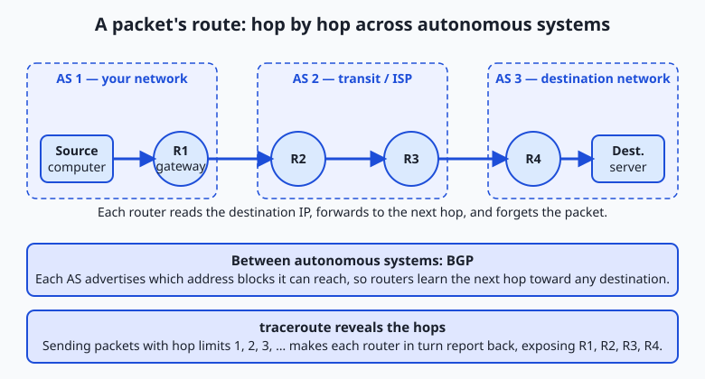

## Why this matters

Yesterday you traced what happens when a web page loads. Today you zoom in on the first thing that has to work before any of that can happen: the network has to find the machine you are talking to and carry your data to it. Every API call you will ever make — to a hosted model service, a database, a payment gateway — begins by turning a name like `api.example.com` into a numeric address, then shoving bytes across a chain of machines until they arrive. When that pipeline is healthy you never think about it. When it breaks, nothing above it works, and the error messages are famously unhelpful.

This is not abstract plumbing. The single most common production incident in a networked service is "I can't reach the server," and the overwhelming majority of those turn out to be one of two things: a name resolved to the wrong address (or no address), or packets could not find a route to the destination. Engineers who can tell those two failures apart in thirty seconds save hours; engineers who cannot end up restarting servers that were never broken. The difference is a working mental model of addressing, naming, and routing — exactly what you build today.

There is money in it too. When you deploy a service and point a domain at it, you are editing DNS records, and a wrong record or a long cache lifetime can make a fix invisible for hours. When your requests are mysteriously slow, the cause is often extra network hops or a distant server, which you can see directly. By the end of this lesson you will be able to interrogate the naming and routing system by hand — the same commands professionals reach for first — and read what it tells you.

## The idea in plain language

Every device on a network has a numeric label called an **IP address** — its location on the network, the way a street address locates a building. To send data to a machine, you need its IP address; a name like `example.com` is a convenience for humans, not something the network itself understands.

The system that turns human-friendly names into IP addresses is the **Domain Name System (DNS)**. It is a giant, distributed directory: you ask "what is the address for `example.com`?" and, after a short lookup that may hop through several servers, you get a number back. DNS is organized as a hierarchy — a small number of *root* servers know where to find the servers for `.com`, `.org`, and every other top-level domain; those in turn know where to find the servers responsible for individual domains like `example.com`; and those *authoritative* servers hold the actual answer. To keep this fast, answers are cached — remembered for a while — at every level.

Once you have an address, your data still has to physically get there, and the destination is almost never directly connected to you. **Routing** is the process by which specialized machines called **routers** pass your data, packet by packet, from one network to the next — each router looking at the destination address and forwarding the packet one hop closer, like a letter moving from post office to post office until it reaches the right town. No single machine knows the whole path; each just knows the next step. Addressing tells you *where*, DNS tells you the address for a *name*, and routing gets you *there*. Those three ideas, together, are how any machine on the internet finds and reaches any other.

## Historical background

In the early days of the ARPANET — the 1970s precursor to the internet — there were few enough machines that every computer kept a single file, `HOSTS.TXT`, listing every host's name and address. The file was maintained centrally at the Stanford Research Institute's Network Information Center and downloaded by everyone. This worked until it didn't: as the network grew, a single hand-edited file that everyone had to fetch became a bottleneck and a single point of failure. Names collided, updates lagged, and the download traffic itself grew unsustainable.

In 1983, Paul Mockapetris designed the Domain Name System to replace it, described in RFCs 882 and 883 (later revised into the still-current RFCs 1034 and 1035). His key move was to make naming *hierarchical and delegated*: instead of one authority for all names, responsibility is divided at each dot, so the operator of `example.com` can manage their own names without asking anyone's permission, and the system scales to billions of names. It is one of the most successful distributed systems ever built, and it has run continuously for over forty years.

Addressing has its own history. The internet's addresses, **IPv4**, were standardized in 1981 (RFC 791) with 32-bit addresses — about 4.3 billion of them. In 1981 that seemed limitless. It was not. By the early 1990s the explosive growth of the internet made exhaustion a visible threat, and two responses emerged. The short-term fix, **CIDR** (Classless Inter-Domain Routing, 1993), and private addressing with **NAT** stretched the existing space by using it more efficiently and letting many devices share one public address. The long-term fix, **IPv6** (first specified in 1998, RFC 2460, now RFC 8200), widened addresses to 128 bits — an almost unimaginably large space. The prediction came true: the central pool of unallocated IPv4 addresses ran out when IANA handed its last five large blocks to the regional registries in February 2011, and the regional registries emptied over the following years. We now live in a long transition, with IPv4 and IPv6 running side by side.

## What it is — and what it is not

An **IP address** is a numeric identifier for a network interface, used by routers to deliver packets. It is *not* a permanent name for a device or a person: addresses are frequently reassigned, shared behind NAT, and changed when you move networks. An IPv4 address is written as four numbers 0–255 separated by dots (a "dotted quad"), such as `93.184.216.34`; each number is one **octet** (8 bits), and the four together make 32 bits. An IPv6 address is written as eight groups of four hexadecimal digits separated by colons, such as `2606:2800:220:1:248:1893:25c8:1946`, with rules for abbreviating runs of zeros.

**DNS** is a naming and lookup system, *not* a routing system and *not* a security system by itself. It maps names to records — most commonly addresses — but it does nothing to move your data or to prove that the server you reach is authentic (that is the job of TLS, which you will meet next). A DNS answer can be stale, cached, or (without extra protections) spoofed.

**Routing** is the forwarding of packets between networks by routers, *not* the same thing as the wire or radio link that carries a single hop. Routing decides the *path*; the physical layer moves bits across each individual segment of that path. And a **router** is not a magic box that knows the whole internet — it holds a routing table of destinations and next hops, and for anything it does not specifically know, it forwards toward a default route "upstream." The whole system works precisely because no participant needs global knowledge.

## Why it was created and what problems it solves

These three mechanisms exist to solve three different scaling problems, and it is worth keeping them separate.

Addressing solves *identity at scale*: for one machine to send data to another across independently operated networks, there must be a globally agreed way to name a destination that any router can interpret. A flat list would not scale, so IP addresses are structured so that the leading bits identify a network and the trailing bits identify a host within it — which is what lets routers make decisions about huge groups of addresses at once instead of memorizing every machine.

DNS solves *human memorability and indirection*. People cannot remember `93.184.216.34`, but more importantly, tying services to raw addresses would make the internet rigid: you could never move a service to a new machine, spread it across many machines, or fail over to a backup without every user editing the address they use. DNS adds a layer of indirection — a stable name that you can repoint at will — which is the quiet foundation of nearly all modern deployment, load balancing, and content delivery.

Routing solves *reachability without central control*. There is no master map of the internet and no central switchboard. Networks are operated by tens of thousands of independent organizations, and routing protocols let them advertise "you can reach these addresses through me" to their neighbors, so that a workable path emerges from local decisions. This decentralization is why the internet has no off switch and why it survives the failure of any single link or router.

## How it works

Follow one request through the whole machine. You type `example.com` into a program and hit enter. Three things must happen in order: resolve the name to an address, then route packets to that address, and the routers along the way must know how to reach it.

### Resolving a name with DNS

Your computer does not usually talk to the DNS hierarchy directly. It asks a **resolver** — a **recursive resolver**, typically run by your ISP or a public provider like `1.1.1.1` or `8.8.8.8` — to do the legwork and return a final answer. The resolver walks the hierarchy on your behalf:

1. **Root.** If it has nothing cached, the resolver asks one of the **root servers**: "who handles `.com`?" The root does not know `example.com`, but it knows the servers for the `.com` **top-level domain (TLD)** and refers the resolver to them. (There are 13 named root server identities, `a` through `m`, each actually a globally distributed fleet.)
2. **TLD.** The resolver asks a `.com` TLD server: "who handles `example.com`?" The TLD server refers it to the **authoritative name servers** for that domain — the ones the domain's owner designated.
3. **Authoritative.** The resolver asks an authoritative server for `example.com` directly, and *that* server returns the actual record — for instance, an **A record** giving the IPv4 address.
4. **Answer and cache.** The resolver hands the address back to your computer and remembers it. Every step's answer carries a **TTL** (time to live) in seconds; until it expires, the resolver serves the cached answer instead of repeating the walk, which is why the second lookup of a name is nearly instant.



DNS answers come in typed **records**, and knowing the common ones is everyday knowledge for anyone who deploys a service:

| Record | Purpose | Example value |
| --- | --- | --- |
| A | Maps a name to an IPv4 address | `93.184.216.34` |
| AAAA | Maps a name to an IPv6 address | `2606:2800:220:1:248:1893:25c8:1946` |
| CNAME | Alias: "this name is really that name" | `www.example.com → example.com` |
| MX | Mail exchange: where email for the domain goes | `10 mail.example.com` |
| TXT | Arbitrary text, used for verification and policy | `"v=spf1 include:_spf.example.com ~all"` |
| NS | Delegates the domain to its authoritative servers | `a.iana-servers.net` |
| TTL | Not a record type but a field on every record: how long it may be cached | `3600` (one hour) |

A **CNAME** is worth dwelling on because it confuses beginners: it does not point to an address, it points to *another name*, and the resolver must then look that name up too. This is how you point `www.example.com` at `example.com`, or a custom domain at a hosting provider's name, without hard-coding an address that might change.

### Routing packets to the address

Now the resolver has returned `93.184.216.34`, and your machine must deliver packets there. Your computer compares the destination to its own network: if the address is on your **local network** it can be delivered directly, but almost always it is not, so your computer sends the packet to its **default gateway** — the router that connects your network to the rest of the internet (in a home, that is your Wi-Fi router).

From there the packet **hops** from router to router. Each router reads the destination address, consults its **routing table** to decide the best next hop toward that destination, and forwards the packet on — then forgets about it. The packet may cross a dozen or more routers, operated by several different companies, before arriving. No router plans the whole route; each makes one local decision.



How do routers in different companies agree on which way is "toward" a destination? The internet is divided into **autonomous systems (AS)** — large networks under single administrative control, each with a number (an ASN), such as an ISP, a university, or a cloud provider. Between autonomous systems, routers run the **Border Gateway Protocol (BGP)**, in which each AS advertises to its neighbors which blocks of addresses it can reach. These advertisements propagate, and every router builds a picture of which neighbor to hand a packet to for any given destination block. BGP is the glue that stitches tens of thousands of independent networks into one internet — and, because it runs largely on trust between operators, a bad advertisement (accidental or malicious) can misroute traffic for a whole region, an event you will occasionally see in the news as a "BGP leak."

You can watch the hops yourself with **traceroute**. It exploits a field in every IP packet called the **TTL** (here meaning "hop limit," a different TTL from the DNS one): each router decrements it, and when it hits zero the router discards the packet and sends back an error. Traceroute sends packets with a hop limit of 1, then 2, then 3, and so on; each elicits an error from the router that far along the path, revealing the routers one by one.

## An everyday analogy

Think of the postal system, and keep it in mind for the rest of the lesson.

An **IP address** is a precise street address: "12 Oak Street, Springfield." It is what actually gets a letter delivered — unglamorous, purely functional, and reassigned when tenants move. A **domain name** is the name on the mailbox, "The Ramirez Family": easy to remember, but the postal service does not route by it.

**DNS** is the directory that turns a name into a street address. You do not personally phone every records office; you ask a helpful clerk — the **resolver** — "where do the Ramirezes live?" If the clerk does not know, they work down a hierarchy: a national office knows which regional office covers each state, the regional office knows the town, and the town clerk has the actual street address. The clerk then writes it on a sticky note and keeps it for a while — the **cache** with its **TTL** — so the next person asking gets an instant answer. If the family moves and the sticky note has not expired yet, the clerk keeps giving the old address: exactly why a DNS change can take time to take effect everywhere.

**Routing** is the mail network moving your letter. Your local post office does not know the route to Springfield; it just knows to send anything not local to the regional sorting center. That center forwards toward the destination region, which forwards to the destination town's office, which delivers to Oak Street. Each office makes one decision — "what is the next hop toward this address?" — and no office holds the entire national map. The independent regional carriers negotiating which routes they will carry are the **autonomous systems** running **BGP**. And **traceroute** is like sending a series of letters stamped "return to sender after passing through N offices," so each office along the route mails one back to you, letting you reconstruct the whole path.

The analogy holds all the way down, with one honest caveat: unlike a physical letter, your data is split into many **packets** that may each take a different route and arrive out of order, to be reassembled at the destination — a resilience trick a single physical letter cannot manage.

## Examples in practice

Let's make it concrete with the exact tools professionals use. Each is free and preinstalled or one package away on macOS and Linux.

**`dig` — the DNS workbench.** Choose `dig` (domain information groper) when you want to see precisely what DNS returns, including record types and TTLs. It is the tool DNS professionals live in. To ask for the IPv4 address of a name:

```bash
dig +short A example.com
```

The `+short` flag strips everything but the answer. Drop it and you get the full response — the question, the answer with its TTL, and which server replied — which is what you want when debugging. To see the whole delegation chain from the root down, `dig +trace example.com` performs the recursive walk itself and prints every referral, turning the hierarchy from an abstraction into something you can read line by line.

**`nslookup` — the everywhere alternative.** Choose `nslookup` when you are on a machine without `dig`, especially Windows, where it is the built-in DNS tool. It answers the same basic question:

```bash
nslookup example.com
```

It prints the resolver it used ("Server") and the addresses it got. It is less precise than `dig` for reading TTLs and record details, but it is universally available, which is exactly when you will reach for it.

**`ping` — is it reachable, and how far?** Choose `ping` to check whether a host responds at all and to get a rough round-trip time. It sends small ICMP "echo request" probes and times the replies:

```bash
ping -c 4 example.com
```

The `-c 4` sends four probes then stops (omit it on Windows, where the default is four; use `-n 4` there instead). Note that some hosts deliberately ignore pings, so "no reply" means "not reachable *or* not answering pings" — a distinction that trips up beginners.

**`traceroute` — where do the packets go?** Choose `traceroute` when a host is slow or unreachable and you want to see the path and where it breaks:

```bash
traceroute example.com
```

Each line is one hop — one router — with its address and the round-trip time to it. On Windows the command is `tracert`. It may print `* * *` for hops that decline to respond; that is normal and does not by itself mean failure.

**`whois` — who owns this name or address?** Choose `whois` to look up registration details for a domain or an IP block — registrar, name servers, and the responsible organization:

```bash
whois example.com
```

None of these tools cost anything, and none require an account. Paid and hosted equivalents exist — DNS-monitoring dashboards, managed traceroute-from-many-locations services, commercial IP-intelligence APIs — and they add scheduling, history, and worldwide vantage points, but every one of them is built on exactly the queries above, which you can run yourself for free.

## Implications: security, privacy, performance, scalability, and cost

### Security

DNS was designed in a trusting era, and its openness is a liability. Because a plain DNS answer is not authenticated, an attacker who can inject a forged reply can send you to the wrong address — the basis of **cache poisoning** and many phishing attacks. Mitigations exist: **DNSSEC** cryptographically signs records so tampering is detectable, and **DNS over HTTPS/TLS** encrypts the query so it cannot be read or altered in transit. Routing has an analogous weakness: BGP largely trusts what neighbors advertise, so a false route can hijack traffic, which is why route-origin validation is slowly being deployed. The lesson for anyone deploying a service: correct DNS and routing are necessary but not sufficient for trust — you still need TLS on top to prove the server is who it claims to be.

### Privacy

Your DNS queries are a log of everywhere you go, and by default they travel in the clear to your resolver, who can see and record them. Choosing a resolver is therefore a privacy decision, and encrypted DNS keeps queries from anyone between you and that resolver. Addresses leak information too: your public IP address reveals your rough geographic location and your ISP, which is why services can geolocate you and why privacy tools route your traffic through intermediaries to present a different address.

### Performance

Naming and routing both cost time before any real work happens. A cold DNS lookup that has to walk the hierarchy can add tens to hundreds of milliseconds; a cached one is nearly free — which is the whole point of TTLs and caching. Routing distance matters too: every hop and every mile adds latency, so a server physically far from your users is slower no matter how fast the server is. This is why content delivery networks place copies of content in many locations and use DNS to send each user to a nearby one — performance engineering that is, at bottom, clever use of the two systems in this lesson.

### Scalability and cost

DNS scales through hierarchy and caching: no server holds the whole namespace, and caching absorbs the vast majority of queries near the user. Routing scales through address aggregation — routers reason about blocks of addresses (CIDR), not individual machines — and through the AS structure that lets the internet grow without any component needing global knowledge. The costs are mostly indirect: DNS hosting is cheap or free for small domains, IPv4 addresses have become a genuinely scarce and traded commodity (a real line item for anyone needing many public addresses), and the operational cost of a *misconfiguration* — a wrong record, a too-long TTL that freezes a mistake in place — is often far higher than any bill.

## Subnets and CIDR, briefly

You will keep meeting one more idea: how addresses are grouped. A **subnet** is a contiguous block of addresses that share a leading prefix and are treated as one local network. **CIDR notation** writes such a block as an address followed by a slash and a number — `192.168.1.0/24` — where the number says how many leading bits are fixed as the network part. A `/24` fixes 24 of the 32 bits, leaving 8 for hosts, so it contains 2⁸ = 256 addresses (`192.168.1.0` through `192.168.1.255`). A `/16` fixes 16 bits and holds 2¹⁶ = 65,536 addresses; each smaller number after the slash doubles the block. This is exactly how routers summarize: "everything in `93.184.216.0/24` goes this way" is one routing-table entry standing in for 256 addresses.

Not all addresses are public. Some ranges are reserved as **private**, usable inside a home or company network but never routed on the public internet; a router performs **NAT** to let many private devices share one public address. And one address is special: `127.0.0.1` (the **loopback**) always means "this very machine."

| Range (CIDR) | Kind | Where it is used |
| --- | --- | --- |
| `10.0.0.0/8` | Private (RFC 1918) | Large internal networks; ~16.7 million addresses |
| `172.16.0.0/12` | Private (RFC 1918) | Medium internal networks |
| `192.168.0.0/16` | Private (RFC 1918) | Home and small-office networks (e.g. `192.168.1.1`) |
| `127.0.0.0/8` | Loopback | The local machine itself; `127.0.0.1` is "here" |
| Everything else routable | Public | Globally reachable, assigned by registries |

If you inspect an address and it falls in one of the private ranges, you know immediately that it is not reachable from outside its own network — a distinction that explains a great many "it works on my machine but not from the server" mysteries.

## Alternatives: free, open source, and commercial

"Alternatives" here means the different resolvers and tools you can choose, and the trade-offs between them.

| Option | Type | What it offers | Cost |
| --- | --- | --- | --- |
| Your ISP's default resolver | Bundled | Works out of the box; your ISP sees your queries | Free |
| Cloudflare `1.1.1.1`, Google `8.8.8.8`, Quad9 `9.9.9.9` | Public resolvers | Fast, global, often with privacy or filtering options | Free |
| `dig` / `nslookup` / `host` | Command-line tools | Direct, precise DNS queries from your own machine | Free / open source |
| BIND, Unbound, Knot | Open-source DNS servers | Run your own resolver or authoritative server | Free / open source |
| Managed DNS (Cloudflare, Route 53, NS1, and others) | Commercial hosting | Authoritative hosting with health checks, geo-routing, dashboards | Free tier to paid |
| IP-intelligence and DNS-monitoring APIs | Commercial | Bulk geolocation, ownership, uptime history, alerting | Paid |

For learning and for most debugging, the free command-line tools and a public resolver are all you need. Managed DNS earns its price when you run real services and want failover, global routing, and change history without operating servers yourself.

## Comparison with related concepts

| Concept A | Concept B | Key difference |
| --- | --- | --- |
| IP address | Domain name | The address is the machine's numeric location; the name is a human label that DNS maps to an address |
| DNS | Routing | DNS finds the *address* for a name; routing carries packets *to* that address |
| A record | CNAME record | An A record gives an actual IP address; a CNAME points to another name that must itself be resolved |
| IPv4 | IPv6 | IPv4 is 32-bit (~4.3 billion addresses, nearly exhausted); IPv6 is 128-bit (effectively unlimited) |
| Public IP | Private IP | A public address is globally routable; a private address (`10.x`, `192.168.x`) works only inside its own network |
| Router | Resolver | A router forwards packets between networks; a resolver answers DNS name lookups |

## When to use it — and when not to

Reach for this mental model the instant a networked thing "can't connect." The disciplined first question is always: *does the name resolve?* Run `dig +short A the-host`. If you get no address or a surprising one, the problem is DNS — a missing record, a typo, a stale cache, a wrong TTL — and no amount of restarting the server will help. If the name resolves correctly but you still cannot connect, the problem is reachability: use `ping` and `traceroute` to see whether packets get to the destination and where they stop. Separating "wrong address" from "can't reach the address" is the highest-leverage debugging habit in all of networking, and these two commands settle it in under a minute.

Reach for it when you deploy: pointing a domain at a new service is a DNS edit, and knowing records and TTLs lets you plan a change (lower the TTL beforehand so the switch propagates fast) instead of being surprised by one. Reach for it when you evaluate performance, because latency you cannot explain often lives in the network path, not your code.

Know when to leave it alone, too. Most of the time DNS and routing simply work, and second-guessing them wastes effort — do not blame the network before you have evidence. Application bugs, expired credentials, firewalls, and full disks masquerade as "connection" problems constantly. The professional habit is to *check* the name-and-route layer quickly and definitively with the tools above, and then, once it is ruled in or out, move on to the layer that actually holds the fault.

Finally, the connection to your larger goal. Every service you call over the network — a hosted model's API endpoint, a vector database, an object store full of training data — is reached by exactly this pipeline: its hostname resolves through DNS to an address, and your packets route there hop by hop. When you deploy a model service of your own and give it a public name, you are creating DNS records for it; when a client reports it "can't reach the server," you now know the first two things to check and the exact commands to check them with. The naming and routing you learned today are the ground floor that everything else in networked software stands on.

## The AI connection

Every model you call over an API and every dataset you download begins with the
lookup you traced today. When a training job fails at hour three with a name
resolution error, the cause is usually DNS inside a container: the image resolves
names differently from the host, and a resolver configured for one network is
useless on another.

The routing half matters for cost as much as for correctness. Data has to travel
from where it is stored to where it is processed, and every hop is latency you
pay on every batch. Training against a dataset in one cloud region from
accelerators in another is a common and expensive mistake — the egress charges
and the added round-trip time both scale with the number of epochs. The
diagnostic habit from today transfers exactly: when something cannot be reached,
establish first whether the name resolved. A successful lookup that then fails to
connect is a routing or firewall problem, and it needs entirely different tools
from a lookup that returned nothing.

---

## Knowledge check

Try these from memory before looking back:

1. In one sentence each, state what IP addressing, DNS, and routing are individually responsible for.
2. Walk the four steps a recursive resolver takes to resolve a name it has never seen, naming root, TLD, and authoritative servers.
3. Explain the difference between an A record and a CNAME record, and why a CNAME requires a second lookup.
4. You run `dig +short A myapp.example.com` and get an address in `10.0.0.0/8`. Why can a user on the public internet not reach that service, and what does the private range tell you?
5. A service "can't be reached." Describe, in order, the two commands you would run first and how each answer redirects your search.

## Hands-on exercise

Time to query the real naming and routing system. In this exercise — completed in full in the Day 16 lab directory — you will resolve a name to its addresses, read its mail record, and trace the path to it, then record what you found. Everything uses a public domain (`example.com`) reserved for exactly this kind of documentation and testing, so you are not probing anyone's private systems.

Open your terminal and run each command:

```bash
dig +short A example.com
```

Prints the IPv4 address(es) the name resolves to — the "street address" DNS returned.

```bash
dig +short AAAA example.com
```

Prints the IPv6 address(es), if the name has any — the same destination in the newer, larger address format.

```bash
dig MX example.com
```

Prints the mail-exchange record: where email for the domain would be delivered. (`example.com` may return an empty or placeholder answer — that itself is a valid, informative result.)

```bash
traceroute example.com
```

Prints the routers your packets pass through on the way to the destination, one hop per line. It can take a while and may show `* * *` for hops that stay silent; that is normal.

On Windows, use `nslookup example.com` for the address lookups and `tracert example.com` for the path; the outputs read the same way.

### Expected output

A representative run (your addresses and hops will differ — that is expected):

```text
$ dig +short A example.com
93.184.216.34

$ dig +short AAAA example.com
2606:2800:220:1:248:1893:25c8:1946

$ dig MX example.com
;; ANSWER SECTION:
example.com.   3600   IN   MX   0 .

$ traceroute example.com
traceroute to example.com (93.184.216.34), 30 hops max
 1  192.168.1.1   3.1 ms
 2  10.0.0.1      9.4 ms
 3  * * *
 ...
 9  93.184.216.34  74.2 ms
```

Reading it: the A record is the IPv4 address; the AAAA record is the same destination in IPv6. The MX answer here uses the special "null MX" (`0 .`), a valid record meaning the domain accepts no mail. In the traceroute, hop 1 is your own router (a private `192.168.x` address), the middle hops are your ISP and transit networks, some decline to answer (`* * *`), and the final line is the destination — the total hop count is how many routers your packets crossed.

### Validate your work

You are done when you can check every box:

- [ ] You captured at least one IPv4 (A) address for the site.
- [ ] You checked whether the site has an IPv6 (AAAA) address and recorded the result.
- [ ] You recorded the MX answer (an address, a null MX, or "none").
- [ ] You ran traceroute and counted the hops to the destination.
- [ ] You can say whether each address you saw is public or private (does it fall in `10.x`, `172.16–31.x`, or `192.168.x`?).

### Troubleshooting

- **`dig: command not found`.** Install it (`brew install bind` on macOS if missing; `sudo apt install dnsutils` on Debian/Ubuntu), or use `nslookup`, which is preinstalled almost everywhere.
- **`traceroute: command not found` (Linux).** Install it with `sudo apt install traceroute` (Debian/Ubuntu) or `sudo dnf install traceroute` (Fedora). On Windows the command is `tracert`, already present.
- **traceroute hangs or shows only `* * *`.** Many networks rate-limit or block the probes; this is normal and not a failure. Let it run to the hop limit, or press Ctrl+C to stop early — you still learn where it got.
- **An empty answer from `dig MX`.** That is a real answer: the domain may have no MX record, or a null MX. Record "none" rather than treating it as an error.

### Common mistakes

- **Confusing an A record with a CNAME.** If `dig A somename` returns another *name* rather than an address in the answer, you are looking at a CNAME chain; follow it with another lookup. A records end in addresses; CNAMEs end in names.
- **Reading `* * *` as "broken."** Silent hops are routers choosing not to reply; the path still works if the final line reaches the destination.
- **Assuming no ping reply means down.** Hosts often ignore pings on purpose. Confirm with a different signal (an actual connection, or a successful DNS + traceroute) before concluding a host is offline.
- **Forgetting caching.** If you change a record and the old value keeps coming back, you are seeing a cached answer that has not hit its TTL yet — wait it out or query an authoritative server directly.

## Practice assignment

Open the DNS worksheet in the starter directory of the Day 16 lab and fill it in completely, using the commands above against `example.com` (and, if you like, one more site of your choice): record the A record IPv4 address, whether an AAAA record exists, the MX answer, and the number of hops traceroute took to reach the destination. Then write one short paragraph (4–6 sentences) narrating what happened when you looked the name up — from your request, to the resolver walking root → TLD → authoritative, to the address coming back and your packets hopping to it — using your own captured numbers. State explicitly whether the final address is public or private and how you can tell.

## Extension challenge

Go one layer deeper into the hierarchy. Run `dig +trace example.com` and watch the resolver walk from the root servers down to the authoritative servers, printing every referral — find the line where a root server hands off to the `.com` servers, and the line where a `.com` server hands off to the authoritative servers for the domain. Then run `dig NS example.com` to see just the authoritative name servers, and `whois example.com` to see who is registered as responsible for the name. Finally, pick any public address you saw today and classify it: is it IPv4 or IPv6, is it public or private, and — using `whois <address>` — which organization's block does it belong to? Write three or four sentences connecting what you found to the three responsibilities from this lesson: the name you started with, the address DNS returned, and the path routing would take to reach it. You have just performed, by hand, the exact lookups that every networked program does invisibly before its real work begins.
