## Why this matters

- **Every service you deploy needs a name pointed at it**, and DNS is how you do it.
- **DNS propagation delays are TTLs**, not magic, and knowing that turns a mysterious
  wait into a number you set yourself.

- **"It works on my machine but not from the server"** is very often a private
  address, and you can recognise one by sight after today.

- **A misconfigured DNS record takes a service down globally**, in a way no code bug
  can.

- **Container and cloud networking is this lesson repeated at a smaller scale**, with
  the same vocabulary.

---

## The idea in plain language

- **An IP address is where.** A name is what people type. DNS turns one into the
  other.

- **DNS is a distributed hierarchy**, not a single directory. No one machine holds it
  all.

- **Every answer carries a TTL** saying how long it may be cached, which is why the
  second lookup is instant and why changes take time to spread.

- **Routing is a chain of local decisions.** No router knows the whole path; each one
  picks the next hop and forgets you.

- **The internet is tens of thousands of independent networks** agreeing, mostly on
  trust, about who can reach what.

---

## Historical background

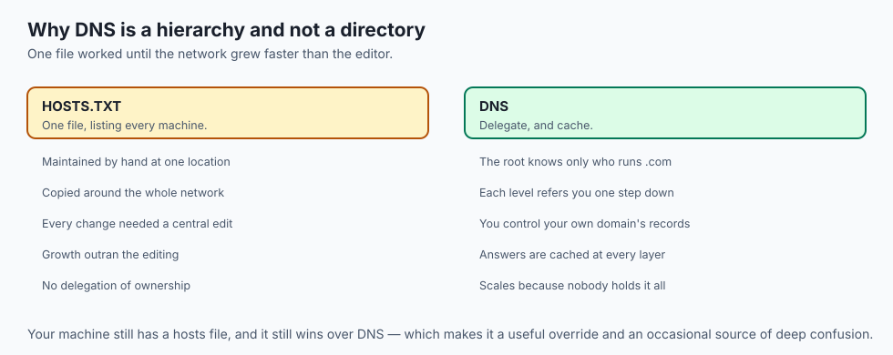

- **Before DNS there was one file.** `HOSTS.TXT` listed every machine on the network,
  maintained by hand at Stanford and copied around.

- **That stopped scaling in the early 1980s**, when the network grew faster than
  anyone could edit a file.

- **DNS arrived in 1983** with the idea that made it work: delegate. The root knows
  who runs `.com`, and nothing more.

- **IPv4 gave 4.3 billion addresses**, which seemed limitless and was not. The last
  large blocks were allocated in 2011.

- **IPv6 followed with 128-bit addresses** — enough that exhaustion is not a
  meaningful concept — though adoption has taken decades.

- **NAT was the stopgap that worked too well**, letting whole networks share one
  public address and relieving the pressure that would have forced IPv6 sooner.

---

## What it is — and what it is not

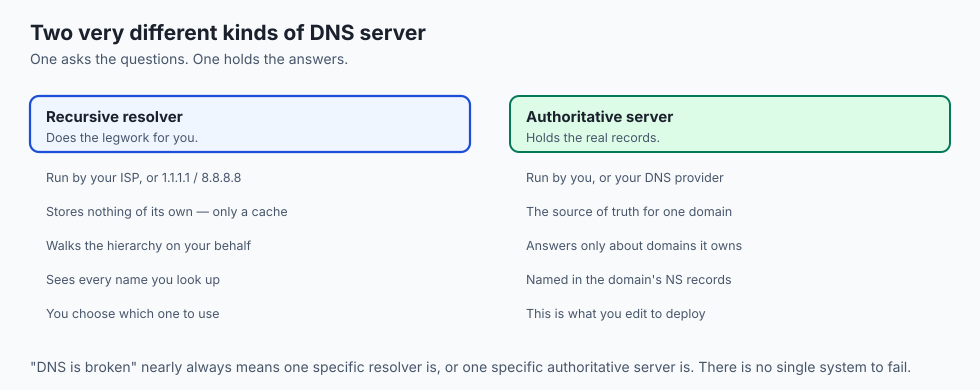

**DNS is:**

- A distributed, cached, hierarchical lookup system.
- Delegated at every level: root, top-level domain, then the domain's own servers.
- Typed — the same name can return an address, a mail route, or arbitrary text.

**DNS is not:**

- **Not a single server.** There is no "the DNS" to be down, though your resolver can
  be.

- **Not instant to change.** A record's old value lives in caches until its TTL
  expires.

- **Not authenticated by default.** Plain DNS has no proof the answer is genuine,
  which is what DNSSEC and encrypted DNS address.

- **Not a directory of what exists.** You cannot list a domain's names; you can only
  ask about ones you already know.

---

## Why it was created and what problems it solves

- **Humans do not remember numbers.** Names are the interface; addresses are the
  implementation.

- **Addresses change and names should not.** Move a service to new hardware and only
  the record changes.

- **One name can mean several machines**, which is how load balancing and failover
  begin.

- **Delegation lets ownership be distributed.** You control your domain's records
  without asking anyone.

- **Routing had to work without central coordination**, because no single
  organisation runs the internet — so each router makes one local decision and
  networks advertise what they can reach.

---

## How it works

### Resolving a name

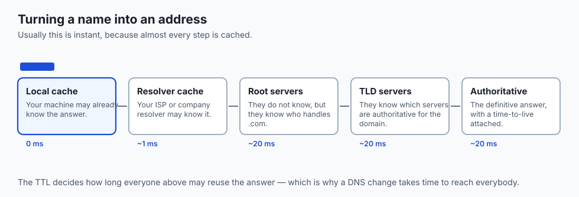

Your computer asks a **recursive resolver** — your ISP's, or a public one like
`1.1.1.1` — to do the legwork:

1. **Root.** "Who handles `.com`?" The root does not know `example.com`, but it knows
   the `.com` servers. There are 13 named root identities, `a` through `m`, each a
   globally distributed fleet.

2. **TLD.** "Who handles `example.com`?" The `.com` servers refer it to the
   **authoritative** name servers the domain's owner designated.

3. **Authoritative.** That server returns the actual record — an **A record** giving
   an IPv4 address, for instance.

4. **Answer and cache.** The resolver returns the address and remembers it until the
   **TTL** expires.


| Record | Purpose | Example |
| --- | --- | --- |
| A | Name to IPv4 address | `93.184.216.34` |
| AAAA | Name to IPv6 address | `2606:2800:220:1:248:1893:25c8:1946` |
| CNAME | Alias: this name is really that name | `www.example.com → example.com` |
| MX | Where email for the domain goes | `10 mail.example.com` |
| TXT | Arbitrary text, for verification and policy | `"v=spf1 ..."` |
| NS | Delegates the domain to its authoritative servers | `a.iana-servers.net` |

- **A CNAME points to another *name*, not an address**, so the resolver must look
  that up too. This is how you point a custom domain at a hosting provider without
  hard-coding an address that may change.

### Routing packets


- **Your machine compares the destination with its own network.** Local addresses go
  direct; everything else goes to the **default gateway** — in a home, your Wi-Fi
  router.

- **From there the packet hops.** Each router reads the destination, consults its
  **routing table**, forwards to the best next hop, and forgets about it.

- **No router plans the whole route.** A packet may cross a dozen routers run by
  several companies.

- **Autonomous systems** are large networks under single control, each with a number
  — an ISP, a university, a cloud provider.

- **BGP is how they agree.** Each system advertises which address blocks it can
  reach, and those advertisements propagate.

- **BGP runs largely on trust**, which is why a bad advertisement can misroute a
  region's traffic — the "BGP leak" you occasionally see in the news.

### Watching the hops

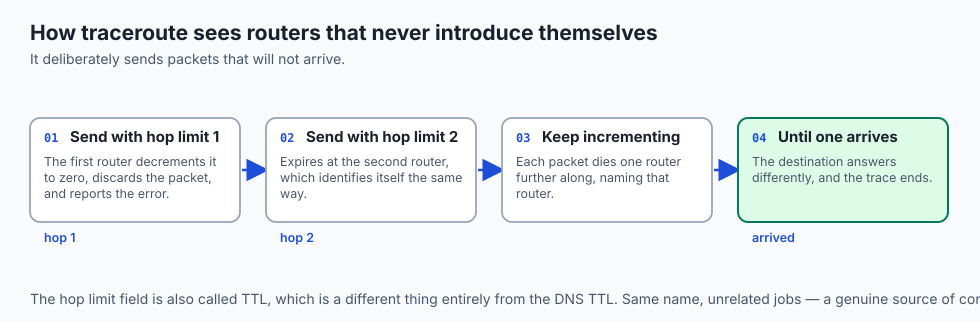

- **`traceroute` exploits the hop limit** carried in every IP packet — confusingly
  also called TTL, but a different one from the DNS field.

- **Each router decrements it**; at zero, the packet is discarded and an error
  returned.

- **Send with a limit of 1, then 2, then 3**, and each elicits a reply from one more
  router along the path.

---

## An everyday analogy

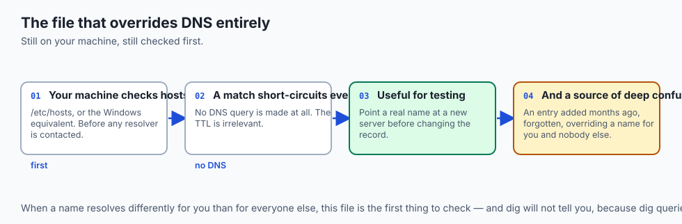

The postal system.

| The post | The network |
| --- | --- |
| A person's name in a directory | A domain name |
| Their street address | An IP address |
| Directory enquiries | A recursive resolver |
| "Ask the county office" | Delegation to a TLD |
| The local sorting office | Your default gateway |
| Each office deciding the next van | Routing, hop by hop |
| An internal room number | A private address |

- **No sorting office knows the whole route.** Each one decides which van the parcel
  goes on next, and that is enough.

- **A room number is meaningless outside the building**, which is exactly what a
  private address is.

- **The directory is cached in your memory** for a while, which is a TTL.

---

## Examples in practice

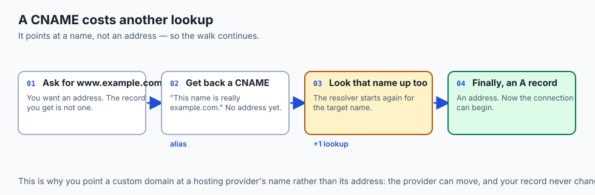

- **A new site not resolving yet**: the old record's TTL has not expired in some
  caches. Lower the TTL *before* a planned change, not after.

- **`dig` showing a CNAME chain** three names deep, each costing another lookup.
- **A server that reaches your laptop's IP and gets nothing**: the address is
  private, and not routable from outside your network.

- **`127.0.0.1` working while the machine's real address does not**: the service is
  bound to loopback only, so nothing outside can reach it.

- **A traceroute that stops answering halfway**: routers are not obliged to reply,
  and the path is usually fine.

---

## Implications: security, privacy, performance, scalability, and cost

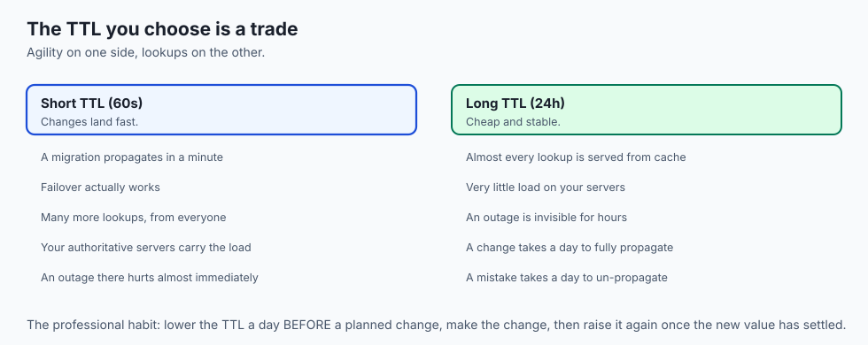

- **Security: DNS hijacking sends you to the wrong server** with everything else
  looking correct. DNSSEC signs answers; encrypted DNS hides the questions.

- **Domain registrar access is production access.** Anyone who can change your NS
  records controls where your traffic goes, and can obtain certificates in your name.

- **Privacy: your resolver sees every name you look up.** That is a complete browsing
  history, held by whoever runs it.

- **Performance: DNS is on the critical path of the first request.** A slow
  authoritative server delays everything after it.

- **A low TTL costs lookups; a high TTL costs agility.** Choose deliberately: low
  before a migration, higher afterwards.

- **Cost: a lapsed domain registration is the cheapest catastrophic failure
  available.** Set it to auto-renew and check the card on file.

---

## Subnets and CIDR, briefly

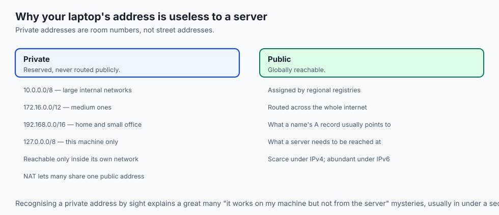

- **A subnet is a contiguous block of addresses** sharing a leading prefix, treated
  as one local network.

- **CIDR notation writes the block as an address, a slash, and a number** —
  `192.168.1.0/24` — where the number says how many leading bits are fixed.

- **A `/24` fixes 24 of 32 bits**, leaving 8 for hosts: 256 addresses.
- **A `/16` fixes 16**, holding 65,536. Each smaller number after the slash doubles
  the block.

- **This is how routers summarise**: one entry saying "everything in
  `93.184.216.0/24` goes this way" stands in for 256 addresses.

| Range | Kind | Where it is used |
| --- | --- | --- |
| `10.0.0.0/8` | Private | Large internal networks; ~16.7 million addresses |
| `172.16.0.0/12` | Private | Medium internal networks |
| `192.168.0.0/16` | Private | Home and small office |
| `127.0.0.0/8` | Loopback | This machine itself |
| Everything else routable | Public | Globally reachable, assigned by registries |

- **Private addresses are never routed on the public internet.** A router performs
  **NAT** so many private devices share one public address.

- **Recognising a private address by sight** explains a great many "works on my
  machine, not from the server" mysteries.

---

## Alternatives: free, open source, and commercial

| Tool | Type | What it gives you |
| --- | --- | --- |
| `dig` | Free, built in | Exactly what was returned, and by which server |
| `nslookup` | Free, built in | Simpler output; fine for a quick check |
| `host` | Free, built in | The shortest answer of the three |
| `traceroute` / `mtr` | Free | The path, and where latency appears |
| `1.1.1.1`, `8.8.8.8`, `9.9.9.9` | Free | Public resolvers, often faster than an ISP's |
| Cloudflare / Route 53 / NS1 | Commercial, free tiers | Authoritative hosting with low-latency global fleets |

- **Learn `dig +trace`.** It performs the walk yourself, showing each delegation step
  rather than the resolver's cached summary.

- **Public resolvers are usually faster than an ISP's**, and change who sees your
  lookups — a trade rather than a free win.

---

## Comparison with related concepts

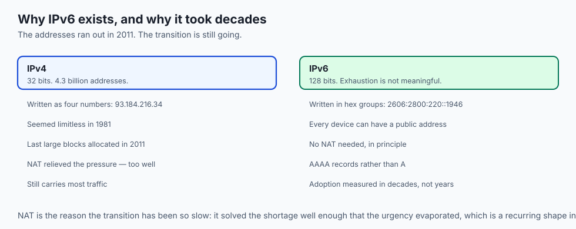

| Term | What it actually is |
| --- | --- |
| **IP address** | Where a machine is, on a network |
| **Domain name** | A human-readable name that resolves to one |
| **Resolver** | The server that does the lookup work for you |
| **Authoritative server** | The one holding the real records for a domain |
| **TTL** | How long an answer may be cached |
| **Autonomous system** | A large network under one administrative control |
| **BGP** | How autonomous systems advertise what they can reach |

---

## When to use it — and when not to

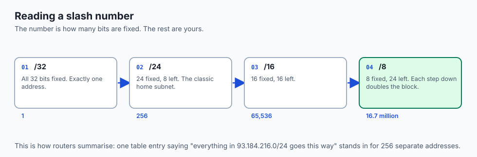

- **Lower a record's TTL a day before a planned migration**, so the change propagates
  quickly when you make it.

- **Use a CNAME when pointing at a service whose address you do not control**, and an
  A record when you do.

- **Use `dig` before assuming an application is broken.** Half of "the service is
  down" is a resolution problem.

- **Do not hard-code IP addresses** in configuration. That is what names are for, and
  the address will change.

- **Do not set a TTL of five seconds and leave it there.** You pay for it on every
  request, forever.

- **Do not debug routing from one machine.** A path that fails for you may work
  everywhere else, and that is itself the finding.

---

## The AI connection

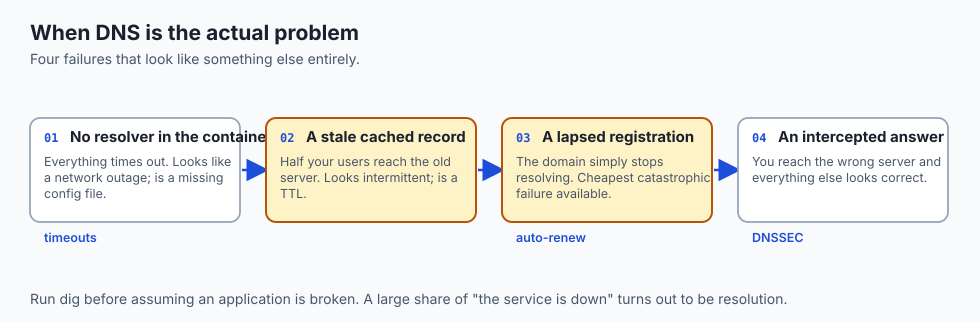

- **Model API endpoints are names behind global fleets.** The address you resolve
  depends on where you are, which is how the provider puts inference near you.

- **A container that cannot reach the internet** is usually a DNS problem inside the
  container, not a network outage.

- **Cluster service discovery is DNS.** In Kubernetes, a service name resolves to its
  current addresses, and this lesson is the whole mechanism.

- **Private addressing is why your training machine cannot be reached directly**, and
  why you tunnel through a bastion or use a VPN.

- **A slow first API call and fast subsequent ones** is DNS caching, visible in your
  own latency numbers.

---

## Knowledge check

```yaml
quiz:
  question: "You update a domain's A record to point at a new server. Some users reach the new server immediately; others keep landing on the old one for hours. What explains the split?"
  options:
    - "Resolvers are still serving the previous answer until its TTL expires"
    - "The new server's DNS record was written with the wrong record type"
    - "BGP has not yet propagated the route to the new server's network"
    - "The authoritative name servers have not finished synchronising with each other"
  answer_index: 0
  explanation: "Every DNS answer carries a time to live, and a resolver that cached the old address serves it until that expires. Users behind a resolver with a fresh cache get the new answer; users behind one holding the old record do not, until the clock runs out."
```

---

## Hands-on exercise

Resolve a name by hand, then follow a packet. Worked through fully in the Day 16
lab directory.

| What you are doing | Command |
| --- | --- |
| The short answer | `dig example.com +short` |
| The full answer with TTL | `dig example.com` |
| Walk the hierarchy yourself | `dig example.com +trace` |
| Ask a specific resolver | `dig @1.1.1.1 example.com` |
| Look up other record types | `dig example.com MX` and `dig example.com NS` |
| Follow the path | `traceroute example.com` |
| See your own addresses | `ipconfig getifaddr en0` or `ip addr` |

### Expected output

```text
example.com.    3600    IN    A    93.184.216.34
.               518400  IN    NS   a.root-servers.net.
com.            172800  IN    NS   a.gtld-servers.net.
example.com.    172800  IN    NS   a.iana-servers.net.
```

- **`3600` is the TTL** — one hour before that answer must be looked up again.
- **`+trace` shows the three delegations**: root to `.com` to the domain's own
  servers.

### Validate your work

- [ ] You can read a TTL off a `dig` answer and say what it means
- [ ] You performed the full hierarchy walk with `+trace` and named each step
- [ ] You queried two different resolvers and compared their answers
- [ ] You identified whether your own machine has a public or a private address
- [ ] You ran `traceroute` and can say which hop is your own router
- [ ] `bash tests/run_tests.sh` reports 0 failures

### Troubleshooting

- **`dig` not installed.** On some systems it is in a `dnsutils` or `bind-tools`
  package. `host` and `nslookup` are usually present.

- **`+trace` gives a short answer.** Something is intercepting DNS — a corporate
  resolver, or a router that redirects port 53.

- **Two resolvers disagree.** Usually a stale cache on one of them; check the TTLs.
- **`traceroute` shows asterisks.** Routers may decline to reply. It is not evidence
  of a fault.

### Common mistakes

- **Believing a change is live because it works for you.** Your cache is not
  everyone's.

- **Changing a TTL at the same time as the record.** The old TTL governs how long the
  old value survives, so lower it in advance.

- **Confusing the DNS TTL with the IP hop limit.** Same name, unrelated jobs.
- **Assuming a private address is reachable** from anywhere but its own network.

---

## Practice assignment

- **Resolve five well-known domains** and tabulate their TTLs. Form a hypothesis about
  why they differ, then check whether the short ones belong to services that move.

- **Find a CNAME chain** in the wild and count the lookups it costs.
- **Compare `traceroute` to a domestic host and an overseas one**, and identify where
  the latency appears.

- **Identify every address on your own machine**, and classify each as loopback,
  private or public.

---

## Extension challenge

- **Run your own resolver** locally, point your machine at it, and watch the queries
  it makes. Seeing your own lookups is a genuinely uncomfortable exercise.

- **Measure the TTL trade-off.** Query a name repeatedly and time each request,
  identifying the moment the cache expires.

- **Read a real BGP leak post-mortem** and map what happened onto the routing diagram
  in this lesson.

- **Set up a subdomain with a low TTL**, change it, and measure how long the old value
  actually survives across three different public resolvers.

---

