## Why this matters

- **"Port already in use" is the error you will hit most this month**, and today it
  becomes obvious rather than annoying.
- **Every model API call rides on TCP**, and every timeout you debug is one of the
  guarantees in this lesson doing its job slowly.
- **Container networking is port mapping.** `-p 8080:80` is meaningless until you
  know what a port is.
- **Firewalls think in ports.** Reaching a training machine, or failing to, is
  usually one number.
- **The TCP-versus-UDP choice explains why video calls degrade** and downloads do not.

---

## The idea in plain language

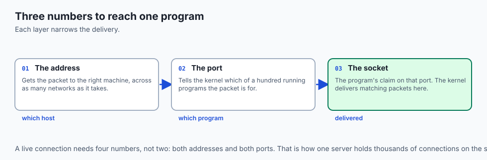

- **An IP address gets you to the machine. A port gets you to the program.**
- **A socket is the pair**: an address and a port together identify one endpoint.
- **TCP is a phone call.** Both sides agree to talk, everything arrives in order, and
  nothing is lost.
- **UDP is a postcard.** It is sent, and it may or may not arrive, and nobody tells
  you.
- **Neither is better.** They make opposite trades, and each is right for different
  work.

---

## Historical background

- **The original 1974 design had one protocol** doing addressing and reliability
  together.
- **It was split in 1978** into IP for addressing and TCP for reliability, which is
  why they are named as a pair and are two separate things.
- **UDP was added the same year** for applications that wanted the addressing without
  the machinery.
- **The split was the good decision.** It let IP stay simple enough to run over any
  medium, and let applications choose their own reliability.
- **Congestion control arrived in 1988**, after congestion collapse nearly took the
  early internet down. TCP has slowed itself down voluntarily ever since.
- **QUIC, from 2012 onward, rebuilt TCP's guarantees on top of UDP** — which is only
  possible because UDP gave up so little.

---

## What it is — and what it is not

- **A port is a 16-bit number** in the header of every TCP and UDP packet — one for
  the source, one for the destination.
- **A socket is a program's claim on a port**, and the kernel delivers matching
  packets to it.
- **A connection is four numbers**: source address, source port, destination address,
  destination port.

**They are not:**

- **Not physical.** There is no socket on the back of the machine; it is a kernel
  data structure.
- **Not security.** A port being closed is not protection; a firewall is.
- **Not tied to a protocol by law.** Port 443 is HTTPS by convention, and anything
  may listen there.
- **Not unlimited.** There are 65,535 of them, and a busy machine can genuinely run
  out of ephemeral ports.

---

## Why it was created and what problems it solves

- **One machine, many services.** Without ports, a computer could offer exactly one
  thing.
- **Delivery to the right program.** The kernel needs to know which of a hundred
  processes a packet belongs to.
- **Reliable delivery over an unreliable network.** IP may lose, duplicate and
  reorder; TCP hides all three.
- **Fairness.** Congestion control is what stops a few fast senders from crowding
  everyone else out.
- **A choice.** UDP exists so that applications which do not want those guarantees
  are not forced to pay for them.

---

## How it works

### Ports: one number per service

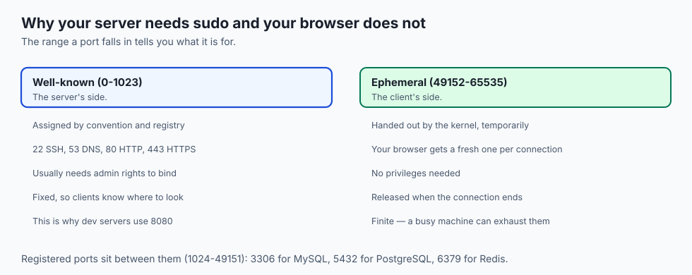

| Range | Name | Meaning | Examples |
| --- | --- | --- | --- |
| 0–1023 | Well-known | Standard services; usually need admin rights to open | 22 SSH, 53 DNS, 80 HTTP, 443 HTTPS |
| 1024–49151 | Registered | Assigned to applications on request | 3306 MySQL, 5432 PostgreSQL, 6379 Redis, 8080 alt-HTTP |
| 49152–65535 | Ephemeral | Temporary numbers the OS hands to clients | your browser's outgoing side |

- **Clients get a throwaway high port; servers listen on a fixed low one.**
- **That asymmetry is the shape of almost every connection you will ever make.**

### The socket: host plus port


- **"Listening on port 443"** means the kernel has reserved that port and will
  deliver anything addressed there to that program.
- **A live connection is fully described by four numbers.**
- **That four-tuple is why one server holds thousands of simultaneous connections on
  the same port.** Each is a distinct combination.

### TCP: the handshake


1. **SYN.** "Can we talk? I will start counting from *x*."
2. **SYN-ACK.** "Yes, I heard you. I will start counting from *y*."
3. **ACK.** "Got it — let's go." The connection is established.

Once established, TCP delivers four guarantees:

- **Reliability.** Every byte is numbered and acknowledged; anything unacknowledged
  after a timeout is retransmitted.
- **Ordering.** Sequence numbers let the receiver reassemble bytes in the order sent,
  however scrambled they arrive.
- **Flow control.** The receiver advertises how much buffer it has, so a fast sender
  cannot overwhelm a slow one.
- **Congestion control.** TCP watches for loss and delay, slows down, then probes
  cautiously back up — the algorithm that quietly shares the internet's capacity
  among millions of connections.

### UDP: send and forget

- **No handshake.** The first packet *is* the data.
- **No sequence numbers, no acknowledgements, no retransmission**, no flow or
  congestion control.
- **A datagram carries** source and destination ports, a length, a checksum, and the
  payload. That is all.
- **The receiver either gets it or does not**, and UDP never tells the sender which.
- **That is exactly right** for a name lookup, for live media where a lost frame is
  stale before you could resend it, and for anything that wants to build its own
  delivery rules on a lean foundation — which is what QUIC does.

---

## An everyday analogy

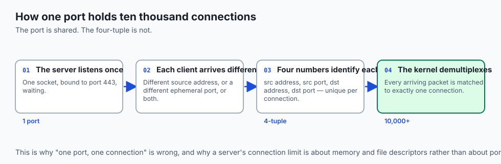

An office building with a switchboard.

| The building | The network |
| --- | --- |
| The street address | The IP address |
| The extension number | The port |
| The switchboard | The kernel, routing to sockets |
| "Extension 443, please" | Connecting to a service |
| A registered call, both parties confirmed | TCP |
| A note pushed under the door | UDP |

- **The address gets you to the building; the extension gets you to a person.**
- **A phone call confirms both sides are present** before anyone says anything
  important. That is the handshake.
- **A note under the door is faster and cheaper**, and you will never know if it was
  read.

---

## Examples in practice

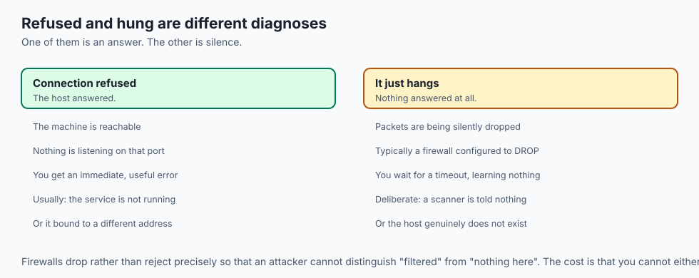

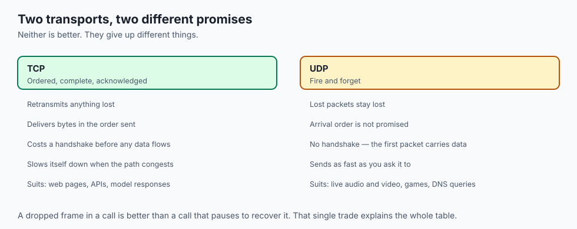

- **`Address already in use`**: another process holds that port. `lsof -i :8080`
  names it.
- **A connection that hangs rather than refusing**: a firewall dropping packets
  silently, rather than a machine answering "nothing here".
- **`Connection refused`**: the machine is reachable and nothing is listening. That
  is a *useful* error.
- **A video call that degrades but continues**: UDP, dropping frames rather than
  waiting for them.
- **A download that stalls and resumes**: TCP retransmitting, invisibly, exactly as
  designed.

---

## Implications: security, privacy, performance, scalability, and cost

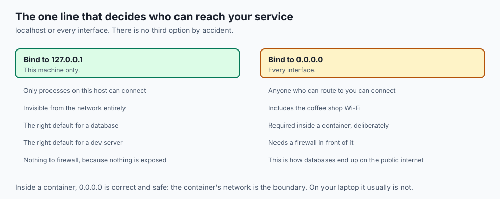

- **Security: every open port is a way in.** The first thing an attacker does is find
  out which ones answer.
- **Binding to `0.0.0.0` exposes a service on every interface**; binding to
  `127.0.0.1` exposes it only to the machine itself. That one choice is the
  difference between a local database and a public one.
- **Privacy: ports leak what you run.** A scan reveals your stack before anyone has
  read a line of your code.
- **Performance: the handshake costs a round trip**, every new connection. Reuse
  connections and you stop paying it.
- **Scalability: ephemeral ports are finite.** A machine making tens of thousands of
  short-lived outbound connections can exhaust them, which produces a confusing
  failure that looks like the network breaking.
- **Cost: congestion control means your throughput depends on loss.** A slightly
  lossy path can halve your effective bandwidth while looking perfectly connected.

---

## Alternatives: free, open source, and commercial

| Tool | Type | What it tells you |
| --- | --- | --- |
| `lsof -i` | Free, built in | Which process holds which port |
| `ss` / `netstat` | Free, built in | Every socket, and its state |
| `nc` (netcat) | Free, built in | Whether a port answers, and what it says |
| `nmap` | Free, open source | Which ports are open on a host you own |
| `tcpdump` | Free, built in | The packets themselves |
| Wireshark | Free, open source | The same, decoded and readable |

- **Learn `lsof -i :PORT` today.** It answers "what is on my port" in one line, and
  you will type it for the rest of your career.
- **Only scan hosts you are authorised to scan.** `nmap` against someone else's
  network is not a neutral act.

---

## Comparison with related concepts

| Term | What it actually is |
| --- | --- |
| **Port** | A 16-bit number identifying a program on a host |
| **Socket** | A program's bound endpoint: address plus port |
| **Connection** | The four-tuple of both addresses and both ports |
| **TCP** | Reliable, ordered, congestion-controlled byte stream |
| **UDP** | Unreliable, unordered datagrams with almost no machinery |
| **QUIC** | TCP-like guarantees rebuilt on top of UDP |

---

## When to use it — and when not to

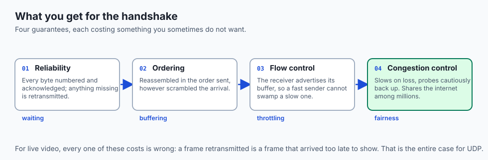

- **Use TCP when completeness matters more than timeliness** — files, pages, API
  calls, anything where a missing byte is a broken result.
- **Use UDP when timeliness matters more than completeness** — live audio and video,
  telemetry, game state, name lookups.
- **Use UDP when you want to build your own rules**, as QUIC did.
- **Do not bind a development service to `0.0.0.0`** on a shared or public network
  without deciding to.
- **Do not use a well-known port for your own service** unless it is the service that
  port means.
- **Do not treat "the port is closed" as security.** It is the absence of an opening,
  not the presence of a defence.

---

## The AI connection

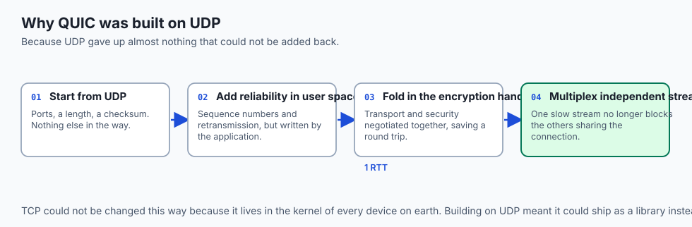

- **Every hosted model call is TCP**, and a slow one is a round trip you can measure
  rather than a mystery.
- **Local inference servers bind a port** — Ollama, vLLM, a notebook — and two of
  them wanting the same number is the most common local failure.
- **Container port mapping is this lesson**: `-p 8080:80` says "the host's 8080
  reaches the container's 80", and nothing more mysterious.
- **Distributed training coordinates over TCP** on ports you configure, which is why
  a firewall between nodes stops a run before it starts.
- **Streaming token responses hold one connection open** rather than making many,
  which is the round-trip argument from Day 15 applied.

---

## Knowledge check

```yaml
quiz:
  question: "Connecting to a service gives \"connection refused\" from one machine and simply hangs from another. What does the difference tell you?"
  options:
    - "The refusal means the host answered with nothing listening; the hang means packets are being dropped, typically by a firewall"
    - "The refusal means the port is firewalled; the hang means the service is overloaded"
    - "Both indicate the same failure, and the difference is only in client timeout settings"
    - "The refusal means DNS failed; the hang means the route to the host is missing"
  answer_index: 0
  explanation: "A refusal is an active reply: the machine is reachable and no program holds that port. A hang means nothing replies at all, which is what a firewall configured to drop rather than reject produces — deliberately, so a scanner learns nothing."
```

---

## Hands-on exercise

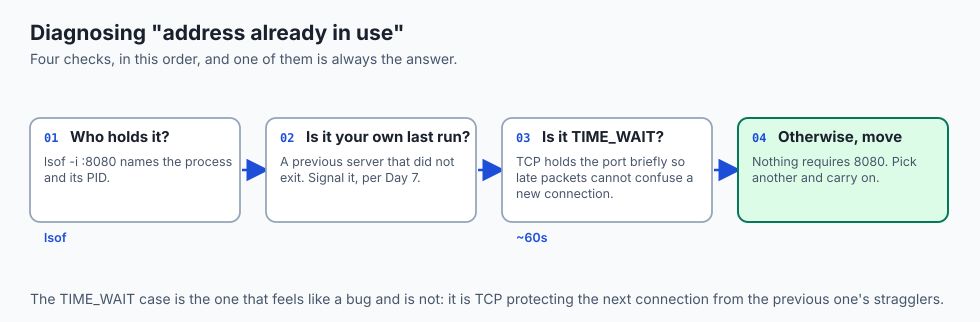

Find what is listening, then open a port yourself and connect to it. Worked through
fully in the Day 17 lab directory.

| What you are doing | Command |
| --- | --- |
| See every listening socket | `ss -tlnp` or `lsof -iTCP -sTCP:LISTEN` |
| Find what holds one port | `lsof -i :8080` |
| Start a server on a port | `python3 -m http.server 8080` |
| Connect to it | `curl http://127.0.0.1:8080/` |
| Check a port without a client | `nc -vz 127.0.0.1 8080` |
| Watch the handshake | `sudo tcpdump -i lo0 -c 6 port 8080` |
| Cause the classic error | Start a second server on the same port |

### Expected output

```text
COMMAND   PID   USER   FD  TYPE  NAME
python3  4812    you    3u IPv4  *:8080 (LISTEN)
Connection to 127.0.0.1 port 8080 [tcp/http-alt] succeeded!
OSError: [Errno 48] Address already in use
```

- **`(LISTEN)`** is a socket waiting for connections.
- **`Address already in use`** is the port already claimed — the error this lesson
  exists to make obvious.

### Validate your work

- [ ] You listed the listening sockets on your machine and recognised three services
- [ ] You started a server and connected to it from another terminal
- [ ] You reproduced "address already in use" deliberately
- [ ] You saw the difference between a refused connection and a dropped one
- [ ] You can state the four numbers that identify a connection
- [ ] `bash tests/run_tests.sh` reports 0 failures

### Troubleshooting

- **`lsof` shows nothing without `sudo`.** You can only see your own processes;
  other users' sockets need elevation.
- **`Permission denied` binding to port 80.** Ports below 1024 need administrator
  rights. Use 8080.
- **The port stays busy after you stop the server.** TCP holds it briefly in
  `TIME_WAIT` so late packets cannot confuse a new connection. Wait, or use a
  different port.
- **`nc` not found.** `curl -v` on the address will tell you the same thing.

### Common mistakes

- **Assuming a closed port means a broken service.** Check which address it bound to
  first.
- **Binding to `127.0.0.1` and expecting another machine to reach it.**
- **Reading "connection refused" as a firewall.** It is the opposite — something
  answered.
- **Scanning networks you do not own.**

---

## Practice assignment

- **Inventory every listening port** on your machine and identify the program behind
  each. Anything you cannot explain is worth ten minutes.
- **Bind the same server to `127.0.0.1` and then to `0.0.0.0`**, and try reaching it
  from a phone on the same network. The difference is the lesson.
- **Capture a handshake** with `tcpdump` and label the SYN, SYN-ACK and ACK by hand.
- **Compare a TCP and a UDP transfer** of the same data on a lossy link, using
  `tc netem` or simply a poor Wi-Fi connection.

---

## Extension challenge

- **Exhaust the ephemeral port range** deliberately with a script making thousands of
  short-lived connections, and observe the failure. It looks nothing like "out of
  ports", which is why it is worth seeing once.
- **Watch congestion control work.** Transfer a large file while running a second
  transfer, and watch each one's throughput adjust.
- **Write a minimal TCP echo server and a UDP one** in twenty lines each, and note
  precisely which lines the UDP version does not need.
- **Read a QUIC handshake capture** and identify what it folded together that TCP and
  TLS keep separate.

---

