## Why this matters

- **Every model API call is an HTTP POST**, and reading the request and response is
  the whole debugging skill.

- **`401` and `429` will be your two most frequent AI errors** — a bad key and too
  many requests — and both are readable at a glance.

- **`POST` is not idempotent**, which means a naive retry can charge you twice for
  the same generation.

- **Everything you build will speak HTTP**, whether you write the client or the
  server.

- **The protocol is plain text.** You can type it by hand, and today you will.

---

## The idea in plain language

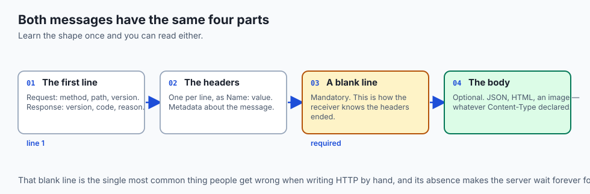

- **HTTP is two messages**: a request and a response. Everything else is variation.
- **Both have the same shape**: a first line, some headers, a blank line, then an
  optional body.

- **The method is your verb** — what you intend: read, create, replace, remove.
- **The status code is the verdict**, and its first digit tells you whose fault it is.
- **HTTP is stateless.** The server forgets you the moment it answers, which is why
  every request must carry its own identity.

---

## Historical background

- **HTTP 0.9, 1991, was one line**: `GET /page`. No headers, no status codes, no
  methods but one.

- **HTTP/1.0, 1996, added headers, status codes and methods**, which is most of what
  you still use.

- **HTTP/1.1, 1997, added persistent connections and the `Host` header** — the latter
  is what let one server host many sites, and so made shared hosting possible.

- **HTTP/2, 2015, kept the semantics and changed the encoding** to binary, with
  multiplexing.

- **HTTP/3 moved to QUIC**, as Day 17 described.
- **The semantics have barely changed since 1997.** A request you write today would
  be understood by a server from then.

---

## What it is — and what it is not

**It is:**

- A request-response protocol: you ask, the server answers, the exchange ends.
- Stateless by design — each request is self-contained.
- Text-based in its semantics, whatever the wire encoding.

**It is not:**

- **Not a connection you hold a conversation over.** The connection may be reused,
  but each request stands alone.

- **Not secure by itself.** That is TLS, which is tomorrow.
- **Not only for browsers.** Most HTTP traffic today is programs talking to programs.
- **Not stateful, even with cookies.** A cookie makes each request carry the key to
  state the server holds elsewhere.

---

## Why it was created and what problems it solves

- **A common language for arbitrary clients and servers.** Anyone can implement it,
  which is why everything does.

- **Simplicity you can debug.** A protocol you can type by hand is a protocol you can
  reason about.

- **Statelessness for scale.** Any server can answer any request, which is what makes
  load balancing possible at all.

- **Cacheability.** Because `GET` is safe and idempotent, anything on the path may
  keep a copy.

- **Extensibility through headers.** Every capability added since 1997 — compression,
  authentication, CORS, caching rules — arrived as headers, without a new protocol.

---

## How it works

### The request message

```text
POST /v1/messages HTTP/1.1
Host: api.example
Content-Type: application/json
Authorization: Bearer sk-secret-token
Content-Length: 27

{"prompt":"Hello, server"}
```

- **The request line** names the method, the path, and the version.
- **Headers follow, one per line**, as `Name: value`.
- **A single blank line is mandatory** and marks where headers end and the body
  begins.

- **`Host`** says which site on the server you want — the header that made shared
  hosting possible.

- **`Content-Length`** tells the server where the body ends.

### The response message

```text
HTTP/1.1 200 OK
Content-Type: application/json
Content-Length: 41
Cache-Control: no-store

{"reply":"Hello to you too, client!"}
```

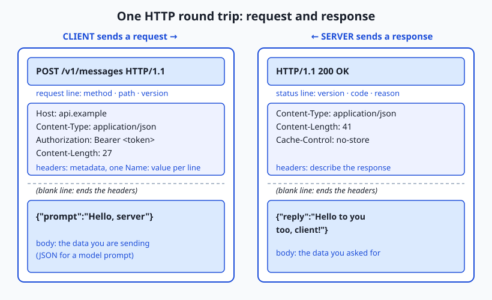

- **The status line** carries the version, the three-digit code, and a reason phrase
  for humans.

- **The headers describe the response**, and the body is what you asked for.
- **That is the complete round trip.** Everything else in HTTP is variation on these
  two messages.

### Methods: the verbs

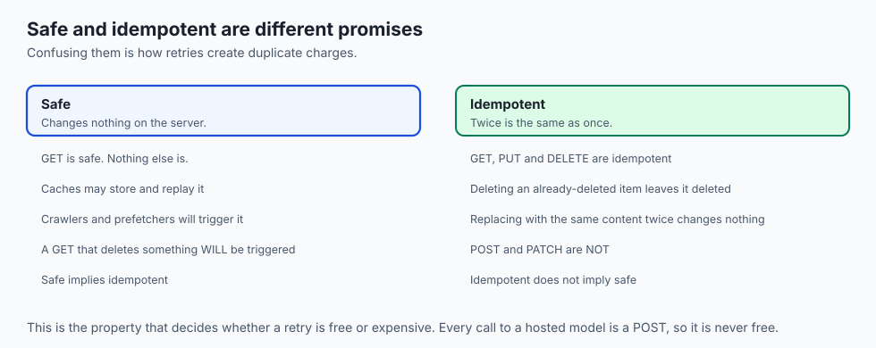

| Method | Intent | Body? | Safe? | Idempotent? |
| --- | --- | --- | --- | --- |
| `GET` | Read; change nothing | No | Yes | Yes |
| `POST` | Send data to be processed; often creates | Yes | No | **No** |
| `PUT` | Replace the resource entirely | Yes | No | Yes |
| `PATCH` | Apply a partial update | Yes | No | No |
| `DELETE` | Remove the resource | Rarely | No | Yes |

- **Safe** means it only reads. Browsers and caches repeat safe requests freely.
- **Idempotent** means doing it twice has the same effect as doing it once.
- **`POST` is not idempotent**, which is why a flaky network plus automatic retries
  can create two orders — or bill you twice for one model call.

### Status codes: the verdict

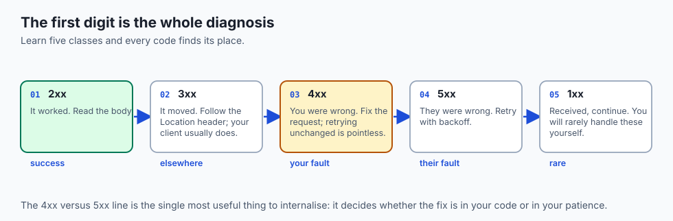

| Class | Meaning | You should |
| --- | --- | --- |
| `1xx` | Received, continue | Ignore in everyday work |
| `2xx` | Success | Read the body |
| `3xx` | It lives elsewhere | Follow `Location` |
| `4xx` | **Your** request was wrong | Fix it — retrying unchanged is pointless |
| `5xx` | The **server** failed | Retry with backoff; not your fault |

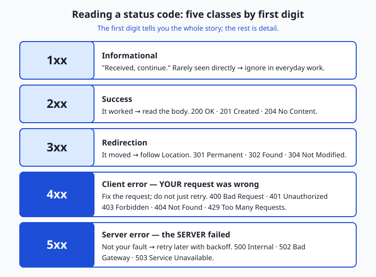

- **`200 OK`** — success, body holds the answer.
- **`201 Created`** — a resource was made; `Location` often points at it.
- **`204 No Content`** — success with deliberately no body, common after `DELETE`.
- **`301` / `302`** — permanent and temporary redirects.
- **`304 Not Modified`** — your cached copy is fine; no body sent.
- **`400`** malformed, **`401`** not authenticated, **`403`** authenticated but not
  allowed, **`404`** no such path.

- **`429 Too Many Requests`** — slow down; `Retry-After` may say how long.
- **`500`** unhandled server fault, **`502`/`503`** a proxy could not reach the
  service, or it is overloaded.

### Headers that matter

- **`Content-Type`** declares the body's format. Send JSON without it and many
  servers reject the body.

- **`Accept`** says which formats you can handle, letting one endpoint serve JSON to
  a script and HTML to a browser.

- **`Authorization`** carries your credential, usually `Bearer <token>`. This header
  decides between `200` and `401`.

- **`Cache-Control`** governs storage, from `no-store` to `max-age=3600`.
- **`User-Agent`** identifies the client, and servers sometimes vary behaviour on it.

### Cookies and statelessness

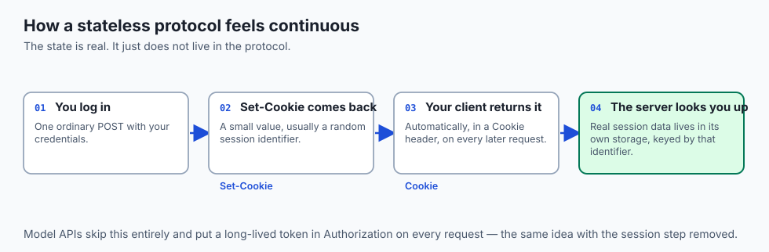

- **The server forgets you the instant it answers.**
- **`Set-Cookie` in a response** hands your client a small piece of data, often a
  random session ID.

- **Your client returns it in a `Cookie` header** on every later request.
- **The real session lives in the server's own storage**, keyed by that ID.
- **So the protocol stays stateless** while the experience feels continuous.
- **Model APIs skip cookies** and put a long-lived token in `Authorization` instead —
  the same idea, simpler.

### The versions

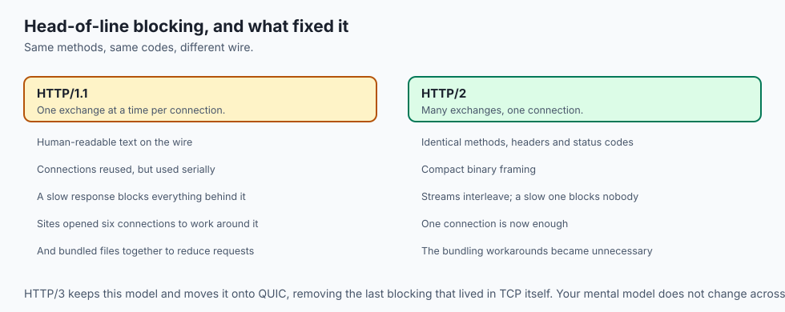

- **HTTP/1.1** is text, one request at a time per connection. Its weakness is
  head-of-line blocking: a slow response holds up everything behind it.

- **HTTP/2** keeps identical methods, headers and codes, encodes them in binary, and
  multiplexes many exchanges over one connection.

- **HTTP/3** keeps HTTP/2's model on QUIC, removing the last blocking and setting up
  faster on flaky networks.

- **The mental model is identical across all three**, and your tools negotiate the
  version for you.

---

## An everyday analogy

A formal letter and its reply.

| The post | HTTP |
| --- | --- |
| "Please send me…" | The method |
| The address on the envelope | The path |
| The letterhead | The headers |
| The blank line before the text | The header/body boundary |
| The enclosure | The body |
| "Approved" or "Rejected: incomplete" | The status code |
| A reference number to quote next time | A cookie |

- **The clerk answering has no memory of you.** Everything they need is in this
  letter, which is what stateless means.

- **The reference number is how continuity is faked.** Quote it and they can look up
  your file.

---

## Examples in practice

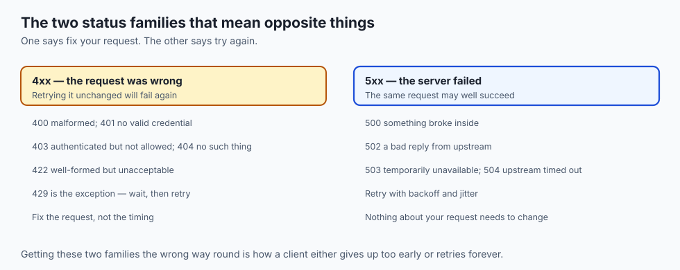

- **`401` on every call**: the key is missing, malformed, or in the wrong header.
  Retrying will never help.

- **`429` with `Retry-After: 20`**: you are being rate-limited and told exactly how
  long to wait.

- **`400` with a JSON body explaining what was wrong**: read it. Most APIs say
  precisely which field failed.

- **`502` from a gateway**: something in front could not reach the real service. Not
  your request's fault.

- **A `POST` that times out and is retried**, creating two of whatever it created.

---

## Implications: security, privacy, performance, scalability, and cost

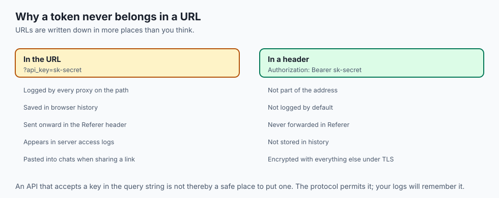

- **Security: the `Authorization` header is a secret in transit.** It is why HTTPS is
  not optional, and why a logged request can leak a key.

- **Never put a token in a URL.** URLs are logged by every proxy, saved in browser
  history, and sent in `Referer` headers.

- **Privacy: headers identify you.** `User-Agent`, `Accept-Language` and the rest form
  a fingerprint before any cookie is set.

- **Performance: `304 Not Modified` is free bandwidth.** Conditional requests are the
  cheapest optimisation available and cost one header.

- **Scalability: statelessness is what makes horizontal scaling possible.** Any
  server can answer any request because none of them remembers anything.

- **Cost: retrying a non-idempotent `POST` costs real money** when the thing on the
  other end bills per call.

---

## Alternatives: free, open source, and commercial

| Tool | Type | What it gives you |
| --- | --- | --- |
| `curl` | Free, built in | Any request you can describe, and `-v` shows both messages |
| `httpie` | Free, open source | The same, with far friendlier syntax and colour |
| Browser dev tools | Bundled, free | Every request a page made, with timings |
| Postman / Insomnia | Free tiers | Saved collections, environments, sharing |
| `requests` / `httpx` | Free, open source | HTTP from Python; `httpx` also does async |
| `mitmproxy` | Free, open source | Watching and rewriting traffic you control |

- **Learn `curl -v` before any GUI.** It shows the raw request and response, which is
  what you need when something is wrong.

- **Use a session object** in `requests` or `httpx`, or you pay Day 15's handshake
  cost on every single call.

---

## Comparison with related concepts

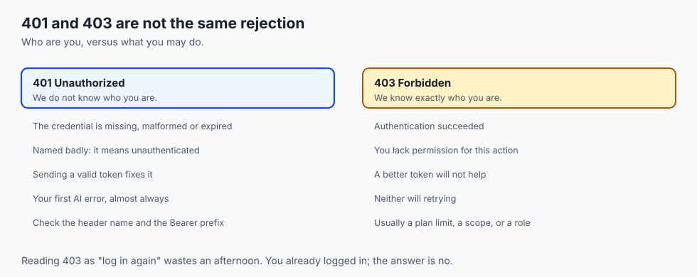

| Term | What it actually is |
| --- | --- |
| **Method** | The verb declaring your intent |
| **Path** | Which resource on the server |
| **Header** | Metadata as a `Name: value` line |
| **Body** | The payload, after the blank line |
| **Status code** | The three-digit verdict |
| **Safe** | Reads only; changes nothing |
| **Idempotent** | Twice has the same effect as once |

---

## When to use it — and when not to

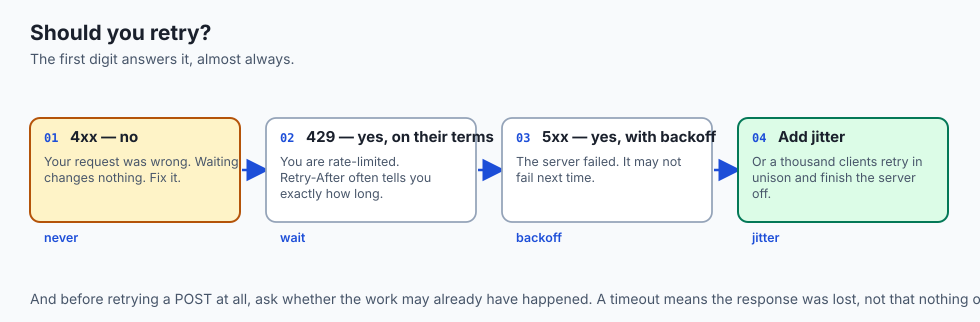

- **Retry `5xx` and `429`; never retry `4xx` unchanged.** The first two are transient;
  the third is a bug in your request.

- **Retry with exponential backoff and jitter**, or a thousand clients will retry in
  unison and finish the server off.

- **Make retried `POST`s safe** with an idempotency key, if the API supports one. This
  is the standard fix, not a workaround.

- **Use `GET` only for reads.** A `GET` that changes something will be triggered by a
  crawler, a prefetcher or a cache, eventually.

- **Do not invent status codes.** The registry has one for almost everything, and a
  novel code is a code nothing handles.

- **Do not use HTTP where you need a persistent bidirectional channel.** That is
  WebSockets, and forcing HTTP into the role produces polling.

---

## The AI connection

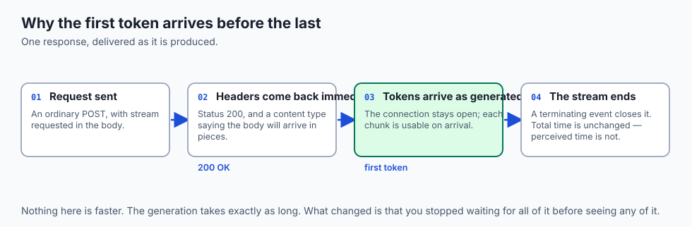

- **Every hosted model call is a `POST`** with a JSON body and a bearer token.
- **`429` is the response you will tune your code around**, and `Retry-After` is the
  server telling you exactly how.

- **Streaming responses use server-sent events over HTTP**, which is why the first
  token arrives long before the last.

- **Token counts arrive in response headers** on many providers, which is how you
  measure cost without parsing the body.

- **The non-idempotent `POST` problem is expensive here.** A retried generation is a
  second generation, billed, and possibly a different answer.

---

## Knowledge check

```yaml
quiz:
  question: "A client automatically retries any request that times out. Against a model API, this occasionally produces duplicate charges even when the original request succeeded. What property explains it?"
  options:
    - "POST is not idempotent, so a request that succeeded but whose response was lost is performed again"
    - "The API returns 5xx errors for successful requests that exceed the timeout"
    - "Bearer tokens expire mid-request, causing the server to process the call twice"
    - "HTTP is stateless, so the server cannot tell two different clients apart"
  answer_index: 0
  explanation: "A timeout tells you the response did not arrive, not that the work did not happen. Because POST is not idempotent, repeating it does the work a second time — which is why APIs offer idempotency keys for exactly this case."
```

---

## Hands-on exercise

Read both messages raw, then provoke each status class deliberately. Worked through
fully in the Day 18 lab directory.

| What you are doing | Command |
| --- | --- |
| See the whole exchange | `curl -v https://example.com` |
| Headers only | `curl -I https://example.com` |
| Send JSON with a method | `curl -X POST -H 'Content-Type: application/json' -d '{"a":1}' URL` |
| Provoke a 404 | `curl -i https://example.com/nope` |
| Provoke a 401 | Call an authenticated endpoint with no token |
| Follow a redirect | `curl -iL http://example.com` |
| Time it | `curl -w '%{http_code} %{time_total}\n' -o /dev/null -s URL` |

### Expected output

```text
> GET / HTTP/1.1
> Host: example.com
>
< HTTP/1.1 200 OK
< Content-Type: text/html; charset=UTF-8
< Content-Length: 1256
```

- **`>` lines are what you sent**; `<` lines are what came back.
- **The blank line after the request headers** is the boundary, and it is mandatory.

### Validate your work

- [ ] You can point at the request line, the headers, the blank line and the body
- [ ] You produced a `2xx`, a `4xx` and a `3xx` deliberately
- [ ] You sent a JSON body with the correct `Content-Type`
- [ ] You explained why one of your requests returned `401` rather than `403`
- [ ] You followed a redirect and saw both responses
- [ ] `bash tests/run_tests.sh` reports 0 failures

### Troubleshooting

- **The server ignores your body.** You omitted `Content-Type`, and many servers will
  not guess.

- **`curl` shows nothing useful.** Add `-v` for the exchange, or `-i` to include
  response headers in the output.

- **A redirect returns an empty body.** That is correct; add `-L` to follow it.
- **Your JSON is rejected as malformed.** Shell quoting. Use single quotes around the
  whole payload, or `--data-binary @file.json`.

### Common mistakes

- **Retrying a `4xx`.** Nothing about waiting fixes a wrong request.
- **Putting a token in the URL** rather than the `Authorization` header.
- **Assuming a timeout means the work did not happen.**
- **Reading `403` as "log in".** You already did; you are simply not allowed.

---

## Practice assignment

- **Write out a request and response by hand** on paper, from memory, then check
  yourself against `curl -v`.

- **Collect one real example of each status class** from public APIs, and record what
  the body said in each case.

- **Implement retry with exponential backoff and jitter**, and prove it does not
  retry `4xx`.

- **Find an API that supports idempotency keys**, read its documentation, and explain
  in three sentences what problem the key solves.

---

## Extension challenge

- **Speak HTTP by hand** over a raw connection with `nc` or `openssl s_client`. Type
  the request line, the headers and the blank line yourself. Doing this once makes
  the protocol permanently concrete.

- **Measure the value of a conditional request.** Fetch a resource, then re-fetch it
  with `If-None-Match`, and compare the bytes transferred.

- **Compare HTTP/1.1 and HTTP/2** on a page with fifty small resources, using
  `curl --http1.1` and `--http2`, and explain the difference by head-of-line
  blocking.

- **Build a tiny server** that returns a different status code per path, then write a
  client that handles each class correctly.

---

