## Why this matters

- **Every API key you send travels under TLS**, and without it anyone on the path
  reads it.
- **Certificate errors will stop your deployments**, and knowing which of four checks
  failed turns an hour into a minute.
- **An expired certificate takes a service down completely**, and it is the most
  avoidable outage there is.
- **TLS authenticates as much as it encrypts.** Encryption to an impostor is worth
  nothing, and that is the part people miss.
- **Corporate networks and debugging proxies both work by breaking this**, so you
  need to know what they are doing.

---

## The idea in plain language

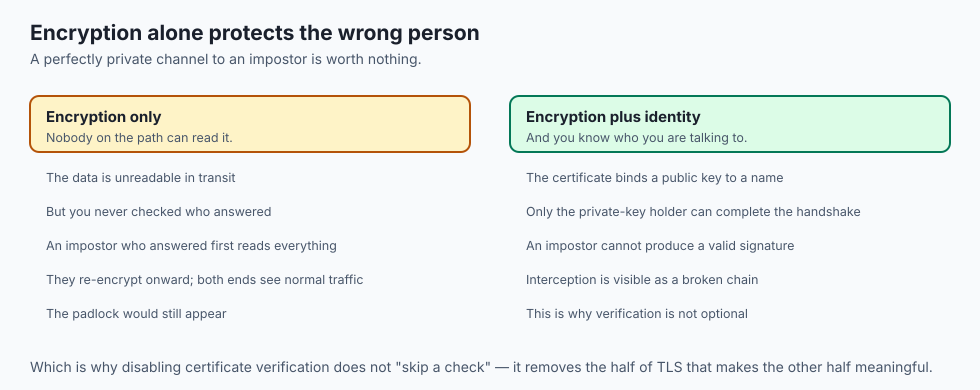

- **HTTPS is HTTP inside TLS.** The messages are identical; the pipe is protected.
- **TLS does two things**: it proves the server is who it claims, and it encrypts
  everything in both directions.
- **Encryption without identity is useless.** A perfectly encrypted channel to an
  attacker protects the attacker.
- **Two kinds of cryptography are used**, because each solves half the problem: slow
  public-key maths to establish trust, fast symmetric encryption for the data.
- **Trust comes from a chain of signatures** ending at an authority your browser
  already believes.

---

## Historical background

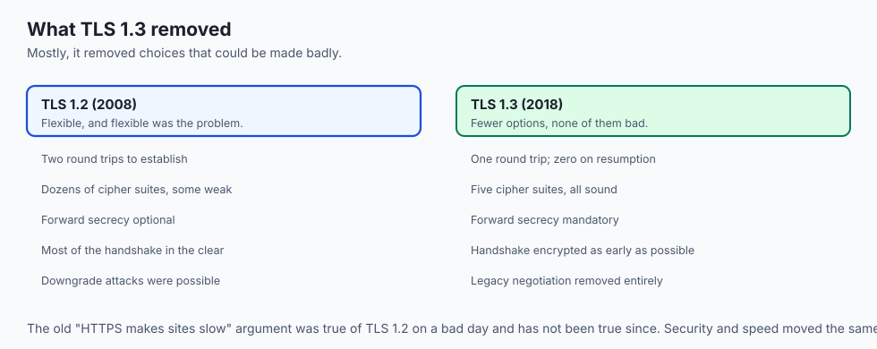

- **The web began entirely in plaintext.** Passwords, credit cards, everything.
- **Netscape's SSL arrived in 1995.** Versions 1 and 2 were broken; SSL 3.0 was the
  first that worked, and is now itself long dead.
- **TLS 1.0 was SSL 3.1, renamed** when standardisation moved to the IETF in 1999.
  People still say "SSL" for what is universally TLS.
- **TLS 1.2, 2008, was the workhorse for a decade.**
- **TLS 1.3, 2018, removed everything optional and broken**, cut the handshake to one
  round trip, and made forward secrecy mandatory rather than a choice.
- **Let's Encrypt, 2015, made certificates free and automatic**, and HTTPS went from
  a minority of the web to the overwhelming default in a few years.

---

## What it is — and what it is not

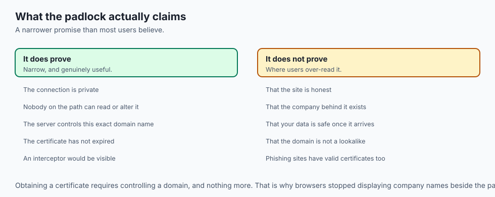

**TLS is:**

- A layer between TCP and HTTP that authenticates one or both sides and encrypts
  everything above it.
- A negotiation: the two ends agree on a version and a cipher suite they both
  support.
- Independent of HTTP. The same layer protects mail, databases and message queues.

**TLS is not:**

- **Not a guarantee the site is honest.** It proves the server controls that domain,
  and nothing about whether the domain deserves your trust.
- **Not protection for data at rest.** Once the response arrives, TLS is finished.
- **Not hiding everything.** The domain you connect to is visible on the wire, even
  when the path and content are not.
- **Not the same as a padlock meaning "safe".** Phishing sites have valid
  certificates, because obtaining one only requires controlling the domain.

---

## Why it was created and what problems it solves

- **Eavesdropping.** Anyone on the path — a router, a Wi-Fi access point, an ISP —
  could read every byte.
- **Tampering.** Without integrity checking, content could be altered in transit and
  neither end would know.
- **Impersonation.** Without authentication, you cannot tell the real server from one
  that answered first.
- **Trust at scale.** You cannot pre-arrange a secret with every server on earth,
  which is exactly the problem public-key cryptography solves.
- **A single mechanism for every protocol**, so mail, databases and APIs did not each
  invent their own.

---

## How it works

### Two kinds of encryption, and why both

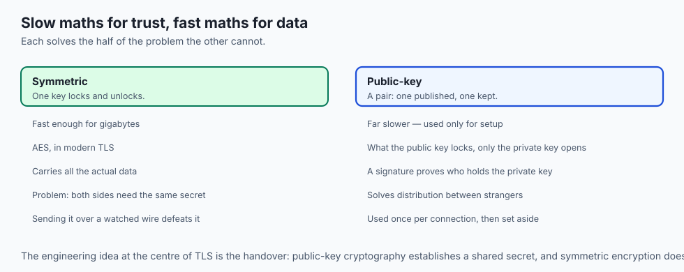

- **Symmetric encryption uses one key** to both lock and unlock. Modern TLS commonly
  uses AES for this.
- **It is fast enough to encrypt gigabytes** without noticeable cost, which is why it
  carries the actual data.
- **Its catch is obvious once said aloud**: both sides need the same secret, and
  handing it across a watched network hands it to the watcher too.
- **Public-key cryptography breaks that deadlock.** Each side has a key pair: a public
  key it publishes and a private key it never shares.
- **The two are mathematically linked** so that what one scrambles only the other can
  unscramble, and a signature made with the private key can be checked by anyone —
  yet the public key does not reveal the private one.
- **Its cost is speed.** Public-key maths is far slower, so TLS uses it only for the
  brief setup.

### The handshake


1. **ClientHello.** "Here are the TLS versions and cipher suites I support, and some
   random data." A cipher suite is a named bundle: key agreement, bulk encryption,
   integrity.
2. **ServerHello and certificate.** The server picks a version and suite both
   support, adds its own random data, and sends its certificate — domain name, public
   key, expiry date, and the issuing authority's signature.
3. **Verify the certificate.** Signed by a trusted authority? Still within its dates?
   Does the name match the site you asked for?
4. **Key agreement.** Both sides independently derive the *same* fresh secret, without
   it ever crossing the wire usably. Only the holder of the private key can complete
   this — which ties the encryption to the verified identity.
5. **Encrypted session.** The slow work is over; every request and response from here
   uses the fast symmetric key.

- **Public-key cryptography appears once**, to authenticate and bootstrap. Symmetric
  encryption does all the heavy lifting afterwards.
- **That mix is the central engineering idea of TLS.**

### The chain of trust


- **A Certificate Authority verifies that whoever asks for a certificate** for a
  domain actually controls it, then signs one with its private key.
- **Your browser and operating system ship a trust store**: a curated list of a few
  dozen root authorities trusted by default.
- **Roots are kept offline and precious**, so they rarely sign site certificates
  directly.
- **A root signs intermediates**, which are online and do the day-to-day signing of
  **leaf** certificates.
- **The browser verifies leaf against intermediate, intermediate against root**, and
  root against its own trusted copy.
- **If any link fails** — expired, bad signature, wrong name, unknown root — the whole
  chain is rejected. There is deliberately no "trust it anyway" default, because a
  broken chain is exactly what an interception attack looks like.

### HSTS: refusing to fall back

- **Type `example.com` without the scheme** and your first request may go out over
  plain HTTP before being redirected.
- **An attacker could hijack that unprotected moment.**
- **`Strict-Transport-Security`** tells the browser: for the next N seconds, only ever
  use HTTPS for me, and never let the user click through a warning.
- **Once seen, every future request is upgraded** before it leaves the machine.
- **Major sites are in a preload list shipped inside browsers**, so the protection
  applies even on a first visit.

---

## An everyday analogy

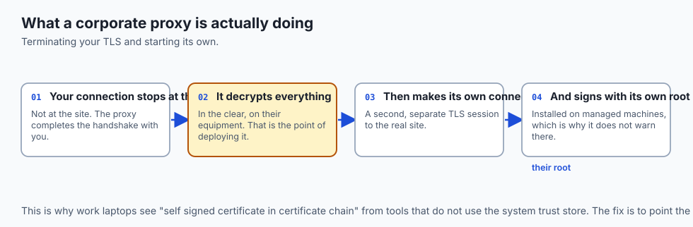

Meeting a stranger who claims to be your bank manager.

| The meeting | TLS |
| --- | --- |
| "Prove who you are" | Certificate verification |
| A passport | The certificate |
| The government that issued it | The certificate authority |
| Your belief that the government is real | The trust store |
| Agreeing a private phrase for later | Key agreement |
| The rest of the conversation, in that code | Symmetric encryption |

- **Checking the passport is slow and happens once.** The conversation afterwards is
  fast.
- **A valid passport proves identity, not honesty.** A real person with real
  identification can still be a fraudster — which is precisely why a padlock is not a
  safety guarantee.

---

## Examples in practice

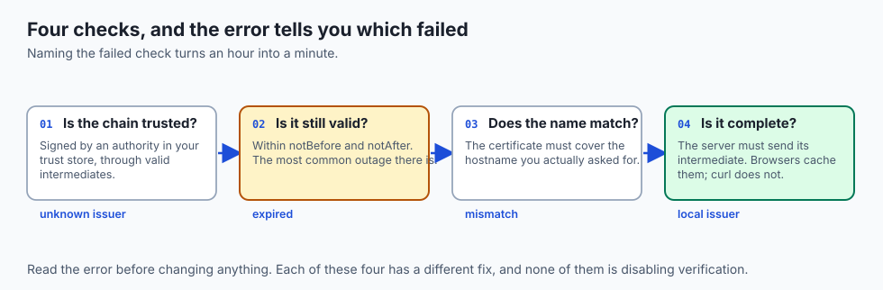

- **`certificate has expired`**: nothing else is wrong. Someone did not renew, and
  the whole service is down.
- **`hostname mismatch`**: the certificate is valid but issued for a different name.
  Common when a load balancer is misconfigured.
- **`unable to get local issuer certificate`**: the server did not send its
  intermediate. It works in browsers, which cache intermediates, and fails in `curl`
  and Python — a genuinely confusing split.
- **`self signed certificate in certificate chain`** on a corporate network: traffic
  is being intercepted and re-signed by a proxy whose root is installed on managed
  machines.
- **A padlock on a phishing site**: entirely normal. The certificate proves domain
  control, not legitimacy.

---

## Implications: security, privacy, performance, scalability, and cost

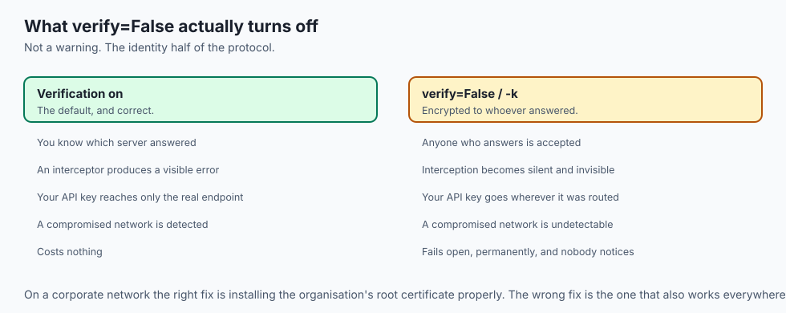

- **Security: certificate verification is the whole point.** Disabling it —
  `verify=False`, `-k`, `rejectUnauthorized: false` — turns TLS into encryption to
  whoever answered.
- **A compromised certificate authority compromises everyone it can sign for**, which
  is why Certificate Transparency logs exist: every issued certificate is published,
  so a domain owner can notice one they did not request.
- **Privacy: the domain is still visible.** Historically in the SNI field, and always
  through DNS. Encrypted Client Hello is the current answer.
- **Performance: TLS 1.3 costs one round trip**, and session resumption can cost
  zero. The old "HTTPS is slow" argument died with TLS 1.2.
- **Cost: certificates are free.** Let's Encrypt removed the last excuse, and
  automated renewal removed the last common outage.
- **Cost of failure is total.** An expired certificate does not degrade a service; it
  stops it, everywhere, at once.

---

## Alternatives: free, open source, and commercial

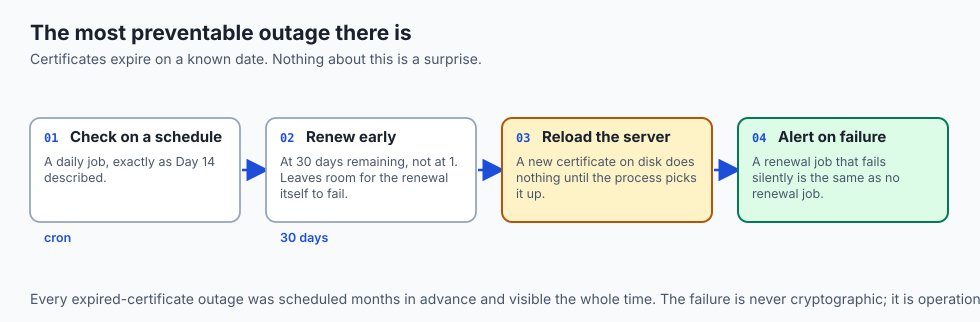

| Tool | Type | What it gives you |
| --- | --- | --- |
| Let's Encrypt + certbot | Free, open source | Automatic issuance and renewal |
| Caddy | Free, open source | A web server that obtains and renews certificates itself |
| `openssl s_client` | Free, built in | The raw handshake and the whole chain |
| `curl -v` | Free, built in | Which check failed, in readable English |
| SSL Labs test | Free | A graded report on a public server's configuration |
| Commercial CAs | Paid | Organisation validation, warranties, support |

- **Automate renewal or you will forget.** Every expired-certificate outage was
  preventable by a cron job from Day 14.
- **Paid certificates are cryptographically identical** to free ones. You are buying
  validation process and support, not stronger encryption.

---

## Comparison with related concepts

| Term | What it actually is |
| --- | --- |
| **SSL** | TLS's predecessor; the name survives, the protocol does not |
| **TLS** | The protocol that authenticates and encrypts the connection |
| **HTTPS** | HTTP carried inside TLS |
| **Certificate** | A signed statement binding a public key to a domain name |
| **CA** | The organisation that verifies control and signs |
| **Trust store** | The root certificates your system believes by default |
| **Forward secrecy** | Past sessions stay safe even if the private key later leaks |

---

## When to use it — and when not to

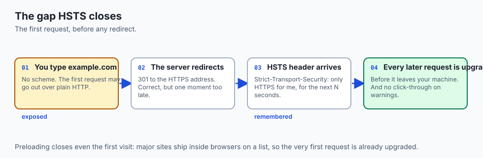

- **Use HTTPS for everything**, including internal services and local development
  where you can. There is no longer a cost argument.
- **Use HSTS once you are confident** every path is available over HTTPS — it is hard
  to undo, by design.
- **Verify certificates in every client you write.** The default is correct; the
  override exists for tests.
- **Never disable verification to make an error go away.** That error is the system
  working. Find out which of the four checks failed.
- **Do not treat a padlock as a trust signal for users.** It means the connection is
  private, not that the destination is honest.
- **Do not put a certificate's private key in a repository.** It is a credential, and
  it is the one that lets someone be you.

---

## The AI connection

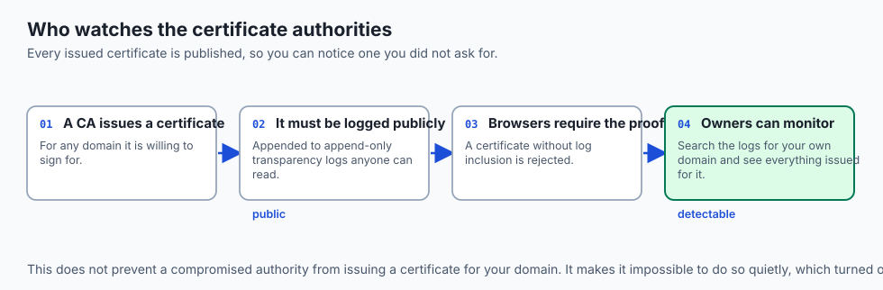

- **Every model API call carries your key under TLS.** Without verification, a
  proxy could collect every key you send.
- **`SSL: CERTIFICATE_VERIFY_FAILED` in Python** is the most common first error on a
  corporate network, and the fix is installing the company's root — not
  `verify=False`.
- **Self-hosted inference servers need certificates too**, and "it is only internal"
  has been the preamble to a great many incidents.
- **Model weights downloaded over an unverified connection** could be substituted,
  and you would have no way to tell.
- **Streaming responses run over a long-lived TLS session**, which is exactly the
  case session resumption was designed for.

---

## Knowledge check

```yaml
quiz:
  question: "A site loads fine in your browser but `curl` reports it cannot get the local issuer certificate. What is the most likely cause?"
  options:
    - "The server is not sending its intermediate certificate, and the browser has one cached while curl does not"
    - "The site's certificate has expired and the browser is ignoring the expiry"
    - "The certificate was issued for a different hostname than the one requested"
    - "curl does not support the TLS version the server negotiated"
  answer_index: 0
  explanation: "A server should send its leaf and the intermediate that signed it. Browsers often hold intermediates from previous visits and quietly fill the gap; curl builds the chain only from what it is sent, so an incomplete chain fails there and nowhere else."
```

---

## Hands-on exercise

Inspect a real certificate, read its chain, and break verification on purpose.
Worked through fully in the Day 19 lab directory.

| What you are doing | Command |
| --- | --- |
| See the whole handshake and chain | `openssl s_client -connect example.com:443 -servername example.com` |
| Read the certificate's fields | `... \| openssl x509 -noout -text` |
| Just the dates | `... \| openssl x509 -noout -dates` |
| Which check failed | `curl -v https://expired.badssl.com` |
| Skip verification, and see why not to | `curl -k https://self-signed.badssl.com` |
| Check a chain is complete | `curl -v https://incomplete-chain.badssl.com` |

### Expected output

```text
depth=2 O = Root CA
depth=1 O = Intermediate CA
depth=0 CN = example.com
notBefore=Jun  1 00:00:00 2026 GMT
notAfter=Aug 30 23:59:59 2026 GMT
curl: (60) SSL certificate problem: certificate has expired
```

- **Three depths are the chain**: leaf, intermediate, root.
- **`notAfter` is the outage date** if nobody renews.

### Validate your work

- [ ] You read a real certificate's subject, issuer and validity dates
- [ ] You identified all three links in a chain
- [ ] You triggered an expiry failure, a name-mismatch failure and a self-signed
      failure, and can tell them apart from the error text
- [ ] You explained why `-k` is unacceptable outside a test
- [ ] You found the expiry date of a certificate you depend on
- [ ] `bash tests/run_tests.sh` reports 0 failures

### Troubleshooting

- **`openssl s_client` hangs.** It waits for input after connecting. Press Ctrl+D, or
  pipe from `/dev/null`.
- **You get the wrong certificate.** Without `-servername`, no SNI is sent, and a
  shared host returns its default site.
- **Python fails where curl succeeds.** They use different trust stores. On macOS,
  Python ships a script to install certificates.
- **Everything is self-signed on a work laptop.** Traffic is being intercepted.
  Install the company root properly rather than disabling verification.

### Common mistakes

- **Reaching for `verify=False` or `-k`** the moment an error appears.
- **Renewing manually.** It works until the one time you are on holiday.
- **Assuming a padlock means the site is trustworthy.**
- **Committing a private key** alongside the certificate it belongs to.

---

## Practice assignment

- **Inspect the certificates of five sites you use** and record issuer, expiry and
  chain length. Note which ones expire soonest.
- **Work through the `badssl.com` failure cases** one at a time and write down the
  exact error each produces in both `curl` and Python.
- **Set up a local HTTPS server** with a self-signed certificate, then add it to your
  own trust store and watch the error disappear. That is the whole trust model in ten
  minutes.
- **Write a monitoring script** that reports any certificate expiring within thirty
  days, and schedule it with Day 14's cron.

---

## Extension challenge

- **Capture a TLS 1.3 handshake** with `tcpdump` and identify how little of it is
  readable compared with a TLS 1.2 capture.
- **Search Certificate Transparency logs** for a domain you own or control, and see
  every certificate ever issued for it. Most people find one they did not expect.
- **Measure the handshake cost.** Compare a fresh connection with a resumed session,
  and quantify what resumption saves.
- **Explain forward secrecy to someone else** in three sentences, then check yourself:
  why does an attacker who records traffic today and steals the key next year still
  learn nothing?

---

