## Why this matters

- **Every AI demo you ship has a front end**, and it will be HTML, CSS and JavaScript
  whatever framework sits on top.
- **Streaming a model's response into a page** is a DOM update per token, and the
  event loop decides whether that feels smooth or frozen.
- **A page that locks up during inference** is a main-thread problem, and today
  explains exactly why.
- **You will read rendered pages, not source.** Scraping and debugging both depend on
  knowing the difference.
- **Developer tools become usable** once you know which of the three languages you
  are looking at.

---

## The idea in plain language

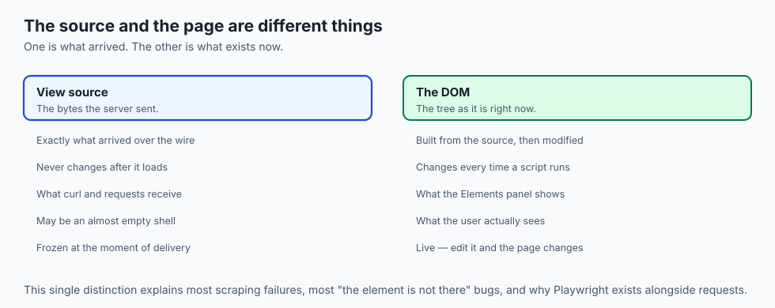

- **Three languages, three jobs.** HTML is structure, CSS is appearance, JavaScript is
  behaviour.
- **The browser turns text into two trees**, combines them, works out where
  everything goes, and paints pixels.
- **The DOM is a live object**, not a copy of your HTML. Scripts change it, and the
  page changes with it.
- **Nothing appears until the pipeline reaches paint**, which is why anything
  blocking an early step delays everything.
- **JavaScript runs on one thread** — the same one that lays out and paints — so a
  slow task freezes the page.

---

## Historical background

- **HTML in 1991 was documents only.** No styling, no scripting, no layout control.
- **Presentation crept into HTML** through tags like `<font>` and `<center>`, mixing
  appearance with structure and making pages unmaintainable.
- **CSS, 1996, was the correction**: pull presentation out entirely, so one stylesheet
  could restyle a thousand pages.
- **JavaScript arrived in 1995**, written in ten days, for form validation. It now
  runs most of the interface layer of the internet.
- **The DOM was standardised in 1998**, giving scripts a defined way to read and
  change the page.
- **The separation held.** Three decades on, the division of labour is still the right
  one, and every framework is built on top of it rather than replacing it.

---

## What it is — and what it is not

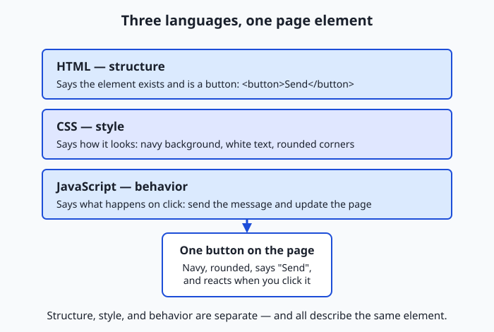

| Language | Its one job | Example | Without it |
| --- | --- | --- | --- |
| HTML | Structure and content | `<h1>Hello</h1>` marks a top-level heading | Nothing to show |
| CSS | Presentation | `h1 { color: navy; }` | Content shows, unstyled |
| JavaScript | Behaviour | Change text on a click | The page cannot respond |

**It is not:**

- **Not three equal partners.** A page works with only HTML. The other two are
  additions.
- **Not what you wrote.** The rendered page is the DOM after scripts have run, which
  may differ entirely from the source.
- **Not single-pass.** Layout and paint run again whenever something changes.
- **Not one thread doing one thing.** Networking and rasterisation happen elsewhere;
  it is your JavaScript that shares a thread with layout.

---

## Why it was created and what problems it solves

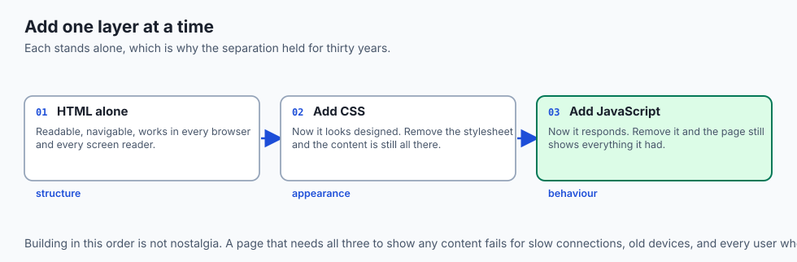

- **Separation of concerns.** A designer can restyle a site without touching content,
  and a script can add behaviour without touching either.
- **Incremental display.** The parser builds the DOM as bytes arrive, so long pages
  start showing before they finish downloading.
- **One document, many presentations.** The same HTML serves a phone, a printer and a
  screen reader.
- **Accessibility by structure.** A heading marked as a heading is navigable; a
  heading made large with CSS is not.
- **A programmable document.** The DOM turned a page from something delivered into
  something a program can manipulate.

---

## How it works

### From bytes to a tree: the DOM

- **The parser reads the HTML left to right**, recognising tags and turning them into
  tokens, then assembling those into a tree.
- **Nesting in the source becomes parent and child links.** A `<p>` inside a
  `<section>` becomes a child of that section's node.
- **The DOM is live, not a copy.** Scripts add, remove and edit nodes, and every
  change is a change to the page.
- **It is built incrementally**, which is why long pages begin showing before they
  have fully arrived.
- **This is where source and rendered page diverge.** A paragraph inserted by a script
  exists on screen and appears nowhere in the HTML text.

### The second tree: the CSSOM

- **Every piece of CSS is gathered** — `<style>` blocks, linked stylesheets, inline
  attributes — and parsed into its own tree.
- **CSS cascades.** Several rules can target one element, resolved by specificity and
  order, so the CSSOM stores the final computed style.
- **CSS is render-blocking**, deliberately: a rule at the end of the file could
  restyle an element at the top, and painting early would flash the wrong appearance.

### Combining them: render tree, layout, paint

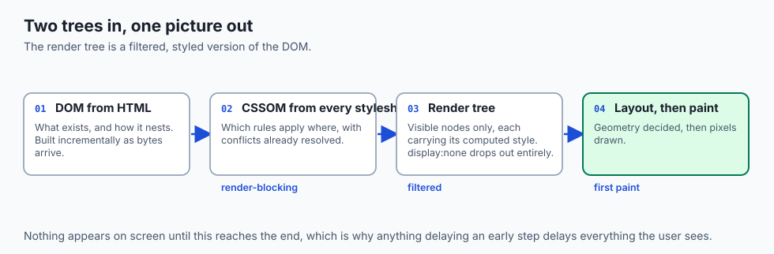

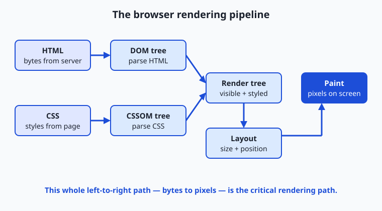

| Step | Input | Output | What it decides |
| --- | --- | --- | --- |
| Parse HTML | HTML bytes | DOM tree | What exists and how it nests |
| Parse CSS | CSS from all sources | CSSOM | Which styles apply where |
| Render tree | DOM + CSSOM | Render tree | What is visible, with its styles |
| Layout | Render tree | Box geometry | Exact size and position of every box |
| Paint | Positioned boxes | Pixels | Final colours, text and images |

- **Only visible nodes reach the render tree.** `display: none` drops an element
  entirely; `<head>` never appears.
- **Layout resolves relative sizes** — `50%`, `1em` — against the viewport and each
  parent. This is where "32 pixels tall, 16 from the top" is decided.
- **Paint rasterises** text, colours, borders, shadows and images into layers to be
  composited.
- **This whole sequence is the critical rendering path**, and nothing appears until it
  reaches paint.
- **It runs again on change.** A script that alters a size, or a window resize, forces
  layout and paint for the affected region — which is why unnecessary reflows cause
  jank.

### JavaScript, blocking, and the event loop

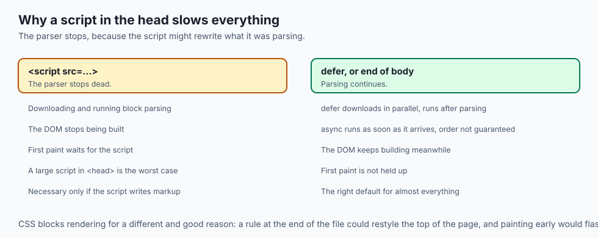

- **An ordinary `<script>` tag stops the parser.** The script must run before parsing
  continues, because it might change the HTML being parsed.
- **A large script in `<head>` therefore delays first paint.** This is what
  "render-blocking JavaScript" means, and why scripts go at the end of the body or
  are marked `defer` or `async`.
- **Once interactive, JavaScript runs on the main thread** — the same one that lays
  out and paints.
- **The event loop takes one task at a time**: a click handler, a timer, a network
  response. It runs it to completion, updates the screen if anything changed, then
  takes the next.
- **One at a time means one slow task blocks everything.** Clicks queue unhandled and
  the page appears frozen until it finishes.

---

## An everyday analogy

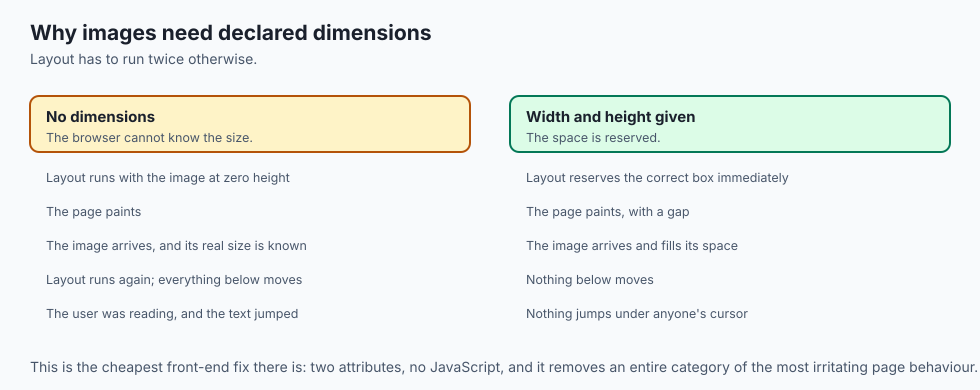

Printing a newspaper.

| The newspaper | The browser |
| --- | --- |
| The manuscript | HTML |
| The style guide | CSS |
| The editor making live changes | JavaScript |
| The marked-up copy | The DOM |
| Deciding column widths and page breaks | Layout |
| Ink on paper | Paint |
| One typesetter, one job at a time | The event loop |

- **The manuscript alone is readable.** The style guide makes it look like a
  newspaper.
- **Changing a headline's size means re-flowing the column** and possibly the page.
  That is reflow, and it is why it costs.
- **One typesetter means one task at a time.** Hand them something enormous and
  everything else waits.

---

## Examples in practice

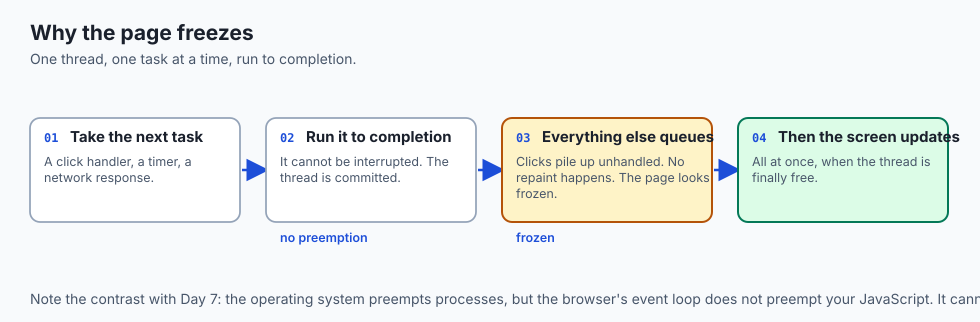

- **View-source showing nothing while the page is full of content**: the content was
  built by scripts, and lives only in the DOM.
- **A flash of unstyled text**: CSS arrived late, and the browser painted before the
  CSSOM was complete.
- **A page that freezes while a script runs**: the main thread is busy, so clicks
  queue and nothing repaints.
- **Layout shifting as images load**: no dimensions were given, so layout had to run
  again once the sizes were known.
- **A scraper that finds an empty page** where a browser shows a table: it fetched the
  HTML, and the table is built by JavaScript.

---

## Implications: security, privacy, performance, scalability, and cost

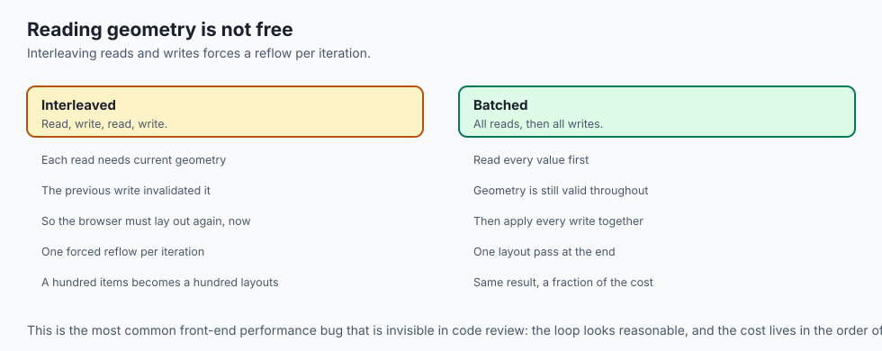

- **Security: cross-site scripting is a DOM problem.** Inserting untrusted text as
  HTML lets someone else's script run with your page's privileges.
- **Never build HTML by string concatenation from user input.** Set text content
  rather than markup, or escape properly.
- **Privacy: scripts see everything on the page**, including anything a third-party
  script is loaded alongside. Every script you include is a party to your users' data.
- **Performance: the critical rendering path is what users feel.** Reducing
  render-blocking resources beats almost any other optimisation.
- **Layout is the expensive step to trigger repeatedly.** Reading a geometry property
  in a loop that also writes one forces a reflow per iteration.
- **Cost: a heavy front end costs your users, not you.** They pay in battery,
  bandwidth and a slow device you never tested on.

---

## Alternatives: free, open source, and commercial

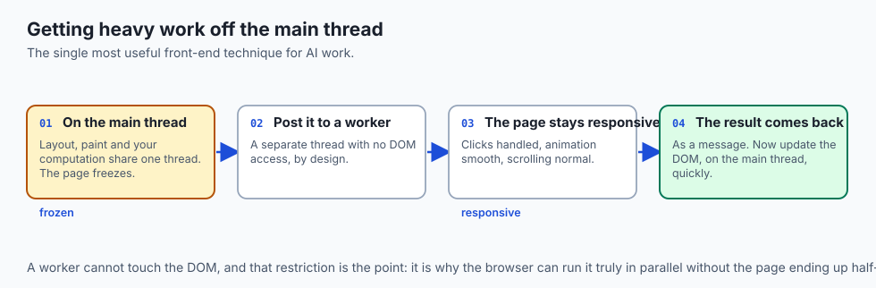

| Tool | Type | What it gives you |
| --- | --- | --- |
| Browser developer tools | Bundled, free | The DOM, the styles, the timeline, all live |
| Lighthouse | Free | A graded audit of the rendering path |
| React / Vue / Svelte | Free, open source | Declarative UI on top of the same DOM |
| Streamlit / Gradio | Free, open source | An AI demo without writing front end at all |
| Web workers | Free, built in | Move heavy work off the main thread |
| Puppeteer / Playwright | Free, open source | Drive a real browser, so scripts have run |

- **Use Gradio or Streamlit for a model demo.** They exist precisely so you do not
  build a front end to test an idea.
- **Scrape with Playwright, not `requests`**, whenever the content is built by
  scripts. Otherwise you are reading a shell.

---

## Comparison with related concepts

| Term | What it actually is |
| --- | --- |
| **DOM** | The live tree of the page, as it currently is |
| **CSSOM** | The parsed, resolved styles |
| **Render tree** | Visible nodes with their computed styles |
| **Layout / reflow** | Computing every box's size and position |
| **Paint** | Turning boxes into pixels |
| **Event loop** | One-task-at-a-time scheduling on the main thread |
| **Critical rendering path** | Everything that must finish before first paint |

---

## When to use it — and when not to

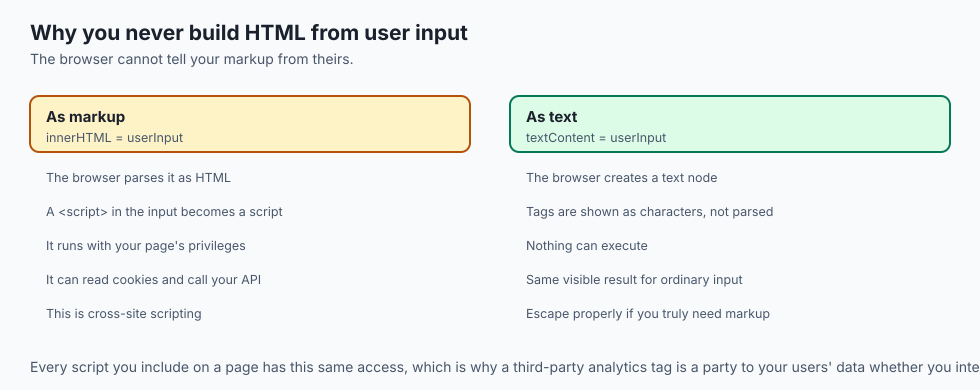

- **Put scripts at the end of the body**, or mark them `defer`, unless they must run
  before the page is parsed.
- **Give images explicit dimensions** so layout does not have to run twice.
- **Move heavy computation to a web worker.** Anything over a few milliseconds on the
  main thread is felt.
- **Batch DOM reads and writes.** Interleaving them forces a reflow between each pair.
- **Do not reach for a framework for a static page.** You are shipping a runtime to
  do what HTML already does.
- **Do not fight the cascade with `!important`.** It works once and makes the next
  change harder.

---

## The AI connection

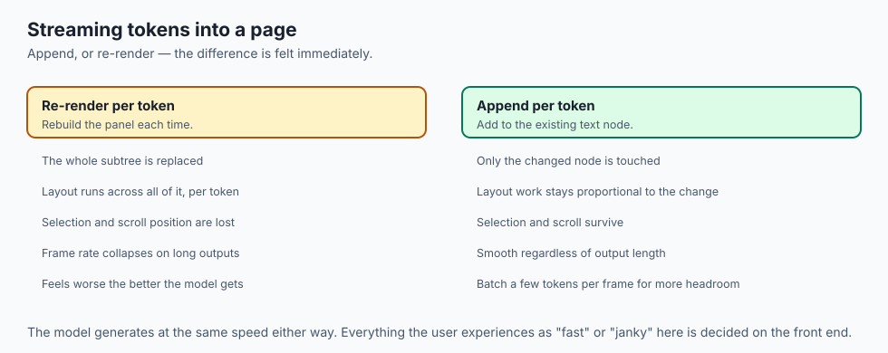

- **A streamed model response is a DOM update per token.** Appending text is cheap;
  re-rendering a whole panel per token is not, and the difference is visible.
- **Client-side inference blocks the page.** Running a model in the browser on the
  main thread freezes everything — this is exactly what web workers exist for.
- **Scraping training data needs a real browser** for any site that builds its content
  with scripts.
- **Every AI product's interface lives here.** The model is the easy part; the
  streaming, cancellable, responsive interface around it is the work.
- **Accessibility is not optional in a demo.** A model output announced correctly by a
  screen reader is a structural decision, made in HTML.

---

## Knowledge check

```yaml
quiz:
  question: "A scraper fetches a page with `curl` and finds an empty container where the browser clearly shows a populated table. What explains the difference?"
  options:
    - "The table is built by JavaScript into the DOM, and curl retrieves only the original HTML"
    - "The server returns different HTML depending on the User-Agent header"
    - "The table is styled with CSS that curl cannot apply"
    - "The response was compressed and curl did not decompress the body"
  answer_index: 0
  explanation: "The source HTML and the rendered page are different things. curl fetches bytes; it never runs scripts, so anything a script inserted into the DOM exists on screen and nowhere in what curl received."
```

---

## Hands-on exercise

Watch the pipeline run, then break each stage on purpose. Worked through fully in
the Day 20 lab directory.

| What you are doing | Where |
| --- | --- |
| Compare source with rendered DOM | View source, then the Elements panel |
| Edit the DOM live | Double-click a node in Elements and change its text |
| See computed styles | The Styles and Computed panes |
| Watch the pipeline | The Performance panel, record a reload |
| Find render-blocking resources | The Network panel, and Lighthouse |
| Freeze the page deliberately | Run a long loop in the Console |

### Expected output

```text
Parse HTML       12 ms
Recalculate Style 4 ms
Layout            7 ms
Paint             3 ms
[blocked] main thread busy 4200 ms
```

- **Layout and paint are milliseconds** on a simple page.
- **The four-second block is your loop**, and during it nothing responds — which is
  the event loop made visible.

### Validate your work

- [ ] You found an element in the DOM that does not appear in view-source
- [ ] You changed a style live and watched layout re-run
- [ ] You identified one render-blocking resource on a real site
- [ ] You froze a page with a long synchronous task and explained why clicks queued
- [ ] You can name the five pipeline stages in order
- [ ] `bash tests/run_tests.sh` reports 0 failures

### Troubleshooting

- **The Elements panel and view-source disagree.** That is the lesson, not a bug.
- **Your CSS change does nothing.** Something more specific is winning. Check the
  Computed pane, which shows which rule actually applied.
- **The Performance recording is unreadable.** Record a reload of a simple page first;
  a real site's timeline is overwhelming until you know the shapes.
- **`display: none` versus `visibility: hidden`.** The first leaves the render tree
  entirely; the second still occupies its space.

### Common mistakes

- **Reading source and assuming that is the page.**
- **Putting a large script in `<head>`** and wondering why first paint is slow.
- **Doing heavy work on the main thread** and calling the browser slow.
- **Building HTML from user input by concatenation.**

---

## Practice assignment

- **Build a page with only HTML**, then add CSS, then add JavaScript, saving a
  screenshot at each stage. The three roles become impossible to confuse afterwards.
- **Find three sites whose content is script-built** and three whose content is in the
  source, using view-source alone.
- **Record a Performance timeline** for a heavy site and identify the longest task.
- **Trigger a layout thrash deliberately**: a loop that reads a geometry property and
  writes a style each iteration. Then fix it by batching, and measure both.

---

## Extension challenge

- **Move a heavy computation to a web worker** and prove the page stays responsive
  during it. This is the single most useful front-end technique for AI work.
- **Measure the cost of render-blocking CSS** by loading the same page with the
  stylesheet inline and linked, comparing time to first paint.
- **Build a token-streaming display** that appends text rather than re-rendering, and
  compare its frame rate against one that re-renders the whole panel.
- **Read a page with a screen reader** and find out what your markup actually
  communicates. It is usually less than you assumed.

---

