## Why this matters

- **This is the week's payoff.** Days 15 to 20 explained the machinery; today you
  learn to look at it.
- **"The API call failed" is not a diagnosis.** By the end of today it will be one of
  five specific, distinguishable failures.
- **`curl -v` shows every layer at once** — DNS, TCP, TLS, request, response — in one
  screen.
- **Reproducing a failure outside your code** is the fastest way to find out whether
  your code is even involved.
- **You will use these two tools for the rest of your career**, on every service you
  ever build or consume.

---

## The idea in plain language

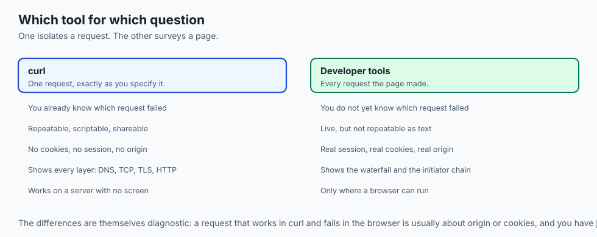

- **Inspecting traffic means composing a request from named parts** and reading a
  response by its named parts.
- **`curl` is for one request**, precisely controlled and endlessly repeatable.
- **Developer tools are for a whole page** — every request it made, in one timeline.
- **Neither guesses.** They show you what was actually sent and what actually came
  back.
- **The skill is not the tools.** It is asking the failure questions in the right
  order.

---

## Historical background

- **`curl` was released in 1998**, written by Daniel Stenberg to fetch currency rates
  from a script.
- **It now ships on essentially every operating system**, including Windows, and runs
  in cars, phones and televisions — one of the most widely deployed programs ever
  written.
- **Its companion library, libcurl, is what most other tools use underneath**, which
  is why their behaviour matches.
- **Browser developer tools arrived later.** Firebug, a Firefox extension from 2006,
  established the shape; browsers built it in afterwards.
- **The network panel has barely changed since.** The columns you will read today are
  the columns from 2010, because they were the right ones.

---

## What it is — and what it is not

**They are:**

- Instruments. They report what happened, without opinion.
- Complementary. `curl` isolates one request; developer tools show the whole page.
- Exact. `curl` sends precisely what you asked, which is the point.

**They are not:**

- **Not a substitute for reading the error.** Most failures announce themselves
  clearly, and are read past.
- **Not identical to your program.** `curl` has its own trust store, its own
  redirects policy, its own defaults — differences that are themselves informative.
- **Not a load tester.** Measuring one request tells you about latency, not capacity.
- **Not safe to paste publicly.** A copied `curl` command carries your live
  credentials.

---

## Why it was created and what problems it solves

- **Isolating the variable.** Was it your code, your network, the server, or the
  request itself? Nothing else answers this as fast.
- **Reproducibility.** A `curl` command is a bug report anyone can run.
- **Automation.** Anything you can inspect, you can script and schedule.
- **Seeing the invisible.** A browser hides redirects, retries, caching and
  compression; these tools show them.
- **Measuring, not guessing.** `-w` turns "it feels slow" into five numbers, each
  pointing at a different stage.

---

## How it works

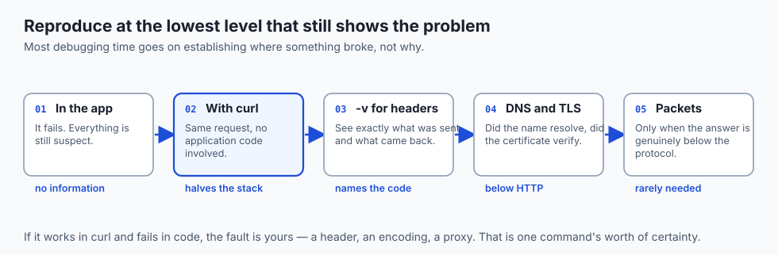

### The anatomy of a curl command

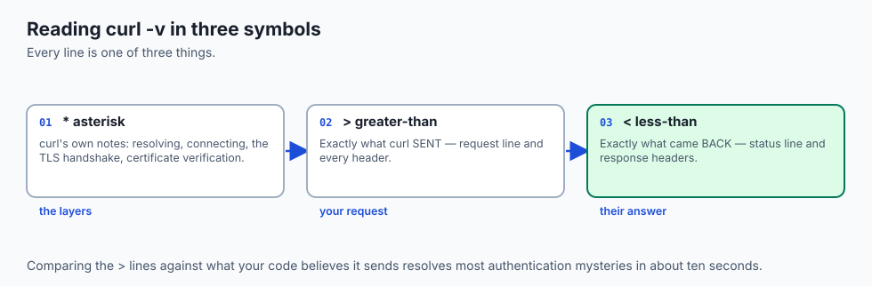


- **Bare `curl URL` makes a GET** and prints the body.
- **`-v` is the debugging view.** Lines beginning `>` are what was sent, `<` are the
  response headers, and `*` are curl's own notes about resolving, connecting and the
  TLS handshake.
- **In one command you see every layer from this week**, laid out in order.

| Flag | What it does | Why you reach for it |
| --- | --- | --- |
| `-v` | The full conversation | The default debugging view |
| `-I` | Headers only (HEAD) | Status and headers, no body download |
| `-L` | Follow redirects | A `301` is not the answer; chase it |
| `-H` | Set a request header | Servers answer differently based on them |
| `-X` | Set the method | Exercise methods a browser will not send |
| `-d` | Send a body; implies POST | Reproduce your code's exact payload |
| `-w` | Print chosen variables after transfer | Just the status, or a timing breakdown |
| `-o` / `-s` | Body to a file / silence the meter | Keep output clean |
| `--resolve` | Force a hostname to an address | Test a new server before DNS points at it |

- **`-w` reads timing variables** curl measures on every transfer:
  `time_namelookup`, `time_connect`, `time_appconnect`, `time_starttransfer` — time
  to first byte — and `time_total`.
- **That turns curl into a stopwatch** that says *which stage* was slow.
- **`-c` and `-b` save and send cookies**, letting you reproduce a session a plain
  request would not have.

### Reading the network panel

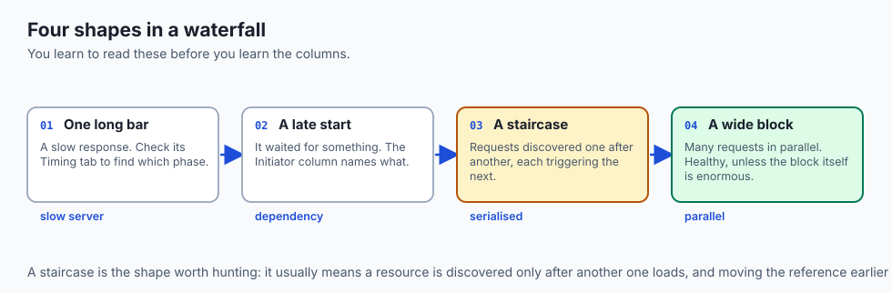

Open developer tools (F12, or Command-Option-I on a Mac) and reload with the Network
tab open. Every request is a row.

| Column | What it tells you | What to watch for |
| --- | --- | --- |
| Name | The resource requested | Finding the one you care about |
| Status | The HTTP status code | Red rows first, always |
| Type | Document, script, fetch, image, font | Filter to `Fetch/XHR` for API calls only |
| Initiator | What caused the request | Tracing a mystery request to its code |
| Size | Bytes transferred, and cache hits | A surprisingly large or uncached download |
| Time | End to end duration | The slow request in a slow page |
| Waterfall | A timeline bar per request | Where the time actually went |

- **Click a row** for Headers, Payload, Response and Timing — the same phases `-w`
  reports, per request.
- **The waterfall assembles them into one picture**, so a long bar or a late start
  jumps out.
- **Filter by type** to hide everything but the API calls your application made.

### A systematic method

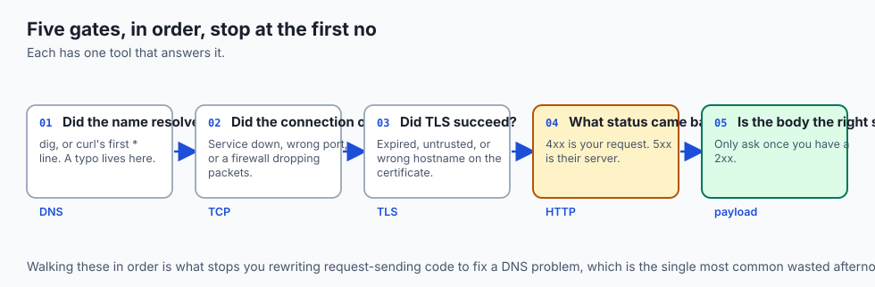


Ask these in order, and stop at the first "no":

1. **Did the name resolve?** If not, it is DNS. Check for typos; confirm with `dig`.
2. **Did the connection open?** If not, the service is down, or a port or firewall is
   blocking you.
3. **Did TLS succeed?** If not, the certificate is expired, untrusted, or for the
   wrong name.
4. **What status came back?** `4xx` means your request was wrong; `5xx` means the
   server failed handling a valid one.
5. **Is the body the shape you expected?** Only ask this once you have a `2xx`.

- **Walking the gates in order** means you never rewrite request-sending code to fix
  a DNS problem, and never blame a server for a `4xx` you caused.

---

## An everyday analogy

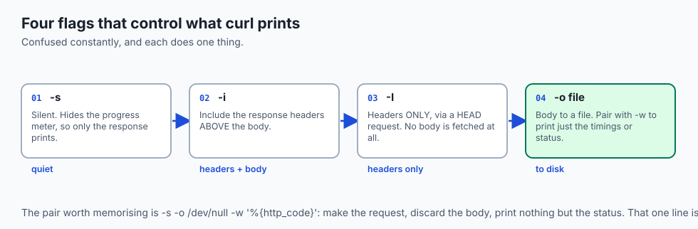

A doctor working through a differential diagnosis.

| The clinic | The request |
| --- | --- |
| "Where does it hurt?" | Which stage failed |
| Taking a pulse | `ping` and `dig` |
| An X-ray | `curl -v` |
| A full panel of tests | The network waterfall |
| Ruling things out in order | The decision tree |
| Not prescribing before diagnosing | Not editing code before knowing the stage |

- **A doctor does not start treatment before the diagnosis.** Rewriting your client
  code before you know the failure stage is exactly that.
- **The cheapest tests come first.** `dig` costs a second; reading a stack trace
  costs twenty minutes.

---

## Examples in practice

- **`curl: (6) Could not resolve host`** — stage one. Nothing else has been attempted.
- **`curl: (7) Failed to connect`** — the name resolved and nothing accepted the
  connection.
- **`curl: (60) SSL certificate problem`** — stage three, and the message names which
  check failed.
- **`401` with a correct-looking key** — compare `curl -v` output against your code's
  actual headers. It is usually a missing `Bearer ` prefix.
- **A request that works in `curl` and fails in the browser** — almost always CORS,
  which `curl` does not enforce and browsers do.

---

## Implications: security, privacy, performance, scalability, and cost

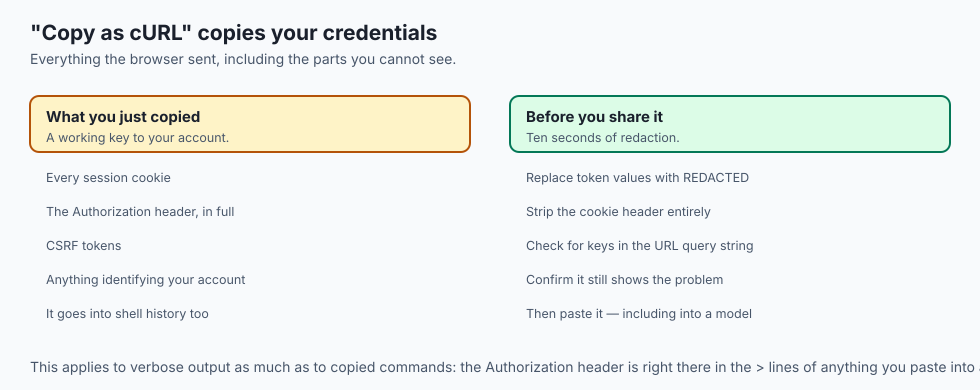

- **Security: "Copy as cURL" copies your credentials.** That command contains live
  session cookies and tokens. Redact before sharing, every time.
- **A `curl` command in your shell history is a credential in a file**, readable by
  anything that can read your home directory.
- **Never paste a verbose output into an issue tracker unredacted.** The
  `Authorization` header is right there in the `>` lines.
- **Privacy: developer tools show third-party requests.** Opening the network panel on
  a normal site is an education in who else is being told about your visit.
- **Performance: measure before optimising**, and measure the right stage. The
  timing breakdown exists so you do not guess.
- **Cost: reproducing with `curl` is free; guessing is not.** The expensive debugging
  session is the one that changes code before identifying the stage.

---

## Alternatives: free, open source, and commercial

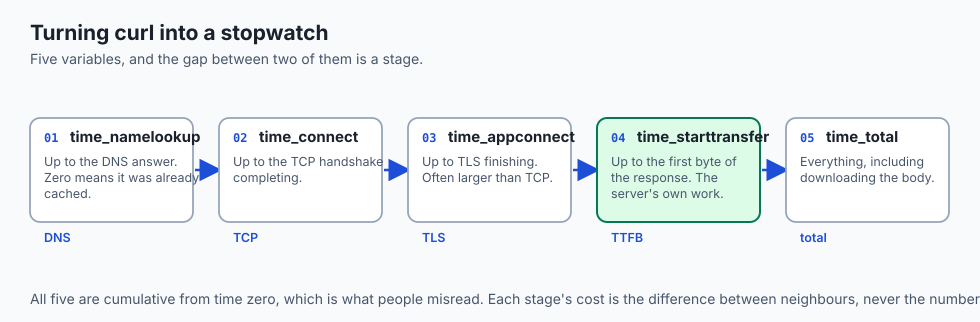

| Tool | Type | Where it fits |
| --- | --- | --- |
| `curl` | Free, open source | Everywhere. Present on every machine you will touch. |
| `httpie` | Free, open source | Friendlier syntax and colour; excellent for exploring |
| Browser devtools | Bundled, free | Whole-page view, timings, and the initiator chain |
| Postman / Insomnia | Free tiers | Saved collections, environments, team sharing |
| `mitmproxy` | Free, open source | Watching and rewriting traffic from apps you control |
| Wireshark | Free, open source | Below HTTP, when the problem is TCP or TLS itself |

- **Learn `curl` first even if you prefer a GUI.** It is what documentation, error
  messages and colleagues will speak.
- **Reach for `mitmproxy` when the client is not yours to instrument** — a mobile app,
  a closed binary, a container you cannot modify.

---

## Comparison with related concepts

| Term | What it actually is |
| --- | --- |
| **Verbose output** | curl's full record of the exchange and its own steps |
| **Waterfall** | A timeline of every request a page made |
| **Initiator** | What caused a request to be made |
| **Time to first byte** | When the response began, not when it finished |
| **Preflight** | A browser's `OPTIONS` check before a cross-origin request |
| **Copy as cURL** | A devtools command that reproduces a request — with credentials |

---

## When to use it — and when not to

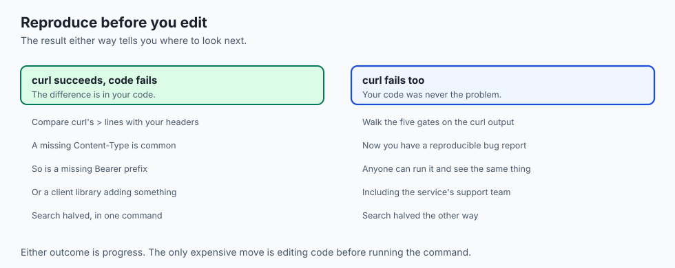

- **Reach for `curl` when you can name the one request** that is failing.
- **Reach for developer tools when you cannot** — when you do not yet know which
  request is the problem.
- **Reproduce in `curl` before editing any code.** If `curl` succeeds and your code
  fails, the difference is in your code, and you have halved the search.
- **Use `--resolve` to test a server before DNS points at it**, rather than editing
  your hosts file and forgetting.
- **Do not use `-k` to make an error go away.** It is stage three telling you
  something true.
- **Do not paste a `curl` command with real credentials** anywhere, including into a
  model.

---

## The AI connection

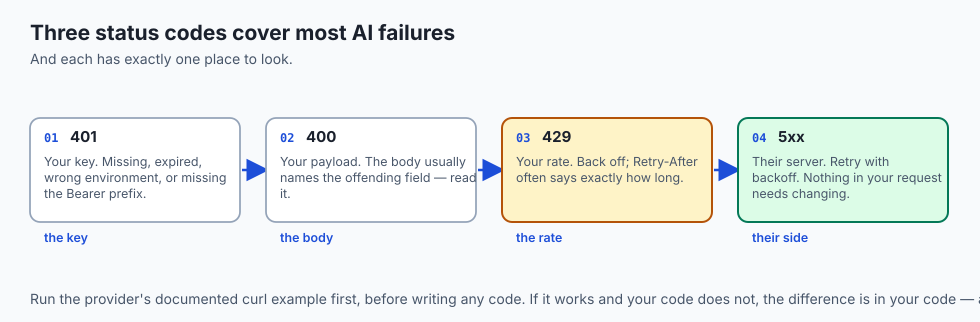

- **Every model provider's documentation opens with a `curl` example.** It is the
  reference implementation, and running it first tells you whether your key works
  before any code exists.
- **`401` is your key; `429` is your rate; `400` is your payload.** Three codes cover
  most of what goes wrong.
- **Reproduce a failing generation with `curl`** and you learn immediately whether the
  problem is your client library or the request itself.
- **Streaming responses are visible in `curl`** without `-s`, arriving in chunks —
  which makes the mechanism concrete rather than magical.
- **Timing a model call with `-w`** separates network latency from generation time,
  and the two need entirely different fixes.

---

## Knowledge check

```yaml
quiz:
  question: "A request succeeds from the command line with curl but fails from JavaScript in the browser, with the same URL, method and headers. What is the most likely cause?"
  options:
    - "The browser is enforcing cross-origin rules that curl does not implement"
    - "The browser is sending a different HTTP version than curl negotiated"
    - "curl is ignoring a certificate error the browser correctly rejects"
    - "The server is rate-limiting the browser but not the command line client"
  answer_index: 0
  explanation: "Cross-origin restrictions are enforced by browsers as a protection for the user, not by servers. curl has no origin and no same-origin policy, so it is unaffected — which is exactly why a request can work there and be blocked in a page."
```

---

## Hands-on exercise

Reproduce every stage of failure deliberately, then read a real page's waterfall.
Worked through fully in the Day 21 lab directory.

| What you are doing | Command |
| --- | --- |
| See the whole exchange | `curl -v https://example.com` |
| Headers only | `curl -I https://example.com` |
| Follow a redirect | `curl -IL http://example.com` |
| Send JSON | `curl -X POST -H 'Content-Type: application/json' -d '{"a":1}' URL` |
| Time every stage | `curl -w "@fmt.txt" -o /dev/null -s URL` |
| Fail at DNS | `curl -v https://no-such-host.invalid` |
| Fail at TLS | `curl -v https://expired.badssl.com` |

### Expected output

```text
*   Trying 93.184.216.34:443...
* Connected to example.com port 443
* SSL certificate verify ok.
> GET / HTTP/1.1
< HTTP/1.1 200 OK
time_namelookup: 0.024  time_connect: 0.061
time_appconnect: 0.128  time_starttransfer: 0.171
```

- **`*` lines are curl's own notes**, `>` is what it sent, `<` is what came back.
- **Subtract neighbouring timings** to get each stage's cost, as on Day 15.

### Validate your work

- [ ] You produced a failure at DNS, at connection, and at TLS, and can tell them
      apart from the error alone
- [ ] You reproduced a `POST` with a JSON body from the command line
- [ ] You read a timing breakdown and named the slowest stage
- [ ] You found a page's slowest request in the waterfall
- [ ] You traced one request back to the script that fired it, using Initiator
- [ ] `bash tests/run_tests.sh` reports 0 failures

### Troubleshooting

- **`curl` prints nothing.** The body may be empty. Add `-i` to see the status and
  headers.
- **Your JSON is rejected.** Shell quoting. Single-quote the whole payload, or use
  `--data-binary @file.json`.
- **`-I` returns `405`.** Some servers reject HEAD. Use `-s -o /dev/null -D -` instead.
- **The network panel is empty.** It only records while open. Reload with it open.
- **Too many rows to read.** Filter by `Fetch/XHR`, and tick "Disable cache".

### Common mistakes

- **Editing code before identifying the stage.**
- **Sharing a `curl` command with live credentials in it.**
- **Forgetting `-L`** and treating a `301` as the final answer.
- **Measuring one request** and concluding something about capacity.

---

## Practice assignment

- **Walk the decision tree on three deliberately broken requests** and record which
  gate each one failed at, with the exact error text.
- **Convert one request from the network panel into a `curl` command** with "Copy as
  cURL", then strip its credentials until it fails, to see which header mattered.
- **Time the same endpoint from two networks** and tabulate all five phases.
- **Find one third-party request** on a site you use daily, and trace who it goes to.

---

## Extension challenge

- **Write a health-check script** that walks the whole decision tree automatically and
  reports which gate failed. Schedule it with Day 14's cron.
- **Reproduce a CORS failure**, read the preflight `OPTIONS` request in the network
  panel, and explain exactly which response header was missing.
- **Compare `curl`'s trust store with your browser's** by finding a certificate one
  accepts and the other rejects.
- **Capture the same request in `mitmproxy`** and compare what it shows against
  `curl -v`. The difference is the part your client was doing silently.

---

