## Why this matters

- **Every model you will use is behind an API.** GPT, Claude, Gemini, the open ones
  you host yourself — all of them, the same shape.

- **An API is what lets you use a model you could never train**, on hardware you do
  not own, for the price of a request.

- **Everything you build will expose one too**, so that something else can call it.
- **This is Week 4**, and it turns you from someone who reads about services into
  someone who composes them.

- **Reading documentation quickly is half the skill.** The other half you already
  have: HTTP.

---

## The idea in plain language

- **An API is a contract between two programs**: send this shape, get that shape back.
- **The client asks; the server answers.** One request, one response.
- **The contract is all either side needs.** How the server does its work stays
  private behind the line.

- **A web API is HTTP with structure.** Same methods, same status codes, but the body
  is data rather than a page.

- **JSON is the near-universal language** of that body, which is why tomorrow's
  lessons dwell on it.

---

## Historical background

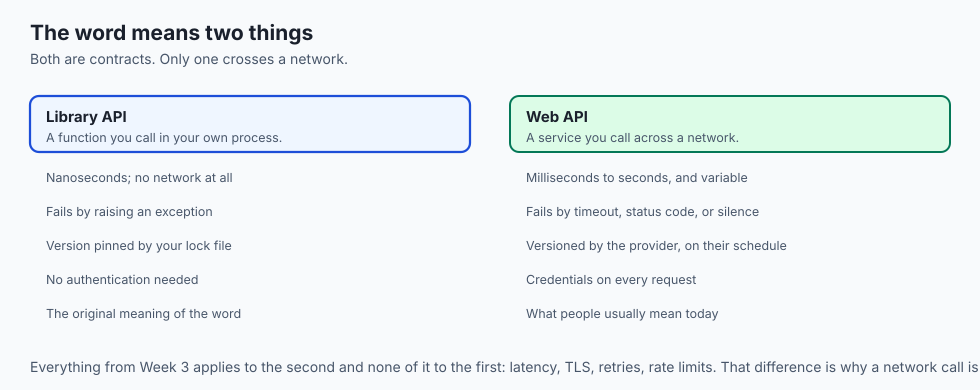

- **"API" originally meant a library's function signatures** — the interface one piece
  of code offered another, inside one program.

- **Networked APIs came next**, with heavyweight protocols like CORBA and SOAP that
  required generated code and matching toolchains on both ends.

- **REST was described in 2000** by Roy Fielding, in a dissertation, as an
  architectural style rather than a standard — use HTTP as it was designed.

- **The public API era began around 2005.** Amazon, Flickr, Twitter and Google opened
  interfaces, and companies discovered their service could be a platform.

- **JSON displaced XML** over the following decade, largely because it was smaller and
  needed no library to read.

- **The pattern is now universal.** Every service ships an API, because a service
  nothing can call is a service nothing will build on.

---

## What it is — and what it is not

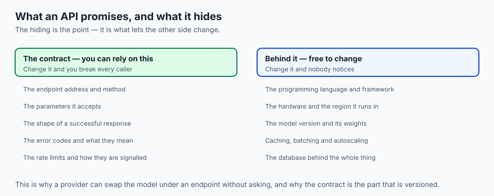

**It is:**

- A published agreement about requests and responses.
- A boundary that hides implementation deliberately.
- A product in its own right, versioned and supported like one.

**It is not:**

- **Not a database.** You get what the interface offers, in the shape it offers it.
- **Not a website.** It returns data for programs, not pages for people.
- **Not stable by nature.** It is stable because someone chose to keep it so, and
  publishing a version number is that promise made explicit.

- **Not free of the network.** Everything from Week 3 still applies: latency, TLS,
  status codes, retries.

---

## Why it was created and what problems it solves

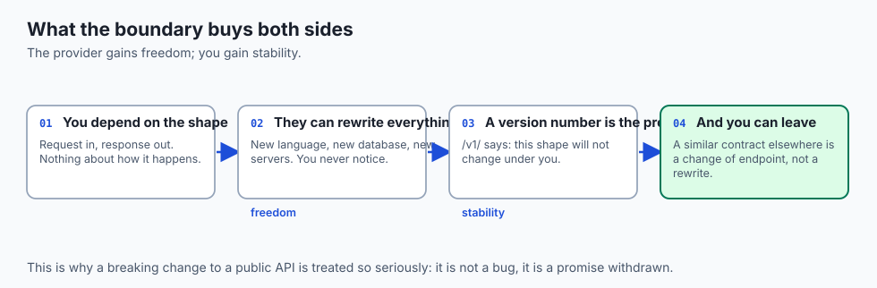

- **Reuse without copying.** You call a service rather than rebuilding it.
- **Separation of concerns.** The provider can rewrite everything behind the contract
  and you never notice.

- **Composition.** Small services combine into something none of them could do alone.
- **Access to what you cannot own.** A model that cost millions to train answers your
  request for a fraction of a cent.

- **A machine-readable interface.** Anything a person can do through a screen,
  a program can do through an API — which is what makes automation possible at all.

---

## How it works

### The endpoint: an address for an operation


- **An endpoint is a URL the API answers at**, usually standing for one resource or
  operation.

- **`/todos/1` returns to-do item one**; `/users/1` returns user one. The path names
  *what you are asking about*, often with an identifier.

- **An API is largely a well-organised set of endpoints.**
- **Read the diagram as a boundary.** Your program is the client; the service is the
  server; the API is the single defined line between them.

- **The client depends only on that line.** The database, the language and the
  machinery stay private behind it.

### The request

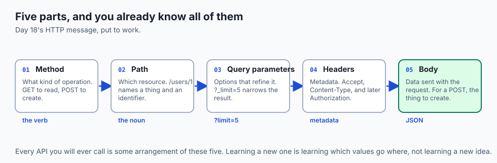

| Part | What it carries | Example |
| --- | --- | --- |
| Method | The verb — what kind of operation | `GET`, `POST` |
| Path | Which resource | `/users/1` |
| Query parameters | Options that refine it | `?_limit=5` |
| Headers | Metadata | `Accept: application/json` |
| Body | Data sent *with* the request | `{"title":"Learn APIs"}` |

- **The method says what you want done**, exactly as on Day 18.
- **Parameters refine**, the way options on an order narrow it down.
- **Headers carry metadata**, including the `Authorization` header that will prove who
  you are from Day 25.

- **The body describes the thing to create**, for a `POST`, almost always as JSON.

### The response


- **A status code** tells your program at a glance whether it worked — Day 18's `200`,
  `404`, `401`, `429`, `500`.

- **Headers describe the answer**, `Content-Type: application/json` above all.
- **The body is the data**, again almost always JSON.
- **JSON is nested keys and values**, readable by both humans and programs, and the
  near-universal language of web APIs.

- **One request, one response.** The same conversation your browser has with every
  page — now made by *your program*, for *structured data* rather than a page to
  display.

### Reading the documentation

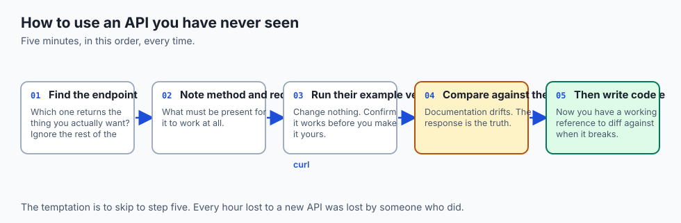

- **You cannot guess your way through an API.** Every one defines its own endpoints,
  parameters and formats.

- **The documentation lists each endpoint**, the parameters it accepts, an example
  request and an example response.

- **The method that works**: find the endpoint that returns what you want, note its
  method and required parameters, copy the example, run it, and compare your response
  against the documented one.

- **Good documentation includes a runnable example** for exactly this reason.
- **Half of using a new API is reading its documentation quickly**, and that is a
  skill that transfers to every API you will ever meet.

---

## An everyday analogy

Ordering at a restaurant.

| The restaurant | The API |
| --- | --- |
| The menu | The documentation |
| A dish name | An endpoint |
| "No onions, extra rice" | Query parameters |
| Your table number | Your credentials |
| The order slip | The request |
| The plate arriving | The response |
| The kitchen | The implementation, hidden |

- **You order from the menu**, not by describing a recipe. The menu is the contract.
- **You never enter the kitchen.** How the dish is made is deliberately none of your
  business, and that is what lets them change it.

- **"We are out of that" is a `4xx`.** "The oven caught fire" is a `5xx`.

---

## Examples in practice

- **`GET /users/1`** returns one user as JSON — the simplest complete example there
  is.

- **`POST /v1/messages`** with a JSON body is every hosted model call you will ever
  make.

- **A weather API taking `?lat=&lon=`** and returning a forecast object.
- **A payment API where `POST` twice creates two charges**, which is Day 18's
  idempotency problem with money attached.

- **A documented endpoint that returns a different shape than documented**, which is
  why you compare against the example rather than trusting the prose.

---

## Implications: security, privacy, performance, scalability, and cost

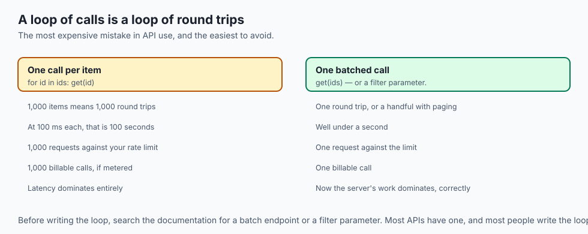

- **Security: an API is your service's attack surface**, published deliberately.
  Everything exposed is exposed to everyone who finds it.

- **Never trust input from a client.** Validate on the server, always, because the
  client may not be the one you wrote.

- **Privacy: an API returns exactly what it returns.** An endpoint that includes email
  addresses in a response has published them, whether the interface displays them or
  not.

- **Performance: every call is a network round trip.** A loop making a thousand calls
  is a thousand round trips, and Day 15's arithmetic applies.

- **Batch endpoints exist for this reason**, and using one is usually a larger win
  than any code optimisation.

- **Cost: APIs are metered.** A retry loop with a bug is a bill, and a runaway loop
  against a model API is an expensive bug indeed.

---

## Alternatives: free, open source, and commercial

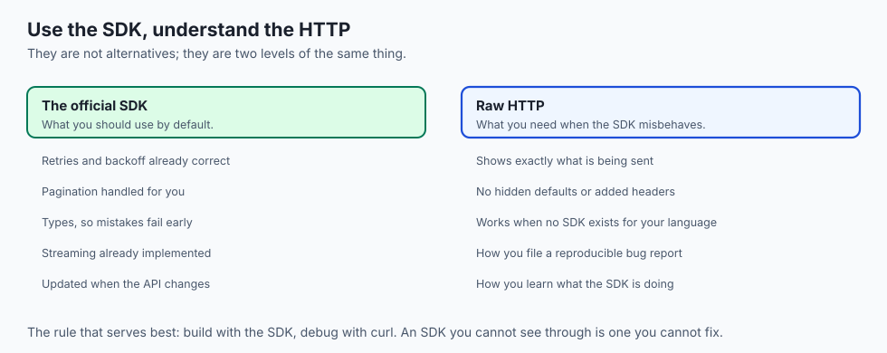

| Approach | Type | Where it fits |
| --- | --- | --- |
| REST over HTTP | The default | Almost everything; Day 23 covers it properly |
| GraphQL | Free, open source | Clients that need to choose their own response shape |
| gRPC | Free, open source | Service-to-service calls where speed matters more than readability |
| WebSockets | Built in | Persistent two-way channels, not request-response |
| Webhooks | The inverse | The server calls *you* — Day 26 |
| SDK / client library | Usually free | The same API, wrapped, with retries and types included |

- **Use the official client library** where one exists. It handles retries, pagination
  and errors you would otherwise get wrong.

- **Understand the underlying HTTP anyway.** When the library misbehaves, you debug it
  with `curl`.

---

## Comparison with related concepts

| Term | What it actually is |
| --- | --- |
| **API** | The published contract between two programs |
| **Endpoint** | One URL the API answers at |
| **Client** | The program making the request |
| **Server** | The program answering it |
| **Payload** | The body of a request or response |
| **SDK** | A library wrapping an API in your language |
| **Contract** | What both sides agreed, and what versioning protects |

---

## When to use it — and when not to

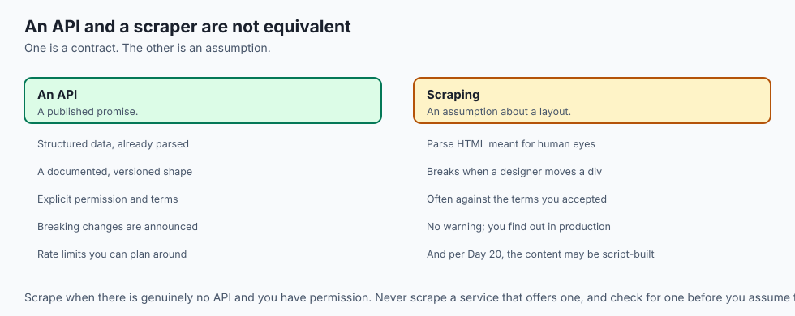

- **Use an API when someone else has solved the problem better** than you will this
  week — payments, maps, speech, translation, inference.

- **Use one when the data lives elsewhere** and you need it current.
- **Expose one when something else will need to call your work**, including your own
  future project.

- **Do not call an API in a loop** when a batch endpoint exists. Read the
  documentation for one before writing the loop.

- **Do not scrape when an API exists.** It is slower, more fragile, and usually
  against the terms you agreed to.

- **Do not build an API for one caller you control.** A function call is cheaper than
  a network hop, and you can always promote it later.

---

## The AI connection

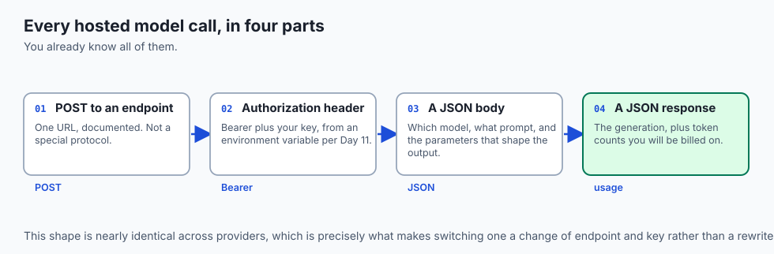

- **Every hosted model is an API**, and the request is a `POST` with a JSON body — the
  exact shape in this lesson.

- **The contract is what lets you switch providers.** Similar shapes mean a change of
  endpoint and key rather than a rewrite.

- **Your own model becomes useful when it has an API.** A notebook helps you; an
  endpoint helps everyone else.

- **Rate limits and token costs are contract terms**, as real as the request format,
  and Day 27 deals with them properly.

- **Agents and tool use are APIs all the way down.** A model calling a tool is a
  program calling an API, with the model choosing the arguments.

---

## Knowledge check

```yaml
quiz:
  question: "A service rewrites its entire backend — new language, new database, new servers — and existing client programs keep working with no changes. What made that possible?"
  options:
    - "The API contract stayed the same, and clients depend only on the contract"
    - "The clients were using an SDK that absorbed the changes"
    - "HTTP is stateless, so clients never noticed the servers changed"
    - "The new backend returned the same status codes as the old one"
  answer_index: 0
  explanation: "The contract is the whole point of the boundary: clients depend on the shape of requests and responses, never on what produces them. That is what lets everything behind the line be replaced without coordination."
```

---

## Hands-on exercise

Call a real API, read its documentation, and compare what you got against what was
promised. Worked through fully in the Day 22 lab directory.

| What you are doing | Command |
| --- | --- |
| Fetch one resource | `curl https://jsonplaceholder.typicode.com/todos/1` |
| See the content type | `curl -I https://jsonplaceholder.typicode.com/todos/1` |
| Refine with a parameter | `curl 'https://jsonplaceholder.typicode.com/todos?_limit=3'` |
| Filter by field | `curl 'https://jsonplaceholder.typicode.com/todos?userId=1'` |
| Create something | `curl -X POST -H 'Content-Type: application/json' -d '{"title":"Learn APIs"}' https://jsonplaceholder.typicode.com/todos` |
| Ask for a missing resource | `curl -i https://jsonplaceholder.typicode.com/todos/99999` |

### Expected output

```text
{"userId":1,"id":1,"title":"delectus aut autem","completed":false}
Content-Type: application/json; charset=utf-8
HTTP/1.1 404 Not Found
{}
```

- **The body is JSON**, and `Content-Type` says so — which is how your program knows
  to parse it.

- **`404` with an empty object** is the API saying "no such resource" in its own
  vocabulary.

### Validate your work

- [ ] You fetched a single resource and a filtered collection
- [ ] You created something with a `POST` and read the status code it returned
- [ ] You provoked a `404` and can explain why it is a `4xx` rather than a `5xx`
- [ ] You found the endpoint you used in the API's documentation and compared the
      documented response with yours

- [ ] You can name the five parts of a request without looking
- [ ] `bash tests/run_tests.sh` reports 0 failures

### Troubleshooting

- **The URL with `?` does nothing.** The shell interprets `?` and `&`. Quote the whole
  URL.

- **Your `POST` body is ignored.** Missing `Content-Type: application/json`.
- **The JSON is one unreadable line.** Pipe it through `jq`, or `python3 -m json.tool`.
- **You get HTML back instead of JSON.** You probably hit an error page. Check the
  status with `-i`.

### Common mistakes

- **Guessing endpoints** instead of reading the documentation.
- **Assuming a `200` means the body is what you wanted.** It means the request was
  handled.

- **Calling in a loop** where a parameter would have returned everything at once.
- **Hard-coding the base URL** in fifty places instead of one.

---

## Practice assignment

- **Pick three public APIs** you have never used and, from their documentation alone,
  make one successful request to each. Time how long each took to figure out.

- **Write down each one's contract** in your own words: base URL, one endpoint, its
  parameters, its response shape.

- **Find one API whose documentation is wrong** about something, and note how you
  discovered it.

- **Sketch the API you would expose** for something you have already built, listing
  three endpoints and their shapes.

---

## Extension challenge

- **Read an OpenAPI specification** for a real service and find the endpoint you used.
  A machine-readable contract is what generates SDKs and documentation alike.

- **Call the same API from `curl` and from Python** and confirm you get identical
  responses. Any difference is your client adding something.

- **Build the smallest possible API** — one endpoint, returning JSON — and call it from
  another program. Being on both sides of the line once teaches more than reading
  about it.

- **Compare a REST endpoint with a GraphQL one** for the same data, and count the
  round trips each needs to answer the same question.

---

