## Why this matters

- **Most APIs you meet are REST-shaped**, so learning one teaches you most of the
  next.
- **The predictability is the product.** Once you know the pattern, you can guess an
  endpoint correctly before reading the documentation.
- **`POST` is not idempotent**, and today that fact acquires teeth: it is the
  difference between a robust integration and a double charge.
- **Statelessness is why services scale**, and it is why your credential travels on
  every request rather than once at login.
- **Designing your own API well** starts with getting resources and verbs right.

---

## The idea in plain language

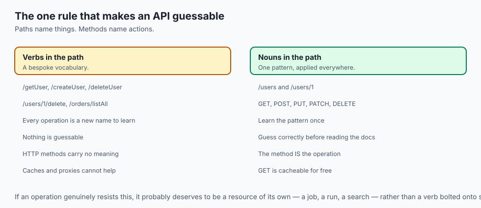

- **REST names things, and HTTP supplies the actions.** Paths are nouns; methods are
  verbs.
- **A collection holds items.** `/users` is all of them; `/users/1` is one.
- **Four operations cover almost everything**: create, read, update, delete.
- **Every request stands alone.** The server remembers nothing between them, which is
  what lets a thousand servers answer interchangeably.
- **You never touch a resource**, only representations of it — usually JSON snapshots
  of its current state.

---

## Historical background

- **Roy Fielding described REST in his 2000 dissertation**, as an architectural style
  rather than a standard or a specification.
- **He was describing the web itself**, and arguing that HTTP's existing design was
  already the answer people kept trying to replace.
- **The alternative at the time was SOAP** — XML envelopes, generated stubs, a
  toolchain on both ends, and one endpoint that all operations tunnelled through.
- **REST won on simplicity.** No code generation, no toolchain, and a URL you could
  paste into a browser.
- **The name drifted almost immediately.** "REST API" today usually means
  "JSON over HTTP with sensible paths", which Fielding would not recognise as REST.
- **That drift is fine to know about and pointless to argue over.** Learn the pattern
  people actually use.

---

## What it is — and what it is not

**It is:**

- A set of constraints on how to use HTTP, not a protocol of its own.
- Resource-oriented: the path names a thing, the method names the action.
- Stateless, cacheable and uniform — the properties that make it scale.

**It is not:**

- **Not a standard.** There is no REST specification to comply with, which is why
  APIs vary so much while all claiming the name.
- **Not "JSON over HTTP".** That is the common usage, and it is a subset.
- **Not always the right shape.** Operations that are genuinely not CRUD — "translate
  this", "run this simulation" — fit awkwardly, and forcing them is worse than not.
- **Not a guarantee of good design.** A REST-shaped API can still be badly named,
  inconsistent and undocumented.

---

## Why it was created and what problems it solves

- **Predictability.** If you know `/users` and `/users/1`, you can guess
  `/users/1/orders` — and be right.
- **No toolchain.** A URL and a method are all a client needs, in any language.
- **Cacheability.** Because `GET` is safe, anything on the path may keep a copy, and
  the web's whole caching infrastructure applies for free.
- **Scalability through statelessness.** Any server can answer any request.
- **Visibility.** An intermediary can understand a request without understanding the
  application, which is what makes proxies, gateways and logs useful.

---

## How it works

### Resources, collections, and items

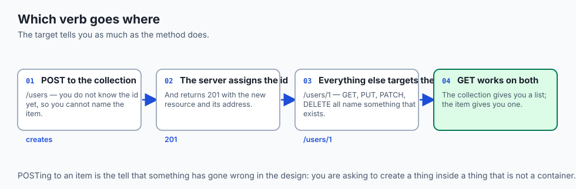


- **A resource is anything worth naming**: a user, an order, a photo, a comment.
- **A collection holds many** — `/users`.
- **An item is one member**, addressed by identifier — `/users/1`.
- **Collections nest naturally**: `/users/1/orders` is that user's orders, and
  `/users/1/orders/42` is one of them.
- **Read a REST URL left to right** and it reads like a path through a filing system.
- **The golden rule: paths are nouns.** The moment a verb appears — `/getOrders`,
  `/users/1/delete` — you have stopped doing REST and started inventing a bespoke
  vocabulary, which throws away the predictability that was the point.

### The verbs, mapped to CRUD

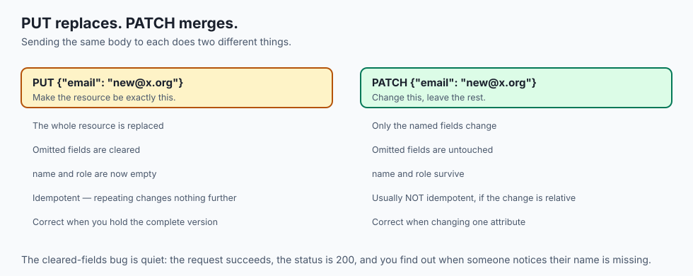

| Operation | Verb | Target | What it does | Success |
| --- | --- | --- | --- | --- |
| Read | `GET` | collection or item | Fetch a representation; change nothing | `200` |
| Create | `POST` | **collection** | Add an item; the server assigns the id | `201` |
| Update (replace) | `PUT` | item | Replace it entirely with your body | `200`/`204` |
| Update (partial) | `PATCH` | item | Change only the fields you sent | `200` |
| Delete | `DELETE` | item | Remove it | `200`/`204` |


- **You `POST` to a collection to create.** The server assigns the id and usually
  returns `201` with the new resource and its address.
- **You `GET`, `PUT`, `PATCH` and `DELETE` an item** you can already name.
- **`PUT` replaces; `PATCH` merges.** Leave a field out of a `PUT` and you may erase
  it. Leave it out of a `PATCH` and it is untouched.
- **Reach for `PATCH` to change one attribute**, and `PUT` when you hold the complete
  new version.

### Statelessness

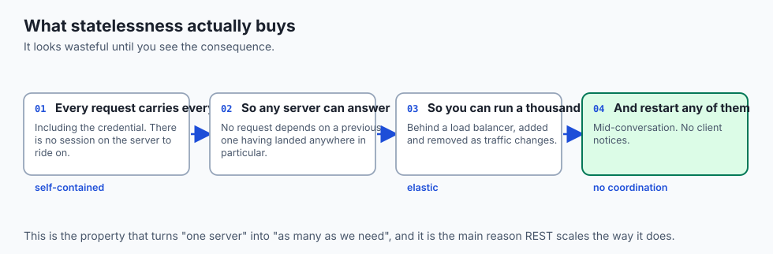

- **Each request is self-contained**: it carries everything the server needs to
  understand and authorise it.
- **The credential travels on every request**, typically as
  `Authorization: Bearer <token>` — there is no server-side session later requests
  ride on.
- **That feels wasteful until you see what it buys.** Any request can go to any copy
  of the server.
- **A provider can run a thousand identical servers**, add and remove them as traffic
  changes, and restart any of them mid-conversation, and no client notices.
- **Statelessness is what turns "one server" into "as many as we need".**

### Representations

```json
{
  "id": 1,
  "name": "Ada Lovelace",
  "email": "ada@example.org",
  "role": "admin"
}
```

- **You never touch the resource**, only a document describing its current state.
- **The same resource could be JSON, XML, HTML or binary.** The resource ("user 1") is
  separate from its representation ("this JSON").
- **`Accept` says what you want; `Content-Type` says what you got.**
- **The name is now readable.** Representational State Transfer: you transfer
  representations of resource state back and forth.

### Safety and idempotency

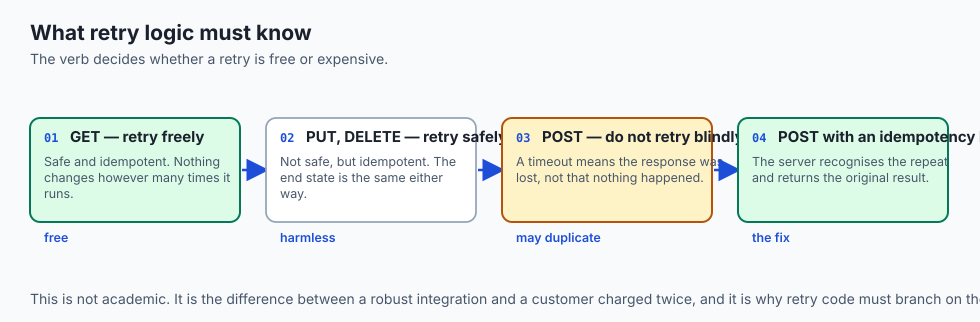

| Verb | Safe? | Idempotent? | Consequence |
| --- | --- | --- | --- |
| `GET` | Yes | Yes | Cache and retry freely |
| `POST` | No | **No** | Two identical calls may create two resources |
| `PUT` | No | Yes | Replacing twice equals replacing once |
| `PATCH` | No | Usually no | A relative change applied twice differs |
| `DELETE` | No | Yes | Deleting a deleted item leaves it deleted |

- **The most important line is that `POST` is not idempotent.**
- **`POST /orders`, a timeout, and a retry** can place two orders and charge twice.
- **`PUT` and `DELETE` are safe to repeat**, which is exactly why a flaky network is
  survivable for them and dangerous for `POST`.
- **Retry logic must know which verb it is retrying.**

### HATEOAS at a glance

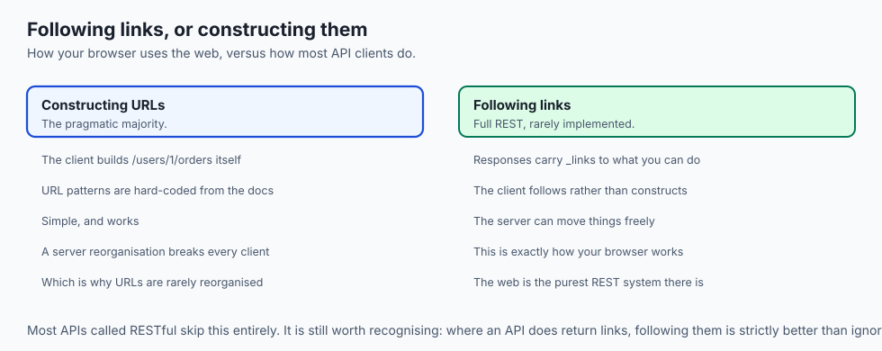

```json
{
  "id": 1,
  "name": "Ada Lovelace",
  "_links": {
    "self":   { "href": "/users/1" },
    "orders": { "href": "/users/1/orders" },
    "edit":   { "href": "/users/1", "method": "PUT" }
  }
}
```

- **The strictest REST includes links** telling the client what it can do next.
- **The client follows links rather than constructing URLs**, exactly as you click
  through a web page instead of typing every address.
- **Most APIs called RESTful today skip this** and let clients build URLs from
  documentation. That is the pragmatic reality.
- **Where an API does return links, follow them.** Your client keeps working when the
  server reorganises its URLs.

---

## An everyday analogy

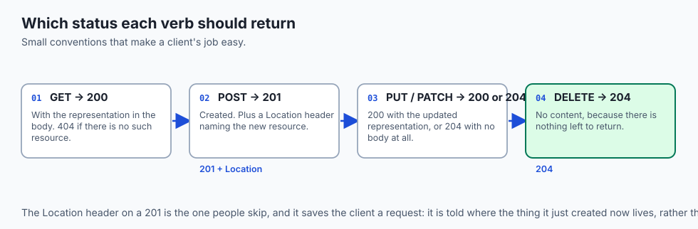

A library catalogue.

| The library | REST |
| --- | --- |
| The shelf of all fiction | A collection, `/books` |
| One book with a number | An item, `/books/1` |
| Its section, then its shelf, then the book | Nested paths |
| Read it | `GET` |
| Add a new one to the shelf | `POST` to the collection |
| Replace a damaged copy | `PUT` on the item |
| Correct one field on its card | `PATCH` |
| Withdraw it | `DELETE` |

- **The shelf label is a noun.** There is no shelf called "get books".
- **Reading a book twice changes nothing**; that is safe. **Withdrawing it twice
  leaves it withdrawn**; that is idempotent. **Donating a book twice gives the library
  two books**, and that is `POST`.

---

## Examples in practice

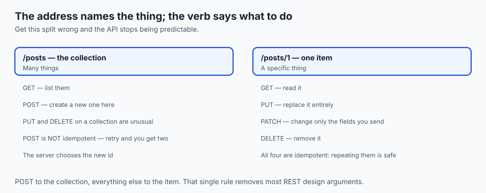

- **`GET /users?role=admin&_limit=10`** — filtering and limiting a collection with
  query parameters rather than a new endpoint.
- **`POST /users` returning `201` with a `Location` header** pointing at the new
  `/users/7`.
- **`PATCH /users/1` with `{"email": "new@example.org"}`** — one field changed,
  everything else untouched.
- **`PUT /users/1` missing the `role` field**, which silently clears it. This is the
  most common `PUT` mistake.
- **`DELETE /users/1` twice**, returning `204` then `404` — both correct, and the
  resource is gone either way.

---

## Implications: security, privacy, performance, scalability, and cost

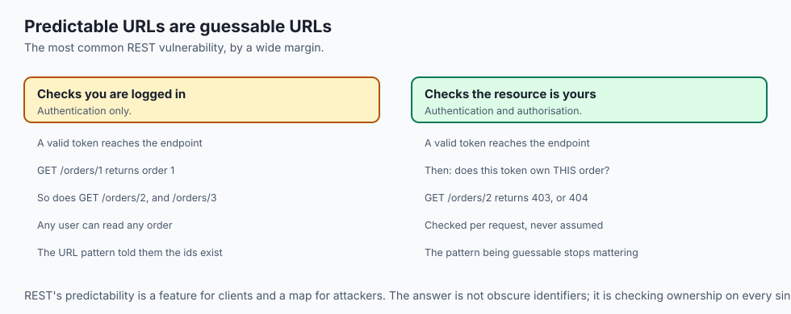

- **Security: predictable URLs mean guessable URLs.** `/users/1` implies `/users/2`
  exists, so authorisation must be checked per request, not assumed from the path.
- **This is the most common REST vulnerability**: an endpoint that checks you are
  logged in but not that the resource is yours.
- **Never put anything sensitive in a path.** Paths appear in logs, in browser
  history and in `Referer` headers.
- **Performance: `GET` being safe is what makes caching possible**, and a correct
  `Cache-Control` header is often worth more than any server optimisation.
- **Scalability: statelessness is the whole story.** It is what allows horizontal
  scaling with no coordination.
- **Cost: a chatty client is an expensive one.** Fetching a collection and then each
  item individually is the N+1 problem from yesterday, in REST clothing.

---

## Alternatives: free, open source, and commercial

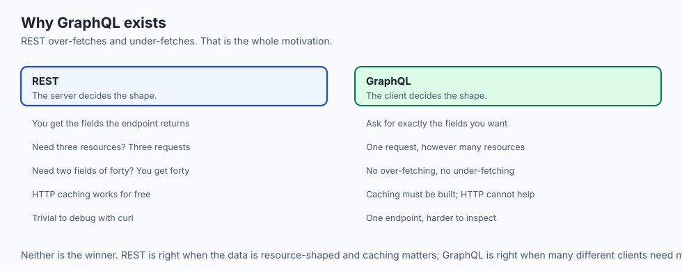

| Style | Type | Where it fits |
| --- | --- | --- |
| REST | The default | Resource-shaped data, public APIs, anything cacheable |
| GraphQL | Free, open source | Clients that need to choose their own response shape |
| gRPC | Free, open source | Service-to-service, where speed beats readability |
| JSON-RPC | Free, open source | Genuinely operation-shaped work that is not CRUD |
| OpenAPI | Free, open source | Not an alternative — how you describe a REST API formally |
| Webhooks | The inverse | Events pushed to you, rather than polled — Day 26 |

- **GraphQL exists because REST over-fetches and under-fetches.** One endpoint, and
  the client states exactly which fields it wants.
- **Its cost is caching and complexity.** REST gets HTTP caching free; GraphQL has to
  build it.
- **Write an OpenAPI document for anything public.** It generates the documentation,
  the client libraries and the tests.

---

## Comparison with related concepts

| Term | What it actually is |
| --- | --- |
| **Resource** | A thing the API names |
| **Collection** | A resource holding many others |
| **Item** | One member of a collection |
| **Representation** | A serialised snapshot of a resource's state |
| **CRUD** | Create, read, update, delete |
| **Statelessness** | The server remembers nothing between requests |
| **HATEOAS** | Responses carry links to what you can do next |

---

## When to use it — and when not to

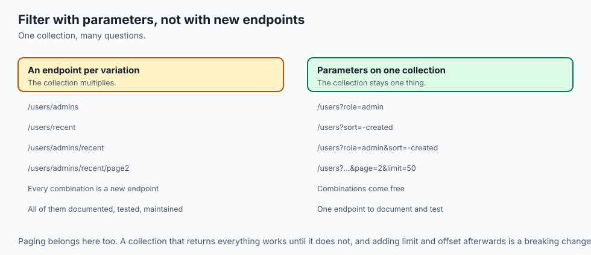

- **Use REST when your domain is made of things** — users, orders, documents,
  datasets.
- **Use query parameters to filter, sort and page**, rather than inventing an endpoint
  per variation.
- **Return `201` with a `Location` header** when you create something. It costs
  nothing and saves the client a request.
- **Do not put verbs in paths.** If you find yourself wanting to, the operation
  probably deserves to be a resource of its own — a "job", a "run", a "search".
- **Do not use `GET` for anything that changes state.** A crawler or a prefetcher will
  find it eventually.
- **Do not force genuinely non-CRUD operations into REST.** "Send this email",
  "translate this text" — model these as resources you create, or accept that the
  style does not fit.

---

## The AI connection

- **Model APIs are barely REST**, and knowingly so: `POST /v1/messages` creates a
  completion, which is a resource in only the loosest sense.
- **That is the right call.** Generation is an operation, not a CRUD action on a
  stored thing, and pretending otherwise would help nobody.
- **The non-idempotent `POST` matters more here than almost anywhere**, because a
  retried generation is billed again and may return something different.
- **Fine-tuning APIs are properly RESTful**, because a training job genuinely is a
  resource: create it, poll it, list them, cancel one.
- **Vector databases expose REST too** — collections of documents, items by id — and
  the pattern from today transfers directly.

---

## Knowledge check

```yaml
quiz:
  question: "A client updates a user's email with `PUT /users/1` sending only `{\"email\": \"new@example.org\"}`. Afterwards the user's name and role are empty. What went wrong?"
  options:
    - "PUT replaces the entire resource, so fields omitted from the body were cleared"
    - "The server rejected the partial body and reset the record to defaults"
    - "PUT is not idempotent, so the repeated request overwrote the other fields"
    - "The Content-Type header was missing, so the body was parsed incorrectly"
  answer_index: 0
  explanation: "PUT means \"make the resource be exactly this\". A body containing only the email describes a user with no name and no role, and the server complied. PATCH is the verb that merges rather than replaces."
```

---

## Hands-on exercise

Exercise all five verbs against a real API and watch the status codes. Worked
through fully in the Day 23 lab directory.

| What you are doing | Command |
| --- | --- |
| Read a collection | `curl 'https://jsonplaceholder.typicode.com/posts?_limit=3'` |
| Read one item | `curl https://jsonplaceholder.typicode.com/posts/1` |
| Create | `curl -i -X POST -H 'Content-Type: application/json' -d '{"title":"hi","userId":1}' .../posts` |
| Replace | `curl -i -X PUT -H 'Content-Type: application/json' -d '{"id":1,"title":"new","userId":1}' .../posts/1` |
| Merge | `curl -i -X PATCH -H 'Content-Type: application/json' -d '{"title":"just this"}' .../posts/1` |
| Delete | `curl -i -X DELETE .../posts/1` |
| Nested collection | `curl '.../posts/1/comments?_limit=2'` |

### Expected output

```text
HTTP/1.1 201 Created
{"title":"hi","userId":1,"id":101}
HTTP/1.1 200 OK
{"id":1,"title":"just this","body":"...","userId":1}
```

- **`201` for the create**, with a server-assigned `id` you did not choose.
- **The `PATCH` kept `body` and `userId`.** A `PUT` with the same partial body would
  not have.

### Validate your work

- [ ] You used all five verbs and recorded the status code each returned
- [ ] You can explain why `POST` went to the collection and `PUT` to the item
- [ ] You demonstrated the difference between `PUT` and `PATCH` on the same resource
- [ ] You fetched a nested collection
- [ ] You can state which verbs are safe and which are idempotent, without looking
- [ ] `bash tests/run_tests.sh` reports 0 failures

### Troubleshooting

- **`POST` returns the object with no id.** Missing `Content-Type`, so the body was
  ignored.
- **`PUT` returns only the fields you sent.** That is `PUT` working correctly. Use
  `PATCH` if you meant to merge.
- **A query string does nothing.** The shell ate the `?` and `&`. Quote the URL.
- **`DELETE` returns `200` and the resource is still there.** Test APIs often fake
  writes. Read their documentation.

### Common mistakes

- **Verbs in paths.** `/createUser` is the tell.
- **`POST` to an item** rather than to the collection.
- **Retrying a `POST` blindly** after a timeout.
- **Using `PUT` for a partial update** and clearing fields you never mentioned.

---

## Practice assignment

- **Design the endpoints for a small domain** — a library, a task tracker, a dataset
  registry — writing out every path and verb, with no verbs in any path.
- **Find a real API that violates the pattern** and write down which rule it breaks
  and whether the break was justified.
- **Prove the `PUT` field-clearing behaviour** on a test API, then fix the same change
  with `PATCH`.
- **Write the retry rule** you would put in a client: which verbs, which status codes,
  and what backoff.

---

## Extension challenge

- **Build a five-endpoint REST API** for one resource and exercise it with `curl`.
  Implementing the server side makes the constraints obvious in a way reading cannot.
- **Add an idempotency key** to your create endpoint so a repeated `POST` returns the
  original result rather than creating a second resource. This is the standard fix and
  worth implementing once.
- **Write an OpenAPI document** for your API and generate documentation from it.
- **Add `_links` to one response** and write a client that navigates by following them
  rather than constructing URLs. Then change a URL on the server and watch the client
  keep working.

---

