## Why this matters

Yesterday you learned that an API is a contract for asking one program to do something for you. Today you learn the single most common shape that contract takes on the web — REST — because it is the shape almost every service you will ever call is built in. When you fetch data from a weather service, a payments provider, a maps backend, or a hosted model, you are almost always talking to a REST or REST-like API, and the whole design comes down to two ideas: *things* (called resources) each live at their own address, and a small fixed set of *verbs* act on them.

Getting these two ideas straight has direct, practical payoffs. It is why you can guess that `GET /users/1` reads user 1 and `DELETE /users/1` removes them without reading a single page of documentation — a well-designed REST API is predictable, and predictability is speed. It is why a request that "worked yesterday and fails today" can often be diagnosed in seconds: you know a `POST` was supposed to create something, so a `409` tells you it already exists. It is why you can retry a failed `GET` a hundred times without fear but must think twice before retrying a `POST`. And when you eventually build your own service — including a service that wraps a model behind an endpoint — the quality of your REST design decides whether other developers find it obvious or maddening.

Today you build that mental model from the ground up. Not a framework, not a library, just the architectural style itself: what a resource is, how its address (URL) should be shaped, which verb does which job, why the server refuses to remember you between requests, and how REST compares to the two main alternatives you will meet. By the end you will read almost any web API's endpoints like a map, and in the lab you will run a full create-read-update-delete cycle against a real API with your own hands.

## The idea in plain language

REST stands for **Representational State Transfer**. Behind the intimidating name is a calm idea: model everything your service offers as a collection of **resources** — the nouns of your system, such as users, orders, articles, or messages — and give each one a stable address. Then let clients act on those resources using the handful of HTTP verbs you already met in the HTTP lesson. You do not invent new operations; you reuse `GET`, `POST`, `PUT`, `PATCH`, and `DELETE`, and the *combination* of a verb and an address says everything.

The crucial discipline is that the address names a **thing, not an action**. A good REST URL is `/users/1` — "user number 1" — and the verb decides what you do to that user. A bad, un-RESTful URL bakes the action into the address: `/getUser?id=1`, `/createUser`, `/deleteUser?id=1`. Those work, but they throw away the whole benefit, because now the client must learn a fresh action name for every operation instead of reusing verbs it already knows. In REST, `/users` is the shelf of all users (a **collection**), `/users/1` is one user (an **item**), and `GET`, `POST`, `PUT`, `PATCH`, and `DELETE` are the fixed set of things you can do to shelves and items.

Two more ideas round out the picture. First, the server sends you a **representation** of a resource, not the resource itself — usually a chunk of JSON describing user 1, the way a library catalogue card describes a book without being the book. Second, REST is **stateless**: each request carries everything the server needs, and the server remembers nothing about you between requests. Resources, addresses, verbs, representations, statelessness — learn those five words and you have the architecture.

## Historical background

REST was not invented as a product or a framework; it was *described*, after the fact, as the style the web had already grown into. In 2000, **Roy Fielding** — a computer scientist who had co-authored the HTTP and URL specifications through the 1990s — submitted his doctoral dissertation at the University of California, Irvine. Its fifth chapter, titled "Representational State Transfer (REST)," gave a name and a precise set of constraints to the architecture that had made the World Wide Web scale from a physics lab to the planet.

Fielding's question was essentially: *why did the web work so well?* Countless independent servers and browsers, written by people who never met, cooperated flawlessly and kept doing so as the system grew a millionfold. He argued the answer was a specific set of architectural constraints, and REST was his name for the bundle of them: a **client–server** split, **statelessness**, **cacheability**, a **uniform interface** (the same small set of methods and addressable resources everywhere), a **layered system** (proxies and gateways a client cannot even see), and an optional **code-on-demand**. Follow those constraints and you get systems that are scalable, resilient, and evolvable; break them and you lose those properties one by one.

Through the 2000s, as web APIs multiplied, "REST" became the popular shorthand for "an HTTP API organized around resources and standard verbs," and it steadily displaced the heavier, more ceremonious styles that came before it (you will meet one of them, RPC, later in this lesson). In practice, most APIs people call "RESTful" today satisfy some but not all of Fielding's original constraints — the field even coined the half-joking term "REST-ish" for them. That is fine and worth knowing: what you will build and consume day to day is the pragmatic, resource-and-verb version of REST, and understanding Fielding's stricter original helps you see why the pragmatic version behaves the way it does.

## What it is — and what it is not

REST is an **architectural style for networked software** — a set of design constraints, not a protocol, a standard, or a piece of software you install. Every word of that matters. *Architectural style* means it is a way of organizing a system, like "load-bearing walls" is a way of organizing a building, not a specific brick. *Constraints* means it is defined by rules you agree to follow (address resources with URLs, act on them with standard verbs, keep the server stateless), and following them buys you scalability and predictability. Because REST is a style and not a standard, there is no official validator that stamps an API "REST-compliant"; there are only APIs that follow the constraints more or less faithfully.

It helps just as much to say what REST is not. It is **not the same as HTTP** — HTTP is the underlying protocol REST almost always rides on, but you could design a non-REST HTTP API (an RPC-over-HTTP one, for instance), and REST as a set of ideas is not strictly bound to HTTP. It is **not JSON** — JSON is merely the most common *representation format* REST APIs use; a REST API could return XML, HTML, or anything else, and JSON gets its own full lesson tomorrow. It is **not a framework or library** — tools help you build REST APIs, but REST itself is the design underneath. And REST is **not automatically "good API design"**: you can follow every surface rule and still build something confusing, and you can bend a rule deliberately for good reason. REST is a set of principles that, followed thoughtfully, tend to produce clear, durable APIs.

| Common misconception | The reality |
| --- | --- |
| "REST is a protocol you implement." | REST is an architectural *style* — a set of constraints; HTTP is the protocol it usually rides on. |
| "REST means JSON." | JSON is the most common *representation*, but REST is format-agnostic; the resource is separate from how it is serialized. |
| "The URL should say what to do, like `/getUser`." | The URL names a resource (`/users/1`); the HTTP *verb* says what to do. Actions belong in verbs, not paths. |
| "`POST` and `PUT` are interchangeable." | `POST` creates (not idempotent); `PUT` replaces a known resource (idempotent). Confusing them causes duplicates or lost data. |
| "A RESTful server remembers my session." | REST is stateless by design; each request must carry its own identity (a token), or the server has no idea who you are. |

## Why it was created and what problems it solves

The problem REST names and solves is **how to let enormous numbers of independently built clients and servers cooperate over a network without coordinating with each other**. Before the web's resource-and-verb model won out, integrating two systems often meant learning a bespoke vocabulary of operations for every single service: one API had `fetchCustomerRecord`, another had `getClient`, a third had `retrieveAccountByID`, and each spoke its own dialect. Every new integration was a fresh education. There was no way to *guess* how an unfamiliar API worked, because there was no shared grammar.

REST's answer is the **uniform interface**: agree, once and for everyone, that things are resources at addresses and that a fixed set of verbs acts on them. Now the grammar is shared. If you know one REST API, you can make a good guess at the next one — `GET /orders` probably lists orders, `POST /orders` probably creates one, `GET /orders/42` probably reads order 42. The cost of learning a new API collapses, because most of it is the vocabulary you already know; only the specific resources differ.

The deeper problems REST solves flow from that uniformity. **Statelessness** lets a provider run a thousand identical copies of a server behind a load balancer and send any request to any copy, because no copy has to remember your previous request — the same property that lets web services and model APIs serve millions of users at once. **Cacheability** means a `GET`, being a safe read, can be stored and reused by any layer between you and the server, saving round trips. And the **layered system** lets providers slip caches, gateways, and security proxies between client and server invisibly, because every layer speaks the same uniform interface. REST, in short, is the design that makes web-scale cooperation *cheap* — and that is exactly why it became the default shape of the API economy you are now learning to work in.

## How it works

Let's build the model piece by piece: resources and their addresses, the verbs that act on them, statelessness, representations, and the two properties — safety and idempotency — that make the whole thing predictable.

### Resources, collections, and items

A **resource** is any thing your service exposes that is worth naming: a user, an order, a photo, a comment. Resources come in two shapes that share an address family. A **collection** is a resource that holds many others — `/users` is the collection of all users. An **item** is a single member of a collection, addressed by appending an identifier — `/users/1` is the user whose id is 1. Collections nest naturally: `/users/1/orders` is the collection of orders belonging to user 1, and `/users/1/orders/42` is one specific order of theirs. Read a REST URL left to right and it reads like a path through a filing system: *users → user 1 → their orders → order 42*.

The golden rule from the plain-language section returns here with force: **resource addresses are nouns, and the verb carries the action.** The moment a verb creeps into your path — `/users/1/delete`, `/getOrders`, `/createUser` — you have stopped doing REST and started reinventing a bespoke operation vocabulary, throwing away the predictability that was the whole point.



### The verbs, mapped to CRUD

Almost everything you do to stored data is one of four operations remembered by the acronym **CRUD**: **C**reate, **R**ead, **U**pdate, **D**elete. REST maps those four operations onto the HTTP methods you met in the HTTP lesson, and this mapping is the heart of the whole style:

| CRUD operation | HTTP verb | Typical target | What it does | Success code |
| --- | --- | --- | --- | --- |
| Read | `GET` | collection or item | Fetch a representation; change nothing | `200 OK` |
| Create | `POST` | collection | Add a new item to the collection; server assigns the id | `201 Created` |
| Update (replace) | `PUT` | item | Replace the item entirely with the body you send | `200 OK` (or `204`) |
| Update (partial) | `PATCH` | item | Change only the fields you send, leaving the rest | `200 OK` |
| Delete | `DELETE` | item | Remove the item | `200`/`204 No Content` |

Notice the pattern. You `POST` to a **collection** to create — `POST /users` means "add a new user to the users collection," and the server assigns the new id and usually returns `201 Created` with the created resource and its address. You `GET`, `PUT`, `PATCH`, and `DELETE` an **item** — these all name a specific `/users/1` you already know. The difference between `PUT` and `PATCH` is worth memorizing: `PUT` **replaces** the whole resource with what you send (leave out a field and you may erase it), while `PATCH` **merges** only the fields you send (leave out a field and it is left untouched). Reach for `PATCH` when you want to change one attribute; reach for `PUT` when you have the complete new version in hand.



### Statelessness

REST inherits HTTP's **statelessness** and leans on it hard. Each request must be **self-contained**: it carries everything the server needs to understand and authorize it, and the server keeps no memory of you between requests. If a request needs to prove who you are, it carries a credential — typically an `Authorization: Bearer <token>` header — on *every* request, not just the first. There is no "logged-in session" living on the server that later requests silently ride on.

This feels wasteful until you see what it buys. Because no request depends on server-side memory of a previous one, any request can go to any copy of the server. A provider can run a thousand identical servers behind a load balancer, add or remove copies as traffic changes, and restart any of them mid-conversation, and no client ever notices. Statelessness is the property that turns "one server" into "as many servers as we need," and it is the main reason REST scales the way it does.

### Representations

You never touch a resource directly; you exchange **representations** of it. When you `GET /users/1`, the server does not hand you the user — it hands you a document *describing* the user's current state, almost always as JSON:

```json
{
  "id": 1,
  "name": "Ada Lovelace",
  "email": "ada@example.org",
  "role": "admin"
}
```

That JSON is a representation: a snapshot of the resource's state, serialized into a format both sides understand. The same resource could be represented as XML, as HTML for a browser, or as a compact binary — the resource ("user 1") is separate from its representation ("this JSON"). The client can even say which format it prefers using the `Accept` header, and the server declares what it sent with `Content-Type: application/json`. The name **Representational State Transfer** is now readable: you transfer representations of resource state back and forth. When you `PUT` a new body, you are sending a representation of the state you want the resource to have next; when you `GET`, you receive a representation of its state now.

### Safety and idempotency revisited

Two properties from the HTTP lesson decide how you may safely treat each verb, and REST depends on them completely. A verb is **safe** if it only reads and never changes server state — `GET` is safe, which is why caches and crawlers repeat it freely. A verb is **idempotent** if making the identical request many times leaves the server in the same state as making it once.

| Verb | Safe? | Idempotent? | Why it matters |
| --- | --- | --- | --- |
| `GET` | Yes | Yes | Read freely; cache and retry without fear |
| `POST` | No | **No** | Two identical `POST`s may create two resources — never blindly retry |
| `PUT` | No | Yes | Replacing with the same body twice equals doing it once |
| `PATCH` | No | Usually no | A relative change (e.g. "add 1") applied twice differs from once |
| `DELETE` | No | Yes | Deleting an already-deleted item leaves it deleted |

The single most important line in that table is that **`POST` is not idempotent**. If you `POST /orders` to place an order, the network times out, and your retry logic fires, you may place two orders and charge a customer twice. `PUT /users/1` and `DELETE /users/1`, by contrast, are idempotent — repeating them is harmless — which is exactly why a flaky network is safe for them and dangerous for `POST`. This distinction is not academic; it is the difference between a robust integration and a mysterious double-charge, and it is the reason retry logic must know which verb it is retrying.

### HATEOAS at a glance

The strictest form of REST adds one more constraint with an unlovely acronym: **HATEOAS**, "Hypermedia As The Engine Of Application State." The idea is that a resource's representation should include **links** telling the client what it can do next and where, so the client navigates the API by following links rather than by hard-coding URLs. A hypermedia-rich response to `GET /users/1` might look like:

```json
{
  "id": 1,
  "name": "Ada Lovelace",
  "_links": {
    "self":   { "href": "/users/1" },
    "orders": { "href": "/users/1/orders" },
    "edit":   { "href": "/users/1", "method": "PUT" }
  }
}
```

The client reads the `_links` and follows them, the way you click links on a web page instead of typing every URL by hand — which is precisely how *your browser* uses the web, the purest REST system there is. In practice, most APIs people call RESTful today skip full HATEOAS and let clients construct URLs from documentation instead; that is the pragmatic "REST-ish" reality. It is still worth recognizing, because when an API does return links, following them keeps your client working even if the server later reorganizes its URLs.

## An everyday analogy

Picture a large, well-run public **library**, and let it carry the whole architecture.

Every item the library holds is a **resource**, and every one has a fixed **address** — its call number on the shelf. The address names the *thing*: the shelf labelled "Astronomy" is a **collection**, and a single book with call number 520.1 is an **item**. Crucially, the label on the shelf is a noun — "Astronomy" — not an instruction like "GoFetchMeAnAstronomyBook." That is the noun-not-verb rule: the address tells you *what*, never *what to do*.

What you *do* with a book is a separate, small, fixed set of **verbs**, exactly like REST's methods. You can **read** a book on the spot without changing anything — that is `GET`, and it is *safe*: a thousand people reading the same book leave it unchanged. You can **add** a new book to the Astronomy shelf, and the librarian assigns it the next call number and files it — that is `POST` to the collection, and it is *not* idempotent: hand in two copies and you get two entries on the shelf. You can **replace** a worn-out book with a fresh identical edition — that is `PUT`, and it is idempotent: swapping in the same replacement twice is no different from once. You can **correct one detail** on a book's catalogue card without reprinting the whole card — that is `PATCH`. And you can **remove** a book from circulation — that is `DELETE`, also idempotent: a book already withdrawn stays withdrawn no matter how many times you ask.

The librarian is **stateless**: they do not remember you between visits. Every single time you want to borrow, you hand over your library card along with your request; the librarian never assumes "oh, it's you again" from a previous visit. That is why REST puts a token on every request. And when you ask for a book, you rarely get the physical object flung at you — you get a **representation**: a printed copy, a large-print edition, an audiobook. Same book, different representation, chosen to suit you, just as a REST server can serve the same resource as JSON or XML depending on your `Accept` header. Finally, the catalogue card for each book lists **where to find related material** — "see also call number 523.1" — and you follow those pointers around the library rather than memorizing its entire floor plan. That is HATEOAS: the resource tells you what you can do next. Keep this library in mind and REST stops being an acronym and becomes a place you already know how to walk around.

## Examples in practice

Let's walk a full **CRUD** cycle against a resource called `posts`, exactly the kind of exchange you will run in today's lab against a real public API. Each step is a verb plus an address, and each reply is a status code plus a representation.

**Read the collection** — list every post:

```text
GET /posts
-> 200 OK
[ { "id": 1, "title": "..." }, { "id": 2, "title": "..." }, ... ]
```

**Read one item** — fetch post 1 by its address:

```text
GET /posts/1
-> 200 OK
{ "userId": 1, "id": 1, "title": "first post", "body": "hello world" }
```

**Create** — add a new post by `POST`ing a representation to the *collection*. Note you do not choose the id; the server assigns it and echoes the created resource back:

```text
POST /posts
Content-Type: application/json

{ "title": "my new post", "body": "written today", "userId": 1 }

-> 201 Created
{ "title": "my new post", "body": "written today", "userId": 1, "id": 101 }
```

The `201 Created` and the new `"id": 101` are the server saying "done — your post now lives at `/posts/101`." **Update** — replace post 1 entirely with `PUT` to the *item*, sending the complete new representation:

```text
PUT /posts/1
Content-Type: application/json

{ "id": 1, "title": "edited title", "body": "edited body", "userId": 1 }

-> 200 OK
{ "id": 1, "title": "edited title", "body": "edited body", "userId": 1 }
```

Had you wanted to change only the title, you would `PATCH /posts/1` with just `{ "title": "edited title" }` and leave the body untouched. **Delete** — remove post 1:

```text
DELETE /posts/1
-> 200 OK   (or 204 No Content)
```

Read those five exchanges again and notice how little you had to memorize: the *addresses* were just `/posts` and `/posts/1`, and the *verbs* did all the work of distinguishing read from create from replace from delete. That economy — two addresses, five verbs, the whole lifecycle of a resource — is REST paying off. In the lab you will run every one of these against a live server and read the real status codes and bodies it returns.

One more real-world note ties this to your goal. When you call a hosted model, you typically `POST` to an endpoint like `/v1/messages` or `/v1/chat/completions` with a JSON body carrying your prompt, and you read back a JSON representation of the model's reply. That is `POST`-to-a-collection ("create a new completion") in REST clothing. Most model and tool APIs you will integrate are RESTful or REST-like, so every habit you build today — reading endpoints as resources, knowing which verb is safe to retry, expecting JSON representations — transfers directly to working with them.

## Implications: security, privacy, performance, scalability, and cost

**Security.** Because REST rides on HTTP, everything from the HTTPS lesson applies: send REST traffic only over `https://` so tokens and bodies are encrypted in transit. Statelessness shapes authentication — since the server remembers nothing, every request must carry its own credential, usually a bearer token in the `Authorization` header, and that token is as sensitive as a password. A subtler REST-specific risk is that predictable URLs make resources easy to enumerate: if `/users/1` exists, an attacker will try `/users/2`, so the server must check on *every* request that the caller is allowed to see that specific resource (authorization), never assuming that knowing the URL implies the right to access it.

**Privacy.** A resource's representation contains exactly the fields the server chooses to include, which makes field selection a privacy decision. A careless `GET /users/1` that returns password hashes, internal notes, or another person's data leaks it to anyone who can reach the endpoint. Good REST design returns the minimum representation each caller is entitled to, and treats the URL itself as visible — paths appear in logs, browser history, and proxies, so secrets never belong in a URL (`/users/1?token=secret` is a mistake; the token belongs in a header).

**Performance.** REST's great performance lever is **caching**, unlocked by the safety of `GET`. Because a `GET` changes nothing, any layer — the browser, a proxy, a content-delivery network — may store the response and serve it again without troubling the origin server, using the `Cache-Control` and related headers from the HTTP lesson. The fastest request is the one never sent. The flip side is the classic REST cost: fetching related data can take many round trips (`GET /users/1`, then `GET /users/1/orders`, then each order), a limitation that motivates one of the alternatives you will meet next.

**Scalability.** This is where statelessness earns its keep. A stateless REST service scales **horizontally**: put identical copies behind a load balancer, route any request to any copy, and add copies as demand grows, because no copy needs another's memory. This is precisely how large web services and model providers absorb enormous request volumes. When you later meet autoscaling and load balancers, remember that REST's statelessness is what makes them possible.

**Cost.** With paid APIs, requests cost money, and REST's structure is your cost-control instrument. Knowing that `GET` is cacheable lets you avoid paying for the same read twice. Knowing that `POST` is not idempotent stops a naive retry loop from doubling both your bill and a real-world side effect. And reading status codes correctly — a `4xx` means fix your request rather than retry it, a `429` means you are over your rate limit — is directly how you avoid paying for requests that can never succeed. REST literacy is, quite literally, spend control.

## Alternatives: free, open source, and commercial

For an architectural-style lesson, "alternatives" means both other API styles that solve the same problem and the free tools you use to work with REST.

*Other API styles.* **RPC** (Remote Procedure Call), including the modern **gRPC**, models an API as a set of *functions to call* rather than resources to act on — you invoke `createUser(...)` instead of `POST /users`. It is often faster and more tightly typed, and it shines for internal service-to-service communication where both ends are yours. **GraphQL** exposes a single endpoint and lets the client ask for *exactly* the fields it wants in one query, directly attacking REST's many-round-trips problem; it excels when clients need flexible, precise data shapes (mobile apps, rich dashboards). You will see all three compared in the next section.

*Tools for working with REST.* Every core tool here is free and open source, and you already met most of them.

| Tool | Type | What it's for | Cost |
| --- | --- | --- | --- |
| `curl` | Free, open-source CLI | The universal command-line HTTP/REST client; scriptable, everywhere | Free |
| HTTPie | Free, open-source CLI | A friendlier CLI with colored output and JSON by default | Free |
| JSONPlaceholder | Free public REST API | A fake online REST API for practice; accepts CRUD requests without an account | Free |
| Postman | Commercial (free tier) | Graphical client for building, saving, and sharing REST requests | Free tier; paid team plans |
| Insomnia | Open-source core | Graphical REST/GraphQL client, an open alternative to Postman | Free; paid tiers |
| OpenAPI / Swagger | Open standard + tooling | Describe a REST API in a machine-readable file; auto-generate docs and clients | Free spec; some paid tools |

For learning and scripting, `curl` against a free practice API such as **JSONPlaceholder** — the one you will use in the lab — covers everything at zero cost. The graphical and commercial tools add collaboration, saved request libraries, and generated documentation, not fundamental capability. When you build your own REST API later, describing it with **OpenAPI** is the standard way to hand other developers a precise, tool-readable contract.

## Comparison with related concepts

The comparison that matters most today is REST against the two alternative styles, because choosing among them is a real decision you will face. The one-line examples show the same intent — "create a user" — expressed each way.

| Style | Shape of the API | "Create a user" looks like | Choose it when |
| --- | --- | --- | --- |
| **REST** | Resources at URLs, standard verbs | `POST /users` with a JSON body | You want a broadly understood, cacheable, public-facing API over CRUD-style data |
| **RPC / gRPC** | Named functions you call | `createUser(name, email)` (often over gRPC) | You control both ends (internal services) and want speed, strong typing, and streaming |
| **GraphQL** | One endpoint, client-specified queries | `mutation { createUser(name, email) { id } }` | Clients need flexible, precise data shapes and you want to avoid over- and under-fetching |

None of these is universally "best." REST wins on ubiquity, cacheability, and how easily any developer can understand it, which is why it dominates public web APIs. RPC and gRPC win inside a system you fully own, where the extra speed and tight contracts pay off and human readability of URLs matters less. GraphQL wins when a single client needs to assemble varied data in one round trip and the many-`GET` problem of REST becomes painful. A large system often uses more than one — REST at its public edge, gRPC between internal services. The other comparisons below place REST against ideas it is often confused with.

| Concept A | Concept B | Key difference |
| --- | --- | --- |
| REST | HTTP | HTTP is the protocol; REST is an architectural style that *uses* HTTP's verbs and URLs |
| REST | JSON | REST is the design; JSON is the most common representation format it transfers |
| Resource | Endpoint | A resource is the *thing* (user 1); an endpoint is the addressable URL that exposes it |
| `POST` | `PUT` | `POST` creates a new item in a collection (not idempotent); `PUT` replaces a known item (idempotent) |
| `PUT` | `PATCH` | `PUT` replaces the entire resource; `PATCH` changes only the fields you send |

## When to use it — and when not to

Reach for REST when you are building or consuming an API over **resource-shaped data** that many, varied clients will use — a public web API, a service other teams integrate with, a backend for web and mobile apps. Its ubiquity is its superpower: because everyone understands the resource-and-verb grammar, a well-designed REST API needs the least explanation and earns trust fastest. Reach for it, too, whenever your data maps cleanly onto CRUD over collections and items, which an enormous fraction of real systems do. And reach for REST's mental model as a *reading* tool constantly: even when you did not design an API, seeing its endpoints as resources and verbs lets you predict how it behaves and debug it faster.

Know equally when another style fits better. If you own both ends of a high-traffic internal link and need maximum speed, strong typing, or streaming, **gRPC** may serve you better than REST. If a single client must gather many related pieces of data in one shot and REST's round-trip count hurts, **GraphQL** may fit better. If your operation genuinely is not CRUD on a resource — a one-off action like "send this email" or "run this report" — do not contort it into a fake resource; it is fine and common to expose a pragmatic action endpoint rather than pretend everything is a noun. The professional habit is to default to REST for anything public and resource-shaped, and to choose a different style deliberately when a specific pressure — internal speed, flexible querying, a genuine action — argues for it.

The thread back to your goal is direct. Most of the model and tool APIs you will integrate, and any AI-facing service you eventually build yourself, are RESTful or REST-like: you will `POST` a JSON body to an endpoint and read a JSON representation back, exactly the pattern you practiced today. Designing your own service well means naming its resources cleanly, choosing the right verb for each operation, keeping it stateless so it scales, and returning honest status codes — the whole discipline of this lesson. Tomorrow you learn JSON, the representation format nearly all of this rides on; today you learned the architecture that shapes almost every API you will ever touch.

## The AI connection

REST is the vocabulary your own model services will speak. A trained model
becomes a resource, and the verbs you learned today map onto its lifecycle
directly: POST to create a prediction, GET to read a stored result, DELETE to
remove one.

The property that matters most is the one this lesson spends time on.
Statelessness — each request carrying everything the server needs — is what lets
an inference service run as many identical replicas behind a load balancer, and
scale by adding more. A server that remembered your conversation could not be
replicated that way without shared state, which is why chat APIs re-send the
whole history on every turn rather than keeping it server-side. That design
choice looks wasteful and is what makes horizontal scaling possible. Idempotence
returns here too, with money attached: a retried POST to a completion endpoint
can generate and bill for a second completion.

---

## Knowledge check

Try these from memory before looking back:

1. Explain, in one sentence each, why `/users/1` is a good REST URL and `/getUser?id=1` is not.
2. Give the HTTP verb for each CRUD operation, and say which verb targets a *collection* rather than an *item* — and why.
3. Your code `POST`s an order, the network times out, and your retry fires. Why is that riskier than retrying a `GET` or a `DELETE`? Name the property at stake.
4. A resource and its representation are not the same thing. Explain the difference using `GET /users/1`.
5. Someone says "our REST server keeps you logged in across requests." What REST constraint does that violate, and how should identity actually travel?

## Hands-on exercise

Time to run REST with your own hands. In this exercise — worked through in full in the Day 23 lab directory — you will use `curl` to perform a complete CRUD cycle against **JSONPlaceholder**, a free public REST API that accepts create, update, and delete requests and responds realistically (it *fakes* the writes — more on that below — which is perfect for practice). Every command is copy-pasteable, hits a free endpoint, and needs no account or key.

First, **read** a single item and see its JSON representation:

```bash
curl -s https://jsonplaceholder.typicode.com/posts/1 | python3 -m json.tool
```

`-s` silences the progress meter, and piping to `python3 -m json.tool` pretty-prints the JSON so it is easy to read. You should see a post with `id`, `title`, `body`, and `userId`. Next, **read the collection** and count how many posts there are:

```bash
curl -s https://jsonplaceholder.typicode.com/posts | python3 -m json.tool | head -20
```

Now **create** a post by `POST`ing a JSON body to the *collection*, printing the status code so you can confirm you got a `201`:

```bash
curl -s -w "\nHTTP %{http_code}\n" -X POST \
  -H "Content-Type: application/json" \
  -d '{"title":"my post","body":"hello","userId":1}' \
  https://jsonplaceholder.typicode.com/posts
```

The response echoes your post back with a freshly assigned `id` (JSONPlaceholder returns `101`), and the status line reads `HTTP 201`. Then **update** post 1 by replacing it with `PUT`:

```bash
curl -s -w "\nHTTP %{http_code}\n" -X PUT \
  -H "Content-Type: application/json" \
  -d '{"id":1,"title":"edited","body":"changed","userId":1}' \
  https://jsonplaceholder.typicode.com/posts/1
```

Finally, **delete** post 1 and read the status code:

```bash
curl -s -w "\nHTTP %{http_code}\n" -X DELETE \
  https://jsonplaceholder.typicode.com/posts/1
```

You have now driven a full create-read-update-delete lifecycle against a real REST API using nothing but verbs and addresses.

### Expected output

The `GET /posts/1` prints a JSON representation like this (the exact text is fixed by the service):

```text
{
    "userId": 1,
    "id": 1,
    "title": "sunt aut facere repellat provident occaecati excepturi optio reprehenderit",
    "body": "quia et suscipit\nsuscipit recusandae..."
}
```

The `POST` returns your submitted fields plus a new id and a created status:

```text
{
    "title": "my post",
    "body": "hello",
    "userId": 1,
    "id": 101
}
HTTP 201
```

The `PUT` returns the replaced representation with `HTTP 200`, and the `DELETE` returns an empty (or `{}`) body with `HTTP 200`. Seeing `201` on create and `200` on read/update/delete confirms each verb did its job.

### Validate your work

You are done when you can check every box:

- [ ] Your `GET /posts/1` returned a JSON object with `id`, `title`, `body`, and `userId`.
- [ ] Your `GET /posts` returned a JSON array of many posts.
- [ ] Your `POST` returned status `201` and a body containing a new `id` (JSONPlaceholder assigns `101`).
- [ ] Your `PUT` returned status `200` and the edited representation.
- [ ] Your `DELETE` returned status `200`.
- [ ] You can state which verb targeted the collection (`POST /posts`) and which targeted items (the rest).

### Troubleshooting

- **The `POST` returned `201` but a later `GET /posts/101` gives `404`.** That is expected: JSONPlaceholder *fakes* writes. It responds as if it created the resource (`201` and the id `101`), but nothing is actually stored, so the new post does not persist. The status codes and bodies are real; the persistence is simulated — perfect for safe practice.
- **`python3: command not found`.** Use `python` instead, or drop the pretty-printer entirely — `curl -s .../posts/1` still prints valid JSON, just unformatted.
- **The status code prints stuck to the JSON.** Keep the `\n` in `-w "\nHTTP %{http_code}\n"` so the code lands on its own line below the body.
- **A `POST` behaved like a `GET`.** You dropped `-X POST` or the `-d` body; `-d` supplies the body and, on its own, already implies `POST`.
- **No network.** The lab scripts and tests detect this and skip the live steps with a clear message rather than failing — reconnect to see real output.

### Common mistakes

- **Putting the verb in the URL.** Writing `POST /createPost` or `GET /getPosts` defeats REST; the address is a noun (`/posts`), and the HTTP method is the verb.
- **`POST`ing to an item instead of the collection.** You create by `POST`ing to the *collection* (`/posts`), not to an item (`/posts/1`); the server assigns the new id.
- **Expecting fake writes to persist.** On a practice API like JSONPlaceholder, your `POST`/`PUT`/`DELETE` return realistic responses but change nothing on the server — do not treat the returned `101` as a real, re-fetchable resource.
- **Confusing `PUT` and `PATCH`.** `PUT` replaces the whole resource (omit a field and you may erase it); `PATCH` changes only the fields you send.

## Practice assignment

Open the REST worksheet in the starter directory of the Day 23 lab and complete it using `curl` against JSONPlaceholder. Record three status codes you observed directly: (1) the code returned by a `GET /posts/1`; (2) the code returned when you `POST` a new post to `/posts`; and (3) the code returned by a `DELETE /posts/1`. Also record the `id` that JSONPlaceholder assigns to the post you created. Then write one short paragraph (4–6 sentences) explaining, in your own words, why you can safely retry a failed `GET` or `DELETE` but must be careful retrying a failed `POST`, naming the property that makes the difference. Keep the worksheet; the Week 4 project builds a real API client on exactly these skills.

## Extension challenge

Go one layer deeper into REST's finer distinctions. First, try a **`PATCH`** against `/posts/1` sending only `{"title":"just the title"}`, and compare the returned representation to what a full `PUT` returned — notice that `PATCH` leaves the other fields in place while `PUT` would have required the whole object. Second, explore **nested collections**: JSONPlaceholder exposes `/posts/1/comments` (the comments belonging to post 1) and `/users/1/todos`; fetch each with `GET`, and write one sentence explaining how the URL structure reads as a path through related resources. Third, prove **idempotency** to yourself: run the same `DELETE /posts/1` twice and observe that the outcome is identical both times, then reason in two or three sentences about why the same experiment with `POST /posts` would instead create two resources on a real server. You have now exercised every REST verb, seen the collection-versus-item distinction from both sides, and felt idempotency in your hands — the exact literacy that makes any new API predictable.
