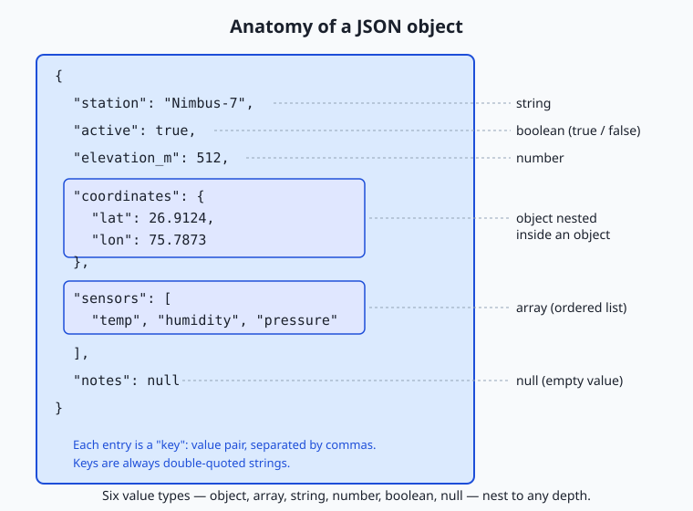

## Why this matters

Almost every useful program eventually has to send its data somewhere: to a file on disk, across a network to another machine, or into another program running beside it. But the data a program works with lives as structured values inside memory — a list here, a lookup table there, numbers and text wired together by references the processor understands. None of that structure can travel. A network moves bytes. A file stores bytes. A pipe between two programs carries bytes. So before data can leave the program that created it, it has to be flattened into a plain sequence of characters that any other program can read back. That flattening is called serialization, and the character format almost everyone reaches for on the web is JSON.

This is not a side topic on the road to working with AI systems and web services — it is the road's paving. When you call a weather service, a payment gateway, a search index, or a hosted model, you send a request whose body is JSON and receive a response whose body is JSON. The parameters you set, the fields you fill in, the structured answer you get back: all of it is JSON text crossing a wire. Get the format slightly wrong — a stray comma, a number quoted as text, a key spelled differently than the service expects — and the request is rejected or the answer is misread, often with an error message that points nowhere useful.

The good news is that JSON is small enough to hold in your head completely. By the end of today you will know every value type it allows, the handful of syntax rules that trip people up, how to turn data into JSON and back, and how to choose JSON over its rivals — XML, YAML, CSV, and the binary formats — when the situation calls for something else. That fluency pays off on almost every day that follows.

## The idea in plain language

Inside a running program, data is alive. A value sits at some address in memory, and other values point to it. This web of values is fast to use but completely private: it means nothing outside the exact program, on the exact machine, at the exact moment it exists. Shut the program down and the web evaporates. Try to copy the raw memory to another computer and it is gibberish, because the addresses refer to that first machine's memory, not the second's.

Serialization is the act of writing that living data out as a flat, self-contained string of characters — a description complete enough that a different program, later, elsewhere, can rebuild an equivalent copy from the description alone. The reverse act, reading the string and reconstructing the values, is called parsing (or deserializing). Serialize on the way out, parse on the way in. If the format is well designed, the value you get from parsing what you serialized is equal to the value you started with. That is the whole contract.

JSON — short for JavaScript Object Notation — is one such format, and the dominant one for web data. A JSON document is just text, made of six kinds of value nested together: objects (labeled collections of key-value pairs), arrays (ordered lists), strings, numbers, the two booleans `true` and `false`, and `null` (a deliberate "no value here"). Objects and arrays can contain any of the six types, including more objects and arrays, so a small set of pieces snaps together into structures of any shape. Because it is plain text, JSON can be printed, emailed, saved, logged, and read by a human — while still being precise enough for a machine to parse without guesswork.

## Historical background

The problem JSON solves is old. Programs have needed to exchange structured data since programs could talk to each other, and for decades the answer was a parade of custom, incompatible formats — each application inventing its own way of writing data to disk or down a wire. In the 1990s the industry consolidated around XML, the Extensible Markup Language, which became a formal W3C recommendation in 1998. XML was powerful and rigorous, but verbose: every piece of data was wrapped in opening and closing tags, and a document could be several times larger than the data it carried.

JSON grew out of a much simpler idea. In the early 2000s, Douglas Crockford noticed that JavaScript already had a compact, readable way of writing data literally in source code — its object and array notation — and that this notation, treated as a standalone text format, was enough to describe most structured data cleanly. He specified it, named it JavaScript Object Notation, and published the grammar at the site json.org, which remains the canonical one-page description of the format. Crucially, although the syntax came from JavaScript, JSON is language-independent: the rules describe text, and libraries in every mainstream programming language can read and write it.

Adoption was fast because the timing was right. The mid-2000s web was shifting to pages that fetched data in the background and updated without reloading, and JSON was the natural payload — a browser could turn a JSON response into usable values almost for free. The format was later pinned down by formal standards so that everyone would agree on the exact grammar: it was published as ECMA-404 in 2013 and as the Internet standard RFC 8259, both describing the same small, stable language. That stability is a feature. JSON has barely changed in twenty years, which is exactly why you can rely on it.

## What it is — and what it is not

JSON is a text format for representing structured data as a string. That definition is worth taking literally in both directions. It *is* text — a JSON document is characters, nothing more, and can be stored or transmitted anywhere text can go. It represents *structured* data — not just flat lines, but values nested inside values to arbitrary depth. And it is a *format*, a set of grammar rules, not a program: JSON does nothing by itself; code in some language does the serializing and parsing.

Equally important is what JSON is not. It is not a programming language: it has no logic, no variables, no functions, no comments — a JSON document only describes data, and any attempt to put executable behavior in it is a category error (and, as you will see, a security risk when tools blur the line). It is not a database or a schema: on its own it says nothing about which fields are required or what type each should hold; that is a separate job handled by JSON Schema, which we meet shortly. It is not the same as a JavaScript object, despite the name — JSON is the text form; a JavaScript object is a live in-memory value, and the two are related the way a printed recipe relates to a cooked meal. And it is not the only serialization format — it is one good choice among several, each with a domain where it wins.

| Common misconception | The reality |
| --- | --- |
| "JSON is a kind of JavaScript object." | JSON is text; a JavaScript object is a live value in memory. JSON is what you get when you write such a value out as a string. |
| "JSON can hold any value my program has." | It has exactly six value types. Dates, sets, functions, and binary blobs have no native JSON form and must be encoded as strings, numbers, or arrays by convention. |
| "Single quotes and double quotes both work." | JSON requires double quotes for all strings and all keys. Single quotes are invalid. |
| "I can leave a trailing comma like in my code." | A comma after the last item is invalid JSON and is one of the most common parse errors. |
| "Numbers and their string form are interchangeable." | `5` and `"5"` are different JSON values — a number and a string — and a service that expects one will reject the other. |

## Why it was created and what problems it solves

The deepest problem JSON solves is interoperability: letting two programs that share no code, no language, and no machine still agree on what a piece of data means. Before a common format, every pairing of systems needed a custom translator, and adding a new participant meant writing new translators for every existing one — an explosion of glue code. A single, simple, widely implemented format collapses that: write your data as JSON once, and anything that speaks JSON can read it.

JSON's design choices all serve that goal. It is minimal, so a complete parser is small and every language can ship one, which is why JSON support is universal today. It is human-readable, so when an exchange goes wrong you can open the payload and see the problem with your own eyes, rather than decoding an opaque binary blob. It maps cleanly onto the data structures programmers already use — objects become dictionaries or maps, arrays become lists — so turning JSON into usable values, and back, takes one function call in most languages. And it is unambiguous: the grammar is tight enough that a given text has exactly one valid interpretation, which is what lets independently written programs agree.

The concrete problems it solves show up everywhere you will work. Two web services exchanging records use JSON so neither needs to know the other's programming language. An application saves its settings as a JSON file so both the program and a human editor can read them. A command-line tool prints JSON so its output can be piped into another tool that understands the structure. And a hosted service — including the model APIs you will use later — accepts a JSON request and returns a JSON response, so a client written in any language can call it the same way.

## How it works

Let us build up JSON from its pieces, then watch a full round trip.

### The six value types

Everything in JSON is one of six value types. Three are simple scalars, two are containers, and one is the explicit "nothing."

| Type | Example | Notes |
| --- | --- | --- |
| Object | `{"lat": 26.9, "lon": 75.8}` | An unordered set of `"key": value` pairs; keys must be double-quoted strings and should be unique. |
| Array | `["temp", "humidity", "pressure"]` | An ordered list of values of any type; position matters and repeats are allowed. |
| String | `"Nimbus-7"` | Double-quoted text, Unicode throughout; certain characters are escaped with a backslash. |
| Number | `512`, `26.9124`, `-4e3` | One numeric type covering integers and decimals; no quotes, no leading `+`, exponents allowed. |
| Boolean | `true`, `false` | Exactly these two lowercase words, unquoted. |
| Null | `null` | The lowercase word for "a value that is deliberately empty." |

The containers are what give JSON its reach. An object's value can itself be an object or an array, and so on downward, so a single document can describe a deeply nested structure — a station with coordinates that are an object, sensors that are an array, and calibration data that is an object of objects. The architecture diagram below shows one such document with every type labeled and the nesting made visible.



### The syntax rules that matter

JSON's grammar is short, and most real-world errors come from a handful of rules. Strings — including every key — must use double quotes, never single quotes. Key-value pairs inside an object, and items inside an array, are separated by commas, and there must be no comma after the last one (no trailing comma). Keys are separated from their values by a colon. The literals `true`, `false`, and `null` are lowercase and unquoted. Numbers are written plainly, with no quotes and no leading zeros. Whitespace between tokens is ignored, so a document can be printed compactly on one line or spread across many lines for readability without changing its meaning. JSON has no comment syntax at all — a surprise to newcomers, and a frequent cause of invalid files.

### Serializing and parsing

To *serialize* is to walk an in-memory value and write out the matching JSON text: a dictionary becomes `{...}` with each entry as `"key": value`, a list becomes `[...]`, a piece of text becomes a quoted string with special characters escaped, and so on, recursing into nested containers. To *parse* is the mirror image: read the text left to right, and each time you see `{` begin an object, `[` an array, a quote a string, a digit a number, building the structure back up. Every mainstream language ships this pair of operations in its standard library, so you rarely write the walk yourself — you call one function to get a string and another to get your values back.



The round trip in the diagram is the mental model to keep: Program A serializes a value to text, the text travels or is stored as plain bytes, and Program B parses the text into an equivalent value. The two programs never share memory — only the string passes between them — which is exactly why the string has to be self-contained.

### The pitfalls, concretely

A few mistakes account for most JSON trouble. **Trailing commas**: `["a", "b",]` is invalid; the comma promises another item that never comes. **Wrong quotes**: `{'name': 'x'}` is invalid because JSON demands double quotes. **Numbers versus strings**: `"512"` is a string and `512` is a number; a service expecting one will reject or misread the other. **Unicode and escaping**: characters like a newline, a double quote, or a backslash inside a string must be escaped (`\n`, `\"`, `\\`), and any Unicode character is allowed directly or as a `\uXXXX` escape. **Big integers**: JSON's number type is often read into a floating-point value that can only hold integers exactly up to about 2^53; larger identifiers (say, a 19-digit account number) can silently lose their last digits, so such values are usually sent as strings on purpose. Knowing these six before you meet them will save hours of confused debugging.

### Schema validation at a glance

JSON says nothing, on its own, about which fields a document must have or what type each should be — a file can be perfectly valid JSON and still be nonsense for your purpose. JSON Schema fills that gap: it is itself a JSON document that describes the shape another JSON document must match — required keys, the type of each value, allowed ranges, and so on. You hand a validator your data and your schema, and it tells you precisely where the data violates the rules. This turns "the service rejected my request" into "the field `elevation_m` must be a number, but you sent a string," which is the difference between guessing and knowing.

## An everyday analogy

Think of a piece of flat-pack furniture. In your living room, a bookshelf is a solid, assembled object: shelves joined to sides, everything in its place, ready to use. That assembled bookshelf is like a value living in your program's memory — usable, structured, and firmly rooted where it stands. Now try to send it to a friend across the country. You cannot ship the assembled bookshelf through a normal parcel service; it is the wrong shape to travel. So you take it apart into flat, labeled panels, bag the screws, and pack a numbered instruction sheet. That flattening is serialization, and the flat box of labeled parts is your JSON string.

The box can go anywhere a box can go — a truck, a warehouse shelf, a friend's doorstep — because it is just parts and paper, not a standing bookshelf. When it arrives, your friend follows the instruction sheet and reassembles an equivalent bookshelf. That reassembly is parsing. The critical detail is the shared convention: the panels are labeled and the instructions are written in a scheme both of you understand, which is what makes reassembly possible without a phone call. JSON is that agreed labeling scheme for data. The six value types are the kinds of parts allowed in the box; the syntax rules are how the labels are written so no panel is misread.

The analogy even explains the pitfalls. A trailing comma is an instruction line promising a part that is not in the box. A number sent as a string is a metal bracket mislabeled as a wooden dowel — it looks fine until assembly fails. And a schema is the packing checklist that confirms every required part is present and of the right kind before the box is sealed, so your friend never opens it to find a shelf missing.

## Examples in practice

Start with a small, real document — the configuration for a weather station, of the kind you will parse in today's lab:

```json
{
  "station": "Nimbus-7",
  "active": true,
  "elevation_m": 512,
  "coordinates": { "lat": 26.9124, "lon": 75.7873 },
  "sensors": ["temperature", "humidity", "pressure"],
  "calibration": {
    "temperature": { "offset": -0.4, "unit": "celsius" },
    "last_checked": "2026-07-01"
  },
  "notes": null
}
```

Read it top to bottom and every type appears: `station` is a string, `active` a boolean, `elevation_m` a number, `coordinates` a nested object, `sensors` an array of strings, `calibration` an object containing another object, and `notes` an explicit `null`. To reach a nested value you follow a path: `coordinates` then `lat` gives `26.9124`; `sensors` then position `0` gives `"temperature"`. That path idea is exactly how you extract fields in code and in tools.

Now the round trip in words. A program holds these values in memory as a dictionary of dictionaries and lists. Serializing produces the text above (or the same text with all whitespace removed — both mean the identical thing). That text is written to a file or sent over a network. A second program reads the text and parses it back into its own dictionary of dictionaries and lists, from which it can now read `coordinates.lat` as the number `26.9124`. Neither program shared memory; the string carried everything.

Finally, a broken document, to make the pitfalls concrete:

```text
{
  "station": "Nimbus-7",
  "active": true,
  "sensors": ["temperature", "humidity", "pressure"],
}
```

This looks almost right, but the comma after the `sensors` line is a trailing comma: it promises another key-value pair that never arrives, so the parser rejects the document. Recent parsers name the problem directly ("illegal trailing comma"); older ones report that they expected another property name at the following brace. Either way it is one character and one rejected document. In the lab you will feed exactly this file to a validator and read the real error it produces.

## Implications: security, privacy, performance, scalability, and cost

### Security

The golden rule is to parse untrusted JSON, never to *evaluate* it. Because JSON's syntax overlaps with JavaScript's, it is historically tempting to turn a JSON string into values by running it as code — a catastrophic shortcut, since a malicious payload could then run arbitrary instructions on your machine. Always use a real JSON parser, which treats the input strictly as data and can only ever produce the six value types, never executable behavior. Beyond that, treat every parsed field as suspect until checked: validate types and ranges (this is where JSON Schema earns its place), cap the size of documents you accept so a giant payload cannot exhaust memory, and guard against deeply nested structures designed to overwhelm a parser.

### Privacy

JSON is plain text, which is convenient and also a caution: whatever you put in a JSON body is readable by anyone who can see the bytes. On a network, that protection comes from the transport — the HTTPS encryption you met earlier this week — not from JSON itself, which offers none. Log files are a frequent leak: dumping whole JSON request bodies into logs quietly records names, tokens, and locations in plain text for anyone with log access. The habit to build is to serialize only the fields you need to move, and to redact sensitive ones before anything is written to a log or a file.

### Performance

JSON is text, and text is not the most compact or fastest form. Parsing a large JSON document means scanning every character and building structures, which costs time and memory that binary formats can avoid. For most web work this cost is negligible and readability wins easily. But at high volume — millions of messages a second between internal services, or very large documents — the text overhead becomes real, which is precisely the situation where the binary alternatives below start to pay off. A useful reflex: reach for JSON by default, and only measure and switch when a profiler shows serialization is actually your bottleneck.

### Scalability

JSON scales well as a *lingua franca* because its universality means new systems can join a data exchange without custom adapters. Its weaknesses at scale are size and the absence of a built-in contract: without an agreed schema, one team's small change to a field can silently break every consumer downstream. Large systems therefore pair JSON with an explicit schema and a versioning discipline, so that producers and consumers can evolve without surprise breakage. The format stays simple; the process around it carries the weight.

### Cost

Costs are mostly indirect but real. JSON's verbosity means more bytes on the wire and in storage than a binary encoding of the same data, which at large scale translates into bandwidth and storage bills — one reason high-traffic internal systems sometimes switch to a compact binary format. Against that sits a large, genuine saving: because JSON is human-readable and universally supported, engineers debug it faster and write less integration code, and developer time is usually the more expensive resource. For most projects, JSON's readability is worth its extra bytes.

## Alternatives: free, open source, and commercial

JSON is the default for web data, but it is not the only serialization format, and each rival is the right tool somewhere. All of the formats below are free and defined by open specifications; the "commercial" dimension here is about where each is worth adopting rather than a price tag.

| Format | Shape | Strongest where | One-line example |
| --- | --- | --- | --- |
| JSON | Text, nested | Web APIs, config, general data exchange | `{"name": "x", "n": 5}` |
| XML | Text, tag-based | Documents, mixed markup, legacy enterprise systems | `<item><name>x</name><n>5</n></item>` |
| YAML | Text, indentation-based | Human-edited config files | `name: x` / `n: 5` (on two lines) |
| CSV | Text, tabular | Flat rows of the same shape; spreadsheets | `name,n` then `x,5` |
| Protocol Buffers | Binary, schema-first | High-volume internal service traffic | (compact bytes defined by a `.proto` schema) |
| MessagePack | Binary, JSON-like | A drop-in compact form of JSON-shaped data | (compact bytes; same data model as JSON) |

**XML** wraps every value in named tags and excels at document-style data where text and markup mix, and it remains common in older enterprise systems; its cost is verbosity and complexity. **YAML** uses indentation instead of braces and is pleasant for humans to hand-edit, which is why it dominates configuration files — but that same reliance on whitespace makes it error-prone for machine generation, and it is a strict superset of JSON in spirit. **CSV** is unbeatable for large tables of uniform rows and opens directly in any spreadsheet, but it is flat by nature and cannot express nesting. **Protocol Buffers** (from Google) and **MessagePack** are binary: they trade human-readability for compactness and speed, which is exactly the trade you want between internal services at high volume — Protocol Buffers requires you to define a schema up front, while MessagePack keeps JSON's exact data model in a smaller, faster binary envelope. Choose JSON when you want a readable, universal text format; reach for a binary format only when measured size or speed demands it, CSV for flat tables, and YAML for files a person will edit by hand.

## Comparison with related concepts

| Concept A | Concept B | Key difference |
| --- | --- | --- |
| Serialization | Parsing | Serialization writes an in-memory value out as a string; parsing reads a string back into values. They are inverse operations. |
| JSON | JavaScript object | JSON is a text format; a JavaScript object is a live value in memory. One is the printed form of the other. |
| JSON | XML | Both are text formats for structured data; JSON is compact and maps to data structures, XML is tag-based and suited to documents and markup. |
| JSON | JSON Schema | JSON carries the data; JSON Schema is a separate JSON document describing which shape valid data must take. |
| Number | Numeric string | `512` is a JSON number; `"512"` is a JSON string that happens to contain digits. Services distinguish them strictly. |

## When to use it — and when not to

Reach for JSON as your default whenever two programs need to exchange structured data over a network, whenever a service takes requests or returns responses on the web, and whenever a configuration or data file benefits from being both machine-readable and human-inspectable. It is the safe, boring, universal choice, and "boring and universal" is a compliment for a data format — it means anything can read it and you can debug it by eye. Nearly every API you call in the rest of this course speaks JSON, so fluency here is fluency everywhere ahead.

Lean away from JSON in a few clear cases. For very large flat tables of identical rows, CSV is simpler and opens in a spreadsheet. For files that humans will hand-edit constantly, YAML's lighter syntax is friendlier. For extremely high-volume traffic between internal services where you have measured serialization size or speed as a real bottleneck, a binary format like Protocol Buffers or MessagePack earns its added complexity. And for anything requiring rich document markup with mixed text, XML may still fit better. The professional instinct is to default to JSON and switch only when a concrete, measured need points elsewhere — never to reach for a complex format on the strength of a guess.

That instinct matters most in the work just ahead. When you begin calling hosted services — including model APIs — the request you send and the response you receive are JSON: the parameters you set are JSON fields, and the structured result comes back as a JSON document you must parse and check. Coaxing a service to return well-formed, schema-valid JSON reliably is a genuine skill you will develop later, and it rests entirely on the foundation you built today — the six types, the syntax rules, the round trip, and the discipline of validating what you parse. Master JSON now, and the rest of the web opens up.

## Knowledge check

Try these from memory before looking back:

1. List the six JSON value types, and for each give a one-line example.
2. In your own words, define serialization and parsing, and state the round-trip property that connects them.
3. Find every rule broken in this text: `{'temp': 72, "ok": True,}`. Rewrite it as valid JSON.
4. Explain the difference between the JSON values `512` and `"512"`, and describe a situation where confusing them causes a real bug.
5. You must exchange millions of small messages per second between two of your own internal services, and profiling shows JSON parsing is the bottleneck. Name a format you would consider instead and the trade-off you accept by switching.

## Hands-on exercise

Time to handle real JSON at the command line, using tools already on your machine. In the Day 24 lab directory you will find a valid nested sample and a deliberately broken one; here you will validate them, extract a nested field, pretty-print, and read a real parse error. Everything runs offline with `python3`, which ships on macOS and Linux.

From the lab directory, first validate the good file. The `python3 -m json.tool` command parses its input and reprints it neatly, and — the useful part — fails loudly if the input is not valid JSON:

```bash
python3 -m json.tool examples/samples/config.json
```

A clean reprint means the file parsed successfully. Now extract a single nested value with a one-line Python program. This loads the file, walks into the `coordinates` object, and prints `lat`:

```bash
python3 -c "import json; print(json.load(open('examples/samples/config.json'))['coordinates']['lat'])"
```

The same extraction with the `jq` tool, if you have it installed, would be `jq '.coordinates.lat' examples/samples/config.json` — the lab's scripts show this equivalent as a comment so you can compare the two styles. Finally, point the validator at the broken file and watch it reject it:

```bash
python3 -m json.tool examples/samples/broken.json
```

### Expected output

Validating the good file reprints it (indented by `json.tool`), beginning:

```text
{
    "station": "Nimbus-7",
    "active": true,
    "elevation_m": 512,
    "coordinates": {
        "lat": 26.9124,
        "lon": 75.7873
    },
```

The nested-field extraction prints exactly one line:

```text
26.9124
```

And the broken file is rejected with a message naming the problem and its location (captured on Python 3.14):

```text
Illegal trailing comma before end of object: line 4 column 53 (char 97)
```

The message points at the trailing comma on line 4, after the `sensors` array — the comma promises another `"key": value` pair that the following `}` never provides. Your exact wording depends on your Python version: Python 3.13 and newer name the trailing comma directly, as above, while older versions report `Expecting property name enclosed in double quotes` at the closing brace instead. Both are the signature of the same mistake, and both exit with a non-zero status so a script can detect the failure.

### Validate your work

You are done when you can check every box:

- [ ] `config.json` reprints cleanly with no error.
- [ ] The extraction command prints `26.9124` and nothing else.
- [ ] `broken.json` fails validation with a non-zero exit status.
- [ ] You can state, in one sentence, which character makes `broken.json` invalid.
- [ ] You can name the six JSON value types present in `config.json`.

### Troubleshooting

- **`python3: command not found`.** Use `python` instead, or install Python 3 from your package manager. The lab's `requirements/README.md` covers this per platform.
- **The extraction prints an error like `KeyError`.** You asked for a key that is not there — check spelling and remember keys are case-sensitive (`lat`, not `Lat`).
- **`json.tool` on the good file shows no output at all.** You likely redirected it or mistyped the path; confirm the file path is `examples/samples/config.json` relative to the lab directory.
- **`jq: command not found`.** `jq` is optional; every required step uses `python3`. Install `jq` only if you want to try the commented equivalents.

### Common mistakes

- **Editing the good file by accident.** If validation suddenly fails on `config.json`, restore it from version control and edit only where an exercise tells you to.
- **Quoting the whole Python one-liner wrong.** Keep the outer double quotes around the `-c` program and single quotes inside for the filename, as shown, so your shell passes the program through intact.
- **Reading the error's character offset as a line of code to fix.** The `char 78` is a byte position, not a line number; the human-readable part of the message ("Expecting property name...") is what tells you the actual problem.

## Practice assignment

Open `starter/json-worksheet.md` in the lab and complete it for the sample files, then work through the four numbered exercises in `starter/json_tools.sh`. On the worksheet, record three findings from your own runs: how many top-level keys `config.json` has, one nested value and the path you used to reach it (for example, `coordinates.lat` gives `26.9124`), and the exact error message that `broken.json` produces when validated. Then write two or three sentences explaining, in your own words, why that one character makes the whole document invalid. Keep the worksheet; the Week 4 project — a weather command-line dashboard — parses live JSON, and this is the groundwork.

## Extension challenge

Go a step past reading JSON and start generating it correctly. Using `python3`, build a small value in memory and serialize it, then confirm the round trip:

```bash
python3 -c "import json; d={'station':'Test-1','sensors':['temp','rh'],'active':True,'notes':None}; s=json.dumps(d); print(s); print(json.loads(s)==d)"
```

Notice three things in the output. First, Python's `True` and `None` become JSON's `true` and `null` — the serializer translates each language's values into JSON's vocabulary. Second, the printed string uses double quotes throughout, because that is what JSON requires, even though you wrote the Python dictionary with single quotes. Third, the final line prints `True`, confirming the round-trip property: parsing what you serialized gives back a value equal to the original. Now deliberately break it — try to serialize a value JSON has no type for, such as a set (`json.dumps({1,2,3})`), read the error, and write one sentence explaining why sets, dates, and similar values must be encoded as one of the six JSON types by hand before they can travel. You have just met, from first principles, the exact discipline that makes data exchange between services reliable.
