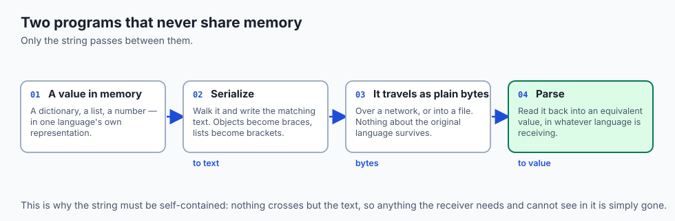
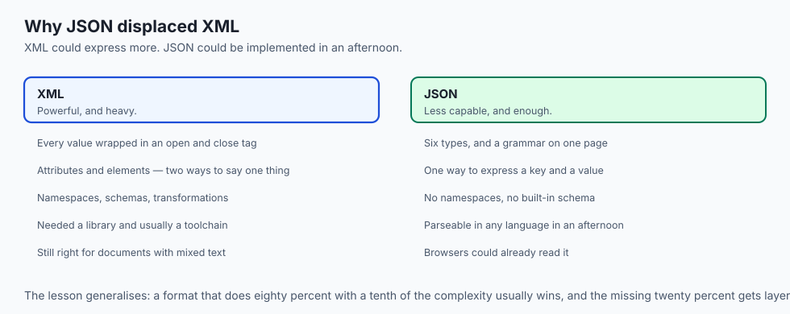
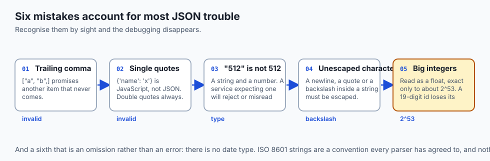
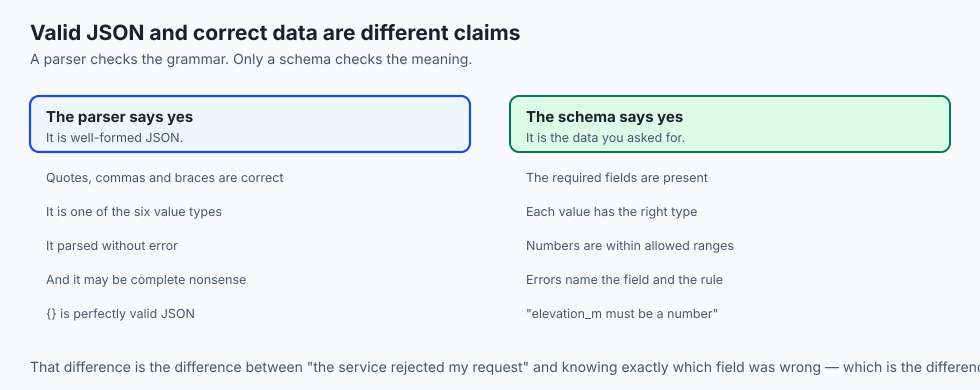
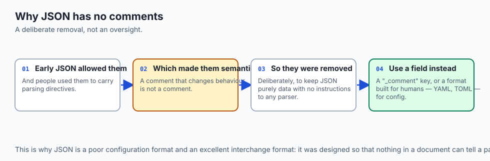
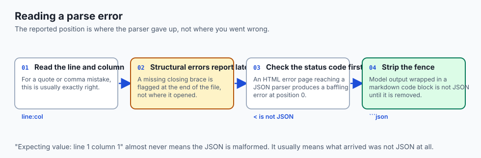
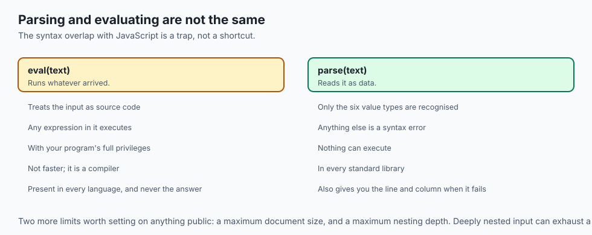
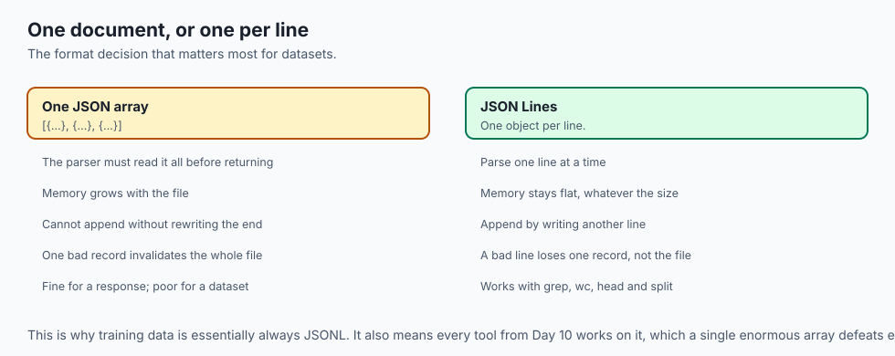
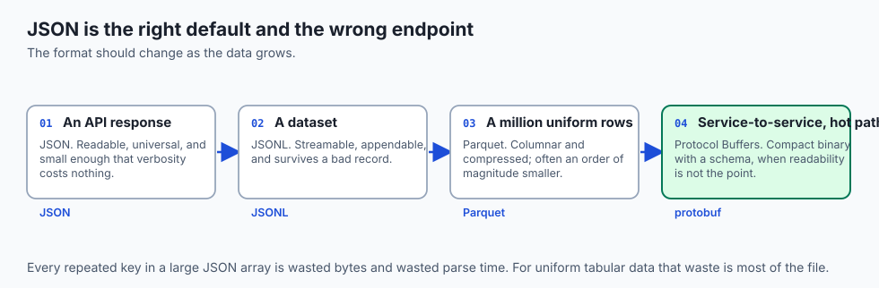
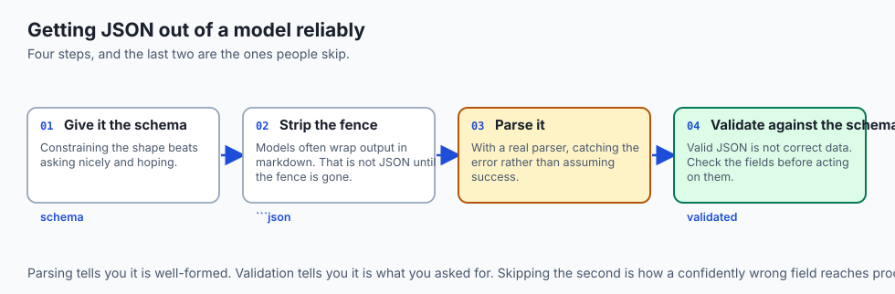

## Why this matters

- **Every API response you read is JSON**, and every model request you send is JSON.
- **Datasets arrive as JSONL** — one JSON object per line — which is the standard
  format for training data.

- **Model outputs are increasingly JSON on purpose**, because a structured answer is
  one a program can act on.

- **The pitfalls are few and specific**, and knowing six of them prevents most of the
  debugging you would otherwise do.

- **Serialization is a general idea.** JSON is today's default, not the last word, and
  the concept outlives the format.

---

## The idea in plain language



- **Serialization turns a value in memory into text or bytes** that can travel or be
  stored.

- **Parsing turns it back** into a value the receiving program can use.
- **The two programs never share memory.** Only the string passes between them, which
  is why it must be self-contained.

- **JSON is the format almost everything agreed on**: six value types, a short
  grammar, readable by humans and machines.

- **It describes data, not behaviour.** There are no functions, no dates, no comments
  — deliberately.

---

## Historical background



- **XML dominated the early 2000s.** Powerful, verbose, and requiring a library and a
  schema to do anything.

- **Douglas Crockford specified JSON in 2001**, taking the object-literal syntax
  JavaScript already had and declaring it a data format.

- **He did not invent it so much as notice it.** The grammar fits on one page, which
  was the point.

- **It spread because it needed nothing.** Any language could parse it in an
  afternoon, and browsers could already read it.

- **It became an international standard in 2013**, by which time it had already won.
- **The omissions were deliberate.** No comments, no dates, no schema — Crockford
  removed comments specifically because people were using them to carry directives.

---

## What it is — and what it is not

**It is:**

- A text format with six value types and a grammar short enough to memorise.
- Language-independent, despite the name.
- Self-describing: you can read a JSON document and understand its structure.

**It is not:**

- **Not JavaScript.** The syntax overlaps; the semantics do not. Valid JSON is a
  subset of JavaScript literals, and treating it as code is a security hole.

- **Not a schema.** A document can be perfectly valid JSON and complete nonsense for
  your purpose.

- **Not typed beyond six types.** There is no date, no decimal, no binary — those are
  conventions layered on strings.

- **Not efficient.** It is text, it repeats every key, and it is a poor choice for
  very large or very hot data.

---

## Why it was created and what problems it solves

- **Interoperability.** Two programs in different languages, on different machines,
  agreeing on a value without sharing a runtime.

- **Simplicity over power.** XML could express more; JSON could be implemented in an
  afternoon, and that mattered more.

- **Human readability.** You can read a response and know whether it is right, which
  is a debugging superpower.

- **No toolchain.** No code generation, no schema compiler, no build step.
- **Nesting.** Real data is hierarchical, and JSON expresses hierarchy natively where
  CSV cannot.

---

## How it works

### The six value types

| Type | Example | Notes |
| --- | --- | --- |
| Object | `{"lat": 26.9, "lon": 75.8}` | Unordered `"key": value` pairs; keys are double-quoted strings |
| Array | `["temp", "humidity"]` | Ordered list of any values; position matters |
| String | `"Nimbus-7"` | Double-quoted, Unicode throughout, backslash escapes |
| Number | `512`, `26.9124`, `-4e3` | One numeric type; no quotes, no leading `+` |
| Boolean | `true`, `false` | Exactly these two lowercase words, unquoted |
| Null | `null` | Lowercase; a deliberately empty value |


- **The containers give JSON its reach.** An object's value can be another object or
  an array, downward without limit.

- **So one document describes a deeply nested structure** — a station whose
  coordinates are an object, whose sensors are an array, whose calibration is an
  object of objects.

### The syntax rules that matter

- **Double quotes always**, for every string and every key. Never single quotes.
- **Commas separate, and never trail.** `["a", "b",]` is invalid.
- **A colon separates a key from its value.**
- **`true`, `false` and `null` are lowercase and unquoted.**
- **Numbers are written plainly** — no quotes, no leading zeros.
- **Whitespace between tokens is ignored**, so compact and pretty-printed documents
  mean the same thing.

- **There is no comment syntax at all**, which surprises everyone once.

### Serializing and parsing


- **To serialize is to walk an in-memory value and write the matching text**: a
  dictionary becomes `{...}`, a list becomes `[...]`, text becomes a quoted string
  with special characters escaped.

- **To parse is the mirror image**: read left to right, and each `{` begins an object,
  each `[` an array, each quote a string.

- **Every mainstream language ships both** in its standard library, so you call one
  function each way rather than writing the walk.

- **Keep the round trip in mind**: A serializes, the text travels or is stored as
  plain bytes, B parses. They never share memory — which is exactly why the string
  must be self-contained.

### The pitfalls, concretely



- **Trailing commas.** `["a", "b",]` promises another item that never arrives.
- **Wrong quotes.** `{'name': 'x'}` is not JSON.
- **Numbers versus strings.** `"512"` and `512` are different values, and a service
  expecting one will reject or misread the other.

- **Escaping.** A newline, a double quote or a backslash inside a string must be
  escaped as `\n`, `\"`, `\\`.

- **Big integers.** JSON's number type is usually read into a float, exact only up to
  about 2^53. A nineteen-digit account number can silently lose its last digits —
  which is why such values are deliberately sent as strings.

- **No dates.** There is no date type. ISO 8601 strings are the convention, and they
  are only a convention.

### Schema validation at a glance



- **JSON says nothing about which fields must exist** or what type each should be.
- **A file can be perfectly valid and complete nonsense** for your purpose.
- **JSON Schema fills the gap.** It is itself a JSON document describing the shape
  another must match: required keys, types, ranges.

- **A validator tells you precisely where the data violates the rules.**
- **That turns "the service rejected my request"** into "`elevation_m` must be a
  number and you sent a string", which is the difference between guessing and
  knowing.

---

## An everyday analogy



Flat-pack furniture.

| The furniture | Serialization |
| --- | --- |
| The assembled chair | A value in memory |
| Taking it apart into labelled pieces | Serializing |
| The flat box | The JSON string |
| Shipping the box | The network or the file |
| Rebuilding from the pieces | Parsing |
| The instruction sheet's expectations | A schema |

- **You cannot post a chair.** You can post a box of parts that reassembles into one.
- **The box must be self-contained.** Anything the assembler needs and does not have
  is a missing field.

- **A box with the right parts in the wrong shapes** still assembles into nothing,
  which is why valid JSON is not the same as correct data.

---

## Examples in practice



- **`Expecting property name enclosed in double quotes`** — single quotes, or a
  trailing comma.

- **An id ending in `000`** that should not — a big integer read as a float.
- **A model returning JSON wrapped in a markdown code fence**, which is not JSON until
  you strip the fence.

- **A JSONL dataset with one malformed line** in four million, which fails the whole
  load unless you handle lines individually.

- **A `Content-Type: application/json` response whose body is an HTML error page**,
  which is why you check the status before parsing.

---

## Implications: security, privacy, performance, scalability, and cost



- **Security: never evaluate JSON as code.** `eval` on untrusted input executes it.
  Every language has a parser; use it.

- **Deeply nested input can exhaust a parser's stack**, which is a denial-of-service
  vector. Limit depth and size on anything public.

- **Privacy: JSON is transparent.** Everything in the document is readable by anything
  that touches it, including your logs.

- **Performance: JSON is verbose.** Every key is repeated on every record, which for
  large arrays of uniform objects is enormous waste.

- **Parsing large JSON is memory-hungry**, because the usual parser builds the whole
  structure before returning. Streaming parsers exist for exactly this.

- **Cost: for a million uniform records, a columnar format is a fraction of the size
  and far faster to query.** JSON is the right default and the wrong endpoint.

---

## Alternatives: free, open source, and commercial



| Format | Type | Where it fits |
| --- | --- | --- |
| JSON | Free, universal | APIs, configuration, small to medium data |
| JSONL | Free, convention | One object per line; streaming and training data |
| YAML | Free, open source | Configuration humans write; a superset of JSON, with traps |
| TOML | Free, open source | Configuration, with fewer traps than YAML |
| CSV | Free, universal | Flat tabular data, and nothing nested |
| Parquet | Free, open source | Columnar, compressed, for large analytical datasets |
| Protocol Buffers | Free, open source | Compact binary with a schema, for service-to-service |

- **JSONL is the format to know for AI work.** One object per line means you can
  stream a file larger than memory, and a bad line does not destroy the rest.

- **YAML is a superset of JSON** and has genuinely surprising behaviour around
  unquoted values — the country code `NO` parsing as `false` being the famous one.

- **Move to Parquet when data becomes large.** The size difference is usually an order
  of magnitude.

---

## Comparison with related concepts

| Term | What it actually is |
| --- | --- |
| **Serialization** | Turning a value into text or bytes |
| **Parsing** | Turning it back into a value |
| **JSON** | One text format for doing so |
| **JSONL** | One JSON document per line |
| **Schema** | A description of what shape a document must have |
| **Validation** | Checking a document against a schema |
| **Encoding** | Bytes to characters, from Day 5 — a different layer entirely |

---

## When to use it — and when not to



- **Use JSON for APIs, configuration and anything humans will read.** It is the
  default for good reasons.

- **Use JSONL for datasets and logs**, so you can stream and so one bad record does
  not lose the file.

- **Validate with a schema anywhere data crosses a boundary** you do not control.
- **Send big integers as strings** if they must survive exactly.
- **Do not use JSON for large uniform tables.** Every repeated key is wasted bytes and
  wasted parse time.

- **Do not hand-write large JSON.** Generate it, and let the library handle escaping —
  which is also how injection bugs are avoided.

- **Do not put comments in it.** There is no syntax, and every workaround is a
  convention someone else's parser does not share.

---

## The AI connection



- **Training data is JSONL**, essentially universally: one example per line,
  streamable, appendable, and robust to a single bad record.

- **Structured output is JSON with a schema.** Asking a model for JSON and validating
  it is how you get an answer a program can act on rather than prose to parse.

- **Tool calling is JSON in both directions**: the model emits arguments as JSON, and
  your result goes back the same way.

- **Model outputs often arrive fenced in markdown**, and stripping that fence before
  parsing is a step everyone writes once and then keeps.

- **A schema does more than validate.** Given to the model, it constrains the shape of
  what it produces — which is the difference between hoping and specifying.

---

## Knowledge check

```yaml
quiz:
  question: "A service sends account identifiers as JSON strings rather than numbers, even though every identifier is numeric. What problem does that avoid?"
  options:
    - "JSON numbers are typically read as floats, so integers beyond about 2^53 lose precision"
    - "JSON numbers cannot begin with a zero, which some identifiers require"
    - "String comparison is faster than numeric comparison in most parsers"
    - "JSON has no integer type at all, so numeric values are rejected by strict parsers"
  answer_index: 0
  explanation: "JSON has one numeric type, and most parsers read it into a double-precision float, which represents integers exactly only up to 2^53. A nineteen-digit identifier silently loses its final digits, so services that care send them as strings deliberately."
```

---

## Hands-on exercise

Round-trip real data, then break it in each of the documented ways. Worked through
fully in the Day 24 lab directory.

| What you are doing | Command |
| --- | --- |
| Pretty-print a response | `curl -s URL \| python3 -m json.tool` |
| Query it with `jq` | `curl -s URL \| jq '.items[0].name'` |
| Validate a file | `python3 -c "import json,sys; json.load(open(sys.argv[1]))" f.json` |
| Round-trip in Python | `json.loads(json.dumps(obj)) == obj` |
| Break it: trailing comma | Add one and re-run the validator |
| Break it: big integer | `json.loads('{"id": 12345678901234567890}')` |
| Read JSONL line by line | `while read -r l; do echo "$l" \| jq -r .id; done < data.jsonl` |

### Expected output

```text
{
    "id": 1,
    "title": "delectus aut autem"
}
json.decoder.JSONDecodeError: Expecting property name enclosed in double quotes: line 3 column 5
12345678901234567168
```

- **The decoder names the line and column**, which is almost always enough.
- **The big integer came back wrong** — note the last three digits. Nothing raised.

### Validate your work

- [ ] You pretty-printed and queried a real API response
- [ ] You produced each of the six value types in one document
- [ ] You triggered a parse error with a trailing comma and with single quotes
- [ ] You demonstrated integer precision loss and can explain the 2^53 boundary
- [ ] You processed a JSONL file one line at a time
- [ ] `bash tests/run_tests.sh` reports 0 failures

### Troubleshooting

- **`jq` not installed.** `python3 -m json.tool` pretty-prints without it.
- **The error names a line far from the real mistake.** A missing closing brace is
  reported where the parser gave up, not where it began.

- **Your Python dictionary round-trips unequal.** Tuples become arrays, and integer
  keys become strings. JSON has neither.

- **A JSONL file fails as one document.** It is not one document. Parse each line.

### Common mistakes

- **Parsing before checking the status code**, so an HTML error page reaches your JSON
  parser.

- **Single quotes**, especially when hand-writing a `curl` payload.
- **Assuming numbers survive.** Test with your actual identifiers.
- **Using `eval` to parse.** It is not faster and it executes whatever arrived.

---

## Practice assignment

- **Take a nested API response** and extract three values at different depths with
  `jq`, then do the same in Python.

- **Write a JSON document containing all six types**, nested at least three deep, and
  validate it.

- **Deliberately produce all six pitfalls** and record the exact error each yields.
  These are the errors you will meet, and recognising them by sight is the whole
  saving.

- **Convert a CSV to JSONL and back**, and note what is lost in each direction.

---

## Extension challenge

- **Write a JSON Schema** for a real API response and validate the response against
  it. Then change one field's type and confirm the validator catches it.

- **Compare formats on real data.** Take 100,000 uniform records and measure the size
  as JSON, as JSONL, and as Parquet, plus the time to read each.

- **Stream a JSON file larger than your memory** using a streaming parser, and explain
  why the ordinary one cannot.

- **Ask a model for JSON output** with and without a schema, a hundred times each, and
  count how often each approach produces something that parses. The difference is the
  argument for schemas.

---

