## Why this matters

- **Every model API call carries a credential**, and getting that one header wrong is
  your most likely first error.
- **A leaked key is a bill.** Model APIs are metered, and a key found in a public
  repository is found within minutes.
- **`401` is authentication; `403` is permission.** Two different problems, and today
  they stop being interchangeable.
- **OAuth is how your app acts on someone else's behalf** without ever seeing their
  password.
- **Everything here is a habit, not a technique.** The techniques are simple; the
  discipline is what protects you.

---

## The idea in plain language

- **Every scheme puts a secret into the request.** They differ in which part carries
  it and what the secret represents.
- **An API key says "this is which account".** A bearer token says "whoever holds
  this is authorised".
- **Basic auth carries a username and password**, encoded but not encrypted.
- **OAuth is delegation**: you let an app act for you, at a service you already have
  an account with, without handing over your password.
- **The secret's safety is about where you keep it**, far more than which scheme you
  chose.

---

## Historical background

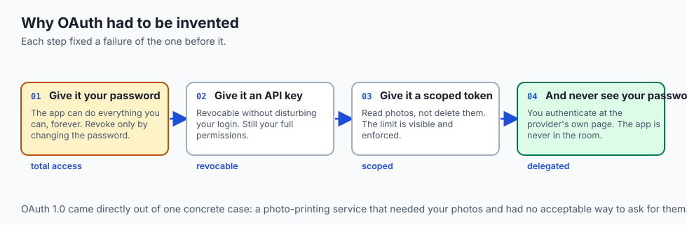

- **Early web APIs used the password directly**, because HTTP already had Basic auth
  and it was there.
- **That was untenable the moment third-party apps appeared.** Giving an app your
  password gives it everything, forever, revocable only by changing the password.
- **API keys came next** — a per-account secret you could revoke without disturbing
  your login.
- **OAuth 1.0, 2007, grew out of that specific problem**: a photo-printing service
  needing your photos without needing your account.
- **OAuth 2.0, 2012, simplified it and leaned entirely on TLS** for transport
  security, which is why it is far easier to implement and far less forgiving of
  plain HTTP.
- **Bearer tokens became the default** because they are simple, and simplicity is
  what gets implemented correctly.

---

## What it is — and what it is not

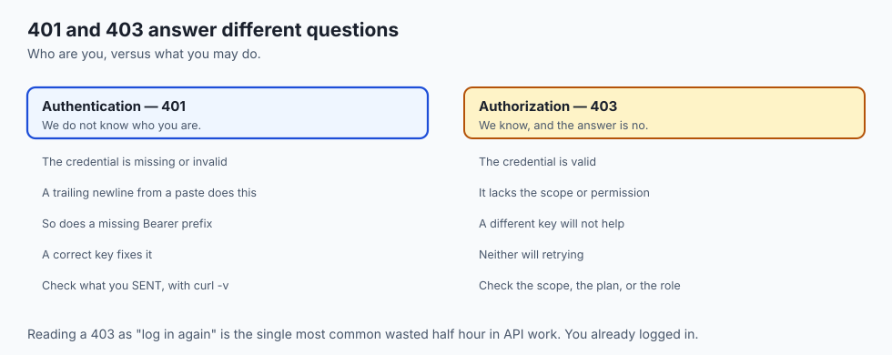

**Authentication is:**

- Proving which account a request belongs to.
- A secret placed in a specific part of the request, checked by the server.
- The precondition for rate limiting, billing and audit — all of which need to know
  who you are.

**It is not:**

- **Not authorization.** Authentication is who you are; authorization is what you may
  do. `401` and `403` mark the difference.
- **Not encryption.** The credential is protected in transit by TLS, not by the
  scheme carrying it.
- **Not identity of a person.** A key identifies an account, which may be shared by a
  team, a script and a server.
- **Not permanent.** Every credential here is meant to be revoked and replaced, and a
  scheme without revocation is a scheme you cannot recover from.

---

## Why it was created and what problems it solves

- **Attribution.** The service needs to know whose request this is, to meter it, bill
  it and log it.
- **Revocation.** A key you can cancel is a mistake you can survive; a password is
  not.
- **Least privilege.** A scoped credential can do less than you can, which limits the
  damage when it leaks.
- **Delegation without impersonation.** OAuth exists so an app can act for you
  without becoming you.
- **Rate limiting.** You cannot count requests per account until you know which
  account they belong to.

---

## How it works


### The common schemes

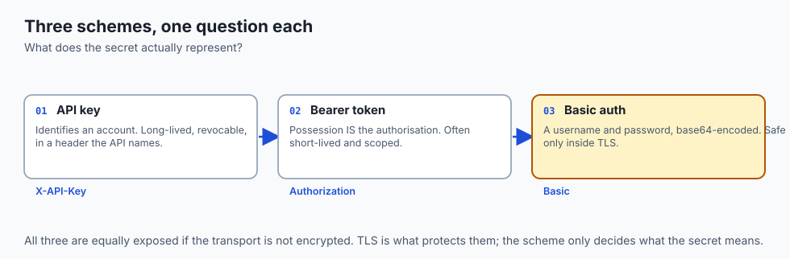

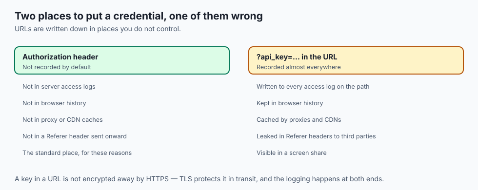

**API key in a header.** The API issues a key; you attach it to a header the API
names, commonly `X-API-Key`:

```bash
curl -H "X-API-Key: key-example-abc123" https://api.example.com/v1/data
```

- **Some APIs accept the key in the URL instead**, as `?api_key=...`. Avoid it
  whenever a header is available.
- **URLs leak.** They are written to access logs, saved in browser history, cached by
  proxies, and pasted into chats and bug reports.
- **Same secret, riskier envelope.**

**Bearer token.** Sent in the standard `Authorization` header:

```bash
curl -H "Authorization: Bearer token-example-123" https://api.example.com/v1/data
```

- **"Bearer" means what it says**: possession is authorisation. Whoever holds it can
  use it, which is why it is guarded like cash.
- **This is what the great majority of modern APIs expect**, model APIs included.

**Basic auth.** Username and password, joined with a colon and base64-encoded:

```bash
curl -u user:pass https://api.example.com/v1/data
# produces: Authorization: Basic dXNlcjpwYXNz
```

- **Base64 is not encryption.** Anyone decodes `dXNlcjpwYXNz` back to `user:pass`
  instantly, with no key.
- **Basic auth keeps a password secret only inside TLS.** Over plain HTTP it is
  equivalent to shouting it across the room.

### OAuth 2.0, as a story

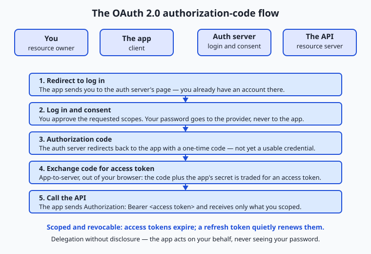

Four players: **you** (the resource owner), the **app** (the client), the
**authorization server** (the provider's login and consent service), and the **API**
(holding your data).

1. **The app sends you to the provider.** You land on the provider's own page, not
   the app's.
2. **You log in and consent.** The provider shows exactly what is being asked for —
   "read your photos" — and you approve or refuse. Your password is typed into the
   provider's page, which the app never sees.
3. **The provider hands the app an authorization code**, via a redirect back. This is
   not yet a usable credential; it is a one-time voucher.
4. **The app exchanges the code plus its own client secret** for an access token,
   app-to-server, out of your browser's view.
5. **The app calls the API** with that token as a bearer token, and gets your photos —
   only your photos, only within the scope you granted.

- **Scopes are the limit you can see and refuse.** Read photos but not delete them;
  calendar but not email.
- **Access tokens are deliberately short-lived** — minutes to an hour — so a leaked
  one expires quickly.
- **A refresh token mints new access tokens** without asking you again, which makes it
  the more sensitive of the two.
- **You can revoke at the provider.** The delegation is undoable, which is the whole
  point.

### Handling secrets safely

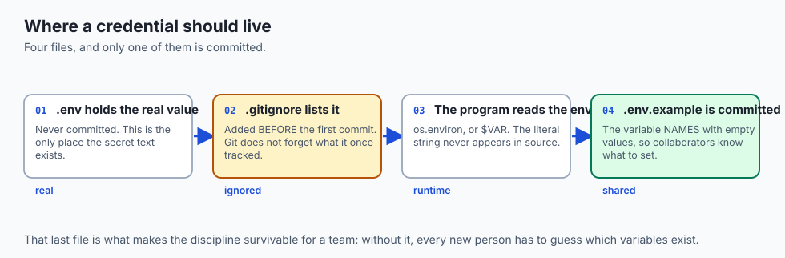

```bash
export DEMO_TOKEN="token-example-123"
curl -H "Authorization: Bearer $DEMO_TOKEN" https://api.example.com/v1/data
```

- **Never hard-code.** A key in your source is one `git push` from the internet.
- **Keep it out of git.** Real secrets in `.env`, `.env` in `.gitignore`, and a
  committed `.env.example` carrying the *names* with empty values.
- **Least privilege.** Create the narrowest key that does the job — read-only, one
  project, limited spend. If it leaks, the blast radius is small.
- **Rotate.** Periodically, and *immediately* if one is ever exposed. The instant a
  key touches a public place, treat it as burned: revoke it and issue a new one.

### A note on rate limiting

- **Authentication is what makes rate limiting possible.** The credential is also the
  meter.
- **Every request is tied to an account**, so the server can count and refuse past a
  limit with `429`.
- **Limits protect the service from overload** and protect you from a runaway loop
  quietly spending your budget. Day 27 covers this properly.

---

## An everyday analogy

Different ways of getting into a building.

| The building | The scheme |
| --- | --- |
| Your own name and password at reception | Basic auth |
| A staff badge issued to you | An API key |
| A visitor pass anyone holding may use | A bearer token |
| Letting a courier collect one parcel for you | OAuth delegation |
| "Parcels only, third floor, today" | Scopes |
| A pass that expires at 5pm | Access token lifetime |
| Cancelling a lost badge | Revocation |

- **You would not give a courier your house keys** so they could fetch one parcel.
  That is precisely the problem OAuth solves.
- **A visitor pass works for whoever is holding it.** Drop it in the street and the
  finder walks in — which is what "bearer" means.

---

## Examples in practice

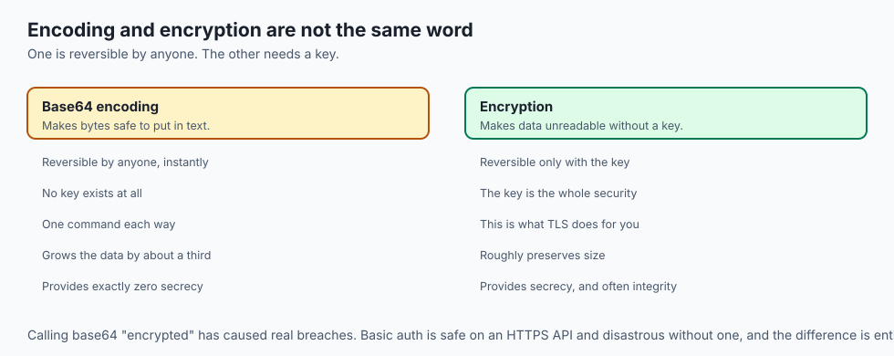

- **`401` on every call with a key you just copied**: a trailing newline, or a
  missing `Bearer ` prefix. Compare `curl -v` output with what your code sends.
- **`403` with a valid key**: the key is real and lacks the scope. A different key
  will not help; a different permission will.
- **A key committed and revoked within the hour**, because scanners watch public
  repositories continuously and find them faster than people do.
- **An OAuth consent screen asking for far more than the app needs**, which is exactly
  the moment scopes are there for you to read.
- **A token that works for an hour and then stops**, which is an access token expiring
  and a refresh step that was never implemented.

---

## Implications: security, privacy, performance, scalability, and cost

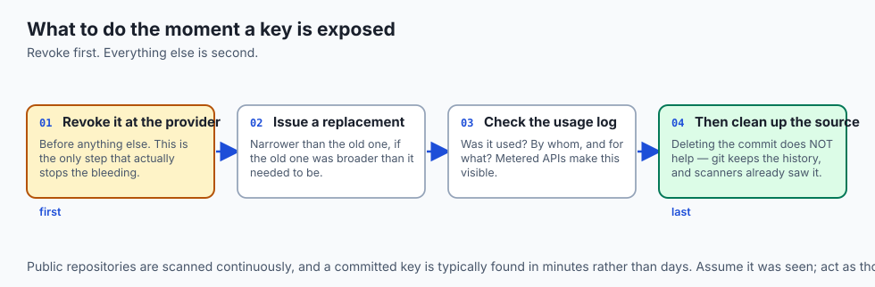

- **Security: a bearer token is cash.** No further check is made; possession is the
  whole proof.
- **Git does not forget.** Removing a key in a later commit leaves it in the history,
  which is why the response to exposure is revocation, not deletion.
- **Privacy: OAuth scopes are a privacy control you can actually exercise.** Reading
  the consent screen is the one moment you get to say no.
- **Performance: authentication is cheap; TLS is what costs**, and connection reuse
  from Day 15 pays for both.
- **Scalability: stateless bearer tokens scale because any server can verify them.**
  Server-side sessions do not, which is the Day 23 argument again.
- **Cost: a leaked model API key is a metered bill** running until you notice. Spend
  limits on the key are the cheapest insurance available.

---

## Alternatives: free, open source, and commercial

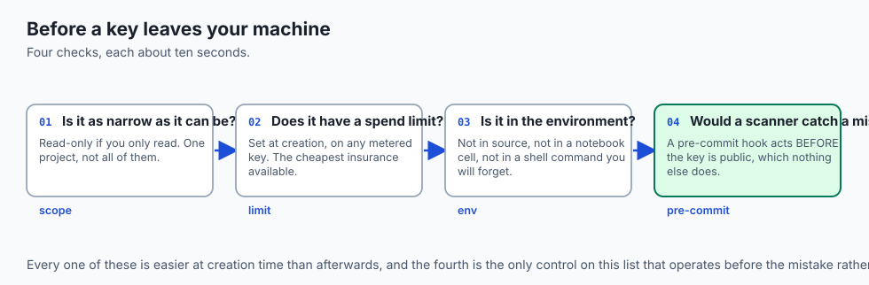

| Approach | Type | Where it fits |
| --- | --- | --- |
| API key in a header | The common default | Server-to-server, single account |
| Bearer token | The modern default | Almost everything, including model APIs |
| Basic auth | Built into HTTP | Internal tools, behind TLS, where simplicity wins |
| OAuth 2.0 | Free, open standard | Acting on a user's behalf at another service |
| mTLS | Free, open standard | Both sides prove identity; internal service meshes |
| Cloud secret managers | Commercial, free tiers | Storage, rotation and audit once more than one machine needs a key |
| `git-secrets`, `gitleaks` | Free, open source | Catching a key *before* it is committed |

- **Install a pre-commit secret scanner today.** It is the one control that acts
  before the mistake rather than after.
- **Move to a secret manager the moment a key is needed on more than one machine.**
  Copying it around is where key sprawl begins.

---

## Comparison with related concepts

| Term | What it actually is |
| --- | --- |
| **Authentication** | Proving which account this is |
| **Authorization** | Deciding what that account may do |
| **API key** | A long-lived secret identifying an account |
| **Bearer token** | A credential whose possession is the authorisation |
| **Scope** | The specific permissions a token carries |
| **Refresh token** | A credential used to mint new access tokens |
| **Rotation** | Replacing a credential on purpose, before you must |

---

## When to use it — and when not to

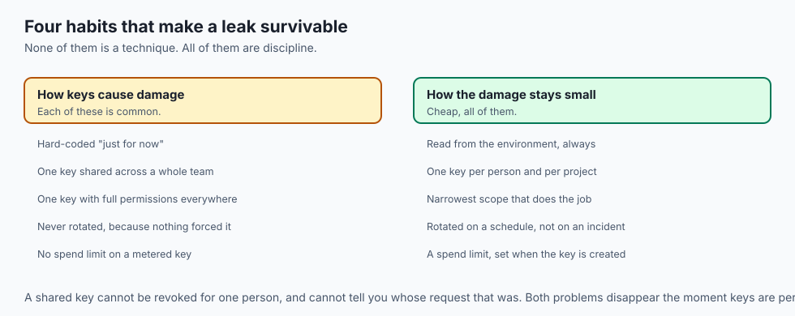

- **Use a header, not a query parameter**, whenever the API offers both.
- **Use OAuth when acting on someone else's behalf.** Asking a user for their password
  to another service is never acceptable.
- **Use the narrowest scope that works**, and create a separate key per project so one
  leak does not reach the others.
- **Do not put a credential in a URL, a log, a screenshot, or a commit.**
- **Do not share one key across a team.** You lose all ability to revoke one person's
  access, or to tell whose request that was.
- **Do not build your own OAuth server.** It is a genuinely hard problem with a
  well-tested answer, and the failure mode is silent.

---

## The AI connection

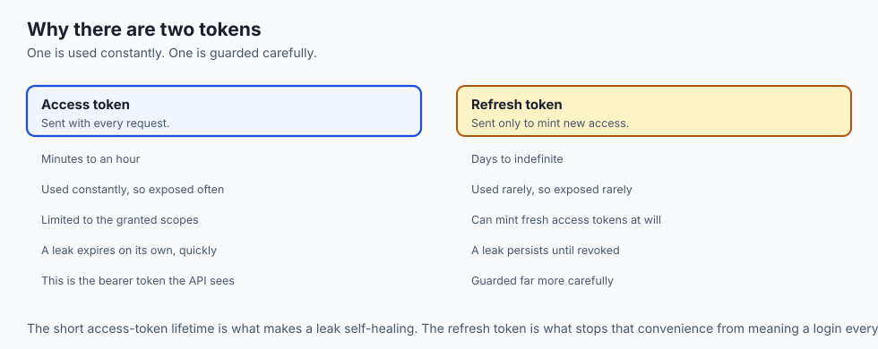

- **`OPENAI_API_KEY`, `ANTHROPIC_API_KEY`, `HF_TOKEN`** — every provider uses the same
  bearer pattern, read from the environment as on Day 11.
- **Model keys are metered, which makes a leak expensive rather than merely
  embarrassing.** Set a spend limit on every key you create.
- **Never send a key to a model.** Pasting a config file into a chat to debug it sends
  the credential too.
- **Agents that call tools on a user's behalf need OAuth**, not a shared key — the
  delegation problem is exactly the one OAuth was invented for.
- **Scoped, per-project keys make an agent's blast radius knowable**, which is the
  main control you have over a system that decides its own actions.

---

## Knowledge check

```yaml
quiz:
  question: "An API accepts its key either as a query parameter or in a header, and both work identically. Why prefer the header?"
  options:
    - "Query strings are recorded in access logs, browser history and Referer headers, where headers are not"
    - "Headers are encrypted by TLS while query strings are sent in plaintext"
    - "Query parameters have a length limit that keys frequently exceed"
    - "Headers are validated by the server before the query string is parsed"
  answer_index: 0
  explanation: "TLS encrypts the whole request, URL included, so transport is not the difference. The difference is what gets written down: URLs are logged by proxies and servers, kept in history, and forwarded in Referer headers, while headers are not recorded by default."
```

---

## Hands-on exercise

Authenticate three ways, then prove base64 is not a secret. Worked through fully in
the Day 25 lab directory.

| What you are doing | Command |
| --- | --- |
| Call without a credential | `curl -i https://httpbin.org/bearer` |
| Send a bearer token | `curl -i -H "Authorization: Bearer token-example-123" https://httpbin.org/bearer` |
| Send Basic auth | `curl -i -u user:pass https://httpbin.org/basic-auth/user/pass` |
| Decode what Basic sent | `echo -n 'user:pass' \| base64` then `base64 -d` it back |
| Read the key from the environment | `export DEMO_TOKEN=token-example-123` then use `$DEMO_TOKEN` |
| Confirm it is not in your source | `grep -r "token-example" . --exclude-dir=.git` |

### Expected output

```text
HTTP/1.1 401 UNAUTHORIZED
HTTP/1.1 200 OK
{"authenticated": true, "token": "token-example-123"}
dXNlcjpwYXNz
user:pass
```

- **`401` with no credential**, `200` with one — the whole mechanism in two requests.
- **The base64 round trip takes one command each way**, with no key involved. That is
  the entire point.

### Validate your work

- [ ] You produced a `401` and then a `200` against the same endpoint
- [ ] You decoded a Basic auth header back to the original username and password
- [ ] You read a credential from an environment variable rather than typing it inline
- [ ] Your `.gitignore` contains `.env`, and `git status` confirms it is untracked
- [ ] You can state the difference between `401` and `403` without hesitating
- [ ] `bash tests/run_tests.sh` reports 0 failures

### Troubleshooting

- **`401` with a key you are sure is right.** Check for a trailing newline from a copy
  and paste, and check the `Bearer ` prefix and its single space.
- **The shell expands your key oddly.** Quote it. Keys contain characters the shell
  treats specially.
- **`echo $KEY` prints nothing.** You exported it in a different shell, or a script
  set it in a child — Day 11's inheritance rule.
- **A `403` you expect to be a `401`.** The key is valid and lacks permission. Read
  the scope.

### Common mistakes

- **Hard-coding a key "just for now".**
- **Committing `.env`.** Add it to `.gitignore` before the first commit, not after.
- **Calling base64 encryption.**
- **Deleting a leaked key from the code instead of revoking it at the provider.**

---

## Practice assignment

- **Take a project you have and move every credential to the environment**, then
  confirm with `grep` that none remain in source.
- **Create two keys for one service**, one read-only, and prove the narrow one cannot
  perform a write.
- **Walk an OAuth consent screen** for a real app and write down every scope it asks
  for, then decide whether each is justified.
- **Set a spend limit** on any metered API key you hold, and note what happens when it
  is reached.

---

## Extension challenge

- **Install a pre-commit secret scanner** and prove it blocks a commit containing a
  key-shaped string. This is the control that acts before the mistake.
- **Decode a real JWT** at the token level: split it on the dots and base64-decode the
  first two parts. Seeing the claims in plaintext teaches what a signed token does and
  does not hide.
- **Implement the client half of an OAuth flow** against a provider's sandbox, and
  observe where the code appears and where the token exchange happens.
- **Rotate a key end to end** on something you run: issue the new one, deploy it,
  confirm traffic has moved, then revoke the old one. Doing it once calmly is what
  makes doing it under pressure possible.

---

