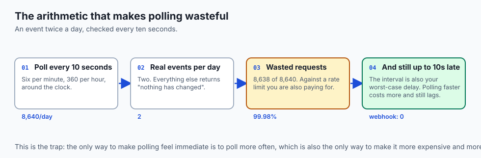
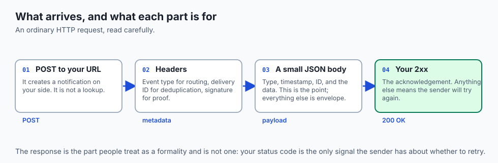
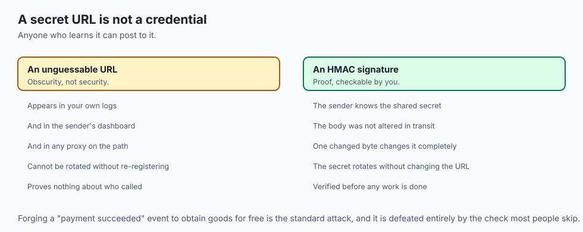
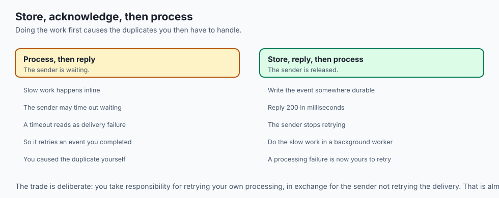
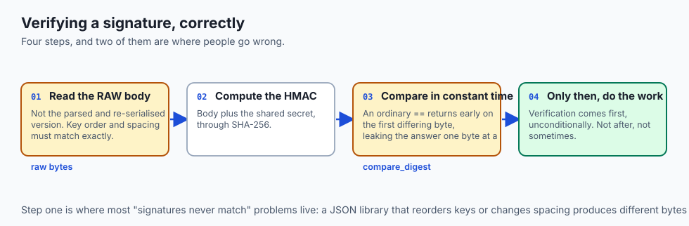
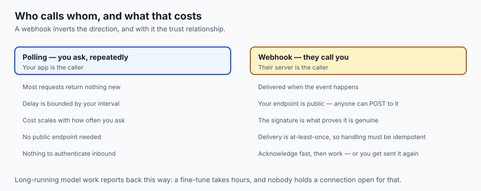
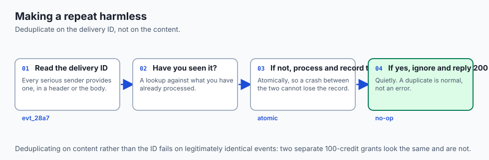
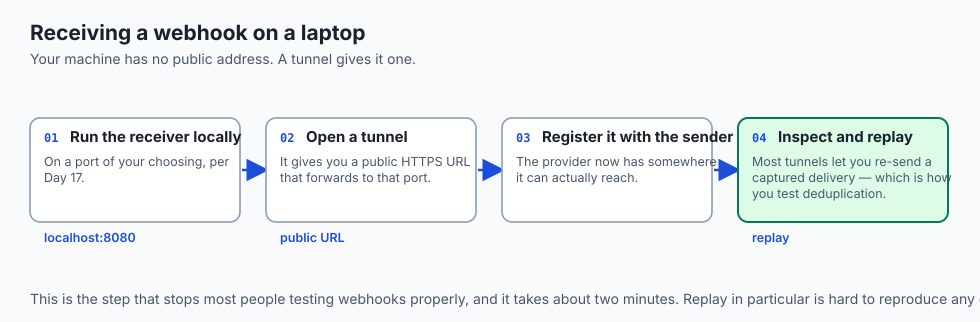
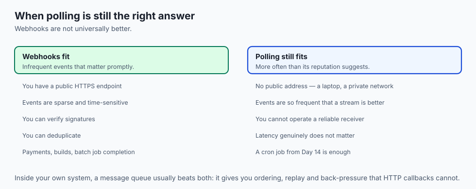

## Why this matters

- **Long-running AI jobs finish asynchronously**, and a webhook is how you find out
  without asking repeatedly.
- **Polling wastes almost every request.** Ask every ten seconds for an event that
  happens twice a day and 99.9 percent of your calls return nothing.
- **A webhook receiver is a public URL** that anyone can post to, which makes
  signature checking the whole security model.
- **At-least-once delivery means duplicates are normal**, not exceptional — and
  handling them is the price of reliability.
- **This is the inverse of everything so far.** Until now you called them; now they
  call you.

---

## The idea in plain language


- **A webhook is a callback over HTTP.** You register a URL; the service posts to it
  when something happens.
- **You stop asking and start being told.** That is the whole difference from polling.
- **The delivery is an ordinary HTTP request** — method, headers, JSON body — which
  means everything from Week 3 applies.
- **Your `200` response is the acknowledgement.** Anything else means "try again",
  and the sender will.
- **The same event may arrive twice.** Designing for that is not optional polish; it
  is the cost of guaranteed delivery.

---

## Historical background

- **The term was coined by Jeff Lindsay in 2007**, describing a hook for the web: a
  user-defined callback triggered by an event.
- **Before them, integration meant polling** — asking repeatedly, at whatever interval
  the rate limit allowed.
- **Polling was the only option** because a client behind a home connection had no
  address a server could reach.
- **Cloud hosting changed that.** Once anyone could have a public HTTPS endpoint
  cheaply, the server could call the client.
- **Payment providers drove adoption.** A card charge settles asynchronously, and no
  amount of polling makes that pleasant.
- **The pattern is now universal**, and the standard shape — POST, JSON, HMAC
  signature, retries — is remarkably consistent across providers.

---

## What it is — and what it is not

**It is:**

- An HTTP request the *service* makes to *you*, when something happens.
- A URL you register, and a secret you both hold.
- A push model: the event arrives without being asked for.

**It is not:**

- **Not a persistent connection.** Each delivery is a separate request that opens and
  closes, unlike a WebSocket.
- **Not guaranteed to arrive once.** At-least-once means one or more.
- **Not ordered.** Retries and parallel delivery mean event two can arrive before
  event one.
- **Not authenticated by the URL.** A secret URL is not a credential; anyone who
  learns it can post to it, which is why signatures exist.
- **Not suitable for everything.** A client with no public address cannot receive one,
  which is exactly when polling is still right.

---

## Why it was created and what problems it solves



- **Waste.** Polling spends nearly all its requests learning that nothing happened.
- **Latency.** A poll interval is also your worst-case delay. Ten-second polling means
  up to ten seconds late, always.
- **Rate limits.** Polling frequently enough to feel immediate is usually polling
  frequently enough to be throttled.
- **Asynchronous work.** Some operations genuinely take minutes or hours, and holding
  a connection open for them is worse than being called back.
- **Scale on the sender's side.** One outbound call per real event is cheaper for the
  provider than a thousand clients asking constantly.

---

## How it works

### Anatomy of a delivery



- **Method and URL.** Almost always `POST` to the exact URL you registered. `POST`
  because the delivery *creates* a notification on your side; it is not a lookup.
- **Headers.** `Content-Type: application/json`; often an event-type header so you can
  route without parsing; a unique delivery ID so you can detect duplicates; and
  crucially a **signature** proving authenticity.
- **Body.** A small JSON document: the event type, a timestamp, an ID, and the
  relevant data — a payment amount, a commit hash, a job's output location.
  Everything else is envelope.


- **Your response is unusually important.** A `2xx` means "received, thank you".
  Anything else — a `4xx`, a `5xx`, or a timeout — means "delivery failed, try again".
- **Your `200` is not a formality.** It is the acknowledgement that stops the retries.

### Securing the delivery



- **Your receiver is a public URL.** Anyone who learns or guesses it can post to it,
  including someone forging a "payment succeeded" event to get free goods.
- **The URL alone proves nothing** about who is calling.
- **An HMAC signature is the standard answer.** At setup the sender gives you a
  **secret** only the two of you know.
- **For each delivery the sender hashes the raw body plus the secret** — commonly with
  SHA-256 — and puts the result in a header.
- **You recompute it over the body you received and compare.**
- **A match proves two things at once**: the sender knows the secret (authenticity),
  and the body was not altered (integrity), because changing one byte changes the
  signature completely.
- **Serve the endpoint over HTTPS**, and keep the secret out of source and out of logs
  — it is a credential exactly like yesterday's keys.
- **Skipping the signature check is the single most common and most dangerous webhook
  mistake.**

### Reliability



- **Senders promise at-least-once delivery.** If they do not get a `2xx`, they retry,
  usually over minutes or hours with growing gaps.
- **So the same event can arrive more than once.** Perhaps you did the work and
  crashed before replying; the sender never heard the acknowledgement.
- **Idempotency is the defence.** Processing an event twice must have the same effect
  as processing it once.
- **Record the delivery IDs you have handled** and quietly ignore repeats. "Grant 100
  credits for event `evt_28a7`" run twice must still grant 100, not 200.
- **Do not assume ordering.** Retries and parallel delivery mean event two can arrive
  first. If sequence matters, use timestamps or sequence numbers in the payload.
- **Acknowledge fast.** Reply `200` as soon as the event is safely stored, then do the
  slow work afterwards, usually in a background worker.
- **Doing slow work before replying risks a timeout**, which the sender reads as
  failure — producing a retry and a duplicate you caused yourself.

---

## An everyday analogy

Waiting for a parcel.

| The delivery | The pattern |
| --- | --- |
| Phoning the depot every ten minutes | Polling |
| Asking them to text you on arrival | A webhook |
| Your address | The registered URL |
| Signing for the parcel | Replying `200` |
| No signature, so they come back tomorrow | A retry |
| A courier ID you can check | The HMAC signature |
| Two texts for one parcel | At-least-once delivery |

- **Ninety-nine of your hundred phone calls learn nothing.** That is polling's
  arithmetic.
- **Anyone can knock on your door** and claim to be a courier. The signature is what
  makes the claim checkable.
- **If you do not sign, they try again.** Which is exactly right, and exactly why you
  might get the same parcel twice.

---

## Examples in practice





- **A payment provider posting `payment.succeeded`** minutes after the customer left
  your page.
- **A repository host posting on every push**, which is how continuous integration
  starts without anyone asking it to.
- **A batch inference job posting when its output is ready**, hours later, rather than
  you polling for hours.
- **The same event arriving twice** because your handler was slow and the sender timed
  out waiting for the acknowledgement.
- **A forged delivery** that was rejected because the signature did not match — the
  security model working exactly as intended.

---

## Implications: security, privacy, performance, scalability, and cost



- **Security: verify the signature before doing anything.** Not after, not
  conditionally — the check is the entire authentication.
- **Compare signatures in constant time.** An ordinary string comparison returns early
  on the first differing byte, which leaks the correct value one byte at a time.
- **Privacy: payloads often carry personal data**, and your endpoint logs may be
  keeping it. Decide deliberately what you log.
- **Performance: acknowledge in milliseconds.** A handler that does slow work inline
  causes the retries it then has to deduplicate.
- **Scalability: webhooks invert the load.** The sender does one call per event
  instead of every client polling constantly.
- **Cost: a receiver that returns `500` gets retried**, sometimes for hours, and a
  broken endpoint can turn one event into a flood you are paying to receive.

---

## Alternatives: free, open source, and commercial



| Approach | Type | Where it fits |
| --- | --- | --- |
| Polling | Built in | No public address, low event rate, or simplicity matters most |
| Webhooks | The default | Public endpoint, events that matter promptly |
| WebSockets | Built in | Continuous two-way streams, not discrete events |
| Server-sent events | Built in | One-way streaming to a browser; how token streaming works |
| Message queues | Free, open source | Internal systems, where ordering and replay matter |
| `ngrok`, `smee.io` | Free tiers | Receiving webhooks on a laptop during development |

- **Use a tunnelling tool for local development.** Your laptop has no public address,
  and this is the one problem that stops people testing webhooks properly.
- **Reach for a queue rather than a webhook inside your own system.** Queues give you
  ordering, replay and back-pressure that HTTP callbacks do not.

---

## Comparison with related concepts

| Term | What it actually is |
| --- | --- |
| **Webhook** | An HTTP callback triggered by an event |
| **Polling** | Asking repeatedly whether anything has changed |
| **Payload** | The JSON body describing what happened |
| **HMAC** | A keyed hash proving authenticity and integrity |
| **At-least-once** | Delivered one or more times, never zero |
| **Idempotent** | Safe to process more than once |
| **Acknowledgement** | Your `2xx`, which stops the retries |

---

## When to use it — and when not to



- **Use webhooks when events are infrequent and matter promptly.** That is the case
  polling handles worst.
- **Use them for anything asynchronous** — batch jobs, payments, builds, long
  inference.
- **Always verify the signature**, always over HTTPS, always with a constant-time
  comparison.
- **Do not do slow work before replying.** Store, acknowledge, then process.
- **Do not rely on arrival order.** Put a sequence number or timestamp in the payload
  if order matters.
- **Do not use webhooks when you have no public endpoint**, or when the event rate is
  so high that a stream or a queue is the better shape.

---

## The AI connection

- **Batch inference APIs call you back.** A job over thousands of prompts finishes in
  hours, and polling for hours is exactly the waste webhooks remove.
- **Fine-tuning jobs post on completion**, which is the difference between a script
  that waits and a pipeline that continues.
- **Model providers post usage and limit events**, which is how you learn about a
  spend threshold before the bill rather than after.
- **Agent tools receive webhooks**, and an unverified endpoint means an attacker can
  feed your agent a fabricated event and watch it act on it.
- **The idempotency requirement is sharper with generation**, because reprocessing a
  duplicate event means paying for the same inference twice.

---

## Knowledge check

```yaml
quiz:
  question: "A webhook handler processes each event correctly, but occasionally applies the same event twice. Its logic is sound and the sender is reputable. What is the most likely cause?"
  options:
    - "The handler was slow to reply 2xx, so the sender timed out and retried an event that had already been processed"
    - "The sender is sending duplicate events because of a bug in its own queue"
    - "The signature check is passing for events that should have been rejected"
    - "Two instances of the handler are running and both received the same delivery"
  answer_index: 0
  explanation: "At-least-once delivery means the sender retries anything it did not hear a 2xx for. Work done before acknowledging — or simply a slow handler — leads to a timeout the sender reads as failure, so a successfully processed event is delivered again."
```

---

## Hands-on exercise

Receive a real delivery, verify its signature, and prove a forged one is rejected.
Worked through fully in the Day 26 lab directory.

| What you are doing | Command |
| --- | --- |
| Run a local receiver | `python3 -m http.server 8080` or the lab's script |
| Expose it publicly | `ngrok http 8080` |
| Send a delivery yourself | `curl -X POST -H 'Content-Type: application/json' -d @event.json URL` |
| Compute an HMAC | `openssl dgst -sha256 -hmac "$SECRET" event.json` |
| Send it with a signature | Add `-H "X-Signature: sha256=..."` |
| Send a forged one | Change one byte of the body and resend the old signature |
| Compare in constant time | `hmac.compare_digest(a, b)` in Python |

### Expected output

```text
HMAC-SHA256(event.json)= 8f1c2a...e93b
[receiver] signature ok — event evt_28a7 accepted
[receiver] signature MISMATCH — rejected
[receiver] duplicate evt_28a7 — ignored
```

- **One changed byte changes the whole signature**, which is what makes the check
  worth making.
- **The duplicate was ignored** because the delivery ID had already been recorded.

### Validate your work

- [ ] You received a delivery on a URL reachable from the internet
- [ ] You computed an HMAC over the raw body and matched the sender's
- [ ] You forged a delivery and confirmed your receiver rejected it
- [ ] You sent the same event twice and confirmed it was applied once
- [ ] You used a constant-time comparison and can explain why
- [ ] `bash tests/run_tests.sh` reports 0 failures

### Troubleshooting

- **Signatures never match.** You are hashing the parsed and re-serialised body, not
  the raw bytes. Hash exactly what arrived.
- **The sender cannot reach you.** Your laptop has no public address. Use a tunnel.
- **Everything is retried despite working.** You are returning something other than a
  `2xx`, or replying too slowly.
- **Duplicates still get applied.** You are deduplicating on event content rather than
  on the delivery ID.

### Common mistakes

- **Skipping the signature check** because it works without it. So does an attacker's
  request.
- **Comparing signatures with `==`.**
- **Doing the work before replying.**
- **Treating the endpoint URL as a secret.**

---

## Practice assignment

- **Register a real webhook** with a service you use — a repository host is easiest —
  and log every field of three deliveries.
- **Implement signature verification** and prove it rejects a body you modified by one
  character.
- **Add deduplication by delivery ID** and demonstrate it with a replayed delivery.
- **Deliberately return `500`** and observe the retry schedule, recording the gaps
  between attempts.

---

## Extension challenge

- **Measure the waste in polling.** Poll an endpoint every ten seconds for an hour,
  count how many calls returned a change, and express it as a percentage.
- **Implement the fast-acknowledge pattern**: store the event, reply `200`, and hand
  the work to a background process. Then make the work fail and confirm the sender is
  not retried for it.
- **Demonstrate a timing attack conceptually**: time a naive string comparison against
  many candidate signatures and show the timing varies with the number of matching
  leading bytes.
- **Handle out-of-order delivery.** Send two events in reverse order and make your
  handler arrive at the correct final state using the payload's sequence numbers.

---

