## Why this matters

For the last four days you have been the one asking. You send a request, the server sends a response, and nothing happens until you ask again. That works beautifully when *you* control the timing — you want today's weather, so you fetch it. But an enormous share of real systems are the other way around: something happens on a server you do not control, at a moment you cannot predict, and you need to know about it *now*. A payment clears. A file finishes converting. A build passes. A long job you kicked off an hour ago is finally done. If the only tool you have is "ask again," you are stuck choosing between asking constantly (wasteful and expensive) or asking rarely (slow and stale).

This is not an abstract concern for your work ahead. When you start a long-running job — a large batch generation, a fine-tuning run that takes hours, a video render — you do not want to sit in a loop hammering the provider's servers asking "done yet? done yet?" every second. That burns your request quota, runs up your bill, and often gets you rate-limited (tomorrow's lesson). The provider would much rather call *you* the instant the job finishes. That reversal — the server calling your code instead of your code calling the server — is the webhook, and it is the gateway to a whole style of building software called event-driven architecture that quietly underpins payments, messaging, deployment pipelines, and the agent and data systems you will build later. Today you learn the shift from pull to push: what it is, how to receive it safely, and why "the server calls you back" changes how you design systems.

## The idea in plain language

There are two ways to find out when something happens. The first is **polling**: you repeatedly ask, "Has it happened yet?" You check your mailbox every hour to see if a package arrived. Most of those trips find nothing — the package has not come — so most of your effort is wasted, and when it finally does arrive you might not notice for up to an hour. Polling is simple and it always works, but it trades away either freshness or efficiency, and usually both.

The second way is **push**: instead of you asking, the other side *tells* you the moment it happens. The delivery driver rings your doorbell. You did nothing in the meantime — no repeated checking — and you find out instantly. A **webhook** is exactly this for software. Ahead of time, you give a server a URL that belongs to you (your "doorbell"). Later, when an event you care about happens, that server makes an HTTP request *to your URL*, carrying a small description of what happened. You do not poll; you wait, and the server calls you.

Notice the beautiful symmetry. A normal API call is *you* sending an HTTP request to a server and getting a response. A webhook is the **server** sending an HTTP request to *you*. It is the same machinery — HTTP, a method, headers, a body — pointed in the opposite direction. For that reason webhooks are often called a "reverse API": for a webhook, your application is the one that must listen and respond, and the other server is the one making the call. Everything you learned about requests and responses still applies; only the roles are swapped.

## Historical background

The idea of a program calling back another program over the web is older than the word for it. Through the early 2000s, developers built one-off "ping" and "callback" URLs so that one service could notify another when something changed, but there was no shared name or pattern. The term **webhook** was coined by the developer Jeff Lindsay in 2007, in a talk and blog posts arguing that web applications should be able to react to each other's events the way Unix programs pipe output into one another — that the web needed "hooks," user-defined callbacks fired by events, glued together with plain HTTP. The name stuck because it captured the mechanism exactly: a *hook* is a place where you attach your own code to someone else's event, and this one lives on the *web*.

The pattern spread as the "web of APIs" grew. Source-code hosts added webhooks so a push to a repository could automatically trigger a build or deployment — the seed of modern continuous integration. Payment processors adopted them because a card charge is inherently asynchronous: a bank may confirm or reject a payment seconds or minutes later, and the merchant's system has to learn the outcome without holding the customer hostage in a loop. Chat platforms, form builders, and monitoring tools all converged on the same shape: *register a URL, receive an HTTP POST when something happens.* By the mid-2010s "does it have webhooks?" had become a standard question when evaluating any API, and event-driven integration — services reacting to each other's events rather than constantly asking — had become a default way to wire the internet together.

## What it is — and what it is not

A **webhook** is an HTTP request that a server sends to a URL you registered, in order to notify you that an event occurred. Concretely: you tell Service A, "when event X happens, POST to `https://my-app.example/hooks`." Later, when X happens, Service A makes an ordinary HTTP `POST` to that address with a body describing X. Your application, which must be running and reachable, receives that request, does whatever it needs to, and replies with a success status. That is the whole mechanism. There is no magic protocol — it is HTTP you already understand, initiated from the other direction.

It helps to be precise about what a webhook is *not*. It is **not** a persistent, always-open connection: each delivery is a separate, short-lived HTTP request that opens, delivers, and closes, exactly like any other. It is **not** guaranteed to arrive exactly once or in order — more on that below; treating it as a perfectly reliable message bus will burn you. It is **not** something the sending server holds onto until you are ready: if your endpoint is down, the server can only retry for a while and then give up. And a webhook is **not** a *request you make* — you do not "call a webhook," you *receive* one. The thing you build is a **receiver** (also called an endpoint or a handler): a small piece of software listening at a public URL, waiting to be called.

| Common misconception | The reality |
| --- | --- |
| "A webhook is a special kind of API I call." | It is the reverse: the other server calls *your* URL. You build a receiver, not a request. |
| "Webhooks keep a live connection open." | Each delivery is a separate short HTTP POST that opens and closes; nothing stays connected. |
| "If the event happened, my webhook definitely fired once." | Delivery is best-effort and usually *at-least-once* — it may arrive zero times (you were down), once, or more than once. |
| "Whoever POSTs to my URL must be the real sender." | Anyone who learns your URL can POST to it. You must verify a signature to trust the caller. |
| "Order is guaranteed, so event 2 arrives after event 1." | Retries and parallel delivery mean events can arrive out of order; never assume sequence from arrival time. |

## Why it was created and what problems it solves

Webhooks exist to kill polling. Picture the alternative for a payment: a customer pays, and the bank will confirm in an unknown number of seconds. Without push, the merchant's server must poll — "is payment `abc` settled yet?" — perhaps every second, for every pending payment, from every customer, forever. Multiply that by thousands of customers and you have a torrent of requests that are almost all answered "not yet." It wastes the merchant's compute, hammers the bank's servers, and *still* introduces a delay equal to the polling interval. Webhooks collapse all of it into a single message sent at exactly the right moment: the bank POSTs "payment `abc` succeeded" once, the instant it is true.

The deeper problem webhooks solve is **decoupling in time**. Many valuable operations are asynchronous — they finish later, on their own schedule, outside your control. Converting a video, running a long computation, waiting for a human to approve something, waiting for a bank: in each case the initiating request returns immediately ("accepted, working on it") and the *result* arrives later. Push lets the producer of that result notify the consumer precisely when it is ready, so no one has to sit and wait or repeatedly ask. That single capability — "tell me when it is done" — is what makes it practical to compose independent services into larger systems, which is why webhooks became the connective tissue of the modern web and the on-ramp to event-driven design.

## How it works

Let us walk one delivery from event to acknowledgement, then look at the parts that make it trustworthy and reliable.

### Anatomy of a webhook delivery

When an event fires, the sending server builds and sends an ordinary HTTP request to your registered URL. It has the same parts as any request, each carrying specific meaning:

- **Method and URL.** Almost always `POST`, aimed at the exact URL you registered (`POST https://my-app.example/hooks`). `POST` because a delivery *creates* a notification on your side; it is not a lookup.
- **Headers.** Metadata about the delivery. A `Content-Type: application/json` telling you the body's format; often an event-type header (like `X-Event: payment.succeeded`) so you can route without parsing the body; a unique delivery ID header so you can detect duplicates; and — crucially — a **signature** header proving the payload's authenticity.
- **Body (the payload).** A small JSON document describing what happened: the event type, a timestamp, an ID, and the relevant data (a payment amount, a commit hash, a job's output location). This is the whole point of the delivery — everything else is envelope.

Your receiver reads all three, does its work, and then sends back a **response** — and here the response is unusually important. The sending server treats a `2xx` status (typically `200 OK`) as "received, thank you," and anything else — a `4xx`, a `5xx`, or a timeout — as "delivery failed, I should try again later." So your `200` is not a formality; it is the **acknowledgement** (the "ack") that stops the sender from retrying.



### Securing the delivery: signatures, secrets, and HTTPS

Here is the uncomfortable truth about a webhook receiver: it is a public URL. Anyone on the internet who learns (or guesses) it can send a `POST` to it — including an attacker forging a fake "payment succeeded" event to trick you into shipping goods for free. The URL alone proves nothing about who is calling. So webhook systems add proof with a **signature**.

The standard technique is an **HMAC** (hash-based message authentication code). When you set up the webhook, the sender gives you a **secret** — a random string only the two of you know. For each delivery, the sender computes a signature by running the raw request body plus the secret through a hash function (commonly SHA-256) and puts the result in a header. Your receiver, holding the same secret, recomputes the signature over the body it received and compares. If they match, two things are proven at once: the message came from someone who knows the secret (**authenticity**), and the body was not altered in transit (**integrity**), because changing even one byte of the body changes the signature completely. If they do not match, you reject the delivery — it is forged or corrupted. You will compute a real HMAC by hand in today's lab.

Two more defenses round this out. Serve your endpoint over **HTTPS** (Day 19's TLS) so the payload and signature cannot be read or tampered with on the wire. And keep the **secret** secret: it is a credential exactly like an API key from yesterday's lesson, kept out of source code and out of logs. Signature plus HTTPS plus a protected secret is the standard, and skipping the signature check is the single most common — and most dangerous — webhook mistake.

### Reliability: retries, idempotency, and ordering

Networks fail, servers restart, endpoints hiccup. So senders promise **at-least-once delivery**: they try to deliver each event, and if they do not get a `2xx` back, they **retry** — usually several times over minutes or hours, with growing gaps between attempts (exponential backoff). This makes delivery robust, but it has a sharp consequence: *the same event can arrive more than once.* Maybe your receiver did the work and then crashed before replying `200`; the sender never heard the ack, so it sends the event again.

The defense is **idempotency**: designing your handler so that processing the same event twice has the same effect as processing it once. If the delivery carries a unique event ID, you record which IDs you have already handled and quietly ignore repeats. "Grant 100 credits for event `evt_28a7`" run twice must still grant 100, not 200. Idempotency is not optional polish; it is the price of at-least-once delivery, and forgetting it produces double charges, duplicate emails, and doubled inventory.

Two related habits complete the picture. Do not assume **ordering** — retries and parallel delivery mean event 2 can arrive before event 1, so if sequence matters, use timestamps or sequence numbers in the payload rather than trusting arrival order. And **acknowledge fast**: reply `200` as soon as you have safely stored the event, then do any slow processing afterwards (often by handing it to a background worker). If you do the slow work *before* replying, you risk timing out, which the sender reads as failure — triggering a retry and a duplicate.

## An everyday analogy

Keep one picture in mind for the whole topic: **waiting for a package**, and the postal system that delivers it.

Polling is you, anxious about a delivery, walking to the mailbox every few minutes to check. Most trips find nothing, so most of your effort is wasted, and the package still sits unnoticed between checks. A **webhook** is the delivery driver ringing your **doorbell** the moment the package arrives: you gave the courier your address ahead of time (you registered your URL), you did nothing in between, and you find out instantly. The doorbell ring is the incoming `POST`; the package on the step is the JSON payload; the little event slip clipped to it — "Parcel, 2 kg, from the bookshop" — is the headers describing the delivery.

Before you open the door, you glance through the peephole and check the courier's **ID badge** — that is verifying the **signature**. Anyone can walk up and ring your bell; the badge is how you know it is the real courier and not someone leaving a fake parcel, and the tamper-evident seal on the box is the integrity check that nothing was swapped en route. When you take the package, you sign the driver's handheld device: that signature-on-delivery is your `200 OK` **acknowledgement**, and it is why the courier stops trying. If you are not home, the driver leaves a slip and **comes back tomorrow, and the day after** — that is **retries with backoff**. And if, through some mix-up, two slips arrive for the same parcel, you are careful to accept the package only once, never paying twice — that is **idempotency**, keyed off the tracking number printed on the slip.

Zoom out and the whole postal network is an **event-driven system**: senders drop parcels (producers emit events), sorting depots hold and route them (queues and brokers), and recipients receive them (consumers), with no one standing in anyone else's doorway waiting. The analogy holds all the way up, and we will lean on it as we meet the wider picture.

## Examples in practice

Start with the shape of a real delivery. When an event fires, your receiver sees an HTTP request that looks essentially like this:

```text
POST /hooks HTTP/1.1
Host: my-app.example
Content-Type: application/json
X-Webhook-Event: invoice.paid
X-Webhook-Id: 8b1f9c2a-...-d3
X-Webhook-Signature: sha256=cadd3bf8...e3c0

{"event":"invoice.paid","id":"evt_28a7","data":{"amount":4200,"currency":"usd"}}
```

The method and path are where you registered your endpoint; the headers name the event, give a unique delivery ID (for deduplication), and carry the signature; the JSON body is the news itself. Your handler's job, in order: verify the signature over the body, check whether you have seen `X-Webhook-Id` before (ignore it if so), do the work, and reply `200`.

Now the signature itself, which today's lab makes concrete. Given the exact body above and a shared secret, the sender computes an HMAC-SHA-256:

```text
signature = HMAC_SHA256(secret, raw_body)
```

With `secret = whsec_demo_do_not_use_in_production` and the body shown, that computation produces the 64-character hexadecimal string
`cadd3bf8973d72aec386c06d46c8803f68aa1f6936e9ee4a334adedace74e3c0`.
Your receiver, holding the same secret, runs the identical computation over the body it received and compares. Change a single character of the body — say `4200` to `9999` — and the recomputed value shares *nothing* with the original: the check fails, and the forgery is rejected. That all-or-nothing sensitivity is what makes the signature trustworthy, and you will watch it happen in the lab by tampering with a payload and seeing the mismatch.

Now, several real systems that work exactly this way — worth knowing by name, because you will meet them:

- **GitHub webhooks** — a source-code host: register a receiver on a repository and it POSTs a JSON event (with an `X-Hub-Signature-256` HMAC header) whenever code is pushed, an issue opens, or a pull request changes; how to use it: add a webhook in the repository's settings, point it at your URL, verify the signature, act on the event. Free.
- **Stripe webhooks** (conceptually) — a payment processor: after a charge settles asynchronously, it POSTs a signed event like `invoice.paid` to your endpoint so your system learns the outcome without polling; how to use it: register the endpoint, verify the signing secret, then fulfil the order. Free to receive; the payment service itself is paid per transaction.
- **Server-sent events (SSE)** — a browser-friendly push over one long-lived HTTP connection where the *server streams* a sequence of text events to a client that stays connected; how to use it: open an `EventSource` to a URL and receive events as they come. Built into browsers, free.
- **WebSockets** — a persistent, two-way connection where client and server both send messages at any time, used for chat, live dashboards, and games; how to use it: upgrade an HTTP connection to a socket and read/write messages both directions. Open standard, free.
- **Message queues** (like RabbitMQ or Apache Kafka) — infrastructure that sits *between* services: producers publish events to the queue and consumers pull or receive them reliably, with buffering, ordering, and replay; how to use it: publish to a topic, subscribe a consumer; run the broker yourself (open source) or rent it (managed, paid).

The first two are webhooks proper; the last three are related **push mechanisms** you reach for when a single callback is not the right fit — the comparison table below sorts out which is which.

## Implications: security, privacy, performance, scalability, and cost

**Security.** A receiver is an unauthenticated door onto your system, so it is a target. Always verify the signature before trusting a payload, and compare signatures with a constant-time check so an attacker cannot learn the secret by measuring how long comparisons take. Guard against **replay** — an attacker re-sending a captured-but-valid delivery — by including a timestamp in the signed data and rejecting deliveries that are too old. Never act on an unsigned webhook, and never expose an endpoint that performs a dangerous action without proof of who called it.

**Privacy.** The payload often carries real data — an email address, an amount, a customer ID — traveling from someone else's server into yours. Serve the endpoint over HTTPS so it is encrypted in transit, keep only the fields you actually need, and be careful not to spill payloads into logs or error trackers where they linger. Because the sender chose what to include, you may receive more than you should store; treat webhook bodies as sensitive by default.

**Performance.** Push is dramatically leaner than polling: one message at the right moment instead of thousands of empty checks, and near-zero latency between event and reaction. The catch is that *you* must answer quickly. Senders expect a fast `2xx` (often within a few seconds), so your handler should validate, persist, ack, and defer slow work to the background. A receiver that does heavy processing inline will time out, be retried, and drown itself in duplicates.

**Scalability.** Because deliveries are independent HTTP requests, receivers scale like any web endpoint — put several behind a load balancer and spread the load. But scaling introduces exactly the hazards above: with multiple workers, the same event may be handled by two of them, and deliveries may be processed out of order. Idempotency and order-independent design are what let a receiver scale horizontally without corrupting data. This is precisely where teams graduate from raw webhooks to message queues, which add durable buffering and controlled delivery in front of the workers.

**Cost.** Webhooks are cheap by construction — you pay only to run a small endpoint and to process real events, not to poll continuously — which also means fewer requests counted against rate limits and quotas (tomorrow's topic). The hidden cost is engineering: a *correct* receiver must handle signatures, retries, duplicates, and ordering, and getting those wrong is expensive in a different currency — double charges, lost events, security holes. The mechanism is simple; the discipline is where the real cost lives.

## Alternatives: free, open source, and commercial

"Alternatives" here means the other ways a server can push to you, and the tools that make receiving webhooks practical to learn and test.

| Resource | Type | What it offers | Cost |
| --- | --- | --- | --- |
| Today's lab (simulate a delivery with curl + openssl) | Free | Build both sides of a delivery locally and compute a real HMAC | Free |
| httpbin.org | Free public service | An echo endpoint that shows you exactly what a receiver sees | Free |
| Server-sent events (SSE) | Open web standard | One-way server-to-client streaming over a kept-open HTTP connection | Free |
| WebSockets | Open web standard | Full two-way real-time messaging between client and server | Free |
| RabbitMQ | Open source | A message broker for reliable, buffered event delivery between services | Free to self-host; managed tiers paid |
| Apache Kafka | Open source | A high-throughput event log with ordering and replay for large systems | Free to self-host; managed tiers paid |
| Tunneling tools (for local testing) | Free/commercial | Expose a local receiver at a temporary public URL so a real sender can reach it | Free tiers; paid plans |

For learning, start with the free path: simulate a delivery with the lab, inspect it with httpbin, and read one real provider's webhook documentation. Reach for SSE or WebSockets when you need a live stream to a user's browser rather than a single server-to-server callback, and for a message queue when many services must exchange events reliably at scale.

## Comparison with related concepts

The push mechanisms are easy to confuse, so hold their differences clearly:

| Mechanism | Direction | Connection | Best for |
| --- | --- | --- | --- |
| Polling | Client asks server, repeatedly | New request each time | Simple cases; when push is unavailable |
| Webhook | Server → your URL, per event | Short POST, then closes | Server-to-server "it happened" notifications |
| Server-sent events (SSE) | Server → client, streamed | One long-lived HTTP connection | A live one-way feed to a browser |
| WebSocket | Both directions | One persistent socket | Interactive real-time apps (chat, games) |
| Message queue | Producer → broker → consumer | Broker holds events durably | Reliable, buffered events among many services |

A few distinctions worth internalizing. A **webhook** is a one-shot HTTP callback between servers; **SSE** and **WebSockets** keep a connection *open* and are typically browser-facing (SSE one-way, WebSockets two-way). A **message queue** is not a wire protocol at all but an intermediary that *stores* events so producers and consumers never have to be online at the same time — the durability webhooks lack. And all of these are ways to do **push**, the opposite of **polling** — the single axis this whole lesson turns on.

## When to use it — and when not to

Reach for **webhooks** when another server needs to tell your server that a discrete event happened — a payment settled, a job finished, a repository changed — and you want to react promptly without polling. They shine for asynchronous results: kick off long work, then let the provider call you when it is done. Choose polling instead when *you* control the cadence and want a snapshot on your own schedule (a nightly sync, a dashboard refresh), when the other side offers no webhooks, or when you cannot host a reachable public endpoint. Neither is universally right; they solve different halves of "how do I find out when something changed."

Prefer a different push mechanism when the shape does not fit a per-event callback. If you need a continuous live stream to a user's browser, use **SSE** (one-way) or **WebSockets** (interactive). If many services must exchange events with buffering, ordering, and replay — so that a consumer being offline for an hour loses nothing — put a **message queue** between them. And know the honest limits of webhooks: they need a public HTTPS endpoint (a hurdle in local development, where tunneling tools help), they demand that you get signatures, retries, and idempotency right, and they offer no built-in storage, so a receiver that is down long enough will simply miss events once the sender exhausts its retries. Use webhooks for what they are — a lightweight "it happened" nudge between servers — and graduate to heavier machinery when durability and scale demand it.



Now the thread back to your larger goal. Long-running jobs are the norm in modern data and model work: a batch generation over thousands of inputs, a fine-tuning run measured in hours, a large export. Providers of these jobs let you register a webhook so they can POST you the instant the job finishes — no polling loop, no wasted quota, no stale wait. The streaming responses you have surely seen, where output appears token by token instead of all at once, are the same push instinct in a different form: the server pushing a stream of small events to a waiting client, exactly like SSE. And when you go on to build multi-step systems that string services and tools together — a pipeline where one stage's completion triggers the next, or an autonomous agent reacting to events in its environment — you are building event-driven architecture, the pattern this lesson introduced. Master the humble webhook and you have the first, load-bearing brick of all of it.

## Knowledge check

Try these from memory before looking back:

1. In one or two sentences, explain the difference between polling and a webhook, and why a webhook is called a "reverse API."
2. A webhook delivery arrives at your endpoint. Name the three parts of the HTTP request and say what each one carries.
3. Your receiver replies `500` to a delivery by mistake. What will the sending server most likely do, and what problem does that create for your handler?
4. Why must you verify a signature on an incoming webhook, and what two things does a matching HMAC signature prove at once?
5. Define idempotency in the context of webhooks, and explain why at-least-once delivery makes it necessary.

## Hands-on exercise

Time to simulate a webhook end to end. Because a real webhook needs a public server that another company's system can reach, and you do not have one, you will play *both* roles on your own machine: you will build a delivery, POST it to a free echo service so you can see exactly what a receiver sees, compute the real HMAC signature that would prove its authenticity, and watch a retry loop react to a simulated failure. Everything runs with two tools you already have — `curl` and `openssl` — and the full version lives in the Day 26 lab directory.

Open a terminal and, from the lab directory, run the completed reference first to see the whole flow:

```bash
bash examples/webhook_demo.sh
```

Then look at the three pieces it demonstrates. First, **compute a signature** over a sample payload exactly the way a sender would:

```bash
payload='{"event":"invoice.paid","id":"evt_28a7","data":{"amount":4200,"currency":"usd"}}'
secret='whsec_demo_do_not_use_in_production'
printf '%s' "$payload" | openssl dgst -sha256 -hmac "$secret"
```

`printf '%s'` prints the payload with no trailing newline (so the bytes signed are exactly the bytes sent), and `openssl dgst -sha256 -hmac` runs HMAC-SHA-256 with your secret, printing a 64-character hexadecimal signature. Second, **deliver the payload** to an echo endpoint and read what the receiver sees:

```bash
curl -sf -X POST https://httpbin.org/post \
  -H 'Content-Type: application/json' \
  -H 'X-Webhook-Event: invoice.paid' \
  -d "$payload"
```

The service echoes your body and headers back as JSON — that echoed request *is* what a real webhook receiver would parse. Third, the reference script runs a **retry loop** that re-POSTs when it gets a simulated non-`2xx` status, printing each attempt, so you can see backoff-style retrying in action. Read the script's comments as you go; each of the four starter exercises names the exact command to run.

### Expected output

A typical run prints three clearly labelled sections (your trace ID and timings will differ):

```text
=== 1. Compute the webhook signature (what the SENDER does) ===
payload: {"event":"invoice.paid","id":"evt_28a7","data":{"amount":4200,"currency":"usd"}}
signature: sha256=cadd3bf8973d72aec386c06d46c8803f68aa1f6936e9ee4a334adedace74e3c0
(64 hex characters)

=== 2. Deliver the payload to an echo endpoint (what the RECEIVER sees) ===
the receiver received this body:
{"event":"invoice.paid","id":"evt_28a7","data":{"amount":4200,"currency":"usd"}}
and this signature header:
sha256=cadd3bf8973d72aec386c06d46c8803f68aa1f6936e9ee4a334adedace74e3c0

=== 3. Verify + retry ===
receiver recomputes signature over the body it got... MATCH -> would reply 200 OK
tampered payload recomputes to a different signature... MISMATCH -> reject (forged)
attempt 1: server returned 503 -> not 2xx, retrying after backoff...
attempt 2: server returned 503 -> not 2xx, retrying after backoff...
attempt 3: server returned 200 -> acknowledged, stop retrying
```

The signature is deterministic: the same payload and secret always produce `cadd3bf8...e3c0`, which is why the receiver can recompute and compare it.

### Validate your work

You are done when you can check every box:

- [ ] You produced a 64-hex-character signature for the sample payload and secret.
- [ ] The signature you got matches `cadd3bf8973d72aec386c06d46c8803f68aa1f6936e9ee4a334adedace74e3c0`.
- [ ] You saw the echo service return your exact payload body and your `X-Webhook-Event` header.
- [ ] You watched a tampered payload produce a *different* signature (a rejected forgery).
- [ ] You watched the retry loop keep trying on a non-`2xx` status and stop on `200`.
- [ ] `bash tests/run_tests.sh` reports `0 failure(s)`.

### Troubleshooting

- **The signature does not match the expected value.** You almost certainly added a trailing newline. Use `printf '%s'` (not `echo`, which appends `\n`) so the signed bytes are exactly the payload bytes.
- **`openssl: command not found`.** Install it (`brew install openssl` on macOS, `sudo apt install openssl` on Debian/Ubuntu); it is preinstalled on nearly all systems.
- **The `curl` POST prints nothing or an error.** You are offline, or `httpbin.org` is briefly overloaded. The signature and verify steps need no network and still work; re-run the delivery step when connected.
- **The signature differs from a colleague's.** Confirm you both used the identical payload string *and* the identical secret; a single changed byte in either flips the whole signature.

### Common mistakes

- **Signing different bytes than you send.** The signature must be computed over the *raw* body exactly as transmitted. Reformatting or re-serializing the JSON before signing (or after receiving) changes the bytes and breaks verification.
- **Skipping verification.** Echoing and printing a payload is easy; the security is in *recomputing and comparing* the signature before you trust it. A receiver that never checks is wide open to forged events.
- **Treating a retry as a new event.** The retry loop re-sends the *same* delivery. A real handler must recognize the repeat (by its delivery ID) and not act twice.

## Practice assignment

Open the webhook worksheet in the starter directory of the Day 26 lab and complete it for your own run. Using the commands above, record three things: (1) the exact signature your payload-plus-secret produces, and a note confirming it is 64 hexadecimal characters; (2) what the echo service reported back — the body it received and at least one header it saw — pasted from your terminal; and (3) in your own words, one concrete reason webhooks retry, and the specific problem that retrying creates for a receiver (name the property that solves it). Then change one character of the payload, re-run the signature step, and write one sentence describing how much of the signature changed and why that makes tampering detectable. Keep the worksheet; it is your evidence that you have driven both sides of a delivery.

## Extension challenge

Push past the basics in three directions. First, add **idempotency** to the reference receiver: give each delivery a unique ID, keep a list (a file or a shell variable) of IDs you have already "processed," and modify the verify step so that a repeated ID is acknowledged with `200` but *not* acted on twice — then send the same delivery twice and prove the action happened only once. Second, add a **timestamp** to the signed payload and reject any delivery whose timestamp is more than, say, five minutes old, defending against replay of a captured message; explain in a sentence why including the timestamp *inside the signed data* (not just as a plain header) is what makes this safe. Third, sketch (in comments or prose, no code required) how you would move this design from a single receiver to an **event-driven** one: where would you put a message queue, who are the producers and consumers, and what would the queue give you that a bare webhook does not? You have now reasoned about authenticity, replay defense, and system design — the three things that separate a toy webhook from a production one.
