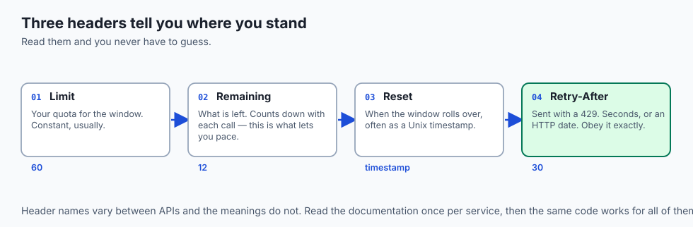
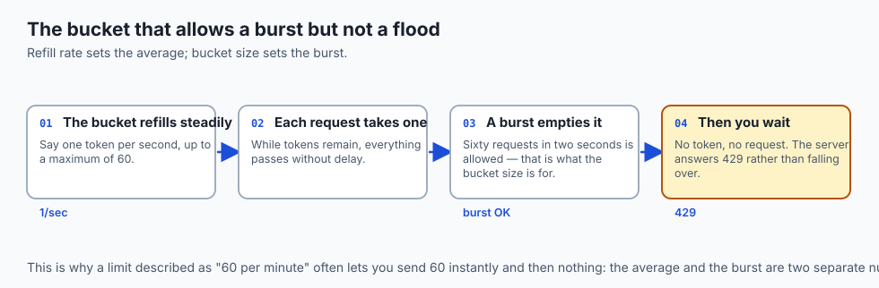
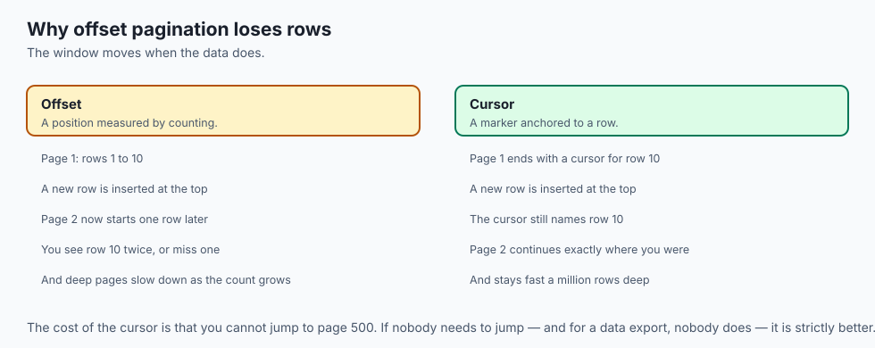
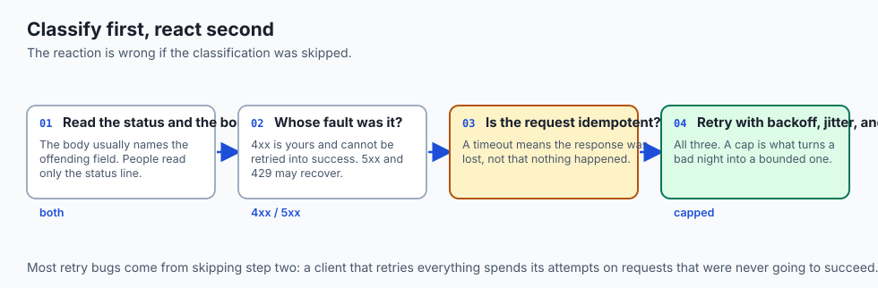
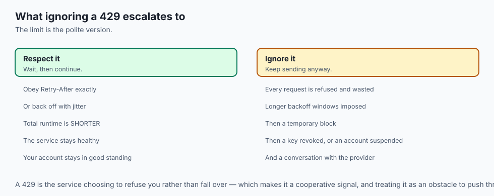
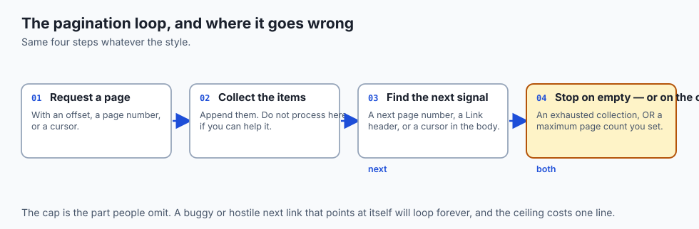
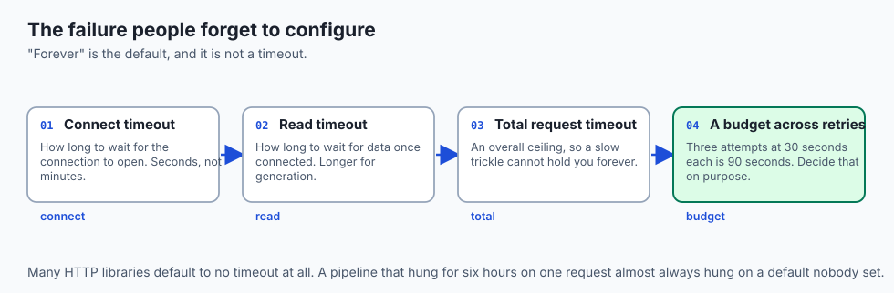
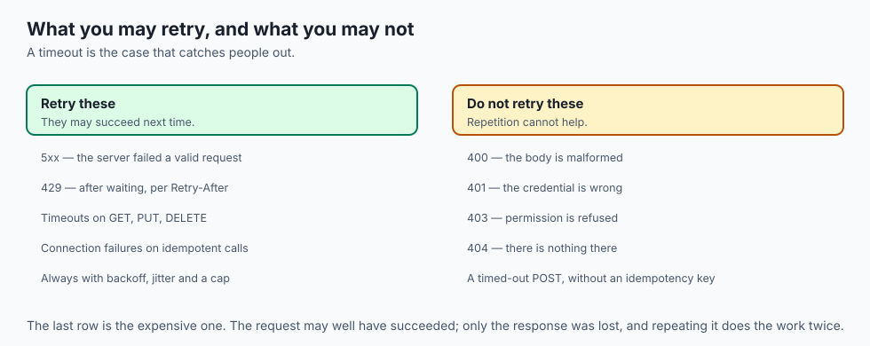
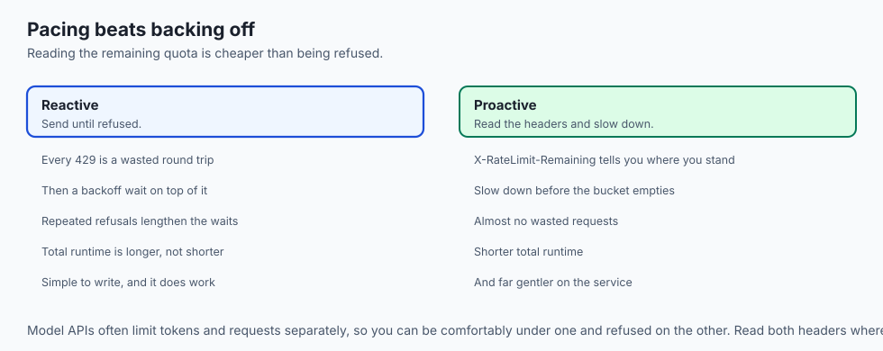

## Why this matters

- **`429` is the error you will meet most on any model API**, and handling it well is
  the difference between a working pipeline and a stalled one.

- **Retrying wrong costs money.** A retried generation is billed twice, and a retry
  storm is billed a thousand times.

- **Pagination is how you get more than a page**, and getting the loop wrong means
  silently missing data rather than failing loudly.

- **Timeouts are the failure people forget.** A request with no timeout can hang a
  pipeline indefinitely.

- **These three together are what separates a script from a client** you can leave
  running.

---

## The idea in plain language



- **A rate limit is a budget over time.** Exceed it and the server refuses you with
  `429` rather than falling over.

- **Backoff is waiting longer after each failure**, so you stop making the problem
  worse.

- **Jitter is randomising that wait**, so a thousand clients do not all retry in the
  same instant.

- **Pagination is the server handing you a slice** plus a way to ask for the next one.
- **Error handling is classifying first**: whose fault was it, and is retrying even
  meaningful?

---

## Historical background

- **Early public APIs had no limits at all**, which worked until one enthusiastic
  script took a service down.

- **Twitter's limits in the late 2000s** were the ones that taught a generation of
  developers what `429` meant.

- **The status code itself arrived in 2012**, formalising what services had been doing
  ad hoc.

- **Exponential backoff is older and comes from networking** — Ethernet's collision
  handling in the 1970s used exactly this idea.

- **Jitter was the addition experience forced.** Backoff alone synchronises clients
  into waves, and the waves are the outage.

- **Cursor pagination became standard as datasets grew**, because offset pagination
  degrades exactly where large collections need it most.

---

## What it is — and what it is not

**Rate limiting is:**

- A budget the server enforces, per account, over a window.
- A protection for the service *and* for you, since it caps a runaway loop.
- Something you should plan around, not fight.

**It is not:**

- **Not a punishment.** `429` is the server staying up rather than falling over.
- **Not the same as `403`.** You are allowed; you are just early.
- **Not consistent between APIs.** Header names, windows and semantics all vary, which
  is why you read the documentation.

- **Not something to defeat with more clients.** Limits are usually per account, and
  spreading requests across keys to evade them is a terms violation.

---

## Why it was created and what problems it solves

- **Protecting the service.** Without limits, one client's bug is everyone's outage.
- **Fair sharing.** A limit is how capacity is divided among many callers.
- **Protecting you.** A runaway loop against a metered API is stopped by the limit
  rather than by your invoice.

- **Predictable capacity.** A provider that knows the maximum rate per account can
  plan hardware for it.

- **Pagination exists for the same reason at the data layer**: returning a million
  rows in one response is a denial of service you asked for politely.

---

## How it works

### Rate limits and the token bucket



- **Picture a bucket of tokens.** Every request removes one; the bucket refills at a
  steady rate, up to a maximum.

- **While tokens remain, requests pass.** Burst faster than the refill and the bucket
  empties, and the next request gets `429`.

- **This allows short bursts** up to the bucket's size, while enforcing a long-run
  average — the refill rate.

```text
X-RateLimit-Limit: 60
X-RateLimit-Remaining: 12
X-RateLimit-Reset: 1752345600
```

- **`Limit`** is your quota for the window, **`Remaining`** is what is left, and
  **`Reset`** is when the window rolls over.

- **If `Retry-After` is present, obey it exactly.** You cannot guess better than the
  server knows.

- **When it is absent, use exponential backoff**: roughly 1 second, then 2, then 4,
  then 8, up to a cap and a maximum number of attempts.

- **Always add jitter.** A thousand clients limited at 12:00:00 will all retry at
  12:00:01 without it, recreating the stampede — the thundering herd.


- **Two exits matter equally**: a retry eventually succeeds, or you hit the cap and
  *stop*, reporting a clear error rather than looping forever.

### Pagination styles



- **Offset and limit** — `?offset=10&limit=5` — means skip ten, give me five.
- **Page number** is the same with friendlier arithmetic, the server computing
  `(page − 1) × limit`.

- **Both let you jump to any page**, which is their appeal.
- **Both share two weaknesses.** Deep pages are slow, because the database still
  counts past every skipped row. And if rows are inserted or deleted between requests,
  the window shifts and you repeat or skip items.

- **Cursor pagination fixes the shifting.** The server hands you an opaque marker
  naming the last row you saw, and you ask for what follows it.

- **Anchored to a row rather than a count**, so insertions at the top do not move your
  place: no repeats, no skips, and fast a million rows deep.

- **Its trade-off is no jumping.** Forward and backward only, never straight to page
  500.


- **The loop is the same shape either way**: request a page, collect items, find the
  next signal, repeat until it is empty.

- **Cap the number of pages.** A buggy or hostile "next" link should not spin forever
  — the same instinct as capping retries.

### Errors: classify, then react



| Outcome | Meaning | Retry? |
| --- | --- | --- |
| `2xx` | It worked | No — you have your answer |
| `4xx` | *Your* request was wrong | No — fix it; retrying is pointless |
| `429` | You are rate-limited | Yes — after waiting |
| `5xx` | The server failed a valid request | Yes — with backoff |
| Timeout / network failure | No response reached you | Only if idempotent |

- **The subtle line runs through retries.** Retry only what is **idempotent**.
- **`GET`, `PUT` and `DELETE` are.** A `POST` that creates something usually is not:
  retry "create order" after a timeout and you may create two, because the first may
  have succeeded even though the response never arrived.

- **When a write is not idempotent**, either do not retry it, or use an idempotency
  key the server uses to recognise the repeat.

- **Always set a timeout**, so a request that never answers becomes a failure you
  handle rather than a hang.

- **Degrade gracefully**: serve a cached copy, show a partial result, or return a
  clear error — rather than crashing, or silently pretending nothing went wrong.

- **Read the error body, not just the status line.** Servers usually explain.

---

## An everyday analogy



A busy telephone helpline.

| The helpline | The API |
| --- | --- |
| "All our advisors are busy" | `429` |
| "Please call back in five minutes" | `Retry-After` |
| Everyone redialling at once at 9am | The thundering herd |
| Waiting a bit longer each time | Exponential backoff |
| Redialling at a random moment | Jitter |
| "Your call is important" and no answer | A timeout you must set |
| Being told your account is closed | A `4xx` — redialling will not help |

- **Redialling immediately makes the queue worse**, for you and for everyone.
- **If they tell you when to call back, call back then.** Guessing is strictly worse.
- **Some refusals are not about the queue at all.** No amount of waiting fixes a wrong
  account number.

---

## Examples in practice




- **A loop that hits `429` on request 61** of a 60-per-minute limit, then works again
  a minute later.

- **A retry storm** where every client backed off identically and hit the server again
  in unison.

- **A pagination loop that missed rows** because new records were inserted while it
  walked offsets.

- **A pipeline that hung for six hours** on one request because no timeout was set.
- **A `4xx` retried a thousand times** by a client that did not classify before
  reacting.

---

## Implications: security, privacy, performance, scalability, and cost



- **Security: rate limits are a defence against brute force**, which is why login
  endpoints have much tighter ones.

- **Evading limits by rotating keys is a terms violation**, and it is detectable.
- **Privacy: `Retry-After` and remaining-quota headers leak usage patterns** to
  anything reading your traffic, though under TLS that is a narrow concern.

- **Performance: respecting limits is faster than fighting them.** A client that
  paces itself finishes sooner than one that gets throttled repeatedly.

- **Scalability: cursor pagination stays fast at depth** where offset pagination
  degrades — which matters exactly when the dataset is large.

- **Cost: an unbounded retry loop against a metered API is an unbounded bill.** Cap
  attempts, always, and set a spend limit on the key as well.

---

## Alternatives: free, open source, and commercial

| Tool | Type | What it gives you |
| --- | --- | --- |
| `tenacity` (Python) | Free, open source | Retries, backoff and jitter as a decorator |
| `urllib3` retries | Free, built in | Retry policy configured on the HTTP adapter |
| Official SDKs | Usually free | Retries and pagination already implemented correctly |
| `p-retry`, `axios-retry` | Free, open source | The same for JavaScript |
| API gateways | Commercial, free tiers | Limits enforced on *your* API, not just consumed |
| Message queues | Free, open source | Natural pacing and back-pressure for bulk work |

- **Use the library rather than writing the loop.** Backoff with jitter, a cap, and
  correct classification is more subtle than it looks, and it is already written.

- **Reach for a queue for bulk work.** Rate limiting a queue's consumers is far
  easier than coordinating many independent scripts.

---

## Comparison with related concepts

| Term | What it actually is |
| --- | --- |
| **Rate limit** | A cap on requests per account per window |
| **Token bucket** | The refilling budget most limiters implement |
| **Backoff** | Waiting longer after each successive failure |
| **Jitter** | Randomising that wait to desynchronise clients |
| **Thundering herd** | Many clients retrying in the same instant |
| **Cursor** | An opaque marker naming the last row you saw |
| **Idempotency key** | A token letting the server recognise a repeat |

---

## When to use it — and when not to



- **Obey `Retry-After` whenever it is present.** It is the server telling you the
  answer.

- **Always cap retries and always add jitter.** Neither is optional in anything you
  leave running.

- **Prefer cursor pagination** when the collection is large or changing.
- **Use offset pagination when you genuinely need to jump** to an arbitrary page, and
  accept its weaknesses.

- **Do not retry `4xx`.** Read the body and fix the request.
- **Do not retry a non-idempotent write** without an idempotency key. A timeout does
  not mean it did not happen.

- **Do not make a request without a timeout.** The default in many libraries is
  "forever", and forever is not a timeout.

---

## The AI connection



- **Model APIs limit both requests and tokens**, often separately, and you can be
  under one while over the other.

- **`429` on a long generation is expensive to mishandle**: a retry pays for the whole
  generation again.

- **Batch endpoints exist precisely to avoid this.** Where a provider offers one, it
  is usually cheaper *and* exempt from the interactive limit.

- **Pace proactively rather than reactively.** Reading the remaining-quota header and
  slowing down beats being refused and backing off.

- **A retry storm against a metered API is the single most expensive bug** in this
  part of the course, and a cap on attempts is the whole fix.

---

## Knowledge check

```yaml
quiz:
  question: "A client retries with exponential backoff but no jitter. After a brief outage, the service comes back and immediately fails again. Why?"
  options:
    - "Every client backed off by the same amount and retried in the same instant, recreating the load"
    - "Exponential backoff waits too long, so requests arrived after the service had already restarted"
    - "The backoff reset the connection pool, forcing every client to reconnect at once"
    - "Without jitter, the retry counter never resets, so clients retried indefinitely"
  answer_index: 0
  explanation: "Deterministic backoff synchronises clients: they all failed at the same moment, all waited the same interval, and all returned together. Jitter exists to break that synchronisation, spreading the retries out so recovery is not immediately undone."
```

---

## Hands-on exercise

Get rate-limited on purpose, then handle it correctly. Worked through fully in the
Day 27 lab directory.

Set `API` to the base URL of any public API that publishes rate-limit headers —
the lab names two that do — then run these against it.

| What you are doing | Command |
| --- | --- |
| See the limit headers | `curl -sI "$API/users" \| grep -i ratelimit` |
| Provoke a `429` | The lab's local server, or a loop against a permissive test endpoint |
| Read `Retry-After` | `curl -sI URL \| grep -i retry-after` |
| Walk pages by offset | `curl -s 'https://jsonplaceholder.typicode.com/posts?_page=1&_limit=5'` |
| Follow a `Link` header | `curl -sI "$API/users?per_page=5" \| grep -i link` |
| Set a timeout | `curl --max-time 5 URL` |
| Classify a response | `curl -s -o /dev/null -w '%{http_code}\n' URL` |

### Expected output

```text
x-ratelimit-limit: 60
x-ratelimit-remaining: 57
x-ratelimit-reset: 1752345600
HTTP/1.1 429 Too Many Requests
retry-after: 30
link: <https://api.example/users?since=46>; rel="next"
```

- **`remaining` counts down** with each call, which is what lets you pace proactively.
- **The `Link` header is cursor pagination** in its standard HTTP form — follow `next`
  rather than constructing it.

### Validate your work

- [ ] You read a real API's rate-limit headers and can say how many calls you have left
- [ ] You triggered a `429` and obeyed its `Retry-After`
- [ ] You implemented backoff with jitter and a maximum attempt count
- [ ] You walked every page of a collection and stopped correctly at the end
- [ ] You set a timeout and handled the resulting failure deliberately
- [ ] `bash tests/run_tests.sh` reports 0 failures

### Troubleshooting

- **Your pagination loop never ends.** The stop condition is wrong. Check for an empty
  page *and* cap the iterations.

- **You cannot provoke a `429`.** Most public APIs are generous. Use the lab's local
  server, which limits aggressively on purpose.

- **`Retry-After` is a date, not a number.** Both forms are legal. Parse both.
- **Your backoff sleeps forever.** You capped the delay but not the attempts. Cap both.

### Common mistakes

- **Retrying without a cap.**
- **Backoff with no jitter.**
- **Retrying a `4xx`**, which cannot succeed.
- **Assuming a timeout means the write did not happen.**
- **Ignoring the error body**, which usually says exactly what was wrong.

---

## Practice assignment

- **Write one client that does all three properly**: paced requests, correct
  classification, and a paginated fetch that collects every item.

- **Prove your retry logic refuses to retry a `4xx`** with a test, not by inspection.
- **Compare offset and cursor pagination** against a changing collection, and
  demonstrate the repeat-or-skip problem on the offset version.

- **Instrument your client** to log every wait and its reason, then read the log after
  a rate-limited run.

---

## Extension challenge

- **Simulate a thundering herd.** Run fifty clients with deterministic backoff against
  a limited endpoint, then rerun with jitter, and plot the request arrivals. The
  difference is the argument.

- **Implement an idempotency key** end to end: generate one per logical operation,
  send it on retries, and prove the server performs the work once.

- **Build a proactive pacer** that reads the remaining-quota header and slows down
  before being refused, then compare its total runtime against a reactive client.

- **Walk a genuinely large collection** — tens of thousands of items — with both
  pagination styles, and time the last page of each.

---

