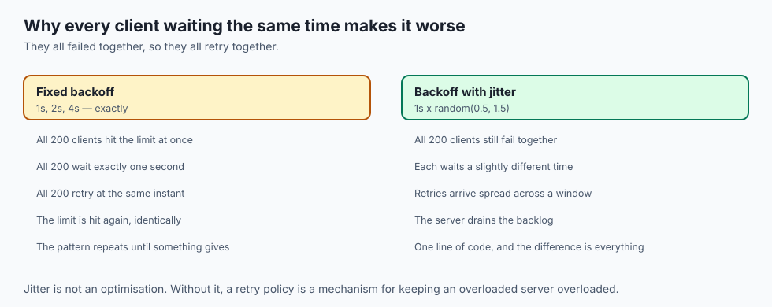
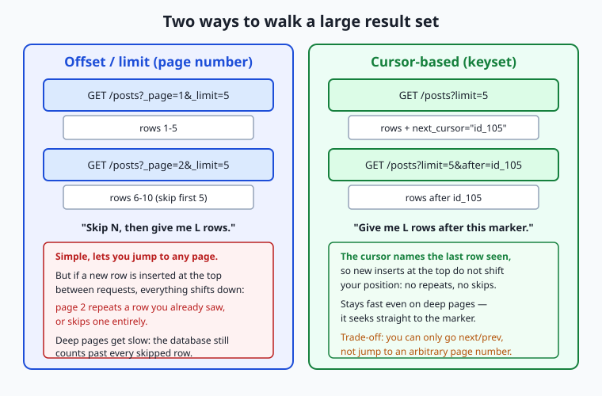

## Why this matters

The moment your code stops making one careful request by hand and starts calling a real API in a loop, the internet stops being polite to you. The server you are calling is shared by thousands of other programs, it has bad days, and it does not trust you. Three things will happen, guaranteed, and each one will break a naive script: the server will tell you to slow down (a rate limit), it will hand back big results in small chunks you have to stitch together (pagination), and sometimes it will simply fail — mid-request, mid-loop, at three in the morning while you are asleep.

This matters to your wallet and your weekend before it matters to anything abstract. A script that ignores rate limits gets your API key throttled or banned, and a banned key can mean a stalled product and an awkward email. A script that reads only the first page of results silently processes 25 of your 4,000 records and reports success — the worst kind of bug, because nothing crashed. A script that retries a failed *payment* request without thinking can charge a customer twice. And a script with no timeout can hang forever, holding a server slot open, while you watch a spinner and your cloud bill ticks upward.

The good news is that robustness is a small, learnable set of habits, and once you own them they transfer to every API you will ever touch. Today you learn to be a good citizen of other people's servers: how to back off when told to slow down, how to walk through paged results without missing or double-counting a single row, and how to tell "I made a mistake" apart from "the server broke" apart from "the network vanished" — and to react correctly to each. This is not glamorous work. It is the difference between a demo and a system.

## The idea in plain language

Every API call is a conversation with a shared, imperfect machine over an unreliable network, and three realities shape that conversation.

First, **rate limits**. A server protects itself by capping how many requests you may make in a window of time — say, 60 per minute. Exceed the cap and it stops answering your actual question and instead replies `429 Too Many Requests`, which means "you are asking too fast; come back later." The polite response is not to hammer the door harder but to wait and try again, waiting a little longer after each rejection. That growing wait is called **exponential backoff**, and adding a dash of randomness to it — **jitter** — keeps a whole crowd of clients from all retrying at the exact same instant.

Second, **pagination**. When a result set is large — every post ever written, every row in a table — the server does not dump all ten thousand items into one giant response. It hands you a **page** at a time (maybe 25 items) and tells you how to ask for the next one. You loop: fetch a page, process it, ask for the next, and stop when the pages run out. There are a few common styles for "ask for the next page," and picking the right one matters.

Third, **error handling**. Requests fail, and *why* they failed decides what you should do. A `4xx` status means the problem is on your side — a bad URL, a missing key, a malformed body — and retrying the identical request will just fail again. A `5xx` status means the server stumbled on a request that was fine, so waiting and retrying often works. And a network failure — no response at all — means you could not even reach the server. Reacting correctly means retrying the things worth retrying, giving up quickly on the things that aren't, and never hanging forever.

Put those three habits into one piece of code that wraps your requests, and you have a **resilient API client**: something you can point at a flaky server, in a loop, and trust to either get the data or fail with a clear message — never to lie, loop forever, or melt down.

## Historical background

Rate limiting is older than the web. Telephone networks in the twentieth century used *admission control* to refuse new calls when trunk lines were saturated, because a switch that accepted every call during a spike would collapse and serve nobody — the same logic a modern API uses when it returns `429`. The underlying mathematics, the **token-bucket** and **leaky-bucket** algorithms, were formalized for telecommunications traffic shaping in the 1980s and remain the standard way to meter requests today.

The HTTP status codes that carry these signals were standardized as the web matured. The core set of response classes — `2xx` success, `4xx` client error, `5xx` server error — was written into the HTTP/1.1 specification in 1997 and refined over the following two decades. The specific code `429 Too Many Requests` did not exist in that original set; it was added later, in 2012, by RFC 6585, precisely because APIs had become common enough that servers needed a standard, unambiguous way to say "slow down" rather than reusing a vaguer code. The companion `Retry-After` header, which lets a server tell you exactly how long to wait, is older still and was carried over from the earliest HTTP header work.

Backoff has its own lineage. When early Ethernet networks had two computers transmit at once, the packets collided and both had to retransmit — and if both simply retried immediately, they collided forever. The 1970s solution, *binary exponential backoff*, had each sender wait a random interval that doubled after each collision, and it is the direct ancestor of the retry logic in every well-behaved API client today. Pagination, meanwhile, is a much older idea wearing new clothes: databases have returned results in bounded batches for decades, because no system wants to build a million-row answer in memory at once. The web merely inherited the discipline and gave it URLs.

## What it is — and what it is not

Rate limiting is a server-side control that caps the *rate* of your requests, expressed as a quota over a time window; `429` is how the server announces you have hit that cap. It is not a punishment or a sign you did something wrong — it is ordinary flow control, and the correct reaction is mechanical, not apologetic: wait, then retry.

Pagination is the practice of splitting a large result set into ordered, individually requestable chunks. It is *not* a way to get less data — you still get everything, one page at a time — and it is not optional to handle: a paginated endpoint that you treat as un-paginated gives you a truncated answer that looks complete.

Error handling here means classifying a failed request and choosing a response, and the crucial thing it is *not* is a single blanket "retry on any error." Retrying is a tool with a narrow safe zone. Retrying a `5xx` or a timeout is usually right; retrying a `4xx` is pointless; and retrying a non-**idempotent** write — one where doing it twice differs from doing it once, like "create an order" — can cause real damage. A resilient client is precise about which failures it retries, how many times, and with what delay. It is emphatically not a loop that says "keep trying until it works," because some things never will, and a loop with no cap is a bug that looks like diligence.

| Common misconception | The reality |
| --- | --- |
| "A 429 means my key is banned." | It means you are over the rate limit right now; back off and it clears. A ban is usually a 403 and does not clear by waiting. |
| "Retrying any failed request is safer." | Retrying a 4xx just fails again; retrying a non-idempotent write can double-charge or duplicate data. |
| "The first page of results is all of them." | A paginated endpoint returns a chunk; without following the pages you silently drop the rest. |
| "Backoff means waiting a fixed few seconds." | Effective backoff *grows* the wait each attempt and adds jitter, so a crowd of clients does not stampede in sync. |
| "If the request hangs, it will eventually return." | Without a timeout it can hang indefinitely; a resilient client sets a deadline and treats the overrun as a failure. |

## Why it was created and what problems it solves

These three mechanisms exist because a public API is a commons, and commons need rules or they collapse.

Rate limits solve the problem of one client — malicious, buggy, or just enthusiastic — consuming resources that belong to everyone. Without a cap, a single runaway `while` loop could saturate a server and deny service to every other user; the `429` response and the quota behind it are how the server stays fair and stays up. They also solve a business problem: metered access is how many APIs separate a free tier from a paid one.

Pagination solves a resource problem on both ends of the wire. Assembling and transmitting a million-row result in one response would exhaust the server's memory, saturate the network, and force your program to hold the entire thing before it could start work. Paging keeps every response small and predictable, lets the server stream work in bounded batches, and lets your client begin processing page one while page two is still being fetched.

Error handling as a discipline exists because the network is not reliable and never will be — this is a foundational assumption of distributed systems, not a defect to be fixed. Packets get lost, servers restart mid-request, load balancers hiccup, DNS blips. A program that assumes every call succeeds is correct only on a good day; a program that classifies failures and responds appropriately is correct on the bad days too, which are the ones that matter. The problem being solved is trust: how do you build something dependable out of parts that individually are not?

## How it works



Let's walk through each mechanism concretely, then combine them.

### Rate limits and the token bucket

Imagine a bucket that holds tokens. Every request you make removes one token; the bucket refills at a steady rate — say one token per second, up to a maximum of 60. As long as tokens are available, your requests sail through. Send a burst faster than the refill rate and the bucket empties; the next request finds no token and is rejected with `429`. This **token bucket** is the mental model behind most rate limiters: it allows short bursts (up to the bucket's size) while enforcing a long-run average (the refill rate).

Good APIs tell you where you stand using response headers. The exact names vary, but a common convention looks like this:

```text
HTTP/1.1 200 OK
X-RateLimit-Limit: 60
X-RateLimit-Remaining: 12
X-RateLimit-Reset: 1752345600
```

`Limit` is your quota for the window, `Remaining` is how many tokens are left, and `Reset` is when the window rolls over (often a Unix timestamp). When you overshoot, the server responds `429`, and a well-behaved server adds a `Retry-After` header telling you exactly how long to wait — either a number of seconds (`Retry-After: 30`) or an HTTP date. If `Retry-After` is present, obey it exactly; you cannot guess better than the server knows.

When it is absent, you fall back to **exponential backoff**: wait a base delay, and double it after each failed attempt — roughly 1 second, then 2, then 4, then 8 — up to a cap, and up to a maximum number of attempts, after which you give up. Crucially, you add **jitter**: a small random amount on each wait. Without jitter, a thousand clients that were all rate-limited at 12:00:00 will all retry at exactly 12:00:01, recreating the stampede that caused the limit — the "thundering herd." A little randomness spreads them out.



Read the flow left to right: you send a request, the server rejects it with `429`, you wait a growing (and jittered) interval, and you retry. Each rejection doubles the wait, up to a ceiling. Two exits matter equally: a retry eventually succeeds and you return the response, or you hit the retry cap and you *stop* — reporting a clear error rather than looping forever.

### Pagination styles

A paginated endpoint returns a slice plus a way to ask for the next slice. Three styles dominate.

**Offset / limit** asks the server to skip `N` rows and return the next `L`: `GET /posts?offset=10&limit=5` means "skip 10, give me 5." **Page number** is the same idea with friendlier arithmetic — `GET /posts?_page=3&_limit=5` — where the server computes the offset for you as `(page − 1) × limit`. Both let you jump to any page, which is their appeal. Both share two weaknesses: on very deep pages the database still has to count past every skipped row, so it slows down; and if rows are inserted or deleted between your requests, the window shifts under you and you can repeat or skip an item.

**Cursor-based** (also called keyset) pagination fixes the shifting problem. Instead of a position, the server hands you a **cursor** — an opaque marker naming the last row you saw — and you ask for "the next `L` rows after this cursor." Because the cursor is anchored to a specific row rather than a count, new insertions at the top do not move your place: no repeats, no skips, and it stays fast even a million rows deep because the database seeks straight to the marker. The trade-off is that you can only step forward and backward, not jump to page 500 directly.



Whatever the style, the loop is the same shape: request a page, collect its items, find the "next" signal (a next-page number, a `next` link, or a cursor), and repeat until that signal is empty. You must also decide when to stop, and a robust loop caps the number of pages so a buggy or hostile "next" link cannot spin forever — the same "always have a ceiling" instinct as backoff.

### Errors: classify, then react

Every response, or its absence, falls into one of four buckets, and the bucket dictates the reaction.

| Outcome | Meaning | Retry? |
| --- | --- | --- |
| `2xx` success | The request worked | No — you have your answer |
| `4xx` client error | *Your* request was wrong (bad URL, auth, body) | No — fix the request; retrying is pointless |
| `429` (special 4xx) | You are rate-limited | Yes — but only after waiting (Retry-After or backoff) |
| `5xx` server error | The server failed a valid request | Yes — with backoff; it may recover |
| Network failure / timeout | No response reached you at all | Yes if the request is idempotent; with backoff |

The subtle line runs through retries. You may retry only what is **idempotent** — safe to repeat because doing it twice has the same effect as doing it once. Reading data (`GET`) is idempotent; so are `PUT` (set to this value) and `DELETE` (ensure this is gone). A `POST` that creates a new resource usually is *not*: retry "create order" after a timeout and you may create two orders, because the first may have succeeded even though the response never reached you. When a write is not idempotent, either do not retry it, or use an *idempotency key* — a unique token the server uses to recognize and de-duplicate a repeated request.

Two more habits complete the picture. Always set a **timeout**, so a request that never answers becomes a failure you can handle rather than a hang that freezes your program. And practice **graceful degradation**: when the data genuinely cannot be fetched, do something sensible — serve a cached copy, show a partial result, return a clear error to the user — rather than crashing or, worse, silently pretending nothing is wrong. Reading the error *body*, not just the status line, often tells you exactly what went wrong; servers frequently return a JSON explanation alongside the code.

## An everyday analogy

Picture a tiny, wildly popular neighborhood café with one barista and a line out the door. This café is the API server; you are a customer placing orders; the counter is the network between you.

When the café is slammed, the barista holds up a hand: "We're at capacity — come back in a minute." That is a `429` with a `Retry-After`. Storming the counter and repeating your order faster does nothing but annoy everyone; the graceful move is to step away and return later. And if you are turned away again, you wait a little longer this time before trying — your personal exponential backoff. Here is the subtle part: if the barista tells the *entire* queue "come back in one minute," and everyone obediently returns at exactly the same second, the counter is instantly swamped again. So each sensible customer waits *about* a minute — one waits fifty seconds, another seventy — and the crowd arrives spread out. That sprinkle of randomness is jitter, and it is the difference between an orderly return and a second stampede.

The menu handles pagination. The specials board only has room for five items at a time. To see more you either say "show me the next five" (page number), or "show me the five after the almond croissant I just read" (a cursor pointing at your last-seen item). The cursor version is sturdier: if the café adds a new special to the top of the board while you're reading, "the five after the almond croissant" still lands exactly where you left off, whereas "the next five by position" might show you the croissant again or skip past it.

Errors sort themselves the same way. If you order something not on the menu, that's your mistake — a `4xx` — and ordering it again, louder, won't help. If the espresso machine explodes mid-order, that's the café's problem — a `5xx` — and it's perfectly reasonable to wait a moment and ask again once they've mopped up. If you can't even find the café because the street is closed, that's a network failure. And you won't stand at the counter forever: after a reasonable wait with no service, you leave — that's your timeout. If the café is shut entirely, you don't stand there stunned; you pull out yesterday's photo of the menu and make do. That's graceful degradation.

## Examples in practice

Here is the shape of a resilient request in plain shell, using `curl` and reading the numeric status code, so you can see every decision laid bare:

```bash
attempt=1
max_attempts=5
delay=1
while [ "$attempt" -le "$max_attempts" ]; do
  code=$(curl -s -o /tmp/body.json -w '%{http_code}' \
    --max-time 10 "https://api.example.test/posts?_page=1&_limit=5")

  case "$code" in
    2*) echo "success on attempt $attempt"; break ;;
    429|5*)
      jitter=$(( RANDOM % 1000 ))          # 0-999 milliseconds of randomness
      echo "got $code; waiting ~${delay}s then retrying"
      sleep "$delay.$jitter"
      delay=$(( delay * 2 ))               # exponential growth
      attempt=$(( attempt + 1 )) ;;
    4*) echo "client error $code — not retrying, fix the request"; break ;;
    *)  echo "no response (timeout/network) — retrying"; sleep "$delay"; attempt=$(( attempt + 1 )) ;;
  esac
done
```

Notice what makes this *resilient* rather than merely repetitive. It has a hard cap (`max_attempts`), so it cannot loop forever. It grows the delay (`delay = delay * 2`) and jitters it, so a fleet of these scripts would not synchronize. It retries `429` and `5xx` and timeouts, but explicitly refuses to retry a `4xx`. And it sets `--max-time 10`, so a dead connection becomes a handled outcome instead of a hang.

Now the pagination half, walking two pages and collecting the results:

```bash
all='[]'
for page in 1 2; do
  body=$(curl -s --max-time 10 \
    "https://api.example.test/posts?_page=${page}&_limit=5")
  count=$(printf '%s' "$body" | python3 -c 'import sys,json; print(len(json.load(sys.stdin)))')
  echo "page ${page}: ${count} items"
done
```

Each iteration fetches one page and counts its items; a real collector appends every page's items into one list and stops when a page comes back empty. The lab you will run after this lesson does exactly this against a live public test API, so the numbers become real.

A worked backoff calculation, so the growth is concrete. Start with a base delay of 1 second and double each attempt, capped at 8 seconds, over five attempts: the waits are **1, 2, 4, 8, 8** seconds — a total of at most 23 seconds of waiting before you give up. Add jitter and each of those becomes a *range* (roughly 1.0–1.9s, 2.0–2.9s, and so on), which is what keeps synchronized clients from colliding. Change the base to 0.5s and the cap to 30s and you have tuned the same formula for a different API's temperament — the structure never changes, only the two numbers.

## Implications: security, privacy, performance, scalability, and cost

### Security

Rate limiting is a frontline security control, not just a fairness tool. It is what blunts brute-force password guessing, credential-stuffing attacks, and scraping: an attacker who can try a million passwords per second is dangerous, while one throttled to five per minute is mostly harmless. From your side of the wire, honoring rate limits and identifying your client honestly (a descriptive `User-Agent`) keeps you on the right side of a server's abuse defenses. Retry logic has a security dimension too: an aggressive, un-jittered retry storm is indistinguishable from a denial-of-service attack, and can get your IP or key blocked.

### Privacy

Error bodies deserve a privacy note. Servers sometimes include sensitive details in error responses — internal paths, user identifiers, stack traces — so if you log every error body verbatim, you may be copying other people's data or your own secrets into log files that are less protected than the API. Log what you need to debug, redact what you don't, and never paste a raw error dump containing tokens into a public issue. Rate-limit headers can also leak usage patterns; treat the whole exchange as something an observer should not learn much from.

### Performance

The counterintuitive truth is that backing off *improves* aggregate performance. A client that retries instantly and relentlessly against an overloaded server adds load exactly when the server can least afford it, deepening the outage for everyone including itself; a client that backs off gives the server room to recover, and gets its answer sooner. Pagination performance hinges on style: offset pagination degrades on deep pages because the database counts past every skipped row, while cursor pagination stays flat. Timeouts protect performance too — one hung request should never be allowed to hold a connection and a thread hostage.

### Scalability

These patterns are what let a system scale from one caller to millions. A server can only survive heavy traffic if clients cooperate by respecting limits and backing off; the `429`/backoff contract is a distributed agreement that keeps the whole system stable under load. On the client side, resilient request handling is what lets you run many workers in parallel without them collectively DDoSing your dependency. Jitter is specifically a scalability mechanism: it decorrelates a large population of clients so their retries spread out instead of spiking.

### Cost

Every one of these habits maps to money. Wasted retries against a metered API burn quota you may be paying for; unbounded retries can run up a bill with nothing to show for it. A hung request with no timeout holds a compute slot open and bills you for idle waiting. Fetching every page when you only needed the first wastes bandwidth and time. And the cost of *getting it wrong* — a double-charged customer from a retried non-idempotent write, a banned key that halts a product — dwarfs the modest effort of doing it right. Robustness is one of the cheapest investments in software.

## Alternatives: free, open source, and commercial

You rarely have to write retry and pagination logic entirely by hand; mature tools exist at every level, from a command-line flag to a full client library. The right choice depends on how much control you need.

| Tool / approach | Type | What it gives you | Cost |
| --- | --- | --- | --- |
| `curl --retry` / `--retry-all-errors` / `--max-time` | Free CLI flags | Built-in retries with backoff and timeouts, no code | Free (ships with your OS) |
| A hand-written backoff loop (today's lab) | Free, from scratch | Total control and full understanding of every decision | Free |
| A language's HTTP client with retry config (e.g. request "sessions" with retry adapters) | Open source libraries | Declarative retries, backoff, and status-code rules | Free |
| Purpose-built resilience libraries (circuit breakers, backoff helpers) | Open source | Battle-tested backoff, jitter, and failure policies | Free |
| API providers' official SDKs | Vendor-supplied | Retries, pagination iterators, and rate-limit handling tuned to that API | Usually free; the API behind it may be paid |
| API gateways / managed platforms | Commercial | Server-side rate limiting, quotas, and retry policies as configuration | Paid (subscription/usage) |

`curl`'s flags are the fastest way to add resilience to a script: `curl --retry 5 --retry-all-errors --max-time 10 URL` retries up to five times with its own increasing delay, treating connection failures and HTTP errors as retryable, while capping each attempt at ten seconds. When you graduate to a real programming language, its HTTP client almost certainly offers the same as configuration — you declare "retry these status codes, this many times, with this backoff," and pagination iterators that yield items across pages so you never write the loop yourself. Reach for a from-scratch loop, like today's, when you want to *understand* the machinery or when a quirky API needs custom logic; reach for the library when you want that machinery to be someone else's tested responsibility. Start free — the built-in tools cover the overwhelming majority of needs — and pay only for managed gateways when you are the one running the server and need to *impose* limits rather than respect them.

## Comparison with related concepts

| Concept A | Concept B | Key difference |
| --- | --- | --- |
| Rate limiting | Throttling | Rate limiting rejects requests over a quota (`429`); throttling slows them down (queues/delays) rather than refusing outright |
| `429` Too Many Requests | `503` Service Unavailable | `429` means *you* exceeded your quota; `503` means the *server* is overloaded or down for everyone — both may carry `Retry-After` |
| Offset pagination | Cursor pagination | Offset skips by count and can shift under inserts; a cursor anchors to a row, so it stays stable and fast on deep pages |
| Retry | Fallback | A retry re-attempts the same request hoping for success; a fallback abandons it and uses an alternative (cache, default, partial result) |
| Idempotent request | Non-idempotent request | Idempotent requests are safe to repeat (same effect once or twice); repeating a non-idempotent write can duplicate data or charges |
| Exponential backoff | Fixed-interval retry | Backoff grows the wait each attempt (and jitters it); a fixed interval retries on a constant clock and risks synchronized stampedes |

## When to use it — and when not to

Use the full kit — backoff, pagination handling, careful error classification, timeouts — any time your code calls a network API in anything other than a one-off, throwaway way. If it runs in a loop, runs unattended, runs in production, or calls an API you are paying for, it needs to handle limits and failures, full stop. Use cursor pagination when data changes under you or when you must page deep into a large set; use offset or page numbers when the data is stable and you value the ability to jump to an arbitrary page. Reach for a `Retry-After`-aware backoff whenever a server might tell you to slow down — which is to say, whenever you call a real API at scale.

Know when to leave the machinery out, too. A single interactive command you type once at a terminal does not need a five-attempt backoff loop; the ceremony would obscure a trivial task. Do not retry a non-idempotent write blindly — if you cannot make it safe with an idempotency key, it is often better to fail loudly and let a human decide than to risk a duplicate. Do not paginate an endpoint that returns a small, bounded result in one response; the loop is pure overhead. And resist the temptation to set retry counts and timeouts to enormous values "just in case" — an over-patient client hides real failures and wastes resources. The professional instinct is to match the robustness to the stakes: minimal for a throwaway, thorough for anything that runs while you sleep.

## The AI connection

Model APIs are among the most aggressively rate-limited services you will ever
call. Providers meter requests *and* tokens per minute, and a bursty feature that
ignores `429` is throttled within seconds of going live.

A production feature built on a model API is, underneath, exactly the resilient
client from today's lesson. It retries `429`s with exponential backoff and jitter,
sets timeouts so a slow generation cannot hang the application, degrades
gracefully when the provider is down — a cached answer, a shorter response, an
honest "try again shortly" — and paginates when retrieving large sets of documents
or embeddings.

There is no separate, fancier reliability engineering for these systems. It is
this. Master rate limits, pagination and error handling now and you have already
built the backbone every dependable API-driven feature stands on.

---

## Knowledge check

Try these from memory before looking back:

1. A server responds `429` with `Retry-After: 20`. What exactly should your client do, and what should it *not* do?
2. Explain why jitter is added to exponential backoff. What specifically goes wrong without it when many clients are involved?
3. You call `GET /posts?_page=1&_limit=25` and process the 25 results. Why might this be a serious bug, and how would you fix it?
4. Sort these into "retry" and "do not retry," and say why: `404 Not Found`, `503 Service Unavailable`, a connection timeout on a `GET`, a timeout on a `POST /charge`.
5. In one or two sentences, explain the difference between offset and cursor pagination and name one situation where cursor pagination is clearly the better choice.

## Hands-on exercise

Time to build the real thing. In the Day 27 lab you will write and run a small **resilient API client** in shell against live public test servers — no account or key required. It does three things: it calls an endpoint that always returns `429`, backing off with growing delays until it gives up gracefully (reading `Retry-After` when present); it reads a deliberate `500` and a deliberate `404` and decides correctly which to retry; and it paginates over a public posts API with `_page` and `_limit`, collecting results across two pages.

Open a terminal and try the core backoff idea directly. This asks a public test server for a `429` and shows you the status it hands back:

```bash
curl -s -o /dev/null -w 'status: %{http_code}\n' --max-time 15 \
  "https://httpbin.org/status/429"
```

Now see `curl`'s own built-in retry-and-backoff in action against a server error, capping each attempt so it can never hang:

```bash
curl -s -o /dev/null -w 'final status: %{http_code}\n' \
  --retry 4 --retry-all-errors --max-time 15 \
  "https://httpbin.org/status/500"
```

And walk one page of a real paginated API, counting the items it returns:

```bash
curl -s --max-time 15 "https://jsonplaceholder.typicode.com/posts?_page=1&_limit=5" \
  | python3 -c 'import sys,json; print("items on page 1:", len(json.load(sys.stdin)))'
```

The lab wraps these ideas into one script with a proper backoff function, a status-classifier, and a pagination collector, plus a starter version with four numbered exercises for you to complete.

### Expected output

A typical run of the three commands above, online (your exact timing will differ):

```text
$ curl -s -o /dev/null -w 'status: %{http_code}\n' --max-time 15 "https://httpbin.org/status/429"
status: 429

$ curl -s -o /dev/null -w 'final status: %{http_code}\n' --retry 4 --retry-all-errors --max-time 15 "https://httpbin.org/status/500"
final status: 500

$ curl -s --max-time 15 "https://jsonplaceholder.typicode.com/posts?_page=1&_limit=5" | python3 -c 'import sys,json; print("items on page 1:", len(json.load(sys.stdin)))'
items on page 1: 5
```

The first command shows the raw `429` the rate-limit endpoint always returns. The second shows `curl` retrying a `500` four times with its own increasing delay and then reporting the final status it still got — proof that even built-in retries *terminate* rather than loop forever. The third confirms the posts API returns exactly five items for a five-item page. If you are offline, each command prints a connection error instead; that is expected, and the lab's script degrades to a clear offline message rather than failing.

### Validate your work

You are done when you can check every box:

- [ ] You can make a request that returns `429` and read the status code from the response.
- [ ] You can explain what `Retry-After` means and what your client does when it is present versus absent.
- [ ] You ran a retry that is guaranteed to stop (a capped number of attempts) and watched it terminate.
- [ ] You classified a `404` as "do not retry" and a `500` as "retry," and can say why.
- [ ] You fetched two pages with `_page`/`_limit` and summed the item counts across them.
- [ ] You can state one reason cursor pagination is sturdier than offset pagination.

### Troubleshooting

- **`command not found: python3`.** The pagination counter uses `python3` to measure the JSON array; install it (macOS: `brew install python`; Debian/Ubuntu: `sudo apt install python3`), or count items another way. The lab's requirements file lists this.
- **The `429` or `500` command sometimes returns a different `5xx` (like `502` or `503`).** Public test servers get busy and their own gateway may fail — which is itself the exact situation your client must survive. A `5xx` in place of the one you asked for teaches the same lesson; re-run in a moment.
- **A command hangs.** It should not: every one here uses `--max-time`. If you removed that flag, add it back — a timeout is what turns a hang into a handled failure.
- **`curl: (6) Could not resolve host`.** You are offline or behind a restrictive network. That is a network failure, not a bug; connect and re-run, and note that this is precisely the case your resilient client is built to report gracefully.

### Common mistakes

- **Retrying without a cap.** "Keep trying until it works" becomes an infinite loop the moment the failure is permanent (a `404`, a bad key). Always bound the attempts.
- **Retrying a `4xx`.** A client error means *your* request is wrong; the identical retry fails identically. Fix the request instead.
- **Forgetting jitter.** Fixed backoff synchronizes a crowd of clients into a repeating stampede. Add a small random component to every wait.
- **Reading only the first page.** Processing page one and reporting success silently drops the rest of a paginated result — a bug that never crashes and so is rarely noticed until the numbers are wrong.

## Practice assignment

Open the resilience worksheet in the starter directory of the Day 27 lab and complete the four numbered exercises in `starter/resilient_client.sh`, then run it. Record three real numbers on the worksheet: how many retries your backoff function made before it gave up (it must give up, not loop forever), the status code the `/status/429` endpoint returned, and how many total posts you collected across the two pages. Then write one short paragraph (4–6 sentences) explaining, in your own words, why your backoff loop is guaranteed to terminate and what would go wrong if you removed the attempt cap. Keep the worksheet; it is the evidence that your client is genuinely resilient and not merely optimistic.

## Extension challenge

Go one step further and make your client honor a server's explicit instruction. Using `https://httpbin.org/response-headers?Retry-After=3`, fetch the response headers with `curl -sI` and extract the `Retry-After` value, then modify your backoff function so that *when a `Retry-After` header is present it waits exactly that many seconds instead of using its own doubling delay* — falling back to exponential backoff only when the header is absent. Confirm the change by logging which delay source each wait used ("obeying Retry-After: 3s" versus "backoff: ~4s"). Then answer in two or three sentences: why is obeying `Retry-After` strictly better than guessing with backoff, and what should your client do if a server sends an absurd value like `Retry-After: 3600`? You have just implemented the single most important courtesy a rate-limited client can offer — doing exactly what the server asked, no more and no less.
