## Why this matters

- **This is the week assembling itself.** HTTP, REST, JSON, authentication, rate
  limits and error handling become one working thing today.
- **Reading documentation quickly is the transferable skill**, and it is the one you
  will use on every API for the rest of your career.
- **A one-liner that works is worth more than a program that nearly does**, and
  knowing when to stop being a one-liner is judgement worth naming.
- **Every model API is consumed this way first.** You run the provider's `curl`
  example before you write a line of code.
- **Tomorrow starts version control**, and this is the last day of the API week.

---

## The idea in plain language

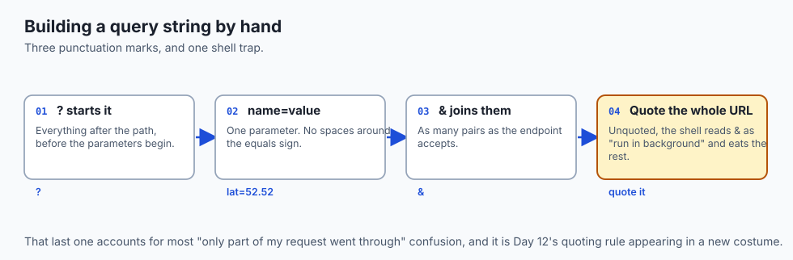

- **Building an API client is always the same six stages**, whatever the service.
- **Read the docs, build the request, send it, parse the response, handle errors,
  present the result.**
- **`curl` sends; `jq` parses.** Two tools, both ubiquitous, both composable.
- **Each stage can fail in its own way**, which is why error handling is a stage
  rather than an afterthought.
- **You are not expected to memorise an API.** You are expected to read its contract
  and hold it to that contract.

---

## Historical background

- **The first web APIs were consumed by hand**, with `curl` and a text editor, because
  no client libraries existed yet.
- **That remains the fastest way to understand one**, which is why documentation still
  opens with a `curl` example three decades on.
- **`jq` arrived in 2012**, and made JSON tractable at the command line for the first
  time — before it, people reached for Python for even trivial extraction.
- **The shell pipeline from Day 10 turned out to fit APIs perfectly**: fetch,
  transform, filter, present, each stage doing one job.
- **Client libraries came later and did not replace this.** They are what you build
  with; the command line is what you debug with.

---

## What it is — and what it is not

**It is:**

- A pipeline: request, response, extraction, presentation.
- The fastest way to learn an unfamiliar API.
- A genuine deliverable — plenty of production automation is exactly this.

**It is not:**

- **Not a replacement for a program.** Once you need branching, state or tests, move
  to a language.
- **Not fragile by nature**, but it becomes fragile without error handling. A
  pipeline that assumes success produces confident nonsense.
- **Not just for exploring.** A `curl` and `jq` script under `cron` is a perfectly
  respectable production system for the right job.
- **Not the same as scraping.** You are consuming a published contract, not guessing
  at a layout.

---

## Why it was created and what problems it solves

- **Immediate feedback.** You see the real response in one command, before committing
  to any design.
- **No project setup.** No virtual environment, no dependencies, no scaffolding
  between you and the answer.
- **A reproducible reference.** The command that worked is the command you paste into
  a bug report or a colleague's terminal.
- **Composition.** Every tool from Day 10 applies, because the response is text.
- **Portability.** `curl` exists on every machine you will ever connect to,
  including ones where you cannot install anything.

---

## How it works

### The six-stage pipeline

1. **Read the docs.** Find the endpoint, the required and optional parameters, the
   authentication rule, and the shape of the response.
2. **Build the request.** Assemble the URL and its query string — `?` to start, `&`
   between `name=value` pairs.
3. **Send it.** One command. `curl` fetches and prints the raw response.
4. **Parse the JSON.** Pull out the fields you want with `jq` or `python3`.
5. **Handle errors.** Check the request actually succeeded and the field was present,
   so a blip or a typo produces a clear message rather than garbage.
6. **Present the result.** A clean, readable line.


- **Each stage feeds the next, and each fails differently.** That is why stage five is
  not optional: skip it and the first flaky moment turns a tidy client into a wall of
  confusing output.

### Reading the docs is the core skill

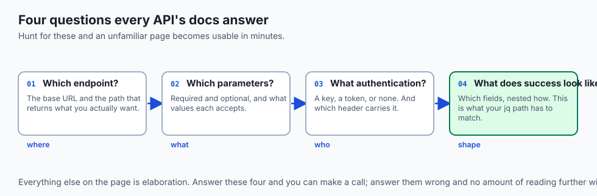

Every API's documentation answers the same four questions:

- **What is the base URL and the endpoint?**
- **What parameters does it take**, which are required, and what values are allowed?
- **What authentication does it need?**
- **What does a successful response look like** — which fields, nested how?

- **Good docs show an example request and response side by side.**
- **Copy the example, confirm it works, then change one piece at a time.** That
  discipline is what makes an unfamiliar API usable in minutes.

### From curl to jq to a report

```bash
curl -s "https://api.open-meteo.com/v1/forecast?latitude=52.52&longitude=13.41&current=temperature_2m,wind_speed_10m"
```

- **`-s` is silent** — it hides the progress meter so only the JSON prints.

```json
{
  "current_units": { "temperature_2m": "°C", "wind_speed_10m": "km/h" },
  "current": { "time": "2026-07-12T12:30", "temperature_2m": 29.5, "wind_speed_10m": 16.9 }
}
```

```bash
curl -s "https://api.open-meteo.com/v1/forecast?latitude=52.52&longitude=13.41&current=temperature_2m,wind_speed_10m" \
  | jq '.current.temperature_2m'
```

- **That prints `29.5`.**
- **The path reads left to right**: enter the `current` object, take its
  `temperature_2m` field — exactly the nesting you saw in the response.
- **Swap in `.current.wind_speed_10m`** and you have the wind. Two fields, two paths,
  and you have what you came for.

### The two tools, and their alternatives

- **For sending, `curl` is the universal default**: everywhere, scriptable, verbose
  when you need it.
- **`httpie` is friendlier for exploring** — colour output and simpler syntax — at the
  cost of an extra install.
- **When a one-liner strains, move to a language.** Python's `requests` or
  JavaScript's `fetch` turn the request into a few readable lines you can wrap in
  logic.
- **For parsing, `jq` handles JSON beautifully at the command line.**
- **`python3 -m json.tool` is built in** and pretty-prints without any install, and a
  short script gives you a whole language to reshape the data.

---

## An everyday analogy

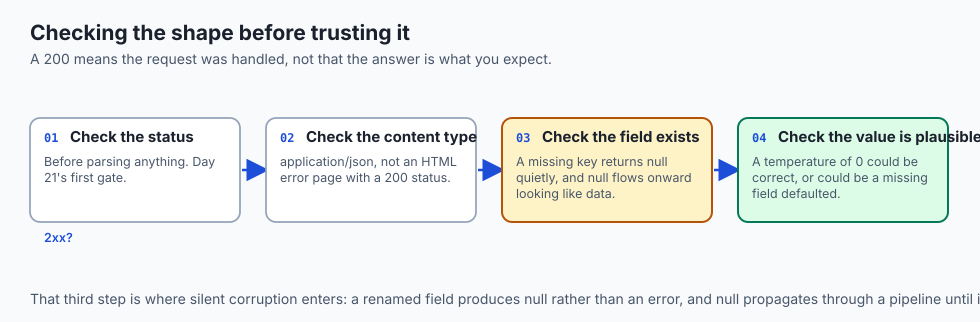

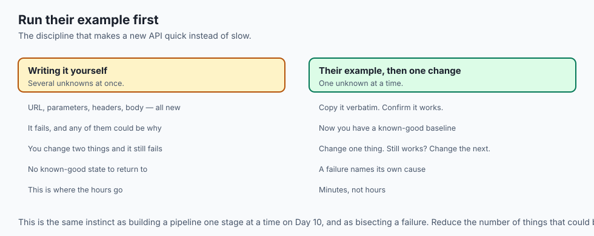

Cooking from an unfamiliar recipe.

| The kitchen | The client |
| --- | --- |
| Reading the recipe first | Reading the docs |
| Checking you have the ingredients | Required parameters |
| Following it exactly, once | Running their example verbatim |
| Then adjusting one thing | Changing one parameter at a time |
| Tasting as you go | Checking the response at each stage |
| Plating it | Presenting the result |

- **Nobody improvises a recipe they have never cooked.** Run their example first,
  unchanged, and confirm it works.
- **Change one thing at a time**, or you will not know which change broke it.

---

## Examples in practice

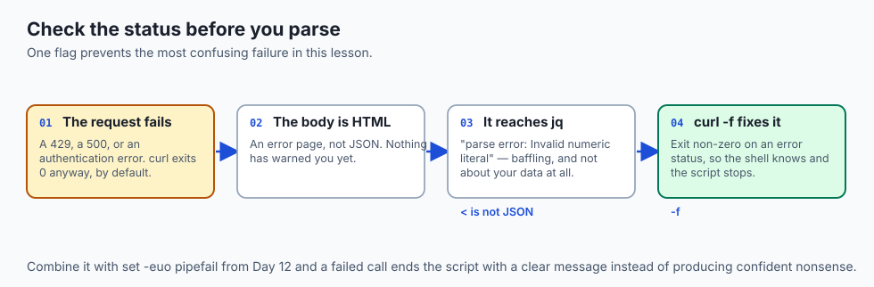

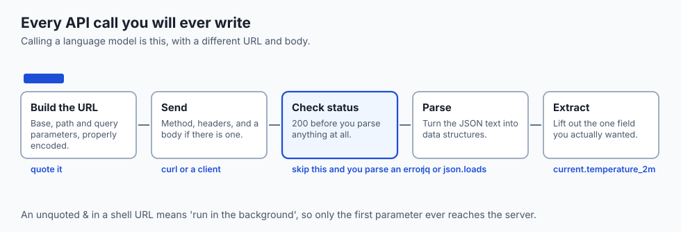

- **A weather line in your shell prompt**, refreshed by a one-liner.
- **A daily digest script** that fetches, extracts three fields, and mails them —
  scheduled with Day 14's cron.
- **A `jq` path that returns `null`** because the field is nested one level deeper
  than you assumed.
- **An empty response that was actually a `429`**, because nobody checked the status
  before parsing.
- **A pipeline that broke when a value contained a space**, because a variable was
  unquoted — Day 12's rule, again.

---

## Implications: security, privacy, performance, scalability, and cost

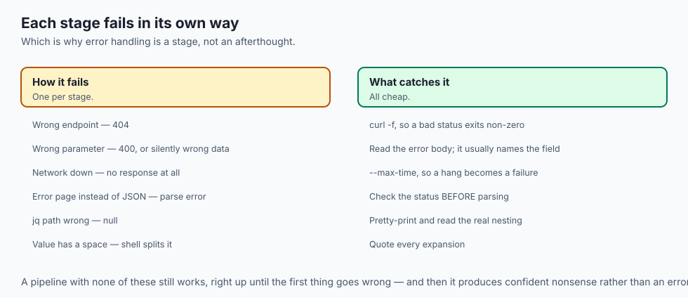

- **Security: never put a key in the URL.** Day 25's rule, and the command line makes
  it especially tempting.
- **Your shell history records every command**, including any credential you typed
  inline. Read them from the environment.
- **Privacy: responses may contain personal data** you are about to write to a file or
  a log. Decide what you keep.
- **Performance: each `curl` is a fresh connection**, paying the Day 15 handshake
  every time. For many calls, that is the argument for moving into a program with a
  session.
- **Cost: a loop of one-liners against a metered API is a bill with no cap.** Add a
  counter and a limit before you leave it running.
- **Always check the status before parsing.** An HTML error page reaching `jq` is a
  confusing failure with an obvious cause.

---

## Alternatives: free, open source, and commercial

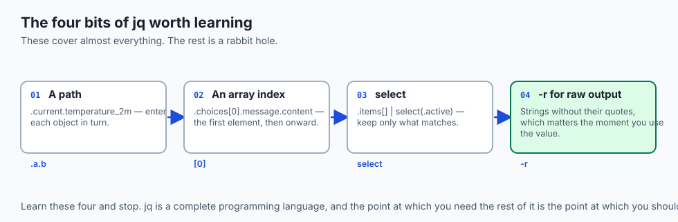

| Tool | Type | Where it fits |
| --- | --- | --- |
| `curl` + `jq` | Free, ubiquitous | Exploring, debugging, and plenty of real automation |
| `httpie` | Free, open source | Exploring by hand, with better ergonomics |
| `python3` + `requests` | Free, open source | The moment you need logic, retries or tests |
| `python3 -m json.tool` | Free, built in | Pretty-printing with nothing installed |
| Official SDKs | Usually free | Production use of a specific service |
| Postman / Insomnia | Free tiers | Saved collections and team sharing |

- **Learn `jq`'s basics and stop there.** Paths, `select`, and `-r` cover almost
  everything; the rest of the language is a rabbit hole.
- **The moment you write your second `if`, move to Python.** That is the signal, and
  it is reliable.

---

## Comparison with related concepts

| Term | What it actually is |
| --- | --- |
| **Query string** | `?name=value&name=value` appended to a path |
| **`-s`** | Silent: suppress curl's progress meter |
| **`jq` path** | A route into nested JSON, read left to right |
| **`-r`** | Raw output: strings without their quotes |
| **Exit code** | How your script knows whether the call worked |
| **Pipeline** | Day 10's idea, applied to an API response |

---

## When to use it — and when not to


- **Use the command line first, always.** Confirm the endpoint works before writing
  any code around it.
- **Keep it a one-liner while it fits on one line** and needs no branching.
- **Promote it to a script** when you want it repeatable, scheduled, or shared.
- **Promote it to a program** at the first of three signals: you need a data
  structure, you need to catch an error and continue, or you want a test.
- **Do not build a large client in shell.** Day 12's boundary applies here exactly.
- **Do not parse without checking the status.** It is one flag and it prevents the
  most confusing class of failure.
- **Do not leave a loop running unattended** without a cap on iterations.

---

## The AI connection

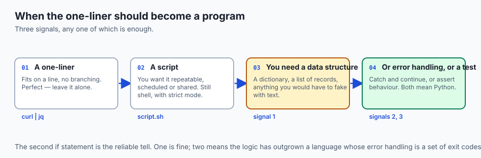

- **Every provider's quickstart is a `curl` command**, and running it is the fastest
  way to confirm your key works before any code exists.
- **A failing SDK call, reproduced in `curl`, tells you immediately** whether the
  problem is the request or the library.
- **`jq` reads a model response cleanly** — `.choices[0].message.content` or the
  equivalent — which is how you check output without a program.
- **Streaming is visible from the command line**, arriving in chunks, which makes the
  mechanism concrete.
- **Token counts come back in the response**, and extracting them with `jq` is how you
  measure cost per call before scaling anything up.

---

## Knowledge check

```yaml
quiz:
  question: "A pipeline that fetches JSON and extracts a field with `jq` starts printing parse errors. The endpoint works in a browser. What should you check first?"
  options:
    - "The HTTP status code, since an error response body is often HTML rather than JSON"
    - "The jq path, since the response structure has probably changed"
    - "The shell quoting on the URL, since & would background the command"
    - "The Content-Type header, since jq requires it to be set correctly"
  answer_index: 0
  explanation: "jq is being handed something that is not JSON, and the usual reason is that the request failed — a 429, a 500, or an authentication error whose body is an HTML page. Checking the status before parsing turns a baffling parse error into a clear one."
```

---

## Hands-on exercise

Build the client one stage at a time, adding error handling as you go. Worked
through fully in the Day 28 lab directory.

| What you are doing | Command |
| --- | --- |
| Fetch and look | `curl -s "$URL"` |
| Pretty-print it | `curl -s "$URL" \| python3 -m json.tool` |
| Extract one field | `curl -s "$URL" \| jq '.current.temperature_2m'` |
| Strip the quotes | `curl -s "$URL" \| jq -r '.current.time'` |
| Capture the status too | `curl -s -w '\n%{http_code}' "$URL"` |
| Fail on an error status | `curl -sf "$URL" \|\| echo "request failed"` |
| Present it | `printf '%s°C, wind %s km/h\n' "$t" "$w"` |

### Expected output

```text
29.5
2026-07-12T12:30
200
request failed
29.5°C, wind 16.9 km/h
```

- **`-r` removed the quotes**, which matters the moment you put the value in a string.
- **`-f` makes curl exit non-zero on an error status**, which is how the shell learns
  the call failed.

### Validate your work

- [ ] You read the API's documentation and identified all four contract questions
- [ ] You ran their example unchanged before altering anything
- [ ] You extracted two fields at different depths
- [ ] Your script fails loudly on a bad status rather than parsing an error page
- [ ] Your script produces a clean, readable line as its output
- [ ] `bash tests/run_tests.sh` reports 0 failures

### Troubleshooting

- **Only part of the URL is fetched.** The shell split it at `&`. Quote the whole URL.
- **`jq` returns `null`.** The path is wrong. Pretty-print the response and read the
  actual nesting.
- **`jq: command not found`.** Use `python3 -m json.tool` to inspect, and a short
  Python one-liner to extract.
- **The value comes out with quotes around it.** Add `-r`.
- **The script keeps going after a failure.** Add `-f` to curl and `set -euo pipefail`
  to the script.

### Common mistakes

- **Parsing before checking the status.**
- **Unquoted URLs**, which the shell rearranges for you.
- **A key in the URL**, which then lives in your shell history.
- **Building the whole script before testing any stage of it.**

---

## Practice assignment

- **Pick a public API you have never used** and get one successful call within ten
  minutes, using only its documentation.
- **Build a three-field report** from its response, with error handling on every
  stage.
- **Break it deliberately** four ways — bad URL, bad parameter, no network, wrong `jq`
  path — and confirm each produces a distinct, clear message.
- **Schedule it** with cron and confirm it still works with the minimal environment
  from Day 14.

---

## Extension challenge

- **Rewrite your shell client in Python** and compare the two side by side. Note
  exactly which lines got simpler and which got longer — that comparison is the
  judgement this lesson is really teaching.
- **Add retry with backoff** from yesterday's lesson, and prove it does not retry a
  `4xx`.
- **Chain two APIs**, using a value from the first as a parameter to the second, and
  handle the case where the first returns nothing.
- **Measure the connection cost.** Time twenty separate `curl` calls against twenty
  requests over one reused connection in Python. The ratio is the argument for
  graduating.

---

