## Why this matters

- **Every AI project is an experiment log**, and version control is what makes an
  experiment reproducible rather than remembered.

- **"It worked last Tuesday" is only a claim** if you cannot check out last Tuesday.
- **Every model, dataset and framework you will use lives in a repository**, and
  reading their history is how you find out what changed and why.

- **Collaboration without it is file names with dates on them**, and that scales to
  about one person.

- **This is Week 5**, and it is the last foundational skill before the tools week.

---

## The idea in plain language

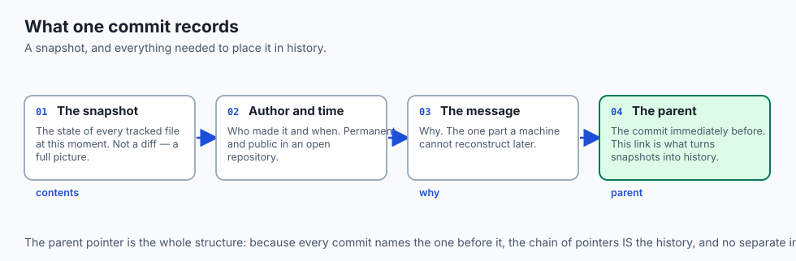

- **Version control records the history of a project**, not just its current state.
- **Each save is a snapshot** with an author, a time, a message, and a link to the one
  before it.

- **Because each snapshot names its parent, the history is a graph** — a straight
  chain when work is linear, a splitting shape when it is not.

- **Nothing is erased.** Undoing is a new step that restores old content, so the
  record of what happened stays honest.

- **Branching lets work happen in parallel** and be joined back deliberately.

---

## Historical background

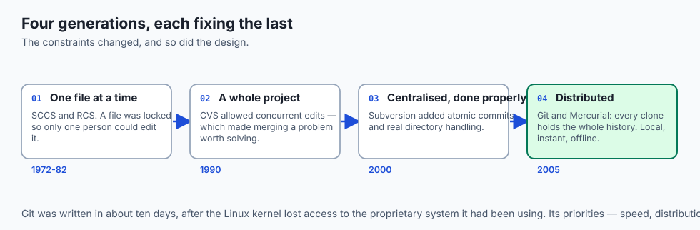

- **The first systems tracked one file at a time.** SCCS in 1972, then RCS in 1982,
  locked a file so only one person could edit it.

- **CVS, 1990, tracked a whole project** and allowed concurrent edits, which meant
  merging became a problem worth solving.

- **Subversion, 2000, fixed CVS's worst flaws** — atomic commits, proper directory
  handling — and became the centralised standard.

- **Git arrived in 2005 out of necessity.** The Linux kernel lost access to the
  proprietary system it had been using, and Linus Torvalds wrote a replacement in
  about ten days.

- **His priorities shaped everything about it**: speed, distribution, and a history
  that could not be quietly altered.

- **Mercurial began the same month**, with similar goals and a gentler interface. Git
  won on ecosystem rather than on design.

---

## What it is — and what it is not

**It is:**

- A database of snapshots, alongside your working files.
- A record of who changed what, when, and — through commit messages — why.
- A tool for parallel work, and for reconciling it afterwards.

**It is not:**

- **Not a backup.** It protects against your mistakes, not against your disk failing,
  unless a copy lives elsewhere.

- **Not a file-syncing service.** Cloud drives resolve conflicts by guessing; version
  control makes you decide.

- **Not only for code.** Anything text-based benefits: configuration, documentation,
  prompts, notebooks.

- **Not good at large binaries.** A repository stores every version of every file, and
  binaries do not compress against each other.

---

## Why it was created and what problems it solves

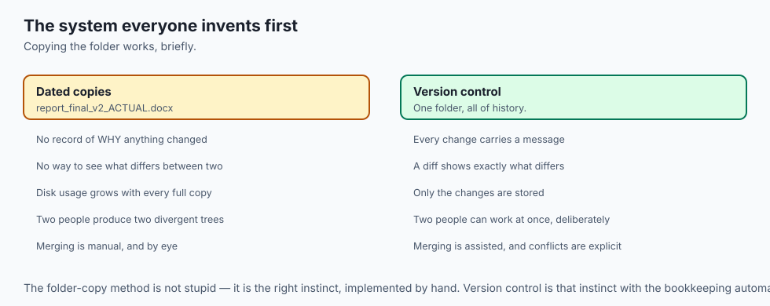

- **Fear of changing things.** Without a way back, every edit carries risk, and people
  stop trying things.

- **Losing work.** Overwriting a good version with a bad one is the oldest mistake in
  computing.

- **"Who changed this, and why?"** Blame in the neutral sense: attribution is what
  makes a codebase legible years later.

- **Parallel work.** Two people editing the same project need a way to combine their
  changes rather than take turns.

- **Reproducibility.** A result you cannot rebuild from a known state is a result you
  cannot defend.

---

## How it works

### The repository and the working directory

- **The repository is a hidden database** — usually a `.git` folder beside your
  project — holding the entire history.

- **The working directory is what you see and edit**: one checked-out snapshot.
- **Staging is telling the system which changes to include** in the next snapshot.
- **Committing writes that snapshot** into the repository permanently.
- **Each commit stores the tracked files plus metadata**: author, timestamp, message,
  and a pointer to its **parent**.

### The history is a graph

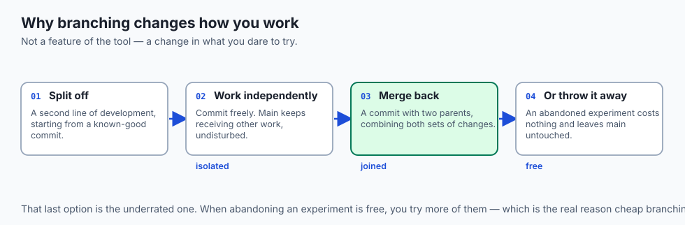


- **Each circle is a commit** — a full labelled snapshot — and the arrows point back to
  parents. The line *is* the history.

- **The lower track is the main line** of development.
- **A branch splits off**: a second track where a feature is built in isolation, while
  main continues to receive other work.

- **A merge commit joins them back**, combining both sets of changes.
- **HEAD marks the commit you are currently looking at.** Moving it to an earlier
  commit is exactly the time-machine trip.

- **Nothing is erased**, including abandoned branches, unless you deliberately discard
  them.

### Two operations that make history useful

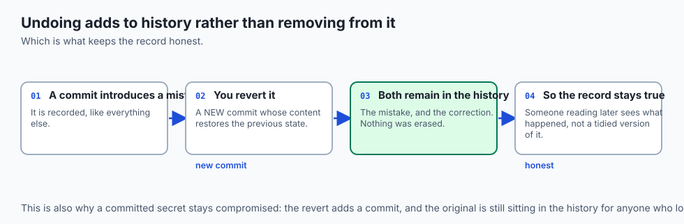

- **A diff compares two commits** and reports the precise lines that changed, file by
  file. That is how you answer "what changed?" without reading whole files.

- **Reverting brings back earlier content**, either by checking out an old snapshot to
  look at it, or by making a new commit that undoes a previous one.

- **Reverting is itself recorded.** You do not travel back and erase the intervening
  commits; you add a step that restores the old content, so the record stays honest.

### Centralised and distributed

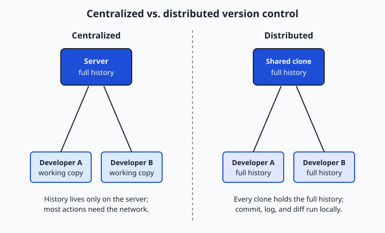

- **In a centralised system**, one repository on a server holds the authoritative
  history. Each developer keeps only a working copy, and must contact the server to
  commit, view history, or branch.

- **In a distributed system**, every developer clones the *entire repository* — all
  commits, all history — onto their own machine.

- **So committing, branching, viewing history and diffing are all local and instant**,
  and the network is needed only to share.

- **This is not a small tweak.** It changes what you can do offline, how fast everyday
  operations feel, and how resilient the project is to any single machine failing.

---

## An everyday analogy

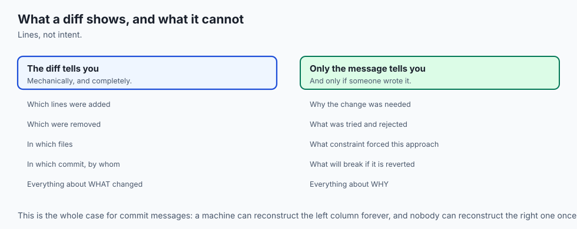

A manuscript with every draft kept.

| The manuscript | Version control |
| --- | --- |
| Each dated draft, filed | A commit |
| A note on why you changed it | The commit message |
| Comparing two drafts side by side | A diff |
| Drafting an alternative ending separately | A branch |
| Folding that ending into the main text | A merge |
| The draft you are working from | HEAD |
| Every author keeping the whole archive | Distributed |

- **You never write over the previous draft.** You write a new one, and keep both.
- **"Changed the ending because the pacing dragged"** is worth more in six months than
  the change itself.

- **If only the publisher held the archive**, you could not work on a train. That is
  the centralised model.

---

## Examples in practice

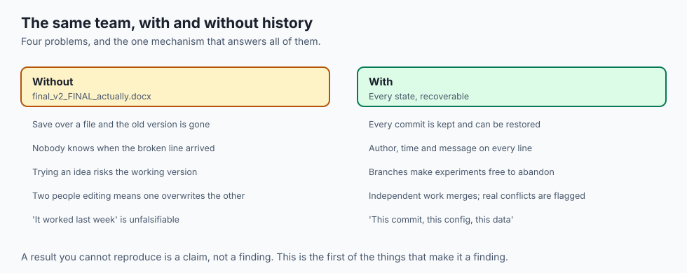

- **`report_final_v2_ACTUAL_final.docx`** — the folk version-control system everyone
  invents, and it does not scale past one person.

- **A bug introduced three weeks ago**, found by comparing two commits rather than by
  reading the whole file.

- **A refactor abandoned halfway** and discarded cleanly, because it happened on a
  branch.

- **A model result nobody can reproduce**, because the code that produced it was
  edited afterwards and never committed.

- **A key committed in March and revoked in October**, still readable in the history
  the whole time.

---

## Implications: security, privacy, performance, scalability, and cost

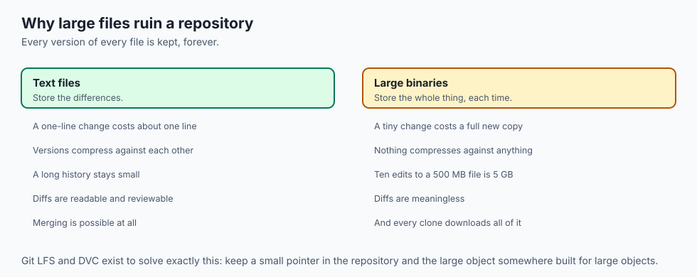

- **Security: history is tamper-evident, not private.** Anyone with the repository has
  every version of every file ever committed.

- **A secret committed once is in the history forever.** Deleting it in a later commit
  removes it from the current files and from nothing else — which is why Day 25's
  answer was revocation.

- **Privacy: commits carry your name and email**, and they are permanent and public in
  an open repository.

- **Performance: distributed operations are local and instant.** History, diffs and
  branches cost nothing, which is what makes branching cheap enough to do casually.

- **Scalability: repositories degrade with large binary files**, because every version
  is stored and binaries do not delta well.

- **Cost: the expensive failure is not using it.** Reconstructing lost work, or an
  unreproducible result, costs far more than the discipline ever does.

---

## Alternatives: free, open source, and commercial

| Tool | Type | Where it fits |
| --- | --- | --- |
| Git | Free, open source | The default, everywhere, for almost everything |
| Mercurial | Free, open source | Similar model, gentler interface, much smaller ecosystem |
| Subversion | Free, open source | Centralised; still found in long-lived enterprise projects |
| Git LFS | Free, open source | Large binaries stored outside the repository |
| DVC | Free, open source | Datasets and model artifacts, versioned alongside code |
| Cloud drives | Commercial | Syncing, not versioning — they resolve conflicts by guessing |

- **Learn Git.** Not because it is the best-designed, but because it is what every
  project, every platform and every colleague uses.

- **Reach for DVC or LFS when the data is large.** Putting a 5 GB dataset in Git
  works exactly once and then makes every clone painful.

---

## Comparison with related concepts

| Term | What it actually is |
| --- | --- |
| **Repository** | The database holding the full history |
| **Working directory** | The checked-out files you edit |
| **Commit** | One snapshot, with author, message and parent |
| **Diff** | The lines that differ between two states |
| **Branch** | A separate line of development |
| **Merge** | Joining two lines back together |
| **HEAD** | A pointer to the commit you are on |

---

## When to use it — and when not to

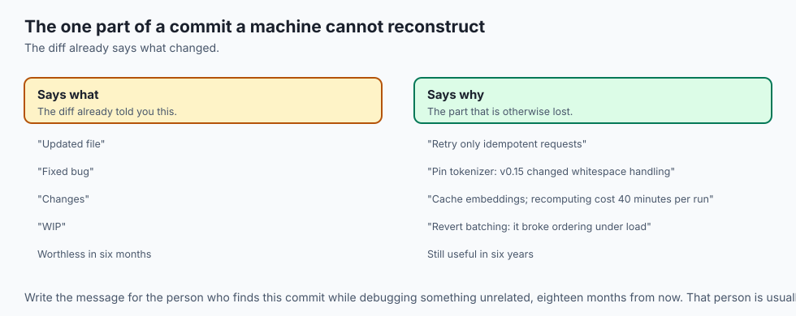

- **Use it from the first file**, not once the project is "real". Initialising later
  loses the history you most want.

- **Use it for anything text-based** — code, configuration, documentation, prompts,
  analysis notes.

- **Commit at logical points**, not on a timer. A commit should be one coherent change
  you could describe in a sentence.

- **Do not commit secrets.** Ignore them before the first commit, because afterwards
  is too late.

- **Do not commit large binaries** into the repository itself. Use LFS or DVC.
- **Do not use it as your only backup.** A repository that exists on one disk is one
  disk failure from gone.

---

## The AI connection

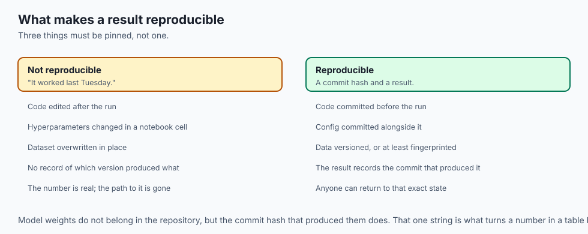

- **An experiment is code plus data plus configuration**, and a result is only
  reproducible if all three are pinned to a known state.

- **Commit the config with the code.** A hyperparameter changed and not recorded is a
  result you cannot explain.

- **Model weights do not belong in Git**, but the code that produced them does, along
  with the commit hash that identifies it.

- **Every framework you use is a public repository**, and reading its history is often
  the fastest way to understand why an API behaves as it does.

- **Prompts are text and deserve version control.** Treating them as ephemeral is how
  a working prompt becomes an unreproducible one.

---

## Knowledge check

```yaml
quiz:
  question: "A developer removes an accidentally committed API key in a new commit and pushes. Why is the key still considered compromised?"
  options:
    - "Every previous commit remains in the history, so the key is still readable in the repository"
    - "The new commit only removes the file from the working directory, not from disk"
    - "Git stores credentials separately from file contents and does not remove them"
    - "The removal commit cannot be pushed until the original commit is amended"
  answer_index: 0
  explanation: "Version control keeps every snapshot. The later commit changes what the current checkout contains and does nothing to the earlier commits, where the key is still present and readable by anyone with the repository — which is why the response to exposure is revocation, not deletion."
```

---

## Hands-on exercise

Build a small history, then read it. Worked through fully in the Day 29 lab
directory.

| What you are doing | Command |
| --- | --- |
| Start a repository | `git init` |
| Record a first snapshot | `git add . && git commit -m "First version"` |
| Make a change and record it | edit, then `git add` and `git commit` |
| Read the history | `git log --oneline` |
| See what changed between two commits | `git diff HEAD~1 HEAD` |
| Visit an earlier snapshot | `git checkout HEAD~1` then `git switch -` |
| See the graph | `git log --oneline --graph --all` |

### Expected output

```text
712412c Add error handling
9c1f0a3 First version
diff --git a/main.py b/main.py
+    if not response.ok:
+        raise SystemExit("request failed")
```

- **Two commits, newest first**, each with a short hash and your message.
- **The diff shows only the changed lines**, which is how you read a change without
  reading a file.

### Validate your work

- [ ] You created a repository and made at least three commits
- [ ] You wrote messages that say *why*, not *what*
- [ ] You read a diff between two commits and can describe the change from it alone
- [ ] You visited an earlier commit and returned safely
- [ ] You can explain why an earlier commit is not erased by a later one
- [ ] `bash tests/run_tests.sh` reports 0 failures

### Troubleshooting

- **`git commit` complains about identity.** Set `user.name` and `user.email` for this
  repository, or globally.

- **"nothing to commit".** You edited files but did not `git add` them.
- **`checkout HEAD~1` warns about a detached HEAD.** That is expected — you are
  looking at a commit rather than standing on a branch. `git switch -` returns.

- **`git log` opens a pager you cannot leave.** Press `q`, exactly as with `man`.

### Common mistakes

- **Initialising the repository "once the project is real"**, and losing the history
  that mattered most.

- **Commit messages that restate the diff.** "Updated file" says nothing the diff does
  not.

- **Committing everything at once** at the end of a day, so no commit is a coherent
  change.

- **Committing a secret**, then deleting it in the next commit and considering it
  handled.

---

## Practice assignment

- **Take a project you already have** and put it under version control, with a
  sensible `.gitignore` written before the first commit.

- **Write ten commits over a real piece of work**, each one a change you can describe
  in a sentence.

- **Read the history of a project you did not write** and find the commit that
  introduced a feature you use.

- **Deliberately break something, then recover it** from an earlier commit — and note
  that the breaking commit is still in the history afterwards.

---

## Extension challenge

- **Find a bug by bisecting.** Take a repository where something broke, and use
  `git bisect` to find the commit that introduced it. It is a binary search over
  history, and it feels like magic the first time.

- **Read a real project's history for one file** with `git log --follow`, and see how a
  design arrived where it did.

- **Compare a centralised workflow with a distributed one** by working offline for an
  hour: commit, branch, diff and read history with no network at all.

- **Measure the cost of a binary.** Commit a large image ten times with small changes,
  and watch the repository size grow by ten times the image rather than by the
  differences.

---

