## Why this matters

- **Git is the tool, and today is the model.** Three areas and two commands explain
  almost everything you will ever do with it.
- **`git status` is the command you will type most in your career**, and it is only
  useful once you know what the three areas are.
- **Committing a secret is the mistake with no clean undo**, and `.gitignore` is the
  thing that prevents it.
- **A commit hash is what makes a result citable.** "Run at `712412c`" is a claim
  anyone can check.
- **Most Git confusion is not knowing which area a change is in.** After today, you
  will.

---

## The idea in plain language

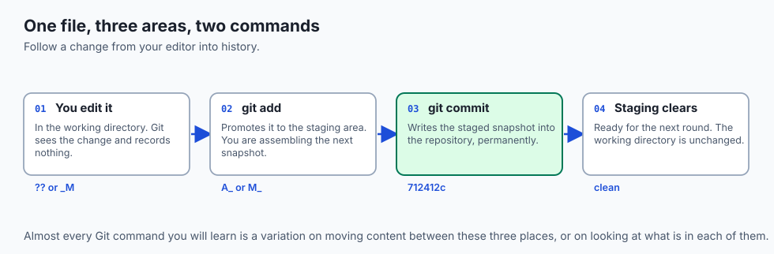

- **A Git project has three areas**, and almost everything is moving content between
  them.
- **The working directory is the files on disk** you are editing right now.
- **The staging area is the set of changes you have chosen** for the next commit.
- **The repository is the permanent history** of everything committed.
- **`git add` promotes; `git commit` records.** Two commands, three areas — that is the
  entire engine.

---

## Historical background

- **Git was written in 2005 for the Linux kernel**, in about ten days, after the
  project lost access to the proprietary system it had been using.
- **Its design priorities were unusual**: speed on an enormous codebase, full
  distribution, and a history nobody could quietly rewrite.
- **The staging area was a genuine innovation** and remains slightly controversial —
  most systems commit directly from the working directory.
- **It exists because commits should be coherent**, not merely chronological. Staging
  lets you assemble a change from part of your work.
- **Content addressing came from the same instinct.** A commit is named by a hash of
  its own content, so any alteration is detectable.
- **The interface was widely criticised for a decade**, and improved slowly —
  `git switch` and `git restore` arrived in 2019 to split the overloaded `checkout`.

---

## What it is — and what it is not

**A commit is:**

- A full snapshot of every tracked file, not a diff.
- Wrapped in metadata: author, time, message, and the parent's hash.
- Named by a hash computed from all of that together.

**It is not:**

- **Not a diff**, even though Git shows you diffs. Internally it stores snapshots and
  computes differences on demand.
- **Not editable.** Changing anything about a past commit produces a different hash,
  and therefore a different commit.
- **Not private.** Everything committed is in the history for anyone with the
  repository.
- **Not automatic.** Git records what you stage, and nothing else — which is the point
  of staging.

---

## Why it was created and what problems it solves

- **Coherent commits.** Staging lets you commit the bug fix without the unrelated
  experiment you also have open.
- **Reviewing before recording.** `git diff --staged` shows exactly what you are about
  to commit, while there is still time to change it.
- **Tamper-evidence.** Because a hash covers the content, the metadata *and* the
  parent, altering any past commit changes every hash after it.
- **Speed.** Everything is local, so history, diffs and branches are instant.
- **Keeping the wrong things out.** `.gitignore` is how build outputs, dependencies
  and secrets stay out of a permanent record.

---

## How it works

### The three areas


| Area | What lives there | How content arrives |
| --- | --- | --- |
| Working directory | The real files on disk you edit | You edit them, with any editor |
| Staging area (index) | The exact changes for the next commit | `git add <file>` |
| Repository (`.git`) | The permanent, ordered history | `git commit` |

- **Read it left to right.** Edit, `add` to assemble precisely the snapshot you intend,
  `commit` to record it permanently.
- **Committing clears the staging area** for the next round.

### Reading state with git status

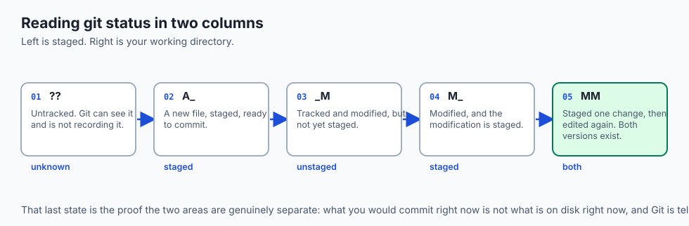

`git status --short` prints two columns per file. **Left is the staging area; right
is the working directory.**

- **`??`** — untracked: Git sees it and is not recording it.
- **`A `** — a new file, staged, ready to commit.
- **` M`** — tracked and modified, but not staged.
- **`M `** — modified, and the modification is staged.
- **`MM`** — staged one change, then edited again. Proof the two areas are genuinely
  separate.

### What a commit really is

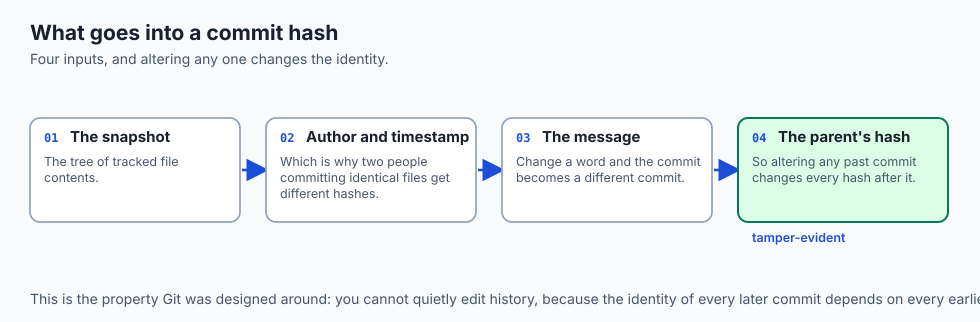


- **Git stores a snapshot** of every tracked file, wrapped in a small commit object.
- **That object holds** a reference to the snapshot, the author and time, your message,
  and the hash of the **parent**.
- **Git hashes all of it together** to produce the commit's own identifier — 40
  hexadecimal characters, of which you usually see the first seven.
- **Because each commit names its parent**, commits form a chain back to the first,
  which has no parent.
- **Because the hash covers the snapshot, the parent and the metadata**, you cannot
  alter a past commit without changing its hash and every hash after it. The history
  is tamper-evident by construction.
- **HEAD points to the commit you are on**, and advances when you commit.
- **Two people committing identical file contents still get different hashes**, because
  author, timestamp and parent all feed the fingerprint.

### Ignoring files with .gitignore

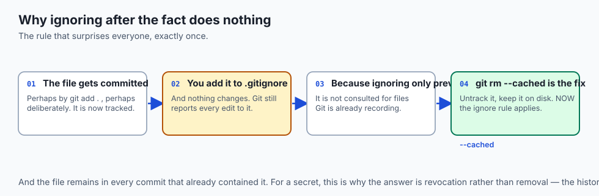

- **Not everything in a folder belongs in history**: build outputs, downloaded
  dependencies, editor temporary files, and above all secrets.
- **`.gitignore` lists patterns Git should not track.** `secret.key` ignores that file;
  `*.log` ignores every file ending in `.log`.
- **Ignored files never appear in `git status`** as candidates, so you cannot add them
  by accident.
- **The caveat that catches everyone**: `.gitignore` only affects files Git is *not
  already tracking*. Commit a secret first and the ignore rule changes nothing until
  you explicitly untrack it.

### Seeing changes and history

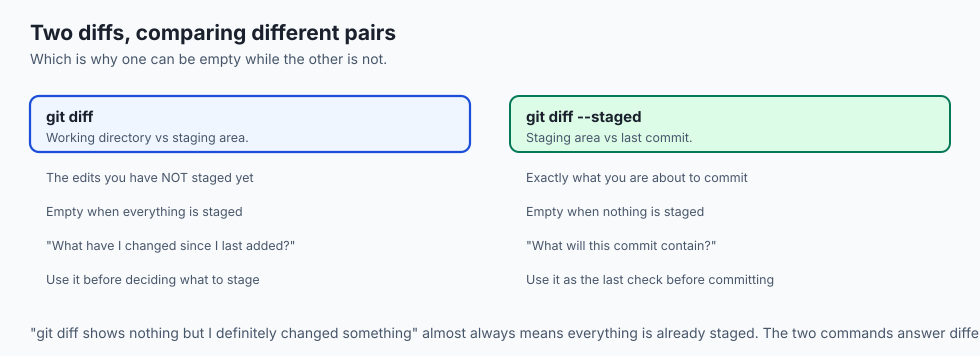

- **`git diff`** with no arguments compares the **working directory against the
  staging area** — the edits you have not staged.
- **`git diff --staged`** compares the **staging area against the last commit** — what
  you are about to commit.
- **`git log`** walks the chain backward from HEAD, printing hash, author, date and
  message.
- **`git log --oneline`** condenses each to a line, and is the fastest way to read
  history.
- **Together, `status`, `diff` and `log` answer** where everything is, what changed,
  and how you got here.

---

## An everyday analogy

Packing a parcel.

| Packing | Git |
| --- | --- |
| Things scattered on your desk | The working directory |
| The open box you are filling | The staging area |
| Sealed, labelled, on the shelf | A commit in the repository |
| Choosing what goes in the box | `git add` |
| Sealing and labelling it | `git commit` |
| The label saying why you sent it | The commit message |
| Things you deliberately never pack | `.gitignore` |

- **The open box is the point.** You choose what goes in, rather than sweeping the
  whole desk into it.
- **Once sealed and shelved, you do not reopen it.** You send a second parcel.
- **Some things on the desk should never be posted at all**, and deciding that in
  advance is cheaper than retrieving a parcel.

---

## Examples in practice

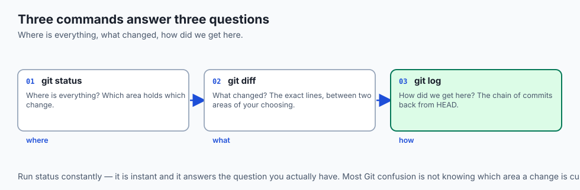

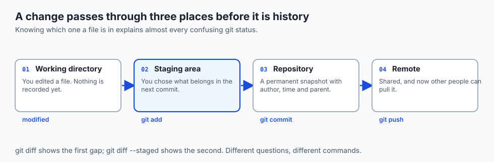

- **`MM` in `git status --short`**: you staged a change and then kept editing. Both
  versions exist, in different areas.
- **`git diff` showing nothing** while `git diff --staged` shows plenty: everything is
  already staged.
- **A `.gitignore` added after the fact**, with the ignored file still tracked, because
  ignoring does not untrack.
- **A commit hash in a paper or a log**, identifying exactly the code that produced a
  result.
- **A commit containing a bug fix *and* an unrelated refactor**, which is what staging
  exists to prevent.

---

## Implications: security, privacy, performance, scalability, and cost

- **Security: `.gitignore` before the first commit.** Adding it afterwards leaves the
  file tracked and the secret in history.
- **A committed secret is compromised**, and rewriting history to remove it is
  disruptive and unreliable. Revoke it — Day 25's rule.
- **Privacy: your name and email are in every commit**, permanently, and publicly in an
  open repository.
- **Performance: everything is local**, so `log`, `diff` and `status` are instant
  regardless of history length.
- **`git status` slows on very large working directories**, which is the main scaling
  limit you will meet in practice.
- **Cost: a repository grows with every version of every file.** Text is cheap;
  binaries are not, and a large file committed once is in the history forever.

---

## Alternatives: free, open source, and commercial

| Tool | Type | Where it fits |
| --- | --- | --- |
| `git` on the command line | Free, open source | The reference. Learn this first. |
| `lazygit`, `tig` | Free, open source | Terminal interfaces that make staging visual |
| Editor integration | Bundled | Staging individual lines is genuinely easier with a mouse |
| GitHub Desktop, Sourcetree | Free | Friendlier, at the cost of hiding the model |
| `git add -p` | Free, built in | Staging change by change, from the terminal |
| `pre-commit` | Free, open source | Running checks — including secret scanning — before a commit lands |

- **Learn the command line first.** A graphical tool that hides the three areas makes
  the confusing cases more confusing, not less.
- **Then use whatever is fastest.** Staging individual lines is one job a good
  interface does better than the terminal.

---

## Comparison with related concepts

| Term | What it actually is |
| --- | --- |
| **Working directory** | The files on disk you edit |
| **Staging area / index** | The assembled contents of the next commit |
| **Repository** | The `.git` database of all history |
| **Commit** | One recorded snapshot plus its metadata |
| **Hash** | The commit's identifier, computed from its content |
| **HEAD** | A pointer to the commit you are currently on |
| **Tracked** | A file Git is recording changes to |

---

## When to use it — and when not to

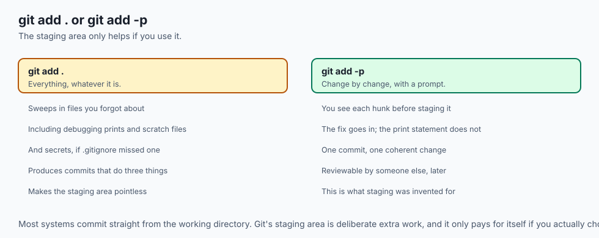

- **Run `git status` constantly.** It is cheap and it answers the question you
  actually have.
- **Stage deliberately.** `git add -p` lets you commit the fix without the debugging
  print statements.
- **Commit one coherent change at a time**, with a message that says why.
- **Write `.gitignore` before the first commit**, not after.
- **Do not use `git add .` reflexively.** It is how unwanted files and secrets get in.
- **Do not commit large binaries** into the repository. Use LFS or DVC.
- **Do not amend or rewrite commits you have shared.** That is Day 34's subject, and
  it has real consequences.

---

## The AI connection

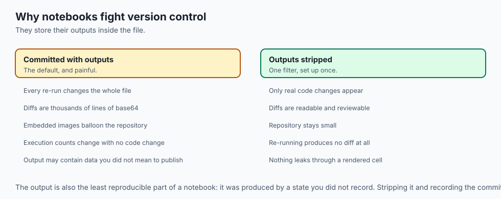

- **`.gitignore` should exclude your data and model directories** from the start.
  Datasets and weights do not belong in a repository.
- **It should also exclude `.env`, notebook checkpoints and cache directories**, all of
  which fill quietly and none of which belong in history.
- **Notebooks are a genuine problem.** They store outputs inline, so every run produces
  a huge diff — which is why tools exist to strip outputs before committing.
- **Commit the config alongside the code.** A hyperparameter changed and uncommitted is
  a result you cannot explain.
- **Record the commit hash with every experiment result.** It is the single string that
  turns a number in a table back into something reproducible.

---

## Knowledge check

```yaml
quiz:
  question: "A developer adds `.env` to `.gitignore`, but `git status` still shows it as modified. Why?"
  options:
    - "The file was already tracked, and .gitignore only affects files Git is not tracking"
    - "The .gitignore file must be committed before its rules take effect"
    - "The pattern needs a leading slash to match a file at the repository root"
    - "Ignore rules apply only to the staging area, not the working directory"
  answer_index: 0
  explanation: "Ignoring prevents Git from starting to track a file. Once a file is tracked — because it was committed at some point — Git keeps reporting changes to it, and the ignore rule is simply not consulted until the file is explicitly untracked."
```

---

## Hands-on exercise

Watch one file travel through all three areas. Worked through fully in the Day 30
lab directory.

| What you are doing | Command |
| --- | --- |
| Start and check state | `git init` then `git status -s` |
| Ignore before committing | `echo ".env" > .gitignore` |
| Create a file and see it untracked | `touch main.py` then `git status -s` |
| Stage it | `git add main.py` then `git status -s` |
| Edit again after staging | edit, then `git status -s` |
| See both diffs | `git diff` and `git diff --staged` |
| Commit and read the history | `git commit -m "..."` then `git log --oneline` |

### Expected output

```text
?? main.py
A  main.py
AM main.py
712412c Add request handler with error checking
```

- **`??` then `A ` then `AM`** — the same file, in three different states, over three
  commands.
- **`AM` means staged and then edited again**, which is the clearest proof that the
  areas are separate.

### Validate your work

- [ ] You produced `??`, `A `, ` M` and `AM` states and can explain each
- [ ] You saw `git diff` and `git diff --staged` show different things at the same time
- [ ] You wrote `.gitignore` before your first commit
- [ ] You can read a commit hash and say what it is computed from
- [ ] You used `git add -p` to stage part of a file
- [ ] `bash tests/run_tests.sh` reports 0 failures

### Troubleshooting

- **`git status` shows a file you ignored.** It was already tracked. Untrack it with
  `git rm --cached`.
- **`git diff` shows nothing but you have changes.** They are staged. Use
  `--staged`.
- **Your commit includes files you did not want.** `git add .` swept them in. Stage by
  name, or use `-p`.
- **Git asks who you are.** Set `user.name` and `user.email`.

### Common mistakes

- **`git add .` without looking at `git status` first.**
- **Adding `.gitignore` after the first commit**, and assuming that handles it.
- **One enormous commit** containing three unrelated changes.
- **Committing notebook outputs**, producing diffs nobody can read.

---

## Practice assignment

- **Stage three unrelated edits separately** with `git add -p`, and make three commits
  from one working session.
- **Write a `.gitignore` for a Python AI project** from scratch, and justify every
  line.
- **Deliberately track a file you meant to ignore**, then untrack it, and observe what
  remains in the history.
- **Read `git log --oneline` for a project you did not write** and identify three
  commits whose messages actually helped.

---

## Extension challenge

- **Find a commit's own hash inputs.** Use `git cat-file -p HEAD` to print the raw
  commit object, and identify the tree, the parent and the metadata that produced its
  hash.
- **Prove the history is tamper-evident.** Amend an old commit and observe that every
  subsequent hash changes.
- **Set up `pre-commit` with a secret scanner**, and confirm it blocks a commit
  containing a key-shaped string.
- **Strip notebook outputs automatically** with a filter, and compare the diff of a
  re-run notebook before and after.

---

